# System Design Interview Guide

A **free, original** curriculum for system design interview prep — foundations, a repeatable approach, 14 full design walkthroughs, and timed practice. Everything lives in this single README (Mermaid diagrams render natively on GitHub).

> **Disclaimer:** This is a free original curriculum for interview practice. **Not affiliated** with DesignGurus, Educative, ByteByteGo, or any paid course. Industry-standard concepts in original wording. Product names in design titles (e.g. “Instagram-like”) are familiar problem frames only.

## How to use this guide

1. Start with **[Getting Started](#getting-started)** — especially pitfalls and level expectations.
2. Work through **[Foundations](#foundations)**; answer self-checks out loud.
3. Internalize the **[Interview Approach](#interview-approach)** template; use it on every design.
4. Study **[Design Walkthroughs](#design-walkthroughs)** in order: URL shortener → rate limiter → news feed → chat → then domain-specific ones.
5. Run **[Practice](#practice)** under a timer; score yourself with the mock rubric.

### Study paths by level

| Path | Focus | Suggested order |
|------|--------|-----------------|
| **Junior** | Building blocks + simple HLD | Getting Started → Foundations (LB, cache, DB, queue, CDN) → Approach → URL shortener, rate limiter, typeahead → timed drills |
| **Mid** | Full loop + consistency & failures | All Foundations → Approach → core designs (feed, chat, notifications, Instagram) → Practice with rubric |
| **Senior** | SLOs, multi-region, ops, cost | Foundations deep dives (CAP, coordination, delivery) → Approach failures → hard designs (Uber, video, Dropbox, payments) → mocks every other day |

See [Study plan](#study-plan) for 2 / 4 / 8 week schedules and [Level expectations](#level-expectations) for self-calibration.

---

## Table of Contents

### 0. Getting Started


- [How interviews work](#how-interviews-work)
- [Level expectations](#level-expectations)
- [Prerequisites](#prerequisites)
- [Study plan](#study-plan)
- [Common pitfalls](#common-pitfalls)

### 1. Foundations


- [System characteristics](#system-characteristics)
- [Networking basics](#networking-basics)
- [Load balancing](#load-balancing)
- [API gateway](#api-gateway)
- [Rate limiting](#rate-limiting)
- [Caching & CDN](#caching--cdn)
- [Databases](#databases)
- [Indexes](#indexes)
- [Sharding](#sharding)
- [Replication](#replication)
- [CAP & PACELC](#cap--pacelc)
- [Messaging](#messaging)
- [Delivery guarantees](#delivery-guarantees)
- [Coordination](#coordination)
- [Security](#security)

### 2. Interview Approach


- [Clarify requirements](#clarify-requirements)
- [Capacity estimation](#capacity-estimation)
- [Design template](#design-template)
- [Deep dive & failures](#deep-dive--failures)
- [Tradeoffs cheatsheet](#tradeoffs-cheatsheet)

### 3. Design Walkthroughs


- [URL shortener](#url-shortener)
- [Rate limiter](#rate-limiter)
- [Notification system](#notification-system)
- [News feed](#news-feed)
- [Chat & messaging](#chat--messaging)
- [Instagram-like](#instagram-like)
- [Uber-like](#uber-like)
- [Video streaming](#video-streaming)
- [Dropbox-like](#dropbox-like)
- [Web crawler](#web-crawler)
- [Typeahead](#typeahead)
- [Search](#search)
- [Ticket booking](#ticket-booking)
- [Payments](#payments)

### 4. Practice


- [Timed drill](#timed-drill)
- [Practice prompts](#practice-prompts)
- [Self-review](#self-review)
- [Mock rubric](#mock-rubric)

---

## License

MIT — see [LICENSE](LICENSE). Contributions of original content welcome; do not paste copyrighted course material.

---


# Getting Started

## How interviews work

System design interviews evaluate how you reason about large-scale software under ambiguity. Unlike coding rounds, there is rarely a single correct diagram. Interviewers watch *how* you clarify, estimate, structure a solution, and discuss tradeoffs when requirements shift.

### Typical format

Most companies schedule **45–60 minutes**. A common arc:

1. **Prompt** (1–2 min) — “Design a URL shortener” or “Design Uber.”
2. **Clarify** (5–8 min) — functional and non-functional requirements, scope cuts.
3. **Back-of-envelope** (5 min) — QPS, storage, bandwidth; order-of-magnitude only.
4. **High-level design** (10–15 min) — boxes and arrows: clients, APIs, services, data stores, queues.
5. **Deep dive** (15–20 min) — pick 1–2 hotspots (sharding key, feed fan-out, consistency).
6. **Failures & scale** (5–10 min) — what breaks at 10× traffic; single points of failure.
7. **Wrap-up** (2 min) — summarize tradeoffs you accepted.

Senior and staff candidates spend more time on failure modes, multi-region, and operational concerns. Junior candidates are judged more on structure and vocabulary of core building blocks.

### What interviewers actually score

| Signal | Strong | Weak |
|--------|--------|------|
| Clarification | Asks about scale, consistency, clients | Jumps to tech stack |
| Structure | Clear API + data model + HLD | Random components |
| Tradeoffs | Names both sides, picks with reason | “We’ll use Kafka because it’s popular” |
| Depth | Explains *why* a shard key or cache works | Buzzwords only |
| Collaboration | Checks in, adapts to hints | Monologues past the interviewer |

They are not grading whether you memorize a particular company’s architecture. They care that you can **drive a design conversation** like a tech lead.

### Spoken vs drawn

Talk while you draw. Narrate: “I’ll start with write path… then read path…” Use a whiteboard, Excalidraw, or shared doc. Label every arrow with protocol or data shape when it matters (HTTP, gRPC, Kafka topic, SQL).

Keep the diagram **readable**: 6–12 boxes at HLD. Nested detail belongs in the deep dive, not the first sketch.

### Functional vs non-functional

**Functional** — what the product does: shorten URL, return redirect, list feed.

**Non-functional** — how well: latency p99, availability (e.g. 99.9%), consistency model, cost, multi-region, privacy.

Interviewers often care *more* about non-functionals once the happy path exists. Always ask: “What’s more important if we must choose—latency or strong consistency?”

### Collaboration norms

- State assumptions out loud; invite correction.
- When stuck, propose two options and ask which to explore.
- Time-box: if deep dive eats the clock, surface the remaining risks verbally.
- Do not pretend certainty. “I’d validate this with load tests” is mature.

### Common company flavors

- **Product companies** — user-facing features, mobile clients, CDN, personalization.
- **Infrastructure / platform** — multi-tenant APIs, SLOs, quotas, control plane vs data plane.
- **Fintech / health** — correctness, auditability, compliance, idempotency.
- **Ads / marketplace** — auctions, consistency under contention, fraud.

Adapt vocabulary to the domain without inventing fake compliance theater.

### After the interview

Write down what you drew and where you hesitated. Those gaps become your study list. Re-run the same prompt a week later under a timer; improvement is usually obvious.

### Interview tip

Treat the interviewer as a partner, not a judge. Phrase decisions as proposals: “I’d put a write-through cache here—does that match the consistency you care about?”

### Self-check

1. Sketch a 45-minute agenda for “Design a notification system” with minute budgets.
2. List three non-functional questions you always ask before drawing.
3. Explain the difference between a high-level design and a deep dive in one paragraph.

### Sample dialogue (first 8 minutes)

**Interviewer:** Design a URL shortener.

**You:** Before drawing—who creates links, and do we need auth? Rough scale—startup or consumer viral? Is analytics in scope? Prefer low redirect latency or rich click tracking if they conflict?

**Interviewer:** Public create OK; 100M redirects/day; basic click counts; latency matters more than perfect counts.

**You:** Restating: public short links, ~100M redirects/day, eventual click stats OK, redirect p99 should be tight. Out of scope: custom marketing pages. I’ll estimate, then API + schema, then HLD with cache on the read path.

That dialogue shows collaboration, scope cuts, and NFR prioritization—the behaviors interviewers reward.

### Whiteboard hygiene

- Write big; leave a margin for deep-dive notes.
- Number arrows if order matters.
- Erase dead ends instead of cluttering.
- If virtual, duplicate the frame before a risky redraw.

### Signals that you are running out of time

At minute 35 with no failure talk, skip a second deep dive. Summarize remaining risks in bullets: “I didn’t detail multi-region; I’d start with async replica and DNS failover.” Explicit incompleteness beats silent omission.

### Mapping to other rounds

System design complements coding rounds: coding shows implementation detail; design shows decomposition. Behavioral rounds may ask you to recount a design decision—practice articulating tradeoffs from these drills as stories.

### Closing the loop after practice

Each practice interview should produce one artifact: a one-page redraw plus three bullets of what you would improve. Over a month those pages become your personal playbook—original notes beat rereading the same blog.

### Checklist before an onsite loop

- [ ] Redrew one core design from memory today
- [ ] Reviewed personal miss list (idempotency, fan-out, etc.)
- [ ] Slept; scheduled buffer between interviews
- [ ] Prepared questions for them about real scale pain (shows curiosity)

You cannot cram foundations the morning of—rely on the template muscle.


## Level expectations

Companies map system design performance to levels differently, but patterns are stable. Use this as a **self-calibration**, not a guarantee of any employer’s rubric.

### Junior / L3–L4 (new grad to ~2 years)

**Expected**

- Know core building blocks: LB, cache, DB, queue, CDN.
- Produce a simple HLD for a mid-size service (single region, one primary DB).
- Discuss basic tradeoffs: SQL vs NoSQL, cache aside vs write-through.
- Estimate QPS and storage within an order of magnitude.

**Not yet required**

- Multi-region active-active, complex consensus, custom storage engines.
- Owning ambiguous product scope for a platform.

**How interviews feel:** interviewer scaffolds more; may suggest “add a cache here.” Success = clear structure + correct component purposes.

### Mid / L4–L5 (solid IC)

**Expected**

- Drive the full clarify → estimate → HLD → deep dive loop.
- Choose data model and partition key with justification.
- Discuss consistency, idempotency, retries, and backpressure.
- Identify SPOFs and sketch mitigation (replicas, queues, circuit breakers).
- Compare 2–3 designs for a hotspot (e.g. fan-out on write vs read).

**Stretch:** basic multi-region (primary + DR), rate limiting, search indexing pipeline.

### Senior / L5–L6

**Expected**

- Frame requirements as SLOs and error budgets.
- Design for failure first: partial outages, poison messages, clock skew.
- Multi-tenant concerns: noisy neighbors, quotas, isolation.
- Operational story: metrics, tracing, deploy strategy, rollback.
- Cost awareness (storage tiers, egress, hot partitions).
- Navigate “it depends” with explicit decision criteria.

**Deep dives:** leader election, exactly-once *effects*, secondary indexes at scale, geo-partitioning.

### Staff+ / L6–L7+

**Expected**

- System of systems: control plane, data plane, developer platforms.
- Cross-org constraints: compliance, data residency, vendor lock-in.
- Evolution: how the design migrates from MVP to global without rewrite.
- Influence: explain tradeoffs to execs and peer teams.
- Failure storytelling from real production experience (or rigorously reasoned fiction).

### What changes by level (same prompt)

Prompt: “Design a news feed.”

| Level | Focus |
|-------|--------|
| Junior | Timeline API, posts table, cache recent feeds |
| Mid | Fan-out strategy, ranking, celebrity problem |
| Senior | Multi-region, privacy, ads injection, degradation modes |
| Staff | Platform for feed products, experimentation, cost of fan-out fleet |

### Communicating your level

Do not claim a level; demonstrate it. Mid candidates who overreach into consensus protocols without grounding look worse than those who nail a clean single-region design with solid failure analysis.

If the interviewer pushes higher, follow them. If they stay concrete, stay concrete.

### Interview tip

Ask early: “Should we optimize for a mid-size launch or Facebook-scale day one?” That sets the depth bar and prevents underrating or overengineering.

### Self-check

1. For your target level, list five topics you must speak to fluently.
2. Rewrite a junior HLD for URL shortener into a senior version (add 3 concerns).
3. What signal separates “knows Kafka” from “knows when *not* to use Kafka”?

### Calibrating without an official ladder

If your company uses different names (E3/E5, ICT2/ICT4), map via responsibility: do you own a feature, a service, or a multi-service problem space? Design interview expectations track ownership scope more than years.

### Portfolio evidence (optional)

Side projects that include load testing notes, failure injection, or a written ADR (architecture decision record) give you concrete stories. You do not need production Netflix scale; you need credible reasoning tied to something you built or deeply studied.

### When the interviewer levels you up mid-session

They ask about multi-region conflict resolution after you finished a clean single-region design. Treat it as a compliment and a new scope: “For active-active I’d partition by user_id hash and avoid cross-region sync on the hot path; conflicts on profile edits would use last-write-wins with version vectors—acceptable for bios, not for balances.”

### When they level you down

They keep steering to basics. Do not force Raft. Nail clarity on cache, DB, and LB. Passing a mid-style interview solidly beats failing a staff-style digression.

### Self-study implications by target

- Targeting mid: finish all foundations self-checks; five designs timed.
- Targeting senior: add failure drills and two multi-region evolutions.
- Targeting staff: practice explaining cost and org boundaries; design a platform, not only an app.

### Anti-impostor note

Levels are noisy across companies. Use this page to choose study depth, not to spiral. Improvement shows up as cleaner boards and faster clarification—not as a title.

### Checklist before an onsite loop

- [ ] Redrew one core design from memory today
- [ ] Reviewed personal miss list (idempotency, fan-out, etc.)
- [ ] Slept; scheduled buffer between interviews
- [ ] Prepared questions for them about real scale pain (shows curiosity)

You cannot cram foundations the morning of—rely on the template muscle.


## Prerequisites

You do not need to have built Netflix to pass system design interviews. You do need fluency with a shared vocabulary and comfort reasoning about distributed systems at a whiteboard.

### Must-have concepts

#### Networking & HTTP

- Request/response, status codes, headers, cookies vs tokens.
- TCP vs UDP at a high level; why HTTP/2 multiplexing helps.
- DNS resolution and TLS termination (where certs live).
- Sticky sessions vs stateless servers.

#### Data & storage

- Primary key, secondary index, B-tree vs hash index intuition.
- Transactions (ACID) vs eventual consistency.
- Normalization vs denormalization for read-heavy paths.
- Blob/object storage vs block vs file (when videos land in S3-like stores).

#### Concurrency

- Locks, optimistic concurrency (version columns), idempotency keys.
- Race conditions on inventory / double spend style problems.

#### Distributed systems intuition

- Replication lag, failover, split brain (awareness, not PhD).
- Queues absorb spikes; consumers must be idempotent for at-least-once.
- Caching can serve stale data; define TTL and invalidation.

#### Observability

- Metrics (RED/USE), structured logs, distributed traces.
- SLIs/SLOs vs raw uptime marketing numbers.

### Helpful but learn-as-you-go

- Raft/Paxos mechanics (know *why* consensus exists; details optional until senior).
- Column families, LSM trees, bloom filters (nice in storage deep dives).
- Kubernetes internals (usually out of scope unless platform role).
- Specific cloud product names—prefer capability (“object store”) unless asked.

### Coding prerequisites

System design is not leetcode, but you should be able to:

- Sketch API handlers and SQL/NoSQL schemas.
- Reason about time/space for fan-out algorithms.
- Write pseudocode for rate limiters, consistent hashing, or feed merge.

### Math comfort

Order-of-magnitude arithmetic:

- 1 day ≈ 10^5 seconds.
- 1 KB × 1M users = 1 GB.
- 1 Gbps ≈ 125 MB/s.
- Powers of two for IDs and shards.

Bring a calculator if allowed; precision beyond ~2 significant figures rarely matters.

### Soft prerequisites

- Comfort saying “I don’t know; here’s how I’d find out.”
- Willingness to draw imperfect diagrams and revise them.
- English (or interview language) clear enough to narrate tradeoffs.

### How to fill gaps quickly

| Gap | Fast path |
|-----|-----------|
| HTTP / REST | Build a tiny CRUD API; inspect with curl |
| SQL | Design 3NF then denormalize for a feed query |
| Redis | Run locally; try GET/SET, TTL, INCR, sorted sets |
| Queues | Produce/consume one Kafka or RabbitMQ tutorial |
| CAP | Read the CAP & PACELC page in this guide |

### Interview tip

If a prerequisite is weak, say so and stay at the right abstraction: “I’m less deep on Raft—I’d use a managed consensus store for leader election and focus on the application’s fencing tokens.”

### Self-check

1. Explain cache-aside in three sentences with a failure mode.
2. Compute rough storage for 100M users × 1 KB profile.
3. Name two reasons sticky sessions hurt horizontal scaling.

### Mini-labs (half-day each)

1. **Postgres:** create `users`/`orders`, add indexes, run `EXPLAIN ANALYZE` on a slow query, fix it.
2. **Redis:** implement a token-bucket with a Lua script; test concurrent clients.
3. **Queue:** produce 10k messages; crash a consumer mid-batch; prove idempotent processing with a dedupe table.
4. **HTTP load:** `hey` or `k6` against a local API; watch p99 rise when you add a sync sleep.

These labs turn vocabulary into instinct.

### Reading vs building

If you only read, you will freeze when asked “how does the cache fill on miss?” Building tiny versions creates motor memory for sequence diagrams.

### Glossary you should own (one-liners)

- **SLO:** target on an SLI (e.g. 99.9% success).
- **RPO/RTO:** data loss window / restore time.
- **Idempotent:** same request twice → same effect.
- **Hot partition:** one shard receives disproportionate load.
- **Backpressure:** slowing accept rate when downstream saturates.

Write your own one-liners; do not memorize a vendor glossary.

### When prerequisites feel endless

Stop expanding the list. If you can explain and sketch the must-haves above, start designs. Fill micro-gaps just-in-time when a prompt demands them (geo indexes for Uber, ABR for video).

### Checklist before an onsite loop

- [ ] Redrew one core design from memory today
- [ ] Reviewed personal miss list (idempotency, fan-out, etc.)
- [ ] Slept; scheduled buffer between interviews
- [ ] Prepared questions for them about real scale pain (shows curiosity)

You cannot cram foundations the morning of—rely on the template muscle.


## Study plan

A focused plan beats endless article hopping. Below are tracks for **2 weeks**, **4 weeks**, and **8 weeks**. Adjust hours to your calendar; consistency matters more than heroic weekends.

### Principles

1. **Active recall** — close the page and redraw from memory.
2. **One template** — always clarify → estimate → API → data → HLD → deep dive → failures.
3. **Timer** — at least half your design practice is timed.
4. **Original notes** — rewrite concepts in your words; do not paste paid course text.
5. **Spaced repetition** — revisit weak foundations weekly.

### 2-week crash (already coding-strong)

| Day | Focus |
|-----|--------|
| 1 | How interviews work + pitfalls + characteristics |
| 2 | Networking, LB, API gateway, rate limiting |
| 3 | Caching/CDN, databases, indexes |
| 4 | Sharding, replication, CAP/PACELC |
| 5 | Messaging, delivery guarantees, coordination, security |
| 6 | Approach section end-to-end; one timed URL shortener |
| 7 | Rate limiter + notification system |
| 8 | News feed + chat |
| 9 | Pick 2 of: Instagram, Uber, video, Dropbox |
| 10 | Search or typeahead + web crawler |
| 11 | Ticket booking + payments |
| 12 | Timed drills (2 prompts) |
| 13 | Weak-topic remediation |
| 14 | Full mock with rubric; sleep |

Target: ~2–3 hours/day.

### 4-week standard

**Week 1 — Foundations**  
One or two foundation pages per day. Answer self-checks aloud. Build a one-page “building blocks” cheat sheet (your words).

**Week 2 — Approach + easy designs**  
Master capacity estimation. Timed: URL shortener, rate limiter, typeahead.

**Week 3 — Core social / realtime**  
News feed, chat, notifications, Instagram-like. Compare fan-out strategies across them.

**Week 4 — Harder domains + mocks**  
Uber, video, Dropbox, search, booking, payments. Three full mocks. Review rubric gaps.

### 8-week thorough

- Weeks 1–2: foundations + small labs (Redis, Postgres explain, a queue).
- Weeks 3–4: approach + all “easy/medium” designs twice (once untimed, once timed).
- Weeks 5–6: hard designs + failure drills.
- Week 7: 20 practice prompts at 25–40 min each (rotate).
- Week 8: mocks every other day; light review otherwise.

### Weekly rhythm (any track)

- **Mon–Thu:** learn + one short design (25 min).
- **Fri:** foundations self-check battery.
- **Sat:** full 45–60 min mock.
- **Sun:** light review or rest.

### Tracking progress

Maintain a simple table:

| Prompt | Date | Time | Score /10 | Weak spots |
|--------|------|------|-----------|------------|
| URL shortener | … | 40m | 7 | ID collision story |

Re-attempt any score under 7 after three days.

### Pairing & mocks

- Swap roles with a peer: 40 min design + 10 min feedback using the mock rubric.
- Record yourself (audio) once; filler words and skipped clarify steps become obvious.
- Prefer peers who will interrupt with “what’s the consistency model?” over silent listeners.

### Anti-patterns in studying

- Collecting 50 bookmarks unread.
- Only reading solutions without redrawing.
- Skipping estimation every time “because I’m slow at math.”
- Memorizing one company’s blog as *the* answer.

### Interview tip

The night before an interview, redraw **one** familiar design from blank paper in 20 minutes. Confidence compounds from muscle memory of the template, not from cramming a new domain.

### Self-check

1. Which track matches your timeline, and what is tomorrow’s single task?
2. Name the seven steps of the design template in order.
3. How will you measure that a foundation topic is “done”?

### Daily session template (90 minutes)

1. **10 min** — revisit yesterday’s miss list.
2. **30 min** — one foundation page + self-checks aloud.
3. **40 min** — timed design (or 25 min sprint + 15 min review).
4. **10 min** — score rubric; log tracker row.

### Spaced repetition queue

Keep a simple flash list in a text file: topics you missed. Each day process five cards. When you answer cleanly three sessions in a row, retire the card.

### Using this site without drowning

Do not read all designs front-to-back first. Alternate: foundation → apply in a design → practice prompt. The sidebar is a map, not a linear novel.

### Mock scheduling

Book mocks before you “feel ready.” Feelings lag skill. Early awkward mocks teach pacing faster than solitary perfectionism.

### Adjusting when work is busy

Minimum viable week: two 45-min drills + one foundation topic. Consistency across busy seasons beats binge-and-burnout cycles.

### Definition of done for the plan

You are ready to interview when: median mock ≥7/10 across five varied prompts, clarification is automatic, and you can discuss failures without blanking. Titles and companies vary; that bar travels.

### Checklist before an onsite loop

- [ ] Redrew one core design from memory today
- [ ] Reviewed personal miss list (idempotency, fan-out, etc.)
- [ ] Slept; scheduled buffer between interviews
- [ ] Prepared questions for them about real scale pain (shows curiosity)

You cannot cram foundations the morning of—rely on the template muscle.


## Common pitfalls

Avoiding these mistakes raises interview performance as much as learning new tech.

### 1. Jumping to the whiteboard

Diving into Kafka and Cassandra before asking who the users are wastes the room’s trust. **Clarify for 5 minutes.** Scope cuts are features, not failures.

### 2. Boiling the ocean

Designing global multi-region active-active for a campus MVP signals poor judgment. Match architecture to stated scale. Offer an evolution path: “Start single region; add read replicas; later geo-partition.”

### 3. Buzzword bingo

“We’ll use event sourcing, CQRS, service mesh, and blockchain.” If you cannot explain the problem each solves *in this design*, drop it. Prefer boring technology that fits.

### 4. Ignoring the data model

Boxes without schemas hide the real hard parts (query patterns, cardinality, hot keys). Always show primary entities, keys, and the top 3 queries.

### 5. Single point of failure blindness

One primary DB, one queue broker, one region—all fine for MVP if you **name** the risk and mitigation. Pretending it is HA when it is not is worse.

### 6. Consistency hand-waving

“Eventually consistent” is not a design. State *what* can be stale, for how long, and whether users notice (feed ranking vs bank balance).

### 7. Forgetting the write path or the read path

Many candidates design only reads (CDN, cache) or only writes (ingestion). Walk both. Asymmetry is normal; silence is not.

### 8. No backpressure story

At 10× load something sheds load: queue, rate limit, degrade reads, reject writes. Interviews love hearing graceful degradation.

### 9. Overprecise estimates

Arguing about 37 vs 42 bytes per row burns time. Use 50 bytes and move on. Show the formula; round aggressively.

### 10. Not checking in

Monologues lose interviewers. Every 5–7 minutes: “Does this direction work?” Incorporate hints immediately—flexibility is a scored signal.

### 11. Security as an afterthought

AuthN/AuthZ, PII, secrets, and abuse (scraping, spam) belong in NFRs early for user-facing systems. One slide of threat awareness beats zero.

### 12. Chatty microservices

Twenty services for a URL shortener is satire. Start with a modular monolith or few services; split when ownership or scaling axes demand it.

### 13. Cache as magic

Caches need keys, TTLs, stampede control, and invalidation. “Put Redis in front” without key design fails deep dives.

### 14. Exactly-once mythology

End-to-end exactly-once is rare. Prefer “at-least-once + idempotent consumers” and say so confidently.

### 15. Ignoring time and clocks

Booking, payments, and leadership election care about time. Mention NTP skew, server timestamps vs device time, and fencing tokens where relevant.

### Recovery phrases

When you catch yourself in a pitfall:

- “Let me step back and clarify success metrics.”
- “I’ll simplify to a single region first.”
- “The risk with this choice is X; mitigation is Y.”

### Interview tip

Keep a mental checklist on the corner of the board: **Clarify · Estimate · API · Data · HLD · Deep · Fail**. Crossing each off prevents silent omissions.

### Self-check

1. Pick three pitfalls you personally hit; write a prevention habit for each.
2. Critique this statement: “Redis makes it strongly consistent.”
3. How would you politely cut scope when an interviewer says “design Twitter”?

### Pitfall patterns by candidate background

**Backend specialists** often skip product clarification and jump to infra. Force yourself to ask user-facing questions first.

**Frontend specialists** may under-specify data stores. Practice primary keys and query patterns until comfortable.

**Academics** may over-index on CAP proofs. Translate to user-visible staleness and concrete configs.

**Staff-at-current-job interviewing mid elsewhere** may overbuild. Ask for target scale every time.

### Language habits that hurt

- “Basically just…” (hides complexity you should own)
- “We’ll figure it out later” without a risk note
- “Everyone uses X” as justification

Replace with: “Tradeoff is…; given NFR… we choose…”

### Recovering mid-interview

If you realize you skipped clarify: “I’d like to rewind for two requirements questions—it will change the storage choice.” Interviewers almost always allow it; it shows maturity.

### Postmortem template after a failed mock

1. Which pitfall numbers applied?
2. What trigger made you fall in?
3. What phrase or checklist item prevents it next time?

Put the prevention phrase on your miss list.

### Final reminder

Pitfalls are normal. The difference between candidates is how quickly they notice and correct. Build notice-and-correct as a skill equal to knowing Redis.

### Checklist before an onsite loop

- [ ] Redrew one core design from memory today
- [ ] Reviewed personal miss list (idempotency, fan-out, etc.)
- [ ] Slept; scheduled buffer between interviews
- [ ] Prepared questions for them about real scale pain (shows curiosity)

You cannot cram foundations the morning of—rely on the template muscle.


# Foundations

## System characteristics

Interview designs live or die on non-functional characteristics. Name them early, pick targets, and let those targets drive architecture.

### Scalability

Ability to handle growth in traffic or data by adding resources.

- **Vertical** — bigger machine; simple, limited, failover harder.
- **Horizontal** — more machines; needs stateless app tier and partitionable data.

**When to use which:** vertical for early MVP databases; horizontal for web tiers and shardable workloads.

**Tradeoffs:** horizontal adds distributed complexity (partial failure). Vertical hits a ceiling and a bigger blast radius.

**Failure modes:** hot partitions, coordination bottlenecks, shared resources (single Redis) that do not scale with app replicas.

### Availability

Fraction of time the system successfully serves requests. Often expressed as “nines” (99.9% ≈ 43 min downtime/month).

High availability uses redundancy, health checks, failover, and multi-AZ deployment. Availability is not the same as correctness.

**Tradeoffs:** more replicas raise cost and replication lag risk. Active-active multi-region is expensive operationally.

**Failure modes:** failover flapping, split brain, cascading retries that amplify outages.

### Latency & throughput

- **Latency** — time for one request (p50/p95/p99 matter more than averages).
- **Throughput** — successful work per second (QPS, messages/sec).

Optimize the path users wait on. Batching raises throughput but can hurt latency.

**Tradeoffs:** synchronous fan-out vs async; consistency checks add latency.

**Failure modes:** head-of-line blocking, GC pauses, lock contention, cold caches.

### Consistency

Agreement on data values across replicas and readers. Models include strong, read-your-writes, causal, eventual.

**When:** money and inventory lean strong; social feeds often tolerate eventual.

**Tradeoffs:** strong consistency limits availability or latency under partition (see CAP/PACELC).

**Failure modes:** stale reads after failover, lost updates without concurrency control.

### Durability

Once acknowledged, data survives crashes. Achieved via fsynced WAL, multi-disk/AZ replication, backups.

**Tradeoffs:** sync replication increases write latency; async risks data loss on primary failure.

**Failure modes:** acknowledging before fsync; backups never tested; correlated disk failures.

### Resilience

Graceful behavior under stress: timeouts, retries with jitter, circuit breakers, bulkheads, load shedding, poison-pill isolation.

**Tradeoffs:** aggressive retries can DDoS yourself; long timeouts hold resources.

### Observability

Ability to understand system state from metrics, logs, traces. Without it, you cannot operate SLOs.

**Tradeoffs:** high-cardinality metrics explode cost; sampling traces may miss rare bugs.

### Interview tip

Write NFRs as numbers: “p99 read < 200 ms, 99.9% availability, RPO < 1 min.” Vague “highly available” earns shrugs.

### Self-check

1. Contrast availability vs durability with an example.
2. Why can higher throughput increase p99 latency?
3. Give a product feature that needs strong consistency and one that does not.

### Worked interview moment

Interviewer: “Where does this sit in the stack, and what breaks first at 10× load?”

Answer with: (1) placement on the diagram, (2) the saturation signal you’d page on, (3) the scale-out step, (4) the tradeoff you accept. Example pattern: “This cache sits between API and DB; at 10× we’d see hit-rate drop and DB CPU rise; we’d add replicas and tighten TTLs; tradeoff is more stale reads unless we invalidate on write.”

### Comparison table (quick)

When two technologies seem interchangeable, draw a 3-row table: consistency, latency, ops cost. Fill it for *this* prompt’s NFRs—not generically. Interviewers remember the table tied to requirements.

### Common follow-ups

- “Sync or async replication?”
- “What is the blast radius if this node dies?”
- “How do you test this failure in staging?”

Keep a one-sentence answer ready for each foundations topic you study.


## Networking basics

You rarely configure BGP in a design interview, but you must place TLS, DNS, load balancers, and protocols correctly on the diagram.

### DNS

Clients resolve hostnames to IPs. TTL controls cache duration. Geo-DNS can steer users to regions. DNS is not a perfect load balancer—TTLs and client caches lag.

**Failure modes:** low TTL increases DNS QPS; high TTL slows failover. Single DNS provider outages happen—know the dependency.

### TLS & termination

Encrypt in transit. Terminate TLS at the load balancer or gateway for efficiency, or end-to-end to the app for higher assurance. Certificates need rotation automation.

### HTTP APIs

REST/JSON is the interview default. gRPC helps internal service meshes (protobuf, streaming, strict schemas). GraphQL centralizes aggregation but shifts complexity to the BFF and caching.

Idempotent methods (GET, PUT) behave differently under retry than POST—design write APIs with idempotency keys when needed.

### TCP vs UDP

TCP: reliable ordered streams (HTTP, most DBs). UDP: lower overhead, app handles loss (gaming, some WebRTC media). QUIC/HTTP3 blurs lines with reliability over UDP.

### WebSockets & long polling

For server push (chat, collab cursors), WebSockets keep a bidirectional channel. They stress connection-count limits and need sticky routing or a pub/sub fan-out layer. Long polling is a simpler fallback.

### Service communication

- **Sync** (HTTP/gRPC): simple mental model; couples availability.
- **Async** (queues/events): decouples; eventual processing.

Prefer sync for user-waiting reads; async for side effects (email, analytics).

### Latency budget

A mobile user → CDN → LB → gateway → service → cache → DB can burn tens of milliseconds per hop. Count hops in deep dives.

### When to emphasize networking

Chat, streaming, multiplayer, IoT, and anything cross-region. Less so for a CRUD admin tool.

### Tradeoffs

Edge termination vs origin TLS; HTTP/1.1 connection limits vs HTTP/2; sticky WebSockets vs redis pub/sub broadcast.

### Failure modes

SYN floods, slowloris, DNS cache poisoning (rare in interview), asymmetric routes, MTU black holes (ops deep dive), connection exhaustion.

### Interview tip

Label protocol on arrows: `HTTPS`, `gRPC`, `Kafka`, `Redis PUB/SUB`. It signals precision.

### Self-check

1. Where would you terminate TLS for a public API and why?
2. When are WebSockets justified over polling?
3. How does DNS TTL interact with blue/green cutover?

### Worked interview moment

Interviewer: “Where does this sit in the stack, and what breaks first at 10× load?”

Answer with: (1) placement on the diagram, (2) the saturation signal you’d page on, (3) the scale-out step, (4) the tradeoff you accept. Example pattern: “This cache sits between API and DB; at 10× we’d see hit-rate drop and DB CPU rise; we’d add replicas and tighten TTLs; tradeoff is more stale reads unless we invalidate on write.”

### Comparison table (quick)

When two technologies seem interchangeable, draw a 3-row table: consistency, latency, ops cost. Fill it for *this* prompt’s NFRs—not generically. Interviewers remember the table tied to requirements.

### Common follow-ups

- “Sync or async replication?”
- “What is the blast radius if this node dies?”
- “How do you test this failure in staging?”

Keep a one-sentence answer ready for each foundations topic you study.


## Load balancing

Load balancers (LBs) distribute traffic across healthy backends so no single instance is overwhelmed and failures are hidden from clients.

### Layers

- **L4 (transport)** — TCP/UDP 5-tuple; fast, little app awareness.
- **L7 (application)** — HTTP routes, headers, paths, canary weights; more CPU, richer control.

CDN and DNS-based balancing sit even further out (geo / Anycast).

### Algorithms

| Algorithm | Idea | Watch-outs |
|-----------|------|------------|
| Round robin | Rotate | Uneven if backends differ |
| Least connections | Prefer quieter | Needs accurate counts |
| Weighted | Capacity-aware | Manual weights drift |
| Consistent hash | Stick by key | Rebalance on ring change |
| Random | Simple | Surprisingly robust |

Sticky sessions (cookie or IP affinity) keep a client on one backend—useful for local state, hostile to elasticity. Prefer externalizing session state.

### Health checks

Active probes + remove bad nodes. Tune intervals to avoid flapping. Fail closed vs open depends on whether empty pools should 503 or send traffic anyway (usually 503).

### Where LBs sit

```
Client → DNS → CDN → L7 LB / Gateway → services → internal L4 → data stores
```

Internal east-west traffic may use client-side LB (service discovery) instead of a central proxy.

### When to use

Always in front of stateless app tiers. Also for redistributing across read replicas or regions (with care).

### Tradeoffs

L7 flexibility vs latency/CPU; sticky sessions vs autoscale; hardware/NLB vs software proxies (Envoy, NGINX).

### Failure modes

LB as SPOF—run in pairs / multi-AZ. Misconfigured health checks draining all nodes. Connection pile-up on slow backends. Uneven hashing hot keys.

### Interview tip

Say “stateless app servers behind an L7 LB” early; it unlocks horizontal scale without debate.

### Self-check

1. Why does sticky session conflict with rolling deploys?
2. L4 vs L7 for path-based routing—which and why?
3. How can consistent hashing still create hotspots?

### Worked interview moment

Interviewer: “Where does this sit in the stack, and what breaks first at 10× load?”

Answer with: (1) placement on the diagram, (2) the saturation signal you’d page on, (3) the scale-out step, (4) the tradeoff you accept. Example pattern: “This cache sits between API and DB; at 10× we’d see hit-rate drop and DB CPU rise; we’d add replicas and tighten TTLs; tradeoff is more stale reads unless we invalidate on write.”

### Comparison table (quick)

When two technologies seem interchangeable, draw a 3-row table: consistency, latency, ops cost. Fill it for *this* prompt’s NFRs—not generically. Interviewers remember the table tied to requirements.

### Common follow-ups

- “Sync or async replication?”
- “What is the blast radius if this node dies?”
- “How do you test this failure in staging?”

Keep a one-sentence answer ready for each foundations topic you study.


## API gateway

An API gateway is the front door for external clients: routing, auth, rate limits, request shaping, and often protocol translation. It is not a place to hide all business logic.

### Common responsibilities

- TLS termination and HTTP routing
- Authentication (JWT validation, API keys) and coarse authorization
- Rate limiting and quotas per key/tenant
- Request/response transformation and aggregation (BFF-style, carefully)
- Canary / blue-green traffic splitting
- Observability: edge metrics, access logs, WAF integration

### Gateway vs service mesh vs BFF

- **Gateway** — north-south (client → cluster).
- **Mesh** — east-west (service → service) with mTLS and retries.
- **BFF** — per-client-experience aggregation (mobile BFF vs web BFF).

Do not implement core domain workflows only in the gateway; keep it a perimeter and policy layer.

### When to use

Public or partner APIs, multiple backend services, need for centralized cross-cutting policy. Skip for a single small service if a load balancer + middleware suffices.

### Tradeoffs

Centralization eases policy but can become a bottleneck and a deploy chokepoint. Over-aggregation creates a monolith in disguise. Extra hop adds latency.

### Failure modes

Gateway outage blocks everything—multi-AZ and capacity headroom matter. Auth outages cascade; cache JWKS and fail with clear 401/503 policy. Giant payloads / slow backends exhaust gateway workers.

### Design sketch

Clients → Gateway (auth, RL) → Service A/B/C. Internal calls bypass the public gateway.

### Interview tip

When drawing microservices, put **one** gateway at the edge and keep internal arrows direct. Mention rate limits and auth as gateway duties unless you dedicate services.

### Self-check

1. Name three concerns that belong at the gateway and one that does not.
2. How does a mobile BFF differ from a generic API gateway?
3. What happens to availability if the gateway depends synchronously on a flaky auth service?

### Worked interview moment

Interviewer: “Where does this sit in the stack, and what breaks first at 10× load?”

Answer with: (1) placement on the diagram, (2) the saturation signal you’d page on, (3) the scale-out step, (4) the tradeoff you accept. Example pattern: “This cache sits between API and DB; at 10× we’d see hit-rate drop and DB CPU rise; we’d add replicas and tighten TTLs; tradeoff is more stale reads unless we invalidate on write.”

### Comparison table (quick)

When two technologies seem interchangeable, draw a 3-row table: consistency, latency, ops cost. Fill it for *this* prompt’s NFRs—not generically. Interviewers remember the table tied to requirements.

### Common follow-ups

- “Sync or async replication?”
- “What is the blast radius if this node dies?”
- “How do you test this failure in staging?”

Keep a one-sentence answer ready for each foundations topic you study.


## Rate limiting

Rate limiting protects systems and tenants from abuse and accidental overload by capping request rates per key (IP, user, API token, tenant).

### Algorithms

#### Token bucket

Tokens refill at rate *r*; burst size *b*. A request costs a token. Allows controlled bursts—good for APIs.

#### Leaky bucket

Smooths outflow to constant rate; excess discarded or queued. Good for shaping to downstream limits.

#### Fixed window

Count requests in 1-second or 1-minute buckets. Simple; allows 2× burst at window edges.

#### Sliding window / sliding log

Smoother accuracy; higher memory (timestamps) or approximate counts.

### Where to enforce

- Edge / gateway (cheap rejection)
- Service (business quotas)
- Downstream (protect DB)

Defense in depth: edge coarse limits + service fine limits.

### Distributed limiters

Counters in Redis (`INCR` + `EXPIRE`) or similar. Use Lua/transactions for atomicity. For global accuracy under high QPS, accept approximation or shard counters.

### HTTP semantics

Return `429 Too Many Requests` with `Retry-After`. Include limit headers when helpful (`X-RateLimit-Remaining`).

### When to use

Public APIs, login endpoints (credential stuffing), expensive searches, multi-tenant platforms, webhook egress.

### Tradeoffs

Strict global limits vs latency (central Redis). Fairness vs simplicity (per-user vs per-IP). Blocking vs queuing excess.

### Failure modes

Redis outage—fail open (risk overload) vs fail closed (availability hit). Hot keys for popular tenants. Clock skew with window algorithms. Mis-tuned limits causing false positives in launches.

### Interview tip

Ask “per user or per IP?” and “burst allowed?” Then pick token bucket + Redis and discuss fail-open policy.

### Self-check

1. Why do fixed windows allow edge bursts?
2. Fail-open vs fail-closed when the limiter store is down?
3. How would you rate-limit a distributed fleet without a single Redis? (hint: local + periodic reconcile)

### Worked interview moment

Interviewer: “Where does this sit in the stack, and what breaks first at 10× load?”

Answer with: (1) placement on the diagram, (2) the saturation signal you’d page on, (3) the scale-out step, (4) the tradeoff you accept. Example pattern: “This cache sits between API and DB; at 10× we’d see hit-rate drop and DB CPU rise; we’d add replicas and tighten TTLs; tradeoff is more stale reads unless we invalidate on write.”

### Comparison table (quick)

When two technologies seem interchangeable, draw a 3-row table: consistency, latency, ops cost. Fill it for *this* prompt’s NFRs—not generically. Interviewers remember the table tied to requirements.

### Common follow-ups

- “Sync or async replication?”
- “What is the blast radius if this node dies?”
- “How do you test this failure in staging?”

Keep a one-sentence answer ready for each foundations topic you study.


## Caching & CDN

Caching stores expensive-to-compute or slow-to-fetch data closer to the consumer. A CDN is a geographically distributed cache for static (and sometimes dynamic) content.

### Cache placements

1. **Client / browser** — HTTP cache headers.
2. **CDN / edge** — images, JS, videos, cacheable API GETs.
3. **Application memory** — per-instance; fast, not shared.
4. **Distributed cache** (Redis/Memcached) — shared across app nodes.
5. **Database buffer pool** — mostly automatic.

### Strategies

| Strategy | Behavior | Use when |
|----------|----------|----------|
| Cache-aside | App reads cache; on miss load DB and fill | General reads |
| Read-through | Cache library loads on miss | Homogeneous access |
| Write-through | Write cache + DB together | Read-heavy after writes |
| Write-back | Write cache; flush DB async | High write throughput; durability risk |
| TTL expiry | Time-based staleness bound | Most web content |
| Explicit invalidation | Delete/update on write | Stronger freshness |

### Key design

Keys must encode the variant: `user:42:profile:v3`. Include version or hash when schema changes. Avoid gigantic values; prefer smaller entries and batching.

### Stampede & thundering herd

Many misses on one key hammer the DB. Mitigate with single-flight locks, probabilistic early expiration, or serving stale while refreshing.

### CDN specifics

Origin shield, cache-control (`max-age`, `s-maxage`), signed URLs for private content, purge APIs for emergencies. Geo reduces RTT; origin still needs protection (rate limits, caching).

### When to use

Read-heavy paths, identical responses for many users, expensive joins or remote calls, static assets.

### Tradeoffs

Stale data vs load; memory cost vs hit rate; invalidation complexity vs TTL simplicity; write-back speed vs crash loss.

### Failure modes

Cache stampedes, stamped hot keys, poisoned cache entries, forgetting auth in cache keys (user A sees user B), CDN purge lag.

### Interview tip

Always specify **key, TTL, and invalidation**. “Add Redis” without those three is incomplete.

### Self-check

1. Compare cache-aside vs write-through for a profile service.
2. How do you prevent a viral key from melting the DB on expiry?
3. When should private user data *not* sit on a shared CDN edge?

### Worked interview moment

Interviewer: “Where does this sit in the stack, and what breaks first at 10× load?”

Answer with: (1) placement on the diagram, (2) the saturation signal you’d page on, (3) the scale-out step, (4) the tradeoff you accept. Example pattern: “This cache sits between API and DB; at 10× we’d see hit-rate drop and DB CPU rise; we’d add replicas and tighten TTLs; tradeoff is more stale reads unless we invalidate on write.”

### Comparison table (quick)

When two technologies seem interchangeable, draw a 3-row table: consistency, latency, ops cost. Fill it for *this* prompt’s NFRs—not generically. Interviewers remember the table tied to requirements.

### Common follow-ups

- “Sync or async replication?”
- “What is the blast radius if this node dies?”
- “How do you test this failure in staging?”

Keep a one-sentence answer ready for each foundations topic you study.


## Databases

Choosing storage is choosing your query patterns, consistency, and operational burden. Start from access patterns, not from brand names.

### Relational (SQL)

Strong schema, rich queries, joins, ACID transactions. Excellent for relational domains (billing, bookings) and when many ad-hoc queries matter.

**Scale path:** vertical → read replicas → sharding (harder) → NewSQL / distributed SQL.

### Document stores

JSON-like documents; flexible fields; good when an aggregate is read/written together (user profile + preferences). Beware unbounded document growth and poor cross-document transactions.

### Key-value

Simple Get/Put by key; extreme speed and scale (Redis, Dynamo-style). Push secondary query needs elsewhere (indexes, search).

### Wide-column

Row key + column families; time-series and huge sparse tables (Cassandra/HBase patterns). Design queries around partition keys first.

### Graph

Nodes/edges when multi-hop relationships dominate (social graph, fraud rings). Not a default OLTP store for everything.

### Search engines

Inverted indexes for full-text and facets (Elasticsearch/OpenSearch). Eventually consistent with source of truth; not your primary ledger.

### Blob / object storage

Images, videos, backups. Store metadata in a DB; bytes in object store. Direct client upload via signed URLs.

### OLTP vs OLAP

OLTP: point lookups, small writes. OLAP: scans, aggregates—use warehouses/columnar stores; ETL/stream into them. Do not run heavy analytics on the primary OLTP DB.

### Modeling tips for interviews

1. List top queries.
2. Choose primary key for those queries.
3. Denormalize deliberately for read paths; document duplication.
4. Separate hot metadata from cold blobs.

### When to use what (rules of thumb)

| Need | Lean toward |
|------|-------------|
| Transactions, joins | SQL |
| Simple session/cache | KV |
| Flexible product catalog | Document |
| Time-series metrics | Wide-column / TSDB |
| Text search | Search engine |
| Large media | Object store |

### Tradeoffs

Schema rigidity vs flexibility; join-time CPU vs denormalized write complexity; managed service cost vs ops ownership.

### Failure modes

Hot partitions, unbounded tables without TTLs, ORM N+1 queries, running reporting on primary, migrations locking large tables.

### Interview tip

Say “Postgres for source of truth; Redis for cache; S3 for media; OpenSearch for text.” That combo covers most product interviews without novelty for novelty’s sake.

### Self-check

1. Why is a search index usually not the system of record?
2. Give a query that screams for relational joins.
3. What breaks if a document store doc grows without bound?

### Worked interview moment

Interviewer: “Where does this sit in the stack, and what breaks first at 10× load?”

Answer with: (1) placement on the diagram, (2) the saturation signal you’d page on, (3) the scale-out step, (4) the tradeoff you accept. Example pattern: “This cache sits between API and DB; at 10× we’d see hit-rate drop and DB CPU rise; we’d add replicas and tighten TTLs; tradeoff is more stale reads unless we invalidate on write.”

### Comparison table (quick)

When two technologies seem interchangeable, draw a 3-row table: consistency, latency, ops cost. Fill it for *this* prompt’s NFRs—not generically. Interviewers remember the table tied to requirements.

### Common follow-ups

- “Sync or async replication?”
- “What is the blast radius if this node dies?”
- “How do you test this failure in staging?”

Keep a one-sentence answer ready for each foundations topic you study.


## Indexes

Indexes trade write cost and storage for faster reads. Without the right index, your “scalable” service dies on table scans.

### Primary intuition

An index is a data structure (often B-tree or hash) mapping key → row location (or covering fields). Lookups become logarithmic or O(1) instead of scanning millions of rows.

### Types you should name

- **Primary / clustered** — determines physical order in some engines.
- **Secondary** — alternate lookup paths (email → user).
- **Composite** — multi-column; leftmost prefix matters (`(user_id, created_at)` helps `user_id` queries).
- **Covering** — index contains all columns needed; skips heap fetches.
- **Unique** — enforces uniqueness and speeds equality checks.
- **Partial / filtered** — index subset (`WHERE deleted = false`).
- **Full-text** — tokens/inverted lists (often external search).

### Write amplification

Every secondary index updates on insert/update/delete. Wide rows with many indexes slow writes and inflate storage. Index with intent.

### Selectivity

Indexing a boolean `is_active` alone rarely helps. High-cardinality keys (UUID, email) do. Combine low-cardinality columns with higher ones in composites.

### Query planning awareness

In interviews, say: “We’ll add a composite index matching the `WHERE` + `ORDER BY`.” Mention `EXPLAIN` in production culture without pretending to memorize planner quirks.

### Distributed indexes

In sharded DBs, secondary indexes are **local** (per shard) or **global** (expensive). Global secondary indexes need their own partitioning story.

### When to use

Any OLTP read by non-primary attributes; sort/limit patterns; join keys; uniqueness constraints.

### Tradeoffs

Faster reads vs slower writes; storage; index maintenance during migrations; risk of over-indexing.

### Failure modes

Missing index → CPU spike. Too many indexes → write latency. Index on changing columns causes churn. Skewed keys create hot index pages.

### Interview tip

After drawing tables, verbally add indexes for the top three queries. Interviewers listen for that habit.

### Self-check

1. Why does composite index column order matter?
2. Cost of adding five secondary indexes to a write-heavy table?
3. Local vs global secondary index in a sharded store?

### Worked interview moment

Interviewer: “Where does this sit in the stack, and what breaks first at 10× load?”

Answer with: (1) placement on the diagram, (2) the saturation signal you’d page on, (3) the scale-out step, (4) the tradeoff you accept. Example pattern: “This cache sits between API and DB; at 10× we’d see hit-rate drop and DB CPU rise; we’d add replicas and tighten TTLs; tradeoff is more stale reads unless we invalidate on write.”

### Comparison table (quick)

When two technologies seem interchangeable, draw a 3-row table: consistency, latency, ops cost. Fill it for *this* prompt’s NFRs—not generically. Interviewers remember the table tied to requirements.

### Common follow-ups

- “Sync or async replication?”
- “What is the blast radius if this node dies?”
- “How do you test this failure in staging?”

Keep a one-sentence answer ready for each foundations topic you study.


## Sharding

Sharding (horizontal partitioning) splits data across multiple database nodes so each holds a subset of rows. It is how single-cluster storage ceilings get broken—at the cost of complexity.

### Shard key selection

The shard key determines where a row lives. Goals:

- **Even distribution** — avoid hotspots.
- **Query locality** — common queries should hit one shard.
- **Minimal cross-shard transactions**.

Examples: `user_id` for user-centric apps; `tenant_id` for multi-tenant SaaS; time-based for immutable logs (watch end-of-time hot shards).

### Strategies

| Strategy | Pros | Cons |
|----------|------|------|
| Range | Range scans easy | Hot latest range |
| Hash | Even load | Range queries scatter |
| Directory / lookup | Flexible | Lookup service SPOF |
| Geo | Data residency | Uneven regions |
| Consistent hashing | Online rebalance | Complexity |

### Resharding

Plan for growth: leave headroom, use consistent hashing or virtual nodes, or migrate with dual-write / change streams. Resharding is operationally hard—mention a plan even if you do not detail every step.

### Cross-shard operations

Joins, global sorts, and multi-row transactions become application-level problems (scatter-gather, sagas, two-phase commit). Avoid when possible by aligning shard key to transaction boundaries.

### Hot keys

Celebrity users or viral entities overload one shard. Mitigate with key salting, dedicated shards, caching, or separating extreme entities.

### When to use

Dataset or QPS exceeds comfortable single-primary capacity; clear partition key exists. Not day-one for small apps.

### Tradeoffs

Scale vs operational complexity; locality vs balance; autonomy vs cross-shard features.

### Failure modes

Wrong shard key forever; hot partitions; scattered queries timing out; unique constraints across shards; analytics needing fan-out.

### Interview tip

State the shard key and the query that remains single-shard. Then name one cross-shard operation and how you avoid or afford it.

### Self-check

1. Why is `created_at` alone a risky shard key for a social app?
2. How does salting help celebrity hot keys?
3. What breaks about `UNIQUE(email)` after hash sharding by `user_id`?

### Worked interview moment

Interviewer: “Where does this sit in the stack, and what breaks first at 10× load?”

Answer with: (1) placement on the diagram, (2) the saturation signal you’d page on, (3) the scale-out step, (4) the tradeoff you accept. Example pattern: “This cache sits between API and DB; at 10× we’d see hit-rate drop and DB CPU rise; we’d add replicas and tighten TTLs; tradeoff is more stale reads unless we invalidate on write.”

### Comparison table (quick)

When two technologies seem interchangeable, draw a 3-row table: consistency, latency, ops cost. Fill it for *this* prompt’s NFRs—not generically. Interviewers remember the table tied to requirements.

### Common follow-ups

- “Sync or async replication?”
- “What is the blast radius if this node dies?”
- “How do you test this failure in staging?”

Keep a one-sentence answer ready for each foundations topic you study.


## Replication

Replication copies data to multiple nodes for durability, availability, and read scale. The consistency you get depends on *when* replicas acknowledge writes.

### Primary-secondary (leader-follower)

One primary accepts writes; secondaries replicate the log. Reads can go to secondaries (stale possible) or primary (fresher).

**Failover:** promote a secondary if primary dies. Automated failover needs fencing to avoid two primaries.

### Multi-primary

Multiple writers—higher write availability, conflict resolution required (last-write-wins, CRDTs, app merges). Harder; use when geo write locality demands it.

### Sync vs async

- **Synchronous** — wait for N replicas; lower loss risk (RPO), higher write latency.
- **Asynchronous** — fast ack; risk losing recent writes on crash.

Quorum systems (Dynamo-style) use W/R/N to tune: if W+R>N, overlapping reads see latest acknowledged write (simplified).

### Read replicas

Scale read QPS; replication lag is the tax. Route lag-sensitive reads to primary.

### Geographic replication

Keep data near users; survive regional loss. Cross-region sync latency is tens to hundreds of ms—design accordingly.

### When to use

Always for production durability (at least another AZ). Read replicas when read-heavy. Multi-primary only with clear conflict story.

### Tradeoffs

Freshness vs latency; simplicity of single writer vs multi-writer; cost of idle replicas.

### Failure modes

Failover split-brain, replica lag causing user-visible “missing” data, cascading replica crashes under load after promotion, schema change ordering.

### Interview tip

Draw primary + at least one replica and say whether replication is sync or async and what RPO that implies.

### Self-check

1. User writes then immediately reads a replica—what can go wrong?
2. Why is fencing important during failover?
3. Interpret W=3, R=2, N=5 at a high level.

### Worked interview moment

Interviewer: “Where does this sit in the stack, and what breaks first at 10× load?”

Answer with: (1) placement on the diagram, (2) the saturation signal you’d page on, (3) the scale-out step, (4) the tradeoff you accept. Example pattern: “This cache sits between API and DB; at 10× we’d see hit-rate drop and DB CPU rise; we’d add replicas and tighten TTLs; tradeoff is more stale reads unless we invalidate on write.”

### Comparison table (quick)

When two technologies seem interchangeable, draw a 3-row table: consistency, latency, ops cost. Fill it for *this* prompt’s NFRs—not generically. Interviewers remember the table tied to requirements.

### Common follow-ups

- “Sync or async replication?”
- “What is the blast radius if this node dies?”
- “How do you test this failure in staging?”

Keep a one-sentence answer ready for each foundations topic you study.


## CAP & PACELC

CAP and PACELC are thinking tools for distributed tradeoffs—not rigid laws you recite to sound smart. Use them to frame *which* property you sacrifice under which condition.

### CAP (briefly)

In a partition (nodes cannot communicate), a system must choose:

- **C**onsistency — every read returns the latest write (linearizability-style).
- **A**vailability — every request gets a non-error response.
- **P**artition tolerance — partitions happen; you must handle them.

On a partition you cannot have both perfect C and perfect A. CP systems refuse or block conflicting sides; AP systems serve possibly stale or divergent data.

**Caveats:** CAP is about partitions, not normal operation. “Consistency” here is strong/linearizable—not the C in ACID. Real systems are nuanced (tunable consistency).

### PACELC

Extends CAP: **if Partition, choose A or C; Else (no partition), choose Latency or Consistency.**

Even healthy networks force a choice between waiting for sync replication (consistent, slower) vs responding from a local replica (faster, possibly stale).

### Applying in interviews

| Domain | Typical lean |
|--------|----------------|
| Bank ledger | CP / prefer C over L |
| Shopping cart (guest) | often AP + merge |
| Social like counts | AP / prefer L |
| Config/feature flags | often CP |
| DNS | classic AP flavor |

Always name the **user-visible** inconsistency: “like count may lag 5s” vs “balance must not.”

### When to invoke CAP/PACELC

Multi-region writes, replica reads, conflict-prone collaborative data. Skip the acronym monologue for a single-node Postgres MVP.

### Tradeoffs

Strong consistency raises latency and can reduce availability under partitions. Eventual consistency needs conflict rules and user messaging.

### Failure modes

Assuming “we use Cassandra so we’re AP” without configuring consistency levels; ignoring client retries that create duplicates; confusing backup restore with consistency models.

### Interview tip

Prefer concrete language: “On region failure we serve stale reads for 2 minutes rather than error.” Map that to AP-under-partition without lecturing.

### Self-check

1. Restate CAP without claiming “pick two of three” forever.
2. Give a PACELC example for a multi-region user profile store.
3. Why is ACID’s C different from CAP’s C?

### Worked interview moment

Interviewer: “Where does this sit in the stack, and what breaks first at 10× load?”

Answer with: (1) placement on the diagram, (2) the saturation signal you’d page on, (3) the scale-out step, (4) the tradeoff you accept. Example pattern: “This cache sits between API and DB; at 10× we’d see hit-rate drop and DB CPU rise; we’d add replicas and tighten TTLs; tradeoff is more stale reads unless we invalidate on write.”

### Comparison table (quick)

When two technologies seem interchangeable, draw a 3-row table: consistency, latency, ops cost. Fill it for *this* prompt’s NFRs—not generically. Interviewers remember the table tied to requirements.

### Common follow-ups

- “Sync or async replication?”
- “What is the blast radius if this node dies?”
- “How do you test this failure in staging?”

Keep a one-sentence answer ready for each foundations topic you study.


## Messaging

Message queues and event streams decouple producers from consumers so spikes buffer and work continues when downstream is slow.

### Queues vs streams vs pub/sub

- **Work queue** — each message processed by one consumer (task distribution).
- **Pub/sub** — broadcast to many subscriptions.
- **Log/stream** (Kafka-style) — durable ordered log; consumers track offsets; replay possible.

### Why async

- Absorb traffic spikes
- Retry independently
- Fan out one write to many downstreams (email, analytics, search index)
- Long-running work without blocking HTTP

### Ordering

Total global order is expensive. Prefer **per-key ordering** (partition by `user_id`) when sequence matters. Do not assume cross-partition order.

### Poison messages

Bad payloads can block a consumer forever. Use max retries → dead-letter queue (DLQ) → alert and inspect.

### Schema evolution

Version payloads (or use compatible schemas). Consumers must tolerate new fields; producers must not break required old fields without coordination.

### When to use

Email/push side effects, stream processing, ingestion pipelines, workflow steps between services. Avoid for the critical synchronous read path the user is waiting on—unless you have a plan for “accepted” vs “done.”

### Tradeoffs

Decoupling vs end-to-end latency; ops complexity; exactly-once difficulty; debugging distributed flows.

### Failure modes

Unbounded queues hiding outages, consumer lag, duplicate processing, hot partitions, lost messages if durability misconfigured, chatty tiny messages overwhelming brokers.

### Interview tip

Draw the queue on the **write path** for side effects, and state consumer idempotency. Tie partition key to ordering needs.

### Self-check

1. Queue vs log: which supports replay better and why?
2. How do you preserve per-user message order at scale?
3. What is a DLQ for?

### Worked interview moment

Interviewer: “Where does this sit in the stack, and what breaks first at 10× load?”

Answer with: (1) placement on the diagram, (2) the saturation signal you’d page on, (3) the scale-out step, (4) the tradeoff you accept. Example pattern: “This cache sits between API and DB; at 10× we’d see hit-rate drop and DB CPU rise; we’d add replicas and tighten TTLs; tradeoff is more stale reads unless we invalidate on write.”

### Comparison table (quick)

When two technologies seem interchangeable, draw a 3-row table: consistency, latency, ops cost. Fill it for *this* prompt’s NFRs—not generically. Interviewers remember the table tied to requirements.

### Common follow-ups

- “Sync or async replication?”
- “What is the blast radius if this node dies?”
- “How do you test this failure in staging?”

Keep a one-sentence answer ready for each foundations topic you study.


## Delivery guarantees

Messaging systems advertise at-most-once, at-least-once, or exactly-once. Understanding what that means **end-to-end**—including your consumers—is an interview differentiator.

### At-most-once

Fire and forget; on failure, message may be lost. Lowest overhead. Acceptable for metrics where loss is OK.

### At-least-once

Retries until ack. Duplicates possible. **Default assumption** for reliable systems. Requires **idempotent** consumers or dedupe stores.

### Exactly-once (effects)

Broker features (idempotent producers, transactions) help, but *effectively-once* usually means: at-least-once delivery + idempotent processing + transactional side effects (or carefully ordered upserts). True end-to-end exactly-once across arbitrary side effects (email send + DB write + third party) is hard—prefer designing duplicates to be safe.

### Idempotency patterns

- Idempotency keys stored with TTL
- Natural keys upsert (`INSERT ... ON CONFLICT`)
- Version checks / compare-and-set
- Deduplicating caches for event IDs

### Ordering vs duplicates

Retries can reordering relative to other keys. Per-key partitions + idempotency cover most chat/notification needs.

### Acknowledgments

Ack after side effect succeeds (risk redelivery) vs before (risk loss). Prefer ack after durable success for at-least-once.

### When to use which

| Case | Guarantee |
|------|-----------|
| Debug logs | at-most-once |
| Charge card | effectively-once via ledger idempotency |
| Push notification | at-least-once; UX tolerates rare dupes or dedupe by notif id |
| Analytics counts | often at-least-once + additive approx or exactly with transactional outbox |

### Tradeoffs

Stronger guarantees cost latency, complexity, and throughput. Over-promising exactly-once without an idempotency story is a red flag.

### Failure modes

Non-idempotent consumers double-charge; ack-before-write loss; dual writes without transactional outbox causing inconsistency between DB and bus.

### Interview tip

Say: “Broker is at-least-once; consumers upsert by event_id.” That sentence beats “we use exactly-once Kafka” alone.

### Self-check

1. Why does at-least-once require idempotency?
2. Sketch a transactional outbox in three steps.
3. Can you exactly-once send a push notification to APNS? What’s practical?

### Worked interview moment

Interviewer: “Where does this sit in the stack, and what breaks first at 10× load?”

Answer with: (1) placement on the diagram, (2) the saturation signal you’d page on, (3) the scale-out step, (4) the tradeoff you accept. Example pattern: “This cache sits between API and DB; at 10× we’d see hit-rate drop and DB CPU rise; we’d add replicas and tighten TTLs; tradeoff is more stale reads unless we invalidate on write.”

### Comparison table (quick)

When two technologies seem interchangeable, draw a 3-row table: consistency, latency, ops cost. Fill it for *this* prompt’s NFRs—not generically. Interviewers remember the table tied to requirements.

### Common follow-ups

- “Sync or async replication?”
- “What is the blast radius if this node dies?”
- “How do you test this failure in staging?”

Keep a one-sentence answer ready for each foundations topic you study.


## Coordination

When multiple nodes must agree on leadership, locks, or configuration, you need coordination primitives. Misusing them creates outages; avoiding them when possible is often wiser.

### Leader election

One primary performs a privileged role (job scheduler, partition owner). Implementations: ZooKeeper/etcd/Consul, DB leases, Kubernetes lease objects, Redis with care.

Leaders must use **fencing tokens** so an old leader cannot act after a new one is elected (split-brain write protection).

### Distributed locks

Serialize access to a shared resource. Prefer short critical sections. Locks need TTLs and safe extension (fencing). Many “Redis locks” are unsafe if misimplemented—mention caution.

Often better alternatives: queue workers (single consumer group), DB unique constraints, conditional updates.

### Leases

Time-bounded ownership. If holder dies, lease expires and another takes over. Clock skew matters—use consensus stores’ time or logical tokens.

### Cluster membership & service discovery

Who is alive? Health checks + registries. Clients need stale-membership tolerance (retry another instance).

### Configuration & feature flags

Central config with watch/notify. Version config; avoid blocking all traffic on config store (cache locally with TTL).

### When to use

Schedulers, shard primaries, singleton consumers, mutually exclusive batch jobs, barrier sync in rare algorithms.

### When *not* to use

Do not lock across high-QPS user requests if you can shard or use optimistic concurrency. Coordination systems are low-throughput relative to data planes.

### Tradeoffs

Correctness vs availability (consensus majority needed); operational dependency on ZooKeeper/etcd; latency of lock round-trips.

### Failure modes

Split brain without fencing; lock expiry too short under GC pause; thundering herd on lock release; coordination outage freezing the world (reduce hard dependencies).

### Interview tip

For “only one worker should process this,” prefer a **queue with single-consumer semantics** or a **DB lease** before inventing a custom Paxos.

### Self-check

1. What is a fencing token and why does it matter?
2. Why are distributed locks dangerous on the request path?
3. Give an alternative to a global lock for unique username creation.

### Worked interview moment

Interviewer: “Where does this sit in the stack, and what breaks first at 10× load?”

Answer with: (1) placement on the diagram, (2) the saturation signal you’d page on, (3) the scale-out step, (4) the tradeoff you accept. Example pattern: “This cache sits between API and DB; at 10× we’d see hit-rate drop and DB CPU rise; we’d add replicas and tighten TTLs; tradeoff is more stale reads unless we invalidate on write.”

### Comparison table (quick)

When two technologies seem interchangeable, draw a 3-row table: consistency, latency, ops cost. Fill it for *this* prompt’s NFRs—not generically. Interviewers remember the table tied to requirements.

### Common follow-ups

- “Sync or async replication?”
- “What is the blast radius if this node dies?”
- “How do you test this failure in staging?”

Keep a one-sentence answer ready for each foundations topic you study.


## Security

Security is a first-class non-functional requirement for user-facing systems. You need a practical checklist, not a full red-team report.

### Authentication (AuthN)

Prove identity: passwords + MFA, OAuth/OIDC, SSO, API keys for machines. Prefer short-lived tokens (JWT access + refresh) and rotating secrets. Store password hashes with modern KDFs—not plaintext.

### Authorization (AuthZ)

What an identity may do: RBAC, ABAC, ACLs on objects. Enforce **server-side** on every request; never trust client-only checks. For multi-tenant systems, tenant isolation is a hard boundary.

### Transport & data

TLS everywhere in transit. Encrypt sensitive fields at rest (KMS-managed keys). Minimize PII; tokenize payment data via providers (PCI scope reduction).

### Abuse & input

Rate limit auth endpoints. Validate/sanitize inputs. CSRF protections for cookie sessions. Prepare for scraping and spam on public reads/writes.

### Secrets management

No secrets in images or repos. Use a secret manager; rotate; least privilege IAM for services (instance roles).

### Dependency & supply chain

Pin versions; scan images; verify webhooks with signatures.

### Privacy & compliance awareness

Know that GDPR-style deletion, data residency, and audit logs may constrain design (soft-delete vs hard-delete, region pinning). Mention when the domain warrants it—payments, health, kids’ data.

### Logging safely

Do not log tokens, passwords, full card numbers. Redact PII in traces.

### When to deepen

Auth products, fintech, healthcare, marketplaces, anything with UGC abuse. For a pure internal cache design, a lighter mention suffices.

### Tradeoffs

Security controls add latency and complexity; overly chatty auth services become availability risks—cache policy decisions carefully with TTLs and revocation strategy.

### Failure modes

Confused deputy, IDOR (insecure direct object references), overly long-lived tokens, CORS misconfig, S3 buckets public by mistake, SSRF from URL-fetching features.

### Interview tip

Add a box for **Auth service / IdP** and say “all data plane requests carry a verified identity; object access checked server-side.” For uploads: **signed URLs**.

### Self-check

1. Difference between AuthN and AuthZ in one sentence each.
2. How do signed URLs protect direct-to-object uploads?
3. Name two log redaction examples you would enforce.

### Worked interview moment

Interviewer: “Where does this sit in the stack, and what breaks first at 10× load?”

Answer with: (1) placement on the diagram, (2) the saturation signal you’d page on, (3) the scale-out step, (4) the tradeoff you accept. Example pattern: “This cache sits between API and DB; at 10× we’d see hit-rate drop and DB CPU rise; we’d add replicas and tighten TTLs; tradeoff is more stale reads unless we invalidate on write.”

### Comparison table (quick)

When two technologies seem interchangeable, draw a 3-row table: consistency, latency, ops cost. Fill it for *this* prompt’s NFRs—not generically. Interviewers remember the table tied to requirements.

### Common follow-ups

- “Sync or async replication?”
- “What is the blast radius if this node dies?”
- “How do you test this failure in staging?”

Keep a one-sentence answer ready for each foundations topic you study.


# Interview Approach

## Clarify requirements

The first five minutes decide whether your design solves the right problem. Clarifying is not stalling—it is product thinking under pressure.

### Goals of clarification

1. Bound **scope** (MVP vs full product).
2. Surface **scale** (users, QPS, data size).
3. Lock **critical NFRs** (latency, consistency, availability).
4. Identify **clients** (mobile, web, third-party APIs).
5. Agree what is **out of scope**.

### Functional questions (examples)

- Who are the actors? (user, admin, system jobs)
- Core actions? (create, read, update, search, share)
- Sync vs async UX? (“accepted” vs “fully processed”)
- Multi-device? Offline?
- Admin / moderation / analytics needed in-scope?

### Non-functional questions

- Read/write ratio?
- Peak vs average QPS? Daily active users?
- Latency targets (p99)?
- Consistency: can users see stale data?
- Durability / RPO-RTO?
- Multi-region or single region?
- Compliance / PII constraints?
- Budget sensitivity?

### Scope-cutting phrases

- “For v1, can we skip X and note it as phase 2?”
- “Is celebrity-scale fan-out in scope or only average users?”
- “Should we design the payment provider integration or just our ledger?”

Interviewers usually welcome cuts that show prioritization.

### Capture on the board

Write a short list:

```
Functional: …
NFR: p99 < …; consistency = …; scale = …
Out of scope: …
Assumptions: …
```

Revisit if the deep dive reveals a conflict.

### Bad clarification

- Only asking “how many users?” then ignoring the answer.
- Twenty questions with no synthesis.
- Assuming Google scale by default.

### Good clarification

Three to seven high-leverage questions, then a one-sentence problem restatement: “We’ll design a single-region URL shortener for 100M redirects/day, strong uniqueness, eventually consistent analytics.”

### Interview tip

Restate the problem in your own words and wait for a nod before drawing boxes.

### Self-check

1. Write five clarification questions for “Design Dropbox.”
2. What NFR question matters most for payments vs news feed?
3. How do you handle an interviewer who says “you decide the scale”?

### Practice drill

Set a 10-minute timer. Apply only the ideas from this page to the prompt **“Design a ride-sharing matcher for one city.”** Then compare against the Uber-like design in this guide—gap-analyze without copying its structure blindly. Repeat weekly with a different prompt from the practice list.

### Phrases that score well

- “Given the NFR of X, I’ll prefer Y and accept Z.”
- “Two options: A vs B; I pick A because…”
- “User impact if this fails: …; mitigation: …”
- “Evolution path: MVP → … → …”

Say them deliberately in mocks until natural.


## Capacity estimation

Back-of-envelope math shows you can size storage, QPS, and bandwidth. Aim for **order-of-magnitude** correctness, not spreadsheet precision.

### Core conversions

- 1 day ≈ 86,400 s ≈ **10^5** seconds
- 1 KB = 10^3 bytes (use 10^3 in interviews; note 1024 if asked)
- 1 Mbps ≈ 125 KB/s; 1 Gbps ≈ 125 MB/s
- Powers of 2 for IDs: 2^32 ≈ 4e9; 2^64 is plenty for most IDs

### Traffic

```
QPS ≈ daily_requests / 10^5
Peak QPS ≈ average × peak_factor (often 2–5×; ask)
```

Split **read QPS** and **write QPS**. They drive different components.

### Storage

```
storage ≈ entities × bytes_per_entity × replication_factor × growth_horizon
```

Separate **metadata DB** from **blob storage**. Blobs dominate for media products.

### Bandwidth

```
egress ≈ QPS × response_size
```

CDN may absorb most public asset bandwidth—say so.

### Memory for cache

Estimate working set: hot keys × entry size. Cache 10–20% of data is a common hand-wave if unknown; better: estimate daily active entities.

### Connections

WebSocket designs: concurrent connections ≈ DAU × online_fraction. Each connection has memory overhead on gateways—plan gateway fleets.

### Worked micro-example

100M shorten requests/month → ~40 write QPS average. 10× redirects → ~400 read QPS average. Peak 3× → ~1.2K read QPS. Trivial for a well-designed service—say that and move on; estimation still builds trust.

### What interviewers want

- Explicit assumptions
- Written formulas
- Sanity check (“does this fit on one DB?”)
- Implication (“so we need shards / we don’t”)

### Common mistakes

- Mixing monthly and daily
- Forgetting replication multiplier
- Designing Kafka clusters for 50 QPS
- Spending 15 minutes on arithmetic

### Interview tip

Cap estimation at **5 minutes**. If stuck, state assumption and proceed: “Assume 1K peak write QPS unless you want different.”

### Self-check

1. Estimate storage for 5 years of 1M events/day at 200 bytes each with 3× replication.
2. Convert 50M daily active reads to average QPS.
3. When is estimation allowed to conclude “single primary Postgres is enough”?

### Practice drill

Set a 10-minute timer. Apply only the ideas from this page to the prompt **“Design a ride-sharing matcher for one city.”** Then compare against the Uber-like design in this guide—gap-analyze without copying its structure blindly. Repeat weekly with a different prompt from the practice list.

### Phrases that score well

- “Given the NFR of X, I’ll prefer Y and accept Z.”
- “Two options: A vs B; I pick A because…”
- “User impact if this fails: …; mitigation: …”
- “Evolution path: MVP → … → …”

Say them deliberately in mocks until natural.


## Design template

Use this template on every practice prompt until it is muscle memory. Adapt depth to time and level—do not skip steps silently.

### 1. Clarify (5–8 min)

Actors, features, NFRs, out-of-scope, assumptions. Restate.

### 2. Estimate (3–5 min)

QPS read/write, storage, bandwidth, concurrent connections if relevant. Conclude sizing implications.

### 3. API sketch (3–5 min)

List 3–7 endpoints or RPCs with brief request/response fields and error cases. Include auth identity.

### 4. Data model (5 min)

Entities, keys, indexes, shard key. Note denormalization. Where do blobs live?

### 5. High-level design (8–12 min)

```
Clients → CDN/LB/Gateway → Services → Cache/DB/Queue/ObjectStore
```

Walk **write path** then **read path**. Keep ~6–12 boxes.

### 6. Deep dive (10–15 min)

Pick interviewer interest or the hardest part: hotspot, consistency, fan-out, search index pipeline, matching algorithm, etc. Offer alternatives with tradeoffs.

### 7. Failures & scale (5–8 min)

SPOF, replication, retries/idempotency, degradation, 10× traffic plan, multi-region if warranted. Observability hooks.

### 8. Summarize (1–2 min)

“We optimized for X; accepted Y; next evolution is Z.”

### Board layout suggestion

```
[Requirements]     [Estimates]
[API]              [Data model]
[        HLD diagram         ]
[Deep dive notes / tradeoffs ]
```

### Microservices discipline

Start coarse. Split services when scaling axes or ownership differ (e.g., upload service vs metadata service). Avoid 15 boxes of 50-line services.

### Evolution story

MVP → add cache → shard → async pipelines → multi-region. Saying the path shows senior judgment even if you design MVP detail.

### Interview tip

Ask which deep dive they prefer if time is short: “Consistency of booking holds, or payment webhook handling?”

### Self-check

1. Recite the eight steps without looking.
2. What belongs in HLD vs deep dive?
3. How do you recover if step 5 ate half the interview?

### Practice drill

Set a 10-minute timer. Apply only the ideas from this page to the prompt **“Design a ride-sharing matcher for one city.”** Then compare against the Uber-like design in this guide—gap-analyze without copying its structure blindly. Repeat weekly with a different prompt from the practice list.

### Phrases that score well

- “Given the NFR of X, I’ll prefer Y and accept Z.”
- “Two options: A vs B; I pick A because…”
- “User impact if this fails: …; mitigation: …”
- “Evolution path: MVP → … → …”

Say them deliberately in mocks until natural.


## Deep dive & failures

Deep dives prove you can go below boxes-and-arrows. Failure analysis proves you have operated (or can imagine operating) real systems.

### Choosing a deep dive

Pick a place where designs diverge:

- Feed fan-out on write vs read
- ID generation uniqueness
- Geo matching / geospatial indexes
- Cache invalidation for permissions
- Exactly-once payment effects
- Hot partition mitigation
- Search indexing lag

Ask the interviewer which they care about.

### Structure a deep dive

1. Restate the sub-problem and constraint.
2. Propose option A with pros/cons.
3. Propose option B.
4. Pick one for the stated scale; note revisit triggers.
5. Sketch sequence or data flow for the happy path.
6. Add one failure case.

### Failure checklist

- Process crash mid-write
- Replica lag / failover
- Network partition between services
- Dependency slow (thread pool exhaustion)
- Poison message / bad payload
- Clock skew
- Disk full
- Thundering herd on recovery
- Partial deploy (mixed versions)
- Abuse traffic

### Patterns to name

| Pattern | Use |
|---------|-----|
| Timeout + retry + jitter | Transient faults |
| Circuit breaker | Protect self from dying dependency |
| Bulkhead | Isolate thread/connection pools |
| Load shedding | Drop low-priority work |
| Idempotency keys | Safe retries |
| Outbox / inbox | Reliable messaging with DB |
| Backpressure | Slow consumers signal producers |
| Graceful degradation | Serve stale / disable non-critical |

### Chaos questions interviewers ask

- “Primary DB dies—what do users see?”
- “Queue lags by 1 hour—what breaks?”
- “One region goes dark?”
- “Cache stampedes after flush?”

Answer with **user impact** + **system behavior** + **mitigation**.

### Observability in deep dives

Name SLIs: success rate, latency, lag, error budget burn. Traces across gateway → service → DB. Alerts on saturation, not only crashes.

### Interview tip

Keep failure talk concrete: “If Redis is down we fail open on rate limits for 5 minutes and alert”—not “we’re resilient.”

### Self-check

1. Walk crash-mid-payment with idempotency.
2. List three degradations for a news feed under dependency failure.
3. Why jitter on retries?

### Practice drill

Set a 10-minute timer. Apply only the ideas from this page to the prompt **“Design a ride-sharing matcher for one city.”** Then compare against the Uber-like design in this guide—gap-analyze without copying its structure blindly. Repeat weekly with a different prompt from the practice list.

### Phrases that score well

- “Given the NFR of X, I’ll prefer Y and accept Z.”
- “Two options: A vs B; I pick A because…”
- “User impact if this fails: …; mitigation: …”
- “Evolution path: MVP → … → …”

Say them deliberately in mocks until natural.


## Tradeoffs cheatsheet

Quick contrasts you can deploy in interviews. Always pair with *context*—tradeoffs are not absolute winners.

### SQL vs NoSQL

- SQL: relations, transactions, ad-hoc queries; sharding harder.
- NoSQL: scale/flexible models; app-level joins/transactions.

### Sync vs async

- Sync: simple, immediate errors; couples availability.
- Async: resilient to spikes; eventual completion UX.

### Monolith vs services

- Monolith: easy consistency & deploy early.
- Services: independent scale/deploy; distributed failure modes.

### Consistency vs latency

- Sync quorum / primary reads: fresher, slower.
- Local/cached reads: fast, stale possible.

### Fan-out on write vs read

- Write: fast timeline reads; write amplification; celebrity problem.
- Read: cheap writes; slow/expensive merges at read.

### Cache-aside vs write-through

- Aside: simple, risk stampedes; stale until TTL/invalidate.
- Through: fresher cache; write latency ↑.

### Vertical vs horizontal scale

- Vertical: simple; ceiling + bigger blast radius.
- Horizontal: capacity; needs state externalization.

### Object store vs DB for blobs

- Objects: cheap large bytes, CDN-friendly.
- DB: transactional metadata only—keep blobs out.

### Push vs pull notifications

- Push: low latency; connection cost.
- Pull/poll: simpler; higher latency/waste.

### Consistent hashing vs range partition

- Hash: balanced; poor range scans.
- Range: scans; hotspot at edge.

### At-least-once vs at-most-once

- Alo: no loss, need idempotency.
- Amo: may lose, simpler.

### Multi-region active-passive vs active-active

- Passive: simpler failover; idle capacity / higher RTO.
- Active: lower latency globally; conflict resolution.

### Interview tip

Speak tradeoffs as: “Option A optimizes X at cost of Y; given NFR Z we pick A.”

### Self-check

1. Pick fan-out strategy for 100 followers avg vs 10M celebrity.
2. When is a monolith the *senior* choice?
3. State a PACELC tradeoff for multi-region reads.

### Practice drill

Set a 10-minute timer. Apply only the ideas from this page to the prompt **“Design a ride-sharing matcher for one city.”** Then compare against the Uber-like design in this guide—gap-analyze without copying its structure blindly. Repeat weekly with a different prompt from the practice list.

### Phrases that score well

- “Given the NFR of X, I’ll prefer Y and accept Z.”
- “Two options: A vs B; I pick A because…”
- “User impact if this fails: …; mitigation: …”
- “Evolution path: MVP → … → …”

Say them deliberately in mocks until natural.


# Design Walkthroughs

## URL shortener

Classic warm-up design. Focus on unique code generation, redirect latency, and abuse.

### 1. Clarify

**Functional**

- Create short URL from long URL (auth optional)
- Redirect short → long (301/302)
- Optional: custom aliases, expiry, basic click counts

**Out of scope (v1):** multi-tenant analytics warehouse, A/B pages.

**NFRs:** low redirect latency (p99 < 50 ms service-side), unique codes, high read/write skew (redirects ≫ creates), durability of mappings.

**Assumptions:** 100M new links/month; 10× redirects; single region MVP.

### 2. Capacity

- Writes ≈ 100M/month ≈ 40 QPS avg; peak ~200
- Reads ≈ 400 QPS avg; peak ~2K
- Storage: 100M/year × ~100 bytes metadata ≈ 10 GB/year (+ replication)

Single primary DB + cache handles this easily; still design cleanly for growth.

### 3. APIs

```
POST /v1/links
  { "long_url": "...", "custom_alias?": "...", "ttl_sec?": 0 }
  → { "code": "aB3xY9", "short_url": "https://short.ly/aB3xY9" }

GET /{code}
  → 302 Location: <long_url>

GET /v1/links/{code}/stats   (authz)
  → { "clicks": 123 }
```

Errors: 400 bad URL, 409 alias taken, 404 unknown code, 410 expired.

### 4. Data model

```
links(
  code PK,
  long_url,
  user_id NULL,
  created_at,
  expires_at NULL,
  click_count  -- or separate counters store
)
unique(custom alias) via code PK
index(user_id, created_at)
```

Blobs unnecessary. Counters may be Redis INCR flushed periodically.

### 5. High-level design

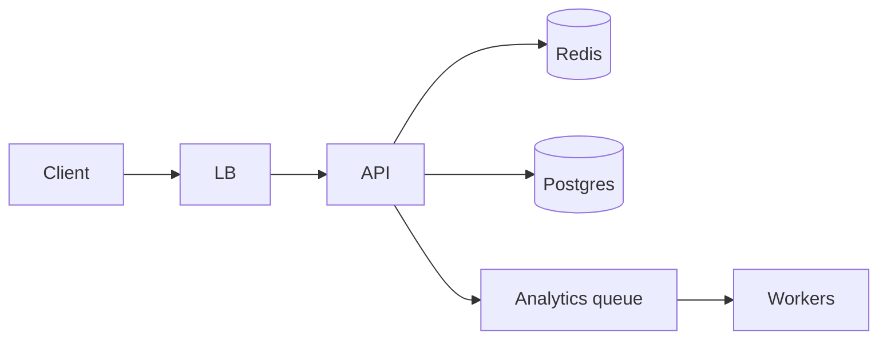

**Write:** validate URL → generate code → insert → fill cache → return.

**Read:** cache get by code → on miss DB → set cache → 302. Async click event to queue.

### 6. Deep dive — code generation

**Options**

1. Hash long URL (MD5/Base62 truncate) — collisions; same URL same code may be OK.
2. Auto-increment + Base62 — simple; enumerable; needs central ID.
3. Pre-generated random codes from a service — high entropy; allocation service.

**Pick:** 64-bit random → Base62 (~11 chars) with DB uniqueness constraint; retry on conflict. Or distributed ID (Snowflake) encoded Base62 for uniqueness without retries.

**Enumeration:** use enough entropy; rate-limit create; optional auth.

**Custom aliases:** reserved word list; uniqueness check; abuse review async.

### 7. Failures

- DB down: redirects may still hit warm cache; creates fail—return 503.
- Cache stampede on viral code: single-flight fill.
- Hot key viral link: many cache replicas / local cache.
- Poison long URLs (javascript:): scheme allowlist http/https.

### 8. Interview tips

- Ask 301 vs 302 (caching vs analytics accuracy).
- Mention cache key = code; TTL + invalidate on delete.
- Don’t over-shard at 2K QPS.

### Evolution

Add read replicas → shard by code hash → multi-region with global code space or region prefixes.

### Sequence — create + redirect

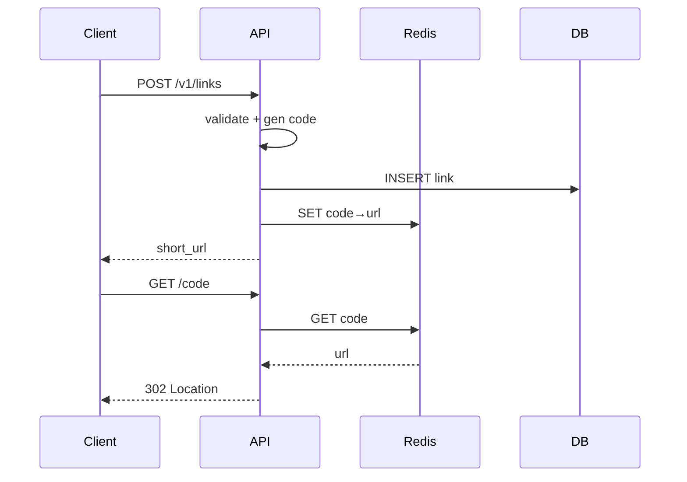

### Alternatives considered

| Approach | Pros | Cons |
|----------|------|------|
| Hash URL → code | Deterministic | Collisions; hard custom alias |
| Central auto-ID | Simple | Enumerability; write bottleneck |
| Random Base62 | Unpredictable | Retry on conflict (rare) |

### Analytics path

Clicks enqueue `{code, ts, ua, country?}`; workers aggregate to daily tables. Do not synchronously UPDATE click_count on every redirect under peak—use Redis INCR + flush.

### Security & abuse

- Allowlist `http`/`https` only
- Rate-limit create per IP
- Malware URL scanning async; disable on hit
- Robots: optional `nofollow` on interstitial (if used)

### Capacity evolution checkpoints

| Scale | Change |
|-------|--------|
| <5K QPS | Single primary + cache |
| Hot viral | Local cache / more replicas |
| Multi-region | Code prefix per region or global unique ID service |

### Interviewer Q&A (drill these aloud)

**Q: What is the consistency model for the core read?**  
A: State it explicitly (e.g. “redirects may see new links within TTL seconds; creates read-your-writes via primary”).

**Q: Single point of failure?**  
A: Name primary DB / broker / region; give mitigation (replicas, multi-AZ, queue buffer).

**Q: How do you prevent duplicate side effects on retry?**  
A: Idempotency keys / upserts / dedupe table—tie to this design’s writes.

**Q: What metric pages you at 3am?**  
A: Pick SLIs: error rate, p99, lag, saturation—not CPU alone.

**Q: How does this evolve to 10× data?**  
A: Partition key, storage tiering, or CQRS—one concrete next step.

### Implementation sketch (pseudocode mindset)

Walk one write handler: validate → authorize → mutate store → enqueue side effects → return. Mention timeouts on dependency calls. This bridges design and coding rounds.

### Load & chaos test plan (talk track)

1. Happy-path load at 2× peak estimate  
2. Dependency latency injection (+500 ms)  
3. Kill one AZ of the data store  
4. Replay poison message  
State what user experience should be in each case.


## Rate limiter

Build a service or library that enforces request quotas across a fleet.

### 1. Clarify

- Limits per API key / user / IP?
- Exact vs approximate?
- Centralized service vs middleware library?
- Soft vs hard throttle; delay vs reject?
- Multi-datacenter?

**Assumptions:** per-user token bucket, ~1M users, peak 100K decisions/sec, fail-open optional, single region first.

### 2. Capacity

100K QPS decisions → Redis must shard; each decision 1–2 RTT. Local + sync hybrid possible.

### 3. APIs

```
POST /v1/check
  { "key": "user:42", "cost": 1, "limit": 100, "window_sec": 60 }
  → { "allowed": true, "remaining": 83, "reset_sec": 12 }

# or middleware:
Allow(key) → bool + headers
```

### 4. Data model

Redis keys: `rl:{key}:{bucket}` → token count + last refill timestamp. Or sorted sets for sliding log (heavier).

Config store: limits per route/plan in SQL/config service.

### 5. High-level design

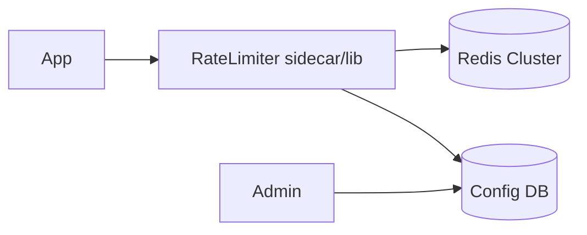

Gateway calls RL before routing. RL atomically refills and consumes tokens via Lua script.

### 6. Deep dive — algorithm & atomicity

**Token bucket in Lua:** read tokens+ts; refill based on now-ts; if tokens>=cost decrement; else deny. One RTT, race-safe.

**Distributed accuracy:** Redis cluster hash slot by key → per-key atomicity. Global exact sum across shards not required for per-user keys.

**Local rate limiting:** each instance allows `limit/N` — approximate, survives Redis outage, can over-allow by N.

**Hybrid:** local bulk tokens refilled from Redis periodically—low latency, bounded overshoot.

### 7. Failures

- Redis down: fail-open (availability) vs fail-closed (safety)—product choice; document it.
- Clock skew: prefer Redis server time in Lua.
- Hot tenant keys: isolate or raise limits; dedicated shard.
- Config push delay: version limits; poll/watch.

### 8. Interview tips

- Return `429` + `Retry-After`.
- Distinguish **rate** (QPS) vs **quota** (daily).
- Mention race without atomic ops.

### Evolution

Multi-region: regional limiters + async reconcile, or central with higher latency; often regional limits + global daily quota.

### Sequence — allow/deny

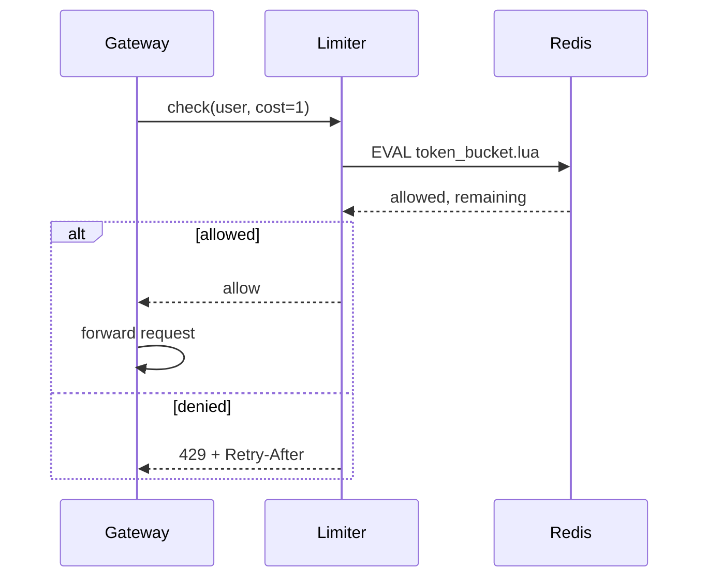

### Config examples

- Login: 5/min per IP + 20/hour per account
- Search: 10/s per user, burst 30
- Webhook egress: 100/s per tenant

### Multi-tenant fairness

Weighted fair limits prevent one noisy tenant from consuming Redis CPU. Isolate extreme tenants on dedicated keys/shards.

### Testing strategy

Load-test with concurrent clients sharing a key; assert never over `burst` beyond documented tolerance. Chaos: kill Redis; verify fail-open/closed behavior matches config.

### Evolution

Add sliding-window approximators for smoother UX; export quota usage to billing; edge enforcement via WASM/gateway plugins for ultra-low latency.

### Interviewer Q&A (drill these aloud)

**Q: What is the consistency model for the core read?**  
A: State it explicitly (e.g. “redirects may see new links within TTL seconds; creates read-your-writes via primary”).

**Q: Single point of failure?**  
A: Name primary DB / broker / region; give mitigation (replicas, multi-AZ, queue buffer).

**Q: How do you prevent duplicate side effects on retry?**  
A: Idempotency keys / upserts / dedupe table—tie to this design’s writes.

**Q: What metric pages you at 3am?**  
A: Pick SLIs: error rate, p99, lag, saturation—not CPU alone.

**Q: How does this evolve to 10× data?**  
A: Partition key, storage tiering, or CQRS—one concrete next step.

### Implementation sketch (pseudocode mindset)

Walk one write handler: validate → authorize → mutate store → enqueue side effects → return. Mention timeouts on dependency calls. This bridges design and coding rounds.

### Load & chaos test plan (talk track)

1. Happy-path load at 2× peak estimate  
2. Dependency latency injection (+500 ms)  
3. Kill one AZ of the data store  
4. Replay poison message  
State what user experience should be in each case.


## Notification system

Multi-channel notifications: push, email, SMS, in-app—triggered by product events with user preferences.

### 1. Clarify

- Channels in scope?
- User preference & quiet hours?
- Templates & localization?
- Delivery receipts / digests?
- Priority (security OTP vs marketing)?

**NFRs:** high fan-out, at-least-once OK with dedupe, OTP latency low, marketing best-effort.

### 2. Capacity

100M DAU; 5 notifs/user/day → ~5K events/sec avg; peaks 5–10×. Spike on breaking news.

### 3. APIs

```
POST /v1/notifications
  { "user_id"| "segment", "template_id", "data", "channels?", "priority" }
  → { "notification_id" }

PUT /v1/users/{id}/preferences
GET /v1/users/{id}/inbox
```

Webhooks from providers for bounces/delivery.

### 4. Data model

```
preferences(user_id, channel, enabled, quiet_hours)
templates(id, channel, body, locale)
notifications(id, user_id, payload, status, created_at)
device_tokens(user_id, token, platform)
```

### 5. High-level design

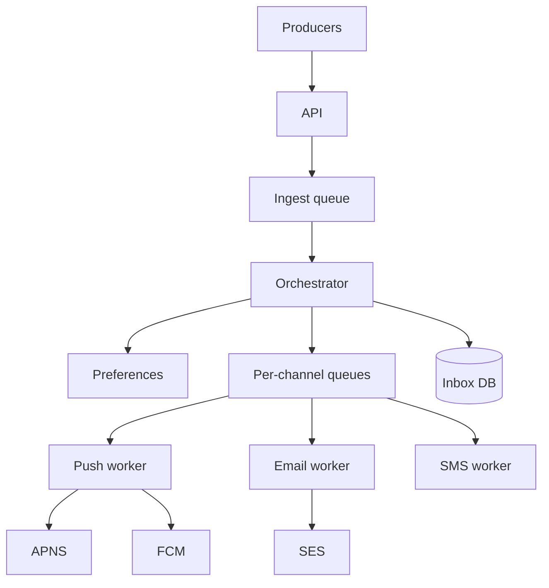

### 6. Deep dive — fan-out & preferences

Orchestrator expands audience, filters preferences, applies quiet hours (defer to delayed queue), renders templates, enqueues per channel with `notification_id` for idempotency.

**OTP path:** high-priority queue, sync-ish, skip marketing digests, stricter SLA.

**Dedup:** unique `(notification_id, channel)` in provider send table.

### 7. Failures

- Provider outage: retry with backoff; mark deferred; alternate channel optional.
- Preference service down: fail closed for marketing; fail open for security with care.
- Hot broadcast: chunk fan-out; avoid one giant transaction.

### 8. Interview tips

- Separate **transactional** vs **promotional** pipelines.
- Never put SMS OTP solely on a best-effort marketing bus.
- Talk provider rate limits and per-channel queues.

### Priority lanes

| Lane | Examples | SLA |
|------|----------|-----|
| P0 | OTP, security alerts | seconds; dedicated workers |
| P1 | Transactional receipts | <1 min |
| P2 | Social | minutes; batchable |
| P3 | Marketing | hours; digestable |

Never share P0 worker pools with P3.

### Preference evaluation order

1. User hard opt-out
2. Legal/regulatory constraints
3. Quiet hours → delay
4. Channel reachability (valid device token?)
5. Template render

### Idempotency & provider duplicates

Store `provider_message_id`; on retry reuse same client-side idempotency key to SES/FCM when supported. In-app inbox upserts by `notification_id`.

### Observability

Metrics: enqueue rate, send success, provider latency, preference drop rate, lag by lane. Trace_id from producer through send.

### Evolution

Digest bundler, ML send-time optimization, cross-device collapse (“read on web → skip push”).

### Interviewer Q&A (drill these aloud)

**Q: What is the consistency model for the core read?**  
A: State it explicitly (e.g. “redirects may see new links within TTL seconds; creates read-your-writes via primary”).

**Q: Single point of failure?**  
A: Name primary DB / broker / region; give mitigation (replicas, multi-AZ, queue buffer).

**Q: How do you prevent duplicate side effects on retry?**  
A: Idempotency keys / upserts / dedupe table—tie to this design’s writes.

**Q: What metric pages you at 3am?**  
A: Pick SLIs: error rate, p99, lag, saturation—not CPU alone.

**Q: How does this evolve to 10× data?**  
A: Partition key, storage tiering, or CQRS—one concrete next step.

### Implementation sketch (pseudocode mindset)

Walk one write handler: validate → authorize → mutate store → enqueue side effects → return. Mention timeouts on dependency calls. This bridges design and coding rounds.

### Load & chaos test plan (talk track)

1. Happy-path load at 2× peak estimate  
2. Dependency latency injection (+500 ms)  
3. Kill one AZ of the data store  
4. Replay poison message  
State what user experience should be in each case.


## News feed

Home timeline of posts from people you follow—ranking optional for deep dive.

### 1. Clarify

- Chronological vs ranked?
- Media posts?
- Ads / recommendations in scope?
- Max following graph size?
- Real-time vs eventual?

**Assumptions:** 100M users, avg 200 follows, celebrity accounts exist, ranked feed phase-2 light, single region first.

### 2. Capacity

- 10M DAU; 10 posts viewed/user → heavy reads
- Write posts: smaller QPS than reads
- Fan-out on write can explode for celebrities

### 3. APIs

```
POST /v1/posts { text, media_ids }
GET  /v1/feed?cursor&limit
POST /v1/follow { followee_id }
GET  /v1/posts/{id}
```

### 4. Data model

```
users, posts(id, author_id, content, created_at)
follows(follower_id, followee_id) PK(follower, followee)
  index(followee_id)  -- for fan-out
feed_cache(user_id, post_ids[])  -- Redis list/ZSET
```

Media in object storage; CDN.

### 5. High-level design

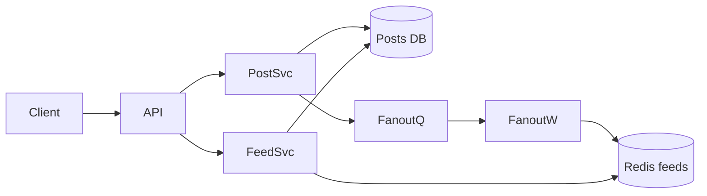

### 6. Deep dive — fan-out

**Fan-out on write:** on post, enqueue pushes of `post_id` into each follower’s cached timeline (ZSET score=time). Reads are cheap.

**Problem:** celebrities with 50M followers → write storm.

**Hybrid:** fan-out on write for normal users; for celebrities, fan-out on read (merge celebrity posts at read time). Detect via follower threshold.

**Ranking:** candidate generation from cache → ranker service (ML optional) → truncate. Keep chronological first if timeboxed.

### 7. Failures

- Fan-out lag: user sees delayed posts—show “updating.”
- Redis loss: rebuild from follows+posts asynchronously; degrade to slower path.
- Hot celebrity post: cache post objects aggressively.

### 8. Interview tips

- State hybrid threshold explicitly.
- Separate post object cache from timeline lists.
- Mention pagination cursors (score, id).

### Read path detail

1. Authn → `user_id`
2. `ZREVRANGE feed:{uid} start start+limit`
3. Hydrate `post:{id}` objects from cache/DB (MGET)
4. Filter deleted/blocked/muted
5. Optional ranker reorders page
6. Return cursor = last score+id

### Celebrity threshold policy

If `followers > 10k` (tunable), skip write fan-out; mark author `fanout=read`. Feed service merges those authors’ recent posts into the cached timeline at read.

### Cache memory rough math

1M DAU × 500 post_ids × 16 bytes ≈ 8 GB for timelines (order-of-magnitude)—fits a Redis cluster; still shard by user_id.

### Privacy

Respect blocks and audience ACL (friends-only posts) at hydrate time—not only at fan-out—so policy changes apply retroactively.

### Evolution

Edge caches for anonymous trending; multi-region feed caches with user home region; ML ranker as separate service with fallback to chrono.

### Interviewer Q&A (drill these aloud)

**Q: What is the consistency model for the core read?**  
A: State it explicitly (e.g. “redirects may see new links within TTL seconds; creates read-your-writes via primary”).

**Q: Single point of failure?**  
A: Name primary DB / broker / region; give mitigation (replicas, multi-AZ, queue buffer).

**Q: How do you prevent duplicate side effects on retry?**  
A: Idempotency keys / upserts / dedupe table—tie to this design’s writes.

**Q: What metric pages you at 3am?**  
A: Pick SLIs: error rate, p99, lag, saturation—not CPU alone.

**Q: How does this evolve to 10× data?**  
A: Partition key, storage tiering, or CQRS—one concrete next step.

### Implementation sketch (pseudocode mindset)

Walk one write handler: validate → authorize → mutate store → enqueue side effects → return. Mention timeouts on dependency calls. This bridges design and coding rounds.

### Load & chaos test plan (talk track)

1. Happy-path load at 2× peak estimate  
2. Dependency latency injection (+500 ms)  
3. Kill one AZ of the data store  
4. Replay poison message  
State what user experience should be in each case.


## Chat & messaging

1:1 and group chat with online delivery, history, and read indicators (light).

### 1. Clarify

- 1:1 only or groups?
- Delivery receipts / typing?
- Media attachments?
- Encryption (E2E) in scope?
- Message order guarantees?

**NFRs:** low latency push, history durable, at-least-once with client dedupe, ordering per conversation.

### 2. Capacity

50M DAU; 40 msgs/user/day → ~20K msgs/sec avg; push connections for online users (~5–10M concurrent)—connection tier is the hard part.

### 3. APIs / protocols

```
WS /connect  (auth token)
send { conv_id, client_msg_id, body }
ack / push { msg }
HTTP POST /v1/conversations
GET /v1/conversations/{id}/messages?cursor
```

### 4. Data model

```
conversations(id, type, created_at)
members(conv_id, user_id, role)
messages(conv_id, msg_id, sender_id, body, created_at)
  PK (conv_id, msg_id) — shard by conv_id
devices / sessions for push
```

### 5. High-level design

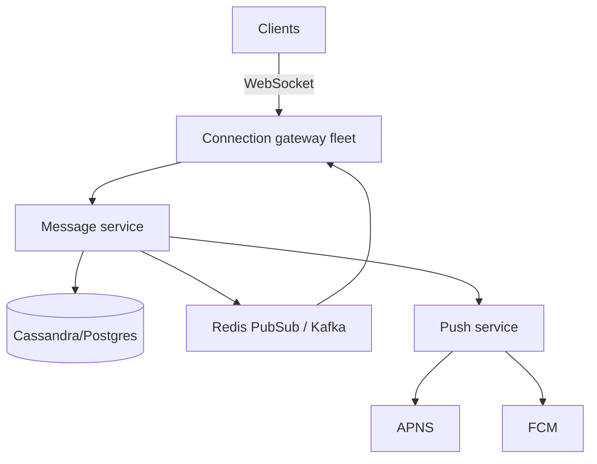

**Online:** store message → publish to member connection gateways → push frames.  
**Offline:** trigger mobile push; inbox fetch later.

### 6. Deep dive — connections & order

Gateways hold sockets; session registry maps `user_id → gateway_id`. Sticky LB or gossip registry.

**Ordering:** snowflake/ULID per message; clients sort by `(created_at, msg_id)`. Per-`conv_id` Kafka partition if streaming.

**Idempotency:** `client_msg_id` unique per sender.

**Groups:** fan-out to N members; for large groups use channel fan-out servers.

### 7. Failures

- Gateway crash: clients reconnect; miss window recovered via history API since cursor.
- Dup delivers: client dedupe by msg_id.
- Hot group chat: separate channel infra.

### 8. Interview tips

- Call out WebSocket scaling as primary challenge.
- History store ≠ connection tier.
- Mention backfill on reconnect.

### Message state machine

`pending (client) → server_accepted → delivered → read (optional)`

Clients show local echo with `client_msg_id` until server assigns `msg_id`.

### Fan-out for groups

| Members | Strategy |
|---------|----------|
| ≤50 | Direct publish to each online session |
| 50–1k | Per-conversation pub/sub channel |
| ≥1k | Broadcast tier / channel servers; history still sharded |

### Media in chat

Upload via signed URL; message body stores `media_id`; receivers fetch CDN. Virus scan before making media downloadable.

### Multi-device

Registry allows multiple sessions per user; fan-out to all. Read receipts may be per-user not per-device (product choice).

### Evolution

E2E encryption (keys on device; server relays ciphertext); message search index async; disappearing messages via TTL jobs.

### Interviewer Q&A (drill these aloud)

**Q: What is the consistency model for the core read?**  
A: State it explicitly (e.g. “redirects may see new links within TTL seconds; creates read-your-writes via primary”).

**Q: Single point of failure?**  
A: Name primary DB / broker / region; give mitigation (replicas, multi-AZ, queue buffer).

**Q: How do you prevent duplicate side effects on retry?**  
A: Idempotency keys / upserts / dedupe table—tie to this design’s writes.

**Q: What metric pages you at 3am?**  
A: Pick SLIs: error rate, p99, lag, saturation—not CPU alone.

**Q: How does this evolve to 10× data?**  
A: Partition key, storage tiering, or CQRS—one concrete next step.

### Implementation sketch (pseudocode mindset)

Walk one write handler: validate → authorize → mutate store → enqueue side effects → return. Mention timeouts on dependency calls. This bridges design and coding rounds.

### Load & chaos test plan (talk track)

1. Happy-path load at 2× peak estimate  
2. Dependency latency injection (+500 ms)  
3. Kill one AZ of the data store  
4. Replay poison message  
State what user experience should be in each case.


## Instagram-like

Photo/video sharing with follow graph, feed, and likish engagement—media pipeline is central.

### 1. Clarify

- Photo only or short video?
- Stories / DMs in scope?
- Filters processed client or server?
- Discovery / explore?

**Focus:** upload → process → feed + profile grid. Skip DMs (see chat design).

### 2. Capacity

- 500M users; 50M DAU; 2 uploads/DAU → ~1K uploads/sec peak careful sizing
- Reads: feed + CDN dominate bandwidth
- Avg image 2 MB original → object storage terabytes+/year

### 3. APIs

```
POST /v1/media/upload-session → { upload_url, media_id }
POST /v1/posts { media_id, caption }
GET  /v1/feed
GET  /v1/users/{id}/posts
POST /v1/posts/{id}/like
```

Clients upload **directly to object storage** via signed URL.

### 4. Data model

```
media(id, user_id, status, variants_json)
posts(id, author_id, media_id, caption, created_at)
likes(post_id, user_id)
follows(...)
```

### 5. High-level design

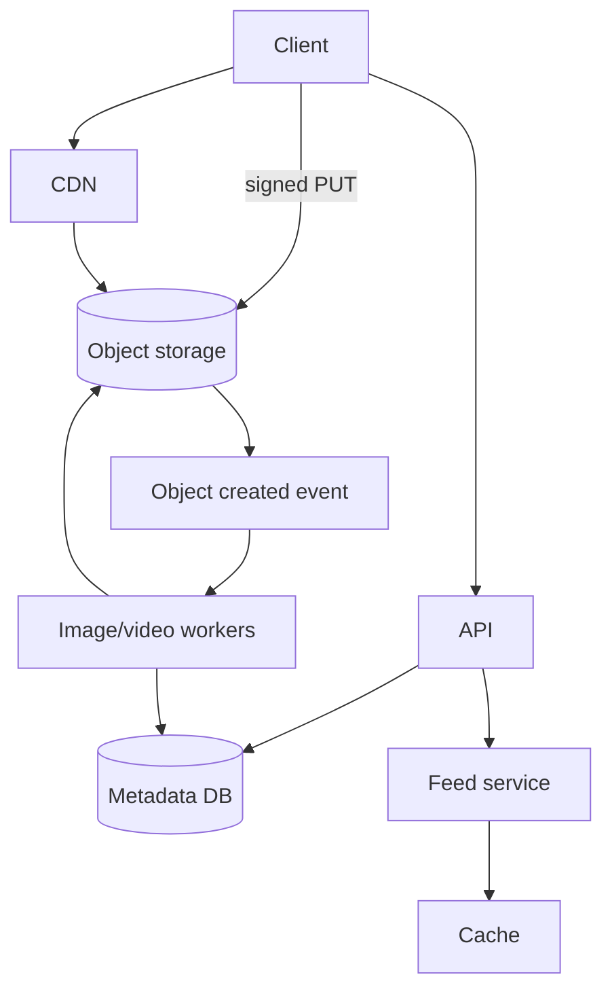

### 6. Deep dive — media pipeline

On upload complete: workers generate thumbnails, compress, strip EXIF GPS if required, optional virus scan. Update `media.status=ready` then allow post publish (or auto-post).

**Feed:** reuse hybrid fan-out from news feed design. Grid queries by `author_id, created_at`.

**Like counts:** Redis counters + periodic DB settle; accept slight lag.

### 7. Failures

- Processing backlog: show “processing” placeholder.
- Hot media: CDN cache; origin shield.
- Partial variants: never serve until required sizes ready.

### 8. Interview tips

- Signed URL upload is a must-mention.
- Separate metadata DB from blob bytes.
- Tie feed discussion to earlier fan-out tradeoffs briefly.

### Upload session detail

1. Client requests upload session → API creates `media_id=processing`
2. Client PUT bytes to signed URL (multipart for large)
3. Object store event triggers workers
4. Workers write variants; update media ready
5. Client creates post referencing media_id (rejected if not ready)

### Feed vs Explore

Feed = follow graph (hybrid fan-out). Explore = recommendation candidates (separate system)—mention as phase 2 to avoid boiling ocean.

### Like / comment scale

Likes: Redis set or counter + async durable store. Comments: sharded by `post_id`; page by time. Celebrity posts: cache top comments.

### Moderation

Async classifiers on caption+image; quarantine pipeline; do not block upload path on slow ML.

### Evolution

Reels/short-video shares transcode path with video design; stories as TTL’d media namespace.

### Interviewer Q&A (drill these aloud)

**Q: What is the consistency model for the core read?**  
A: State it explicitly (e.g. “redirects may see new links within TTL seconds; creates read-your-writes via primary”).

**Q: Single point of failure?**  
A: Name primary DB / broker / region; give mitigation (replicas, multi-AZ, queue buffer).

**Q: How do you prevent duplicate side effects on retry?**  
A: Idempotency keys / upserts / dedupe table—tie to this design’s writes.

**Q: What metric pages you at 3am?**  
A: Pick SLIs: error rate, p99, lag, saturation—not CPU alone.

**Q: How does this evolve to 10× data?**  
A: Partition key, storage tiering, or CQRS—one concrete next step.

### Implementation sketch (pseudocode mindset)

Walk one write handler: validate → authorize → mutate store → enqueue side effects → return. Mention timeouts on dependency calls. This bridges design and coding rounds.

### Load & chaos test plan (talk track)

1. Happy-path load at 2× peak estimate  
2. Dependency latency injection (+500 ms)  
3. Kill one AZ of the data store  
4. Replay poison message  
State what user experience should be in each case.


## Uber-like

Riders request trips; drivers are matched using geospatial proximity and ETA.

### 1. Clarify

- Rides only (no food)?
- Pricing / surge in scope?
- Payments?
- Cities count / active drivers?

**Core:** location updates, request ride, match, trip lifecycle. Payments summarized.

### 2. Capacity

1M drivers; location update every 3–5s when online → tens–hundreds of K writes/sec → specialized location store. Trip requests much lower QPS.

### 3. APIs

```
PUT /v1/drivers/{id}/location { lat, lng, heading }
POST /v1/trips { pickup, dropoff, product }
WS  trip events: offered, accepted, arrived, completed
POST /v1/trips/{id}/accept
```

### 4. Data model

```
drivers(id, status, vehicle)
trips(id, rider_id, driver_id, status, geo fields, timestamps)
location_store: driver_id → {lat,lng,ts} in memory/geo index
```

### 5. High-level design

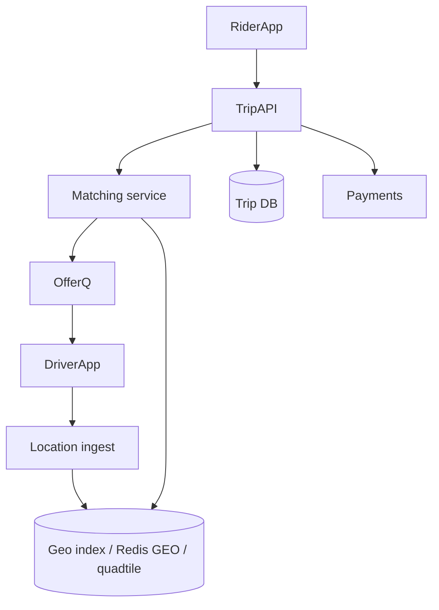

### 6. Deep dive — matching & geo

**Geo index:** geohash/quadtree tiles; query ring of cells around pickup; filter by status=available; rank by ETA (OSRM/maps) not just distance.

**Matching:** lock driver optimistically (compare-and-set status); offer with timeout; on reject/timeout try next. Avoid double assign with transactional status.

**Location firehose:** downsample; update only if moved >X meters; shard by city/region cell.

### 7. Failures

- Map provider down: fall back to haversine ranking.
- Match storms at concert end: queue requests; expand search radius gradually.
- Split brain assign: fencing on trip version number.

### 8. Interview tips

- Location ingestion scale ≠ trip DB scale—separate them.
- Talk city/region sharding.
- Mention ETA vs crow-flies.

### Trip state machine

`requested → offered → accepted → en_route_pickup → arrived → in_trip → completed` (+ `canceled` edges)

Each transition stores timestamp for analytics and dispute resolution.

### Location update pipeline

Driver app batches locations; ingest validates token + rate; writes to in-memory geo store with TTL; durable log optional for replay. Do not write every ping to OLTP Postgres.

### Matching fairness

Avoid always assigning the same driver; rotate among comparable ETAs; consider driver acceptance rate without creating feedback abuse loops.

### City isolation

Shard control plane by city/region: matching, inventory of drivers, and map config stay local—reduces blast radius and latency.

### Evolution

Multi-stop trips, scheduled rides, cross-city airport queues—each adds inventory constraints; keep core matching simple first.

### Interviewer Q&A (drill these aloud)

**Q: What is the consistency model for the core read?**  
A: State it explicitly (e.g. “redirects may see new links within TTL seconds; creates read-your-writes via primary”).

**Q: Single point of failure?**  
A: Name primary DB / broker / region; give mitigation (replicas, multi-AZ, queue buffer).

**Q: How do you prevent duplicate side effects on retry?**  
A: Idempotency keys / upserts / dedupe table—tie to this design’s writes.

**Q: What metric pages you at 3am?**  
A: Pick SLIs: error rate, p99, lag, saturation—not CPU alone.

**Q: How does this evolve to 10× data?**  
A: Partition key, storage tiering, or CQRS—one concrete next step.

### Implementation sketch (pseudocode mindset)

Walk one write handler: validate → authorize → mutate store → enqueue side effects → return. Mention timeouts on dependency calls. This bridges design and coding rounds.

### Load & chaos test plan (talk track)

1. Happy-path load at 2× peak estimate  
2. Dependency latency injection (+500 ms)  
3. Kill one AZ of the data store  
4. Replay poison message  
State what user experience should be in each case.


## Video streaming

Upload, process, and stream videos with adaptive bitrate (think YouTube/NetflixLite).

### 1. Clarify

- VOD only or live?
- Max resolution / DRM?
- Comments / recommendations?
- Global audience?

**Focus:** VOD upload → transcode → CDN playback. Skip social.

### 2. Capacity

1M DAU watching 30 min; 3 Mbps avg → huge egress → **CDN mandatory**. Uploads: 1K videos/day varying sizes—transcode CPU bound.

### 3. APIs

```
POST /v1/videos → { video_id, upload_url }
POST /v1/videos/{id}/complete
GET  /v1/videos/{id} → metadata + manifest_url
GET  /manifest.m3u8  (HLS) via CDN
```

### 4. Data model

```
videos(id, owner_id, title, status, duration, renditions_json)
watch_history(user_id, video_id, position)
```

Bytes in object storage; never in SQL.

### 5. High-level design

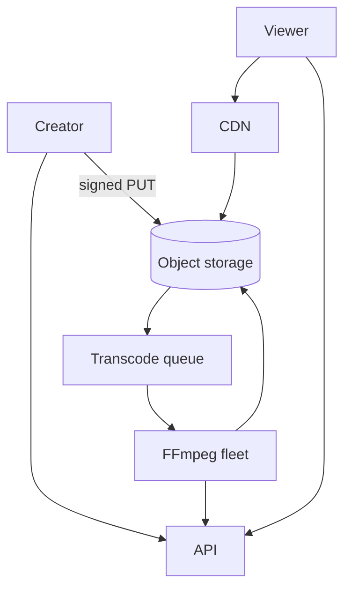

### 6. Deep dive — adaptive streaming

Transcode into multiple renditions (360p–1080p) + segment (HLS/DASH). Client picks bitrate via ABR. Packaging pipeline updates status to `ready` when minimally playable rendition exists.

**Warm CDN:** popular videos pre-pushed to edge; long-tail on miss from origin/shield.

**Thumbnails & previews:** separate jobs; sprite sheets for scrubbing.

### 7. Failures

- Transcode fail: retry; quarantine poison files; notify creator.
- CDN origin overload: origin shield + rate limit.
- Partial publish: don’t expose until ready (or progressive).

### 8. Interview tips

- Lead with CDN + object storage + async transcode.
- Estimate egress to justify CDN cost story.
- Mention DRM only if interviewer cares.

### Transcode job graph

Original → (probe) → parallel renditions → package HLS → thumbnail → preview gif → mark ready.

Use a workflow engine or queue DAG; checkpoint each step for retries.

### Playback path

Client GETs metadata → receives CDN URL for master playlist → requests segments; CDN cache-hit ratio drives cost. Tokenized URLs for paid content (short-lived signatures).

### Cost controls

- Lifecycle cold storage for rarely watched
- Shorter segment size vs more requests tradeoff
- Cap max upload length on free tier

### Live vs VOD

Live needs low-latency ingest and different failure modes (reconnect mid-stream). Keep out of scope unless asked; note the divergence.

### Evolution

Recommendations, comments, copyright fingerprinting async—each is a consumer of the “video ready” event.

### Interviewer Q&A (drill these aloud)

**Q: What is the consistency model for the core read?**  
A: State it explicitly (e.g. “redirects may see new links within TTL seconds; creates read-your-writes via primary”).

**Q: Single point of failure?**  
A: Name primary DB / broker / region; give mitigation (replicas, multi-AZ, queue buffer).

**Q: How do you prevent duplicate side effects on retry?**  
A: Idempotency keys / upserts / dedupe table—tie to this design’s writes.

**Q: What metric pages you at 3am?**  
A: Pick SLIs: error rate, p99, lag, saturation—not CPU alone.

**Q: How does this evolve to 10× data?**  
A: Partition key, storage tiering, or CQRS—one concrete next step.

### Implementation sketch (pseudocode mindset)

Walk one write handler: validate → authorize → mutate store → enqueue side effects → return. Mention timeouts on dependency calls. This bridges design and coding rounds.

### Load & chaos test plan (talk track)

1. Happy-path load at 2× peak estimate  
2. Dependency latency injection (+500 ms)  
3. Kill one AZ of the data store  
4. Replay poison message  
State what user experience should be in each case.


## Dropbox-like

Users upload files; sync across devices with dedupe, versioning, and sharing (light).

### 1. Clarify

- File size limits? Large file chunking?
- Conflict resolution (last-write-wins vs branches)?
- Sharing links / collaborators?
- Block-level sync?

**NFRs:** durable, eventual sync across devices, efficient bandwidth (chunking + dedupe).

### 2. Capacity

100M users; avg 10 GB stored → exabyte-class object store; metadata smaller but hot. Sync traffic bursty when devices reconnect.

### 3. APIs

```
POST /v1/files/commit { path, blocks[], rev }
GET  /v1/files/metadata?path
POST /v1/blocks/upload { block_hash } → upload_url if novel
GET  /v1/sync/changes?cursor
```

### 4. Data model

```
namespaces / folders
files(id, ns_id, path, rev, size)
blocks(hash PK, size)  -- content addressed
file_blocks(file_id, idx, hash)
revisions(file_id, rev, metadata)
```

### 5. High-level design

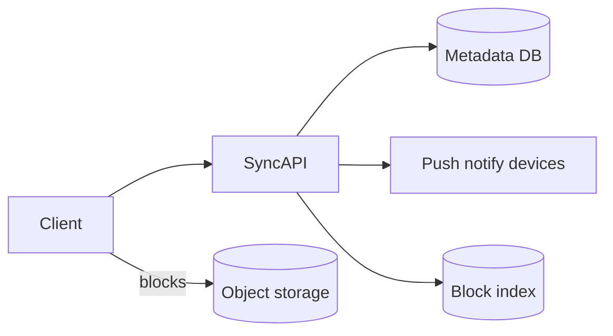

### 6. Deep dive — chunking & conflicts

Files split into ~4MB blocks; hash (SHA256); upload only missing blocks (global dedupe). Commit updates metadata revision atomically.

**Conflicts:** if client’s base rev ≠ server tip → conflict copy or automatic merge for docs (scope). Notify other devices via long-poll/websocket with cursor.

**Large folders:** paginate change feed; avoid listing entire tree each sync.

### 7. Failures

- Commit after partial block upload: commit rejects until all blocks present.
- Metadata vs block inconsistency: GC unreferenced blocks lazily; never delete block still referenced.
- Hot shared folder: shard metadata by namespace_id.

### 8. Interview tips

- Content-addressed blocks are the star of the design.
- Metadata DB is the consistency bottleneck—design commits carefully.
- Client sync protocol > fancy storage brands.

### Sync cursor protocol

Server maintains per-namespace journal of changes. Client sends cursor; server returns batch of path changes + new cursor. Idempotent apply on client.

### Dedup savings

Identical blocks across users (popular OS files, shared photos) upload once. Privacy: hash only; cannot reconstruct others’ files without blocks you own.

### Sharing

Share link creates capability token on a subtree; authz check on download. Collaborator write requires conflict rules same as multi-device.

### Client tips for interviews

Mention offline queue of commits; exponential backoff; bandwidth caps on mobile metered networks.

### Evolution

Full-text search of file names/content via async indexer; ransomware recovery via version history restore points.

### Interviewer Q&A (drill these aloud)

**Q: What is the consistency model for the core read?**  
A: State it explicitly (e.g. “redirects may see new links within TTL seconds; creates read-your-writes via primary”).

**Q: Single point of failure?**  
A: Name primary DB / broker / region; give mitigation (replicas, multi-AZ, queue buffer).

**Q: How do you prevent duplicate side effects on retry?**  
A: Idempotency keys / upserts / dedupe table—tie to this design’s writes.

**Q: What metric pages you at 3am?**  
A: Pick SLIs: error rate, p99, lag, saturation—not CPU alone.

**Q: How does this evolve to 10× data?**  
A: Partition key, storage tiering, or CQRS—one concrete next step.

### Implementation sketch (pseudocode mindset)

Walk one write handler: validate → authorize → mutate store → enqueue side effects → return. Mention timeouts on dependency calls. This bridges design and coding rounds.

### Load & chaos test plan (talk track)

1. Happy-path load at 2× peak estimate  
2. Dependency latency injection (+500 ms)  
3. Kill one AZ of the data store  
4. Replay poison message  
State what user experience should be in each case.


## Web crawler

Politely discover and fetch URLs at scale for search indexing or archives.

### 1. Clarify

- Seed URLs? Domain allow/deny?
- Freshness / recrawl policy?
- JS rendering?
- Robots.txt / crawl delay?
- Output: store HTML or extract text?

### 2. Capacity

Billions of URLs; politeness limits often bind before NIC. Plan frontier queue size and per-host rate limits.

### 3. APIs / control

```
POST /admin/seeds
GET  /admin/stats
# workers pull from frontier
```

### 4. Data model

```
frontier(url, next_fetch_at, priority)
url_seen bloom / DB (canonical URL)
documents(url_hash, content_ref, fetched_at, status)
host_state(host, next_slot, crawl_delay)
```

### 5. High-level design

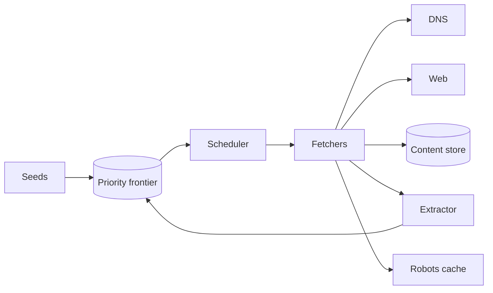

### 6. Deep dive — politeness & frontier

Scheduler ensures per-host concurrency=1 (or small N) and respects crawl-delay. Canonicalize URLs (scheme/host/trailing slash). Bloom filter + exact store for seen URLs (false positives miss pages; false negatives waste fetch—tune).

**Priority:** prefer high PageRank seeds, sitemaps, change-frequency heuristics.

**DNS & IP:** cache DNS; optional crawl by IP with Host header; avoid hammering shared hosters.

### 7. Failures

- Trap sites (infinite calendars): URL normalization + depth limits + per-host budgets.
- Fetcher crash: lease URLs with timeout; requeue.
- Legal/robots: hard fail closed if robots disallows.

### 8. Interview tips

- Politeness is the ethical and practical core.
- Separate frontier, fetcher, storage.
- Mention canonicalization to avoid dupes.

### Canonicalization rules (examples)

- Lowercase host
- Strip `#fragment`
- Sort query params; drop tracking params (`utm_*`)
- Default ports omitted
- Trailing slash policy per host

Inconsistent canonicalization wastes crawl budget.

### Freshness

Recrawl score = f(change history, importance, last_modified headers). Prefer `If-Modified-Since` / ETag to save bandwidth.

### Rendering

Headless browsers are 10–100× costlier—use only for allowlisted JS-heavy domains. Default: raw fetch + parse links.

### Storage

Content-addressed raw bytes + metadata index; compress; respect retention policies.

### Evolution

Distributed crawl workers by host hash; feedback from indexer on dead links; sitemaps as first-class seeds.

### Interviewer Q&A (drill these aloud)

**Q: What is the consistency model for the core read?**  
A: State it explicitly (e.g. “redirects may see new links within TTL seconds; creates read-your-writes via primary”).

**Q: Single point of failure?**  
A: Name primary DB / broker / region; give mitigation (replicas, multi-AZ, queue buffer).

**Q: How do you prevent duplicate side effects on retry?**  
A: Idempotency keys / upserts / dedupe table—tie to this design’s writes.

**Q: What metric pages you at 3am?**  
A: Pick SLIs: error rate, p99, lag, saturation—not CPU alone.

**Q: How does this evolve to 10× data?**  
A: Partition key, storage tiering, or CQRS—one concrete next step.

### Implementation sketch (pseudocode mindset)

Walk one write handler: validate → authorize → mutate store → enqueue side effects → return. Mention timeouts on dependency calls. This bridges design and coding rounds.

### Load & chaos test plan (talk track)

1. Happy-path load at 2× peak estimate  
2. Dependency latency injection (+500 ms)  
3. Kill one AZ of the data store  
4. Replay poison message  
State what user experience should be in each case.


## Typeahead

Suggest queries or entities as the user types, with very low latency.

### 1. Clarify

- Query suggestions vs user/product entities?
- Personalization?
- Typo tolerance?
- Languages?

**NFR:** p99 < 100 ms end-to-end; high QPS; eventual freshness OK (minutes).

### 2. Capacity

100K QPS peak typing traffic; each keystroke may fire request (debounce client-side 50–100 ms).

### 3. APIs

```
GET /v1/suggest?q=sea&limit=8
→ { "suggestions": ["seattle weather", "search engines", ...] }
```

### 4. Data model

Trie / prefix index in memory; or ranked suggestions table:

```
suggestions(prefix, term, score)
```

Source: query logs aggregated offline + editorials.

### 5. High-level design

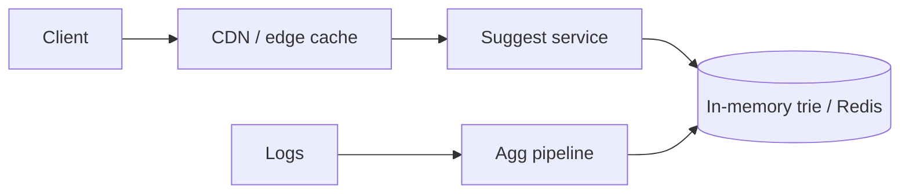

### 6. Deep dive — data structure & ranking

**Trie / radix tree** of terms; at each node top-K heap by score. Memory heavy but fast. Shard by prefix first character(s).

**Ranking score:** frequency × freshness × click-through; personalization as re-rank of top-K.

**Cache:** edge cache common prefixes (`q=a`, `q=se`); short TTL.

**Typo:** fuzzy at cost—optional second pass if exact prefix sparse.

### 7. Failures

- Index rebuild: blue/green swap of trie snapshot.
- Hot prefix “a”: more replicas; cache.
- Empty results: fall back to popular overall.

### 8. Interview tips

- Client debounce is part of the design.
- Offline aggregation → online trie is a clean story.
- Don’t put typeahead on disk-bound SQL for each keystroke.

### Building the trie offline

Nightly (or hourly): aggregate query logs → filter abuse → compute scores → build immutable trie snapshot → push to suggest fleet → atomic swap.

### Online personalization

Fetch global top-K for prefix; re-rank with user recent searches / locale / vertical. Keep personalization off the trie critical path when possible.

### Client UX

Debounce 75 ms; cancel in-flight on new keystroke; prefetch next likely char for popular prefixes optional.

### Abuse

Block injection of spam suggestions; moderate editorial blacklist; rate-limit suggest API.

### Evolution

Multi-language analyzers; entity suggest (users, products) with type icons; voice input tokenization.

### Interviewer Q&A (drill these aloud)

**Q: What is the consistency model for the core read?**  
A: State it explicitly (e.g. “redirects may see new links within TTL seconds; creates read-your-writes via primary”).

**Q: Single point of failure?**  
A: Name primary DB / broker / region; give mitigation (replicas, multi-AZ, queue buffer).

**Q: How do you prevent duplicate side effects on retry?**  
A: Idempotency keys / upserts / dedupe table—tie to this design’s writes.

**Q: What metric pages you at 3am?**  
A: Pick SLIs: error rate, p99, lag, saturation—not CPU alone.

**Q: How does this evolve to 10× data?**  
A: Partition key, storage tiering, or CQRS—one concrete next step.

### Implementation sketch (pseudocode mindset)

Walk one write handler: validate → authorize → mutate store → enqueue side effects → return. Mention timeouts on dependency calls. This bridges design and coding rounds.

### Load & chaos test plan (talk track)

1. Happy-path load at 2× peak estimate  
2. Dependency latency injection (+500 ms)  
3. Kill one AZ of the data store  
4. Replay poison message  
State what user experience should be in each case.


## Search

Full-text search over documents (products, web pages, or app content) with ranking and filters.

### 1. Clarify

- Corpus size & update rate?
- Filters / facets?
- Personalization / autocomplete (separate)?
- Exact phrase / language?

### 2. Capacity

100M docs; 1–5KB text each; 1K updates/sec; 10K queries/sec. Index size often 20–50% of raw text (rule of thumb varies).

### 3. APIs

```
GET /v1/search?q=&filters=&page=
POST /v1/index/docs  (internal)
```

### 4. Data model

Source of truth DB + **inverted index** in search cluster:

```
term → postings list of (doc_id, tf, positions?)
doc_store for snippets
```

### 5. High-level design

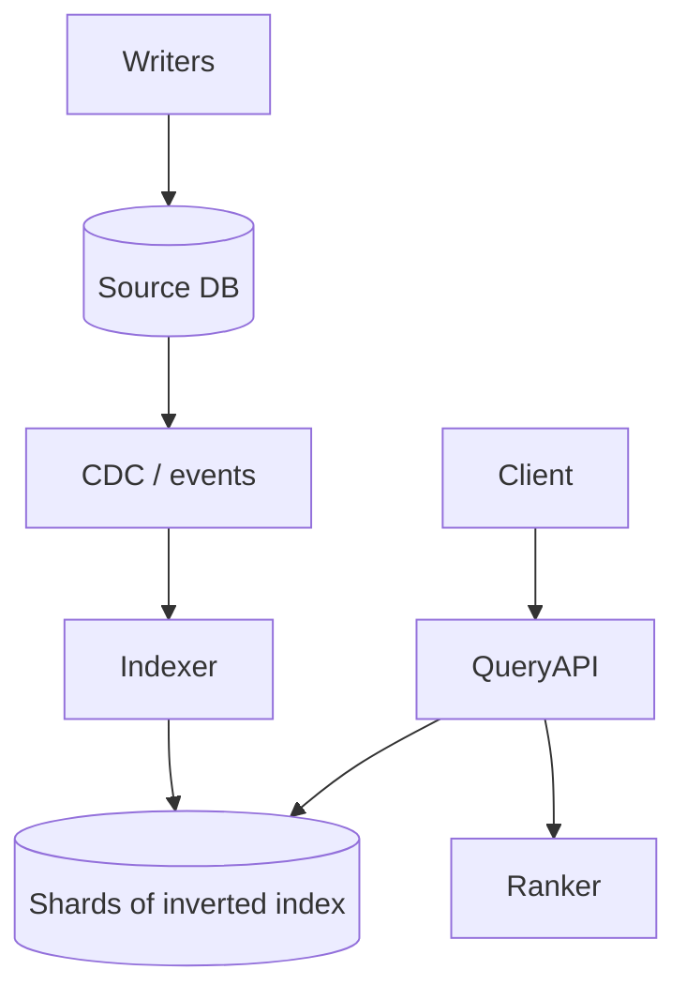

### 6. Deep dive — indexing & query

**Indexing:** tokenize, normalize (lower case, stem), update inverted lists; near-real-time segments flush & merge (LSM-like). Use doc_id routing hash for shards.

**Query:** parse → retrieve candidates from postings intersection → score (BM25) → apply filters → maybe second-stage ML rank → return snippets with highlights.

**Consistency:** search is eventually consistent with SoT; show “indexed_at” if needed.

### 7. Failures

- Hot terms explode CPU: cache query results; harden stopwords.
- Split brain index: replica shards; quorum for admin ops.
- Poison docs blow memory: size limits; analyzer circuit breakers.

### 8. Interview tips

- Emphasize SoT ≠ search index.
- Name BM25 / inverted index without claiming to invent Lucene.
- Separate autocomplete service if asked.

### Shard & replica layout

Index split by doc_id hash into N primary shards; each has replicas for read scale and HA. Query fan-out to shards → merge top-K.

### Relevance debugging

Explain API showing matched terms and scores—valuable in interviews as an operational touch.

### Permissions

For private corpora, filter by ACL post-retrieve or index doc with permission tokens carefully (avoid leakage). Never show snippets user cannot access.

### Zero-downtime reindex

Blue/green index aliases: build v2 → swap alias → drop v1.

### Evolution

Learning-to-rank stage; vector search hybrid (keyword + embedding); synonyms managed via config service.

### Interviewer Q&A (drill these aloud)

**Q: What is the consistency model for the core read?**  
A: State it explicitly (e.g. “redirects may see new links within TTL seconds; creates read-your-writes via primary”).

**Q: Single point of failure?**  
A: Name primary DB / broker / region; give mitigation (replicas, multi-AZ, queue buffer).

**Q: How do you prevent duplicate side effects on retry?**  
A: Idempotency keys / upserts / dedupe table—tie to this design’s writes.

**Q: What metric pages you at 3am?**  
A: Pick SLIs: error rate, p99, lag, saturation—not CPU alone.

**Q: How does this evolve to 10× data?**  
A: Partition key, storage tiering, or CQRS—one concrete next step.

### Implementation sketch (pseudocode mindset)

Walk one write handler: validate → authorize → mutate store → enqueue side effects → return. Mention timeouts on dependency calls. This bridges design and coding rounds.

### Load & chaos test plan (talk track)

1. Happy-path load at 2× peak estimate  
2. Dependency latency injection (+500 ms)  
3. Kill one AZ of the data store  
4. Replay poison message  
State what user experience should be in each case.


## Ticket booking

Concert/stadium seats (or airline-style inventory) with holds, payments, and no double booking.

### 1. Clarify

- Reserved seats vs general admission?
- Hold duration?
- Payment provider external?
- Scalper abuse?

**Critical NFR:** **correctness under contention**—never sell same seat twice.

### 2. Capacity

Mostly read-heavy until on-sale. On-sale: 100K users; flash contention on hot seats/sections. Inventory relatively small vs social apps.

### 3. APIs

```
GET  /v1/events/{id}/seats
POST /v1/holds { event_id, seat_ids[] } → { hold_id, expires_at }
POST /v1/checkout { hold_id, payment_method }
POST /v1/webhooks/payment
```

### 4. Data model

```
events, seats(event_id, seat_id, status, version)
holds(hold_id, user_id, seats[], expires_at)
orders(order_id, status, payment_ref)
```

`status`: available | held | sold.

### 5. High-level design

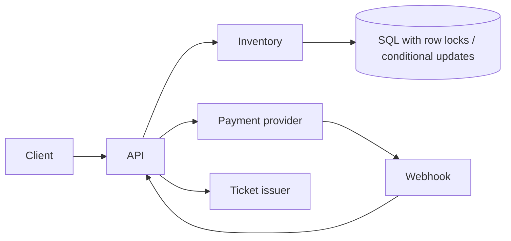

### 6. Deep dive — concurrency

**Hold:** transaction selecting seats `WHERE status='available' FOR UPDATE` (or `UPDATE ... WHERE version=V`) → set held + expiry. If conflict, fail hold.

**Expiry:** TTL job or delayed queue releases holds atomically if still held by same hold_id.

**Checkout:** confirm payment intent → mark sold only after payment success (or auth hold). Idempotency keys on checkout.

**GA inventory:** counter with conditional decrement `WHERE remaining >= n`.

### 7. Failures

- Payment success / order fail: webhook reconciliation job; issue ticket or refund.
- Thundering herd on-sale: queue waiting room; sectional sharding; cache seat maps read-only; serialize writes per seat section.
- Clock skew on expiry: use DB time.

### 8. Interview tips

- Correctness > microservices fashion.
- Waiting room is a valid scale tactic.
- Spell out idempotent payment + seat state machine.

### Seat map reads vs writes

Seat maps are read-cached aggressively; writes go through inventory service with strict concurrency. Cache invalidation on hold/sale (or short TTL during on-sale).

### Waiting room

Admit users with tokens at controlled rate when on-sale begins. Token carries event_id and expiry; booking API rejects without token. Absorbs bot storms.

### Payment + ticket issue

After PSP success: create order, mark seats sold, enqueue ticket PDF/QR email. Reconciliation scans `payment_succeeded AND order_missing`.

### Anti-scalping (light)

Purchase limits per user/payment instrument; queue fairness; CAPTCHA at admit time—mention without claiming perfect solution.

### Evolution

Resale marketplace with transfer of ownership; dynamic pricing—both need stronger audit trails.

### Interviewer Q&A (drill these aloud)

**Q: What is the consistency model for the core read?**  
A: State it explicitly (e.g. “redirects may see new links within TTL seconds; creates read-your-writes via primary”).

**Q: Single point of failure?**  
A: Name primary DB / broker / region; give mitigation (replicas, multi-AZ, queue buffer).

**Q: How do you prevent duplicate side effects on retry?**  
A: Idempotency keys / upserts / dedupe table—tie to this design’s writes.

**Q: What metric pages you at 3am?**  
A: Pick SLIs: error rate, p99, lag, saturation—not CPU alone.

**Q: How does this evolve to 10× data?**  
A: Partition key, storage tiering, or CQRS—one concrete next step.

### Implementation sketch (pseudocode mindset)

Walk one write handler: validate → authorize → mutate store → enqueue side effects → return. Mention timeouts on dependency calls. This bridges design and coding rounds.

### Load & chaos test plan (talk track)

1. Happy-path load at 2× peak estimate  
2. Dependency latency injection (+500 ms)  
3. Kill one AZ of the data store  
4. Replay poison message  
State what user experience should be in each case.


## Payments

Move money (or ledger entries) between parties with idempotency, webhooks, and auditability—marketplace or merchant payments.

### 1. Clarify

- Card processing via PSP (Stripe-like) or in-house?
- Wallets / P2P?
- Multi-currency?
- Who is merchant of record?
- Disputes / chargebacks in scope?

**Assume:** app is merchant; card data vaulted at PSP; you own **ledger** and order state.

### 2. Capacity

Throughput often modest vs social (hundreds–thousands TPS) but **correctness and audit** dominate. Spikes on flash sales.

### 3. APIs

```
POST /v1/payments
  { "idempotency_key", "amount", "currency", "customer", "order_id" }
  → { "payment_id", "status": "pending|succeeded|failed" }

GET  /v1/payments/{id}
POST /v1/webhooks/psp
POST /v1/refunds { payment_id, amount }
```

### 4. Data model

```
payments(id, idempotency_key UNIQUE, amount, currency, status, psp_ref)
ledger_entries(id, account_id, amount, payment_id, created_at)
accounts(id, balance_cached, currency)
webhooks_received(id, payload_hash)  -- dedupe
```

Double-entry ledger: every movement has balanced debit/credit.

### 5. High-level design

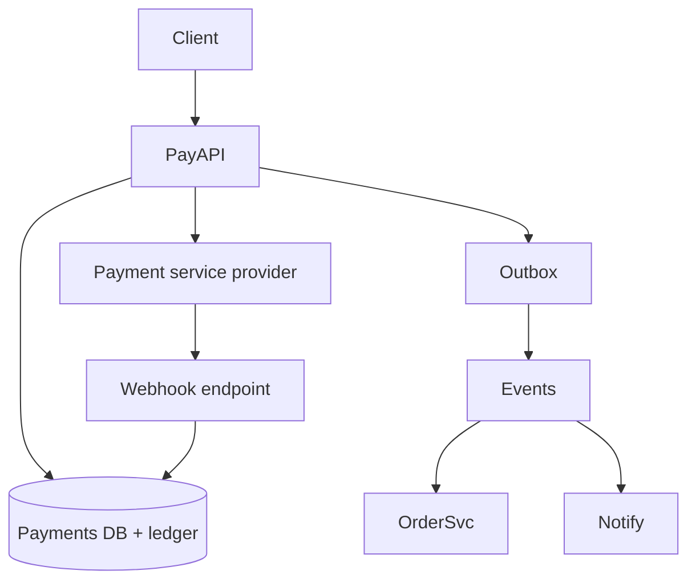

### 6. Deep dive — idempotency & webhooks

Client retries with same `idempotency_key` → return same payment record; never create second charge.

**Flow:** create local payment `pending` → call PSP with key → mark `succeeded/failed` from response **or** webhook (whichever first) using state machine transitions. Store PSP id.

**Ledger:** append-only entries; balances derived or maintained with transactional updates. Never delete history.

**Outbox:** commit payment state + outbox row together; publisher emits `payment.succeeded` for order fulfillment—avoids dual-write bugs.

### 7. Failures

- PSP timeout: leave pending; reconcile via PSP get-or-webhook; do not assume fail.
- Duplicate webhooks: dedupe by event id.
- Partial refunds: new ledger entries; status `partially_refunded`.
- Replay attacks: verify webhook signatures.

### 8. Interview tips

- Lead with idempotency keys and ledger, not crypto buzzwords.
- Explicit state machine for payment status.
- Say “PCI: we don’t store raw PANs; PSP tokens only.”

### State machine

`created → pending → succeeded | failed | canceled` with `refunded` / `partially_refunded` side states. Illegal transitions throw and alert.

### Double-entry example

Charge $10: debit `psp_clearing` 10, credit `merchant_payable` 10 (simplified). Refund reverses with new entries—never edit old ones.

### Webhook authenticity

Verify HMAC signature + timestamp skew window; store event_id uniqueness. Process asynchronously to keep endpoint fast.

### Reconciliation

Daily job compares PSP settlement reports vs ledger; open tickets on drift. Interviewers love hearing this operational loop.

### Evolution

Multi-PSP failover, stored-credential CIT/MIT rules, marketplace split payouts—each builds on the same ledger primitives.

### Interviewer Q&A (drill these aloud)

**Q: What is the consistency model for the core read?**  
A: State it explicitly (e.g. “redirects may see new links within TTL seconds; creates read-your-writes via primary”).

**Q: Single point of failure?**  
A: Name primary DB / broker / region; give mitigation (replicas, multi-AZ, queue buffer).

**Q: How do you prevent duplicate side effects on retry?**  
A: Idempotency keys / upserts / dedupe table—tie to this design’s writes.

**Q: What metric pages you at 3am?**  
A: Pick SLIs: error rate, p99, lag, saturation—not CPU alone.

**Q: How does this evolve to 10× data?**  
A: Partition key, storage tiering, or CQRS—one concrete next step.

### Implementation sketch (pseudocode mindset)

Walk one write handler: validate → authorize → mutate store → enqueue side effects → return. Mention timeouts on dependency calls. This bridges design and coding rounds.

### Load & chaos test plan (talk track)

1. Happy-path load at 2× peak estimate  
2. Dependency latency injection (+500 ms)  
3. Kill one AZ of the data store  
4. Replay poison message  
State what user experience should be in each case.


# Practice

## Timed drill

Practice under the clock. Untimed studying builds knowledge; timed drills build interview performance.

### Setup

- Timer visible (phone is fine)
- Blank paper or Excalidraw
- One prompt from [practice prompts](#practice-prompts)
- No notes for the first attempt of a prompt
- Optional: record audio for self-review

### Drill lengths

| Mode | Time | Use |
|------|------|-----|
| Sprint | 25 min | Clarify + HLD only |
| Standard | 45 min | Full template |
| Senior | 60 min | Full + two deep dives |

### 45-minute script

| Min | Step |
|-----|------|
| 0–6 | Clarify + restate |
| 6–10 | Estimates |
| 10–15 | API + data model |
| 15–28 | HLD write+read paths |
| 28–40 | Deep dive |
| 40–45 | Failures + summary |

If behind at minute 20 with no diagram, cut estimate polish and draw.

### Rules that build discipline

1. Speak aloud even alone—silence hides confusion.
2. Write assumptions; do not keep them in your head.
3. Cross off template steps on the margin.
4. Stop when timer ends; photograph the board; score with the [mock rubric](#mock-rubric).
5. Re-drill the same prompt after ≥48 hours if score < 7/10.

### Pair drill

- Partner A designs 40 min; B plays interviewer with prepared interruptions.
- Swap.
- Feedback only against rubric categories—not vibes.

### Interruption bank (for partners)

- “Reads must be strongly consistent—how does that change things?”
- “Traffic just hit 20×—what breaks first?”
- “We cannot use Redis—alternative?”
- “CEO wants multi-region next quarter—sketch evolution.”
- “That service is down—user experience?”

### Anti-drills (avoid)

- Reading a solution then immediately “practicing” it from memory the same hour (tests short-term memory, not skill).
- Spending 20 minutes picking the perfect prompt.
- Drilling only URL shortener forever.

### Weekly target

- 3× 45-min drills
- 1× 25-min sprint on a weak foundation topic applied (e.g. “rate limit this API”)
- 1× rubric-scored mock

### Interview tip

In a real interview, glance at the clock at minutes 15 and 30. Self-pacing is a senior signal.


## Practice prompts

Twenty-four prompts with hint checklists. Attempt **before** expanding hints. Use the [design template](#design-template).

---

#### 1. URL shortener for an enterprise with SSO
**Hints:** custom domains, authz on create, audit logs, no public enumeration, 301 vs 302.

#### 2. Pastebin / snippet store
**Hints:** TTL expiry job, size limits, raw vs rendered, abuse scanning, CDN for public pastes.

#### 3. Global rate limiter as a platform service
**Hints:** multi-tenant quotas, Redis cluster, fail-open policy, local approximation, 429 semantics.

#### 4. Email + push notification center
**Hints:** preferences, quiet hours, template service, per-channel queues, OTP vs marketing split.

#### 5. News feed with ads injection
**Hints:** hybrid fan-out, ranking candidates, ad service latency budget, privacy, degradation without ads.

#### 6. Group chat for 10–10,000 members
**Hints:** connection gateways, fan-out strategy change by size, history shard by conv_id, reconnect backfill.

#### 7. Collaborative document cursors (not full OT/CRDT)
**Hints:** WebSocket presence, pub/sub rooms, ephemeral state, scale by doc_id, privacy of cursor data.

#### 8. Photo sharing MVP
**Hints:** signed uploads, async variants, feed vs profile grid, CDN, EXIF stripping.

#### 9. Short-video product (TikTok-like For You)
**Hints:** upload/transcode, CDN, recommendation candidate generation (high level), scroll QPS, hot videos.

#### 10. Ride matching in one city
**Hints:** location firehose, geo index, offer/accept locking, ETA vs distance, surge as NFR only.

#### 11. Food delivery tracking
**Hints:** courier locations, order state machine, push updates, map provider dependency, restaurant prep time.

#### 12. Dropbox-like selective sync
**Hints:** block dedupe, metadata revisions, conflict copies, change cursor, namespace sharding.

#### 13. YouTube-like VOD
**Hints:** ABR manifests, transcode fleet, CDN egress cost, copyright ID async, progressive ready state.

#### 14. Live streaming fan-out
**Hints:** ingest server, segmenter, edge relay, latency vs quality, chat sidecar, spike joins.

#### 15. Web crawler for product prices
**Hints:** politeness, robots, frontier priority, anti-bot, change detection, legal constraints mention.

#### 16. Autocomplete for marketplace products
**Hints:** prefix trie, inventory filters, personalization re-rank, edge cache, index freshness.

#### 17. Site search for docs / help center
**Hints:** inverted index, CDC from CMS, BM25, synonyms, permission-filtered results.

#### 18. Hotel booking
**Hints:** room inventory holds, date-range contention, payment webhook, overbooking policy, search vs book path.

#### 19. Concert ticket on-sale
**Hints:** waiting room queue, seat locks, section sharding, bot mitigation, idempotent checkout.

#### 20. Merchant payments + payouts
**Hints:** idempotency keys, ledger, PSP webhooks, payout batching, chargeback state machine.

#### 21. URL fetching preview (link unfurl)
**Hints:** SSRF defenses, timeout budgets, cache previews, size limits, private network blocks.

#### 22. Feature flag service
**Hints:** low-latency reads, sticky bucketing, CDN/edge eval, audit changes, fail behavior.

#### 23. Metrics ingestion & dashboard
**Hints:** write-heavy TSDB, downsampling, cardinality explosion, query path vs ingest path.

#### 24. Multi-tenant job scheduling SaaS
**Hints:** per-tenant fairness, exactly-once effects via ledger/outbox, worker fleets, poison jobs, cron semantics.

---

### How to use hints

1. Attempt 30–45 min with zero hints.
2. Reveal hints; gap-analyze.
3. Redraw once incorporating missed items.
4. Log score in your tracker.

### Stretch modifiers (apply to any prompt)

- “Single region only” vs “active-active two regions”
- “Strongly consistent reads”
- “Budget cut 50%—what do you drop?”
- “Compliance: data must stay in EU”


## Self-review

After each drill, review within 15 minutes while memory is fresh. Honest review beats another unreviewed mock.

### Immediate capture

Photograph/board export. Note:

- Where you hesitated
- Hints the “interviewer” (you) needed
- Any buzzword you could not justify

### Rubric pass

Score yourself with the [mock rubric](#mock-rubric). Resist inflating. If unsure, mark the lower score.

### Content gaps vs delivery gaps

| Content gap | Delivery gap |
|-------------|--------------|
| Didn’t know quorum | Knew it but never said it |
| Wrong shard key | Good design, ran out of time |
| Missed idempotency | Monologued past clarifying Qs |

Study differently: content → foundations pages; delivery → more timed drills and partner interrupts.

### Redraw protocol

From blank: redraw the HLD in 8 minutes. If you cannot, the design was not yet yours.

### Question yourself

1. Did I restate requirements?
2. Did I walk write and read paths?
3. Did I name one explicit tradeoff with a pick?
4. Did I mention a failure mode with user impact?
5. Would a teammate implement from my data model?

### Weekly retrospective

- Top 3 recurring weaknesses
- One foundation page to reread
- One design to re-drill
- Celebrate one improvement (pacing, clearer APIs, etc.)

### Interview tip

Keep a “miss list” flashcard of phrases you forget under stress: *idempotency key*, *signed URL*, *hybrid fan-out*, *fail-open*.


## Mock rubric

Score each category **0–2**. Total **/10**. Target ≥7 before real loops; ≥8 consistently for senior aims.

### Categories

#### 1. Clarification & scope (0–2)

- **0:** Jumps into tech; wrong problem risk
- **1:** Some questions; fuzzy NFRs
- **2:** Crisp functional/NFR/out-of-scope; restates problem

#### 2. Capacity sense (0–2)

- **0:** None or nonsensical
- **1:** Partial; no implications
- **2:** Order-of-magnitude with design implications (“so single DB OK” / “need shard”)

#### 3. API & data model (0–2)

- **0:** Missing
- **1:** Vague entities
- **2:** Concrete endpoints + keys/indexes/shard key aligned to queries

#### 4. High-level design (0–2)

- **0:** Incoherent boxes
- **1:** Plausible but missing path
- **2:** Clear write/read paths; appropriate building blocks; readable diagram

#### 5. Depth & tradeoffs (0–2)

- **0:** Buzzwords only
- **1:** One shallow dive
- **2:** Real alternative comparison; justified pick; failure/scale included

### Intermediate half-points

Use 0.5 steps if needed; avoid all 2s without evidence.

### Mapping to levels (rough)

| Total | Signal |
|-------|--------|
| 0–3 | Needs foundations |
| 4–6 | Junior approaching mid |
| 7–8 | Solid mid |
| 9–10 | Senior-ready *on that prompt* |

One prompt is not a level—look at median across 5 diverse prompts.

### Feedback script for partners

1. Start with one strength.
2. Name top two rubric gaps with examples from the board.
3. Ask candidate to re-explain the weak part in 3 minutes.
4. Do not redesign for them—coach with questions.

### Score sheet template

```
Prompt:
Date:
Clarification: /2
Capacity: /2
API/Data: /2
HLD: /2
Depth: /2
Total: /10
Notes:
Next drill:
```

### Interview tip

When practicing alone, narrate the rubric category you are satisfying (“this is my tradeoff sentence”)—it trains explicit signals interviewers listen for.


---

## Disclaimer

This guide teaches industry-standard concepts (load balancing, sharding, CAP, etc.) in original wording for interview practice. It is independent study material and is not affiliated with any commercial interview course.
