# System Design Interview Guide

A **free, original** curriculum that teaches system design from zero — plain-English foundations, a repeatable interview approach, whiteboard habits, 19 design walkthroughs, and timed practice. Everything lives in this single **README** with **inline Excalidraw-style PNG diagrams**.

> **Disclaimer:** Free original curriculum for learning and interview practice. **Not affiliated** with DesignGurus, Educative, ByteByteGo, karanpratapsingh/system-design, or any paid course. Wording and diagrams are original — topic overlap with public curricula is expected. Industry-standard concepts in original wording. Product names in design titles (e.g. "Instagram-like") are familiar problem frames only.

## What is system design?

**System design** is deciding how the pieces of a product talk to each other, where data lives, and how the whole thing stays fast and alive when lots of people use it — or when something breaks.

Tiny example: a URL shortener looks simple ("turn a long link into a short one"), but you still choose how to store millions of mappings, how redirects stay quick worldwide, and what happens if one database dies. Another everyday example: Instagram-style feed — who can post, how followers see new photos quickly, and how you avoid rebuilding the feed from scratch on every open.

You are not memorizing one company's architecture. You are learning a way to **clarify goals, draw a clear picture, and discuss tradeoffs**.

## If you know nothing, start here

Work top to bottom. Each step links into this same README.

1. **[What is system design?](#what-is-system-design)** — you are here; get the idea in plain language.
2. **[System characteristics](#system-characteristics)** — what "fast," "available," and "consistent" mean with everyday examples.
3. **[IP addresses](#ip-addresses) → [OSI model](#osi-model) → [DNS](#dns) → [Load balancing](#load-balancing) → [Caching & CDN](#caching--cdn)** — how a request finds your app and stays quick.
4. **[API gateway](#api-gateway)** — the mobile "one call vs three calls" story (beginner-friendly comparison diagram).
5. **[Databases](#databases) → [Replication](#replication) → [Messaging](#messaging)** — where data lives and how work is handed off.
6. **[Whiteboard like a strong candidate](#whiteboard-like-a-strong-candidate)** + **[Interview Approach](#interview-approach)** — how to run a 45-minute conversation.
7. **First designs:** [URL shortener](#url-shortener) → [Rate limiter](#rate-limiter) → [Typeahead](#typeahead) → [Nearby places](#nearby-places-yelp-like).

Then deepen Foundations as needed and take on harder walkthroughs (feed, chat, Uber-like, video, etc.).

### Study paths by level

| Path | Focus | Suggested order |
|------|--------|-----------------|
| **Junior** | Building blocks + simple HLD | Start-here path above → URL shortener, rate limiter, typeahead, nearby places → timed drills |
| **Mid** | Full loop + consistency & failures | All Foundations → Approach → feed, group chat, notifications, Instagram-like, checkout → Practice rubric |
| **Senior** | SLOs, multi-region, ops, ranking | CAP, circuit breakers, observability, SLA/SLO → Uber, video, Dropbox, collab doc, recommendations, payments → mocks |

See [Study plan](#study-plan) for 2 / 4 / 8 week schedules and [Level expectations](#level-expectations) for self-calibration.

## How to use this guide

Even if you are **not** interviewing yet, complete Foundations before jumping to full designs — the vocabulary makes every walkthrough easier.

1. Follow **[If you know nothing, start here](#if-you-know-nothing-start-here)** (or the level table above).
2. Skim **[Getting Started](#getting-started)** for interview format and pitfalls when you are interview-bound.
3. Read **[Whiteboard like a strong candidate](#whiteboard-like-a-strong-candidate)** before timed mocks.
4. Use the **[Interview Approach](#interview-approach)** template on every design.
5. Study **[Design Walkthroughs](#design-walkthroughs)**; practice under a timer in **[Practice](#practice)**.

Diagrams are **Excalidraw** hand-drawn style (rough strokes, Virgil font, pastel fills). GitHub embeds are PNGs: ``. Editable sources live in [`diagrams/excalidraw/*.excalidraw`](diagrams/excalidraw/) — open them at [excalidraw.com](https://excalidraw.com) → **Open**. Regenerate with `node scripts/gen_excalidraw_diagrams.mjs`. Optional legacy `.drawio` files remain under [`diagrams/`](diagrams/) if you prefer diagrams.net.

## Diagrams index

Diagrams appear **inline next to the section they teach** — not as a giant gallery up front. Below is a compact filename → topic map. Open any PNG on GitHub; download the matching `.excalidraw` from [`diagrams/excalidraw/`](diagrams/excalidraw/) to edit on [excalidraw.com](https://excalidraw.com).

**Example (API aggregation — the teaching style used throughout Foundations):**

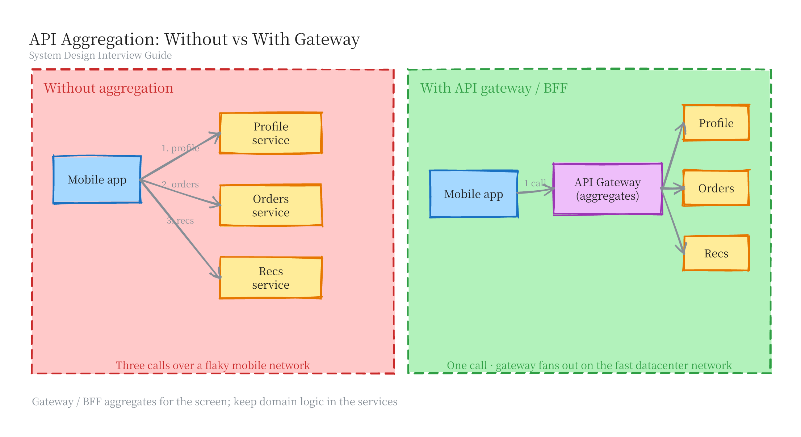

| PNG | Teaches |
|-----|---------|
| [api-aggregation.png](diagrams/png/api-aggregation.png) | API gateway — 3 calls vs 1 |
| [vertical-vs-horizontal-scale.png](diagrams/png/vertical-vs-horizontal-scale.png) | System characteristics — scale up vs out |
| [cache-aside-vs-direct.png](diagrams/png/cache-aside-vs-direct.png) | Caching — without cache vs cache-aside |
| [dns-resolution.png](diagrams/png/dns-resolution.png) | DNS |
| [load-balancing.png](diagrams/png/load-balancing.png) | Load balancing |
| [caching-strategies.png](diagrams/png/caching-strategies.png) | Caching strategies |
| [sharding-consistent-hash.png](diagrams/png/sharding-consistent-hash.png) | Sharding & consistent hashing |
| [replication-failover.png](diagrams/png/replication-failover.png) | Replication |
| [cap-pacelc.png](diagrams/png/cap-pacelc.png) | CAP & PACELC |
| [messaging.png](diagrams/png/messaging.png) | Messaging (queue vs pub/sub) |
| [rate-limiting.png](diagrams/png/rate-limiting.png) | Rate limiting |
| [websocket-vs-polling.png](diagrams/png/websocket-vs-polling.png) | Real-time: polling vs streams |
| [bloom-filter.png](diagrams/png/bloom-filter.png) | Bloom filters |
| [circuit-breaker.png](diagrams/png/circuit-breaker.png) | Circuit breakers |
| [observability.png](diagrams/png/observability.png) | Observability |
| [microservices-vs-monolith.png](diagrams/png/microservices-vs-monolith.png) | Monolith vs microservices |
| [url-shortener.png](diagrams/png/url-shortener.png) | URL shortener design |
| [news-feed.png](diagrams/png/news-feed.png) | News feed |
| [chat-messaging.png](diagrams/png/chat-messaging.png) | Chat |
| [uber-dispatch.png](diagrams/png/uber-dispatch.png) | Uber-like dispatch |
| [video-streaming.png](diagrams/png/video-streaming.png) | Video streaming |
| [dropbox.png](diagrams/png/dropbox.png) | Dropbox-like |
| [notification-system.png](diagrams/png/notification-system.png) | Notifications |
| [nearby-places.png](diagrams/png/nearby-places.png) | Nearby places |
| [group-chat.png](diagrams/png/group-chat.png) | Group chat |
| [ecommerce-checkout.png](diagrams/png/ecommerce-checkout.png) | Checkout |
| [recommendation-feed.png](diagrams/png/recommendation-feed.png) | Recommendations |
| [search-inverted-index.png](diagrams/png/search-inverted-index.png) | Search |
| [typeahead.png](diagrams/png/typeahead.png) | Typeahead |
| [web-crawler.png](diagrams/png/web-crawler.png) | Web crawler |
| [ticket-booking.png](diagrams/png/ticket-booking.png) | Ticket booking |
| [payments.png](diagrams/png/payments.png) | Payments |
| [interview-flow.png](diagrams/png/interview-flow.png) | Interview flow |
| [whiteboard-template.png](diagrams/png/whiteboard-template.png) | Whiteboard template |
| [osi-model.png](diagrams/png/osi-model.png) | OSI model layers |
| [tcp-vs-udp.png](diagrams/png/tcp-vs-udp.png) | TCP vs UDP |
| [clustering-active-active-passive.png](diagrams/png/clustering-active-active-passive.png) | Clustering active-active / passive |
| [storage-file-block-object.png](diagrams/png/storage-file-block-object.png) | File vs block vs object storage |
| [saga-vs-2pc.png](diagrams/png/saga-vs-2pc.png) | Sagas vs 2PC |
| [n-tier.png](diagrams/png/n-tier.png) | N-tier architecture |
| [cqrs.png](diagrams/png/cqrs.png) | CQRS read/write models |
| [geohash-quadtree.png](diagrams/png/geohash-quadtree.png) | Geohash & quadtrees |
| [redundant-load-balancer.png](diagrams/png/redundant-load-balancer.png) | Redundant load balancers |
| [cache-write-policies.png](diagrams/png/cache-write-policies.png) | Cache write-through / around / back |

## Table of Contents

- [What is system design?](#what-is-system-design)
- [If you know nothing, start here](#if-you-know-nothing-start-here)
- [Diagrams index](#diagrams-index)

### 0. Getting Started

- [How interviews work](#how-interviews-work)
- [Level expectations](#level-expectations)
- [Prerequisites](#prerequisites)
- [Study plan](#study-plan)
- [Common pitfalls](#common-pitfalls)

### 1. Foundations

- [System characteristics](#system-characteristics)
- [IP addresses](#ip-addresses)
- [OSI model](#osi-model)
- [Networking basics](#networking-basics)
- [TCP and UDP](#tcp-and-udp)
- [DNS](#dns)
- [TLS, SSL, and mTLS](#tls-ssl-and-mtls)
- [Proxies](#proxies)
- [Real-time communication](#real-time-communication)
- [Load balancing](#load-balancing)
- [Clustering](#clustering)
- [Storage fundamentals](#storage-fundamentals)
- [API gateway](#api-gateway)
- [Rate limiting](#rate-limiting)
- [Caching & CDN](#caching-cdn)
- [Databases](#databases)
- [Normalization and denormalization](#normalization-and-denormalization)
- [ACID and BASE](#acid-and-base)
- [Transactions](#transactions)
- [Distributed transactions](#distributed-transactions)
- [Indexes](#indexes)
- [Sharding](#sharding)
- [Consistent hashing](#consistent-hashing)
- [Replication](#replication)
- [Database federation](#database-federation)
- [CAP & PACELC](#cap-pacelc)
- [Messaging](#messaging)
- [Enterprise Service Bus (ESB)](#enterprise-service-bus-esb)
- [Delivery guarantees](#delivery-guarantees)
- [Coordination](#coordination)
- [Bloom filters](#bloom-filters)
- [Checksums and data integrity](#checksums-and-data-integrity)
- [Distributed file systems](#distributed-file-systems)
- [Circuit breakers and bulkheads](#circuit-breakers-and-bulkheads)
- [SLA, SLO, and SLI](#sla-slo-and-sli)
- [Disaster recovery](#disaster-recovery)
- [Observability](#observability)
- [REST vs GraphQL vs gRPC](#rest-vs-graphql-vs-grpc)
- [N-tier architecture](#n-tier-architecture)
- [Monolith vs microservices](#monolith-vs-microservices)
- [Event-driven architecture (EDA)](#event-driven-architecture-eda)
- [Event sourcing](#event-sourcing)
- [CQRS](#cqrs)
- [Service discovery](#service-discovery)
- [VMs and containers](#vms-and-containers)
- [Geohashing and Quadtrees](#geohashing-and-quadtrees)
- [OAuth 2.0, OIDC, and SSO](#oauth-20-oidc-and-sso)
- [Security](#security)

### 2. Interview Approach

- [Whiteboard like a strong candidate](#whiteboard-like-a-strong-candidate)
- [Clarify requirements](#clarify-requirements)
- [Capacity estimation](#capacity-estimation)
- [Design template](#design-template)
- [Deep dive & failures](#deep-dive-failures)
- [Tradeoffs cheatsheet](#tradeoffs-cheatsheet)

### 3. Design Walkthroughs

- [URL shortener](#url-shortener)
- [Rate limiter](#rate-limiter)
- [Notification system](#notification-system)
- [News feed](#news-feed)
- [Chat & messaging](#chat-messaging)
- [Instagram-like](#instagram-like)
- [Uber-like](#uber-like)
- [Video streaming](#video-streaming)
- [Dropbox-like](#dropbox-like)
- [Web crawler](#web-crawler)
- [Typeahead](#typeahead)
- [Search](#search)
- [Ticket booking](#ticket-booking)
- [Payments](#payments)
- [Nearby places (Yelp-like)](#nearby-places-yelp-like)
- [Group chat (Slack / Discord-like)](#group-chat-slack-discord-like)
- [Collaborative document](#collaborative-document)
- [E-commerce checkout and inventory](#e-commerce-checkout-and-inventory)
- [Recommendation and feed ranking (senior sketch)](#recommendation-and-feed-ranking-senior-sketch)

### 4. Practice

- [Timed drill](#timed-drill)
- [Practice prompts](#practice-prompts)
- [Self-review](#self-review)
- [Mock rubric](#mock-rubric)

## License

MIT — see [LICENSE](LICENSE). Contributions of original content welcome; do not paste copyrighted course material.

---


---


> **Learning first:** If you have never studied system design, finish the [start-here path](#if-you-know-nothing-start-here) and core **Foundations** before optimizing for interview performance. The sections below assume you want the interview lens; the concepts are the same either way.

## How interviews work

System design interviews evaluate how you reason about large-scale software under ambiguity. Unlike coding rounds, there is rarely a single correct diagram. Interviewers watch *how* you clarify, estimate, structure a solution, and discuss tradeoffs when requirements shift.

### Typical format

Most companies schedule **45–60 minutes**. A common arc:

1. **Prompt** (1–2 min) — “Design a URL shortener” or “Design Uber.”
2. **Clarify** (5–8 min) — functional and non-functional requirements, scope cuts.
3. **Back-of-envelope** (5 min) — QPS, storage, bandwidth; order-of-magnitude only.
4. **High-level design** (10–15 min) — boxes and arrows: clients, APIs, services, data stores, queues.
5. **Deep dive** (15–20 min) — pick 1–2 hotspots (sharding key, feed fan-out, consistency).
6. **Failures & scale** (5–10 min) — what breaks at 10× traffic; single points of failure.
7. **Wrap-up** (2 min) — summarize tradeoffs you accepted.

Senior and staff candidates spend more time on failure modes, multi-region, and operational concerns. Junior candidates are judged more on structure and vocabulary of core building blocks.

### What interviewers actually score

| Signal | Strong | Weak |
|--------|--------|------|
| Clarification | Asks about scale, consistency, clients | Jumps to tech stack |
| Structure | Clear API + data model + HLD | Random components |
| Tradeoffs | Names both sides, picks with reason | “We’ll use Kafka because it’s popular” |
| Depth | Explains *why* a shard key or cache works | Buzzwords only |
| Collaboration | Checks in, adapts to hints | Monologues past the interviewer |

They are not grading whether you memorize a particular company’s architecture. They care that you can **drive a design conversation** like a tech lead.

### Spoken vs drawn

Talk while you draw. Narrate: “I’ll start with write path… then read path…” Use a whiteboard, Excalidraw, or shared doc. Label every arrow with protocol or data shape when it matters (HTTP, gRPC, Kafka topic, SQL).

Keep the diagram **readable**: 6–12 boxes at HLD. Nested detail belongs in the deep dive, not the first sketch.

### Functional vs non-functional

**Functional** — what the product does: shorten URL, return redirect, list feed.

**Non-functional** — how well: latency p99, availability (e.g. 99.9%), consistency model, cost, multi-region, privacy.

Interviewers often care *more* about non-functionals once the happy path exists. Always ask: “What’s more important if we must choose—latency or strong consistency?”

### Collaboration norms

- State assumptions out loud; invite correction.
- When stuck, propose two options and ask which to explore.
- Time-box: if deep dive eats the clock, surface the remaining risks verbally.
- Do not pretend certainty. “I’d validate this with load tests” is mature.

### Common company flavors

- **Product companies** — user-facing features, mobile clients, CDN, personalization.
- **Infrastructure / platform** — multi-tenant APIs, SLOs, quotas, control plane vs data plane.
- **Fintech / health** — correctness, auditability, compliance, idempotency.
- **Ads / marketplace** — auctions, consistency under contention, fraud.

Adapt vocabulary to the domain without inventing fake compliance theater.

### After the interview

Write down what you drew and where you hesitated. Those gaps become your study list. Re-run the same prompt a week later under a timer; improvement is usually obvious.

### Interview tip

Treat the interviewer as a partner, not a judge. Phrase decisions as proposals: “I’d put a write-through cache here—does that match the consistency you care about?”

### Self-check

1. Sketch a 45-minute agenda for “Design a notification system” with minute budgets.
2. List three non-functional questions you always ask before drawing.
3. Explain the difference between a high-level design and a deep dive in one paragraph.

### Sample dialogue (first 8 minutes)

**Interviewer:** Design a URL shortener.

**You:** Before drawing—who creates links, and do we need auth? Rough scale—startup or consumer viral? Is analytics in scope? Prefer low redirect latency or rich click tracking if they conflict?

**Interviewer:** Public create OK; 100M redirects/day; basic click counts; latency matters more than perfect counts.

**You:** Restating: public short links, ~100M redirects/day, eventual click stats OK, redirect p99 should be tight. Out of scope: custom marketing pages. I’ll estimate, then API + schema, then HLD with cache on the read path.

That dialogue shows collaboration, scope cuts, and NFR prioritization—the behaviors interviewers reward.

### Whiteboard hygiene

- Write big; leave a margin for deep-dive notes.
- Number arrows if order matters.
- Erase dead ends instead of cluttering.
- If virtual, duplicate the frame before a risky redraw.

### Signals that you are running out of time

At minute 35 with no failure talk, skip a second deep dive. Summarize remaining risks in bullets: “I didn’t detail multi-region; I’d start with async replica and DNS failover.” Explicit incompleteness beats silent omission.

### Mapping to other rounds

System design complements coding rounds: coding shows implementation detail; design shows decomposition. Behavioral rounds may ask you to recount a design decision—practice articulating tradeoffs from these drills as stories.

### Closing the loop after practice

Each practice interview should produce one artifact: a one-page redraw plus three bullets of what you would improve. Over a month those pages become your personal playbook—original notes beat rereading the same blog.

### Checklist before an onsite loop

- [ ] Redrew one core design from memory today
- [ ] Reviewed personal miss list (idempotency, fan-out, etc.)
- [ ] Slept; scheduled buffer between interviews
- [ ] Prepared questions for them about real scale pain (shows curiosity)

You cannot cram foundations the morning of—rely on the template muscle.

## Level expectations

Companies map system design performance to levels differently, but patterns are stable. Use this as a **self-calibration**, not a guarantee of any employer’s rubric.

### Junior / L3–L4 (new grad to ~2 years)

**Expected**

- Know core building blocks: LB, cache, DB, queue, CDN.
- Produce a simple HLD for a mid-size service (single region, one primary DB).
- Discuss basic tradeoffs: SQL vs NoSQL, cache aside vs write-through.
- Estimate QPS and storage within an order of magnitude.

**Not yet required**

- Multi-region active-active, complex consensus, custom storage engines.
- Owning ambiguous product scope for a platform.

**How interviews feel:** interviewer scaffolds more; may suggest “add a cache here.” Success = clear structure + correct component purposes.

### Mid / L4–L5 (solid IC)

**Expected**

- Drive the full clarify → estimate → HLD → deep dive loop.
- Choose data model and partition key with justification.
- Discuss consistency, idempotency, retries, and backpressure.
- Identify SPOFs and sketch mitigation (replicas, queues, circuit breakers).
- Compare 2–3 designs for a hotspot (e.g. fan-out on write vs read).

**Stretch:** basic multi-region (primary + DR), rate limiting, search indexing pipeline.

### Senior / L5–L6

**Expected**

- Frame requirements as SLOs and error budgets.
- Design for failure first: partial outages, poison messages, clock skew.
- Multi-tenant concerns: noisy neighbors, quotas, isolation.
- Operational story: metrics, tracing, deploy strategy, rollback.
- Cost awareness (storage tiers, egress, hot partitions).
- Navigate “it depends” with explicit decision criteria.

**Deep dives:** leader election, exactly-once *effects*, secondary indexes at scale, geo-partitioning.

### Staff+ / L6–L7+

**Expected**

- System of systems: control plane, data plane, developer platforms.
- Cross-org constraints: compliance, data residency, vendor lock-in.
- Evolution: how the design migrates from MVP to global without rewrite.
- Influence: explain tradeoffs to execs and peer teams.
- Failure storytelling from real production experience (or rigorously reasoned fiction).

### What changes by level (same prompt)

Prompt: “Design a news feed.”

| Level | Focus |
|-------|--------|
| Junior | Timeline API, posts table, cache recent feeds |
| Mid | Fan-out strategy, ranking, celebrity problem |
| Senior | Multi-region, privacy, ads injection, degradation modes |
| Staff | Platform for feed products, experimentation, cost of fan-out fleet |

### Communicating your level

Do not claim a level; demonstrate it. Mid candidates who overreach into consensus protocols without grounding look worse than those who nail a clean single-region design with solid failure analysis.

If the interviewer pushes higher, follow them. If they stay concrete, stay concrete.

### Interview tip

Ask early: “Should we optimize for a mid-size launch or Facebook-scale day one?” That sets the depth bar and prevents underrating or overengineering.

### Self-check

1. For your target level, list five topics you must speak to fluently.
2. Rewrite a junior HLD for URL shortener into a senior version (add 3 concerns).
3. What signal separates “knows Kafka” from “knows when *not* to use Kafka”?

### Calibrating without an official ladder

If your company uses different names (E3/E5, ICT2/ICT4), map via responsibility: do you own a feature, a service, or a multi-service problem space? Design interview expectations track ownership scope more than years.

### Portfolio evidence (optional)

Side projects that include load testing notes, failure injection, or a written ADR (architecture decision record) give you concrete stories. You do not need production Netflix scale; you need credible reasoning tied to something you built or deeply studied.

### When the interviewer levels you up mid-session

They ask about multi-region conflict resolution after you finished a clean single-region design. Treat it as a compliment and a new scope: “For active-active I’d partition by user_id hash and avoid cross-region sync on the hot path; conflicts on profile edits would use last-write-wins with version vectors—acceptable for bios, not for balances.”

### When they level you down

They keep steering to basics. Do not force Raft. Nail clarity on cache, DB, and LB. Passing a mid-style interview solidly beats failing a staff-style digression.

### Self-study implications by target

- Targeting mid: finish all foundations self-checks; five designs timed.
- Targeting senior: add failure drills and two multi-region evolutions.
- Targeting staff: practice explaining cost and org boundaries; design a platform, not only an app.

### Anti-impostor note

Levels are noisy across companies. Use this page to choose study depth, not to spiral. Improvement shows up as cleaner boards and faster clarification—not as a title.


## Prerequisites

You do not need to have built Netflix to pass system design interviews. You do need fluency with a shared vocabulary and comfort reasoning about distributed systems at a whiteboard.

### Must-have concepts

#### Networking & HTTP

- Request/response, status codes, headers, cookies vs tokens.
- TCP vs UDP at a high level; why HTTP/2 multiplexing helps.
- DNS resolution and TLS termination (where certs live).
- Sticky sessions vs stateless servers.

#### Data & storage

- Primary key, secondary index, B-tree vs hash index intuition.
- Transactions (ACID) vs eventual consistency.
- Normalization vs denormalization for read-heavy paths.
- Blob/object storage vs block vs file (when videos land in S3-like stores).

#### Concurrency

- Locks, optimistic concurrency (version columns), idempotency keys.
- Race conditions on inventory / double spend style problems.

#### Distributed systems intuition

- Replication lag, failover, split brain (awareness, not PhD).
- Queues absorb spikes; consumers must be idempotent for at-least-once.
- Caching can serve stale data; define TTL and invalidation.

#### Observability

- Metrics (RED/USE), structured logs, distributed traces.
- SLIs/SLOs vs raw uptime marketing numbers.

### Helpful but learn-as-you-go

- Raft/Paxos mechanics (know *why* consensus exists; details optional until senior).
- Column families, LSM trees, bloom filters (nice in storage deep dives).
- Kubernetes internals (usually out of scope unless platform role).
- Specific cloud product names—prefer capability (“object store”) unless asked.

### Coding prerequisites

System design is not leetcode, but you should be able to:

- Sketch API handlers and SQL/NoSQL schemas.
- Reason about time/space for fan-out algorithms.
- Write pseudocode for rate limiters, consistent hashing, or feed merge.

### Math comfort

Order-of-magnitude arithmetic:

- 1 day ≈ 10^5 seconds.
- 1 KB × 1M users = 1 GB.
- 1 Gbps ≈ 125 MB/s.
- Powers of two for IDs and shards.

Bring a calculator if allowed; precision beyond ~2 significant figures rarely matters.

### Soft prerequisites

- Comfort saying “I don’t know; here’s how I’d find out.”
- Willingness to draw imperfect diagrams and revise them.
- English (or interview language) clear enough to narrate tradeoffs.

### How to fill gaps quickly

| Gap | Fast path |
|-----|-----------|
| HTTP / REST | Build a tiny CRUD API; inspect with curl |
| SQL | Design 3NF then denormalize for a feed query |
| Redis | Run locally; try GET/SET, TTL, INCR, sorted sets |
| Queues | Produce/consume one Kafka or RabbitMQ tutorial |
| CAP | Read the CAP & PACELC page in this guide |

### Interview tip

If a prerequisite is weak, say so and stay at the right abstraction: “I’m less deep on Raft—I’d use a managed consensus store for leader election and focus on the application’s fencing tokens.”

### Self-check

1. Explain cache-aside in three sentences with a failure mode.
2. Compute rough storage for 100M users × 1 KB profile.
3. Name two reasons sticky sessions hurt horizontal scaling.

### Mini-labs (half-day each)

1. **Postgres:** create `users`/`orders`, add indexes, run `EXPLAIN ANALYZE` on a slow query, fix it.
2. **Redis:** implement a token-bucket with a Lua script; test concurrent clients.
3. **Queue:** produce 10k messages; crash a consumer mid-batch; prove idempotent processing with a dedupe table.
4. **HTTP load:** `hey` or `k6` against a local API; watch p99 rise when you add a sync sleep.

These labs turn vocabulary into instinct.

### Reading vs building

If you only read, you will freeze when asked “how does the cache fill on miss?” Building tiny versions creates motor memory for sequence diagrams.

### Glossary you should own (one-liners)

- **SLO:** target on an SLI (e.g. 99.9% success).
- **RPO/RTO:** data loss window / restore time.
- **Idempotent:** same request twice → same effect.
- **Hot partition:** one shard receives disproportionate load.
- **Backpressure:** slowing accept rate when downstream saturates.

Write your own one-liners; do not memorize a vendor glossary.

### When prerequisites feel endless

Stop expanding the list. If you can explain and sketch the must-haves above, start designs. Fill micro-gaps just-in-time when a prompt demands them (geo indexes for Uber, ABR for video).


## Study plan

A focused plan beats endless article hopping. Below are tracks for **2 weeks**, **4 weeks**, and **8 weeks**. Adjust hours to your calendar; consistency matters more than heroic weekends.

### Principles

1. **Active recall** — close the page and redraw from memory.
2. **One template** — always clarify → estimate → API → data → HLD → deep dive → failures.
3. **Timer** — at least half your design practice is timed.
4. **Original notes** — rewrite concepts in your words; do not paste paid course text.
5. **Spaced repetition** — revisit weak foundations weekly.

### 2-week crash (already coding-strong)

| Day | Focus |
|-----|--------|
| 1 | How interviews work + pitfalls + characteristics |
| 2 | Networking, LB, API gateway, rate limiting |
| 3 | Caching/CDN, databases, indexes |
| 4 | Sharding, replication, CAP/PACELC |
| 5 | Messaging, delivery guarantees, coordination, security |
| 6 | Approach section end-to-end; one timed URL shortener |
| 7 | Rate limiter + notification system |
| 8 | News feed + chat |
| 9 | Pick 2 of: Instagram, Uber, video, Dropbox |
| 10 | Search or typeahead + web crawler |
| 11 | Ticket booking + payments |
| 12 | Timed drills (2 prompts) |
| 13 | Weak-topic remediation |
| 14 | Full mock with rubric; sleep |

Target: ~2–3 hours/day.

### 4-week standard

**Week 1 — Foundations**  
One or two foundation pages per day. Answer self-checks aloud. Build a one-page “building blocks” cheat sheet (your words).

**Week 2 — Approach + easy designs**  
Master capacity estimation. Timed: URL shortener, rate limiter, typeahead.

**Week 3 — Core social / realtime**  
News feed, chat, notifications, Instagram-like. Compare fan-out strategies across them.

**Week 4 — Harder domains + mocks**  
Uber, video, Dropbox, search, booking, payments. Three full mocks. Review rubric gaps.

### 8-week thorough

- Weeks 1–2: foundations + small labs (Redis, Postgres explain, a queue).
- Weeks 3–4: approach + all “easy/medium” designs twice (once untimed, once timed).
- Weeks 5–6: hard designs + failure drills.
- Week 7: 20 practice prompts at 25–40 min each (rotate).
- Week 8: mocks every other day; light review otherwise.

### Weekly rhythm (any track)

- **Mon–Thu:** learn + one short design (25 min).
- **Fri:** foundations self-check battery.
- **Sat:** full 45–60 min mock.
- **Sun:** light review or rest.

### Tracking progress

Maintain a simple table:

| Prompt | Date | Time | Score /10 | Weak spots |
|--------|------|------|-----------|------------|
| URL shortener | … | 40m | 7 | ID collision story |

Re-attempt any score under 7 after three days.

### Pairing & mocks

- Swap roles with a peer: 40 min design + 10 min feedback using the mock rubric.
- Record yourself (audio) once; filler words and skipped clarify steps become obvious.
- Prefer peers who will interrupt with “what’s the consistency model?” over silent listeners.

### Anti-patterns in studying

- Collecting 50 bookmarks unread.
- Only reading solutions without redrawing.
- Skipping estimation every time “because I’m slow at math.”
- Memorizing one company’s blog as *the* answer.

### Interview tip

The night before an interview, redraw **one** familiar design from blank paper in 20 minutes. Confidence compounds from muscle memory of the template, not from cramming a new domain.

### Self-check

1. Which track matches your timeline, and what is tomorrow’s single task?
2. Name the seven steps of the design template in order.
3. How will you measure that a foundation topic is “done”?

### Daily session template (90 minutes)

1. **10 min** — revisit yesterday’s miss list.
2. **30 min** — one foundation page + self-checks aloud.
3. **40 min** — timed design (or 25 min sprint + 15 min review).
4. **10 min** — score rubric; log tracker row.

### Spaced repetition queue

Keep a simple flash list in a text file: topics you missed. Each day process five cards. When you answer cleanly three sessions in a row, retire the card.

### Using this site without drowning

Do not read all designs front-to-back first. Alternate: foundation → apply in a design → practice prompt. The sidebar is a map, not a linear novel.

### Mock scheduling

Book mocks before you “feel ready.” Feelings lag skill. Early awkward mocks teach pacing faster than solitary perfectionism.

### Adjusting when work is busy

Minimum viable week: two 45-min drills + one foundation topic. Consistency across busy seasons beats binge-and-burnout cycles.

### Definition of done for the plan

You are ready to interview when: median mock ≥7/10 across five varied prompts, clarification is automatic, and you can discuss failures without blanking. Titles and companies vary; that bar travels.


## Common pitfalls

Avoiding these mistakes raises interview performance as much as learning new tech.

### 1. Jumping to the whiteboard

Diving into Kafka and Cassandra before asking who the users are wastes the room’s trust. **Clarify for 5 minutes.** Scope cuts are features, not failures.

### 2. Boiling the ocean

Designing global multi-region active-active for a campus MVP signals poor judgment. Match architecture to stated scale. Offer an evolution path: “Start single region; add read replicas; later geo-partition.”

### 3. Buzzword bingo

“We’ll use event sourcing, CQRS, service mesh, and blockchain.” If you cannot explain the problem each solves *in this design*, drop it. Prefer boring technology that fits.

### 4. Ignoring the data model

Boxes without schemas hide the real hard parts (query patterns, cardinality, hot keys). Always show primary entities, keys, and the top 3 queries.

### 5. Single point of failure blindness

One primary DB, one queue broker, one region—all fine for MVP if you **name** the risk and mitigation. Pretending it is HA when it is not is worse.

### 6. Consistency hand-waving

“Eventually consistent” is not a design. State *what* can be stale, for how long, and whether users notice (feed ranking vs bank balance).

### 7. Forgetting the write path or the read path

Many candidates design only reads (CDN, cache) or only writes (ingestion). Walk both. Asymmetry is normal; silence is not.

### 8. No backpressure story

At 10× load something sheds load: queue, rate limit, degrade reads, reject writes. Interviews love hearing graceful degradation.

### 9. Overprecise estimates

Arguing about 37 vs 42 bytes per row burns time. Use 50 bytes and move on. Show the formula; round aggressively.

### 10. Not checking in

Monologues lose interviewers. Every 5–7 minutes: “Does this direction work?” Incorporate hints immediately—flexibility is a scored signal.

### 11. Security as an afterthought

AuthN/AuthZ, PII, secrets, and abuse (scraping, spam) belong in NFRs early for user-facing systems. One slide of threat awareness beats zero.

### 12. Chatty microservices

Twenty services for a URL shortener is satire. Start with a modular monolith or few services; split when ownership or scaling axes demand it.

### 13. Cache as magic

Caches need keys, TTLs, stampede control, and invalidation. “Put Redis in front” without key design fails deep dives.

### 14. Exactly-once mythology

End-to-end exactly-once is rare. Prefer “at-least-once + idempotent consumers” and say so confidently.

### 15. Ignoring time and clocks

Booking, payments, and leadership election care about time. Mention NTP skew, server timestamps vs device time, and fencing tokens where relevant.

### Recovery phrases

When you catch yourself in a pitfall:

- “Let me step back and clarify success metrics.”
- “I’ll simplify to a single region first.”
- “The risk with this choice is X; mitigation is Y.”

### Interview tip

Keep a mental checklist on the corner of the board: **Clarify · Estimate · API · Data · HLD · Deep · Fail**. Crossing each off prevents silent omissions.

### Self-check

1. Pick three pitfalls you personally hit; write a prevention habit for each.
2. Critique this statement: “Redis makes it strongly consistent.”
3. How would you politely cut scope when an interviewer says “design Twitter”?

### Pitfall patterns by candidate background

**Backend specialists** often skip product clarification and jump to infra. Force yourself to ask user-facing questions first.

**Frontend specialists** may under-specify data stores. Practice primary keys and query patterns until comfortable.

**Academics** may over-index on CAP proofs. Translate to user-visible staleness and concrete configs.

**Staff-at-current-job interviewing mid elsewhere** may overbuild. Ask for target scale every time.

### Language habits that hurt

- “Basically just…” (hides complexity you should own)
- “We’ll figure it out later” without a risk note
- “Everyone uses X” as justification

Replace with: “Tradeoff is…; given NFR… we choose…”

### Recovering mid-interview

If you realize you skipped clarify: “I’d like to rewind for two requirements questions—it will change the storage choice.” Interviewers almost always allow it; it shows maturity.

### Postmortem template after a failed mock

1. Which pitfall numbers applied?
2. What trigger made you fall in?
3. What phrase or checklist item prevents it next time?

Put the prevention phrase on your miss list.

### Final reminder

Pitfalls are normal. The difference between candidates is how quickly they notice and correct. Build notice-and-correct as a skill equal to knowing Redis.


## System characteristics

**In plain English:** Before drawing boxes, decide what "good" means for the product — how fast, how reliable, how consistent. For an Instagram-like feed you might care more about quick loads than every like appearing instantly everywhere.

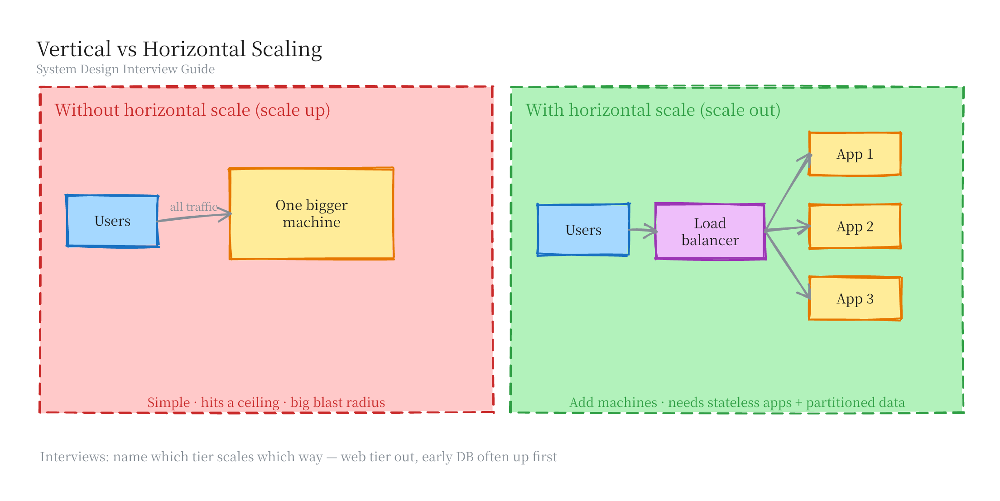

> **Key takeaway:** Name concrete targets (latency, availability, consistency) early; those numbers drive every later choice.

### How it works

Interview designs live or die on these non-functional traits. Name them early, pick targets, and let those targets drive architecture.

### Scalability

Ability to handle growth in traffic or data by adding resources.

- **Vertical** — bigger machine; simple, limited, failover harder.
- **Horizontal** — more machines; needs stateless app tier and partitionable data.

**When to use which:** vertical for early MVP databases; horizontal for web tiers and shardable workloads.

**Tradeoffs:** horizontal adds distributed complexity (partial failure). Vertical hits a ceiling and a bigger blast radius.

**Failure modes:** hot partitions, coordination bottlenecks, shared resources (single Redis) that do not scale with app replicas.

### Availability

Fraction of time the system successfully serves requests. Often expressed as “nines” (99.9% ≈ 43 min downtime/month).

High availability uses redundancy, health checks, failover, and multi-AZ deployment. Availability is not the same as correctness.

**Tradeoffs:** more replicas raise cost and replication lag risk. Active-active multi-region is expensive operationally.

**Failure modes:** failover flapping, split brain, cascading retries that amplify outages.


### Availability in depth

Availability is often quoted in **nines**. Approximate downtime if the system must run all year:

| Availability | Downtime per year (approx.) | Per month (approx.) |
|--------------|-----------------------------|---------------------|
| 99% (2 nines) | 3.65 days | ~7.2 hours |
| 99.9% (3 nines) | 8.77 hours | ~43.8 minutes |
| 99.99% (4 nines) | 52.6 minutes | ~4.4 minutes |
| 99.999% (5 nines) | 5.26 minutes | ~26 seconds |

(Numbers are standard public math from `downtime ≈ (1 − availability) × period`.)

#### Sequence vs parallel intuition

- Components in **sequence** (request must pass A then B): availabilities **multiply** → total gets worse (`0.999 × 0.999 ≈ 0.998`).
- Components in **parallel** (either replica can serve): failure probabilities multiply → total gets better.

#### Availability vs reliability

**Reliability** is about doing the right job without failure for a period; **availability** is about being reachable to accept work. A flaky system with instant restarts can look “available” while still being unreliable for long jobs.

#### HA vs fault tolerance

- **High availability** — minimize downtime; brief failover blips may be OK.
- **Fault tolerance** — continue without visible interruption, usually via fuller redundancy and higher cost.


### Latency & throughput

- **Latency** — time for one request (p50/p95/p99 matter more than averages).
- **Throughput** — successful work per second (QPS, messages/sec).

Optimize the path users wait on. Batching raises throughput but can hurt latency.

**Tradeoffs:** synchronous fan-out vs async; consistency checks add latency.

**Failure modes:** head-of-line blocking, GC pauses, lock contention, cold caches.

### Consistency

Agreement on data values across replicas and readers. Models include strong, read-your-writes, causal, eventual.

**When:** money and inventory lean strong; social feeds often tolerate eventual.

**Tradeoffs:** strong consistency limits availability or latency under partition (see CAP/PACELC).

**Failure modes:** stale reads after failover, lost updates without concurrency control.

### Durability

Once acknowledged, data survives crashes. Achieved via fsynced WAL, multi-disk/AZ replication, backups.

**Tradeoffs:** sync replication increases write latency; async risks data loss on primary failure.

**Failure modes:** acknowledging before fsync; backups never tested; correlated disk failures.

### Resilience

Graceful behavior under stress: timeouts, retries with jitter, circuit breakers, bulkheads, load shedding, poison-pill isolation.

**Tradeoffs:** aggressive retries can DDoS yourself; long timeouts hold resources.

### Observability

Ability to understand system state from metrics, logs, traces. Without it, you cannot operate SLOs.

**Tradeoffs:** high-cardinality metrics explode cost; sampling traces may miss rare bugs.

### Interview tip

Write NFRs as numbers: “p99 read < 200 ms, 99.9% availability, RPO < 1 min.” Vague “highly available” earns shrugs.

### Self-check

1. Contrast availability vs durability with an example.
2. Why can higher throughput increase p99 latency?
3. Give a product feature that needs strong consistency and one that does not.


## IP addresses

**In plain English:** An IP address is a phone number for a machine on a network. Without it, packets do not know where to go. Interviews rarely ask you to subnet by hand — they care that you know public vs private, why NAT exists, and how IPs show up in allowlists, geo routing, and load balancers.

> **Key takeaway:** Treat IPs as identity + location hints that networking, security, and geo features all depend on — not as trivia.

### IPv4 vs IPv6

| | **IPv4** | **IPv6** |
|--|----------|----------|
| Size | 32-bit (about 4 billion addresses) | 128-bit (vastly more) |
| Look | `203.0.113.10` | `2001:db8::1` |
| Reality | Still dominant on many edges | Growing; dual-stack common |

Designs usually say “clients resolve A/AAAA records” and move on. Mention IPv6 when discussing dual-stack LBs or exhausting private IPv4 space inside huge VPCs.

### Public vs private

- **Public** — routable on the internet (your LB VIP, a user’s home egress IP as seen by your API).
- **Private** — only meaningful inside a network (`10.x`, `172.16–31.x`, `192.168.x` and IPv6 ULAs). App servers often sit on private IPs; only the edge is public.

**NAT (Network Address Translation)** lets many private devices share one public IP. That is why thousands of phone users may appear to come from a few carrier IPs — painful for naive per-IP rate limits.

### Static vs dynamic

- **Static** — stays the same (servers, allowlisted partner IPs, some geo assumptions).
- **Dynamic** — assigned by DHCP; common for laptops and phones. Do not build security that assumes a user’s IP never changes.

### Why interviews care

1. **Allowlists / deny lists** — admin tools, webhooks, or partner APIs may pin IPs (brittle with NAT and roaming).
2. **Geo and compliance** — coarse location from IP; useful for CDN steering, bad as the only fraud signal.
3. **Load balancers & DNS** — traffic lands on virtual IPs; backends use private IPs.
4. **Logging & abuse** — IP is a weak identity; combine with accounts, device signals, and rate keys.

### When to emphasize

Multi-region, zero-trust edges, “block this country,” webhook security, or carrier-grade NAT breaking IP quotas.

### Tradeoffs

IP-based controls are simple and cheap but unfair under shared NATs and useless for mobile users who change networks. Application identity (tokens) beats IP for authz.

### Failure modes

- Rate limiting only by IP → punishing whole cafés / mobile carriers
- Assuming client IP headers are trustworthy without a trusted proxy hop
- Hard-coding static IPs that change after a cloud failover

### Interview tip

On the board: “Public VIP on the LB; private IPs for app and DB. Rate limit by user id first, IP second.” That shows you understand NAT.

### Self-check

1. Why can two users share one public IP?
2. When is a static IP worth paying for?
3. Why is IP a poor sole auth signal?


## OSI model

**In plain English:** The OSI model is a seven-layer teaching stack for “how data travels.” Real internet traffic mostly follows TCP/IP, but interviews still say **L4** and **L7** because those labels map cleanly to “dumb fast load balancer” vs “HTTP-aware load balancer.”

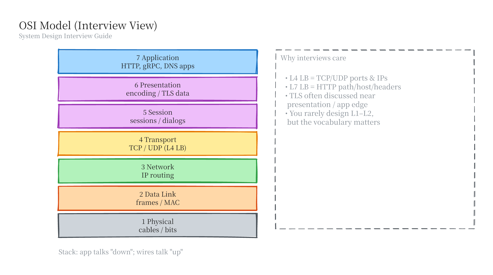

<sub>Editable source: [osi-model.excalidraw](diagrams/excalidraw/osi-model.excalidraw)</sub>

> **Key takeaway:** You will almost never design layers 1–3 in an interview — you *will* use L4/L7 language for load balancers and gateways.

### The seven layers (plain English)

| Layer | Name | Everyday idea | Interview touchpoint |
|-------|------|---------------|----------------------|
| 7 | Application | What the app speaks (HTTP, gRPC) | API design, L7 routing |
| 6 | Presentation | Encoding, compression, encryption framing | TLS discussed near the edge |
| 5 | Session | Conversations spanning requests | Less explicit in web designs |
| 4 | Transport | TCP/UDP ports, reliability | **L4 load balancers** |
| 3 | Network | IP addresses and routing | VPC, subnets (ops depth) |
| 2 | Data link | Frames on a local link | Rarely drawn |
| 1 | Physical | Cables, radio, bits | Rarely drawn |

### Why L4 vs L7 language exists

- **L4 LB** — forwards TCP/UDP connections based on IP/port (and maybe connection counts). Blazing fast; cannot read `/api/payments`.
- **L7 LB / reverse proxy** — understands HTTP: host, path, headers, cookies, canaries. Slightly more CPU; far more control.

### When it matters

Explaining CDN vs LB vs API gateway placement; choosing network vs application load balancing in cloud consoles; debugging “TLS works but HTTP route 404s.”

### Tradeoffs

Teaching model ≠ implementation. Do not spend five minutes reciting all seven layers — map straight to L4/L7 decisions.

### Failure modes

Cargo-culting “we need L7” when L4 + service mesh is enough (or the reverse: needing path routing but picking a pure L4 NLB).

### Interview tip

Say: “Edge L7 for host/path routing and TLS; internal L4 for raw TCP to databases if needed.” Move on.

### Self-check

1. Can an L4 LB route by URL path? Why or why not?
2. Which layer do TCP and UDP live in?
3. Name one reason to prefer L7 at the public edge.

## Networking basics

**In plain English:** Networking is how phones, browsers, and servers find each other and talk safely. You do not need to configure routers in an interview — you do need to place DNS, TLS, and load balancers on the diagram in the right order.

> **Key takeaway:** Clients hit DNS, then a secure edge (TLS), then a load balancer — put those boxes before your app logic.

### How the pieces connect

Typical public request path:

`Client → DNS → CDN (optional) → TLS-terminating LB / gateway → services → cache / DB`

Deep dives live in the next sections: [TCP and UDP](#tcp-and-udp), [DNS](#dns), [TLS, SSL, and mTLS](#tls-ssl-and-mtls), [Proxies](#proxies), [Real-time communication](#real-time-communication), [Load balancing](#load-balancing).

### Interview tip

Label protocols on arrows (`HTTPS`, `gRPC`, `Kafka`, `Redis PUB/SUB`). Count hops when talking about latency budgets.

### Self-check

1. Name the boxes, in order, between a mobile user and your primary database.
2. Where would you terminate TLS for a public API and why?
3. When are WebSockets justified over polling?

## TCP and UDP

**In plain English:** TCP and UDP are two ways to send bytes. **TCP** is the careful courier that confirms delivery and order. **UDP** is the speedy postcard that might get lost — fine when a new packet will replace an old one anyway (live video, games).

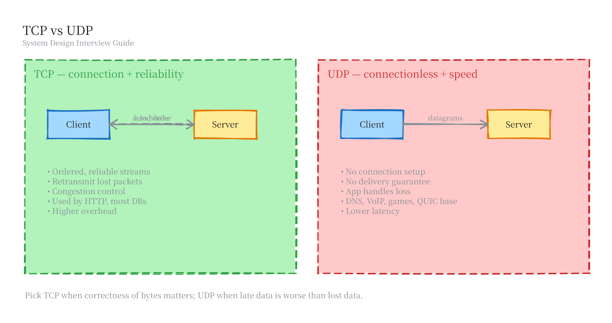

<sub>Editable source: [tcp-vs-udp.excalidraw](diagrams/excalidraw/tcp-vs-udp.excalidraw)</sub>

> **Key takeaway:** Default to TCP for APIs and databases; choose UDP (or UDP-based stacks like QUIC) when latency beats perfect reliability.

### Connection vs connectionless

- **TCP** — three-way handshake, connection state, streams of bytes, acknowledgments, retransmission, congestion control.
- **UDP** — independent datagrams, no handshake, no built-in retry or ordering.

### Comparison

| Question | TCP | UDP |
|----------|-----|-----|
| Setup cost | Handshake + state | Almost none |
| Delivery | Reliable (retries) | Best-effort |
| Order | Preserved | Not guaranteed |
| Speed / overhead | Higher overhead | Lower overhead |
| Head-of-line blocking | Yes (classic TCP) | No (per datagram) |
| Typical uses | HTTP/1–2, SQL, SSH | DNS queries, VoIP, gaming, video realtime |
| Broadcast/multicast | Not really | Natural fit |

**QUIC / HTTP/3** runs reliability features over UDP to reduce some TCP pain (e.g. connection migration, multiplex without TCP HOL blocking). In interviews, “HTTP/3 uses QUIC over UDP” is enough.

### When to pick which

| Situation | Lean |
|-----------|------|
| CRUD API, payments, DB links | TCP |
| Live sports video frames | UDP (+ app FEC) or specialized media stack |
| DNS lookup | Usually UDP (TCP fallback for large answers) |
| “Never lose this financial event” | TCP + app-level idempotency |

### Tradeoffs

Reliability mechanisms add latency and CPU. UDP shifts complexity into your application (sequence numbers, retransmission, congestion — reinvent carefully).

### Failure modes

- Using TCP for lossy realtime media → huge latency under loss (retransmit + HOL)
- Using raw UDP for money movement → silent loss
- Ignoring middlebox pain (some corporates break UDP/QUIC)

### Interview tip

Label arrows: `HTTPS (TCP)` vs `media (UDP/WebRTC)`. If someone asks “why not UDP for everything?” — answer with reliability and congestion control.

### Self-check

1. Why does TCP feel slower on lossy mobile networks for live video?
2. Is DNS always UDP? When might it use TCP?
3. What problem does QUIC aim to improve vs HTTP/2 over TCP?

## DNS

**In plain English:** DNS is the phone book of the internet: it turns a name like maps.example.com into an IP address your phone can dial. When you type a URL, DNS is usually the first hop.

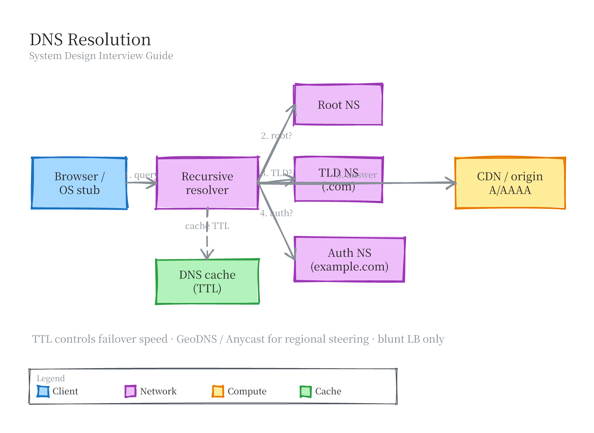

<sub>Editable source: [dns-resolution.excalidraw](diagrams/excalidraw/dns-resolution.excalidraw) (open at [excalidraw.com](https://excalidraw.com)). Legacy: `.drawio` under [`diagrams/`](diagrams/).</sub>


> **Key takeaway:** DNS gets users to the right edge; it is a blunt failover tool because caches hold answers for a TTL.

### How resolution works (interview level)

1. Client asks a **recursive resolver** (ISP or 1.1.1.1 / 8.8.8.8).
2. Resolver walks **root → TLD → authoritative** name servers (or uses cache).
3. Answer includes **records** and a **TTL** — caches may serve stale answers until TTL expires.

You do not control every cache (OS, browser, recursive resolvers). That lag is why DNS is a blunt failover tool.

### Record types you should name

| Type | Role in designs |
|------|-----------------|
| **A / AAAA** | Hostname → IPv4 / IPv6 |
| **CNAME** | Alias to another name (not on zone apex usually) |
| **NS** | Delegates a zone to name servers |
| **MX** | Mail routing |
| **TXT** | Verification, SPF/DKIM, challenge tokens |
| **SRV** | Service discovery (host+port+priority) |

For most system-design prompts, A/AAAA + CNAME + understanding of apex constraints is enough.

### TTL intuition

- **Low TTL** (30–60s): faster cutover for blue/green or DR; higher DNS QPS; more dependency on DNS availability.
- **High TTL** (hours): fewer lookups; **slow** failover — users stick to old IPs.
- Interview move: “I’d use moderate TTL in steady state and **lower TTL ahead of a planned cutover**.”

### Anycast intuition

Anycast announces the **same IP** from many PoPs; BGP routes the client to a “nearby” announcement. Used by major DNS providers and some CDNs/LBs. Benefits: lower latency, DDoS absorption, regional failover. Caveats: routing is opaque; debugging “which PoP?” needs provider tooling; not application-layer load balancing by request content.

### GeoDNS / latency-based routing

Authoritative DNS can return different answers by client geography or health checks (route53-style policies). Good for steering to regions. Bad as a fine-grained LB: TTL + resolver location (not always user location) limit precision.

### When to use / emphasize DNS

- Multi-region active-passive or active-active
- CDN origin / apex decisions
- Planned migrations and incident failover stories
- Anything where “users can’t reach us” is the failure mode

### Tradeoffs

| Choice | Gain | Cost |
|--------|------|------|
| Low TTL | Fast failover | More DNS load; cache misses |
| GeoDNS | Regional steering | Complexity; wrong region if resolver ≠ user |
| Multi-provider DNS | Survive provider outage | Sync of records; split-brain risk |
| Anycast DNS | Latency + resilience | Less control of path |

### Failure modes

- Stale caches after IP change (classic “we updated DNS but half the world still hits old LB”)
- Single DNS provider outage taking your brand offline
- Misconfigured NS / expired domain (ops nightmare)
- CNAME chains adding latency
- Using DNS as a **request** router (it isn’t — no path/header awareness)

### Interview tip

On the whiteboard, draw **Clients → DNS → CDN/LB** and say: “DNS gets them to the right edge; the LB does per-request distribution.” If multi-region: “GeoDNS or anycast to region VIP; health-check removes bad region.”

**Diagram:** [diagrams/foundations-traffic-tier.drawio](diagrams/foundations-traffic-tier.drawio)

### Self-check

1. Why is DNS alone a poor substitute for an application load balancer?
2. How would you prepare TTL before a planned blue/green cutover?
3. What does anycast buy you for DNS that unicast does not?

---

## TLS, SSL, and mTLS

**In plain English:** **TLS** (successor to older **SSL** branding) encrypts traffic on the wire so eavesdroppers see ciphertext, not passwords and tokens. Certificates prove a server (and sometimes a client) is who it claims to be. **mTLS** means **both** sides present certificates — common service-to-service inside a mesh.

> **Key takeaway:** HTTPS at the edge is non-negotiable; mTLS is the interview answer for zero-trust service identity inside the cluster.

### Encrypt in transit

Client ↔ edge (and ideally further) uses TLS. You choose where to **terminate** TLS: CDN, load balancer, or all the way to the app. Re-encrypting to upstreams (“TLS all the way”) raises assurance at some CPU/ops cost.

### Certificates (intuition)

A certificate binds a public key to a name (`api.example.com`) and is signed by a trusted **Certificate Authority**. Browsers/OS trust stores decide who to believe. Automate issuance/rotation (ACME); expired certs are a classic outage.

### mTLS for service-to-service

In mutual TLS, the server also verifies the **client certificate**. Sidecar meshes often mint short-lived certs per workload identity so `payments` only accepts calls from `checkout`. Complements — does not replace — application AuthZ.

### When to emphasize

Every public design (TLS). Microservice / zero-trust / PCI-ish designs (mTLS + least privilege).

### Tradeoffs

Termination convenience vs end-to-end confidentiality; mTLS identity vs operational cert sprawl without a mesh/platform.

### Failure modes

Expired certs; half-configured TLS leaving internal cleartext on shared networks; trusting client certs without revocation/rotation story.

### Interview tip

Label the edge box “TLS termination” and, for meshes, “mTLS east-west.” Mention certificate rotation in failure modes if time allows.

### Self-check

1. What does “TLS termination at the LB” mean for upstream traffic?
2. How does mTLS differ from ordinary HTTPS to a browser?
3. Why automate certificate renewal?

## Proxies

**In plain English:** A proxy is a middlebox that forwards traffic. A reverse proxy sits in front of your servers (what users hit). A forward proxy sits in front of clients going out to the internet (company egress, scrapers).

> **Key takeaway:** In most designs you draw a reverse proxy / L7 load balancer at the edge — TLS, routing, and protection live there.

### Forward proxy

Sits in front of **clients** (corporate egress, VPN, scrapers). Clients are configured to use it. The origin sees the proxy’s IP. Uses: egress control, caching outbound, anonymizing, allowlists.

### Reverse proxy

Sits in front of **servers**. Clients think they talk to the origin; the reverse proxy routes to upstreams. Uses: TLS termination, load balancing, WAF, path-based routing, compression, HTTP/2→HTTP/1.1 bridging. NGINX, Envoy, HAProxy, cloud L7 LBs are reverse proxies in practice.

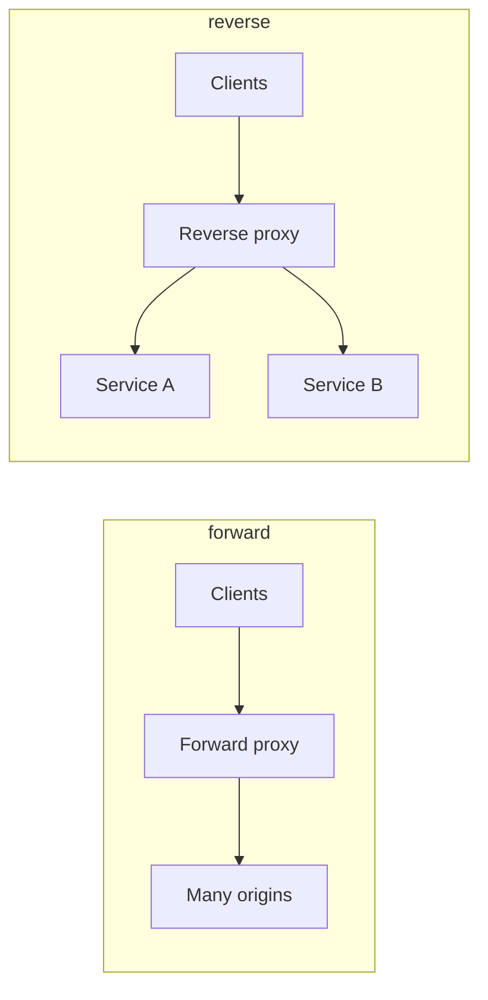
```mermaid
flowchart LR
  subgraph forward
    C1[Clients] --> FP[Forward proxy] --> O1[Many origins]
  end
  subgraph reverse
    C2[Clients] --> RP[Reverse proxy] --> S1[Service A]
    RP --> S2[Service B]
  end
```

### Related cousins (do not confuse)

| Thing | vs reverse proxy |
|-------|------------------|
| **API gateway** | Reverse proxy **plus** auth, rate limits, product API policy |
| **Service mesh sidecar** | Per-instance proxy for east-west mTLS, retries, obs |
| **CDN** | Reverse proxy at the edge with cache + PoPs |
| **LB** | May be L4 or L7; L7 LB ≈ reverse proxy with health checks |

### When to use

- **Reverse:** almost every public web/API design — terminate TLS, route, protect origins.
- **Forward:** enterprise egress, crawling fleets, “call the internet safely from private VPC.”
- **Mesh sidecars:** many microservices needing uniform retries/mTLS (senior/ops depth).

### Tradeoffs

Central reverse proxy simplifies TLS and policy but can become a bottleneck or blast-radius concentrator. Sidecar meshes improve consistency at the cost of resource overhead and debugging complexity. Forward proxies add hop latency and a dependency for outbound calls.

### Failure modes

- Misconfigured timeouts → retry storms
- Buffering large uploads/downloads → memory pressure
- Single proxy tier without HA
- Header stripping / `X-Forwarded-For` trust mistakes → wrong client identity for rate limits
- WebSocket / gRPC upgrade mishandling

### Interview tip

Say “reverse proxy / L7 LB” when you mean edge routing; reserve “forward proxy” for egress. Label TLS termination on the box. If asked “NGINX or Envoy?” — either is fine; mention features you need (WAF, gRPC, retries).

**Diagram:** [diagrams/foundations-traffic-tier.drawio](diagrams/foundations-traffic-tier.drawio)

### Self-check

1. Client → ? → many arbitrary websites: forward or reverse?
2. Why must rate limiting trust `X-Forwarded-For` carefully behind a proxy?
3. When would you add a service-mesh sidecar instead of only an edge reverse proxy?

---

## Real-time communication

**In plain English:** Sometimes the server needs to push updates to the user — a new chat message, a live score, a typing indicator — without the app constantly asking "anything new?". That is what WebSockets, SSE, and polling are about.

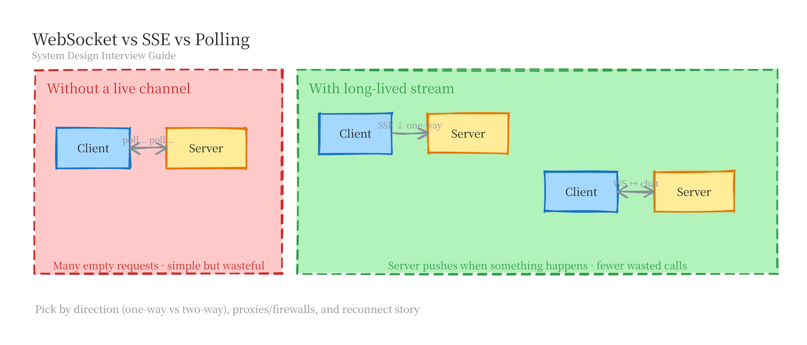

<sub>Editable source: [websocket-vs-polling.excalidraw](diagrams/excalidraw/websocket-vs-polling.excalidraw) (open at [excalidraw.com](https://excalidraw.com)). Legacy: `.drawio` under [`diagrams/`](diagrams/).</sub>


> **Key takeaway:** Do not default to WebSockets for everything; pick the transport by direction of data and how flaky the network is.

### Options compared

| Approach | Model | Best for | Watch-outs |
|----------|-------|----------|------------|
| **Short polling** | Client asks on interval | Simple dashboards, low fan-out | Wasteful; lag = interval |
| **Long polling** | Server holds request until event or timeout | Fallback when WS blocked; moderate fan-out | Connection churn; harder load balancers |
| **SSE (Server-Sent Events)** | One-way server→client stream over HTTP | Feeds, notifications, progress | Unidirectional; proxy buffering; auto-reconnect |
| **WebSockets** | Bidirectional full-duplex | Chat, games, collab | Sticky or pub/sub fan-out; conn limits; LB config |
| **gRPC streaming** | Bidirectional streams (HTTP/2) | Internal service streams | Not for browsers without grpc-web |
| **WebRTC** | P2P / media | A/V calls, some data channels | Signaling + NAT; heavy for text chat |

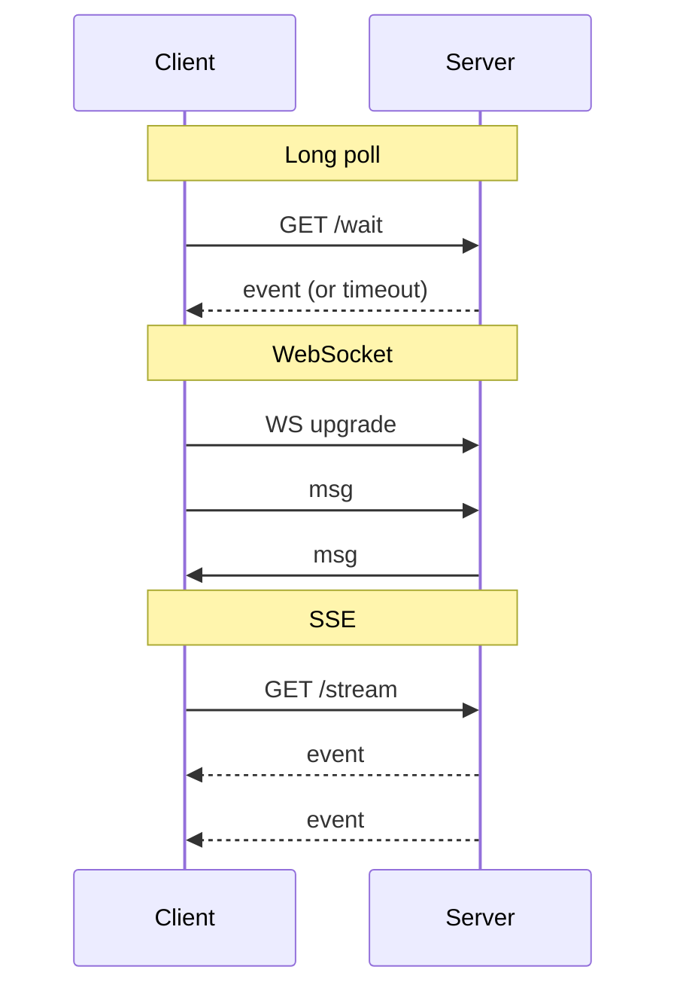
```mermaid
sequenceDiagram
  participant C as Client
  participant S as Server
  Note over C,S: Long poll
  C->>S: GET /wait
  S-->>C: event (or timeout)
  Note over C,S: WebSocket
  C->>S: WS upgrade
  C->>S: msg
  S->>C: msg
  Note over C,S: SSE
  C->>S: GET /stream
  S-->>C: event
  S-->>C: event
```

### When to pick what

- **Chat 1:1 / channels with typing + presence:** WebSockets (+ pub/sub to fan out across gateway nodes).
- **“Order status updates” or live dashboards one-way:** SSE or long poll; often enough.
- **Mobile flaky networks:** design reconnect, resume cursors, idempotent event IDs — transport is only half the story.
- **Strict corporate proxies:** WS may fail; have long-poll/SSE fallback.
- **Fan-out to millions:** do **not** hold one process connection to every reader for every event — use a **gateway fleet + Redis/Kafka pub/sub** keyed by user or channel.

### Architecture sketch for WS at scale

1. Client connects to **WS gateway** (sticky via cookie/IP or connection ID registry).
2. Gateway registers `connection_id → user_id` in a presence/conn store.
3. Chat service publishes to `channel_id` topic; gateways subscribed to channels for their local conns push frames.
4. Offline: drop to push notifications; persist messages in DB regardless.

### Tradeoffs

| Choice | Pros | Cons |
|--------|------|------|
| WS everywhere | Low latency bi-di | Ops: sticky, fan-out, idle timeouts |
| SSE | Simple, HTTP-friendly | One-way; some proxy issues |
| Long poll | Universal | Inefficient; thundering reconnects |
| Polling | Trivial | Latency floor; server load |

### Failure modes

- Gateway memory bound by **concurrent connections** (often the real scale metric)
- Sticky sessions breaking autoscale unless conn registry is external
- Missed events on reconnect without resume tokens / last-event-id
- Heartbeat failure → half-open dead conns
- Hot channels (celebrity livestream chat) melting one shard

### Interview tip

Ask: “Do we need client→server messages at high rate, or mostly server push?” If mostly push, SSE may be simpler. Always mention **reconnect + catch-up** and **horizontal WS gateways**.

### Self-check

1. Why do WS gateways need a pub/sub layer when you scale beyond one box?
2. When is SSE preferable to WebSockets?
3. What is the scale bottleneck for a chat gateway: CPU per message or connections?

---

## Load balancing

**In plain English:** A load balancer is a traffic cop in front of many identical servers. Instead of one machine melting under Black Friday traffic, requests are spread across healthy copies.

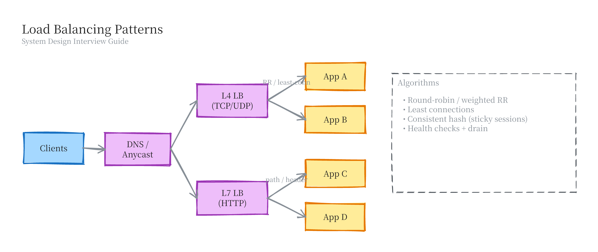

<sub>Editable source: [load-balancing.excalidraw](diagrams/excalidraw/load-balancing.excalidraw) (open at [excalidraw.com](https://excalidraw.com)). Legacy: `.drawio` under [`diagrams/`](diagrams/).</sub>


> **Key takeaway:** Put an LB in front of a stateless app tier; health checks remove bad instances so users never notice one death.

### Why load balancers exist

Two jobs: **scale** (spread work across many machines) and **hide failures** (stop sending traffic to dead or sick instances). Without an LB, clients pin to one IP and that host becomes both bottleneck and SPOF.

### Workload distribution styles

- **Host-based** — `api.example.com` vs `admin.example.com` → different pools
- **Path-based** — `/payments/*` → payments service
- **Content-based** — inspect headers/body (e.g. API version, tenant) at L7

### Types of load balancers

| Type | Idea | Limitations |
|------|------|-------------|
| **Software** | NGINX, HAProxy, Envoy, cloud L7 | You operate config/CPU |
| **Hardware** | Appliance in a datacenter | Costly, less flexible |
| **DNS LB** | Multiple A/AAAA answers or weighted DNS | Poor health awareness; TTL lag; not request-aware |

DNS balancing is a coarse geo/steer tool — not a substitute for an application LB.

### Algorithms (expanded)

| Algorithm | Idea | Watch-outs |
|-----------|------|------------|
| Round robin | Rotate through backends | Uneven if backends differ |
| Weighted RR | Capacity-aware rotation | Weights drift as machines change |
| Least connections | Prefer quieter node | Needs good connection accounting |
| Least response time | Prefer fast + quiet | Measurement noise; herd effects |
| Least bandwidth | Prefer lowest Mbps | Needs traffic meters |
| Hashing / consistent hash | Stick by IP, cookie, URL key | Hot keys; rebalance on pool change |
| Random | Pick at random | Surprisingly robust at scale |

### Redundant load balancers

A lone LB is itself a SPOF. Run **active-passive** pairs (VIP failover) or **active-active** LBs in multiple AZs.

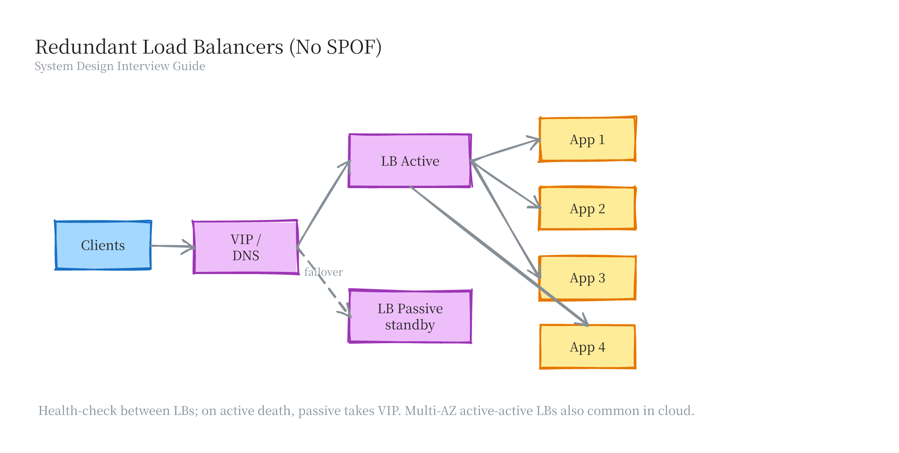

<sub>Editable source: [redundant-load-balancer.excalidraw](diagrams/excalidraw/redundant-load-balancer.excalidraw)</sub>

### Features checklist (say these aloud)

Sticky sessions · health checks · TLS termination · autoscaling integration · access logs / tracing IDs · HTTP redirects · connection draining on deploy · optional response compression/caching at L7

Prefer externalizing session state so sticky sessions are optional, not mandatory.


### Layers

- **L4 (transport)** — TCP/UDP 5-tuple; fast, little app awareness.
- **L7 (application)** — HTTP routes, headers, paths, canary weights; more CPU, richer control.

CDN and DNS-based balancing sit even further out (geo / Anycast).

Sticky sessions (cookie or IP affinity) keep a client on one backend—useful for local state, hostile to elasticity. Prefer externalizing session state. See algorithms table above.

### Health checks

Active probes + remove bad nodes. Tune intervals to avoid flapping. Fail closed vs open depends on whether empty pools should 503 or send traffic anyway (usually 503).

### Where LBs sit

```
Client → DNS → CDN → L7 LB / Gateway → services → internal L4 → data stores
```

Internal east-west traffic may use client-side LB (service discovery) instead of a central proxy.

### When to use

Always in front of stateless app tiers. Also for redistributing across read replicas or regions (with care).

### Tradeoffs

L7 flexibility vs latency/CPU; sticky sessions vs autoscale; hardware/NLB vs software proxies (Envoy, NGINX).

### Failure modes

LB as SPOF—run in pairs / multi-AZ. Misconfigured health checks draining all nodes. Connection pile-up on slow backends. Uneven hashing hot keys.

### Interview tip

Say “stateless app servers behind an L7 LB” early; it unlocks horizontal scale without debate.

### Self-check

1. Why does sticky session conflict with rolling deploys?
2. L4 vs L7 for path-based routing—which and why?
3. How can consistent hashing still create hotspots?


## Clustering

**In plain English:** A **cluster** is a group of machines that work together so they look like one stronger, safer system. Think of several cashiers who share one queue — if one goes on break, the line still moves.

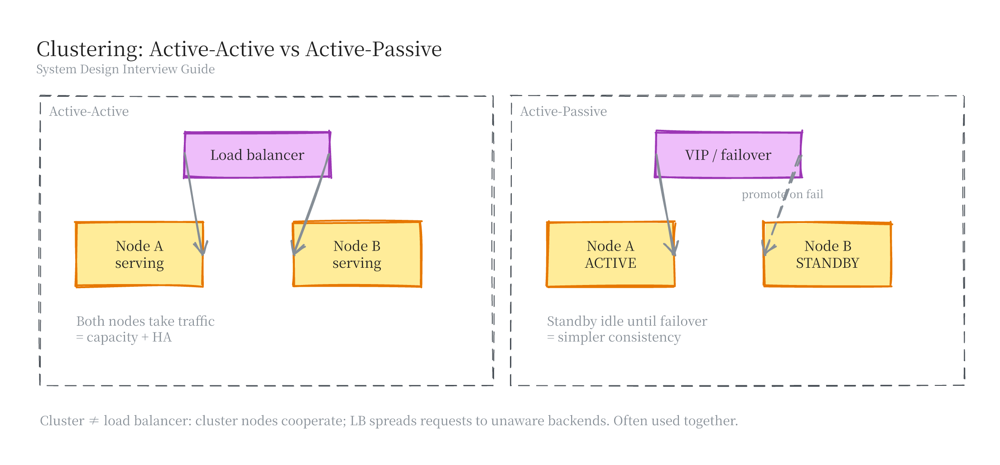

<sub>Editable source: [clustering-active-active-passive.excalidraw](diagrams/excalidraw/clustering-active-active-passive.excalidraw)</sub>

> **Key takeaway:** Clusters give capacity and/or failover; say whether nodes are all active or some are standing by — and do not confuse clustering with load balancing.

### What a cluster is

Nodes share a goal (serve the website, run the database, train a model). They need a network between them, membership/health awareness, and often shared or replicated storage. Ideally users treat the cluster as one system.

### Active-active vs active-passive

| Mode | Behavior | Good for |
|------|----------|----------|
| **Active-active** | Multiple nodes serve traffic at once | Throughput + HA; needs careful state sharing |
| **Active-passive** | One (or a few) active; others warm/cold standby | Simpler failover for stateful systems |

### Cluster “flavors” you may name

- **HA / failover clusters** — survive node death with minimal downtime
- **Load-balancing clusters** — spread work for capacity (often paired with an LB)
- **HPC clusters** — parallel compute jobs (less common in product design interviews)

### Load balancing vs clustering

| | **Load balancing** | **Clustering** |
|--|--------------------|----------------|
| Awareness | Backends usually unaware of each other | Nodes know peers / share state or work |
| Goal | Distribute requests | Cooperate for capacity, HA, or compute |
| Together? | Yes — LB in front of a cluster is normal | |

### When to use

Databases in HA pairs, Redis clusters, Kubernetes node pools, Kafka brokers — anywhere “one box” is not enough for availability or size.

### Tradeoffs

More nodes → more ops surface (deployments, versions, split brain). Active-active needs conflict rules; active-passive wastes standby capacity.

### Failure modes

Split brain (two actives), failed failover, unclean shutdown leaving locks, “cluster” that is actually a single shared disk SPOF.

### Interview tip

“App tier is an active-active set behind an LB; the primary DB is active-passive with a sync replica.” Clear and credible.

### Self-check

1. When would you choose active-passive over active-active?
2. How is a cluster different from “three unrelated servers behind nginx”?
3. What is split brain?


## Storage fundamentals

**In plain English:** Storage is where bits sit when RAM forgets them. Interviews care less about brand names and more about **file vs block vs object**, a little **RAID** intuition, and when a distributed file system idea (like HDFS) shows up for huge analytics files.

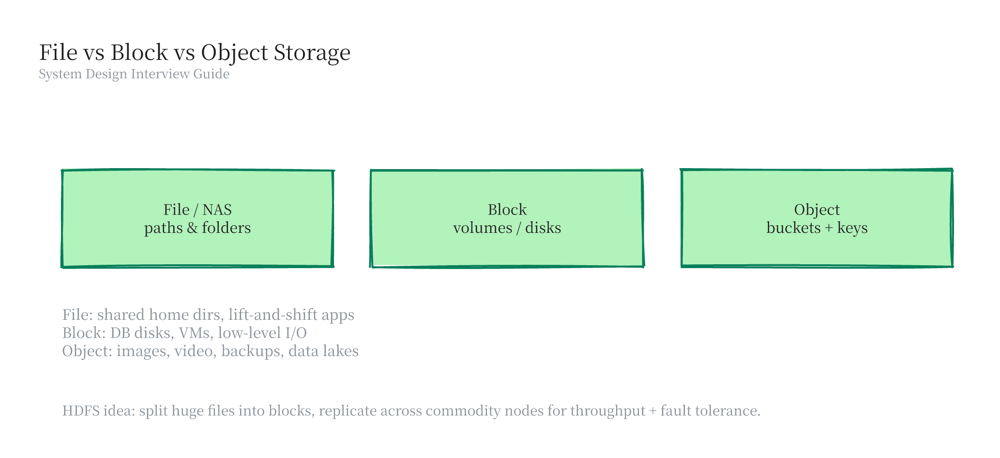

<sub>Editable source: [storage-file-block-object.excalidraw](diagrams/excalidraw/storage-file-block-object.excalidraw)</sub>

> **Key takeaway:** Match access pattern to storage type — databases love block volumes; photos and backups love object stores; shared POSIX folders love file/NAS.

### RAID levels (overview)

RAID combines disks for speed and/or survival. You will not size arrays in most interviews; you should recognize the patterns:

| Level | Idea | Fault tolerance (typical) | Notes |
|-------|------|---------------------------|-------|
| **0** | Striping | None | Fast; one disk dies → data gone |
| **1** | Mirroring | Survive 1 disk (in a pair) | Simple; 50% capacity |
| **5** | Striping + parity | Survive 1 disk | Needs ≥3 disks; rebuild cost |
| **6** | Striping + double parity | Survive 2 disks | Safer rebuilds; more parity overhead |
| **10** | Stripe of mirrors | Strong; depends on layout | Popular for DB performance + safety |

Cloud “managed disks” hide RAID — still useful vocabulary when discussing on-prem or performance tradeoffs.

### File vs block vs object

| Type | Interface | Everyday use |
|------|-----------|--------------|
| **File** | Paths and folders (NFS/SMB) | Shared uploads, lift-and-shift apps needing POSIX |
| **Block** | Raw volumes (like a disk) | Database data directories, VM boot disks |
| **Object** | Bucket + key, HTTP APIs | Images, video, logs, backups, data lakes |

### NAS vs local disk

- **Local** — attached to one machine; lowest latency; dies with the host unless replicated higher up.
- **NAS (network-attached storage)** — file share over the network; multiple servers can mount; watch latency and lock semantics.

### HDFS idea (brief)

**HDFS**-style systems split large files into blocks, place replicas on different nodes, and optimize for fat sequential scans on commodity hardware. Great for batch analytics; awkward as a general low-latency OLTP disk. In interviews: “cold analytical files on a distributed FS or object store; hot OLTP on managed block + DB.”

### When to emphasize

Dropbox-like, video, data platform, or any design with multi-TB blobs.

### Tradeoffs

Object storage scales cheaply but is not a POSIX disk. Block is fast for DBs but you manage growth. File shares are friendly and easy to misuse as a distributed DB.

### Failure modes

Single NAS as SPOF; RAID rebuild storms; treating object store like a low-latency queue; no backup beyond RAID (RAID ≠ backup).

### Interview tip

“Metadata in the DB; bytes in object storage with signed URLs.” That sentence covers most media designs.

### Self-check

1. Why is RAID not a substitute for backups?
2. When would you pick object storage over a file share?
3. What workload fits an HDFS-like system?

## API gateway

**In plain English:** Imagine a mobile shopping app that needs the user's profile, recent orders, and recommendations to paint the home screen. Without help, the phone makes three separate calls over a flaky mobile network. An API gateway (or a Backend-for-Frontend) can turn that into one call: the phone asks once, and the gateway gathers the pieces on the fast datacenter network.


> **Key takeaway:** A gateway is the front door — routing, auth, rate limits, and optional aggregation — not a dumping ground for all business logic.

### How it works

An **API gateway** sits at the edge between external clients and your internal services. Typical duties:

- Terminate TLS and route HTTP paths to the right service
- Check authentication (for example validate a JWT or API key)
- Enforce **rate limits** and quotas
- Optionally **aggregate** several backend calls into one response (BFF-style)
- Emit edge metrics and access logs

A **BFF** (Backend for Frontend) is a gateway-like service shaped for one client experience — for example a mobile BFF that returns exactly the home-screen payload. A **service mesh** is different: it handles service-to-service (east-west) traffic inside the cluster, not the public front door.

### Why it matters in interviews

Microservices designs almost always need a clear edge. Interviewers listen for whether you put **one** gateway in front, keep domain logic in services, and know that aggregation helps mobile networks without turning the gateway into a new monolith.

### When to use / when not

**Use** when you have public or partner clients, several backends, and shared policy (auth, rate limits, routing).

**Skip or keep thin** when you have a single small service — a load balancer plus app middleware may be enough. Avoid stuffing core checkout or feed ranking logic only in the gateway.

### Tradeoffs

| Choice | Gain | Cost |
|--------|------|------|
| Central gateway | One place for auth, RL, routing | Can become bottleneck or deploy chokepoint |
| Aggregation / BFF | Fewer mobile round trips | Extra hop; risk of a "monolith in disguise" |
| Mesh + gateway | Clear north-south vs east-west | More moving parts to operate |

### Failure modes (what breaks)

- Gateway outage blocks everything → multi-AZ, capacity headroom, health checks
- Auth dependency down → cache JWKS keys; define fail-open vs fail-closed deliberately
- Slow backends exhaust gateway workers → timeouts, bulkheads, circuit breakers
- Over-aggregation → giant payloads and tangled releases

### Interview tip

Draw **Clients → Gateway (auth, rate limit) → Service A/B/C**. Say internal service calls skip the public gateway. If the prompt is mobile-heavy, mention aggregation with the without/with picture above.

### Self-check

1. Name three concerns that belong at the gateway and one that does not.
2. How does a mobile BFF differ from a generic API gateway?
3. What happens to availability if the gateway depends synchronously on a flaky auth service?

## Rate limiting

**In plain English:** Rate limiting is a polite bouncer: it caps how many requests a user, IP, or API key can make so one noisy client cannot knock over the whole club.

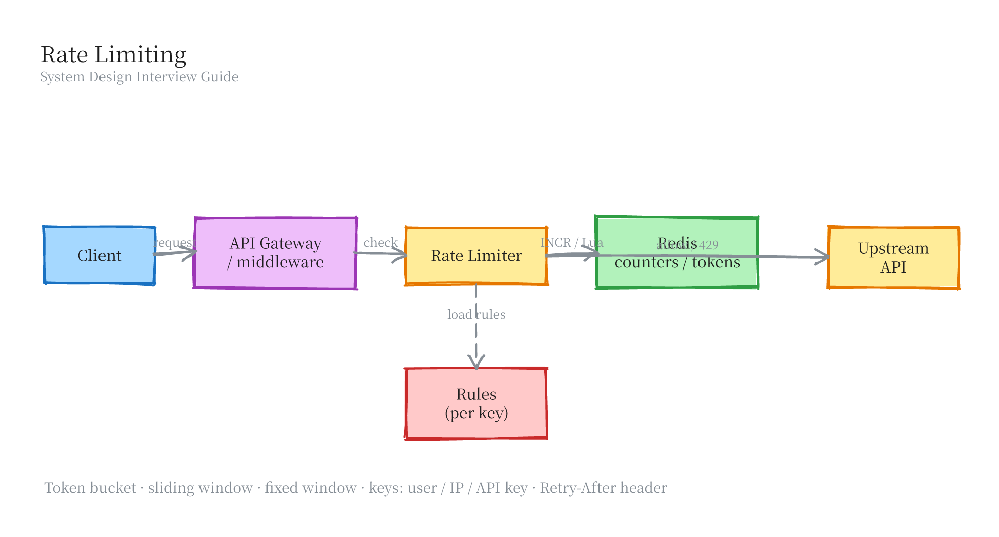

<sub>Editable source: [rate-limiting.excalidraw](diagrams/excalidraw/rate-limiting.excalidraw) (open at [excalidraw.com](https://excalidraw.com)). Legacy: `.drawio` under [`diagrams/`](diagrams/).</sub>


> **Key takeaway:** Protect shared resources with per-key limits; return 429 with Retry-After instead of letting the database melt.

### Algorithms

#### Token bucket

Tokens refill at rate *r*; burst size *b*. A request costs a token. Allows controlled bursts—good for APIs.

#### Leaky bucket

Smooths outflow to constant rate; excess discarded or queued. Good for shaping to downstream limits.

#### Fixed window

Count requests in 1-second or 1-minute buckets. Simple; allows 2× burst at window edges.

#### Sliding window / sliding log

Smoother accuracy; higher memory (timestamps) or approximate counts.

### Where to enforce

- Edge / gateway (cheap rejection)
- Service (business quotas)
- Downstream (protect DB)

Defense in depth: edge coarse limits + service fine limits.

### Distributed limiters

Counters in Redis (`INCR` + `EXPIRE`) or similar. Use Lua/transactions for atomicity. For global accuracy under high QPS, accept approximation or shard counters.

### HTTP semantics

Return `429 Too Many Requests` with `Retry-After`. Include limit headers when helpful (`X-RateLimit-Remaining`).

### When to use

Public APIs, login endpoints (credential stuffing), expensive searches, multi-tenant platforms, webhook egress.

### Tradeoffs

Strict global limits vs latency (central Redis). Fairness vs simplicity (per-user vs per-IP). Blocking vs queuing excess.

### Failure modes

Redis outage—fail open (risk overload) vs fail closed (availability hit). Hot keys for popular tenants. Clock skew with window algorithms. Mis-tuned limits causing false positives in launches.

### Interview tip

Ask “per user or per IP?” and “burst allowed?” Then pick token bucket + Redis and discuss fail-open policy.

### Self-check

1. Why do fixed windows allow edge bursts?
2. Fail-open vs fail-closed when the limiter store is down?
3. How would you rate-limit a distributed fleet without a single Redis? (hint: local + periodic reconcile)


## Caching & CDN

**In plain English:** A cache keeps a hot copy of slow-to-fetch data in fast memory so you do not ask the database every time. A CDN is the same idea for files (images, videos, JS) stored in many cities so users download from somewhere nearby.

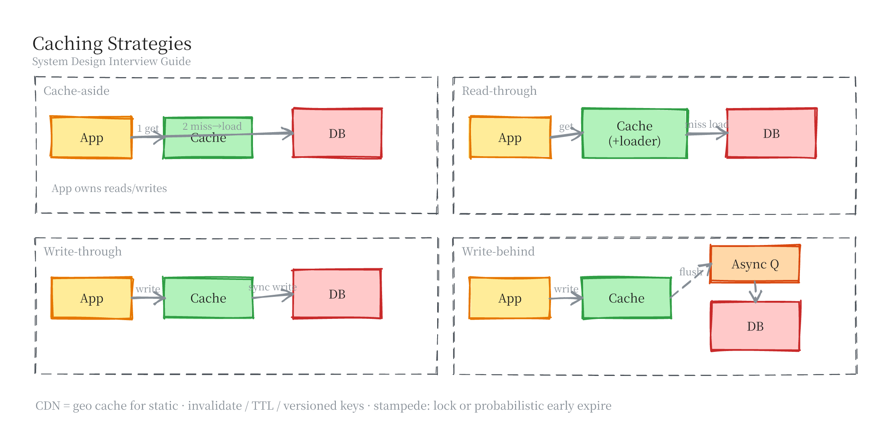

<sub>Editable source: [caching-strategies.excalidraw](diagrams/excalidraw/caching-strategies.excalidraw) (open at [excalidraw.com](https://excalidraw.com)). Legacy: `.drawio` under [`diagrams/`](diagrams/).</sub>


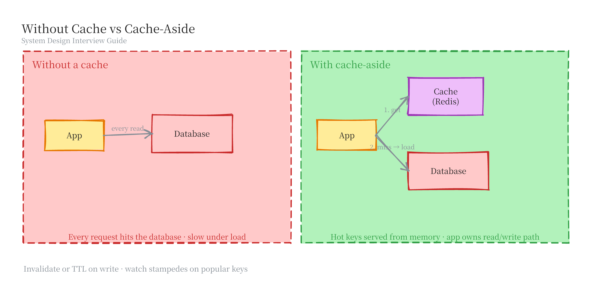

> **Key takeaway:** Cache what is read often and expensive to recompute; always have a plan for stale data (TTL or invalidate on write).

### Write policies (clear definitions)

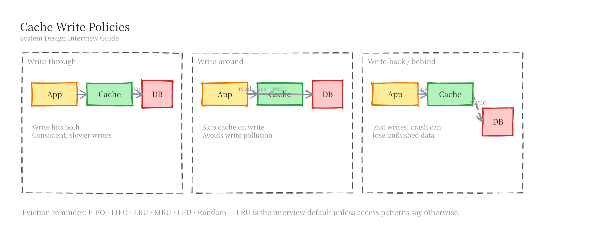

<sub>Editable source: [cache-write-policies.excalidraw](diagrams/excalidraw/cache-write-policies.excalidraw)</sub>

| Policy | Behavior | Upside | Downside |
|--------|----------|--------|----------|
| **Write-through** | Write cache and DB together | Cache stays warm & consistent | Slower writes |
| **Write-around** | Write DB only; cache fills on read | Avoids flooding cache with one-time writes | Immediate re-read may miss |
| **Write-back / write-behind** | Write cache first; flush DB async | Fast write path | Crash can lose unflushed data |

### Eviction policies

When the cache is full, something must leave:

| Policy | Evicts… | Typical use |
|--------|---------|-------------|
| **FIFO** | Oldest inserted | Simple queues of entries |
| **LIFO** | Newest inserted | Rare for general caches |
| **LRU** | Least recently used | Interview default |
| **MRU** | Most recently used | Some scan-resistant patterns |
| **LFU** | Least frequently used | Hot-key heavy workloads |
| **RR** | Random victim | Cheap approx under huge keyspaces |

### Distributed vs global cache

- **Distributed cache** — shard data across many cache nodes (client hash or proxy); scales memory horizontally.
- **Global / shared cache** — logical one-cache service many apps call (still may be a cluster underneath). On miss, the cache tier or the app loads the DB — clarify who owns the load.

### CDN push vs pull

| | **Pull CDN** | **Push CDN** |
|--|--------------|--------------|
| How content arrives | Edge fetches origin on miss | You upload to the CDN |
| Ops | Little; origin must handle misses | You control what lives on edge |
| Fits | Large sites, long-tail assets | Small/stable catalogs, pre-positioned releases |

### When NOT to cache

- Data changes every request and must be exact (live inventory countdown with strong consistency needs)
- No repeat access (pure one-off randomness)
- Cache latency ≈ origin latency (no win)
- Sensitive per-user data on a shared edge without proper cache keys / auth


### Cache placements

1. **Client / browser** — HTTP cache headers.
2. **CDN / edge** — images, JS, videos, cacheable API GETs.
3. **Application memory** — per-instance; fast, not shared.
4. **Distributed cache** (Redis/Memcached) — shared across app nodes.
5. **Database buffer pool** — mostly automatic.

### Strategies

| Strategy | Behavior | Use when |
|----------|----------|----------|
| Cache-aside | App reads cache; on miss load DB and fill | General reads |
| Read-through | Cache library loads on miss | Homogeneous access |
| Write-through | Write cache + DB together | Read-heavy after writes |
| Write-back | Write cache; flush DB async | High write throughput; durability risk |
| TTL expiry | Time-based staleness bound | Most web content |
| Explicit invalidation | Delete/update on write | Stronger freshness |

### Key design

Keys must encode the variant: `user:42:profile:v3`. Include version or hash when schema changes. Avoid gigantic values; prefer smaller entries and batching.

### Stampede & thundering herd

Many misses on one key hammer the DB. Mitigate with single-flight locks, probabilistic early expiration, or serving stale while refreshing.

### CDN specifics

Origin shield, cache-control (`max-age`, `s-maxage`), signed URLs for private content, purge APIs for emergencies. Geo reduces RTT; origin still needs protection (rate limits, caching).

### When to use

Read-heavy paths, identical responses for many users, expensive joins or remote calls, static assets.

### Tradeoffs

Stale data vs load; memory cost vs hit rate; invalidation complexity vs TTL simplicity; write-back speed vs crash loss.

### Failure modes

Cache stampedes, stamped hot keys, poisoned cache entries, forgetting auth in cache keys (user A sees user B), CDN purge lag.

### Interview tip

Always specify **key, TTL, and invalidation**. “Add Redis” without those three is incomplete.

### Self-check

1. Compare cache-aside vs write-through for a profile service.
2. How do you prevent a viral key from melting the DB on expiry?
3. When should private user data *not* sit on a shared CDN edge?


## Databases

**In plain English:** A database is where your durable truth lives — users, orders, messages. The big interview choice is not brand names; it is matching how you read and write data to the store's strengths (tables and transactions vs flexible documents vs specialized indexes).

> **Key takeaway:** Start from access patterns (lookups, joins, writes, retention), then pick storage — not the other way around.

### SQL vs NoSQL (tight comparison)

| Dimension | SQL (relational) | NoSQL (family) |
|-----------|------------------|----------------|
| Shape | Tables, fixed schema | Documents, KV, wide-column, graph, … |
| Queries | Rich SQL, joins | Usually key/partition-centric |
| Transactions | Strong multi-row ACID (typical) | Varies; often per-partition |
| Scale story | Vertical + replicas; sharding is hard-mode | Often designed for horizontal scale |
| Best at | Relationships + invariants | Specific access patterns at high scale |

**N+1 query problem:** an ORM loads a list (1 query) then hits the DB once per row for a child relation (N queries). Fix with joins, batch loaders, or curated read models / **materialized views** (precomputed query results stored for fast read — refresh on a schedule or on events).

### NoSQL types (short paragraphs)

**Document stores** keep JSON-like documents (profiles, product catalogs) when most reads fetch one aggregate. Great flexibility; watch unbounded arrays and multi-document transactions.

**Key-value stores** map a key to an opaque value at extreme speed (sessions, feature flags, Redis-style). Secondary queries need extra indexes or other systems.

**Wide-column stores** organize data by row key and column families for huge sparse tables and time-series-like access (Cassandra/HBase patterns). Design partition keys around queries first.

**Graph databases** optimize multi-hop relationships (social graphs, fraud rings). Use when “who is connected within N hops?” dominates; not a default CRUD store.

**Time-series databases** compress and query timestamped metrics/events efficiently (monitoring, IoT). Prefer them over general SQL for high-ingest metrics.

**Multi-model databases** expose more than one model (document + graph, etc.) in one product. Convenient, but verify each model’s depth before betting the farm.


### Relational (SQL)

Strong schema, rich queries, joins, ACID transactions. Excellent for relational domains (billing, bookings) and when many ad-hoc queries matter.

**Scale path:** vertical → read replicas → sharding (harder) → NewSQL / distributed SQL.

### Document stores

JSON-like documents; flexible fields; good when an aggregate is read/written together (user profile + preferences). Beware unbounded document growth and poor cross-document transactions.

### Key-value

Simple Get/Put by key; extreme speed and scale (Redis, Dynamo-style). Push secondary query needs elsewhere (indexes, search).

### Wide-column

Row key + column families; time-series and huge sparse tables (Cassandra/HBase patterns). Design queries around partition keys first.

### Graph

Nodes/edges when multi-hop relationships dominate (social graph, fraud rings). Not a default OLTP store for everything.

### Search engines

Inverted indexes for full-text and facets (Elasticsearch/OpenSearch). Eventually consistent with source of truth; not your primary ledger.

### Blob / object storage

Images, videos, backups. Store metadata in a DB; bytes in object store. Direct client upload via signed URLs.

### OLTP vs OLAP

OLTP: point lookups, small writes. OLAP: scans, aggregates—use warehouses/columnar stores; ETL/stream into them. Do not run heavy analytics on the primary OLTP DB.

### Modeling tips for interviews

1. List top queries.
2. Choose primary key for those queries.
3. Denormalize deliberately for read paths; document duplication.
4. Separate hot metadata from cold blobs.

### When to use what (rules of thumb)

| Need | Lean toward |
|------|-------------|
| Transactions, joins | SQL |
| Simple session/cache | KV |
| Flexible product catalog | Document |
| Time-series metrics | Wide-column / TSDB |
| Text search | Search engine |
| Large media | Object store |

### Tradeoffs

Schema rigidity vs flexibility; join-time CPU vs denormalized write complexity; managed service cost vs ops ownership.

### Failure modes

Hot partitions, unbounded tables without TTLs, ORM N+1 queries, running reporting on primary, migrations locking large tables.

### Interview tip

Say “Postgres for source of truth; Redis for cache; S3 for media; OpenSearch for text.” That combo covers most product interviews without novelty for novelty’s sake.

### Self-check

1. Why is a search index usually not the system of record?
2. Give a query that screams for relational joins.
3. What breaks if a document store doc grows without bound?


## Normalization and denormalization

**In plain English:** **Normalization** means storing each fact once so updates do not disagree with themselves. **Denormalization** means copying data on purpose so reads stay fast — common in feeds and timelines.

> **Key takeaway:** Normalize to protect write integrity; denormalize when a read path cannot afford joins — and document how copies stay fresh.

### Anomalies (why we normalize)

Imagine one wide spreadsheet of employees + teams:

- **Insert anomaly** — cannot add a new team until someone joins it
- **Update anomaly** — rename a team in one row, forget the others → inconsistency
- **Delete anomaly** — removing the last person on a team deletes the team facts too

Normalization splits tables so each fact has one home.

### 1NF / 2NF / 3NF intuition (not a textbook dump)

| Form | Gut check |
|------|-----------|
| **1NF** | Atomic cells; no repeating groups stuffed in one column |
| **2NF** | No partial dependency on part of a composite key |
| **3NF** | Non-key columns do not depend on other non-key columns (no transitive “fact via fact”) |

In interviews, “third normal form for the write model” beats reciting dependency theory.

### When to denormalize

Read-heavy screens (home feed, product cards) often store a **ready-to-render** row or document: author name next to post id, price next to order line. You pay with:

- More complex writes / fan-out
- Risk of stale copies
- Larger storage

**Patterns:** cache tables, materialized views, document aggregates, CQRS read models.

### When to stay normalized

Money, inventory counts, permissions — places where two conflicting truths are unacceptable.

### Tradeoffs

Clean writes vs fast reads; join CPU vs duplication bugs; migration pain when denormalized shapes spread.

### Failure modes

Accidental denormalization without invalidation; updating one copy of “username” and leaving old posts wrong forever with no repair job.

### Interview tip

Draw a normalized source of truth, then a denormalized read model updated via events or async workers — classic feed design.

### Self-check

1. Give an update anomaly example in one sentence.
2. Why might a news feed denormalize author display names?
3. Does denormalization mean “undo all normalization”?


## ACID and BASE

**In plain English:** **ACID** is the classic promise of relational transactions: a bank transfer either fully happens or not at all. **BASE** is a looser style common in large distributed stores: the system stays mostly up and becomes consistent soon enough.

> **Key takeaway:** Pick ACID when conflicting writes must not create illegal states; pick BASE-style systems when availability and scale dominate — and do not confuse ACID’s “C” with CAP’s “C.”

### ACID letters

| Letter | Meaning | Tiny example |
|--------|---------|--------------|
| **A**tomicity | All-or-nothing unit of work | Debit and credit both apply or neither |
| **C**onsistency | DB rules/invariants hold after commit | No negative unique-key violations left behind |
| **I**solation | Concurrent transactions do not stomp each other (to the chosen level) | Two checkouts do not sell the same last seat |
| **D**urability | After commit, data survives crashes | Power loss does not erase a committed order |

### BASE letters

| Letter | Meaning |
|--------|---------|
| **B**asically **A**vailable | System responds most of the time |
| **S**oft state | Replicas may differ temporarily |
| **E**ventual consistency | Given time and no new writes, replicas converge |

BASE is a *mindset* for scalable stores, not a strict checklist like ACID.

### ACID vs BASE vs CAP’s C

- **ACID Consistency** — about **invariants and rules** inside a database after a transaction.
- **CAP Consistency** — about **all nodes seeing the same latest data** (strong consistency across a distributed system) under partitions.

You can have ACID on one primary and still face CAP choices when you replicate across regions.

### When to use which

| Lean ACID | Lean BASE-style |
|-----------|-----------------|
| Ledger, bookings, inventory reservation | Social counters, activity streams, large shopping catalogs |
| Single-row correctness critical | Multi-region low-latency reads with staleness OK |

### Tradeoffs

ACID simplifies app reasoning but can limit horizontal write scale. BASE scales out more easily but pushes conflict handling into the application.

### Failure modes

Assuming “NoSQL ⇒ no transactions” (many now offer limited transactions); assuming “eventual” means “users never notice.”

### Interview tip

“Checkout uses ACID transactions on inventory; the public like counter is eventually consistent.” Product-specific and clear.

### Self-check

1. Expand ACID in your own words.
2. How does ACID’s C differ from CAP’s C?
3. Name one feature that tolerates BASE-style lag.


## Transactions

**In plain English:** A **transaction** is a shopping-basket of database steps that must succeed together — place order, decrement stock, record payment intent. Either the whole basket completes or the database rolls back as if nothing happened.

> **Key takeaway:** Interviews ask about transactions whenever money, seats, or inventory can be wrong if two steps interleave.

### Unit of work

```text
BEGIN
  check seat available
  mark seat held
  insert booking row
COMMIT  -- or ROLLBACK on any failure
```

Without a transaction, a crash between steps leaves orphan holds or double bookings.

### States (intuition)

Think of a transaction moving through: **active** (running) → **partially committed** (work done, not final) → **committed** (durable success) or **failed/aborted** (rolled back). You do not need to memorize every textbook state diagram — you need to say what happens on crash mid-way.

### Isolation (light touch)

Higher isolation prevents more anomalies (dirty reads, phantom reads) but increases lock contention and latency. Many apps use a default like “read committed” and add selective locks or `SELECT … FOR UPDATE` for hot rows (seats, inventory).

### Why checkout appears in interviews

Checkout combines **read → decide → write** on contended rows. Candidates who forget transactions invent race conditions; candidates who wrap everything in huge serializable transactions invent timeouts. Balance: small critical sections + idempotent payment keys.

### When to use

Multi-step writes that must preserve invariants. Not every read needs a heavyweight transaction.

### Tradeoffs

Safety vs throughput; long transactions hold locks and cause pile-ups.

### Failure modes

Transactions spanning remote HTTP calls (holding DB locks while calling Stripe); giant transactions; ignoring idempotency on retries after commit uncertainty.

### Interview tip

“Single-row or single-partition transaction for the seat; payment with idempotency key; reconcile with an async job if the provider times out.”

### Self-check

1. What does ROLLBACK undo?
2. Why is “HTTP call inside an open DB transaction” risky?
3. How does an idempotency key help checkout retries?


## Distributed transactions

**In plain English:** When one business action touches **two databases or services** (inventory service + payments service), a single local `BEGIN/COMMIT` is not enough. You need a strategy so you do not charge a card and fail to reserve stock — or the reverse.

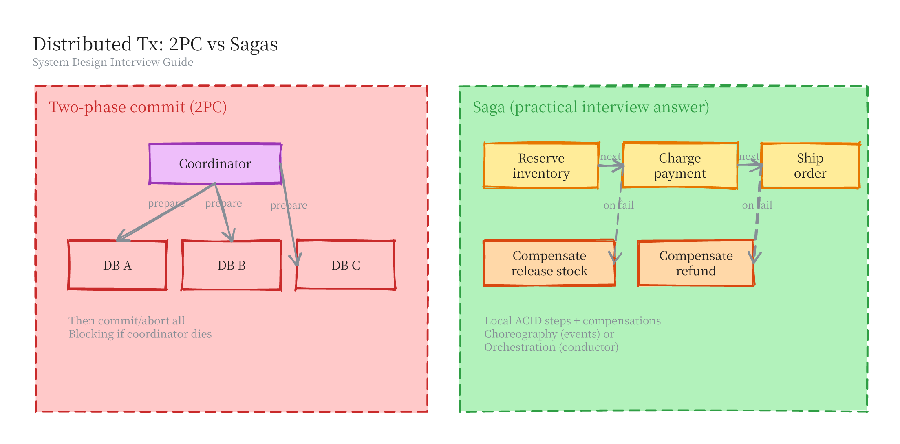

<sub>Editable source: [saga-vs-2pc.excalidraw](diagrams/excalidraw/saga-vs-2pc.excalidraw)</sub>

> **Key takeaway:** Prefer **sagas** (local transactions + compensations) in microservice interviews; mention 2PC so you can explain why it is painful.

### Two-phase commit (2PC)

1. **Prepare** — coordinator asks every participant: “Can you commit?” Each locks resources and answers yes/no.
2. **Commit (or abort)** — if all yes, coordinator tells everyone to commit; otherwise abort.

**Blocking problem:** if the coordinator dies after prepare, participants may hold locks indefinitely until human/ops recovery. 2PC also couples availability: one slow participant stalls all.

### Three-phase commit (idea only)

3PC inserts a **pre-commit** phase and timeouts to reduce some blocking cases. It is more complex, still imperfect under real networks, and rarely what modern product teams implement by hand. Enough to say: “3PC tries to fix blocking; still hard; we usually avoid distributed commit protocols.”

### Sagas — the practical interview answer

A **saga** is a sequence of **local** transactions. Each step publishes an event or calls the next service. If step N fails, run **compensating** actions to undo steps 1…N−1 (release seat, refund payment).

| Style | How coordination works |
|-------|------------------------|
| **Choreography** | Services react to each other’s domain events |
| **Orchestration** | A conductor/workflow service tells participants what to do |

### When to use what

| Approach | Use when |
|----------|----------|
| Single DB transaction | All data fits one ACID store |
| Saga | Cross-service business flows (orders, onboarding) |
| 2PC | Rare; tightly coupled systems that accept blocking |

### Tradeoffs

Sagas accept temporary inconsistency and need careful compensations (some actions are hard to undo). 2PC offers stronger atomicity with availability and ops costs.

### Failure modes

Missing compensations; non-idempotent steps; orchestrator SPOF without HA; choreography event spaghetti.

### Interview tip

Narrate checkout as a saga: `ReserveInventory → ChargeCard → ConfirmOrder` with compensations `ReleaseInventory` / `Refund`. State at-least-once + idempotency.

### Self-check

1. What makes 2PC “blocking”?
2. Choreography vs orchestration — one pro each?
3. Name a real-world action that is awkward to compensate.

## Indexes

**In plain English:** An index is like the index at the back of a book: it lets you jump to the right page instead of scanning every row. The tradeoff is that every write must update the index too.

> **Key takeaway:** Index the columns you filter and join on in hot paths; too many indexes slow writes and waste disk.

### Primary intuition

An index is a data structure (often B-tree or hash) mapping key → row location (or covering fields). Lookups become logarithmic or O(1) instead of scanning millions of rows.

### Types you should name

- **Primary / clustered** — determines physical order in some engines.
- **Secondary** — alternate lookup paths (email → user).
- **Composite** — multi-column; leftmost prefix matters (`(user_id, created_at)` helps `user_id` queries).
- **Covering** — index contains all columns needed; skips heap fetches.
- **Unique** — enforces uniqueness and speeds equality checks.
- **Partial / filtered** — index subset (`WHERE deleted = false`).
- **Full-text** — tokens/inverted lists (often external search).

### Write amplification

Every secondary index updates on insert/update/delete. Wide rows with many indexes slow writes and inflate storage. Index with intent.

### Selectivity

Indexing a boolean `is_active` alone rarely helps. High-cardinality keys (UUID, email) do. Combine low-cardinality columns with higher ones in composites.

### Query planning awareness

In interviews, say: “We’ll add a composite index matching the `WHERE` + `ORDER BY`.” Mention `EXPLAIN` in production culture without pretending to memorize planner quirks.

### Distributed indexes

In sharded DBs, secondary indexes are **local** (per shard) or **global** (expensive). Global secondary indexes need their own partitioning story.

### When to use

Any OLTP read by non-primary attributes; sort/limit patterns; join keys; uniqueness constraints.

### Tradeoffs

Faster reads vs slower writes; storage; index maintenance during migrations; risk of over-indexing.

### Failure modes

Missing index → CPU spike. Too many indexes → write latency. Index on changing columns causes churn. Skewed keys create hot index pages.

### Interview tip

After drawing tables, verbally add indexes for the top three queries. Interviewers listen for that habit.

### Self-check

1. Why does composite index column order matter?
2. Cost of adding five secondary indexes to a write-heavy table?
3. Local vs global secondary index in a sharded store?


## Sharding

**In plain English:** When one database can no longer hold all the rows or take all the writes, sharding splits the data across many databases — each holds a slice (for example, users A–M on shard 1, N–Z on shard 2).

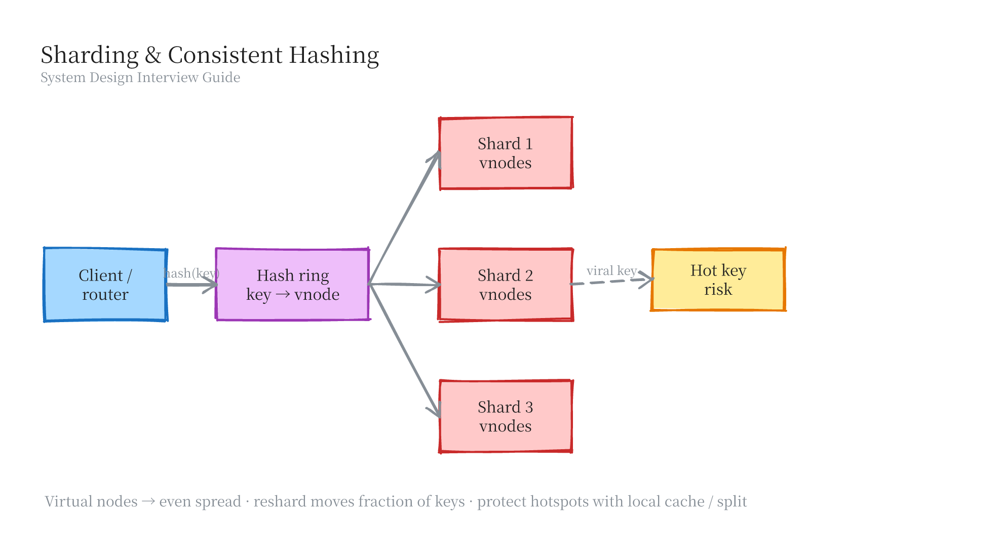

<sub>Editable source: [sharding-consistent-hash.excalidraw](diagrams/excalidraw/sharding-consistent-hash.excalidraw) (open at [excalidraw.com](https://excalidraw.com)). Legacy: `.drawio` under [`diagrams/`](diagrams/).</sub>


> **Key takeaway:** Pick a shard key that spreads load evenly and keeps related data together; hot keys are the classic failure mode.

### Shard key selection

The shard key determines where a row lives. Goals:

- **Even distribution** — avoid hotspots.
- **Query locality** — common queries should hit one shard.
- **Minimal cross-shard transactions**.

Examples: `user_id` for user-centric apps; `tenant_id` for multi-tenant SaaS; time-based for immutable logs (watch end-of-time hot shards).

### Strategies

| Strategy | Pros | Cons |
|----------|------|------|
| Range | Range scans easy | Hot latest range |
| Hash | Even load | Range queries scatter |
| Directory / lookup | Flexible | Lookup service SPOF |
| Geo | Data residency | Uneven regions |
| Consistent hashing | Online rebalance | Complexity |

### Resharding

Plan for growth: leave headroom, use consistent hashing or virtual nodes, or migrate with dual-write / change streams. Resharding is operationally hard—mention a plan even if you do not detail every step.

### Cross-shard operations

Joins, global sorts, and multi-row transactions become application-level problems (scatter-gather, sagas, two-phase commit). Avoid when possible by aligning shard key to transaction boundaries.

### Hot keys

Celebrity users or viral entities overload one shard. Mitigate with key salting, dedicated shards, caching, or separating extreme entities.

### When to use

Dataset or QPS exceeds comfortable single-primary capacity; clear partition key exists. Not day-one for small apps.

### Tradeoffs

Scale vs operational complexity; locality vs balance; autonomy vs cross-shard features.

### Failure modes

Wrong shard key forever; hot partitions; scattered queries timing out; unique constraints across shards; analytics needing fan-out.

### Interview tip

State the shard key and the query that remains single-shard. Then name one cross-shard operation and how you avoid or afford it.

### Self-check

1. Why is `created_at` alone a risky shard key for a social app?
2. How does salting help celebrity hot keys?
3. What breaks about `UNIQUE(email)` after hash sharding by `user_id`?


## Consistent hashing

**In plain English:** Consistent hashing is a clever way to decide which shard owns a key so that when you add or remove a machine, only a small fraction of keys move — not everything.


<sub>Editable source: [sharding-consistent-hash.excalidraw](diagrams/excalidraw/sharding-consistent-hash.excalidraw) (open at [excalidraw.com](https://excalidraw.com)). Legacy: `.drawio` under [`diagrams/`](diagrams/).</sub>


> **Key takeaway:** Use it for caches and shards when membership changes; virtual nodes help spread keys more evenly.

### Ring intuition

1. Hash nodes onto a circle (e.g. 0..2^32−1).
2. Hash key; walk clockwise to first node → owner.
3. Add a node: it takes a slice of keys from its neighbor — others untouched.

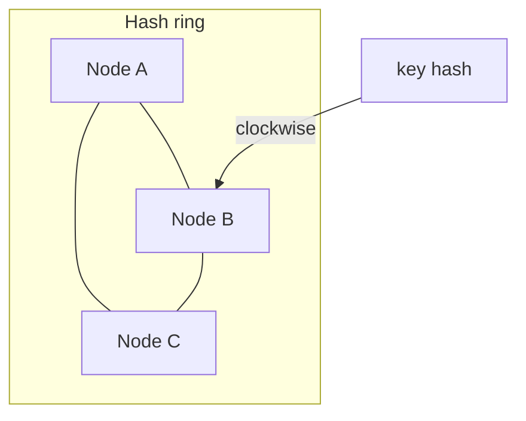
```mermaid
flowchart TB
  subgraph ring [Hash ring]
    N1[Node A]
    N2[Node B]
    N3[Node C]
    N1 --- N2 --- N3 --- N1
  end
  K[key hash] -->|clockwise| N2
```

### Virtual nodes (vnodes)

One physical node gets many positions on the ring (e.g. 100–200). Benefits:

- **Smoother load** — random placement averages out
- **Weighted capacity** — bigger boxes get more vnodes
- **Gentler rebalance** — adding capacity steals small shards from many peers

### Hotspot mitigations

| Problem | Mitigation |
|---------|------------|
| Celebrity key | Local cache; replicate hot key to many nodes; salt key into N subkeys |
| Uneven vnode placement | More vnodes; better hash; weighted ring |
| Narrow hot range | Avoid pure range partitioning for that workload; hybrid |
| Rebalance storms | Incremental transfer; rate-limited migration |

### Vs simple modulo hashing

`node = hash(key) % N` remaps **nearly all keys** when N changes. Consistent hashing remaps ~1/N. That is the interview punchline.

### Relation to sharding

Sharding often uses hash(key) % N or a lookup table. Consistent hashing is one **strategy** for shard placement and for **cache** node placement. Directory-based sharding is more flexible but needs a metadata service.

### When to use

- Distributed caches (Memcached-style client hashing)
- Partitioning log/stream consumers
- Designing “add cache boxes without flushing everything”

### Tradeoffs

Complexity vs modulo; vnode metadata size; need for a membership/gossip view of who is on the ring; handling “node down but still on ring” (prefer explicit leave + replication).

### Failure modes

- Too few vnodes → imbalance
- Clients with divergent membership views → split ownership / misses
- Ignoring replication: one node death loses its key range unless you store N successors (Dynamo-style)

### Interview tip

Draw a ring, place 3 nodes, show adding a fourth and which keys move. Say “virtual nodes for balance; hot keys handled separately with caching/salting.” Tie to [Sharding](#sharding) for data stores.

**Diagram:** [diagrams/foundations-data-tier.drawio](diagrams/foundations-data-tier.drawio)

### Self-check

1. Why does `hash % N` hurt on cluster resize?
2. What problem do virtual nodes solve?
3. How do you protect a single viral key even with a perfect ring?

---

## Replication

**In plain English:** Replication means keeping copies of the same data on more than one machine. If the primary dies, a replica can take over; replicas can also serve read traffic.

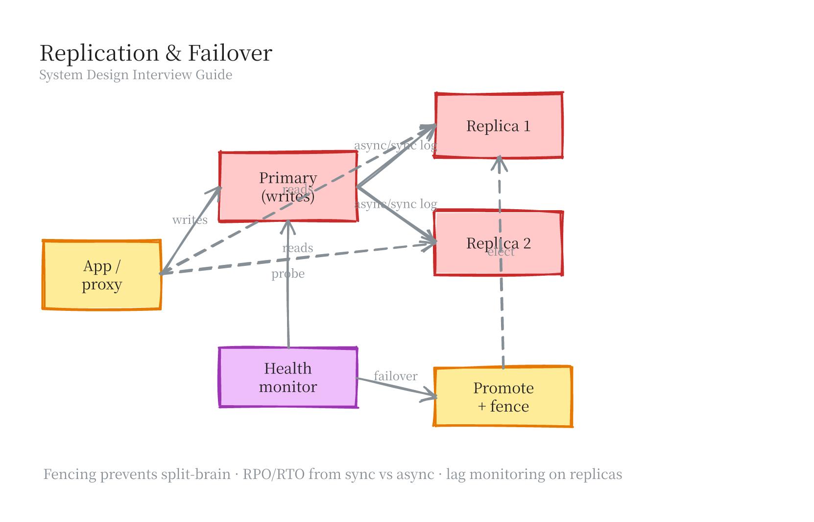

<sub>Editable source: [replication-failover.excalidraw](diagrams/excalidraw/replication-failover.excalidraw) (open at [excalidraw.com](https://excalidraw.com)). Legacy: `.drawio` under [`diagrams/`](diagrams/).</sub>


> **Key takeaway:** Sync replication protects against data loss but slows writes; async is faster but can lose the last few seconds on failover.

### Primary-replica vs multi-primary (crystal clear)

| Mode | Writers | Readers | Failure story |
|------|---------|---------|---------------|
| **Primary–replica** (master–slave) | Single primary | Replicas (lag possible) | Promote a replica; fence old primary |
| **Multi-primary** (master–master) | Several writable nodes | Any | Higher write availability; **conflict resolution** required |

### Sync vs async (crystal clear)

| Mode | When client gets “success” | RPO vibe |
|------|----------------------------|----------|
| **Synchronous** | After N replicas durable | Low data-loss risk; higher write latency |
| **Asynchronous** | After primary durable | Fast writes; may lose the last seconds on crash |

Semi-sync hybrids exist (wait for at least one ack). Always state which you mean on the whiteboard.


### Primary-secondary (leader-follower)

One primary accepts writes; secondaries replicate the log. Reads can go to secondaries (stale possible) or primary (fresher).

**Failover:** promote a secondary if primary dies. Automated failover needs fencing to avoid two primaries.

### Multi-primary

Multiple writers—higher write availability, conflict resolution required (last-write-wins, CRDTs, app merges). Harder; use when geo write locality demands it.

### Sync vs async

- **Synchronous** — wait for N replicas; lower loss risk (RPO), higher write latency.
- **Asynchronous** — fast ack; risk losing recent writes on crash.

Quorum systems (Dynamo-style) use W/R/N to tune: if W+R>N, overlapping reads see latest acknowledged write (simplified).

### Read replicas

Scale read QPS; replication lag is the tax. Route lag-sensitive reads to primary.

### Geographic replication

Keep data near users; survive regional loss. Cross-region sync latency is tens to hundreds of ms—design accordingly.

### When to use

Always for production durability (at least another AZ). Read replicas when read-heavy. Multi-primary only with clear conflict story.

### Tradeoffs

Freshness vs latency; simplicity of single writer vs multi-writer; cost of idle replicas.

### Failure modes

Failover split-brain, replica lag causing user-visible “missing” data, cascading replica crashes under load after promotion, schema change ordering.

### Interview tip

Draw primary + at least one replica and say whether replication is sync or async and what RPO that implies.

### Self-check

1. User writes then immediately reads a replica—what can go wrong?
2. Why is fencing important during failover?
3. Interpret W=3, R=2, N=5 at a high level.


## Database federation

**In plain English:** **Federation** splits data by **domain or function** into separate databases — orders DB, users DB, inventory DB — rather than (or before) slicing one table by hash key. It is an organizational and scaling pattern: different teams own different stores.

> **Key takeaway:** Federation = split by **what** the data means; sharding = split by **which key range/hash** inside one logical dataset.

### Federation vs sharding

| | **Federation** | **Sharding** |
|--|----------------|--------------|
| Split axis | Domain / bounded context | Key (user_id, tenant_id, …) |
| Schema | Often different schemas | Same schema pattern per shard |
| Cross access | Application joins across DBs (painful) | Cross-shard queries (also painful) |
| Ownership | Maps to team boundaries | Maps to capacity |

You can federate **and** shard (orders DB sharded by `order_id`).

### When federation helps

- Different scaling profiles (write-heavy events vs read-heavy profiles)
- Independent deploy/schema cadence per domain
- Blast-radius reduction (bad migration in analytics DB does not lock auth DB)
- Clear microservice data ownership

### When it hurts

- Reporting that needs wide joins across domains
- Distributed transactions across federated DBs (see sagas)
- “Distributed monolith” where every request fans out to eight federated stores synchronously

### Tradeoffs

Team autonomy vs operational sprawl; smaller schemas vs cross-domain consistency challenges.

### Failure modes

Chatty sync joins across federated DBs; duplicating reference data without a sync plan; treating federation as a free lunch for consistency.

### Interview tip

“We’ll federate identity vs social graph vs media metadata; shard only the huge message table.” Shows layered thinking.

### Self-check

1. Is splitting `users` and `orders` into two databases sharding or federation?
2. Why might finance refuse to share a DB with the feed service?
3. How do you query across federated stores without JOINs?

## CAP & PACELC

**In plain English:** When part of the network breaks, a distributed system often cannot be both fully consistent and fully available at the same time. CAP/PACELC are vocabulary for naming which side you lean toward — for this product, under partition and in steady state.

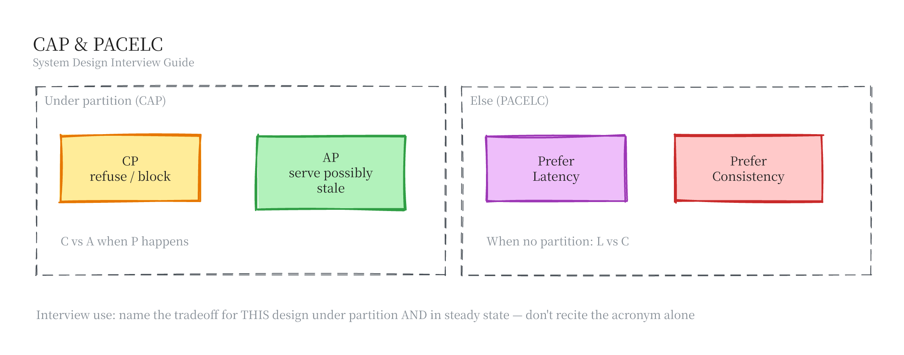

<sub>Editable source: [cap-pacelc.excalidraw](diagrams/excalidraw/cap-pacelc.excalidraw) (open at [excalidraw.com](https://excalidraw.com)). Legacy: `.drawio` under [`diagrams/`](diagrams/).</sub>


> **Key takeaway:** Do not recite acronyms; say what your design does when a region is unreachable and what users see.

### CAP (briefly)

In a partition (nodes cannot communicate), a system must choose:

- **C**onsistency — every read returns the latest write (linearizability-style).
- **A**vailability — every request gets a non-error response.
- **P**artition tolerance — partitions happen; you must handle them.

On a partition you cannot have both perfect C and perfect A. CP systems refuse or block conflicting sides; AP systems serve possibly stale or divergent data.

**Caveats:** CAP is about partitions, not normal operation. “Consistency” here is strong/linearizable—not the C in ACID. Real systems are nuanced (tunable consistency).

### PACELC

Extends CAP: **if Partition, choose A or C; Else (no partition), choose Latency or Consistency.**

Even healthy networks force a choice between waiting for sync replication (consistent, slower) vs responding from a local replica (faster, possibly stale).

### Applying in interviews

| Domain | Typical lean |
|--------|----------------|
| Bank ledger | CP / prefer C over L |
| Shopping cart (guest) | often AP + merge |
| Social like counts | AP / prefer L |
| Config/feature flags | often CP |
| DNS | classic AP flavor |

Always name the **user-visible** inconsistency: “like count may lag 5s” vs “balance must not.”

### When to invoke CAP/PACELC

Multi-region writes, replica reads, conflict-prone collaborative data. Skip the acronym monologue for a single-node Postgres MVP.

### Tradeoffs

Strong consistency raises latency and can reduce availability under partitions. Eventual consistency needs conflict rules and user messaging.

### Failure modes

Assuming “we use Cassandra so we’re AP” without configuring consistency levels; ignoring client retries that create duplicates; confusing backup restore with consistency models.

### Interview tip

Prefer concrete language: “On region failure we serve stale reads for 2 minutes rather than error.” Map that to AP-under-partition without lecturing.

### Self-check

1. Restate CAP without claiming “pick two of three” forever.
2. Give a PACELC example for a multi-region user profile store.
3. Why is ACID’s C different from CAP’s C?


## Messaging

**In plain English:** A message queue lets one part of the system hand work to another without waiting — like dropping a ticket in a inbox. Pub/sub is the same idea when many teams each need their own copy of an event (email, search indexer, analytics).

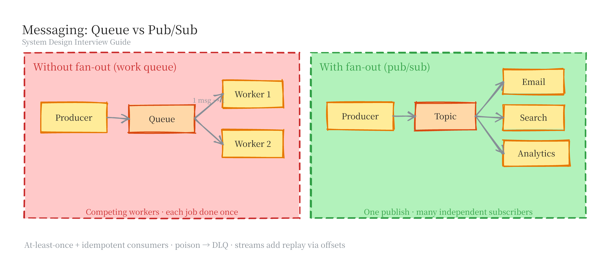

<sub>Editable source: [messaging.excalidraw](diagrams/excalidraw/messaging.excalidraw) (open at [excalidraw.com](https://excalidraw.com)). Legacy: `.drawio` under [`diagrams/`](diagrams/).</sub>


> **Key takeaway:** Use queues to absorb spikes and decouple failures; choose queue vs pub/sub based on one-consumer vs many-subscribers.

### Broker vs queue vs pub/sub (naming)

- **Message broker** — the platform (RabbitMQ, Kafka, SQS/SNS, Pulsar) that moves messages.
- **Queue** — competing consumers; each message goes to **one** worker (task distribution).
- **Pub/sub** — each subscription gets a copy (fan-out to email, search, analytics).

Kafka-style **logs** are durable, ordered partitions with offset-based consumers — great for replay. Classic queues delete or ack-away messages after processing. See also the short [Enterprise Service Bus (ESB)](#enterprise-service-bus-esb) note for the older heavyweight alternative.


### Queues vs streams vs pub/sub

- **Work queue** — each message processed by one consumer (task distribution).
- **Pub/sub** — broadcast to many subscriptions.
- **Log/stream** (Kafka-style) — durable ordered log; consumers track offsets; replay possible.

### Why async

- Absorb traffic spikes
- Retry independently
- Fan out one write to many downstreams (email, analytics, search index)
- Long-running work without blocking HTTP

### Ordering

Total global order is expensive. Prefer **per-key ordering** (partition by `user_id`) when sequence matters. Do not assume cross-partition order.

### Poison messages

Bad payloads can block a consumer forever. Use max retries → dead-letter queue (DLQ) → alert and inspect.

### Schema evolution

Version payloads (or use compatible schemas). Consumers must tolerate new fields; producers must not break required old fields without coordination.

### When to use

Email/push side effects, stream processing, ingestion pipelines, workflow steps between services. Avoid for the critical synchronous read path the user is waiting on—unless you have a plan for “accepted” vs “done.”

### Tradeoffs

Decoupling vs end-to-end latency; ops complexity; exactly-once difficulty; debugging distributed flows.

### Failure modes

Unbounded queues hiding outages, consumer lag, duplicate processing, hot partitions, lost messages if durability misconfigured, chatty tiny messages overwhelming brokers.

### Interview tip

Draw the queue on the **write path** for side effects, and state consumer idempotency. Tie partition key to ordering needs.

### Self-check

1. Queue vs log: which supports replay better and why?
2. How do you preserve per-user message order at scale?
3. What is a DLQ for?


## Enterprise Service Bus (ESB)

**In plain English:** An **ESB** was a heavyweight “universal adapter” in the SOA era — one bus to transform, route, and integrate every enterprise system. Modern designs usually prefer **lighter message brokers** and explicit APIs instead of a smart central bus that knows everyone’s business logic.

> **Key takeaway:** Know the term historically; in interviews prefer queues/streams + dumb pipes / smart endpoints over a giant ESB.

### What it tried to solve

Many legacy systems, different protocols, need for transformation and orchestration in one place.

### Why teams moved on

- Smart buses become organizational bottlenecks and SPOFs
- Hard to version and test central transformation logic
- Cloud-native style: **smart endpoints, dumb pipes** (Kafka/SQS/Rabbit + small services)

### When a brief mention helps

Brownfield enterprise prompts (“integrate SAP + CRM + custom apps”). Propose an event backbone or API layer rather than recreating a classic ESB.

### Tradeoffs

Central control vs autonomy; rich built-in mediators vs opaque failure domains.

### Interview tip

“We might have used an ESB historically; I’d use a message broker plus bounded-context services and keep transforms local.”

### Self-check

1. What problem did ESBs aim to solve?
2. Why can a smart bus become a bottleneck?
3. What is a lighter modern alternative?

## Delivery guarantees

**In plain English:** "Will this message arrive once, at least once, or maybe never?" Delivery guarantees answer that. In practice most systems are at-least-once, and your consumer must tolerate duplicates.

> **Key takeaway:** True end-to-end exactly-once is rare; design idempotent consumers and clear dedupe keys.

### At-most-once

Fire and forget; on failure, message may be lost. Lowest overhead. Acceptable for metrics where loss is OK.

### At-least-once

Retries until ack. Duplicates possible. **Default assumption** for reliable systems. Requires **idempotent** consumers or dedupe stores.

### Exactly-once (effects)

Broker features (idempotent producers, transactions) help, but *effectively-once* usually means: at-least-once delivery + idempotent processing + transactional side effects (or carefully ordered upserts). True end-to-end exactly-once across arbitrary side effects (email send + DB write + third party) is hard—prefer designing duplicates to be safe.

### Idempotency patterns

- Idempotency keys stored with TTL
- Natural keys upsert (`INSERT ... ON CONFLICT`)
- Version checks / compare-and-set
- Deduplicating caches for event IDs

### Ordering vs duplicates

Retries can reordering relative to other keys. Per-key partitions + idempotency cover most chat/notification needs.

### Acknowledgments

Ack after side effect succeeds (risk redelivery) vs before (risk loss). Prefer ack after durable success for at-least-once.

### When to use which

| Case | Guarantee |
|------|-----------|
| Debug logs | at-most-once |
| Charge card | effectively-once via ledger idempotency |
| Push notification | at-least-once; UX tolerates rare dupes or dedupe by notif id |
| Analytics counts | often at-least-once + additive approx or exactly with transactional outbox |

### Tradeoffs

Stronger guarantees cost latency, complexity, and throughput. Over-promising exactly-once without an idempotency story is a red flag.

### Failure modes

Non-idempotent consumers double-charge; ack-before-write loss; dual writes without transactional outbox causing inconsistency between DB and bus.

### Interview tip

Say: “Broker is at-least-once; consumers upsert by event_id.” That sentence beats “we use exactly-once Kafka” alone.

### Self-check

1. Why does at-least-once require idempotency?
2. Sketch a transactional outbox in three steps.
3. Can you exactly-once send a push notification to APNS? What’s practical?


## Coordination

**In plain English:** Sometimes many servers must agree — who is the leader, who holds a lock, what is the latest config. Coordination systems (ZooKeeper, etcd, Consul) exist for that, but they are easy to overuse.

> **Key takeaway:** Keep coordination off the hot request path; prefer leases with TTLs and clear fencing on failover.

### Leader election

One primary performs a privileged role (job scheduler, partition owner). Implementations: ZooKeeper/etcd/Consul, DB leases, Kubernetes lease objects, Redis with care.

Leaders must use **fencing tokens** so an old leader cannot act after a new one is elected (split-brain write protection).

### Distributed locks

Serialize access to a shared resource. Prefer short critical sections. Locks need TTLs and safe extension (fencing). Many “Redis locks” are unsafe if misimplemented—mention caution.

Often better alternatives: queue workers (single consumer group), DB unique constraints, conditional updates.

### Leases

Time-bounded ownership. If holder dies, lease expires and another takes over. Clock skew matters—use consensus stores’ time or logical tokens.

### Cluster membership & service discovery

Who is alive? Health checks + registries. Clients need stale-membership tolerance (retry another instance).

### Configuration & feature flags

Central config with watch/notify. Version config; avoid blocking all traffic on config store (cache locally with TTL).

### When to use

Schedulers, shard primaries, singleton consumers, mutually exclusive batch jobs, barrier sync in rare algorithms.

### When *not* to use

Do not lock across high-QPS user requests if you can shard or use optimistic concurrency. Coordination systems are low-throughput relative to data planes.

### Tradeoffs

Correctness vs availability (consensus majority needed); operational dependency on ZooKeeper/etcd; latency of lock round-trips.

### Failure modes

Split brain without fencing; lock expiry too short under GC pause; thundering herd on lock release; coordination outage freezing the world (reduce hard dependencies).

### Interview tip

For “only one worker should process this,” prefer a **queue with single-consumer semantics** or a **DB lease** before inventing a custom Paxos.

### Self-check

1. What is a fencing token and why does it matter?
2. Why are distributed locks dangerous on the request path?
3. Give an alternative to a global lock for unique username creation.


## Bloom filters

**In plain English:** A Bloom filter is a tiny, slightly forgetful checklist: it can say "this item is definitely not here" or "maybe it is." Crawlers and caches use it to skip expensive lookups for things they have never seen.

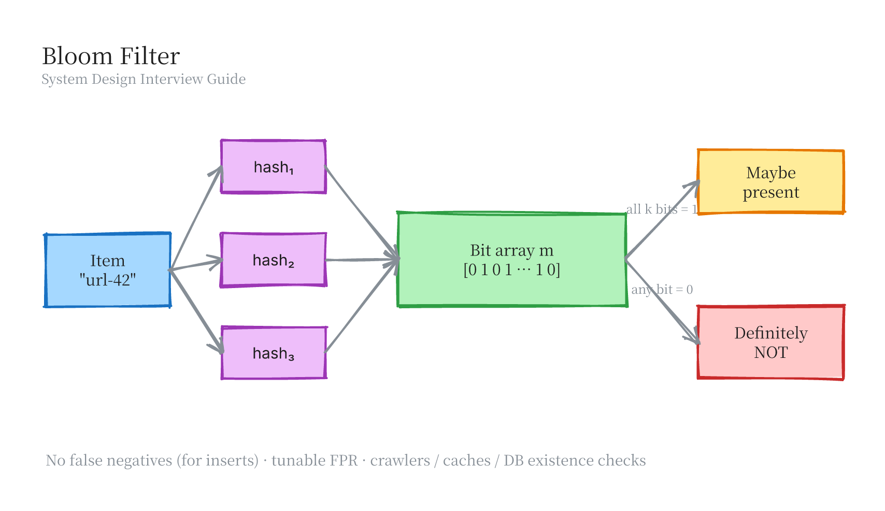

<sub>Editable source: [bloom-filter.excalidraw](diagrams/excalidraw/bloom-filter.excalidraw) (open at [excalidraw.com](https://excalidraw.com)). Legacy: `.drawio` under [`diagrams/`](diagrams/).</sub>


> **Key takeaway:** Great for cheap negative checks; never treat a "maybe" as proof the item exists.

### How it works (intuition)

- Bit array of size `m`, `k` hash functions.
- Insert: set `k` bits.
- Query: if any of the `k` bits is 0 → **absent**; if all 1 → **maybe present**.

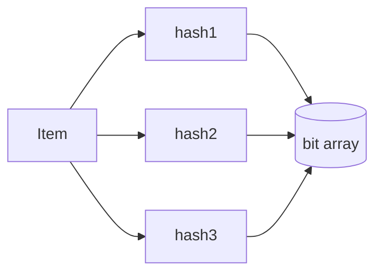
```mermaid
flowchart LR
  item[Item] --> h1[hash1]
  item --> h2[hash2]
  item --> h3[hash3]
  h1 --> bits[(bit array)]
  h2 --> bits
  h3 --> bits
```

### When to use

- **“Have we seen this URL?”** in a crawler before hitting a heavier store
- **Cache protection:** Bloom in front of DB to skip lookups for missing keys (careful with invalidation)
- **Compaction / LSM** internals (many DBs use them — name-drop OK)
- **Sync systems:** quickly skip chunks you almost certainly have

### When **not** to use

- Need exact membership with deletions (unless counting Bloom / Cuckoo filter)
- Need to list all members (you can’t)
- False positives are catastrophic (billing, authz) without a definitive secondary check

### Tradeoffs

| Parameter | Effect |
|-----------|--------|
| Larger `m` | Fewer false positives; more memory |
| More `k` | Up to a point improves FP; then hurts |
| Counting Bloom | Allows delete; more memory |

Always pair with a **source of truth** when false positives matter: Bloom says maybe → check RocksDB / Postgres.

### Failure modes

- Undersized filter → FP rate explodes; system thrashes on secondary checks
- Treating “maybe” as “yes” for security decisions
- Not resizing / rotating filters as cardinality grows
- Clearing bits for delete on a non-counting Bloom → false negatives (corrupts invariant)

### Interview tip

In crawler / dedup designs: “Bloom filter for cheap negative checks, authoritative store for exact seen-set; accept rare redundant fetches from FPs.” Know one number: a few bytes per element for ~1% FP is the usual ballpark people cite.

### Self-check

1. Can a standard Bloom filter return a false negative after an insert?
2. Why is Bloom alone insufficient for “user is banned”?
3. How do Bloom filters help a web crawler’s scheduler?

---

## Checksums and data integrity

**In plain English:** Bits flip. Disks lie. Checksums are fingerprints of data so you can notice corruption when bytes move across the network or sit on disk.

> **Key takeaway:** Verify checksums at trust boundaries (upload, replication, restore); silent corruption is rare but interviewers expect the mention.

### Layers of integrity

| Layer | Mechanism | Catches |
|-------|-----------|---------|
| Disk / FS | Checksummed filesystems (e.g. ZFS/btrfs ideas), ECC RAM | Bit rot, some hardware faults |
| Object storage | ETag / MD5 / SHA-256 on PUT; CRC on wire | Transfer corruption |
| App | Content-hash chunk IDs; Merkle trees | Tampering + dedup identity |
| Replication | Checksum before apply; scrub jobs | Diverged replicas |
| Messages | CRC in framing; TLS integrity | Transit corruption / MITM (TLS) |

### Content-addressed storage

Hash the bytes → ID (`sha256:…`). Same content → same ID (dedup). Used in Dropbox-like chunk stores, container layers, Git. Verify on read: rehash and compare.

### End-to-end checksum pattern (uploads)

1. Client computes hash of file/chunk.
2. Upload with hash in header or signed policy.
3. Server verifies before commit; reject on mismatch.
4. Store hash in metadata for later scrubbing.

### Merkle trees (interview-level)

Tree of hashes; root summarizes whole dataset. Efficiently find **which** block differs between replicas (anti-entropy in Dynamo-style systems). Mention for large sync / distributed DB repair — do not implement on the whiteboard.

### When to emphasize

- File sync, blob pipelines, backups, multi-region replication
- Financial ledgers (application-level hashes / signatures)
- Any “download then process” worker path

### Tradeoffs

Stronger hashes (SHA-256) cost CPU vs weaker CRCs; verify-on-every-read vs periodic scrub; storing checksums doubles metadata concern but saves silent bad data.

### Failure modes

- Trusting client hash without server verify
- Using non-cryptographic hash where tampering matters
- Checksum mismatch without remediation playbook (quarantine vs re-replicate)
- Compressing then hashing inconsistently across versions

### Interview tip

For Dropbox/YouTube/backup designs: “chunk with content hash; verify on upload; scrub replicas asynchronously.” One sentence shows maturity.

### Self-check

1. Difference between detecting corruption and detecting malicious tampering?
2. Why content-hash chunk IDs help both integrity and deduplication?
3. What is a scrubber job in a replicated store?

---

## Distributed file systems

**In plain English:** A distributed file system stores huge files by chopping them into chunks across many machines, with a metadata service that remembers where each chunk lives — think videos, dataset dumps, backups.

> **Key takeaway:** Separate metadata from chunk storage; plan for metadata HA and for re-replicating chunks when disks die.

### Core components

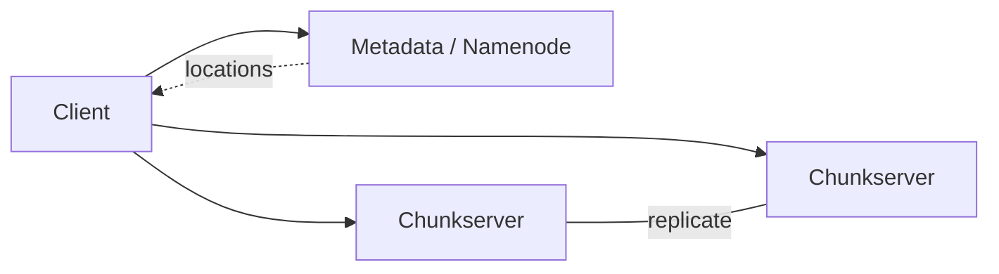
```mermaid
flowchart LR
  Client --> Master[Metadata / Namenode]
  Client --> C1[Chunkserver]
  Client --> C2[Chunkserver]
  Master -.->|locations| Client
  C1 ---|replicate| C2
```

| Piece | Responsibility |
|-------|----------------|
| **Metadata server** | Namespace (dirs/files), chunk maps, leases, GC |
| **Chunkservers** | Store chunk replicas on local disk; report heartbeats |
| **Client** | Talks to metadata for layout; transfers data to chunkservers |
| **Secondary / standby** | Metadata HA (critical SPOF historically) |

### Typical numbers (order-of-magnitude)

- Chunk size: **64–256 MB** (amortizes metadata; sequential throughput)
- Replication: **3×** across racks/AZs
- Write: primary replica pipelines to secondaries (or quorum)

### Ops realities interviewers like

- Metadata is **not** infinite — millions of small files hurt (same lesson as HDFS)
- Rebalancer moves chunks on disk/node imbalance
- Checksum + scrub; re-replicate on disk failure
- Lease/generation numbers avoid split-brain writers

### Cloud analogue

Object storage (S3) is often the modern interview answer for blob bytes; a “DFS” discussion still shows you understand **metadata vs data plane**, replication, and large sequential I/O. Many products use object storage + a metadata DB instead of classic HDFS.

### When to use

- Analytics lakes, training data, large media pipelines
- Internal “cheap huge files” stores
- Rarely as the primary store for tiny transactional rows

### Tradeoffs

| Classic DFS | Object store + metadata DB |
|-------------|----------------------------|
| POSIX-ish / append models vary | HTTP APIs; eventual listing |
| Metadata SPOF risk | Managed durability; different consistency |
| Great sequential throughput | Excellent durability; per-request costs |

### Failure modes

- Metadata outage freezes namespace ops
- Small-file problem (metadata explosion)
- Under-replicated chunks after correlated rack failure
- Client writes without lease fencing → corruption

### Interview tip

If designing Dropbox: prefer **chunked object storage + metadata service** over inventing HDFS. Name chunk size, replication, and “client uploads chunks directly.” Link: [Dropbox-like](#dropbox-like). Diagram: [diagrams/excalidraw/dropbox.excalidraw](diagrams/excalidraw/dropbox.excalidraw).

### Self-check

1. Why are chunks large (64MB+) in GFS/HDFS-style systems?
2. What is the blast radius of metadata-server loss?
3. How does a client find which servers hold a chunk?

---

## Circuit breakers and bulkheads

**In plain English:** If a dependency is on fire, blindly retrying can burn your service down too. A circuit breaker stops calling a sick dependency for a while; a bulkhead limits how much of your capacity any one dependency can consume.

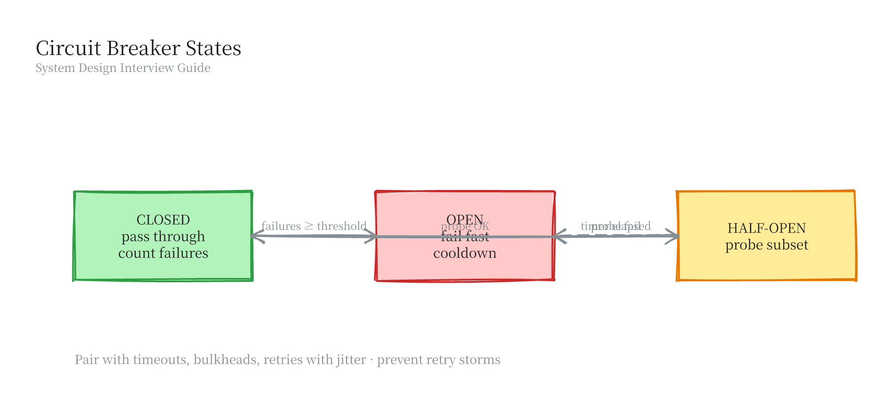

<sub>Editable source: [circuit-breaker.excalidraw](diagrams/excalidraw/circuit-breaker.excalidraw) (open at [excalidraw.com](https://excalidraw.com)). Legacy: `.drawio` under [`diagrams/`](diagrams/).</sub>


> **Key takeaway:** Pair timeouts, bounded retries with jitter, circuit breakers, and isolation — retries alone can amplify outages.

### Circuit breaker states

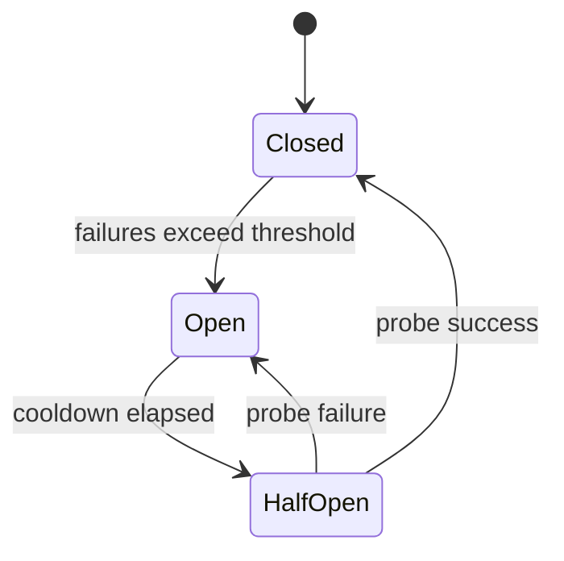
```mermaid
stateDiagram-v2
  [*] --> Closed
  Closed --> Open: failures exceed threshold
  Open --> HalfOpen: cooldown elapsed
  HalfOpen --> Closed: probe success
  HalfOpen --> Open: probe failure
```

- **Closed:** normal; track error rate / latency.
- **Open:** fail fast — do not call the bad dependency; return fallback or error.
- **Half-open:** allow limited probes to test recovery.

### Bulkheads

Isolate resources so one workload cannot starve others — like ship compartments:

- Separate **thread pools / connection pools** per dependency
- Separate **queues** for priority classes (OTP vs marketing)
- Separate **compute** for noisy tenants
- Isolate **caches** so eviction storms in one keyspace don’t trash another

### Complementary patterns

| Pattern | Role |
|---------|------|
| **Timeout** | Bound wait |
| **Retry + jitter** | Transient faults only; budget retries |
| **Circuit breaker** | Stop calling a sick dependency |
| **Bulkhead** | Limit blast radius / resource coupling |
| **Load shedding** | Drop low-priority work when saturated |
| **Fallback** | Cached / degraded response |

### When to use

- Any sync call to another service, DB, or payment provider
- Multi-tenant platforms (noisy neighbor)
- Notification lanes with different SLOs

### Tradeoffs

Fail-fast reduces load but can hide partial recovery if thresholds are wrong. Fine-grained bulkheads improve isolation but multiply pool tuning. Fallbacks risk serving stale or empty UX — be explicit.

### Failure modes

- Retry storms without breakers
- One shared connection pool to DB exhausted by a heavy endpoint
- Circuit stuck open due to bad health signal (need half-open + metrics)
- Fallback returning incorrect financial data (never fallback “paid=true”)

### Interview tip

On deep-dive failures: “Timeouts + limited retries with jitter; circuit breaker on payment provider; bulkhead pools so search cannot exhaust checkout’s DB connections.” Draw a small breaker on the arrow to the dependency.

**Diagram:** [diagrams/foundations-traffic-tier.drawio](diagrams/foundations-traffic-tier.drawio)

### Self-check

1. What problem do retries create during a partial outage?
2. Closed vs open vs half-open in one sentence each?
3. Give a bulkhead example for a notification system.

---

## SLA, SLO, and SLI

**In plain English:** An SLI is what you measure (for example, the fraction of requests faster than 200 ms). An SLO is the target you aim for. An SLA is the customer-facing promise — often with credits if you miss.

> **Key takeaway:** Pick a few user-visible SLIs, set SLOs, and use error budgets to decide when to ship features vs harden reliability.

### Definitions

| Term | Meaning | Example |
|------|---------|---------|
| **SLI** | Quantitative measure of service level | Availability = successful requests / total; p99 latency |
| **SLO** | Target for an SLI | 99.9% monthly availability; p99 < 200 ms |
| **SLA** | Business contract with consequences | Credits if SLO breached; legal/commercial |

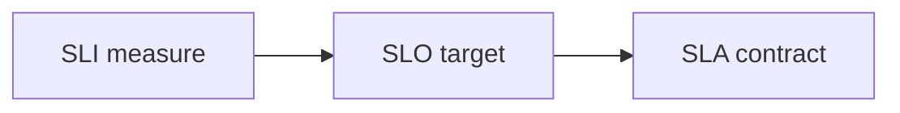
```mermaid
flowchart LR
  SLI[SLI measure] --> SLO[SLO target]
  SLO --> SLA[SLA contract]
```

### Error budgets

If SLO is 99.9% monthly, allowed downtime ≈ 43 minutes/month. **Error budget** = that allowance. Burn it on releases/experiments; freeze changes when budget is exhausted. This is how SRE ties reliability to velocity.

### Choosing SLIs for designs

- **User-facing API:** availability, latency (p50/p99), correctness (where measurable)
- **Pipeline:** lag freshness, success ratio
- **Storage:** durability (harder to measure live — often engineering objective)
- Prefer **user-centric** SLIs (“feed load success”) over pure CPU

### When to use in interviews

- Senior prompts; multi-region; payments; “how do you know you’re healthy?”
- Tie alerts to SLO burn rate, not raw CPU

### Tradeoffs

Too many SLOs → noise. Too tight → endless toil. Too loose → users hurt before you page. Latency SLOs without availability SLOs miss outages that return fast 500s… actually 500s hurt availability SLI — define success carefully.

### Failure modes

- SLA promised without measurement
- Alerting on symptoms that don’t track SLIs
- Averaging away regional outages in a global success ratio (use per-region SLIs)

### Interview tip

Write on the board: “SLO: 99.9% successful redirects, p99 < 50 ms; SLI: non-5xx within 50 ms / total.” Mention error budget once at senior level.

### Self-check

1. Can you have an SLO without an SLA?
2. Rough downtime budget for 99.9% vs 99.99% monthly?
3. Why is CPU% a weak SLI for user happiness?

---

## Disaster recovery

**In plain English:** **Disaster recovery (DR)** is the plan for when a whole zone or region fails — not just one disk. You decide how much data you can lose and how long you can be down, then buy the architecture that matches.

> **Key takeaway:** State **RPO** and **RTO** as numbers before proposing multi-region; backups alone are not a DR strategy if you never rehearsed restore.

### RPO and RTO

| Term | Meaning | Question it answers |
|------|---------|---------------------|
| **RPO** (Recovery Point Objective) | How much data you may lose | “Is losing the last 5 minutes of writes OK?” |
| **RTO** (Recovery Time Objective) | How long until service is back | “Can we be down for 1 hour?” |

### Example targets (illustrative)

| Tier | Example RPO | Example RTO | Typical techniques |
|------|-------------|-------------|--------------------|
| Bronze | 24 h | 24–48 h | Daily backups, cold restore |
| Silver | Minutes–1 h | 1–4 h | Async cross-region replicas, runbooks |
| Gold | Seconds–minutes | Minutes | Sync or near-sync replication, automated failover |
| Platinum | ≈0 | ≈0 | Active-active multi-region, conflict design |

### Building blocks

- **Backups** — periodic snapshots; test restores!
- **Replication** — streaming copies in another AZ/region
- **Multi-region failover** — DNS/Geo steer away from a bad region
- **Chaos / game days** — prove the runbook before Black Friday

### When to emphasize

Senior prompts, payments, health, globally critical consumer apps. For a toy URL shortener MVP, mention backups + single-region HA first.

### Tradeoffs

Tighter RPO/RTO ⇒ exponential cost and complexity (esp. active-active).

### Failure modes

Untested backups; DNS TTL delaying failover; failing over without fencing the old primary (split brain); region failover that forgets async workers.

### Interview tip

Write “RPO ≤ 1 min, RTO ≤ 15 min → async cross-region replica + runbook DNS cutover” in the NFR corner.

### Self-check

1. Difference between RPO and RTO?
2. Why is RAID not DR?
3. What goes wrong if DNS TTL is 24h during regional failover?


## Observability

**In plain English:** Observability is how you explain why the system is sick using metrics, logs, and traces — the difference between "CPU is high" and "checkout is slow because payments p99 spiked after deploy."

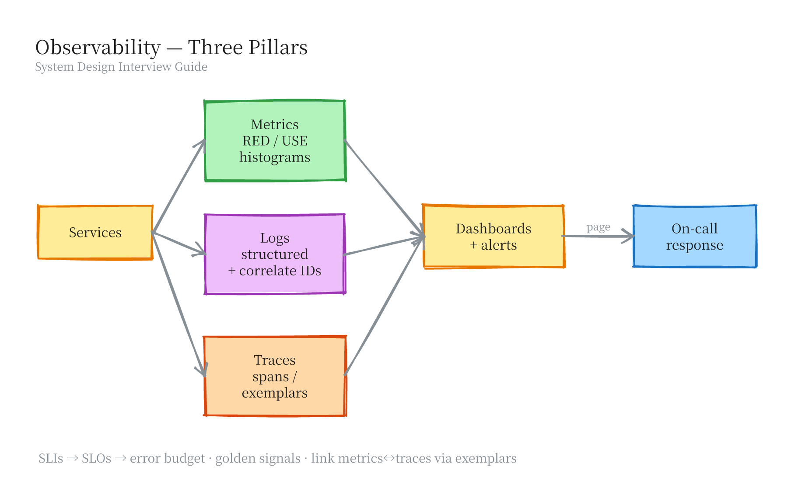

<sub>Editable source: [observability.excalidraw](diagrams/excalidraw/observability.excalidraw) (open at [excalidraw.com](https://excalidraw.com)). Legacy: `.drawio` under [`diagrams/`](diagrams/).</sub>


> **Key takeaway:** Instrument golden signals, correlate with request IDs across services, and alert on symptoms users feel.

### Metrics

Numeric time series: counters, gauges, histograms.

- **RED:** Rate, Errors, Duration (request-scoped services)
- **USE:** Utilization, Saturation, Errors (resources)
- Histograms for latency percentiles (p50/p99)
- Exemplars linking metrics → traces

### Logs

Timestamped events. Structured JSON > free text. Use for audit, errors, sparse high-cardinality details. **Do not** log secrets. Sample high-volume debug.

### Traces

A **trace** = end-to-end request path; **spans** = units of work. Critical for microservices. Propagate trace context (`traceparent`) across HTTP/queue boundaries. Sample thoughtfully in high QPS systems.

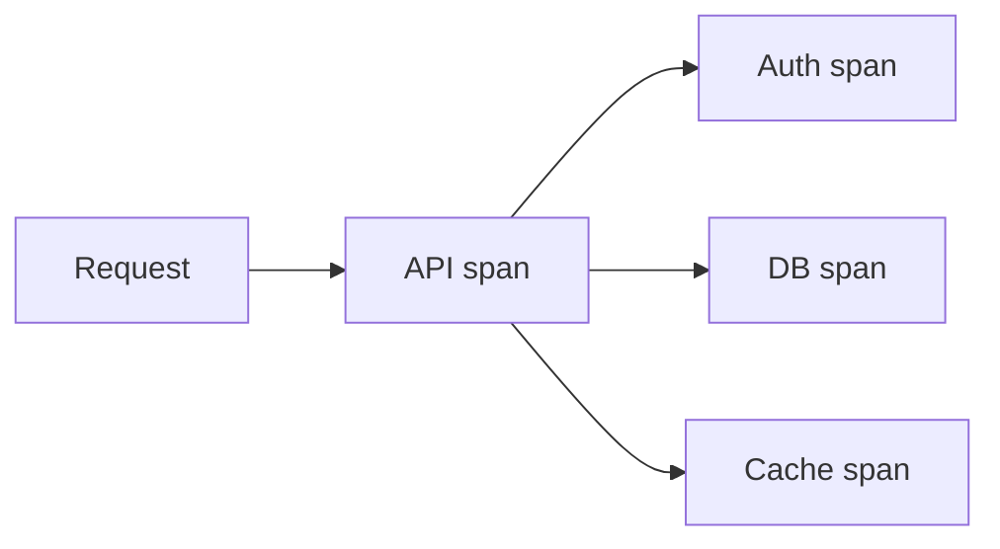
```mermaid
flowchart LR
  Req[Request] --> S1[API span]
  S1 --> S2[Auth span]
  S1 --> S3[DB span]
  S1 --> S4[Cache span]
```

### Correlation

One `request_id` / `trace_id` in logs + traces + user bug reports. Without correlation IDs, pillars stay siloed.

### Dashboards & alerting

- Golden signals on services you own
- Alert on **SLO burn** and saturation, not every blip
- Runbooks linked from alerts

### When to deepen

Always for senior; for mid, name the three pillars and one golden dashboard. For chat/video/payments, mention consumer lag, connection count, payment success rate.

### Tradeoffs

High-cardinality metrics explode cost (user_id labels). Full trace sampling is expensive — tail-based sampling helps. Logging everything → cost and PII risk.

### Failure modes

- Metrics without histograms (avg latency lies)
- No trace propagation across async boundaries
- Alert fatigue → ignored pages
- Observability gap during outages of the observability stack (need backups)

### Interview tip

Add a small “metrics / tracing” note or say: “We’ll expose RED metrics, structured logs with request_id, and trace gateway→service→DB.” For queues: “Alert on lag and age of oldest message.”

**Diagram:** [diagrams/foundations-data-tier.drawio](diagrams/foundations-data-tier.drawio)

### Self-check

1. RED vs USE — when each?
2. Why averages hide outages that p99 catches?
3. What breaks if you don’t propagate trace context into queue consumers?

---

## REST vs GraphQL vs gRPC

**In plain English:** These are different styles of API. REST/JSON is the common public web default. GraphQL lets a client ask for exactly the fields it needs in one round trip. gRPC is a fast, typed option popular between internal services.

> **Key takeaway:** Choose by clients and chattiness needs — not fashion; many systems use REST at the edge and gRPC inside.

### Quick comparison

| | **REST/JSON** | **GraphQL** | **gRPC** |
|--|---------------|-------------|----------|
| Model | Resources + HTTP verbs | Client-specified query schema | Protobuf RPC methods |
| Payload | JSON text | JSON (typically) | Binary protobuf |
| Browser | Native | Native | Needs grpc-web / gateway |
| Streaming | Limited (SSE/WS aside) | Subscriptions (complexity) | First-class streams |
| Caching | HTTP cache semantics | Harder (POST body queries) | App-level |
| Best fit | Public HTTP APIs | Aggregating BFF for varied clients | Internal service mesh |

### When to pick REST

Default for public APIs, CRUD, CDN-friendly GETs, wide client ecosystems. Easy to reason about status codes and idempotency (GET/PUT).

### When to pick GraphQL

Mobile/web clients that need **flexible shapes** and would otherwise chattily call many REST endpoints. Put GraphQL at a **BFF**; keep mutating domain services behind it. Watch N+1 resolvers (DataLoader), authz per field, and cache complexity.

### When to pick gRPC

Internal microservices: strict contracts, codegen, low latency, bi-di streaming (e.g. streaming location updates). Expose REST/JSON at the edge if public browsers matter.

### Hybrid pattern (common)

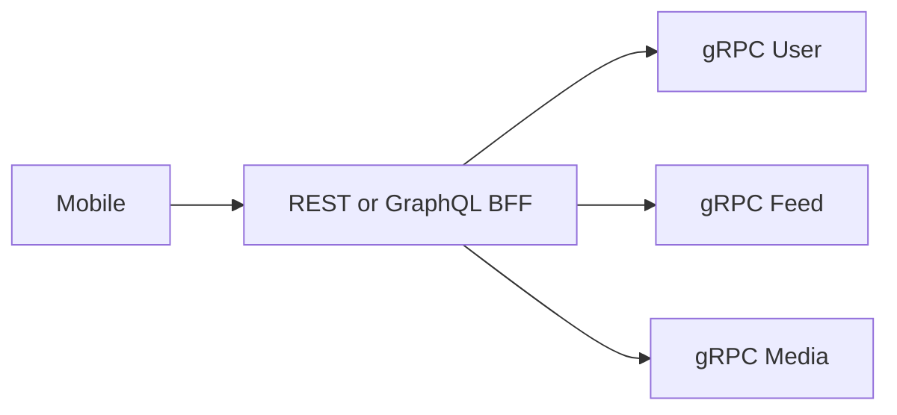
```mermaid
flowchart LR
  Mobile --> BFF[REST or GraphQL BFF]
  BFF --> S1[gRPC User]
  BFF --> S2[gRPC Feed]
  BFF --> S3[gRPC Media]
```

### Tradeoffs

| Choice | Risk |
|--------|------|
| GraphQL everywhere | Heavy server; caching/CDN pain; complex authz |
| gRPC to browsers | Friction; prefer edge translate |
| Fat REST chatty APIs | Mobile latency; over/under fetching |

### Failure modes

- GraphQL unbounded queries → DoS (depth/complexity limits)
- REST without idempotency keys on POST payments
- Protobuf version skew across services (need compatibility rules)

### Interview tip

“Public: REST. Mobile aggregation: optional GraphQL BFF. Internal: gRPC.” Then stop — do not redesign the whole company unless asked.

### Self-check

1. Why is HTTP caching easier with REST GET than GraphQL?
2. Name one GraphQL production hazard.
3. When is gRPC streaming a better fit than REST polling?

---

## N-tier architecture

**In plain English:** **N-tier** means splitting a system into layers with jobs — usually **presentation** (what users see), **application** (business rules), and **data** (storage). A classic three-tier web app is the interview archetype.

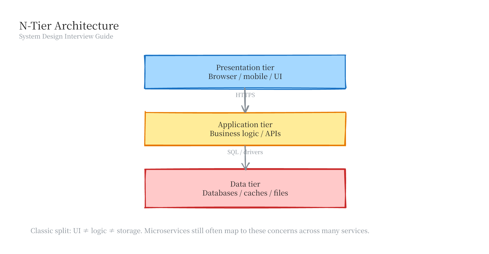

<sub>Editable source: [n-tier.excalidraw](diagrams/excalidraw/n-tier.excalidraw)</sub>

> **Key takeaway:** Separate UI, logic, and storage so you can scale and deploy them differently — even when microservices later subdivide the middle tier.

### Typical tiers

1. **Presentation** — browsers, mobile apps, desktop UIs, sometimes server-rendered pages
2. **Application / logic** — APIs, domain rules, orchestration
3. **Data** — relational DBs, caches, object storage, search indexes

You may hear **2-tier** (client ↔ DB — fragile at scale) or more tiers (edge CDN, gateway, workers).

### How it shows up today

Microservices do not abolish tiers; they repeat presentation/logic/data concerns across many services. A BFF may sit in the presentation-adjacent layer; workers may extend the logic tier asynchronously.

### When to use

Almost every CRUD product starts here. Teach it when candidates jump straight to twenty microservices.

### Tradeoffs

Clear separation vs extra network hops; fat middle tier becoming a monolith; over-tiering tiny apps.

### Failure modes

Business logic in the UI; presentation tier talking straight to DB; data tier exposed to the internet.

### Interview tip

Sketch three boxes left-to-right or top-to-bottom before subdividing the app tier. It calms the board.

### Self-check

1. Name the three classic tiers.
2. Where should authorization checks live?
3. How does a CDN relate to the presentation tier?

## Monolith vs microservices

**In plain English:** A monolith is one deployable app (still fine — and often wise — early on). Microservices split the product into independently deployable pieces that talk over the network. The senior move is usually: start modular, split when scale or team boundaries demand it.

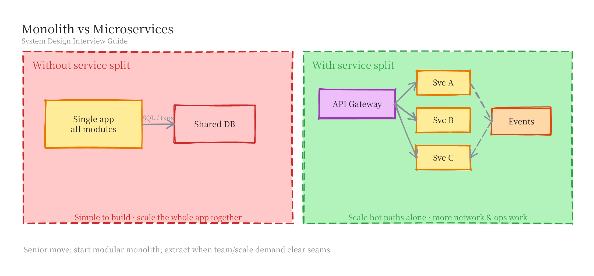

<sub>Editable source: [microservices-vs-monolith.excalidraw](diagrams/excalidraw/microservices-vs-monolith.excalidraw) (open at [excalidraw.com](https://excalidraw.com)). Legacy: `.drawio` under [`diagrams/`](diagrams/).</sub>


> **Key takeaway:** Do not split for resume points; split when you need independent scale, ownership, or blast-radius isolation.

### Definitions

- **Monolith:** one deployable unit; modular code boundaries possible (packages/modules).
- **Microservices:** independently deployable services with network boundaries, separate data often.

### Tradeoffs

| | Monolith | Microservices |
|--|----------|---------------|
| Deploy | Simple | Independent; need CI/CD maturity |
| Consistency | Single DB transactions | Sagas / eventual consistency |
| Scale | Scale whole app | Scale hot services only |
| Failure | Process-wide | Partial failure / cascading |
| Org | One team owns all | Team ↔ service alignment (Conway) |
| Ops | Simpler tracing | Need mesh, obs, versioning |

### When monolith is the *senior* choice

- Small team, unclear domains, early product
- Strong transactional invariants across modules
- Latency-sensitive in-process calls
- You can still enforce **module boundaries** and extract later

### When to split

- Independent scale axes (feed fan-out vs auth)
- Separate release cadences / ownership
- Blast-radius isolation (payments vs marketing site)
- Polyglot needs (rare as primary reason)

### Migration path

1. Modular monolith with clear packages
2. Extract read-only service behind interface
3. Split data when necessary (hardest part)
4. Introduce async events for cross-domain

### Failure modes

- Distributed monolith: many services, one shared DB, chatty sync calls
- Nano-services overhead
- Dual writes without a plan during extraction

### Interview tip

For URL shortener / typeahead: “Modular monolith is fine.” For Uber/Netflix-scale: “services along domain seams.” Explicitly say what you’d **not** split on day one.

### Self-check

1. What is a distributed monolith?
2. Why is data split harder than code split?
3. Give a case where a monolith is the mature recommendation.

## Event-driven architecture (EDA)

**In plain English:** In **event-driven** designs, something important happens (“OrderPaid”) and other parts **react** — send email, update search, start shipping — instead of one API call synchronously doing everything.

> **Key takeaway:** Use events to decouple side effects from the user-facing request; keep the synchronous path thin.

### Events vs request/response

| | **Request/response** | **Event-driven** |
|--|----------------------|------------------|
| Coupling | Caller waits on callee | Producer does not wait on all consumers |
| Failure | Callee down → caller errors | Consumers retry independently |
| Fan-out | Extra calls per dependency | Many subscribers per event |
| Mental model | Easy step-through | Harder tracing (needs correlation ids) |

### When EDA shines

Notifications, search indexing, analytics, workflow kickoffs, integrating many domains after a state change.

### When to stay synchronous

The user is blocked on the answer (login, price quote, seat availability). You can still **emit events after** the synchronous commit (transactional outbox).

### Tradeoffs

Scalable decoupling vs eventual consistency and debugging complexity. Need schemas, versioning, and DLQs.

### Failure modes

Event storms; missing consumers; dual-write bugs (DB updated but event never published); ambiguous event names.

### Interview tip

“API writes order → outbox → `OrderCreated` on the bus → email, fraud, warehouse consumers.” Ties Messaging + EDA together.

### Self-check

1. Why prefer events for “send welcome email”?
2. What problem does a transactional outbox solve?
3. Give a step that should stay request/response.


## Event sourcing

**In plain English:** Instead of storing only the **latest** balance or document, **event sourcing** stores the **history of facts** (“credited 10,” “debited 3”) and builds current state by replaying those events.

> **Key takeaway:** Powerful for audit and temporal queries; heavy for everyday CRUD — do not force it onto every service.

### How it works

1. Commands validate and append immutable events to a log/store.
2. Current state = fold/reduce over events (often snapshotted).
3. Optional **projections** build read tables for screens (pairs well with CQRS).

### Pros

- Full audit trail; explain “how did we get here?”
- Time travel / rebuild read models
- Natural fit for domains with rich behavioral history

### Cons

- Versioning events forever is hard
- PII deletion / GDPR-style erasure needs careful design (crypto shredding, etc.)
- Not intuitive for every team; easy to over-engineer

### When to use / when not

**Use:** banking ledgers, collaborative history, systems that already think in domain events.  
**Avoid:** simple profile stores, high-churn settings flags, anything where “latest row” is enough.

### Tradeoffs

Analytical power vs complexity; storage growth; need for snapshots.

### Failure modes

Huge streams without snapshots; leaking PII in immutable logs; treating the event store as a general query DB.

### Interview tip

Mention event sourcing only when audit/history is a first-class requirement — then pair with a CQRS read side.

### Self-check

1. How do you get “current balance” in an event-sourced account?
2. Why can GDPR “delete my data” be awkward?
3. How do snapshots help?


## CQRS

**In plain English:** **CQRS** (Command Query Responsibility Segregation) means **writes and reads use different models** — maybe even different databases. The write side cares about rules; the read side cares about fast screens.

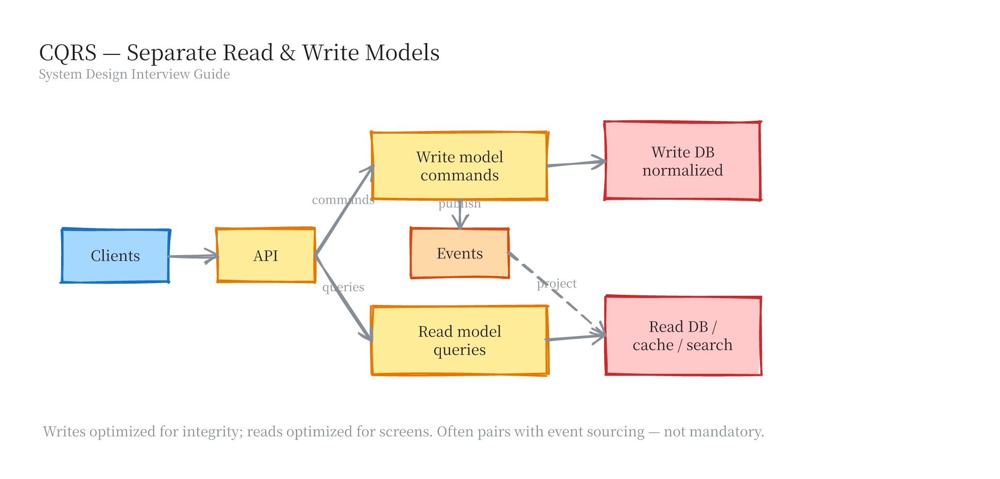

<sub>Editable source: [cqrs.excalidraw](diagrams/excalidraw/cqrs.excalidraw)</sub>

> **Key takeaway:** Split when read and write shapes disagree badly; otherwise a single normalized model is simpler.

### How it works

- **Commands** change state through the write model (validated, transactional).
- **Queries** read from denormalized views, caches, or search indexes.
- Updates to read models often flow via **events** (EDA / event sourcing optional).

### When it helps

- Complex domains with simple read DTOs needed at high QPS
- Feed/timeline style products
- Different scaling for write ingest vs read fan-out

### When it hurts

- Small apps where two models double the work
- Teams that forget read-model lag and promise strong read-after-write without a plan

### Pairing with events

CQRS ♥ events: after a successful command, publish facts that projectors apply to read stores. Event sourcing is optional — you can CQRS with a regular write DB.

### Tradeoffs

Independent scale/optimize vs more moving parts and consistency windows.

### Failure modes

Dual writes without a single source of truth; forever-lagging projectors; overusing CQRS as a buzzword.

### Interview tip

“Write path: normalized order DB. Read path: order history view updated asynchronously. Users may wait a second to see history — OK for this product.”

### Self-check

1. What problem does CQRS solve that caching alone might not?
2. Must CQRS include event sourcing?
3. How do you handle read-your-writes after a command?


## Service discovery

**In plain English:** When you have many service copies that come and go, callers need a way to **find healthy addresses**. That is service discovery — the “phone book” inside your datacenter.

> **Key takeaway:** Pick DNS, a registry (Consul/etcd/K8s), or client-side load balancing — and always combine with health checks.

### Common approaches

| Approach | Idea | Watch-outs |
|----------|------|------------|
| **DNS** | Name → list of IPs; TTL caching | Slow failover if TTL high; little app logic |
| **Registry + sidecar/proxy** | Services register; Envoy/NGINX watch and route | Registry HA matters |
| **Client-side LB** | Client library queries registry and picks instance | Every language needs a good client |
| **Platform native** | Kubernetes Services / Service mesh | Great in-cluster; still need story for egress |

### How it fits with load balancing

Discovery answers “who exists?”; load balancing answers “whom do I call **now**?” Often one component does both (mesh, cloud LB with target groups).

### When to emphasize

Microservice designs, multi-instance gateways, anything with frequent deploys/autoscaling.

### Tradeoffs

Simple DNS vs richer registries; clients smarter vs proxies smarter.

### Failure modes

Stale registry entries; thundering reconnects after outage; discovery outage blocking all calls (cache last-known-good carefully).

### Interview tip

“Services register with the platform; callers use the mesh/DNS name, not raw pod IPs.” Avoid hard-coded hosts on the whiteboard.

### Self-check

1. Why are pod IPs a bad hard dependency?
2. How does TTL affect DNS-based discovery failover?
3. Client-side vs proxy-side LB — one benefit each?


## VMs and containers

**In plain English:** A **VM** virtualizes a whole computer (guest OS and all). A **container** packages an app with its libraries and shares the host OS kernel — lighter and denser. **Orchestrators** (Kubernetes at interview level) schedule containers across machines, restart them, and expose services.

> **Key takeaway:** Containers = fast packing and deploys; VMs = stronger isolation boundaries; K8s = “where containers run and heal,” not magic scalability by itself.

### Isolation vs density

| | **VMs** | **Containers** |
|--|---------|----------------|
| Isolation | Stronger (own kernel) | Process-level; shared kernel |
| Density | Fewer per host | Many per host |
| Boot / start | Slower | Seconds or less |
| Use | Strong multi-tenant isolation, legacy OS needs | Microservices, CI, most cloud-native apps |

### Orchestration (interview level)

Kubernetes (or cloud cousins) give you:

- Desired state (“run 6 replicas of payments”)
- Health probes + restarts
- Service discovery / load balancing inside the cluster
- Rolling deploys

You still design **data** carefully — K8s will not fix a hot database partition.

### When to mention

Almost any modern deploy story. Contrast “pets vs cattle,” rolling updates, and autoscaling groups.

### Tradeoffs

Container breakout risk vs VM overhead; orchestrator complexity vs VM snowflakes.

### Failure modes

Huge images; no resource limits (noisy neighbors); treating the orchestrator as the database HA story.

### Interview tip

“Stateless services in containers behind a Service/LB; stateful data on managed DB/disk.” Keep K8s details shallow unless asked.

### Self-check

1. Why can containers start faster than VMs?
2. Does Kubernetes replace the need for replication in Postgres?
3. What is a liveness probe for?


## Geohashing and Quadtrees

**In plain English:** Finding “coffee near me” means searching by location without scanning the whole planet. **Geohashes** turn latitude/longitude into grid cell strings. **Quadtrees** recursively split the map into four squares, subdividing busy areas. Both power nearby search (see [Nearby places](#nearby-places-yelp-like)).

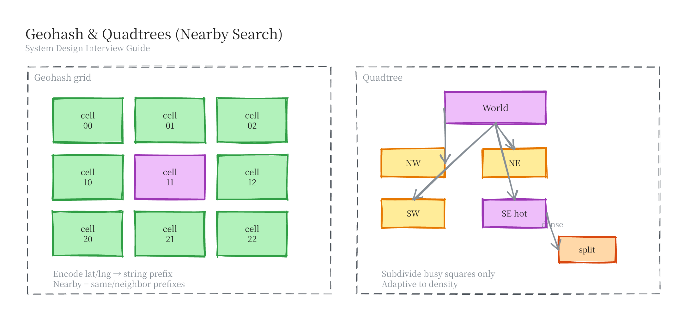

<sub>Editable source: [geohash-quadtree.excalidraw](diagrams/excalidraw/geohash-quadtree.excalidraw)</sub>

> **Key takeaway:** Index space into cells; query this cell plus neighbors; pick fixed grids (geohash/H3) vs adaptive trees (quadtree) based on density skew.

### Geohash / grid idea

- Encode lat/lng → string; **shared prefixes ⇒ nearby points**
- Longer string ⇒ smaller cell
- Nearby query: compute cell(s) covering the radius, look up POIs in those cells, then precise distance filter
- Watch **cell edges** — always include neighbor cells

### Quadtrees

- Start with the world square; split into four when a node holds too many points
- Adapts to cities vs oceans (dense leaves only where needed)
- Variants: R-trees, geohash-backed indexes, H3 hex grids (same interview idea)

### Tradeoffs

| Approach | Strength | Weakness |
|----------|----------|----------|
| Fixed geohash/H3 | Simple sharding keys; easy prefixes | Uneven POI density per cell |
| Quadtree | Adaptive density | Harder to shard; more implementation care |
| “Just Postgres distance” | Fine at small N | Falls over at global scale without index |

### When to use

Yelp-like, Uber driver matching (with time), delivery radius, any geo query at scale.

### Failure modes

Forgetting neighbor cells at boundaries; huge downtown cells melting one shard; using only geohash equality without radius refinement.

### Interview tip

Cross-link: “Geo index as in Nearby places — geohash rings + in-memory precise filter; cache hot tiles.”

### Self-check

1. Why query neighbor geohash cells?
2. When does a quadtree beat a uniform grid?
3. After cell lookup, why still compute exact distance?


## OAuth 2.0, OIDC, and SSO

**In plain English:** **OAuth 2.0** lets an app access a user’s data on another system **without taking their password** (e.g. “allow this calendar app to read my Google Calendar”). **OIDC** adds a standard **login identity** layer on top. **SSO** means you sign in once and reach several company apps.

> **Key takeaway:** Access tokens authorize APIs; ID tokens tell the app who you are; SSO is the “one login, many apps” experience — interview depth only, not legal advice.

### Authorization code flow (intuition)

Browser app redirects the user to the **identity provider (IdP)**. User authenticates there. IdP redirects back with a short-lived **authorization code**. The app’s backend exchanges the code (plus a secret or PKCE) for tokens. Passwords never pass through your app.

### ID token vs access token

| Token | Job |
|-------|-----|
| **Access token** | Presented to APIs as proof of authorization (scopes/permissions) |
| **ID token** (OIDC) | Tells *your app* who logged in (subject, email claims, etc.) |
| **Refresh token** | Used to obtain new access tokens without re-prompting every minute |

### SSO (single sign-on)

A corporate IdP (or social IdP) authenticates once; connected apps trust its tokens/assertions (OIDC, SAML in enterprises). Users stop juggling passwords per tool; IT gains central revoke/MFA.

### When to use in designs

Any user-facing system with “Login with …”, multi-app product suites, B2B enterprise features. Machine-to-machine uses client credentials — different flow, same token idea.

### Tradeoffs

Great UX and security delegation vs dependency on IdP availability; token theft risks; complexity of session logout/revoke across apps.

### Failure modes

Storing forever-lived tokens in localStorage carelessly; trusting ID token signatures without JWKS verification; confusing “logged into UI” with “authorized for this object” (still need AuthZ).

### Interview tip

Draw **Client → IdP → Auth code → Backend token exchange → API calls with access token**. Mention PKCE for public/mobile clients.

### Self-check

1. Why is the authorization code exchanged on the backend?
2. Does an ID token replace AuthZ checks on your API?
3. What does SSO buy an employee using five internal tools?

## Security

**In plain English:** Security means knowing who is calling (authentication), what they are allowed to do (authorization), and keeping data safe in transit and at rest. In interviews, a short practical checklist beats a fear monologue.

> **Key takeaway:** TLS everywhere, authn/authz on the server, least-privilege secrets, and rate-limit auth endpoints — mention these on every user-facing design.

See also [OAuth 2.0, OIDC, and SSO](#oauth-20-oidc-and-sso) and [TLS, SSL, and mTLS](#tls-ssl-and-mtls) for deeper interview vocabulary.

### Authentication (AuthN)

Prove identity: passwords + MFA, OAuth/OIDC, SSO, API keys for machines. Prefer short-lived tokens (JWT access + refresh) and rotating secrets. Store password hashes with modern KDFs—not plaintext.

### Authorization (AuthZ)

What an identity may do: RBAC, ABAC, ACLs on objects. Enforce **server-side** on every request; never trust client-only checks. For multi-tenant systems, tenant isolation is a hard boundary.

### Transport & data

TLS everywhere in transit. Encrypt sensitive fields at rest (KMS-managed keys). Minimize PII; tokenize payment data via providers (PCI scope reduction).

### Abuse & input

Rate limit auth endpoints. Validate/sanitize inputs. CSRF protections for cookie sessions. Prepare for scraping and spam on public reads/writes.

### Secrets management

No secrets in images or repos. Use a secret manager; rotate; least privilege IAM for services (instance roles).

### Dependency & supply chain

Pin versions; scan images; verify webhooks with signatures.

### Privacy & compliance awareness

Know that GDPR-style deletion, data residency, and audit logs may constrain design (soft-delete vs hard-delete, region pinning). Mention when the domain warrants it—payments, health, kids’ data.

### Logging safely

Do not log tokens, passwords, full card numbers. Redact PII in traces.

### When to deepen

Auth products, fintech, healthcare, marketplaces, anything with UGC abuse. For a pure internal cache design, a lighter mention suffices.

### Tradeoffs

Security controls add latency and complexity; overly chatty auth services become availability risks—cache policy decisions carefully with TTLs and revocation strategy.

### Failure modes

Confused deputy, IDOR (insecure direct object references), overly long-lived tokens, CORS misconfig, S3 buckets public by mistake, SSRF from URL-fetching features.

### Interview tip

Add a box for **Auth service / IdP** and say “all data plane requests carry a verified identity; object access checked server-side.” For uploads: **signed URLs**.

### Self-check

1. Difference between AuthN and AuthZ in one sentence each.
2. How do signed URLs protect direct-to-object uploads?
3. Name two log redaction examples you would enforce.


# Interview Approach

## Whiteboard like a strong candidate

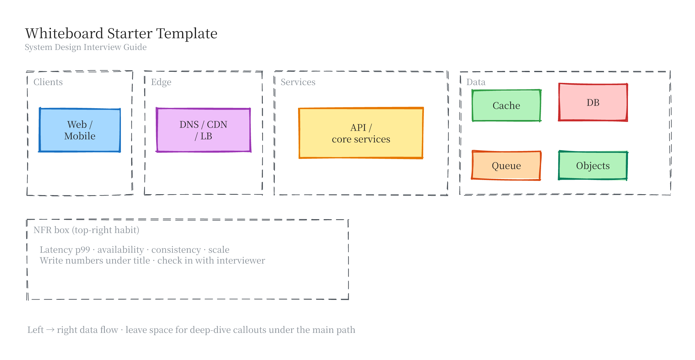

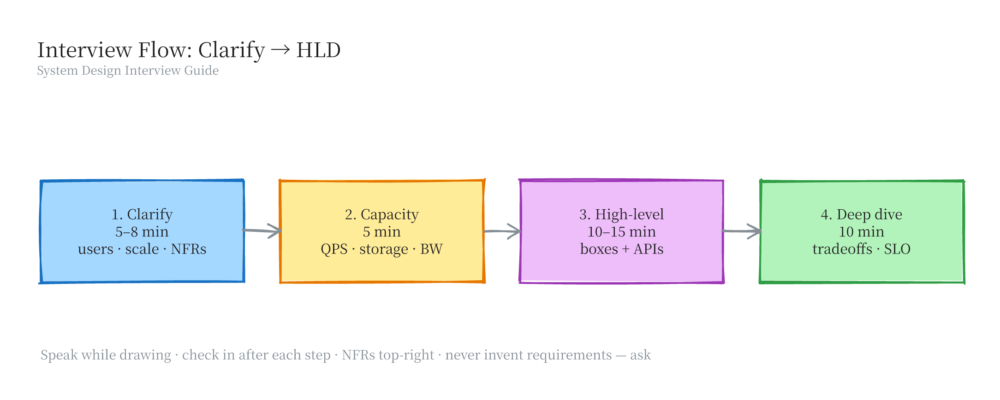

This section is a **drawing and narration masterclass**. Foundations teach *what* to know; designs teach *what* to propose; this teaches *how* to look competent in the first 15 minutes with a marker in your hand.

Open the starter template while practicing: [diagrams/excalidraw/whiteboard-template.excalidraw](diagrams/excalidraw/whiteboard-template.excalidraw) (open at [excalidraw.com](https://excalidraw.com)). Legacy draw.io also under [`diagrams/`](diagrams/).

### First 5 minutes script (clarify aloud)

Say roughly this (adapt to the prompt):

1. **Restate:** “I’ll design a URL shortener that creates short links and redirects with low latency.”
2. **Actors:** “Web/mobile clients; optionally authenticated creators.”
3. **Functional MVP:** “Create, redirect, optional basic click count. Out of scope: full analytics warehouse.”
4. **NFRs:** “Redirect p99 under ~50 ms service-side; durability of mappings; high read/write skew.”
5. **Scale assumption:** “I’ll assume X monthly creates and ~10× redirects — correct me if you have target numbers.”
6. **Write NFRs** in a corner of the board. Check in: “Does that match what you want?”

Do **not** draw boxes yet except maybe a title. Clarifying is not stalling.

### How to draw boxes (left → right / top → down)

Canonical order:

```text
Clients → DNS/CDN (if needed) → Load balancer → API / services → Caches & DBs → Async (queue → workers)
```

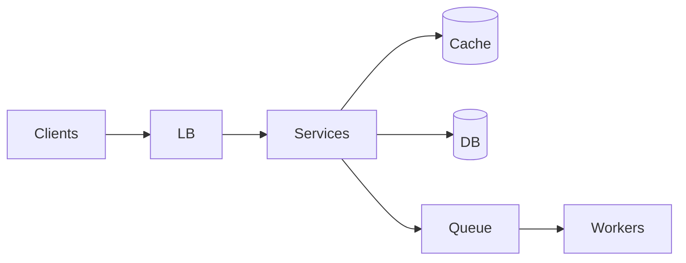
```mermaid
flowchart LR
  C[Clients] --> LB[LB]
  LB --> S[Services]
  S --> Cache[(Cache)]
  S --> DB[(DB)]
  S --> Q[Queue]
  Q --> W[Workers]
```

**Narrate while drawing:** “Clients hit a load balancer in front of a stateless API tier. Reads go through a cache; writes hit the primary store. Side effects go async to a queue.”

Use the template: [diagrams/excalidraw/whiteboard-template.excalidraw](diagrams/excalidraw/whiteboard-template.excalidraw).

### What NOT to draw early

- Multi-region active-active meshes
- Service mesh sidecars on every box
- Kafka + Flink + feature store for a junior warm-up
- Exact AWS service logos (generic “object store” is better unless they ask cloud-native)
- Every microservice you can name — start with **one API box**, split when a scale axis appears

Leave blank space on the right/bottom for “evolution” and deep dives.

### Narrating tradeoffs while drawing

Each arrow can carry a one-liner:

- “Async here so email failure doesn’t fail checkout.”
- “Cache here because read:write is 100:1 — accept TTL staleness.”
- “Primary-secondary replication — RPO seconds on async.”

Interviewers listen for **tradeoff sentences**, not only boxes.

### Handling “why not X?” without freezing

Template answer:

1. **Acknowledge:** “X is reasonable for …”
2. **Requirement fit:** “Given our NFR of …,”
3. **Cost:** “X adds … (ops / consistency / latency)”
4. **Decision:** “I’d keep Y for MVP and revisit X when …”

Example: “Why not GraphQL?” → “Great for flexible mobile aggregation; this API is two endpoints with CDN-friendly GET redirects — REST is simpler and cacheable. If we add a rich creator dashboard, a BFF/GraphQL layer later is fine.”

### Whiteboard hygiene

- Write **QPS and storage** under the title once estimated
- Label protocols on a few arrows (`HTTPS`, `gRPC`, `Kafka`)
- Circle SPOFs when you discuss failures
- Number deep-dive sections (① code gen ② cache ③ analytics)

### Sample full mock transcript — URL shortener (≈12 exchanges)

**Interviewer:** Design a URL shortener like bit.ly.

**You:** I’ll clarify first. MVP: create short URL, redirect, optional click counts. Auth optional. Out of scope: full BI. NFRs: low redirect latency, unique codes, durability. Scale — do you have numbers, or assume ~100M creates/month and 10× redirects?

**Interviewer:** Your assumptions are fine.

**You:** Capacity: ~40 creates/s avg, ~400 redirects/s avg, peaks maybe 5–10×. Storage tens of GB/year — single primary DB + cache is enough; I’ll still keep the design clean. *[writes numbers]*

**Interviewer:** OK, draw the system.

**You:** *[draws left→right]* Clients → LB → API service → Redis cache and Postgres. Creates write DB then fill cache. Redirects: cache then DB; 302. Click events async to a queue for analytics. *[points]* Diagram file we’d use in practice: [diagrams/excalidraw/url-shortener.excalidraw](diagrams/excalidraw/url-shortener.excalidraw).

**Interviewer:** How do you generate codes?

**You:** 64-bit random encoded Base62 with uniqueness constraint and rare retry — or Snowflake ID encoded Base62. Avoid short sequential IDs because they’re enumerable. Custom aliases checked for uniqueness and reserved words.

**Interviewer:** 301 or 302?

**You:** 302 if we need accurate per-click analytics and cache control; 301 if we want browsers/CDNs to cache permanently — tradeoff accuracy vs load.

**Interviewer:** Hot viral link?

**You:** Cache absorbs it; add local in-process cache on API nodes for extreme keys; ensure single-flight on miss. DB isn’t in the hot path once warm.

**Interviewer:** What fails if Postgres is down?

**You:** Creates fail closed (503). Redirects still work for warm cache entries; cold misses fail. Multi-AZ primary and replicas for reads if we allow slightly stale.

**Interviewer:** Why not shard day one?

**You:** QPS and data don’t require it. Shard by code hash when a single primary can’t keep up — not before.

**Interviewer:** Abuse?

**You:** Scheme allowlist http/https, rate limit creates, async malware URL scan, disable bad codes.

**Interviewer:** 10× scale.

**You:** More API replicas; cache cluster; read replicas; then hash-shard links; consider multi-region with global ID space or region-prefixed codes.

**Interviewer:** Any questions for me?

**You:** I’d next deep-dive analytics freshness and multi-region active-passive if time.

### Sample micro-script — news feed (first drawing only)

1. Write: “Feed: hybrid fan-out; celebrity = pull.”
2. Draw: Client → API → Feed service → Redis feed lists; Post service → Kafka → fan-out workers.
3. Say: “On post, enqueue; workers push IDs into followers’ caches; celebrities skipped — readers merge on read.”
4. Leave ranking ML blank until asked.

Diagram: [diagrams/excalidraw/news-feed.excalidraw](diagrams/excalidraw/news-feed.excalidraw).

### Practice checklist

- [ ] Clarified aloud before boxes
- [ ] Numbers on board
- [ ] Left-to-right data plane
- [ ] One async path
- [ ] Explicit consistency sentence
- [ ] One failure scenario
- [ ] One “why not X?” handled with the 4-part template

## Clarify requirements

The first five minutes decide whether your design solves the right problem. Clarifying is not stalling—it is product thinking under pressure.


<sub>Editable source: [interview-flow.excalidraw](diagrams/excalidraw/interview-flow.excalidraw) (open at [excalidraw.com](https://excalidraw.com)). Legacy: `.drawio` under [`diagrams/`](diagrams/).</sub>


### Goals of clarification

1. Bound **scope** (MVP vs full product).
2. Surface **scale** (users, QPS, data size).
3. Lock **critical NFRs** (latency, consistency, availability).
4. Identify **clients** (mobile, web, third-party APIs).
5. Agree what is **out of scope**.

### Functional questions (examples)

- Who are the actors? (user, admin, system jobs)
- Core actions? (create, read, update, search, share)
- Sync vs async UX? (“accepted” vs “fully processed”)
- Multi-device? Offline?
- Admin / moderation / analytics needed in-scope?

### Non-functional questions

- Read/write ratio?
- Peak vs average QPS? Daily active users?
- Latency targets (p99)?
- Consistency: can users see stale data?
- Durability / RPO-RTO?
- Multi-region or single region?
- Compliance / PII constraints?
- Budget sensitivity?

### Scope-cutting phrases

- “For v1, can we skip X and note it as phase 2?”
- “Is celebrity-scale fan-out in scope or only average users?”
- “Should we design the payment provider integration or just our ledger?”

Interviewers usually welcome cuts that show prioritization.

### Capture on the board

Write a short list:

```
Functional: …
NFR: p99 < …; consistency = …; scale = …
Out of scope: …
Assumptions: …
```

Revisit if the deep dive reveals a conflict.

### Bad clarification

- Only asking “how many users?” then ignoring the answer.
- Twenty questions with no synthesis.
- Assuming Google scale by default.

### Good clarification

Three to seven high-leverage questions, then a one-sentence problem restatement: “We’ll design a single-region URL shortener for 100M redirects/day, strong uniqueness, eventually consistent analytics.”

### Interview tip

Restate the problem in your own words and wait for a nod before drawing boxes.

### Self-check

1. Write five clarification questions for “Design Dropbox.”
2. What NFR question matters most for payments vs news feed?
3. How do you handle an interviewer who says “you decide the scale”?

### Practice drill

Set a 10-minute timer. Apply only the ideas from this page to the prompt **“Design a ride-sharing matcher for one city.”** Then compare against the Uber-like design in this guide—gap-analyze without copying its structure blindly. Repeat weekly with a different prompt from the practice list.

### Phrases that score well

- “Given the NFR of X, I’ll prefer Y and accept Z.”
- “Two options: A vs B; I pick A because…”
- “User impact if this fails: …; mitigation: …”
- “Evolution path: MVP → … → …”

Say them deliberately in mocks until natural.

## Capacity estimation

Back-of-envelope math shows you can size storage, QPS, and bandwidth. Aim for **order-of-magnitude** correctness, not spreadsheet precision.

### Core conversions

- 1 day ≈ 86,400 s ≈ **10^5** seconds
- 1 KB = 10^3 bytes (use 10^3 in interviews; note 1024 if asked)
- 1 Mbps ≈ 125 KB/s; 1 Gbps ≈ 125 MB/s
- Powers of 2 for IDs: 2^32 ≈ 4e9; 2^64 is plenty for most IDs

### Traffic

```
QPS ≈ daily_requests / 10^5
Peak QPS ≈ average × peak_factor (often 2–5×; ask)
```

Split **read QPS** and **write QPS**. They drive different components.

### Storage

```
storage ≈ entities × bytes_per_entity × replication_factor × growth_horizon
```

Separate **metadata DB** from **blob storage**. Blobs dominate for media products.

### Bandwidth

```
egress ≈ QPS × response_size
```

CDN may absorb most public asset bandwidth—say so.

### Memory for cache

Estimate working set: hot keys × entry size. Cache 10–20% of data is a common hand-wave if unknown; better: estimate daily active entities.

### Connections

WebSocket designs: concurrent connections ≈ DAU × online_fraction. Each connection has memory overhead on gateways—plan gateway fleets.

### Worked micro-example

100M shorten requests/month → ~40 write QPS average. 10× redirects → ~400 read QPS average. Peak 3× → ~1.2K read QPS. Trivial for a well-designed service—say that and move on; estimation still builds trust.

### What interviewers want

- Explicit assumptions
- Written formulas
- Sanity check (“does this fit on one DB?”)
- Implication (“so we need shards / we don’t”)

### Common mistakes

- Mixing monthly and daily
- Forgetting replication multiplier
- Designing Kafka clusters for 50 QPS
- Spending 15 minutes on arithmetic

### Interview tip

Cap estimation at **5 minutes**. If stuck, state assumption and proceed: “Assume 1K peak write QPS unless you want different.”

### Self-check

1. Estimate storage for 5 years of 1M events/day at 200 bytes each with 3× replication.
2. Convert 50M daily active reads to average QPS.
3. When is estimation allowed to conclude “single primary Postgres is enough”?

### Practice drill

Set a 10-minute timer. Apply only the ideas from this page to the prompt **“Design a ride-sharing matcher for one city.”** Then compare against the Uber-like design in this guide—gap-analyze without copying its structure blindly. Repeat weekly with a different prompt from the practice list.

### Phrases that score well

- “Given the NFR of X, I’ll prefer Y and accept Z.”
- “Two options: A vs B; I pick A because…”
- “User impact if this fails: …; mitigation: …”
- “Evolution path: MVP → … → …”

Say them deliberately in mocks until natural.

## Design template

Use this template on every practice prompt until it is muscle memory. Adapt depth to time and level—do not skip steps silently.

### 1. Clarify (5–8 min)

Actors, features, NFRs, out-of-scope, assumptions. Restate.

### 2. Estimate (3–5 min)

QPS read/write, storage, bandwidth, concurrent connections if relevant. Conclude sizing implications.

### 3. API sketch (3–5 min)

List 3–7 endpoints or RPCs with brief request/response fields and error cases. Include auth identity.

### 4. Data model (5 min)

Entities, keys, indexes, shard key. Note denormalization. Where do blobs live?

### 5. High-level design (8–12 min)

```
Clients → CDN/LB/Gateway → Services → Cache/DB/Queue/ObjectStore
```

Walk **write path** then **read path**. Keep ~6–12 boxes.

### 6. Deep dive (10–15 min)

Pick interviewer interest or the hardest part: hotspot, consistency, fan-out, search index pipeline, matching algorithm, etc. Offer alternatives with tradeoffs.

### 7. Failures & scale (5–8 min)

SPOF, replication, retries/idempotency, degradation, 10× traffic plan, multi-region if warranted. Observability hooks.

### 8. Summarize (1–2 min)

“We optimized for X; accepted Y; next evolution is Z.”

### Board layout suggestion

```
[Requirements]     [Estimates]
[API]              [Data model]
[        HLD diagram         ]
[Deep dive notes / tradeoffs ]
```

### Microservices discipline

Start coarse. Split services when scaling axes or ownership differ (e.g., upload service vs metadata service). Avoid 15 boxes of 50-line services.

### Evolution story

MVP → add cache → shard → async pipelines → multi-region. Saying the path shows senior judgment even if you design MVP detail.

### Interview tip

Ask which deep dive they prefer if time is short: “Consistency of booking holds, or payment webhook handling?”

### Self-check

1. Recite the eight steps without looking.
2. What belongs in HLD vs deep dive?
3. How do you recover if step 5 ate half the interview?

### Practice drill

Set a 10-minute timer. Apply only the ideas from this page to the prompt **“Design a ride-sharing matcher for one city.”** Then compare against the Uber-like design in this guide—gap-analyze without copying its structure blindly. Repeat weekly with a different prompt from the practice list.

### Phrases that score well

- “Given the NFR of X, I’ll prefer Y and accept Z.”
- “Two options: A vs B; I pick A because…”
- “User impact if this fails: …; mitigation: …”
- “Evolution path: MVP → … → …”

Say them deliberately in mocks until natural.

## Deep dive & failures

Deep dives prove you can go below boxes-and-arrows. Failure analysis proves you have operated (or can imagine operating) real systems.

### Choosing a deep dive

Pick a place where designs diverge:

- Feed fan-out on write vs read
- ID generation uniqueness
- Geo matching / geospatial indexes
- Cache invalidation for permissions
- Exactly-once payment effects
- Hot partition mitigation
- Search indexing lag

Ask the interviewer which they care about.

### Structure a deep dive

1. Restate the sub-problem and constraint.
2. Propose option A with pros/cons.
3. Propose option B.
4. Pick one for the stated scale; note revisit triggers.
5. Sketch sequence or data flow for the happy path.
6. Add one failure case.

### Failure checklist

- Process crash mid-write
- Replica lag / failover
- Network partition between services
- Dependency slow (thread pool exhaustion)
- Poison message / bad payload
- Clock skew
- Disk full
- Thundering herd on recovery
- Partial deploy (mixed versions)
- Abuse traffic

### Patterns to name

| Pattern | Use |
|---------|-----|
| Timeout + retry + jitter | Transient faults |
| Circuit breaker | Protect self from dying dependency |
| Bulkhead | Isolate thread/connection pools |
| Load shedding | Drop low-priority work |
| Idempotency keys | Safe retries |
| Outbox / inbox | Reliable messaging with DB |
| Backpressure | Slow consumers signal producers |
| Graceful degradation | Serve stale / disable non-critical |

### Chaos questions interviewers ask

- “Primary DB dies—what do users see?”
- “Queue lags by 1 hour—what breaks?”
- “One region goes dark?”
- “Cache stampedes after flush?”

Answer with **user impact** + **system behavior** + **mitigation**.

### Observability in deep dives

Name SLIs: success rate, latency, lag, error budget burn. Traces across gateway → service → DB. Alerts on saturation, not only crashes.

### Interview tip

Keep failure talk concrete: “If Redis is down we fail open on rate limits for 5 minutes and alert”—not “we’re resilient.”

### Self-check

1. Walk crash-mid-payment with idempotency.
2. List three degradations for a news feed under dependency failure.
3. Why jitter on retries?

### Practice drill

Set a 10-minute timer. Apply only the ideas from this page to the prompt **“Design a ride-sharing matcher for one city.”** Then compare against the Uber-like design in this guide—gap-analyze without copying its structure blindly. Repeat weekly with a different prompt from the practice list.

### Phrases that score well

- “Given the NFR of X, I’ll prefer Y and accept Z.”
- “Two options: A vs B; I pick A because…”
- “User impact if this fails: …; mitigation: …”
- “Evolution path: MVP → … → …”

Say them deliberately in mocks until natural.

## Tradeoffs cheatsheet

Quick contrasts you can deploy in interviews. Always pair with *context*—tradeoffs are not absolute winners.

### SQL vs NoSQL

- SQL: relations, transactions, ad-hoc queries; sharding harder.
- NoSQL: scale/flexible models; app-level joins/transactions.

### Sync vs async

- Sync: simple, immediate errors; couples availability.
- Async: resilient to spikes; eventual completion UX.

### Monolith vs services

- Monolith: easy consistency & deploy early.
- Services: independent scale/deploy; distributed failure modes.

### Consistency vs latency

- Sync quorum / primary reads: fresher, slower.
- Local/cached reads: fast, stale possible.

### Fan-out on write vs read

- Write: fast timeline reads; write amplification; celebrity problem.
- Read: cheap writes; slow/expensive merges at read.

### Cache-aside vs write-through

- Aside: simple, risk stampedes; stale until TTL/invalidate.
- Through: fresher cache; write latency ↑.

### Vertical vs horizontal scale

- Vertical: simple; ceiling + bigger blast radius.
- Horizontal: capacity; needs state externalization.

### Object store vs DB for blobs

- Objects: cheap large bytes, CDN-friendly.
- DB: transactional metadata only—keep blobs out.

### Push vs pull notifications

- Push: low latency; connection cost.
- Pull/poll: simpler; higher latency/waste.

### Consistent hashing vs range partition

- Hash: balanced; poor range scans.
- Range: scans; hotspot at edge.

### At-least-once vs at-most-once

- Alo: no loss, need idempotency.
- Amo: may lose, simpler.

### Multi-region active-passive vs active-active

- Passive: simpler failover; idle capacity / higher RTO.
- Active: lower latency globally; conflict resolution.

### Interview tip

Speak tradeoffs as: “Option A optimizes X at cost of Y; given NFR Z we pick A.”

### Self-check

1. Pick fan-out strategy for 100 followers avg vs 10M celebrity.
2. When is a monolith the *senior* choice?
3. State a PACELC tradeoff for multi-region reads.

### Practice drill

Set a 10-minute timer. Apply only the ideas from this page to the prompt **“Design a ride-sharing matcher for one city.”** Then compare against the Uber-like design in this guide—gap-analyze without copying its structure blindly. Repeat weekly with a different prompt from the practice list.

### Phrases that score well

- “Given the NFR of X, I’ll prefer Y and accept Z.”
- “Two options: A vs B; I pick A because…”
- “User impact if this fails: …; mitigation: …”
- “Evolution path: MVP → … → …”

Say them deliberately in mocks until natural.

# Design Walkthroughs

Topic map for common interview families (our walkthrough titles): **URL shortener** → **Chat & messaging** (WhatsApp-like) → **News feed** (Twitter-like) → **Video streaming** (Netflix-like) → **Uber-like** dispatch. Use them as progressive practice after Foundations.

## URL shortener

**In plain English:** A URL shortener turns a long link into a short code (like short.ly/aB3xY9) and redirects people who open it. It is the classic warm-up design: easy to explain, rich enough to practice storage, caching, and abuse.

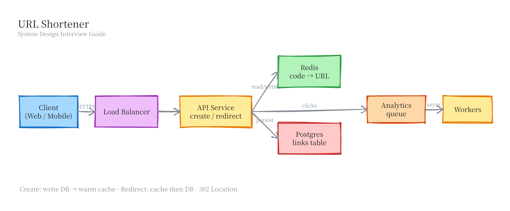

> **Key takeaway:** Optimize the redirect path (cache first); generating unique codes and stopping spam are the real deep dives.

### 1. Clarify

**Functional**

- Create short URL from long URL (auth optional)
- Redirect short → long (301/302)
- Optional: custom aliases, expiry, basic click counts

**Out of scope (v1):** multi-tenant analytics warehouse, A/B pages.

**NFRs:** low redirect latency (p99 < 50 ms service-side), unique codes, high read/write skew (redirects ≫ creates), durability of mappings.

**Assumptions:** 100M new links/month; 10× redirects; single region MVP.

### 2. Capacity

- Writes ≈ 100M/month ≈ 40 QPS avg; peak ~200
- Reads ≈ 400 QPS avg; peak ~2K
- Storage: 100M/year × ~100 bytes metadata ≈ 10 GB/year (+ replication)

Single primary DB + cache handles this easily; still design cleanly for growth.

### 3. APIs

```
POST /v1/links
  { "long_url": "...", "custom_alias?": "...", "ttl_sec?": 0 }
  → { "code": "aB3xY9", "short_url": "https://short.ly/aB3xY9" }

GET /{code}
  → 302 Location: <long_url>

GET /v1/links/{code}/stats   (authz)
  → { "clicks": 123 }
```

Errors: 400 bad URL, 409 alias taken, 404 unknown code, 410 expired.

### 4. Data model

```
links(
  code PK,
  long_url,
  user_id NULL,
  created_at,
  expires_at NULL,
  click_count  -- or separate counters store
)
unique(custom alias) via code PK
index(user_id, created_at)
```

Blobs unnecessary. Counters may be Redis INCR flushed periodically.

### 5. High-level design

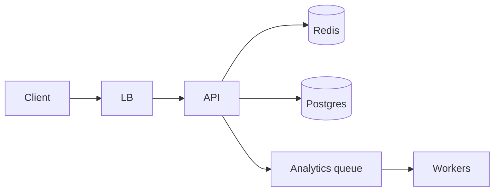
```mermaid
flowchart LR
  Client --> LB
  LB --> API
  API --> Cache[(Redis)]
  API --> DB[(Postgres)]
  API --> Queue[Analytics queue]
  Queue --> Workers
```

**Write:** validate URL → generate code → insert → fill cache → return.

**Read:** cache get by code → on miss DB → set cache → 302. Async click event to queue.

### 6. Deep dive — code generation

**Options**

1. Hash long URL (MD5/Base62 truncate) — collisions; same URL same code may be OK.
2. Auto-increment + Base62 — simple; enumerable; needs central ID.
3. Pre-generated random codes from a service — high entropy; allocation service.

**Pick:** 64-bit random → Base62 (~11 chars) with DB uniqueness constraint; retry on conflict. Or distributed ID (Snowflake) encoded Base62 for uniqueness without retries.

**Enumeration:** use enough entropy; rate-limit create; optional auth.

**Custom aliases:** reserved word list; uniqueness check; abuse review async.

### 7. Failures

- DB down: redirects may still hit warm cache; creates fail—return 503.
- Cache stampede on viral code: single-flight fill.
- Hot key viral link: many cache replicas / local cache.
- Poison long URLs (javascript:): scheme allowlist http/https.

### 8. Interview tips

- Ask 301 vs 302 (caching vs analytics accuracy).
- Mention cache key = code; TTL + invalidate on delete.
- Don’t over-shard at 2K QPS.

### Evolution

Add read replicas → shard by code hash → multi-region with global code space or region prefixes.

### Sequence — create + redirect

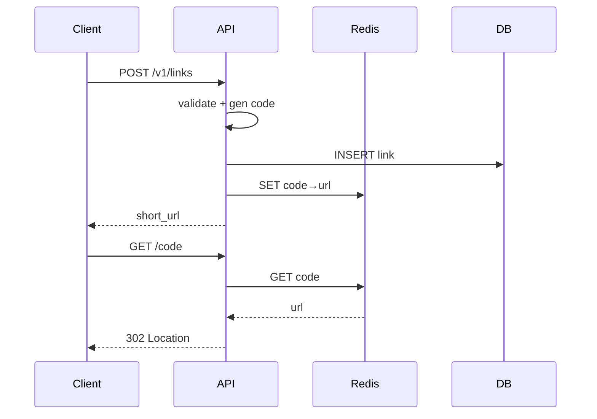
```mermaid
sequenceDiagram
  participant C as Client
  participant A as API
  participant R as Redis
  participant D as DB
  C->>A: POST /v1/links
  A->>A: validate + gen code
  A->>D: INSERT link
  A->>R: SET code→url
  A-->>C: short_url
  C->>A: GET /code
  A->>R: GET code
  R-->>A: url
  A-->>C: 302 Location
```

### Alternatives considered

| Approach | Pros | Cons |
|----------|------|------|
| Hash URL → code | Deterministic | Collisions; hard custom alias |
| Central auto-ID | Simple | Enumerability; write bottleneck |
| Random Base62 | Unpredictable | Retry on conflict (rare) |

### Analytics path

Clicks enqueue `{code, ts, ua, country?}`; workers aggregate to daily tables. Do not synchronously UPDATE click_count on every redirect under peak—use Redis INCR + flush.

### Security & abuse

- Allowlist `http`/`https` only
- Rate-limit create per IP
- Malware URL scanning async; disable on hit
- Robots: optional `nofollow` on interstitial (if used)

### Capacity evolution checkpoints

| Scale | Change |
|-------|--------|
| <5K QPS | Single primary + cache |
| Hot viral | Local cache / more replicas |
| Multi-region | Code prefix per region or global unique ID service |

### Interviewer Q&A (drill these aloud)

**Q: What is the consistency model for the core read?**  
A: State it explicitly (e.g. “redirects may see new links within TTL seconds; creates read-your-writes via primary”).

**Q: Single point of failure?**  
A: Name primary DB / broker / region; give mitigation (replicas, multi-AZ, queue buffer).

**Q: How do you prevent duplicate side effects on retry?**  
A: Idempotency keys / upserts / dedupe table—tie to this design’s writes.

**Q: What metric pages you at 3am?**  
A: Pick SLIs: error rate, p99, lag, saturation—not CPU alone.

**Q: How does this evolve to 10× data?**  
A: Partition key, storage tiering, or CQRS—one concrete next step.

### Implementation sketch (pseudocode mindset)

Walk one write handler: validate → authorize → mutate store → enqueue side effects → return. Mention timeouts on dependency calls. This bridges design and coding rounds.

### Load & chaos test plan (talk track)

1. Happy-path load at 2× peak estimate  
2. Dependency latency injection (+500 ms)  
3. Kill one AZ of the data store  
4. Replay poison message  
State what user experience should be in each case.

### Whiteboard chronological script

1. Title + NFRs corner (latency, uniqueness, durability).
2. Clarify 301 vs 302, auth, analytics scope aloud.
3. Write capacity (~40 WPS / ~400 RPS order-of-magnitude).
4. Draw Client → LB → API (left to right).
5. Add Postgres + Redis; narrate write-then-cache, read cache-first.
6. Add analytics queue; leave multi-region blank.
7. Deep-dive code generation on the side.
8. Circle SPOF (primary DB); state cache-through behavior on DB outage.


<sub>Editable source: [url-shortener.excalidraw](diagrams/excalidraw/url-shortener.excalidraw) (open at [excalidraw.com](https://excalidraw.com)). Legacy: `.drawio` under [`diagrams/`](diagrams/).</sub>

### Interviewer probes (realistic Q&A)

**Interviewer:** Why Postgres not Cassandra?  
**You:** Modest scale, strong uniqueness on `code`, simple relational metadata — Postgres is enough; Cassandra when write volume and multi-region dictate.

**Interviewer:** Consistency for redirect after create?  
**You:** Read-your-writes via writing cache on create; other regions may lag if geo-replicated.

**Interviewer:** Celebrity / viral code?  
**You:** Cache + local hot-key cache; not a DB problem once warm.

**Interviewer:** Failure: Redis down?  
**You:** Fall through to DB; watch DB QPS; fail open on redirects if product accepts load risk, or serve 503 for cold path.

**Interviewer:** 10× scale?  
**You:** Scale API horizontally; shard by code hash when primary saturates.

## Rate limiter

**In plain English:** A rate limiter decides whether to allow or reject a request based on how many you have already made — protecting APIs from accidental floods and abuse.

> **Key takeaway:** Pick an algorithm (token bucket is a strong default), a key (user / IP / API key), and a place to store counters (often Redis).

Build a service or middleware that enforces request quotas across a fleet. Classic mid-level design: algorithms, distributed counters, and fail-open vs fail-closed.


<sub>Editable source: [rate-limiting.excalidraw](diagrams/excalidraw/rate-limiting.excalidraw) (open at [excalidraw.com](https://excalidraw.com)). Legacy: `.drawio` under [`diagrams/`](diagrams/).</sub>

### 1. Clarify

- Limits per API key / user / IP / endpoint?
- Exact vs approximate counting?
- Centralized service vs library in each gateway?
- Soft throttle (delay) vs hard reject (429)?
- Multi-datacenter consistency needed?
- Burst allowed (token bucket) or smooth only?

**Assumptions:** per-user token bucket, ~1M active keys, peak ~100K decisions/sec, single region first, HTTP `429` + `Retry-After`.

### 2. Capacity

100K QPS decisions → Redis (or Redis Cluster) must shard by key; each decision ideally 1 RTT with Lua/atomic ops. Local in-process pre-filter can shed obvious floods before Redis.

Storage: counters are tiny (key + tokens + timestamp); memory dominated by cardinality of active keys in a window.

### 3. APIs

```
POST /v1/check
  { "key": "user:42", "cost": 1, "limit": 100, "window_sec": 60 }
  → { "allowed": true, "remaining": 83, "reset_sec": 12 }

POST /v1/check  (denied)
  → { "allowed": false, "remaining": 0, "reset_sec": 12 }
     HTTP 429 from gateway with Retry-After
```

Config side: CRUD for rules (optional deep dive).

### 4. Data model

```
rule(key_pattern, limit, window_sec, algo)
redis key: rl:{key}:{window_id} → counter | token bucket hash
```

### 5. High-level design

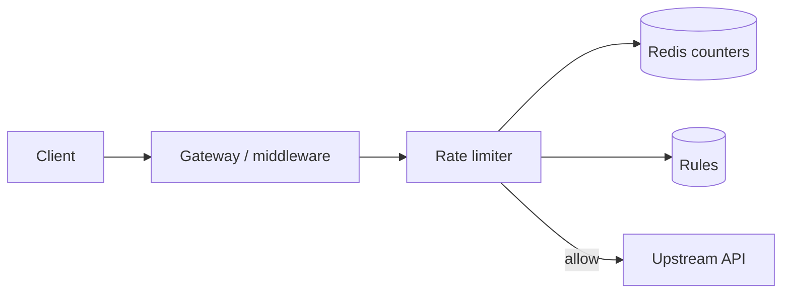
```mermaid
flowchart LR
  Client --> GW[Gateway / middleware]
  GW --> RL[Rate limiter]
  RL --> Redis[(Redis counters)]
  RL --> Cfg[(Rules)]
  RL -->|allow| API[Upstream API]
```

**Path:** extract key → load rule → atomic consume tokens → allow or 429.

### 6. Algorithms

| Algo | Pros | Cons |
|------|------|------|
| Fixed window | Simple INCR | 2× burst at boundary |
| Sliding window log | Accurate | Memory heavy |
| Sliding window counter | Good approx | Slight error |
| Token bucket | Bursts + average rate | Slightly more state |
| Leaky bucket | Smooth egress | Less burst-friendly |

**Pick:** token bucket in Redis (hash: tokens, last_refill) updated with Lua for atomicity.

### 7. Distributed issues

- **Race:** use Lua / MULTI so check+decr is atomic.
- **Shard:** hash key to Redis slot; no cross-key transaction needed.
- **Clock skew:** prefer Redis server time for refill.
- **Multi-region:** regional limiters (loose global) or central with higher latency — call out tradeoff.

### 8. Failures

- Redis down: **fail-open** (availability) vs **fail-closed** (safety). Payments/auth often closed; public read APIs may open with caution.
- Hot key: one user hammering — expected; ensure Lua is O(1).
- Config push delay: version rules; cache rules in gateway with short TTL.

### 9. Whiteboard chronological script

1. Clarify limits (per user/IP/key), burst vs smooth, where enforced.
2. Write capacity (gateway QPS).
3. Draw Client → Gateway → Rate limiter → Redis → upstream.
4. Name algorithm (token bucket) and key design.
5. Leave distributed race discussion for probe.
6. Show 429 + Retry-After on the side.

### 10. Interviewer probes (realistic Q&A)

**Interviewer:** Fixed window vs sliding?  
**You:** Fixed is cheap but allows ~2× burst at boundary; sliding/token bucket smoother; approximate sliding with two counters or Redis sorted sets.

**Interviewer:** Consistency across limiter nodes?  
**You:** Central Redis (Cluster) for shared counters; atomic Lua; accept tiny error only if using local sync approximations.

**Interviewer:** Redis down?  
**You:** Product call — fail closed for auth/payment; fail open for best-effort reads with alerting.

**Interviewer:** Hot key (one user)?  
**You:** Limiting that user is intended; Redis per-key ops stay cheap; optional local rate limit in front.

**Interviewer:** 10× decision QPS?  
**You:** Shard Redis; add local token caches that sync periodically (approximate); scale gateways horizontally.

### Evolution

Local + Redis hybrid → multi-region with regional quotas → enriched rules (per-endpoint, special tiers).

## Notification system

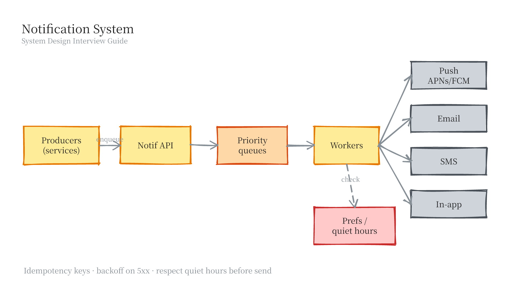

Multi-channel notifications: push, email, SMS, in-app—triggered by product events with user preferences.

### 1. Clarify

- Channels in scope?
- User preference & quiet hours?
- Templates & localization?
- Delivery receipts / digests?
- Priority (security OTP vs marketing)?

**NFRs:** high fan-out, at-least-once OK with dedupe, OTP latency low, marketing best-effort.

### 2. Capacity

100M DAU; 5 notifs/user/day → ~5K events/sec avg; peaks 5–10×. Spike on breaking news.

### 3. APIs

```
POST /v1/notifications
  { "user_id"| "segment", "template_id", "data", "channels?", "priority" }
  → { "notification_id" }

PUT /v1/users/{id}/preferences
GET /v1/users/{id}/inbox
```

Webhooks from providers for bounces/delivery.

### 4. Data model

```
preferences(user_id, channel, enabled, quiet_hours)
templates(id, channel, body, locale)
notifications(id, user_id, payload, status, created_at)
device_tokens(user_id, token, platform)
```

### 5. High-level design

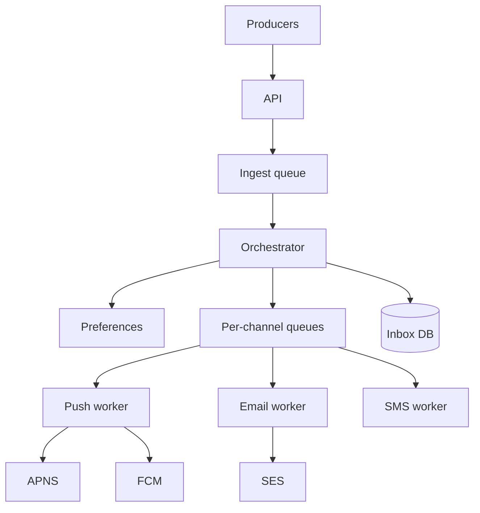
```mermaid
flowchart TB
  Producers --> API
  API --> IngestQ[Ingest queue]
  IngestQ --> Orchestrator
  Orchestrator --> Pref[Preferences]
  Orchestrator --> FanoutQ[Per-channel queues]
  FanoutQ --> PushW[Push worker]
  FanoutQ --> EmailW[Email worker]
  FanoutQ --> SMSW[SMS worker]
  PushW --> APNS
  PushW --> FCM
  EmailW --> SES
  Orchestrator --> Inbox[(Inbox DB)]
```

### 6. Deep dive — fan-out & preferences

Orchestrator expands audience, filters preferences, applies quiet hours (defer to delayed queue), renders templates, enqueues per channel with `notification_id` for idempotency.

**OTP path:** high-priority queue, sync-ish, skip marketing digests, stricter SLA.

**Dedup:** unique `(notification_id, channel)` in provider send table.

### 7. Failures

- Provider outage: retry with backoff; mark deferred; alternate channel optional.
- Preference service down: fail closed for marketing; fail open for security with care.
- Hot broadcast: chunk fan-out; avoid one giant transaction.

### 8. Interview tips

- Separate **transactional** vs **promotional** pipelines.
- Never put SMS OTP solely on a best-effort marketing bus.
- Talk provider rate limits and per-channel queues.

### Priority lanes

| Lane | Examples | SLA |
|------|----------|-----|
| P0 | OTP, security alerts | seconds; dedicated workers |
| P1 | Transactional receipts | <1 min |
| P2 | Social | minutes; batchable |
| P3 | Marketing | hours; digestable |

Never share P0 worker pools with P3.

### Preference evaluation order

1. User hard opt-out
2. Legal/regulatory constraints
3. Quiet hours → delay
4. Channel reachability (valid device token?)
5. Template render

### Idempotency & provider duplicates

Store `provider_message_id`; on retry reuse same client-side idempotency key to SES/FCM when supported. In-app inbox upserts by `notification_id`.

### Observability

Metrics: enqueue rate, send success, provider latency, preference drop rate, lag by lane. Trace_id from producer through send.

### Evolution

Digest bundler, ML send-time optimization, cross-device collapse (“read on web → skip push”).

### Interviewer Q&A (drill these aloud)

**Q: What is the consistency model for the core read?**  
A: State it explicitly (e.g. “redirects may see new links within TTL seconds; creates read-your-writes via primary”).

**Q: Single point of failure?**  
A: Name primary DB / broker / region; give mitigation (replicas, multi-AZ, queue buffer).

**Q: How do you prevent duplicate side effects on retry?**  
A: Idempotency keys / upserts / dedupe table—tie to this design’s writes.

**Q: What metric pages you at 3am?**  
A: Pick SLIs: error rate, p99, lag, saturation—not CPU alone.

**Q: How does this evolve to 10× data?**  
A: Partition key, storage tiering, or CQRS—one concrete next step.

### Implementation sketch (pseudocode mindset)

Walk one write handler: validate → authorize → mutate store → enqueue side effects → return. Mention timeouts on dependency calls. This bridges design and coding rounds.

### Load & chaos test plan (talk track)

1. Happy-path load at 2× peak estimate  
2. Dependency latency injection (+500 ms)  
3. Kill one AZ of the data store  
4. Replay poison message  
State what user experience should be in each case.

### Whiteboard chronological script

1. Clarify channels (push/email/SMS/in-app) and priority lanes.
2. Draw producers → Notif API → priority queues → workers → providers.
3. Add prefs/quiet hours DB.
4. Mention idempotency per notification id.
5. Leave template rendering deep dive for later.


<sub>Editable source: [notification-system.excalidraw](diagrams/excalidraw/notification-system.excalidraw) (open at [excalidraw.com](https://excalidraw.com)). Legacy: `.drawio` under [`diagrams/`](diagrams/).</sub>

### Interviewer probes (realistic Q&A)

**Interviewer:** OTP vs marketing?  
**You:** Separate queues/bulkheads; OTP higher SLO, no digest batching; marketing deferrable.

**Interviewer:** Exactly-once to APNs?  
**You:** At-least-once + provider idempotency keys / dedupe; user may still see rare dupes — design templates accordingly.

**Interviewer:** Provider outage?  
**You:** Circuit breaker; retry with jitter; shift to alternate channel if prefs allow.

## News feed

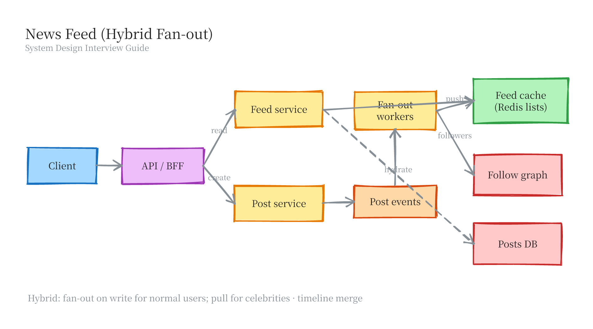

Home timeline of posts from people you follow—ranking optional for deep dive.

### 1. Clarify

- Chronological vs ranked?
- Media posts?
- Ads / recommendations in scope?
- Max following graph size?
- Real-time vs eventual?

**Assumptions:** 100M users, avg 200 follows, celebrity accounts exist, ranked feed phase-2 light, single region first.

### 2. Capacity

- 10M DAU; 10 posts viewed/user → heavy reads
- Write posts: smaller QPS than reads
- Fan-out on write can explode for celebrities

### 3. APIs

```
POST /v1/posts { text, media_ids }
GET  /v1/feed?cursor&limit
POST /v1/follow { followee_id }
GET  /v1/posts/{id}
```

### 4. Data model

```
users, posts(id, author_id, content, created_at)
follows(follower_id, followee_id) PK(follower, followee)
  index(followee_id)  -- for fan-out
feed_cache(user_id, post_ids[])  -- Redis list/ZSET
```

Media in object storage; CDN.

### 5. High-level design

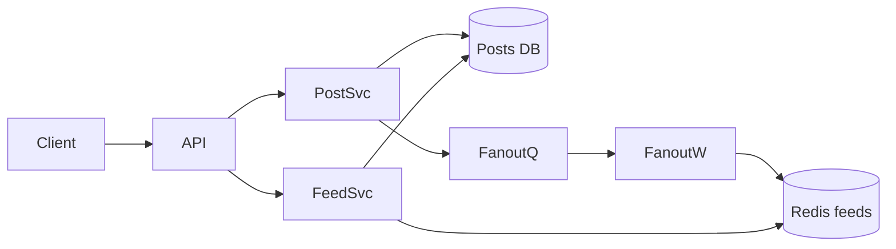
```mermaid
flowchart LR
  Client --> API
  API --> PostSvc
  PostSvc --> DB[(Posts DB)]
  PostSvc --> FanoutQ
  FanoutQ --> FanoutW
  FanoutW --> FeedCache[(Redis feeds)]
  API --> FeedSvc
  FeedSvc --> FeedCache
  FeedSvc --> DB
```

### 6. Deep dive — fan-out

**Fan-out on write:** on post, enqueue pushes of `post_id` into each follower’s cached timeline (ZSET score=time). Reads are cheap.

**Problem:** celebrities with 50M followers → write storm.

**Hybrid:** fan-out on write for normal users; for celebrities, fan-out on read (merge celebrity posts at read time). Detect via follower threshold.

**Ranking:** candidate generation from cache → ranker service (ML optional) → truncate. Keep chronological first if timeboxed.

### 7. Failures

- Fan-out lag: user sees delayed posts—show “updating.”
- Redis loss: rebuild from follows+posts asynchronously; degrade to slower path.
- Hot celebrity post: cache post objects aggressively.

### 8. Interview tips

- State hybrid threshold explicitly.
- Separate post object cache from timeline lists.
- Mention pagination cursors (score, id).

### Read path detail

1. Authn → `user_id`
2. `ZREVRANGE feed:{uid} start start+limit`
3. Hydrate `post:{id}` objects from cache/DB (MGET)
4. Filter deleted/blocked/muted
5. Optional ranker reorders page
6. Return cursor = last score+id

### Celebrity threshold policy

If `followers > 10k` (tunable), skip write fan-out; mark author `fanout=read`. Feed service merges those authors’ recent posts into the cached timeline at read.

### Cache memory rough math

1M DAU × 500 post_ids × 16 bytes ≈ 8 GB for timelines (order-of-magnitude)—fits a Redis cluster; still shard by user_id.

### Privacy

Respect blocks and audience ACL (friends-only posts) at hydrate time—not only at fan-out—so policy changes apply retroactively.

### Evolution

Edge caches for anonymous trending; multi-region feed caches with user home region; ML ranker as separate service with fallback to chrono.

### Interviewer Q&A (drill these aloud)

**Q: What is the consistency model for the core read?**  
A: State it explicitly (e.g. “redirects may see new links within TTL seconds; creates read-your-writes via primary”).

**Q: Single point of failure?**  
A: Name primary DB / broker / region; give mitigation (replicas, multi-AZ, queue buffer).

**Q: How do you prevent duplicate side effects on retry?**  
A: Idempotency keys / upserts / dedupe table—tie to this design’s writes.

**Q: What metric pages you at 3am?**  
A: Pick SLIs: error rate, p99, lag, saturation—not CPU alone.

**Q: How does this evolve to 10× data?**  
A: Partition key, storage tiering, or CQRS—one concrete next step.

### Implementation sketch (pseudocode mindset)

Walk one write handler: validate → authorize → mutate store → enqueue side effects → return. Mention timeouts on dependency calls. This bridges design and coding rounds.

### Load & chaos test plan (talk track)

1. Happy-path load at 2× peak estimate  
2. Dependency latency injection (+500 ms)  
3. Kill one AZ of the data store  
4. Replay poison message  
State what user experience should be in each case.

### Whiteboard chronological script

1. Clarify follow model, ranking vs chrono, celebrity problem.
2. Write fan-out-on-write vs read tradeoff in one sentence.
3. Draw Post service → queue → fan-out workers → Redis feed lists.
4. Draw read path API → feed cache → hydrate posts.
5. Mark celebrities as pull exceptions.
6. Leave ML ranker blank until asked (or point to recommendation section).


<sub>Editable source: [news-feed.excalidraw](diagrams/excalidraw/news-feed.excalidraw) (open at [excalidraw.com](https://excalidraw.com)). Legacy: `.drawio` under [`diagrams/`](diagrams/).</sub>

### Interviewer probes (realistic Q&A)

**Interviewer:** Why hybrid fan-out?  
**You:** Push to normal users’ caches for fast read; celebrities would explode write amplification — readers pull their posts on demand.

**Interviewer:** Consistency?  
**You:** Eventual — feeds lag seconds; OK for social. Stronger for “delete my post” via async fan-out of deletes.

**Interviewer:** Hotspot celebrity posts?  
**You:** Cache post body heavily; don’t fan-out to 50M followers on write.

## Chat & messaging

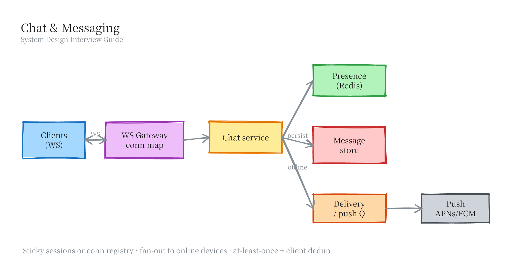

1:1 and group chat with online delivery, history, and read indicators (light).

### 1. Clarify

- 1:1 only or groups?
- Delivery receipts / typing?
- Media attachments?
- Encryption (E2E) in scope?
- Message order guarantees?

**NFRs:** low latency push, history durable, at-least-once with client dedupe, ordering per conversation.

### 2. Capacity

50M DAU; 40 msgs/user/day → ~20K msgs/sec avg; push connections for online users (~5–10M concurrent)—connection tier is the hard part.

### 3. APIs / protocols

```
WS /connect  (auth token)
send { conv_id, client_msg_id, body }
ack / push { msg }
HTTP POST /v1/conversations
GET /v1/conversations/{id}/messages?cursor
```

### 4. Data model

```
conversations(id, type, created_at)
members(conv_id, user_id, role)
messages(conv_id, msg_id, sender_id, body, created_at)
  PK (conv_id, msg_id) — shard by conv_id
devices / sessions for push
```

### 5. High-level design

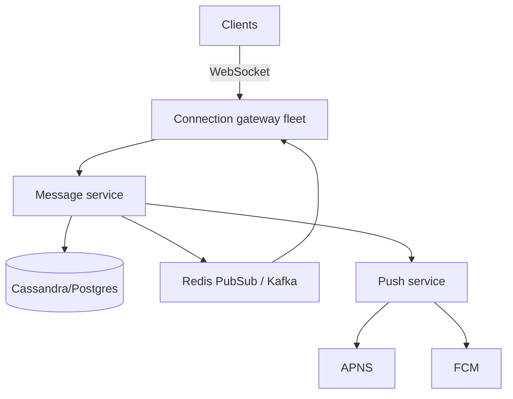
```mermaid
flowchart TB
  Clients -->|WebSocket| GW[Connection gateway fleet]
  GW --> MsgSvc[Message service]
  MsgSvc --> DB[(Cassandra/Postgres)]
  MsgSvc --> Pub[Redis PubSub / Kafka]
  Pub --> GW
  MsgSvc --> Push[Push service]
  Push --> APNS
  Push --> FCM
```

**Online:** store message → publish to member connection gateways → push frames.  
**Offline:** trigger mobile push; inbox fetch later.

### 6. Deep dive — connections & order

Gateways hold sockets; session registry maps `user_id → gateway_id`. Sticky LB or gossip registry.

**Ordering:** snowflake/ULID per message; clients sort by `(created_at, msg_id)`. Per-`conv_id` Kafka partition if streaming.

**Idempotency:** `client_msg_id` unique per sender.

**Groups:** fan-out to N members; for large groups use channel fan-out servers.

### 7. Failures

- Gateway crash: clients reconnect; miss window recovered via history API since cursor.
- Dup delivers: client dedupe by msg_id.
- Hot group chat: separate channel infra.

### 8. Interview tips

- Call out WebSocket scaling as primary challenge.
- History store ≠ connection tier.
- Mention backfill on reconnect.

### Message state machine

`pending (client) → server_accepted → delivered → read (optional)`

Clients show local echo with `client_msg_id` until server assigns `msg_id`.

### Fan-out for groups

| Members | Strategy |
|---------|----------|
| ≤50 | Direct publish to each online session |
| 50–1k | Per-conversation pub/sub channel |
| ≥1k | Broadcast tier / channel servers; history still sharded |

### Media in chat

Upload via signed URL; message body stores `media_id`; receivers fetch CDN. Virus scan before making media downloadable.

### Multi-device

Registry allows multiple sessions per user; fan-out to all. Read receipts may be per-user not per-device (product choice).

### Evolution

E2E encryption (keys on device; server relays ciphertext); message search index async; disappearing messages via TTL jobs.

### Interviewer Q&A (drill these aloud)

**Q: What is the consistency model for the core read?**  
A: State it explicitly (e.g. “redirects may see new links within TTL seconds; creates read-your-writes via primary”).

**Q: Single point of failure?**  
A: Name primary DB / broker / region; give mitigation (replicas, multi-AZ, queue buffer).

**Q: How do you prevent duplicate side effects on retry?**  
A: Idempotency keys / upserts / dedupe table—tie to this design’s writes.

**Q: What metric pages you at 3am?**  
A: Pick SLIs: error rate, p99, lag, saturation—not CPU alone.

**Q: How does this evolve to 10× data?**  
A: Partition key, storage tiering, or CQRS—one concrete next step.

### Implementation sketch (pseudocode mindset)

Walk one write handler: validate → authorize → mutate store → enqueue side effects → return. Mention timeouts on dependency calls. This bridges design and coding rounds.

### Load & chaos test plan (talk track)

1. Happy-path load at 2× peak estimate  
2. Dependency latency injection (+500 ms)  
3. Kill one AZ of the data store  
4. Replay poison message  
State what user experience should be in each case.

### Whiteboard chronological script

1. Clarify 1:1 vs groups (if groups dominate, pivot to group-chat design).
2. Draw WS gateway fleet before business logic.
3. Persist message then fan-out via pub/sub.
4. Add presence store; offline push.
5. Leave media upload to object storage + CDN.


<sub>Editable source: [chat-messaging.excalidraw](diagrams/excalidraw/chat-messaging.excalidraw) (open at [excalidraw.com](https://excalidraw.com)). Legacy: `.drawio` under [`diagrams/`](diagrams/).</sub>

### Interviewer probes (realistic Q&A)

**Interviewer:** DB for messages?  
**You:** Wide-column / partitioned store by conversation_id + timestamp; metadata in Postgres.

**Interviewer:** Ordering across devices?  
**You:** Per-conversation monotonic IDs; clients reconcile with server ids.

**Interviewer:** Gateway sticky sessions?  
**You:** Prefer external conn registry + pub/sub so any gateway can push; stickiness optional for locality.

## Instagram-like

Photo/video sharing with follow graph, feed, and likish engagement—media pipeline is central.

### 1. Clarify

- Photo only or short video?
- Stories / DMs in scope?
- Filters processed client or server?
- Discovery / explore?

**Focus:** upload → process → feed + profile grid. Skip DMs (see chat design).

### 2. Capacity

- 500M users; 50M DAU; 2 uploads/DAU → ~1K uploads/sec peak careful sizing
- Reads: feed + CDN dominate bandwidth
- Avg image 2 MB original → object storage terabytes+/year

### 3. APIs

```
POST /v1/media/upload-session → { upload_url, media_id }
POST /v1/posts { media_id, caption }
GET  /v1/feed
GET  /v1/users/{id}/posts
POST /v1/posts/{id}/like
```

Clients upload **directly to object storage** via signed URL.

### 4. Data model

```
media(id, user_id, status, variants_json)
posts(id, author_id, media_id, caption, created_at)
likes(post_id, user_id)
follows(...)
```

### 5. High-level design

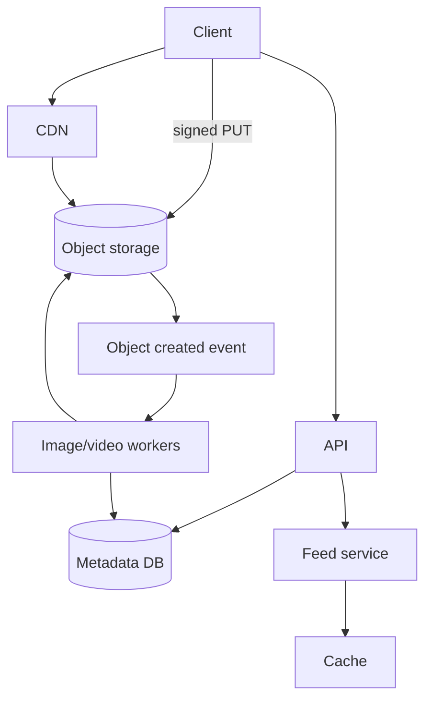
```mermaid
flowchart TB
  Client -->|signed PUT| S3[(Object storage)]
  Client --> API
  API --> MetaDB[(Metadata DB)]
  S3 --> Event[Object created event]
  Event --> ImgProc[Image/video workers]
  ImgProc --> S3
  ImgProc --> MetaDB
  API --> Feed[Feed service]
  Feed --> Cache
  Client --> CDN --> S3
```

### 6. Deep dive — media pipeline

On upload complete: workers generate thumbnails, compress, strip EXIF GPS if required, optional virus scan. Update `media.status=ready` then allow post publish (or auto-post).

**Feed:** reuse hybrid fan-out from news feed design. Grid queries by `author_id, created_at`.

**Like counts:** Redis counters + periodic DB settle; accept slight lag.

### 7. Failures

- Processing backlog: show “processing” placeholder.
- Hot media: CDN cache; origin shield.
- Partial variants: never serve until required sizes ready.

### 8. Interview tips

- Signed URL upload is a must-mention.
- Separate metadata DB from blob bytes.
- Tie feed discussion to earlier fan-out tradeoffs briefly.

### Upload session detail

1. Client requests upload session → API creates `media_id=processing`
2. Client PUT bytes to signed URL (multipart for large)
3. Object store event triggers workers
4. Workers write variants; update media ready
5. Client creates post referencing media_id (rejected if not ready)

### Feed vs Explore

Feed = follow graph (hybrid fan-out). Explore = recommendation candidates (separate system)—mention as phase 2 to avoid boiling ocean.

### Like / comment scale

Likes: Redis set or counter + async durable store. Comments: sharded by `post_id`; page by time. Celebrity posts: cache top comments.

### Moderation

Async classifiers on caption+image; quarantine pipeline; do not block upload path on slow ML.

### Evolution

Reels/short-video shares transcode path with video design; stories as TTL’d media namespace.

### Interviewer Q&A (drill these aloud)

**Q: What is the consistency model for the core read?**  
A: State it explicitly (e.g. “redirects may see new links within TTL seconds; creates read-your-writes via primary”).

**Q: Single point of failure?**  
A: Name primary DB / broker / region; give mitigation (replicas, multi-AZ, queue buffer).

**Q: How do you prevent duplicate side effects on retry?**  
A: Idempotency keys / upserts / dedupe table—tie to this design’s writes.

**Q: What metric pages you at 3am?**  
A: Pick SLIs: error rate, p99, lag, saturation—not CPU alone.

**Q: How does this evolve to 10× data?**  
A: Partition key, storage tiering, or CQRS—one concrete next step.

### Implementation sketch (pseudocode mindset)

Walk one write handler: validate → authorize → mutate store → enqueue side effects → return. Mention timeouts on dependency calls. This bridges design and coding rounds.

### Load & chaos test plan (talk track)

1. Happy-path load at 2× peak estimate  
2. Dependency latency injection (+500 ms)  
3. Kill one AZ of the data store  
4. Replay poison message  
State what user experience should be in each case.

### Whiteboard chronological script

1. Clarify feed vs stories vs DMs scope; lock MVP to upload + follow feed.
2. Draw upload → object storage + async processing.
3. Reuse news-feed hybrid fan-out for home.
4. CDN in front of media.
5. Leave explore/recommendations as phase 2 box.

### Interviewer probes (realistic Q&A)

**Interviewer:** Media storage?  
**You:** Object store + CDN; API only returns signed URLs; process thumbnails async.

**Interviewer:** Feed at 10×?  
**You:** Same hybrid feed; shard follow graph; cache timelines.

## Uber-like

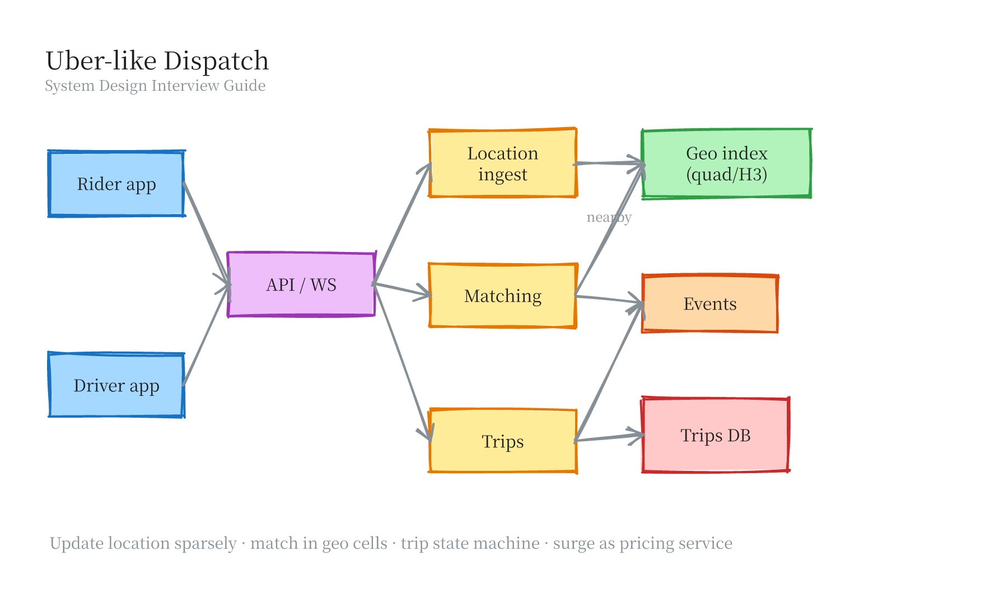

Riders request trips; drivers are matched using geospatial proximity and ETA.

### 1. Clarify

- Rides only (no food)?
- Pricing / surge in scope?
- Payments?
- Cities count / active drivers?

**Core:** location updates, request ride, match, trip lifecycle. Payments summarized.

### 2. Capacity

1M drivers; location update every 3–5s when online → tens–hundreds of K writes/sec → specialized location store. Trip requests much lower QPS.

### 3. APIs

```
PUT /v1/drivers/{id}/location { lat, lng, heading }
POST /v1/trips { pickup, dropoff, product }
WS  trip events: offered, accepted, arrived, completed
POST /v1/trips/{id}/accept
```

### 4. Data model

```
drivers(id, status, vehicle)
trips(id, rider_id, driver_id, status, geo fields, timestamps)
location_store: driver_id → {lat,lng,ts} in memory/geo index
```

### 5. High-level design

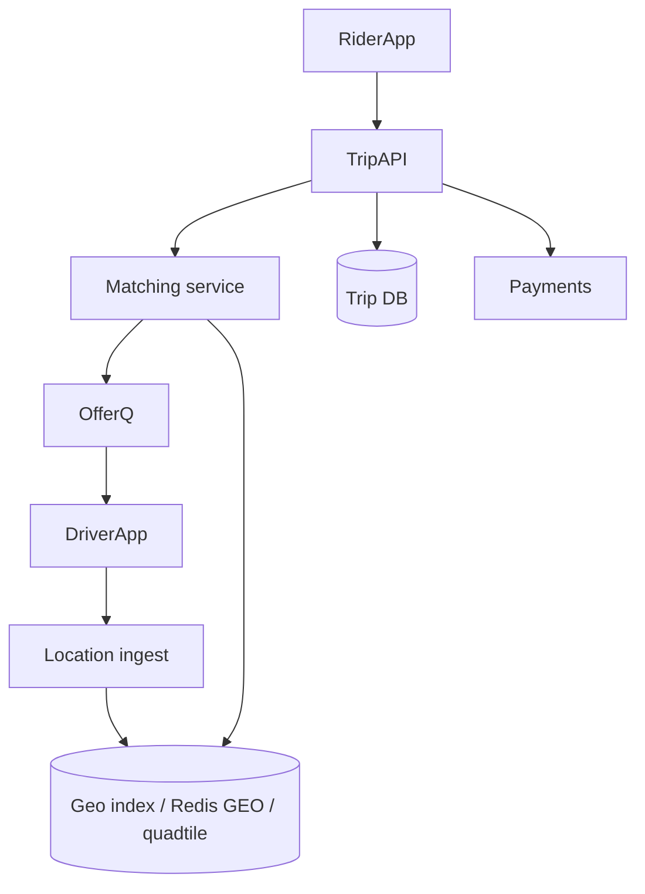
```mermaid
flowchart TB
  DriverApp --> LocAPI[Location ingest]
  LocAPI --> Geo[(Geo index / Redis GEO / quadtile)]
  RiderApp --> TripAPI
  TripAPI --> Match[Matching service]
  Match --> Geo
  Match --> OfferQ
  OfferQ --> DriverApp
  TripAPI --> TripDB[(Trip DB)]
  TripAPI --> Pay[Payments]
```

### 6. Deep dive — matching & geo

**Geo index:** geohash/quadtree tiles; query ring of cells around pickup; filter by status=available; rank by ETA (OSRM/maps) not just distance.

**Matching:** lock driver optimistically (compare-and-set status); offer with timeout; on reject/timeout try next. Avoid double assign with transactional status.

**Location firehose:** downsample; update only if moved >X meters; shard by city/region cell.

### 7. Failures

- Map provider down: fall back to haversine ranking.
- Match storms at concert end: queue requests; expand search radius gradually.
- Split brain assign: fencing on trip version number.

### 8. Interview tips

- Location ingestion scale ≠ trip DB scale—separate them.
- Talk city/region sharding.
- Mention ETA vs crow-flies.

### Trip state machine

`requested → offered → accepted → en_route_pickup → arrived → in_trip → completed` (+ `canceled` edges)

Each transition stores timestamp for analytics and dispute resolution.

### Location update pipeline

Driver app batches locations; ingest validates token + rate; writes to in-memory geo store with TTL; durable log optional for replay. Do not write every ping to OLTP Postgres.

### Matching fairness

Avoid always assigning the same driver; rotate among comparable ETAs; consider driver acceptance rate without creating feedback abuse loops.

### City isolation

Shard control plane by city/region: matching, inventory of drivers, and map config stay local—reduces blast radius and latency.

### Evolution

Multi-stop trips, scheduled rides, cross-city airport queues—each adds inventory constraints; keep core matching simple first.

### Interviewer Q&A (drill these aloud)

**Q: What is the consistency model for the core read?**  
A: State it explicitly (e.g. “redirects may see new links within TTL seconds; creates read-your-writes via primary”).

**Q: Single point of failure?**  
A: Name primary DB / broker / region; give mitigation (replicas, multi-AZ, queue buffer).

**Q: How do you prevent duplicate side effects on retry?**  
A: Idempotency keys / upserts / dedupe table—tie to this design’s writes.

**Q: What metric pages you at 3am?**  
A: Pick SLIs: error rate, p99, lag, saturation—not CPU alone.

**Q: How does this evolve to 10× data?**  
A: Partition key, storage tiering, or CQRS—one concrete next step.

### Implementation sketch (pseudocode mindset)

Walk one write handler: validate → authorize → mutate store → enqueue side effects → return. Mention timeouts on dependency calls. This bridges design and coding rounds.

### Load & chaos test plan (talk track)

1. Happy-path load at 2× peak estimate  
2. Dependency latency injection (+500 ms)  
3. Kill one AZ of the data store  
4. Replay poison message  
State what user experience should be in each case.

### Whiteboard chronological script

1. Clarify trip lifecycle, matching radius, city launch.
2. Draw rider/driver apps → API → trip + matching + location ingest.
3. Add geo index for nearby drivers.
4. Event pipeline for trip state.
5. Leave pricing/surge as formula box.


<sub>Editable source: [uber-dispatch.excalidraw](diagrams/excalidraw/uber-dispatch.excalidraw) (open at [excalidraw.com](https://excalidraw.com)). Legacy: `.drawio` under [`diagrams/`](diagrams/).</sub>

### Interviewer probes (realistic Q&A)

**Interviewer:** Where do GPS updates go?  
**You:** High-write location service → geo index (Redis GEO / quadtile); not the OLTP trips primary for every ping.

**Interviewer:** Matching consistency?  
**You:** Optimistic lock / conditional update on driver availability so two riders don’t get same driver.

**Interviewer:** Hot downtown?  
**You:** Shard geo by city/cell; more matchers; cap search radius dynamically.

## Video streaming

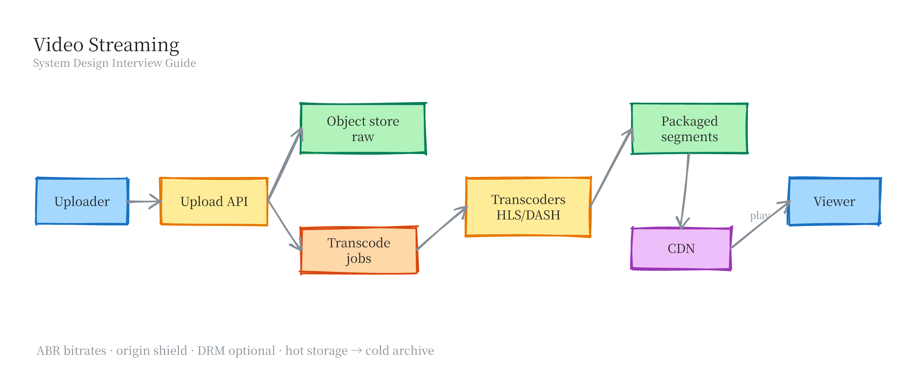

Upload, process, and stream videos with adaptive bitrate (think YouTube/NetflixLite).

### 1. Clarify

- VOD only or live?
- Max resolution / DRM?
- Comments / recommendations?
- Global audience?

**Focus:** VOD upload → transcode → CDN playback. Skip social.

### 2. Capacity

1M DAU watching 30 min; 3 Mbps avg → huge egress → **CDN mandatory**. Uploads: 1K videos/day varying sizes—transcode CPU bound.

### 3. APIs

```
POST /v1/videos → { video_id, upload_url }
POST /v1/videos/{id}/complete
GET  /v1/videos/{id} → metadata + manifest_url
GET  /manifest.m3u8  (HLS) via CDN
```

### 4. Data model

```
videos(id, owner_id, title, status, duration, renditions_json)
watch_history(user_id, video_id, position)
```

Bytes in object storage; never in SQL.

### 5. High-level design

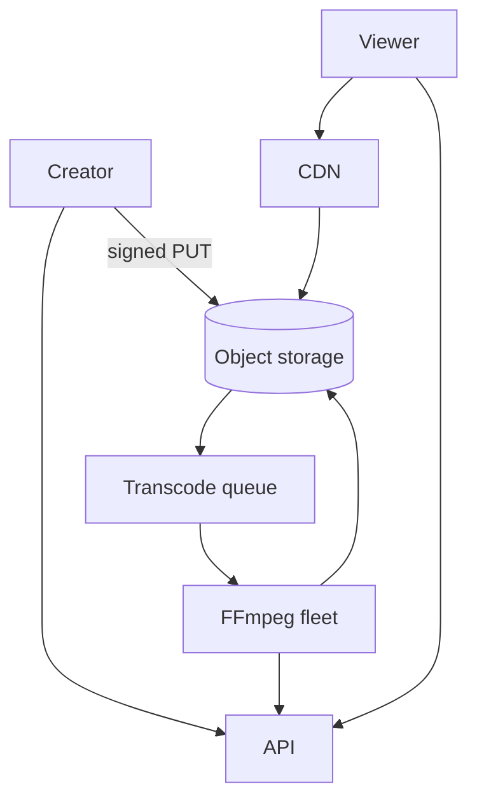
```mermaid
flowchart TB
  Creator -->|signed PUT| Obj[(Object storage)]
  Creator --> API
  Obj --> Q[Transcode queue]
  Q --> Workers[FFmpeg fleet]
  Workers --> Obj
  Workers --> API
  Viewer --> CDN
  CDN --> Obj
  Viewer --> API
```

### 6. Deep dive — adaptive streaming

Transcode into multiple renditions (360p–1080p) + segment (HLS/DASH). Client picks bitrate via ABR. Packaging pipeline updates status to `ready` when minimally playable rendition exists.

**Warm CDN:** popular videos pre-pushed to edge; long-tail on miss from origin/shield.

**Thumbnails & previews:** separate jobs; sprite sheets for scrubbing.

### 7. Failures

- Transcode fail: retry; quarantine poison files; notify creator.
- CDN origin overload: origin shield + rate limit.
- Partial publish: don’t expose until ready (or progressive).

### 8. Interview tips

- Lead with CDN + object storage + async transcode.
- Estimate egress to justify CDN cost story.
- Mention DRM only if interviewer cares.

### Transcode job graph

Original → (probe) → parallel renditions → package HLS → thumbnail → preview gif → mark ready.

Use a workflow engine or queue DAG; checkpoint each step for retries.

### Playback path

Client GETs metadata → receives CDN URL for master playlist → requests segments; CDN cache-hit ratio drives cost. Tokenized URLs for paid content (short-lived signatures).

### Cost controls

- Lifecycle cold storage for rarely watched
- Shorter segment size vs more requests tradeoff
- Cap max upload length on free tier

### Live vs VOD

Live needs low-latency ingest and different failure modes (reconnect mid-stream). Keep out of scope unless asked; note the divergence.

### Evolution

Recommendations, comments, copyright fingerprinting async—each is a consumer of the “video ready” event.

### Interviewer Q&A (drill these aloud)

**Q: What is the consistency model for the core read?**  
A: State it explicitly (e.g. “redirects may see new links within TTL seconds; creates read-your-writes via primary”).

**Q: Single point of failure?**  
A: Name primary DB / broker / region; give mitigation (replicas, multi-AZ, queue buffer).

**Q: How do you prevent duplicate side effects on retry?**  
A: Idempotency keys / upserts / dedupe table—tie to this design’s writes.

**Q: What metric pages you at 3am?**  
A: Pick SLIs: error rate, p99, lag, saturation—not CPU alone.

**Q: How does this evolve to 10× data?**  
A: Partition key, storage tiering, or CQRS—one concrete next step.

### Implementation sketch (pseudocode mindset)

Walk one write handler: validate → authorize → mutate store → enqueue side effects → return. Mention timeouts on dependency calls. This bridges design and coding rounds.

### Load & chaos test plan (talk track)

1. Happy-path load at 2× peak estimate  
2. Dependency latency injection (+500 ms)  
3. Kill one AZ of the data store  
4. Replay poison message  
State what user experience should be in each case.

### Whiteboard chronological script

1. Clarify VOD vs live; ABR; comments scope.
2. Draw upload → object store → transcoder queue → packaged HLS/DASH → CDN.
3. Metadata DB for titles; playback auth signed cookies/URLs.
4. Leave recommendation blank or stub.


<sub>Editable source: [video-streaming.excalidraw](diagrams/excalidraw/video-streaming.excalidraw) (open at [excalidraw.com](https://excalidraw.com)). Legacy: `.drawio` under [`diagrams/`](diagrams/).</sub>

### Interviewer probes (realistic Q&A)

**Interviewer:** Why CDN?  
**You:** Video bytes dominate egress; edge caching cuts origin load and latency.

**Interviewer:** Hot video?  
**You:** CDN absorbs; origin shielded; popular encodings pre-warmed.

**Interviewer:** Transcoding failure?  
**You:** Retry poison with limit; mark video failed; alert; user can reupload.

## Dropbox-like

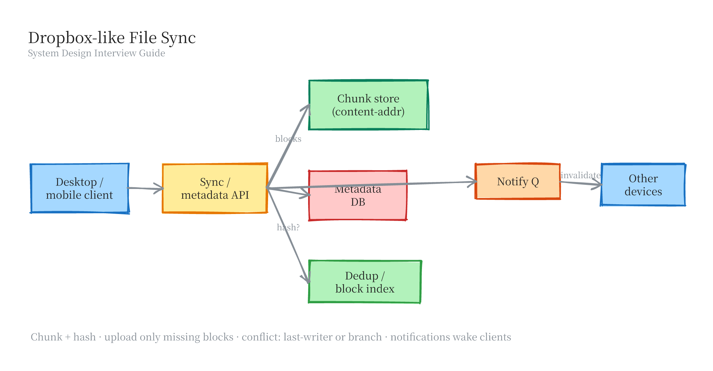

Users upload files; sync across devices with dedupe, versioning, and sharing (light).

### 1. Clarify

- File size limits? Large file chunking?
- Conflict resolution (last-write-wins vs branches)?
- Sharing links / collaborators?
- Block-level sync?

**NFRs:** durable, eventual sync across devices, efficient bandwidth (chunking + dedupe).

### 2. Capacity

100M users; avg 10 GB stored → exabyte-class object store; metadata smaller but hot. Sync traffic bursty when devices reconnect.

### 3. APIs

```
POST /v1/files/commit { path, blocks[], rev }
GET  /v1/files/metadata?path
POST /v1/blocks/upload { block_hash } → upload_url if novel
GET  /v1/sync/changes?cursor
```

### 4. Data model

```
namespaces / folders
files(id, ns_id, path, rev, size)
blocks(hash PK, size)  -- content addressed
file_blocks(file_id, idx, hash)
revisions(file_id, rev, metadata)
```

### 5. High-level design

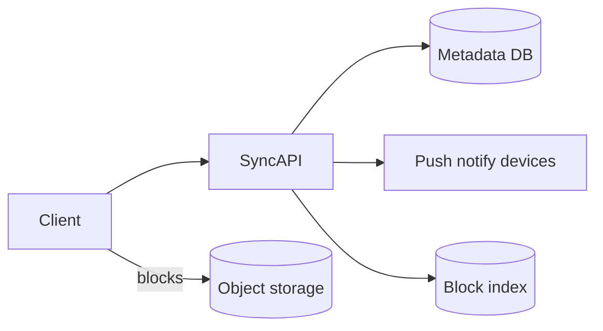
```mermaid
flowchart LR
  Client --> SyncAPI
  SyncAPI --> Meta[(Metadata DB)]
  Client -->|blocks| Obj[(Object storage)]
  SyncAPI --> Notify[Push notify devices]
  SyncAPI --> BlockIndex[(Block index)]
```

### 6. Deep dive — chunking & conflicts

Files split into ~4MB blocks; hash (SHA256); upload only missing blocks (global dedupe). Commit updates metadata revision atomically.

**Conflicts:** if client’s base rev ≠ server tip → conflict copy or automatic merge for docs (scope). Notify other devices via long-poll/websocket with cursor.

**Large folders:** paginate change feed; avoid listing entire tree each sync.

### 7. Failures

- Commit after partial block upload: commit rejects until all blocks present.
- Metadata vs block inconsistency: GC unreferenced blocks lazily; never delete block still referenced.
- Hot shared folder: shard metadata by namespace_id.

### 8. Interview tips

- Content-addressed blocks are the star of the design.
- Metadata DB is the consistency bottleneck—design commits carefully.
- Client sync protocol > fancy storage brands.

### Sync cursor protocol

Server maintains per-namespace journal of changes. Client sends cursor; server returns batch of path changes + new cursor. Idempotent apply on client.

### Dedup savings

Identical blocks across users (popular OS files, shared photos) upload once. Privacy: hash only; cannot reconstruct others’ files without blocks you own.

### Sharing

Share link creates capability token on a subtree; authz check on download. Collaborator write requires conflict rules same as multi-device.

### Client tips for interviews

Mention offline queue of commits; exponential backoff; bandwidth caps on mobile metered networks.

### Evolution

Full-text search of file names/content via async indexer; ransomware recovery via version history restore points.

### Interviewer Q&A (drill these aloud)

**Q: What is the consistency model for the core read?**  
A: State it explicitly (e.g. “redirects may see new links within TTL seconds; creates read-your-writes via primary”).

**Q: Single point of failure?**  
A: Name primary DB / broker / region; give mitigation (replicas, multi-AZ, queue buffer).

**Q: How do you prevent duplicate side effects on retry?**  
A: Idempotency keys / upserts / dedupe table—tie to this design’s writes.

**Q: What metric pages you at 3am?**  
A: Pick SLIs: error rate, p99, lag, saturation—not CPU alone.

**Q: How does this evolve to 10× data?**  
A: Partition key, storage tiering, or CQRS—one concrete next step.

### Implementation sketch (pseudocode mindset)

Walk one write handler: validate → authorize → mutate store → enqueue side effects → return. Mention timeouts on dependency calls. This bridges design and coding rounds.

### Load & chaos test plan (talk track)

1. Happy-path load at 2× peak estimate  
2. Dependency latency injection (+500 ms)  
3. Kill one AZ of the data store  
4. Replay poison message  
State what user experience should be in each case.

### Whiteboard chronological script

1. Clarify sync vs web upload; sharing; conflict policy.
2. Draw client → metadata service + block/chunk service → object store.
3. Content-hash dedup index; sync notify channel.
4. Mention checksums on chunk upload.


<sub>Editable source: [dropbox.excalidraw](diagrams/excalidraw/dropbox.excalidraw) (open at [excalidraw.com](https://excalidraw.com)). Legacy: `.drawio` under [`diagrams/`](diagrams/).</sub>

### Interviewer probes (realistic Q&A)

**Interviewer:** Why chunks?  
**You:** Resume, dedup, parallel upload; metadata references chunk lists.

**Interviewer:** Conflict two writers?  
**You:** Version vectors / last-writer with conflict copy; don’t silently merge binary blindly.

**Interviewer:** Metadata SPOF?  
**You:** Replicated metadata DB; block data already in durable object store.

## Web crawler

Polite, scalable URL fetcher for search/index pipelines. Focus on frontier, politeness, dedup, and failure isolation—not building Google.

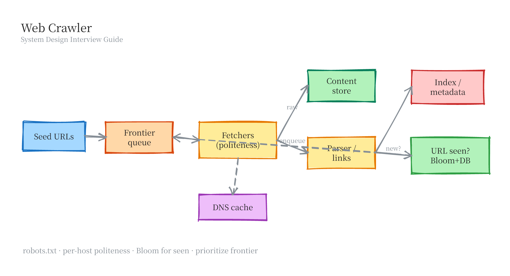

<sub>Editable source: [web-crawler.excalidraw](diagrams/excalidraw/web-crawler.excalidraw) (open at [excalidraw.com](https://excalidraw.com)). Legacy: `.drawio` under [`diagrams/`](diagrams/).</sub>


### 1. Clarify

- Seed set / continuous crawl?
- JS rendering required (expensive) or static HTML?
- Respect robots.txt and crawl-delay?
- Max pages / freshness SLO?
- Downstream: store raw HTML, or parse+index in-scope?

**MVP:** static fetch, politeness per host, Bloom+store dedup, store HTML to object storage, emit parse jobs.

### 2. Capacity

Target 1K pages/sec steady → ~86M/day. Bandwidth and DNS dominate. Store: 100 KB HTML avg → ~8.6 TB/day raw before compression — compress and TTL/tier.

### 3. APIs / control plane

```
POST /v1/seeds  { "urls": [...] }
GET  /v1/stats  → { frontier_size, fetch_qps, error_rate }
POST /v1/hosts/{host}/pause
```

Workers pull from frontier; no public fetch API required.

### 4. Data model

```
frontier(url, priority, next_fetch_at, host)
seen_exact(url_hash)  -- durable
seen_bloom             -- probabilistic
robots_cache(host, rules, fetched_at)
documents(url, fetch_ts, content_ref, status)
```

### 5. High-level design

```mermaid
flowchart LR
  Seeds --> Frontier[Frontier / priority queues]
  Frontier --> Fetcher
  Fetcher --> DNS
  Fetcher --> HostRL[Per-host rate limit]
  Fetcher --> Store[(Object store)]
  Fetcher --> Seen[Bloom + exact seen]
  Fetcher --> ParseQ[Parse queue]
```

**Loop:** take URL → check seen → DNS → robots → per-host token → fetch → store → extract links → enqueue new URLs.

### 6. Deep dives

**Politeness:** per-host queues; concurrency 1 (or small N); honor crawl-delay.

**Dedup:** Bloom filter for cheap negatives; exact store for positives. False positives → rare missed pages; tune size. See [Bloom filters](#bloom-filters).

**Canonicalization:** scheme/host casing, trailing slash, strip tracking params.

**Priority:** sitemap/seed high; discover links lower; recrawl by freshness score.

### 7. Failures

- Slow hosts clog workers: timeouts + isolate host queue.
- Redirect loops: max hop count.
- Poison huge docs: size cap; circuit on parser.
- DNS outage: cache TTLs; backoff.

### 8. Whiteboard chronological script

1. Clarify politeness, scope (seed domains), JS rendering needs.
2. Draw frontier queue → fetcher workers → parser → URL filter (Bloom + store) → storage.
3. Per-host rate limits; DNS cache.
4. Leave ranking/indexer as downstream box.
5. Call out Bloom FP tradeoff in one sentence.

### 9. Interviewer probes (realistic Q&A)

**Interviewer:** Seen-URL set too large?  
**You:** Bloom for negatives + durable exact store; accept rare redundant fetches from FPs.

**Interviewer:** Politeness failure?  
**You:** Per-host queues and token buckets; respect robots.txt; separate crawl-delay.

**Interviewer:** Why not one giant FIFO?  
**You:** Starves politeness and priority; use per-host scheduling on top of global frontier.

**Interviewer:** 10× fetch rate?  
**You:** More fetcher pools by host-hash shard; expand DNS cache; ensure downstream storage ingress keeps up.

**Interviewer:** Consistency?  
**You:** Crawl is eventually consistent discovery; exactly-once fetch not required — idempotent store by URL version.

### Evolution

Add headless render pool for JS sites; change-detection recrawl; integrate with [Search](#search) indexer.

## Typeahead

**In plain English:** Typeahead (autocomplete) suggests queries as you type "sys…" → "system design". It must feel instant, so the hot path is mostly prefix lookup and caching — not a full search crawl.

> **Key takeaway:** Cache hot prefixes at the edge; limit candidates; rank by popularity with light personalization only if needed.

Suggest queries or entities as the user types, with very low latency.

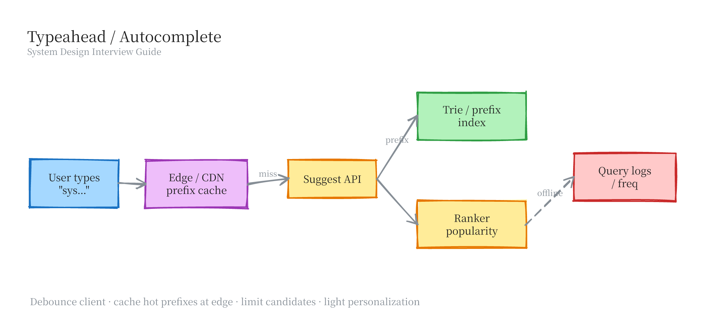

<sub>Editable source: [typeahead.excalidraw](diagrams/excalidraw/typeahead.excalidraw) (open at [excalidraw.com](https://excalidraw.com)). Legacy: `.drawio` under [`diagrams/`](diagrams/).</sub>


### 1. Clarify

- Query suggestions vs user/product entities?
- Personalization?
- Typo tolerance?
- Languages?

**NFR:** p99 < 100 ms end-to-end; high QPS; eventual freshness OK (minutes).

### 2. Capacity

100K QPS peak typing traffic; each keystroke may fire request (debounce client-side 50–100 ms).

### 3. APIs

```
GET /v1/suggest?q=sea&limit=8
→ { "suggestions": ["seattle weather", "search engines", ...] }
```

### 4. Data model

Trie / prefix index in memory; or ranked suggestions table:

```
suggestions(prefix, term, score)
```

Source: query logs aggregated offline + editorials.

### 5. High-level design

```mermaid
flowchart LR
  Client --> Edge[CDN / edge cache]
  Edge --> Sugg[Suggest service]
  Sugg --> Mem[(In-memory trie / Redis)]
  Logs --> Batch[Agg pipeline]
  Batch --> Mem
```

### 6. Deep dive — data structure & ranking

**Trie / radix tree** of terms; at each node top-K heap by score. Memory heavy but fast. Shard by prefix first character(s).

**Ranking score:** frequency × freshness × click-through; personalization as re-rank of top-K.

**Cache:** edge cache common prefixes (`q=a`, `q=se`); short TTL.

**Typo:** fuzzy at cost—optional second pass if exact prefix sparse.

### 7. Failures

- Index rebuild: blue/green swap of trie snapshot.
- Hot prefix “a”: more replicas; cache.
- Empty results: fall back to popular overall.

### 8. Interview tips

- Client debounce is part of the design.
- Offline aggregation → online trie is a clean story.
- Don’t put typeahead on disk-bound SQL for each keystroke.

### Building the trie offline

Nightly (or hourly): aggregate query logs → filter abuse → compute scores → build immutable trie snapshot → push to suggest fleet → atomic swap.

### Online personalization

Fetch global top-K for prefix; re-rank with user recent searches / locale / vertical. Keep personalization off the trie critical path when possible.

### Client UX

Debounce 75 ms; cancel in-flight on new keystroke; prefetch next likely char for popular prefixes optional.

### Abuse

Block injection of spam suggestions; moderate editorial blacklist; rate-limit suggest API.

### Evolution

Multi-language analyzers; entity suggest (users, products) with type icons; voice input tokenization.

### Interviewer Q&A (drill these aloud)

**Q: What is the consistency model for the core read?**  
A: State it explicitly (e.g. “redirects may see new links within TTL seconds; creates read-your-writes via primary”).

**Q: Single point of failure?**  
A: Name primary DB / broker / region; give mitigation (replicas, multi-AZ, queue buffer).

**Q: How do you prevent duplicate side effects on retry?**  
A: Idempotency keys / upserts / dedupe table—tie to this design’s writes.

**Q: What metric pages you at 3am?**  
A: Pick SLIs: error rate, p99, lag, saturation—not CPU alone.

**Q: How does this evolve to 10× data?**  
A: Partition key, storage tiering, or CQRS—one concrete next step.

### Implementation sketch (pseudocode mindset)

Walk one write handler: validate → authorize → mutate store → enqueue side effects → return. Mention timeouts on dependency calls. This bridges design and coding rounds.

### Load & chaos test plan (talk track)

1. Happy-path load at 2× peak estimate  
2. Dependency latency injection (+500 ms)  
3. Kill one AZ of the data store  
4. Replay poison message  
State what user experience should be in each case.

### Whiteboard chronological script

1. Clarify dataset (users, queries), latency budget (<50 ms).
2. Draw client → edge/API → trie/prefix index (Redis/memory) → rank top k.
3. Mention cache of popular prefixes; personalization light touch.

### Interviewer probes (realistic Q&A)

**Interviewer:** Data structure?  
**You:** Trie / sorted sets by prefix; or search engine completion suggester.

**Interviewer:** Hot prefix “a”?  
**You:** Cache aggressively; limit fan-out; precompute top results.

## Search

Full-text search over documents (products, web pages, or app content) with ranking and filters.

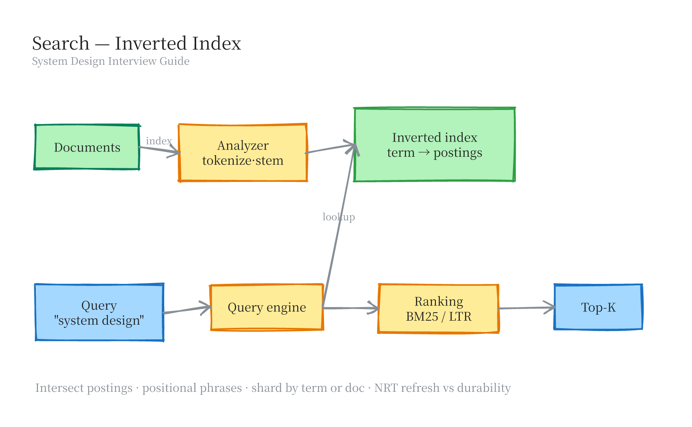

<sub>Editable source: [search-inverted-index.excalidraw](diagrams/excalidraw/search-inverted-index.excalidraw) (open at [excalidraw.com](https://excalidraw.com)). Legacy: `.drawio` under [`diagrams/`](diagrams/).</sub>


### 1. Clarify

- Corpus size & update rate?
- Filters / facets?
- Personalization / autocomplete (separate)?
- Exact phrase / language?

### 2. Capacity

100M docs; 1–5KB text each; 1K updates/sec; 10K queries/sec. Index size often 20–50% of raw text (rule of thumb varies).

### 3. APIs

```
GET /v1/search?q=&filters=&page=
POST /v1/index/docs  (internal)
```

### 4. Data model

Source of truth DB + **inverted index** in search cluster:

```
term → postings list of (doc_id, tf, positions?)
doc_store for snippets
```

### 5. High-level design

```mermaid
flowchart TB
  Writers --> SoT[(Source DB)]
  SoT --> CDC[CDC / events]
  CDC --> Indexer
  Indexer --> SearchCluster[(Shards of inverted index)]
  Client --> QueryAPI
  QueryAPI --> SearchCluster
  QueryAPI --> Ranker
```

### 6. Deep dive — indexing & query

**Indexing:** tokenize, normalize (lower case, stem), update inverted lists; near-real-time segments flush & merge (LSM-like). Use doc_id routing hash for shards.

**Query:** parse → retrieve candidates from postings intersection → score (BM25) → apply filters → maybe second-stage ML rank → return snippets with highlights.

**Consistency:** search is eventually consistent with SoT; show “indexed_at” if needed.

### 7. Failures

- Hot terms explode CPU: cache query results; harden stopwords.
- Split brain index: replica shards; quorum for admin ops.
- Poison docs blow memory: size limits; analyzer circuit breakers.

### 8. Interview tips

- Emphasize SoT ≠ search index.
- Name BM25 / inverted index without claiming to invent Lucene.
- Separate autocomplete service if asked.

### Shard & replica layout

Index split by doc_id hash into N primary shards; each has replicas for read scale and HA. Query fan-out to shards → merge top-K.

### Relevance debugging

Explain API showing matched terms and scores—valuable in interviews as an operational touch.

### Permissions

For private corpora, filter by ACL post-retrieve or index doc with permission tokens carefully (avoid leakage). Never show snippets user cannot access.

### Zero-downtime reindex

Blue/green index aliases: build v2 → swap alias → drop v1.

### Evolution

Learning-to-rank stage; vector search hybrid (keyword + embedding); synonyms managed via config service.

### Interviewer Q&A (drill these aloud)

**Q: What is the consistency model for the core read?**  
A: State it explicitly (e.g. “redirects may see new links within TTL seconds; creates read-your-writes via primary”).

**Q: Single point of failure?**  
A: Name primary DB / broker / region; give mitigation (replicas, multi-AZ, queue buffer).

**Q: How do you prevent duplicate side effects on retry?**  
A: Idempotency keys / upserts / dedupe table—tie to this design’s writes.

**Q: What metric pages you at 3am?**  
A: Pick SLIs: error rate, p99, lag, saturation—not CPU alone.

**Q: How does this evolve to 10× data?**  
A: Partition key, storage tiering, or CQRS—one concrete next step.

### Implementation sketch (pseudocode mindset)

Walk one write handler: validate → authorize → mutate store → enqueue side effects → return. Mention timeouts on dependency calls. This bridges design and coding rounds.

### Load & chaos test plan (talk track)

1. Happy-path load at 2× peak estimate  
2. Dependency latency injection (+500 ms)  
3. Kill one AZ of the data store  
4. Replay poison message  
State what user experience should be in each case.

### Whiteboard chronological script

1. Clarify docs, freshness, ranking needs.
2. Draw ingest → analyzer → inverted index shards → query planner → rank.
3. Separate from primary OLTP.

### Interviewer probes (realistic Q&A)

**Interviewer:** Why not SQL LIKE?  
**You:** Inverted index for token retrieval at scale; ranking and relevance.

**Interviewer:** Index lag?  
**You:** Near-real-time refresh; product accepts seconds lag unless stated.

## Ticket booking

Concert/stadium seats (or airline-style inventory) with holds, payments, and no double booking.

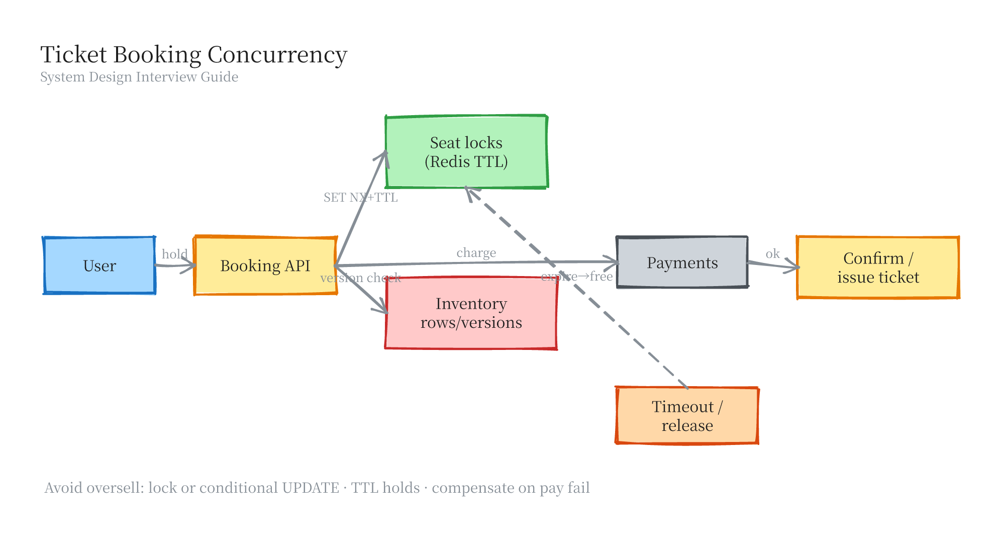

<sub>Editable source: [ticket-booking.excalidraw](diagrams/excalidraw/ticket-booking.excalidraw) (open at [excalidraw.com](https://excalidraw.com)). Legacy: `.drawio` under [`diagrams/`](diagrams/).</sub>


### 1. Clarify

- Reserved seats vs general admission?
- Hold duration?
- Payment provider external?
- Scalper abuse?

**Critical NFR:** **correctness under contention**—never sell same seat twice.

### 2. Capacity

Mostly read-heavy until on-sale. On-sale: 100K users; flash contention on hot seats/sections. Inventory relatively small vs social apps.

### 3. APIs

```
GET  /v1/events/{id}/seats
POST /v1/holds { event_id, seat_ids[] } → { hold_id, expires_at }
POST /v1/checkout { hold_id, payment_method }
POST /v1/webhooks/payment
```

### 4. Data model

```
events, seats(event_id, seat_id, status, version)
holds(hold_id, user_id, seats[], expires_at)
orders(order_id, status, payment_ref)
```

`status`: available | held | sold.

### 5. High-level design

```mermaid
flowchart LR
  Client --> API
  API --> Inventory
  Inventory --> DB[(SQL with row locks / conditional updates)]
  API --> Pay[Payment provider]
  Pay --> Webhook --> API
  API --> Ticket[Ticket issuer]
```

### 6. Deep dive — concurrency

**Hold:** transaction selecting seats `WHERE status='available' FOR UPDATE` (or `UPDATE ... WHERE version=V`) → set held + expiry. If conflict, fail hold.

**Expiry:** TTL job or delayed queue releases holds atomically if still held by same hold_id.

**Checkout:** confirm payment intent → mark sold only after payment success (or auth hold). Idempotency keys on checkout.

**GA inventory:** counter with conditional decrement `WHERE remaining >= n`.

### 7. Failures

- Payment success / order fail: webhook reconciliation job; issue ticket or refund.
- Thundering herd on-sale: queue waiting room; sectional sharding; cache seat maps read-only; serialize writes per seat section.
- Clock skew on expiry: use DB time.

### 8. Interview tips

- Correctness > microservices fashion.
- Waiting room is a valid scale tactic.
- Spell out idempotent payment + seat state machine.

### Seat map reads vs writes

Seat maps are read-cached aggressively; writes go through inventory service with strict concurrency. Cache invalidation on hold/sale (or short TTL during on-sale).

### Waiting room

Admit users with tokens at controlled rate when on-sale begins. Token carries event_id and expiry; booking API rejects without token. Absorbs bot storms.

### Payment + ticket issue

After PSP success: create order, mark seats sold, enqueue ticket PDF/QR email. Reconciliation scans `payment_succeeded AND order_missing`.

### Anti-scalping (light)

Purchase limits per user/payment instrument; queue fairness; CAPTCHA at admit time—mention without claiming perfect solution.

### Evolution

Resale marketplace with transfer of ownership; dynamic pricing—both need stronger audit trails.

### Interviewer Q&A (drill these aloud)

**Q: What is the consistency model for the core read?**  
A: State it explicitly (e.g. “redirects may see new links within TTL seconds; creates read-your-writes via primary”).

**Q: Single point of failure?**  
A: Name primary DB / broker / region; give mitigation (replicas, multi-AZ, queue buffer).

**Q: How do you prevent duplicate side effects on retry?**  
A: Idempotency keys / upserts / dedupe table—tie to this design’s writes.

**Q: What metric pages you at 3am?**  
A: Pick SLIs: error rate, p99, lag, saturation—not CPU alone.

**Q: How does this evolve to 10× data?**  
A: Partition key, storage tiering, or CQRS—one concrete next step.

### Implementation sketch (pseudocode mindset)

Walk one write handler: validate → authorize → mutate store → enqueue side effects → return. Mention timeouts on dependency calls. This bridges design and coding rounds.

### Load & chaos test plan (talk track)

1. Happy-path load at 2× peak estimate  
2. Dependency latency injection (+500 ms)  
3. Kill one AZ of the data store  
4. Replay poison message  
State what user experience should be in each case.

### Whiteboard chronological script

1. Clarify seat map, hold TTL, payment.
2. Draw similar to checkout: hold seat → pay → confirm.
3. Strong consistency on seat inventory.

### Interviewer probes (realistic Q&A)

**Interviewer:** Double booking?  
**You:** Conditional seat state transition (available→held→sold) with version/TTL; never two sold.

**Interviewer:** Flash on sale?  
**You:** Queue, shard by event_id, wait-room.

## Payments

Move money (or ledger entries) between parties with idempotency, webhooks, and auditability—marketplace or merchant payments.

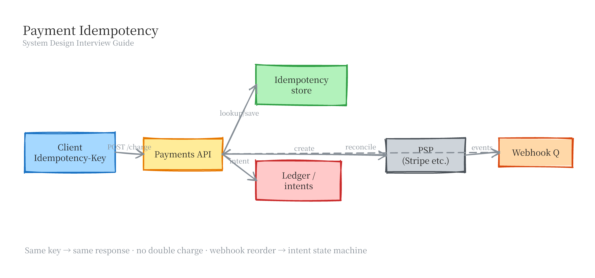

<sub>Editable source: [payments.excalidraw](diagrams/excalidraw/payments.excalidraw) (open at [excalidraw.com](https://excalidraw.com)). Legacy: `.drawio` under [`diagrams/`](diagrams/).</sub>


### 1. Clarify

- Card processing via PSP (Stripe-like) or in-house?
- Wallets / P2P?
- Multi-currency?
- Who is merchant of record?
- Disputes / chargebacks in scope?

**Assume:** app is merchant; card data vaulted at PSP; you own **ledger** and order state.

### 2. Capacity

Throughput often modest vs social (hundreds–thousands TPS) but **correctness and audit** dominate. Spikes on flash sales.

### 3. APIs

```
POST /v1/payments
  { "idempotency_key", "amount", "currency", "customer", "order_id" }
  → { "payment_id", "status": "pending|succeeded|failed" }

GET  /v1/payments/{id}
POST /v1/webhooks/psp
POST /v1/refunds { payment_id, amount }
```

### 4. Data model

```
payments(id, idempotency_key UNIQUE, amount, currency, status, psp_ref)
ledger_entries(id, account_id, amount, payment_id, created_at)
accounts(id, balance_cached, currency)
webhooks_received(id, payload_hash)  -- dedupe
```

Double-entry ledger: every movement has balanced debit/credit.

### 5. High-level design

```mermaid
flowchart TB
  Client --> PayAPI
  PayAPI --> DB[(Payments DB + ledger)]
  PayAPI --> PSP[Payment service provider]
  PSP --> WH[Webhook endpoint]
  WH --> DB
  PayAPI --> Outbox --> Bus[Events]
  Bus --> OrderSvc
  Bus --> Notify
```

### 6. Deep dive — idempotency & webhooks

Client retries with same `idempotency_key` → return same payment record; never create second charge.

**Flow:** create local payment `pending` → call PSP with key → mark `succeeded/failed` from response **or** webhook (whichever first) using state machine transitions. Store PSP id.

**Ledger:** append-only entries; balances derived or maintained with transactional updates. Never delete history.

**Outbox:** commit payment state + outbox row together; publisher emits `payment.succeeded` for order fulfillment—avoids dual-write bugs.

### 7. Failures

- PSP timeout: leave pending; reconcile via PSP get-or-webhook; do not assume fail.
- Duplicate webhooks: dedupe by event id.
- Partial refunds: new ledger entries; status `partially_refunded`.
- Replay attacks: verify webhook signatures.

### 8. Interview tips

- Lead with idempotency keys and ledger, not crypto buzzwords.
- Explicit state machine for payment status.
- Say “PCI: we don’t store raw PANs; PSP tokens only.”

### State machine

`created → pending → succeeded | failed | canceled` with `refunded` / `partially_refunded` side states. Illegal transitions throw and alert.

### Double-entry example

Charge $10: debit `psp_clearing` 10, credit `merchant_payable` 10 (simplified). Refund reverses with new entries—never edit old ones.

### Webhook authenticity

Verify HMAC signature + timestamp skew window; store event_id uniqueness. Process asynchronously to keep endpoint fast.

### Reconciliation

Daily job compares PSP settlement reports vs ledger; open tickets on drift. Interviewers love hearing this operational loop.

### Evolution

Multi-PSP failover, stored-credential CIT/MIT rules, marketplace split payouts—each builds on the same ledger primitives.

### Interviewer Q&A (drill these aloud)

**Q: What is the consistency model for the core read?**  
A: State it explicitly (e.g. “redirects may see new links within TTL seconds; creates read-your-writes via primary”).

**Q: Single point of failure?**  
A: Name primary DB / broker / region; give mitigation (replicas, multi-AZ, queue buffer).

**Q: How do you prevent duplicate side effects on retry?**  
A: Idempotency keys / upserts / dedupe table—tie to this design’s writes.

**Q: What metric pages you at 3am?**  
A: Pick SLIs: error rate, p99, lag, saturation—not CPU alone.

**Q: How does this evolve to 10× data?**  
A: Partition key, storage tiering, or CQRS—one concrete next step.

### Implementation sketch (pseudocode mindset)

Walk one write handler: validate → authorize → mutate store → enqueue side effects → return. Mention timeouts on dependency calls. This bridges design and coding rounds.

### Load & chaos test plan (talk track)

1. Happy-path load at 2× peak estimate  
2. Dependency latency injection (+500 ms)  
3. Kill one AZ of the data store  
4. Replay poison message  
State what user experience should be in each case.

### Whiteboard chronological script

1. Clarify PSP vs wallet; currencies; idempotency expectations.
2. Write NFRs: no double-charge; durable ledger; webhook retries.
3. Draw Client → API → Payment intent service → Ledger DB; outbox → PSP.
4. Draw webhook receiver → verify signature → state machine advance.
5. Mention tokenization — never store raw PAN.
6. Leave FX/multi-currency as a side note unless asked.

### Interviewer probes (realistic Q&A)

**Interviewer:** Exactly-once money movement?  
**You:** Exactly-once *effects* via idempotent payment intents and an append-only ledger; at-least-once retries to the PSP with the same idempotency key.

**Interviewer:** Consistency model?  
**You:** Strong append for ledger entries; eventual for notifications and analytics.

**Interviewer:** PSP timeout after charge unknown?  
**You:** Leave intent in `pending`; reconcile via PSP retrieve API; never create a second charge without the same idempotency key.

**Interviewer:** 10× volume?  
**You:** Partition ledger by account/time; scale webhook workers; keep PSP as external bottleneck with circuit breakers and bulkheads.


## Nearby places (Yelp-like)

**In plain English:** "Show restaurants near me" sounds simple until you have millions of places and need fast geo queries. The design centers on indexing locations so "within this map box" is cheap.

> **Key takeaway:** Use a geo index (geohash / quadtree / DB geo types); cache popular areas; keep ranking separate from the spatial lookup.

Geospatial search: find businesses near a lat/lng, filter by category, sort by distance/rating. Interviewers probe geo indexes, hot downtown tiles, and ranking.

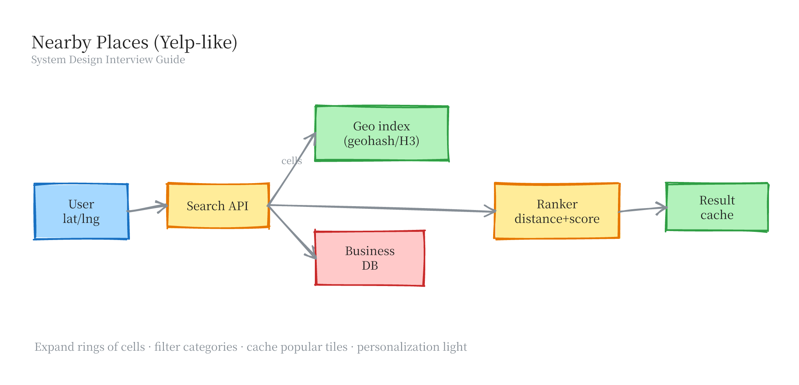

<sub>Editable source: [nearby-places.excalidraw](diagrams/excalidraw/nearby-places.excalidraw) (open at [excalidraw.com](https://excalidraw.com)). Legacy: `.drawio` under [`diagrams/`](diagrams/).</sub>

### 1. Clarify questions a strong candidate asks first

- Radius search only, or also map viewport (bounding box)?
- Filters: open now, category, price, rating floor?
- Personalization / ads in scope?
- Write path: user reviews & photos, or read-only catalog MVP?
- Freshness: how fast must a new business appear in search?
- Target QPS for search vs detail page?

**MVP assume:** radius + category + sort by distance then rating; reviews eventually consistent; no ads.

### 2. Capacity estimates

Assume 50M businesses globally, 10M DAU, 20 searches/user/day → 200M searches/day ≈ **2.3K QPS avg**, peak **15–25K**.

- Metadata ~2 KB/business → ~100 GB (+ replicas)
- Geo index overhead similar order
- Review writes much lower QPS than searches

### 3. APIs + data model

```
GET /v1/search?lat=&lng=&radius_m=&category=&sort=&cursor=
  → { results: [{biz_id, name, dist_m, rating, price}], next_cursor }

GET /v1/businesses/{id}
POST /v1/businesses/{id}/reviews  (auth)
```

```
businesses(biz_id PK, name, lat, lng, category, price, rating_avg, ... )
geo_index: S2 cell / geohash → [biz_ids]  OR Elasticsearch geo_point
reviews(review_id, biz_id, user_id, stars, text, created_at)
```

### 4. High-level architecture

```mermaid
flowchart LR
  Client --> LB --> API
  API --> Geo[Geo index]
  API --> Biz[(Business DB)]
  API --> Cache[(Result cache)]
  API --> Rank[Ranker]
```

**Search path:** map lat/lng+radius → covering geo cells → candidate IDs → fetch metadata → rank/filter → paginate.

### 5. Whiteboard chronological script

1. Write title + NFRs (search latency p99 < 200 ms).
2. Ask geo questions aloud; lock MVP.
3. Write capacity (QPS, 50M biz).
4. Draw Client → LB → Search API (left→right).
5. Add **Geo index** and **Business DB**; say “candidates then hydrate.”
6. Add **cache** for popular downtown queries; leave blank for personalization.
7. Deep dive: S2/geohash cells, hotspot tiles, ranking.
8. Failures: geo node down → degrade radius / serve stale cache.

### 6. Interviewer probes

**Interviewer:** Why not `SELECT * WHERE distance < R` on Postgres alone?  
**You:** Fine at small scale; at global catalog + high QPS you want a geo index (GiST/S2/ES). Postgres + PostGIS can work regionally with careful sharding.

**Interviewer:** How do geohashes/S2 help?  
**You:** Quantize the map into cells; query = union of cells covering the radius; then precise haversine filter.

**Interviewer:** Downtown SF is hot.  
**You:** Cache top queries; shard geo by cell ranges; replicate hot cells; avoid single hot partition.

**Interviewer:** Consistency for new business listing?  
**You:** Accept seconds–minutes lag indexing to search; admin “publish” can wait on index ack if needed.

**Interviewer:** 10× search QPS.  
**You:** Cache, read replicas, partition geo index, CDN for static detail assets — not one bigger box.

### Deep dive — ranking sketch

`score = w1 * dist_decay + w2 * rating + w3 * popularity` with category filters. Keep ML light unless senior prompt expands.

### Evolution

Add autocomplete (typeahead), spell correction, personalized rerank, ads auction as separate systems.

---

## Group chat (Slack / Discord-like)

Channels, servers/workspaces, fan-out to many members, presence, roles. Harder than 1:1 chat because of **membership cardinality** and **hot channels**.

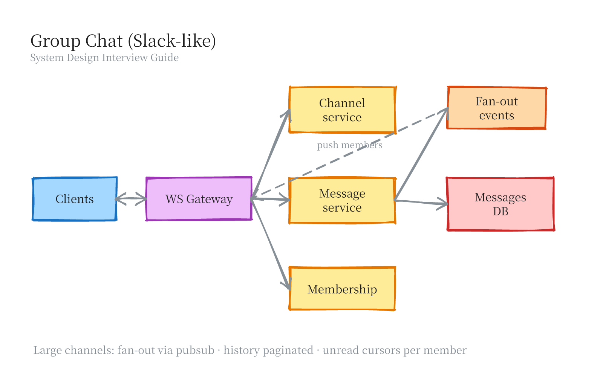

<sub>Editable source: [group-chat.excalidraw](diagrams/excalidraw/group-chat.excalidraw) (open at [excalidraw.com](https://excalidraw.com)). Legacy: `.drawio` under [`diagrams/`](diagrams/).</sub>

### 1. Clarify questions

- Workspace → channels → threads? Voice/video in scope?
- Max channel size (100 vs 100k)?
- History retention / search?
- Mentions, reactions, edits, deletes?
- Guests / RBAC?
- Mobile push when offline?

**MVP:** text channels, membership, history pagination, presence approximate, push offline.

### 2. Capacity estimates

10M DAU; avg 50 messages/user/day → 500M msg/day ≈ **6K QPS** writes; reads/fan-out much higher in concurrent online users. Peak evenings 5–10×. Store: 1 KB/msg → ~500 GB/day before compression/compaction — plan retention tiers.

### 3. APIs + data model

```
POST /v1/channels/{id}/messages  { text, nonce }
GET  /v1/channels/{id}/messages?before=&limit=
WS   /v1/gateway  (connect, subscribe channels, presence)
POST /v1/channels/{id}/memberships
```

```
workspaces(ws_id, ...)
channels(channel_id, ws_id, name, type)
memberships(channel_id, user_id, role)
messages(channel_id, msg_id, sender, text, ts)  -- PK (channel_id, msg_id)
```

Message IDs: Snowflake for rough time order.

### 4. High-level architecture

```mermaid
flowchart LR
  Clients --> WSG[WS Gateway fleet]
  WSG --> Msg[Message service]
  WSG --> Chan[Channel service]
  Msg --> Store[(Msg store)]
  Msg --> Bus[Kafka fan-out]
  Bus --> WSG
  WSG --> Pres[Presence]
```

**Send:** client → gateway → message service persists → publish to channel topic → gateways with local subscribers push.

### 5. Whiteboard chronological script

1. Clarify channel size & MVP; write NFRs (delivery at-least-once to online; history durable).
2. Capacity rough order.
3. Draw **WS gateway fleet** first (connection plane).
4. Draw message service + **append-only store keyed by channel_id**.
5. Draw Kafka/pubsub fan-out back to gateways.
6. Add membership/authz check on send.
7. Leave search/indexing blank; add presence as ephemeral store.
8. Probe hot channel (#announcements) mitigation.

### 6. Interviewer probes

**Interviewer:** Fan-out to 100k members?  
**You:** Don’t open 100k writes on send. Persist once; push only to **currently connected** subscribers via pub/sub. Offline users get history on read + push notification coalescing.

**Interviewer:** Ordering?  
**You:** Per-channel ordering via single partition keyed by channel_id; client uses msg_id/timestamps; optimistic UI with nonce dedupe.

**Interviewer:** Celebrity / company-all channel?  
**You:** Treat as broadcast channel: pull model for history, sample presence, rate-limit sends, dedicated partitions.

**Interviewer:** DB choice?  
**You:** Cassandra/Dynamo/Scylla for append-heavy messages by (channel_id, msg_id); Postgres for workspace metadata/membership.

**Interviewer:** Consistency of edits/deletes?  
**You:** Tombstones / edit events in stream; clients apply; search index eventual.

### Failures

Gateway death: clients reconnect, resume with `last_msg_id`. Kafka lag: delay in live push; history still correct. Authz misconfig: IDOR — always check membership server-side.

---

## Collaborative document

Google-Docs-like concurrent editing. Focus on **conflict strategy** (OT vs CRDT) at high level, presence/cursors, snapshots + op log — not implementing the algebra.

**Diagram:** [diagrams/collab-doc.drawio](diagrams/collab-doc.drawio)

### 1. Clarify questions

- Plain text, rich text, or spreadsheets (much harder)?
- Max concurrent editors per doc?
- Offline editing required?
- Comments / suggestions mode?
- Export versions / audit?
- Scale: docs count vs concurrent sessions?

**MVP:** rich text, <50 concurrent editors, online-first with reconnect catch-up, periodic snapshots.

### 2. Capacity estimates

50M docs, 1M concurrently open, avg 2 editors → **2M WS connections** (gateway-bound). Ops/sec per doc low (typing bursts); overall op QPS maybe tens of thousands. Snapshots every N ops or T seconds.

### 3. APIs + data model

```
WS /v1/docs/{doc_id}/session
  → client sends ops; server broadcasts transformed ops / CRDT updates
GET /v1/docs/{doc_id}  → latest snapshot + version
POST /v1/docs/{doc_id}/snapshots  (internal)
```

```
docs(doc_id, title, owner, ...)
snapshots(doc_id, version, blob_ref)
op_log(doc_id, seq, op_payload, author)  -- or CRDT state blobs
acl(doc_id, user_id, role)
```

### 4. High-level architecture

```mermaid
flowchart LR
  Editors --> GW[Collab gateway]
  GW --> Eng[OT or CRDT engine]
  Eng --> Snap[(Snapshots)]
  Eng --> Log[(Op log)]
  GW --> Presence
```

Sticky session or doc_id → responsible server for OT; CRDTs allow freer multi-master with merge.

### 5. Whiteboard chronological script

1. Clarify: doc type, concurrency, offline.
2. Say: “I’ll pick **CRDT** for offline-friendly merge **or OT** with a central sequencer — I’ll explain tradeoffs.”
3. Draw editors → WS gateway → collab engine.
4. Add snapshot store + op log; presence box.
5. Explain reconnect: client sends `last_version`; server sends missing ops / state.
6. Leave ML/grammar blank; discuss ACL.
7. Failure: engine node loss → reattach doc lease to another node.

### 6. Interviewer probes

**Interviewer:** OT vs CRDT?  
**You:** OT transforms ops against concurrent ops; typically needs central ordering. CRDTs merge commutative state; better offline; larger payloads / more complex data structures. Pick one; don’t invent hybrid mid-board.

**Interviewer:** Why snapshots?  
**You:** Don’t replay million ops on open; compact log; faster load.

**Interviewer:** Conflict “last write wins”?  
**You:** Insufficient for text — characters interleave wrongly. Need OT/CRDT.

**Interviewer:** 10× concurrent editors on one doc?  
**You:** Rare; shard by doc already. Optimize broadcast (binary ops), batching, and maybe interest management for cursors.

**Interviewer:** Consistency?  
**You:** Strong causal/convergent session state for a doc; metadata ACLs on primary DB.

### Interview tip

Senior signal: “GC of tombstones in CRDTs,” “doc lease,” “schema for op versioning.” Keep algebra off the board unless they are specialists.

---

## E-commerce checkout and inventory

Cart → reserve inventory → payment → order. Classic consistency + idempotency + oversell prevention.

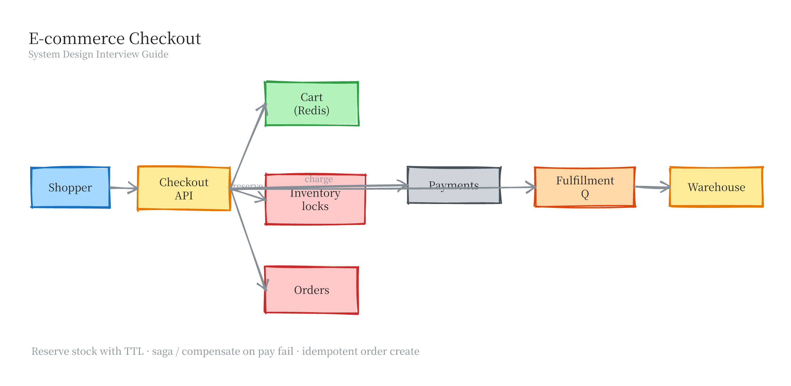

<sub>Editable source: [ecommerce-checkout.excalidraw](diagrams/excalidraw/ecommerce-checkout.excalidraw) (open at [excalidraw.com](https://excalidraw.com)). Legacy: `.drawio` under [`diagrams/`](diagrams/).</sub>

### 1. Clarify questions

- Single warehouse or multi-warehouse / omnichannel?
- Guest checkout?
- Flash sales / limited drops?
- Partial capture / auth-capture payments?
- International tax/shipping in scope?
- Idempotency & exactly-once payment effects?

**MVP:** one inventory pool, card pay via PSP, soft reservation with TTL, no marketplace multi-seller.

### 2. Capacity estimates

5M DAU; 2% convert → 100K orders/day ≈ **1.2 QPS avg**, peak **50–200 QPS** (promos). Inventory reads/checks much hotter during browse. Data: orders small; inventory counters hot.

### 3. APIs + data model

```
POST /v1/carts/{id}/items
POST /v1/checkout/sessions  { cart_id, idempotency_key }
POST /v1/checkout/sessions/{id}/confirm
GET  /v1/orders/{id}
```

```
inventory(sku, warehouse_id, on_hand, reserved)
reservations(res_id, sku, qty, expires_at, state)
orders(order_id, user_id, state, amount, idempotency_key UNIQUE)
order_items(...)
payments(payment_id, order_id, psp_ref, state)
```

### 4. High-level architecture

```mermaid
flowchart LR
  Buyer --> Cart --> Inv[Inventory]
  Cart --> Ord[Order service]
  Ord --> Pay[Payments / PSP]
  Ord --> Q[Fulfillment queue]
  Inv --> Res[(Reservations TTL)]
```

**Flow:** validate cart → **reserve** stock (TTL 10–15 min) → create order pending → charge PSP with idempotency key → mark paid → commit reservation → enqueue fulfillment. On fail/expiry: release reservation.

### 5. Whiteboard chronological script

1. Clarify flash sale + warehouse; write “no oversell” NFR.
2. Capacity — note browse ≫ order QPS.
3. Draw Cart → Inventory → Order → Payment.
4. Add **reservation TTL** explicitly; say why not decrement final stock on add-to-cart.
5. Add idempotency key on charge; payment state machine.
6. Async fulfillment queue; leave returns blank.
7. Deep dive flash sale: gate with queue, shuffle shards, cache product page.

### 6. Interviewer probes

**Interviewer:** How do you prevent oversell?  
**You:** Atomic reservation (DB transaction or Redis Lua/INCR with bounds) with TTL; commit on paid; release on expiry/cancel. Check `reserved + sold <= on_hand`.

**Interviewer:** Payment succeeds, DB crash before order paid?  
**You:** Idempotent confirm job reconciles with PSP using idempotency key / payment intent id; order state machine is source for fulfillment eligibility.

**Interviewer:** DB choice?  
**You:** Relational for orders/inventory transactions; Redis for hot reservation counters during flash sales with durable backup.

**Interviewer:** Celebrity drop 10×?  
**You:** Waiting room queue; per-SKU rate limits; pre-split inventory shards; read-only catalog cache; degrade non-critical recommendations.

**Interviewer:** Consistency?  
**You:** Strong for inventory reservation and payment state; eventual for email/recommendations.

### Failure modes

Double charge without idempotency; reservation leak (TTL worker down); stock desync between Redis and DB — periodic reconcile.

---

## Recommendation and feed ranking (senior sketch)

Not a full ML course — an **architecture sketch** for candidate generation → rank → filter → serve, with online/offline features. Use when interviewers push past basic news-feed fan-out.

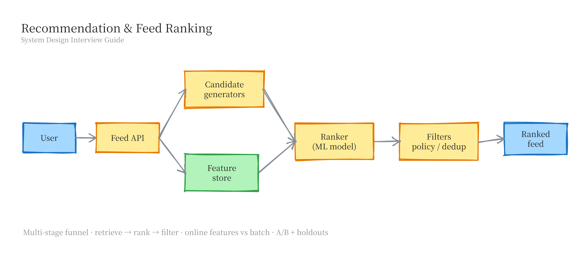

<sub>Editable source: [recommendation-feed.excalidraw](diagrams/excalidraw/recommendation-feed.excalidraw) (open at [excalidraw.com](https://excalidraw.com)). Legacy: `.drawio` under [`diagrams/`](diagrams/).</sub>

### 1. Clarify questions

- Goal metric: dwell, CTR, watch time, revenue?
- Cold start users/items?
- Inventory: posts, videos, products?
- Latency budget for feed request?
- Explainability / safety filters required?
- Real-time personalization vs daily batch?

**MVP:** home feed ranking over existing candidate sources; safety filters; p99 < 150 ms for rank path.

### 2. Capacity estimates

20M DAU; 30 feed opens/day → 600M requests/day ≈ **7K QPS**, peak **40K**. Candidate sets ~1000 → rank → return 20. Feature store reads dominate cost.

### 3. APIs + data model

```
GET /v1/feed?cursor=  → ranked item ids + decorators
POST /v1/events  { impress / click / dismiss }  (client telemetry)
```

```
items(item_id, author_id, features...)
user_features(user_id, ...)  -- batch + nearline
engagement_events(... partitioned by time)
models(model_id, version, artifact_uri)
```

### 4. High-level architecture

```mermaid
flowchart TB
  Client --> API
  API --> CG[Candidate generation]
  API --> Rank[Ranker]
  API --> Filter[Filters]
  CG --> FS[(Feature store)]
  Rank --> FS
  Events --> Near[Nearline joins]
  Near --> FS
  Batch[Batch training] --> Model[Model registry]
  Model --> Rank
```

**Stages:** (1) retrieve candidates from multiple sources (following, trending, similarity), (2) feature hydrate, (3) score, (4) filter seen/blocked/policy, (5) diversity re-rank.

### 5. Whiteboard chronological script

1. Clarify objective metric & latency.
2. Draw **pipeline stages** left→right: retrieve → rank → filter → decorate — before naming TensorFlow.
3. Add feature store + event pipeline (online vs batch).
4. Say: “I’ll keep model training offline; inference in rank service.”
5. Blank space for ads auction if asked.
6. Discuss celebrity/hot items separately from personalization.
7. Failure: ranker down → fallback to chronological / heuristic.

### 6. Interviewer probes

**Interviewer:** Where does ML run?  
**You:** Train offline; export model; rank service does inference. Nearline features from events within minutes.

**Interviewer:** Cold start?  
**You:** Popular / editorial candidates; content features; explore slot in diversity layer.

**Interviewer:** Consistency?  
**You:** Feed ranking is approximate; don’t promise transactional ranking. Eventual feature freshness.

**Interviewer:** 10× QPS?  
**You:** Cache candidate sets per user segment; ANN indexes for similarity; scale rankers horizontally; aggressive timeouts + fallback.

**Interviewer:** Why not rank the entire corpus?  
**You:** Impossible at ms budgets — **multi-stage retrieval** is the point.

### Interview tip

Senior bar: name **candidate generation**, **feature freshness**, **fallback**, **evaluation** (A/B, offline AUC) without claiming fake precision.

### Self-check (design)

1. Why multi-stage retrieval?
2. What fails open when the ranker times out?
3. Online vs batch features — one example each?

---

# Practice

## Timed drill

Practice under the clock. Untimed studying builds knowledge; timed drills build interview performance.

### Setup

- Timer visible (phone is fine)
- Blank paper or Excalidraw
- One prompt from [practice prompts](#practice-prompts)
- No notes for the first attempt of a prompt
- Optional: record audio for self-review

### Drill lengths

| Mode | Time | Use |
|------|------|-----|
| Sprint | 25 min | Clarify + HLD only |
| Standard | 45 min | Full template |
| Senior | 60 min | Full + two deep dives |

### 45-minute script

| Min | Step |
|-----|------|
| 0–6 | Clarify + restate |
| 6–10 | Estimates |
| 10–15 | API + data model |
| 15–28 | HLD write+read paths |
| 28–40 | Deep dive |
| 40–45 | Failures + summary |

If behind at minute 20 with no diagram, cut estimate polish and draw.

### Rules that build discipline

1. Speak aloud even alone—silence hides confusion.
2. Write assumptions; do not keep them in your head.
3. Cross off template steps on the margin.
4. Stop when timer ends; photograph the board; score with the [mock rubric](#mock-rubric).
5. Re-drill the same prompt after ≥48 hours if score < 7/10.

### Pair drill

- Partner A designs 40 min; B plays interviewer with prepared interruptions.
- Swap.
- Feedback only against rubric categories—not vibes.

### Interruption bank (for partners)

- “Reads must be strongly consistent—how does that change things?”
- “Traffic just hit 20×—what breaks first?”
- “We cannot use Redis—alternative?”
- “CEO wants multi-region next quarter—sketch evolution.”
- “That service is down—user experience?”

### Anti-drills (avoid)

- Reading a solution then immediately “practicing” it from memory the same hour (tests short-term memory, not skill).
- Spending 20 minutes picking the perfect prompt.
- Drilling only URL shortener forever.

### Weekly target

- 3× 45-min drills
- 1× 25-min sprint on a weak foundation topic applied (e.g. “rate limit this API”)
- 1× rubric-scored mock

### Interview tip

In a real interview, glance at the clock at minutes 15 and 30. Self-pacing is a senior signal.

## Practice prompts

Twenty-four prompts with hint checklists. Attempt **before** expanding hints. Use the [design template](#design-template).

---

#### 1. URL shortener for an enterprise with SSO
**Hints:** custom domains, authz on create, audit logs, no public enumeration, 301 vs 302.

#### 2. Pastebin / snippet store
**Hints:** TTL expiry job, size limits, raw vs rendered, abuse scanning, CDN for public pastes.

#### 3. Global rate limiter as a platform service
**Hints:** multi-tenant quotas, Redis cluster, fail-open policy, local approximation, 429 semantics.

#### 4. Email + push notification center
**Hints:** preferences, quiet hours, template service, per-channel queues, OTP vs marketing split.

#### 5. News feed with ads injection
**Hints:** hybrid fan-out, ranking candidates, ad service latency budget, privacy, degradation without ads.

#### 6. Group chat for 10–10,000 members
**Hints:** connection gateways, fan-out strategy change by size, history shard by conv_id, reconnect backfill.

#### 7. Collaborative document cursors (not full OT/CRDT)
**Hints:** WebSocket presence, pub/sub rooms, ephemeral state, scale by doc_id, privacy of cursor data.

#### 8. Photo sharing MVP
**Hints:** signed uploads, async variants, feed vs profile grid, CDN, EXIF stripping.

#### 9. Short-video product (TikTok-like For You)
**Hints:** upload/transcode, CDN, recommendation candidate generation (high level), scroll QPS, hot videos.

#### 10. Ride matching in one city
**Hints:** location firehose, geo index, offer/accept locking, ETA vs distance, surge as NFR only.

#### 11. Food delivery tracking
**Hints:** courier locations, order state machine, push updates, map provider dependency, restaurant prep time.

#### 12. Dropbox-like selective sync
**Hints:** block dedupe, metadata revisions, conflict copies, change cursor, namespace sharding.

#### 13. YouTube-like VOD
**Hints:** ABR manifests, transcode fleet, CDN egress cost, copyright ID async, progressive ready state.

#### 14. Live streaming fan-out
**Hints:** ingest server, segmenter, edge relay, latency vs quality, chat sidecar, spike joins.

#### 15. Web crawler for product prices
**Hints:** politeness, robots, frontier priority, anti-bot, change detection, legal constraints mention.

#### 16. Autocomplete for marketplace products
**Hints:** prefix trie, inventory filters, personalization re-rank, edge cache, index freshness.

#### 17. Site search for docs / help center
**Hints:** inverted index, CDC from CMS, BM25, synonyms, permission-filtered results.

#### 18. Hotel booking
**Hints:** room inventory holds, date-range contention, payment webhook, overbooking policy, search vs book path.

#### 19. Concert ticket on-sale
**Hints:** waiting room queue, seat locks, section sharding, bot mitigation, idempotent checkout.

#### 20. Merchant payments + payouts
**Hints:** idempotency keys, ledger, PSP webhooks, payout batching, chargeback state machine.

#### 21. URL fetching preview (link unfurl)
**Hints:** SSRF defenses, timeout budgets, cache previews, size limits, private network blocks.

#### 22. Feature flag service
**Hints:** low-latency reads, sticky bucketing, CDN/edge eval, audit changes, fail behavior.

#### 23. Metrics ingestion & dashboard
**Hints:** write-heavy TSDB, downsampling, cardinality explosion, query path vs ingest path.

#### 24. Multi-tenant job scheduling SaaS
**Hints:** per-tenant fairness, exactly-once effects via ledger/outbox, worker fleets, poison jobs, cron semantics.

---

### How to use hints

1. Attempt 30–45 min with zero hints.
2. Reveal hints; gap-analyze.
3. Redraw once incorporating missed items.
4. Log score in your tracker.

### Stretch modifiers (apply to any prompt)

- “Single region only” vs “active-active two regions”
- “Strongly consistent reads”
- “Budget cut 50%—what do you drop?”
- “Compliance: data must stay in EU”

## Self-review

After each drill, review within 15 minutes while memory is fresh. Honest review beats another unreviewed mock.

### Immediate capture

Photograph/board export. Note:

- Where you hesitated
- Hints the “interviewer” (you) needed
- Any buzzword you could not justify

### Rubric pass

Score yourself with the [mock rubric](#mock-rubric). Resist inflating. If unsure, mark the lower score.

### Content gaps vs delivery gaps

| Content gap | Delivery gap |
|-------------|--------------|
| Didn’t know quorum | Knew it but never said it |
| Wrong shard key | Good design, ran out of time |
| Missed idempotency | Monologued past clarifying Qs |

Study differently: content → foundations pages; delivery → more timed drills and partner interrupts.

### Redraw protocol

From blank: redraw the HLD in 8 minutes. If you cannot, the design was not yet yours.

### Question yourself

1. Did I restate requirements?
2. Did I walk write and read paths?
3. Did I name one explicit tradeoff with a pick?
4. Did I mention a failure mode with user impact?
5. Would a teammate implement from my data model?

### Weekly retrospective

- Top 3 recurring weaknesses
- One foundation page to reread
- One design to re-drill
- Celebrate one improvement (pacing, clearer APIs, etc.)

### Interview tip

Keep a “miss list” flashcard of phrases you forget under stress: *idempotency key*, *signed URL*, *hybrid fan-out*, *fail-open*.

## Mock rubric

Score each category **0–2**. Total **/10**. Target ≥7 before real loops; ≥8 consistently for senior aims.

### Categories

#### 1. Clarification & scope (0–2)

- **0:** Jumps into tech; wrong problem risk
- **1:** Some questions; fuzzy NFRs
- **2:** Crisp functional/NFR/out-of-scope; restates problem

#### 2. Capacity sense (0–2)

- **0:** None or nonsensical
- **1:** Partial; no implications
- **2:** Order-of-magnitude with design implications (“so single DB OK” / “need shard”)

#### 3. API & data model (0–2)

- **0:** Missing
- **1:** Vague entities
- **2:** Concrete endpoints + keys/indexes/shard key aligned to queries

#### 4. High-level design (0–2)

- **0:** Incoherent boxes
- **1:** Plausible but missing path
- **2:** Clear write/read paths; appropriate building blocks; readable diagram

#### 5. Depth & tradeoffs (0–2)

- **0:** Buzzwords only
- **1:** One shallow dive
- **2:** Real alternative comparison; justified pick; failure/scale included

### Intermediate half-points

Use 0.5 steps if needed; avoid all 2s without evidence.

### Mapping to levels (rough)

| Total | Signal |
|-------|--------|
| 0–3 | Needs foundations |
| 4–6 | Junior approaching mid |
| 7–8 | Solid mid |
| 9–10 | Senior-ready *on that prompt* |

One prompt is not a level—look at median across 5 diverse prompts.

### Feedback script for partners

1. Start with one strength.
2. Name top two rubric gaps with examples from the board.
3. Ask candidate to re-explain the weak part in 3 minutes.
4. Do not redesign for them—coach with questions.

### Score sheet template

```
Prompt:
Date:
Clarification: /2
Capacity: /2
API/Data: /2
HLD: /2
Depth: /2
Total: /10
Notes:
Next drill:
```

### Interview tip

When practicing alone, narrate the rubric category you are satisfying (“this is my tradeoff sentence”)—it trains explicit signals interviewers listen for.


---


---

---

## Disclaimer

This guide teaches industry-standard concepts (load balancing, sharding, CAP, etc.) in original wording for interview practice. It is independent study material and is not affiliated with any commercial interview course.

