<div align="center">

# System Design — From Zero to Architect

**A free, visual guide to designing systems that scale — written for complete beginners, deep enough for senior interviews.**

Learn the building blocks, think like a solution architect, and walk through 25 real designs step by step — with 230+ diagrams.

[**Start reading →**](#chapter-00--start-here) · [Contents](#table-of-contents) · [Case studies](#chapter-08--case-studies) · [Cheat sheet](#-one-page-cheat-sheet) · [Practice](#chapter-09--practice)

</div>

---

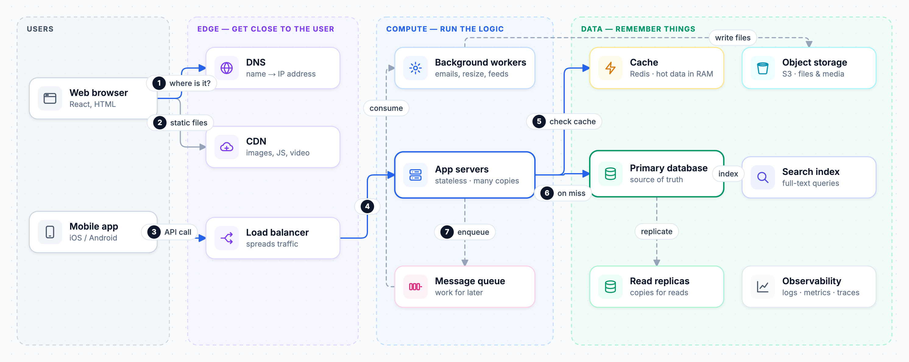

## 👋 Who this is for

| If you are… | This guide gives you… |
|-------------|-----------------------|
| **New to system design** | Plain-English explanations, a picture for every idea, and no assumed background beyond basic programming |
| **Preparing for interviews** | A repeatable 45-minute framework, 25 worked designs, a scoring rubric and practice prompts |
| **A developer growing into architecture** | The *why* behind each choice: trade-offs, costs, failure modes, and how systems evolve |

## 🧭 How every lesson teaches

Every lesson follows the same path, so you always know where you are:

1. **In one sentence** — what the thing is, in plain English.
2. **🧩 The problem** — what life looked like *before* it existed, with a red picture of what goes wrong.
3. **💡 The idea** — how it solves that problem, with a green picture of the fix.
4. **⚙️ How it works** — the details, step by step, with diagrams and tables.
5. **🏛️ Architect's lens** — the business side: cost, risk, and when *not* to use it.
6. **🎤 Say it in the interview** — one sentence you can use in an interview.
7. **❓ Questions & answers** — the follow-up questions people ask, answered.

---

## 🗺️ How to use this guide

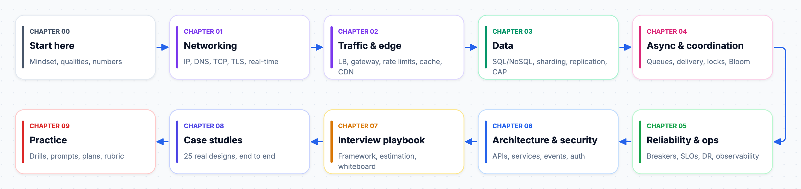

1. **Read Chapters 00–06 in order** the first time. Each one builds vocabulary for the next.
2. **Learn the method** in Chapter 07 — the same 7 steps work for every design question.
3. **Study the case studies.** Read the requirements, then **design it yourself for 25 minutes** before reading the solution.
4. **Practise under a timer** with the prompts and rubric in Chapter 09.

> [!TIP]
> **Short on time?** Read [0.3 The building blocks](#03-the-building-blocks), [Chapter 07](#chapter-07--interview-playbook), then the [URL shortener](#case-study-01--url-shortener) and [news feed](#case-study-04--news-feed) case studies. That's the minimum viable prep.

---

## Table of contents

- **[Chapter 00 · Start Here](#chapter-00--start-here)**
  - [0.1 What is system design?](#01-what-is-system-design)
  - [0.2 Think like an architect](#02-think-like-an-architect)
  - [0.3 The building blocks](#03-the-building-blocks)
  - [0.4 The life of a request](#04-the-life-of-a-request)
  - [0.5 How systems grow](#05-how-systems-grow)
  - [0.6 The seven qualities](#06-the-seven-qualities)
  - [0.7 Numbers every engineer should know](#07-numbers-every-engineer-should-know)
- **[Chapter 01 · Networking](#chapter-01--networking)**
  - [1.1 IP addresses](#11-ip-addresses)
  - [1.2 The OSI model](#12-the-osi-model)
  - [1.3 TCP and UDP](#13-tcp-and-udp)
  - [1.4 DNS](#14-dns)
  - [1.5 TLS and mTLS](#15-tls-and-mtls)
  - [1.6 Proxies](#16-proxies)
  - [1.7 Real-time communication](#17-real-time-communication)
- **[Chapter 02 · Traffic & Edge](#chapter-02--traffic--edge)**
  - [2.1 Load balancing](#21-load-balancing)
  - [2.2 Redundancy & clustering](#22-redundancy--clustering)
  - [2.3 API gateway](#23-api-gateway)
  - [2.4 Rate limiting](#24-rate-limiting)
  - [2.5 Caching](#25-caching)
  - [2.6 Cache policies & pitfalls](#26-cache-policies--pitfalls)
  - [2.7 CDN](#27-cdn)
- **[Chapter 03 · Data](#chapter-03--data)**
  - [3.1 Storage fundamentals](#31-storage-fundamentals)
  - [3.2 Choosing a database](#32-choosing-a-database)
  - [3.3 Normalization vs denormalization](#33-normalization-vs-denormalization)
  - [3.4 ACID and BASE](#34-acid-and-base)
  - [3.5 Transactions & isolation](#35-transactions--isolation)
  - [3.6 Distributed transactions](#36-distributed-transactions)
  - [3.7 Indexes](#37-indexes)
  - [3.8 Replication](#38-replication)
  - [3.9 Sharding](#39-sharding)
  - [3.10 Consistent hashing](#310-consistent-hashing)
  - [3.11 Federation](#311-federation)
  - [3.12 CAP & PACELC](#312-cap--pacelc)
  - [3.13 Geospatial indexes](#313-geospatial-indexes)
- **[Chapter 04 · Async & Coordination](#chapter-04--async--coordination)**
  - [4.1 Messaging](#41-messaging)
  - [4.2 Delivery guarantees & idempotency](#42-delivery-guarantees--idempotency)
  - [4.3 Coordination](#43-coordination)
  - [4.4 Bloom filters](#44-bloom-filters)
  - [4.5 Checksums & data integrity](#45-checksums--data-integrity)
  - [4.6 Distributed file systems](#46-distributed-file-systems)
  - [4.7 A note on the ESB](#47-a-note-on-the-esb)
- **[Chapter 05 · Reliability & Operations](#chapter-05--reliability--operations)**
  - [5.1 Timeouts, retries & backoff](#51-timeouts-retries--backoff)
  - [5.2 Circuit breakers & bulkheads](#52-circuit-breakers--bulkheads)
  - [5.3 SLI, SLO, SLA & error budgets](#53-sli-slo-sla--error-budgets)
  - [5.4 Observability](#54-observability)
  - [5.5 Disaster recovery](#55-disaster-recovery)
  - [5.6 Safe deployments](#56-safe-deployments)
- **[Chapter 06 · Architecture & Security](#chapter-06--architecture--security)**
  - [6.1 API styles & API design](#61-api-styles--api-design)
  - [6.2 N-tier architecture](#62-n-tier-architecture)
  - [6.3 Monolith vs microservices](#63-monolith-vs-microservices)
  - [6.4 Event-driven architecture](#64-event-driven-architecture)
  - [6.5 Event sourcing](#65-event-sourcing)
  - [6.6 CQRS](#66-cqrs)
  - [6.7 Service discovery](#67-service-discovery)
  - [6.8 VMs, containers & serverless](#68-vms-containers--serverless)
  - [6.9 Authentication: OAuth, OIDC & SSO](#69-authentication-oauth-oidc--sso)
  - [6.10 Security](#610-security)
- **[Chapter 07 · Interview Playbook](#chapter-07--interview-playbook)**
  - [7.1 How interviews work](#71-how-interviews-work)
  - [7.2 The framework](#72-the-framework)
  - [7.3 Clarify requirements](#73-clarify-requirements)
  - [7.4 Capacity estimation](#74-capacity-estimation)
  - [7.5 API & data model](#75-api--data-model)
  - [7.6 High-level design & the whiteboard](#76-high-level-design--the-whiteboard)
  - [7.7 Deep dives & failures](#77-deep-dives--failures)
  - [7.8 Trade-offs cheat sheet](#78-trade-offs-cheat-sheet)
  - [7.9 Common pitfalls](#79-common-pitfalls)
  - [7.10 Level expectations](#710-level-expectations)
  - [7.11 A full mock, start to finish](#711-a-full-mock-start-to-finish)
- **[Chapter 08 · Case Studies](#chapter-08--case-studies)**
  - [01 URL Shortener](#case-study-01--url-shortener) · [02 Rate Limiter](#case-study-02--rate-limiter) · [03 Notification System](#case-study-03--notification-system) · [04 News Feed](#case-study-04--news-feed) · [05 Chat App](#case-study-05--chat-app) · [06 Photo Sharing](#case-study-06--photo-sharing) · [07 Ride Sharing](#case-study-07--ride-sharing) · [08 Video Streaming](#case-study-08--video-streaming) · [09 File Sync](#case-study-09--file-sync) · [10 Web Crawler](#case-study-10--web-crawler) · [11 Typeahead](#case-study-11--typeahead) · [12 Search Engine](#case-study-12--search-engine) · [13 Ticket Booking](#case-study-13--ticket-booking) · [14 Payments](#case-study-14--payments) · [15 Nearby Places](#case-study-15--nearby-places) · [16 Group Chat](#case-study-16--group-chat) · [17 Collaborative Editor](#case-study-17--collaborative-editor) · [18 E-commerce Checkout](#case-study-18--e-commerce-checkout) · [19 Recommendations](#case-study-19--recommendations) · [20 Distributed Key-Value Store](#case-study-20--distributed-key-value-store) · [21 Unique ID Generator](#case-study-21--unique-id-generator) · [22 Distributed Job Scheduler](#case-study-22--distributed-job-scheduler) · [23 Metrics & Monitoring Platform](#case-study-23--metrics--monitoring-platform) · [24 Live Streaming](#case-study-24--live-streaming) · [25 Food Delivery](#case-study-25--food-delivery)
- **[Chapter 09 · Practice](#chapter-09--practice)**
  - [9.1 Why practice matters](#91-why-practice-matters)
  - [9.2 Study plans](#92-study-plans)
  - [9.3 Timed drills](#93-timed-drills)
  - [9.4 30 practice prompts](#94-30-practice-prompts)
  - [9.5 Self-review](#95-self-review)
  - [9.6 Mock interview rubric](#96-mock-interview-rubric)
- **[⚡ One-page cheat sheet](#-one-page-cheat-sheet)**

---

# Chapter 00 · Start Here

**Learn to think like an architect before you draw a single box**

---

### In this chapter

| # | Lesson | You will be able to… |
|---|--------|----------------------|
| 0.1 | [What is system design?](#01-what-is-system-design) | Explain the job in one sentence and why companies pay for it |
| 0.2 | [Think like an architect](#02-think-like-an-architect) | Run the decision loop every senior engineer uses |
| 0.3 | [The building blocks](#03-the-building-blocks) | Name the ~12 components almost every system is made of |
| 0.4 | [The life of a request](#04-the-life-of-a-request) | Trace a click from the browser to the database and back |
| 0.5 | [How systems grow](#05-how-systems-grow) | Explain why architecture evolves stage by stage |
| 0.6 | [The seven qualities](#06-the-seven-qualities) | Turn "fast and reliable" into numbers you can design for |
| 0.7 | [Numbers every engineer should know](#07-numbers-every-engineer-should-know) | Estimate latency, storage and traffic in your head |

---

## 0.1 What is system design?

> **In one sentence:** System design is deciding **which pieces** a product is made of, **where its data lives**, and **how it stays fast, correct and alive** when millions of people use it — or when something breaks.

### 🧩 The problem: code that works for 10 users breaks at 10,000

Imagine you build a small online shop. It runs on **one server**: your code and your database on the same machine. You and 10 friends test it and it's perfect.

Then an influencer posts about it, and **10,000 people** arrive in the same minute:

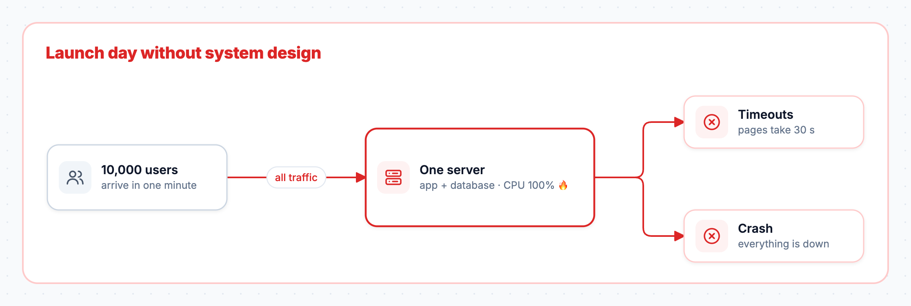

- The one server's CPU hits **100%**. Pages that took 0.2 seconds now take 30 seconds, then time out.
- The database is overwhelmed by thousands of identical "show me the products" queries.
- The server crashes, and **everything** is down — the shop, checkout, even the admin page.
- Customers leave, and many never come back. The code was fine. The **design** couldn't handle the load.

Nothing was wrong with the programming. What was missing was a plan for **scale** (more users than one machine can handle) and **failure** (what happens when a machine dies).

### 💡 The idea: design the system, not just the code

System design is that plan. You decide which building blocks to use and how they connect, so the product keeps working as it grows:

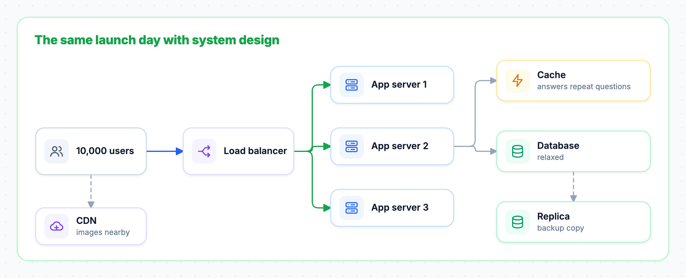

- A **load balancer** spreads the 10,000 users across several servers.
- A **cache** answers the repeated "show me the products" question from memory, so the database relaxes.
- A **CDN** serves images from a location near each user.
- A **database replica** stands by, so a single broken machine doesn't take the shop down.

Same code, different design — and the launch becomes a success instead of an outage.

### What system design questions look like

Even a "simple" URL shortener raises real design questions:

- Where do you store **a billion** short codes, and look one up in **under 10 ms**?
- What happens when one link goes viral with **50,000 clicks per second**?
- What happens when the database server **dies at 3 a.m.**?
- How do you stop spammers from hiding phishing links behind your domain?

None of these are about programming syntax. They are about **trade-offs** — speed vs cost, simplicity vs scale, consistency vs availability. That is system design.

### Why companies care

| For the business | What good design buys |
|------------------|-----------------------|
| Revenue | Pages that load in 0.2 s convert far better than pages that load in 3 s |
| Trust | Payments that never double-charge; data that is never lost |
| Cost | Serving 10× the users for 2× the cloud bill, not 10× |
| Speed | Teams that ship independently instead of waiting on one giant release |

> [!IMPORTANT]
> **🏛️ Architect's lens** — Nobody is paid to "use Kafka". You are paid to meet a business goal at an acceptable cost and risk. Technology is the means, never the goal.

---

## 0.2 Think like an architect

> **In one sentence:** An architect turns vague business goals into **numbers**, compares **real options**, picks the **simplest** one that meets the numbers, and writes down **why**.

### 🧩 The problem: choosing tools before understanding the problem

A very common mistake — in real companies and in interviews — is to start with technology:

> "Let's use microservices, Kubernetes, Kafka and a NoSQL database!"

…for an app that has 500 users. The result: a system that costs thousands of dollars a month, needs a whole team to operate, is slower to change, and solves problems the business doesn't have. The opposite mistake also happens: a single server for a product that will face a million users on launch day.

Both mistakes come from the same cause: **deciding before understanding**.

### 💡 The idea: a decision loop that starts with the business

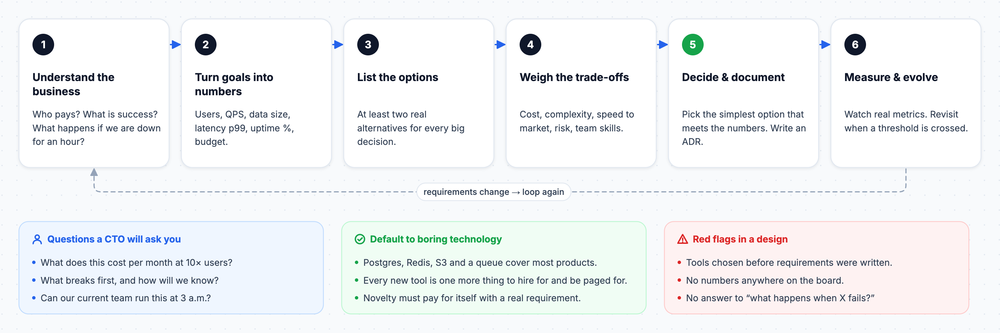

1. **Understand the business.** Who are the users? Who pays? What does one hour of downtime cost? A hospital system and a meme app have very different answers.
2. **Turn goals into numbers.** "Fast" becomes *p99 latency < 200 ms*. "Reliable" becomes *99.9% availability*. "Big" becomes *10 million daily users, 5 TB of new data a year*.
3. **List the options.** Always at least two. SQL or NoSQL? Push or pull? One service or many?
4. **Weigh the trade-offs.** Cost, complexity, time to market, operational risk, and — often forgotten — **what your team already knows**.
5. **Decide and document.** Choose the simplest option that meets the numbers. Record it in an **ADR** (Architecture Decision Record).
6. **Measure and evolve.** Watch real metrics. When a threshold is crossed, go around the loop again.

### What an ADR looks like

An ADR is a short note that records a decision and its reasons, so nobody has to re-argue it six months later:

```markdown
ADR-007: Use PostgreSQL for the orders service

Status:    Accepted · 2026-03-02
Context:   ~200 orders/s at peak, strict "never oversell" rule, team knows SQL well.
Options:   (A) PostgreSQL  (B) DynamoDB  (C) MongoDB
Decision:  A — transactions make inventory safe; load fits one primary + replicas for 3+ years.
Trade-off: Sharding later will be work. Revisit if writes exceed ~5K/s.
```

### Five habits of strong architects

| Habit | What it sounds like |
|-------|---------------------|
| **Start from requirements** | "Before I pick a database — how many writes per second, and can we ever lose one?" |
| **Default to boring technology** | "Postgres, Redis, S3 and a queue cover most products. Let's add something new only for a requirement they can't meet." |
| **Design for failure** | "Every box will fail one day. What does the user see when this one does?" |
| **Think in costs** | "A second region roughly doubles the infrastructure. Does the business really need 99.99%?" |
| **Plan the evolution** | "One region now. Read replicas at ~1K QPS. Shard only if we pass ~10K writes/s." |

> [!IMPORTANT]
> **🏛️ Architect's lens** — The best design is not the most impressive one. It is the one that meets today's numbers, has a clear path to tomorrow's, and that your team can run at 3 a.m. without you.

> [!TIP]
> **🎤 Say it in the interview** — "Given our requirement of *X*, I'd choose *A* over *B*. The cost is *Y*, which I think is acceptable because *Z*. If *W* changes, I'd revisit."

---

## 0.3 The building blocks

> **In one sentence:** Almost every system is assembled from the same dozen components — each one exists to solve **one specific problem**, and design is choosing which problems you have.

### 🧩 The problem: one program on one computer does everything badly

A beginner's app is one program on one computer: it serves web pages, stores data, sends emails, resizes photos and answers searches — all at once. Every job competes for the same CPU and memory, one slow job slows everything, and one crash stops everything.

### 💡 The idea: give each job to a specialist

Over decades, engineers pulled each job out into a specialised component. Each block below exists because of a problem people kept hitting:


| Block | The problem it solves | Plain-English job | Examples | Deep dive |
|-------|-----------------------|-------------------|----------|-----------|
| **DNS** | Humans can't remember IP numbers | Turns `shop.com` into an IP address | Route 53, Cloudflare | [1.4](#14-dns) |
| **CDN** | Far-away users wait for files to cross the world | Serves files from a city near the user | CloudFront, Cloudflare | [2.7](#27-cdn) |
| **Load balancer** | One server can't handle all the traffic | Spreads requests over many servers | NGINX, AWS ALB | [2.1](#21-load-balancing) |
| **API gateway** | Every service re-implements login, limits and routing | One front door for all requests | Kong, AWS API Gateway | [2.3](#23-api-gateway) |
| **App servers** | Business logic must run somewhere, and scale | Run your code — ideally *stateless* | Your code in containers | [6.3](#63-monolith-vs-microservices) |
| **Cache** | The database answers the same question 10,000 times | Keeps hot answers in RAM | Redis, Memcached | [2.5](#25-caching) |
| **Database** | Data must survive crashes and stay correct | The durable source of truth | PostgreSQL, DynamoDB | [3.2](#32-choosing-a-database) |
| **Object storage** | Databases are expensive for big files | Cheap, unlimited file storage | S3, GCS | [3.1](#31-storage-fundamentals) |
| **Message queue** | Slow tasks make users wait | Holds work to be done later | SQS, Kafka | [4.1](#41-messaging) |
| **Workers** | Someone has to do that later work | Send emails, encode video, build feeds | Your code reading the queue | [4.1](#41-messaging) |
| **Search index** | `LIKE '%shoe%'` on a big table is painfully slow | Fast full-text and fuzzy search | Elasticsearch, OpenSearch | [Case study 12](#case-study-12--search-engine) |
| **Observability** | When things break, nobody knows why | Metrics, logs and traces | Prometheus, Grafana, Datadog | [5.4](#54-observability) |

> [!TIP]
> **🎤 Say it in the interview** — Draw the blocks left to right in the order a request meets them: *clients → DNS/CDN → load balancer → services → cache → database*, with *queue → workers* hanging off the side for slow work.

---

## 0.4 The life of a request

> **In one sentence:** One click travels through DNS, a CDN, a load balancer, an app server, a cache and a database — and every hop is a place to add speed or to break.

### 🧩 The problem: you can't fix what you can't picture

When a page is slow or broken, where is the problem? The user's network? DNS? The load balancer? The database? If you can't picture the path a request takes, every problem looks like "the website is broken", and every design is a guess.

### 💡 The idea: memorise the path once, use it forever

Here is what happens in the ~200 milliseconds after you press Enter on `shop.example.com`:

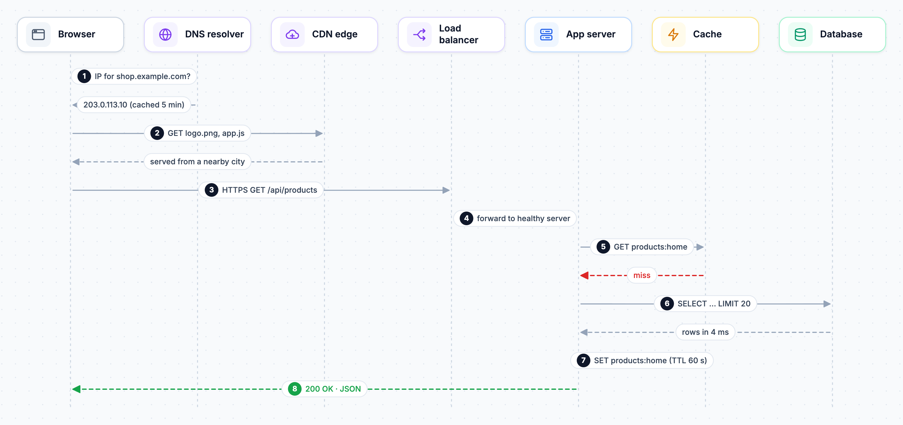

1. **DNS lookup** — the browser asks "what is the IP of `shop.example.com`?". Usually answered from a cache in ~1 ms.
2. **Static files from the CDN** — the logo, CSS and JavaScript come from an edge server in the user's own city.
3. **HTTPS to the load balancer** — the encrypted connection is set up here, and the request is sent to one healthy app server.
4. **App server logic** — check who the user is, validate the input, apply the business rules.
5. **Cache check** — ask Redis for `products:home`. If it's there (a "hit"), the answer comes back in ~0.3 ms.
6. **Database on a miss** — if not, run the database query (~1–5 ms with an index).
7. **Refill the cache** — save the answer so the next 10,000 requests skip the database.
8. **Response** — the JSON travels back through the load balancer to the browser.

> [!IMPORTANT]
> **🏛️ Architect's lens** — Along this path, **delays add up** and **failure chances multiply**. Three steps that are each up 99.9% of the time give only about 99.7% together. Every extra box on the path must earn its place.

---

## 0.5 How systems grow

> **In one sentence:** Nobody builds the final architecture on day one — each stage of growth exists to fix the **bottleneck** the previous stage created.

### 🧩 The problem: build too little and you crash; build too much and you go broke

- Build too **little** and the product falls over on its best day (see [0.1](#01-what-is-system-design)).
- Build too **much** — ten services, three databases, two regions for 200 users — and you spend your money and months on problems you don't have, and ship features slowly.

### 💡 The idea: grow in stages, triggered by real bottlenecks

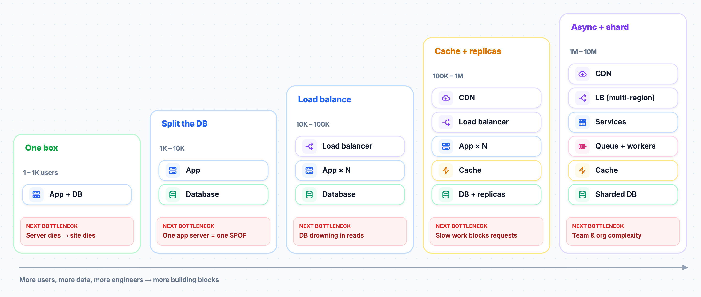

| Stage | Users (rough) | What you add | The bottleneck that forced it |
|-------|---------------|--------------|-------------------------------|
| **1. One box** | 1 – 1K | App + database on one server | — ship fast, keep it simple |
| **2. Split the database** | 1K – 10K | Database on its own (managed) server | App and database fight over CPU and memory |
| **3. Load balance** | 10K – 100K | Load balancer + several stateless app servers; sessions moved to Redis | One app server is a capacity limit and a single point of failure |
| **4. Cache + replicas** | 100K – 1M | Redis cache, read replicas, CDN | The database drowns in repeated reads |
| **5. Async + shard** | 1M – 10M+ | Queues and workers, sharded database, multiple regions, monitoring | Slow tasks block users; one database can't take all the writes; teams need independence |

These numbers are only a guide. A data-heavy business app may need stage 5 with 50,000 users, and a simple blog can serve millions at stage 3 with a good CDN.

> [!IMPORTANT]
> **🏛️ Architect's lens** — Your job is to know **which stage you are in** and **what signal will trigger the next one** — for example "when database CPU stays above 70% at peak, add read replicas". Growth by measured bottlenecks is cheaper and safer than growth by guesswork.

> [!TIP]
> **🎤 Say it in the interview** — "I'll design for the stated scale, then walk through how it evolves at 10× and 100×." That one sentence shows judgment.

---

## 0.6 The seven qualities

> **In one sentence:** Features describe **what** a system does; quality attributes — also called *non-functional requirements* (NFRs) — describe **how well** it does it, and they are what actually shape the architecture.

### 🧩 The problem: "make it fast and reliable" means nothing

Every product owner wants the system "fast, reliable, secure and cheap". But how fast? 50 ms or 2 seconds? Reliable enough for a blog or for a hospital? Without numbers, you can't choose between designs — and you will either overbuild (expensive) or underbuild (outages).

### 💡 The idea: name the qualities and give each a number

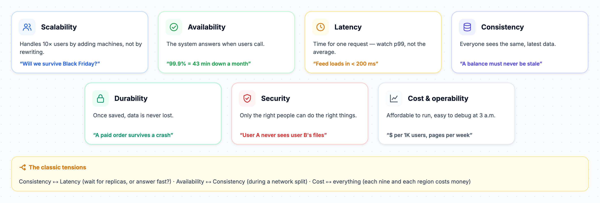

### 1. Scalability — "can we handle 10× the users?"

The ability to handle more users or data by **adding machines**, not by rewriting.

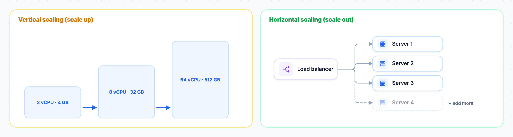

- **Vertical scaling (scale up)** — buy a bigger machine. No code changes, but there is a ceiling, the biggest machines are very expensive, and it is still one machine that can fail. Good for databases early on.
- **Horizontal scaling (scale out)** — add more machines behind a load balancer. Grows almost without limit and survives a machine dying, but your app must be **stateless** (keep no user data in local memory), and the database side gets harder.

**Watch for:** hot spots (one shard getting all the traffic) and shared bottlenecks that don't grow with the app (one Redis, one lock).

### 2. Availability — "is it up when users need it?"

The share of time the system **successfully answers**. Measured in "nines":

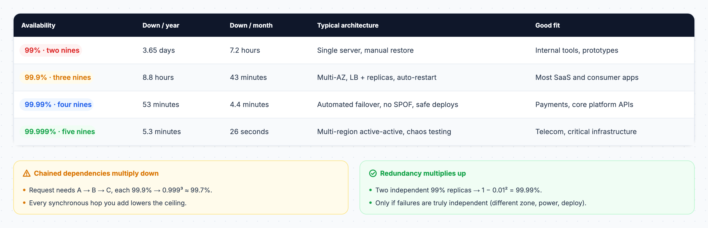

- Parts **in a chain** multiply their availability: A (99.9%) → B (99.9%) ≈ **99.8%**.
- **Redundant** parts multiply their *failure* chances: two independent 99% replicas ≈ **99.99%** together.
- **High availability** allows a short blip while switching to a backup. **Fault tolerance** means no visible interruption at all — and costs much more.

### 3. Latency and throughput — "how fast, and how much?"

- **Latency** is the time one request takes. Always talk about **percentiles**: p50 is the typical user, p99 is the slowest 1%. Averages hide the pain.
- **Throughput** is how much work per second (requests/s, messages/s).

Batching increases throughput but can increase latency. A queue absorbs spikes but means work is done *a little later*.

### 4. Consistency — "does everyone see the same, latest data?"

| Level | Promise | Good for |
|-------|---------|----------|
| **Strong** | Every read sees the latest write | Bank balances, inventory, seat booking |
| **Read-your-writes** | *You* always see your own changes | Editing your profile, posting a comment |
| **Causal** | A reply never appears before the message it answers | Chat, comments |
| **Eventual** | Everyone agrees *soon* (usually within seconds) | Like counts, view counts, feeds |

### 5. Durability — "once saved, is it safe forever?"

When the system says "saved", the data must survive crashes. That comes from writing to disk (a write-ahead log), copying to other machines and data centers, and **backups that you have actually restored at least once**.

### 6. Security — "can only the right people do the right things?"

Knowing who each user is, checking what they may do on every request, and protecting data on the network and on disk. See [6.10](#610-security).

### 7. Cost and operability — "can we afford it, and can we run it?"

Can the business pay for it, and can a tired engineer understand what broke at 3 a.m.? This is where monitoring and resilience patterns live — see [Chapter 05](#chapter-05--reliability--operations).

> [!IMPORTANT]
> **🏛️ Architect's lens** — These qualities pull against each other. More consistency costs speed. More availability costs money. More regions cost complexity. Say out loud **which qualities win for this product**: for a bank, correctness wins; for a social feed, speed wins.

> [!TIP]
> **🎤 Say it in the interview** — Write the qualities as numbers in the corner of the board: *"p99 read < 200 ms · 99.9% availability · lose at most 1 minute of data · likes may lag a few seconds."* Vague words like "highly available" earn nothing.

#### ❓ Questions & answers

1. **What's the difference between availability and durability?** A system can be *available but not durable*: it answers every request but loses the last minute of orders when a disk dies. It can also be *durable but unavailable*: every order is safe on disk, but the site is down while it switches to a backup.
2. **Why can higher throughput make p99 latency worse?** Batching and deep queues keep machines busy, but each request waits longer in line. Near 100% utilization, waiting time explodes.
3. **Name a feature that needs strong consistency and one that doesn't.** Needs it: "only one person can book seat 14C". Doesn't: "this post has 10,482 likes" — a few seconds behind is fine.

---

## 0.7 Numbers every engineer should know

> **In one sentence:** You don't need exact figures — you need a **feel for how slow things are** so you can spot a slow design before you build it.

### 🧩 The problem: a design that looks fine on the whiteboard but is 100× too slow

Imagine a team puts their app servers in Europe (near their users) but leaves the database in the United States. On the whiteboard it's just an arrow. In reality, each database query must cross the Atlantic and back — about **150 ms** — and a single page makes 10 queries:

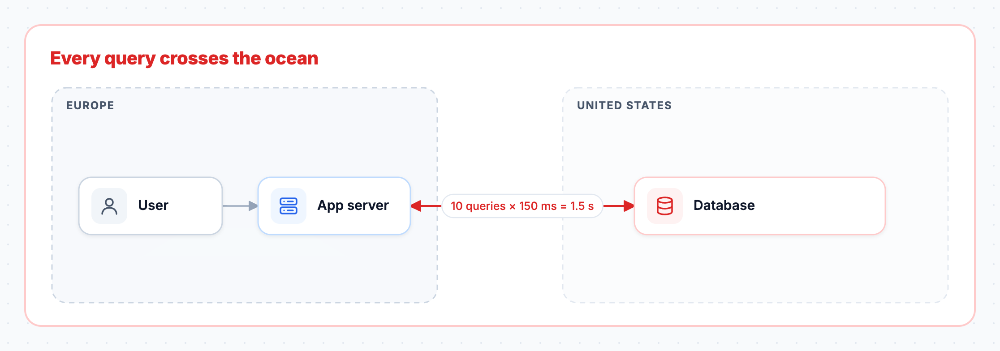

10 queries × 150 ms = **1.5 seconds** of pure waiting per page, before any real work. Users leave. Nothing is "broken" — the design just ignored how long things take.

### 💡 The idea: keep the hot path close and in memory

Put the database in the same region as the app, and cache the hot answers in memory:

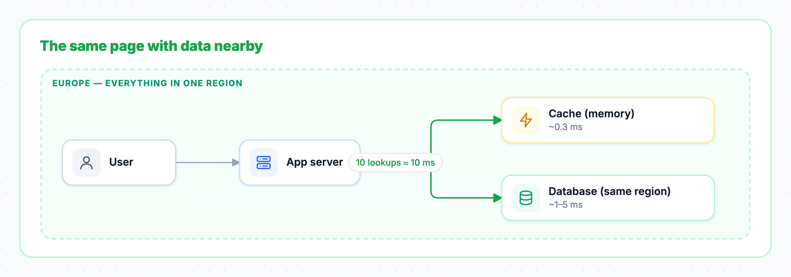

The same 10 lookups now take about **1 ms each** — roughly **100× faster**. The only difference is knowing the numbers below.

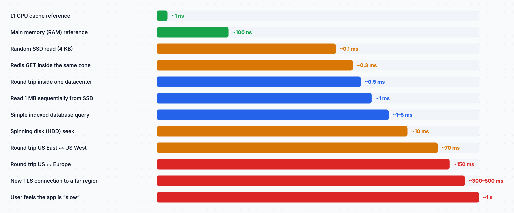

### What the chart teaches

- **Memory ≫ SSD ≫ network ≫ disk seek ≫ crossing an ocean.** Each step is roughly 10–1,000× slower than the one before.
- One trip across a continent (~150 ms) costs as much time as **hundreds** of Redis reads. Keep user-facing work **in one region** and **in memory** whenever you can.
- People notice delays of about **100 ms** and call anything over **~1 second** "slow".

### Back-of-envelope cheat sheet

| Fact | Handy approximation |
|------|---------------------|
| Seconds in a day | 86,400 ≈ **10⁵** |
| Requests per day → per second | divide by **10⁵** (1 million/day ≈ 12/s) |
| Peak traffic | average × **2–5** (always ask) |
| 1 KB × 1 million | **1 GB** |
| 1 Gbps network | ≈ **125 MB/s** |
| 2³² | ≈ **4 billion** (all IPv4 addresses; 32-bit IDs) |
| 2⁶⁴ | practically unlimited IDs |
| One modern server | ~**10K–100K** simple requests/s (depends on the work) |
| One Postgres primary | ~**5K–20K** writes/s on good hardware; far more reads |
| One Redis node | ~**100K+** operations/s |

### A worked example

> *"100 million daily users each view 20 posts a day."*
>
> - Reads: 100M × 20 = 2 billion a day ÷ 10⁵ ≈ **20,000 reads/s** on average, **~60K/s** at peak.
> - That is far more than one database can serve → we need a **cache** and probably **read replicas**.
> - If users also create 10M posts a day at 1 KB each: 10 GB/day ≈ **3.6 TB a year** before copies.

Full method in [7.4 Capacity estimation](#74-capacity-estimation).

> [!TIP]
> **🎤 Say it in the interview** — Round aggressively and say what the number means: "About 20K reads per second — too much for one database, so I'll put a cache in front." The *conclusion* is what scores points, not the arithmetic.

<p align="right"><a href="#table-of-contents">↑ Back to top</a></p>

---

# Chapter 01 · Networking

**How a request finds your servers, travels safely, and gets pushed back in real time**

---

### In this chapter

| # | Lesson | One-line idea |
|---|--------|---------------|
| 1.1 | [IP addresses](#11-ip-addresses) | Every device needs an address so messages can be delivered |
| 1.2 | [The OSI model](#12-the-osi-model) | Split networking into layers so each part can change alone |
| 1.3 | [TCP and UDP](#13-tcp-and-udp) | The internet loses packets — TCP fixes that, UDP skips it for speed |
| 1.4 | [DNS](#14-dns) | Humans remember names, computers need numbers |
| 1.5 | [TLS and mTLS](#15-tls-and-mtls) | Data passes through strangers — encrypt it and prove who you are |
| 1.6 | [Proxies](#16-proxies) | One middleman in front of many servers |
| 1.7 | [Real-time communication](#17-real-time-communication) | Let the server push news instead of clients asking again and again |

> **Why this chapter matters:** you will never configure a router in a design interview, but you **will** place DNS, TLS, load balancers and WebSocket gateways on the board — and you must put them in the right order.

---

## 1.1 IP addresses

> **In one sentence:** An IP address is the "home address" of a device on a network — every message on the internet carries one, so routers know where to deliver it.

### 🧩 The problem: billions of devices, and no way to find one

The internet connects **billions of devices** — phones, laptops, servers, TVs, cars. When your phone sends a message to a server, that message passes through dozens of routers owned by different companies. How does each router know where to send it?

Without addresses, it's like posting a letter with **no address on the envelope**:

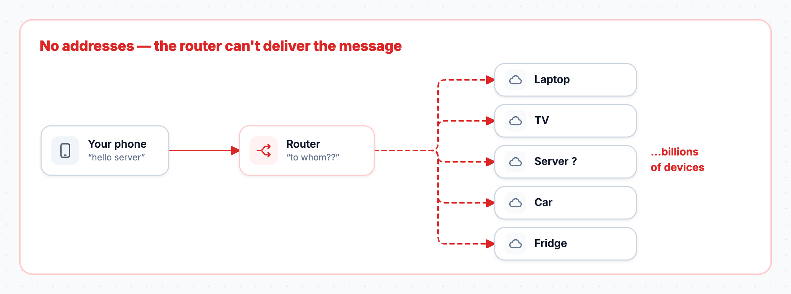

- The router has no idea which of the billions of devices the message is for.
- The only option would be to send it to **everyone** and hope the right device picks it up — impossible at internet scale, and anyone could read it.
- The server couldn't reply either, because it wouldn't know where the message came from.

### 💡 The idea: give every device an address

Every device gets a unique number — its **IP address** (Internet Protocol address). Every message (called a **packet**) carries two addresses, just like an envelope: **"to"** and **"from"**. Routers read the "to" address and pass the packet one step closer, the way post offices do:

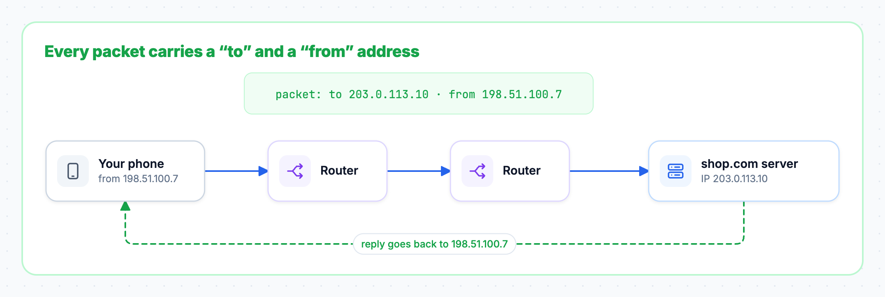

### The address shortage, and the fix: private addresses + NAT

The original addresses, **IPv4**, are 32-bit numbers like `203.0.113.10`. That allows about **4.3 billion** addresses — which seemed endless in 1981, but today there are far more devices than that. The world ran out of new IPv4 addresses years ago.

Two fixes exist side by side:

1. **IPv6** — a new 128-bit address format (like `2001:db8::1`) with practically unlimited addresses. Adoption is growing, but slowly.
2. **Private addresses + NAT** — the fix that actually saved IPv4. Devices inside a home, office or data center use **private** addresses (`10.x.x.x`, `172.16–31.x.x`, `192.168.x.x`) that only mean something inside that network. The router at the edge has **one public address** and translates (NAT = Network Address Translation) for everyone behind it.

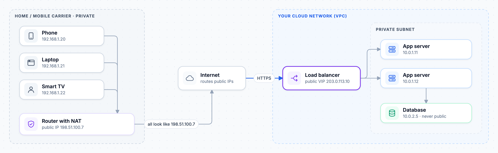

That's why your laptop at home might be `192.168.1.21` — and so might millions of other laptops in other homes. Only your router's public address is unique on the internet.

| | IPv4 | IPv6 |
|--|------|------|
| Size | 32-bit (~4.3 billion addresses) | 128-bit (practically unlimited) |
| Looks like | `203.0.113.10` | `2001:db8::1` |
| Status | Still the most used; ran out of new addresses | Growing; most networks run both ("dual-stack") |

### Static vs dynamic addresses

- **Static** — never changes. Used for servers and for partners who must "allowlist" you.
- **Dynamic** — handed out automatically (by DHCP) and changes often. Phones get a new address when they move from Wi-Fi to 4G. Never build security that assumes a user's IP stays the same.

### Where IPs matter in system design

| Use | Watch out for |
|-----|---------------|
| **Rate limiting** by IP | NAT puts a whole café or mobile carrier behind one IP → you might block thousands of innocent users |
| **Allowlists** (admin panel, partner webhooks) | Cloud failovers change IPs; allowlists break |
| **Geo routing** (nearest region, country rules) | IP location is approximate; VPNs hide it |
| **Client IP in logs** | Behind a proxy, the real client IP is in the `X-Forwarded-For` header — trust it only if your own proxy set it |

In your own designs: **only the edge (the load balancer) gets a public IP**. App servers and databases live on private addresses where the internet can't reach them directly.

> [!IMPORTANT]
> **🏛️ Architect's lens** — An IP address is a weak identity: shared (NAT), changing (mobile) and easy to fake in headers. Use it as a **second** signal, for abuse detection or rough location. Use **user IDs, API keys and tokens** as the real identity for rate limits and permissions.

> [!TIP]
> **🎤 Say it in the interview** — "Only the load balancer has a public IP. App servers and the database sit in private subnets. I'll rate-limit by user ID first and IP second, because many users share one IP behind NAT."

#### ❓ Questions & answers

1. **Why can two users share one public IP?** They sit behind the same NAT (a home router, an office, a mobile carrier), which rewrites their private addresses to one public address.
2. **Why did we run out of IPv4 addresses?** 32 bits gives ~4.3 billion addresses, and there are far more devices than that. Private addresses with NAT and IPv6 are the two fixes.
3. **When is a static IP worth paying for?** When partners must allowlist you (payment processors, banks), or when customers firewall your outgoing webhooks.
4. **Why is IP a poor sole identity for security?** It is shared (NAT), it changes (mobile networks) and it can be faked in headers if you trust `X-Forwarded-For` blindly.

---

## 1.2 The OSI model

> **In one sentence:** The OSI model splits networking into **7 layers**, each with one job, so each layer can change without breaking the others — and in system design you mostly talk about **Layer 4** (TCP/UDP) and **Layer 7** (HTTP).

### 🧩 The problem: one giant job that nobody could change

Sending a web page across the world involves many different jobs: turning your request into bytes, encrypting it, splitting it into packets, making sure none are lost, finding a route across the planet, and turning bits into electrical signals, light or radio waves.

In the early days (1970s), each computer company built **its own all-in-one networking system**. The result:

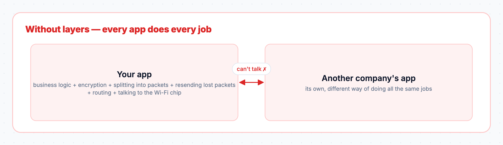

- Computers from different companies **couldn't talk to each other**.
- Changing one part (say, moving from cables to Wi-Fi) meant **rewriting everything**, including the apps.
- Every app had to worry about lost packets, routing and hardware — jobs that have nothing to do with the app.

### 💡 The idea: split the job into layers, like the postal system

Think about sending a parcel. **You** write the letter. The **post office** puts it in an addressed envelope. A **truck** carries it along **roads**. You don't care whether the truck is electric; the truck driver doesn't read your letter. Each layer does one job and trusts the others to do theirs.

Networking works the same way:

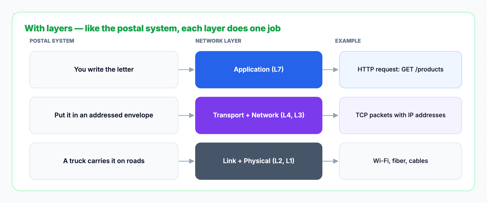

The **OSI model** (1984) names seven such layers. Real internet traffic uses the simpler TCP/IP model with four layers, but everyone still uses OSI's **numbers** as shorthand — especially "L4" and "L7":

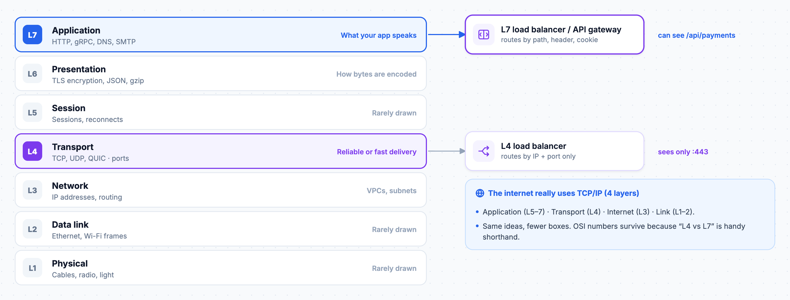

| Layer | Name | Example | Why you care in system design |
|-------|------|---------|-------------------------------|
| **7** | Application | HTTP, gRPC, DNS | L7 load balancers and API gateways can route by URL |
| 6 | Presentation | TLS encryption, JSON, compression | Where encryption is often "terminated" |
| 5 | Session | Setting up and resuming sessions | Rarely discussed |
| **4** | Transport | TCP, UDP, port numbers | L4 load balancers — very fast, but blind to URLs |
| 3 | Network | IP addresses, routing | VPCs and subnets |
| 2 | Data link | Ethernet, Wi-Fi | Rarely discussed |
| 1 | Physical | Cables, fiber, radio | Rarely discussed |

### L4 vs L7 — the only distinction you really need

| | **L4 load balancer** | **L7 load balancer** |
|--|----------------------|----------------------|
| What it can see | IP address + port number | The whole HTTP request: URL path, headers, cookies |
| Can it send `/api` and `/images` to different servers? | ❌ No | ✅ Yes |
| Speed | Extremely fast and cheap | A little more CPU |
| Typical use | Raw TCP (databases, game servers), huge traffic | Public websites and APIs, canary releases, authentication |
| Cloud example | AWS NLB | AWS ALB, NGINX, Envoy |

> [!TIP]
> **🎤 Say it in the interview** — "An L7 load balancer at the edge for TLS and path routing; L4 internally where I just need fast TCP." Then move on — never recite all seven layers.

#### ❓ Questions & answers

1. **Why split networking into layers at all?** So each part can change on its own (cables → Wi-Fi, HTTP/1 → HTTP/2) without rewriting the others, and so equipment from different companies works together.
2. **Can an L4 load balancer route by URL path?** No. It only sees IPs and ports; the URL is inside the (usually encrypted) HTTP request.
3. **Which layer do TCP and UDP live in?** Layer 4, the transport layer.
4. **Name one reason to use L7 at the public edge.** Routing by path or host, TLS termination, header-based canary releases, firewall rules (WAF), per-route rate limits.

---

## 1.3 TCP and UDP

> **In one sentence:** **TCP** makes sure every piece of data arrives, complete and in order; **UDP** just sends it as fast as possible with no guarantees — useful when a late packet is worse than a lost one.

### 🧩 The problem: the internet loses things

Data doesn't travel as one piece. A photo or a web page is chopped into hundreds of small **packets**, and each packet finds its own way across the internet. On the way:

- some packets are **lost** (a busy router drops them),
- some arrive **out of order** (they took different routes),
- some arrive **twice**.

The internet itself (IP) makes no promises — it just does its best. If your app received the raw packets, a downloaded file would come out broken:

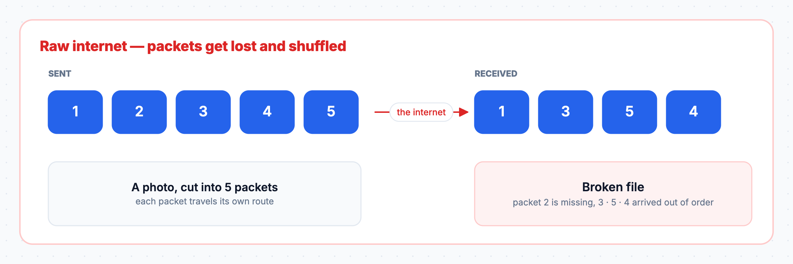

### 💡 The idea: TCP numbers every packet, checks it arrived, and resends what's missing

**TCP (Transmission Control Protocol)** sits on top of IP and adds the guarantees:

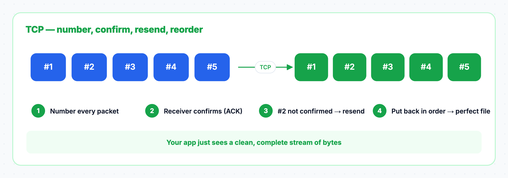

1. **Handshake first** — client and server agree to talk (SYN → SYN-ACK → ACK).
2. **Number every packet** — so the receiver can put them back in order and spot duplicates.
3. **Acknowledge** — the receiver confirms what it got ("ACK").
4. **Resend** — anything not confirmed in time is sent again.
5. **Slow down when the network is busy** (congestion control), so everyone shares fairly.

The price: a little extra time for the handshake and for waiting on lost packets.

### When the guarantees hurt: UDP

For a **live video call** or an **online game**, a packet that arrives late is useless — you don't want the video to freeze while TCP waits for an old frame. **UDP (User Datagram Protocol)** skips all the guarantees: no handshake, no numbering, no resending. It just sends.

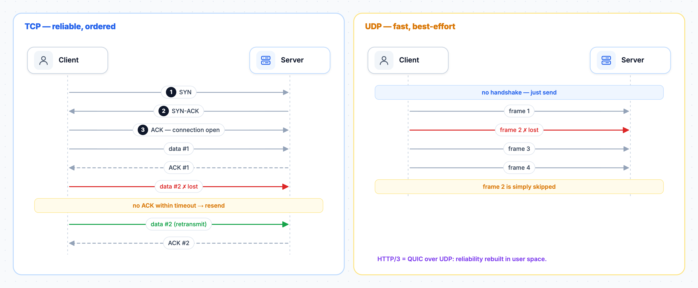

| Question | TCP | UDP |
|----------|-----|-----|
| Setup | 3-way handshake | None |
| Delivery | Guaranteed (acks + resend) | Best effort — may be lost |
| Order | Preserved | Not guaranteed |
| Congestion control | Built in | Up to your app |
| One lost packet… | …holds up everything behind it | …is simply skipped |
| Used by | Web pages (HTTP/1.1, HTTP/2), databases, SSH, email | Video calls, games, live streams, DNS lookups, **QUIC / HTTP/3** |

### Which one should you use?

| Situation | Choose |
|-----------|--------|
| REST API, database connection, file upload | **TCP** |
| Video call, multiplayer game positions | **UDP** (usually via WebRTC) |
| DNS lookup | UDP (falls back to TCP for big answers) |
| Money movement | TCP **plus** idempotency in your app |

**QUIC / HTTP/3** is the modern twist: it rebuilds TCP-style reliability **on top of UDP**, so one lost packet doesn't block unrelated data, and connections survive switching from Wi-Fi to 4G.

> [!WARNING]
> **Common mistakes** — Using TCP for live media (resends cause freezes); using raw UDP for anything that must not be lost; forgetting that some company networks block UDP/QUIC entirely.

> [!TIP]
> **🎤 Say it in the interview** — Label your arrows: `HTTPS (TCP)` for APIs, `media (UDP / WebRTC)` for calls. If asked "why not UDP everywhere?", answer: TCP gives you reliability and fair congestion control for free.

#### ❓ Questions & answers

1. **Why does data get lost on the internet at all?** Routers have limited memory; when they're overloaded they drop packets. Radio links (Wi-Fi, mobile) also lose packets to interference.
2. **Why does TCP feel slow for live video on bad mobile networks?** A lost packet must be resent, and everything behind it waits (head-of-line blocking), so the video freezes. For live video, skipping the frame is better.
3. **Is DNS always UDP?** Usually, but it falls back to TCP for large answers.
4. **What does QUIC improve over HTTP/2 on TCP?** Separate streams (one loss doesn't block the others), faster connection setup, and connections that survive a network change.

---

## 1.4 DNS

> **In one sentence:** DNS is the internet's phone book — you remember a **name** (`shop.com`), DNS finds the **number** (the IP address) your computer actually needs.

### 🧩 The problem: computers only understand numbers

Every computer on the internet is found by its **IP address**, a number like `142.250.80.46`. Your browser **cannot** connect to "google.com" directly. It can only connect to a number.

Now imagine the internet **without** DNS — this is what you would face every day:

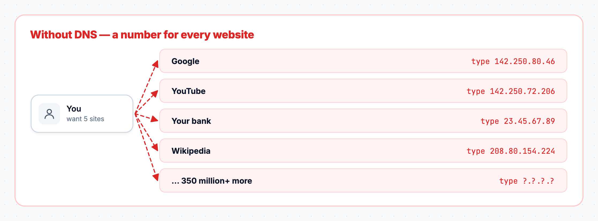

- There are **over 350 million registered domain names** and more than a billion websites. To visit any of them, you would need its exact number.
- To open Google you'd type `142.250.80.46`. YouTube: `142.250.72.206`. Your bank: another number. Every friend's blog: another number.
- **The numbers change.** When a company moves to a new server or a new cloud provider, its IP changes, and every bookmark and printed link in the world breaks.
- **One site has many numbers.** Google has thousands of servers around the world with different IPs. Which one should you type?
- **New addresses are even worse.** An IPv6 address looks like `2607:f8b0:4004:c07::64`.

Humans are good at names and terrible at numbers. Computers are the opposite. We need a **translator**.

### 📜 How it was first solved — and why that broke

In the 1970s the early internet (ARPANET) had only a few hundred computers. The solution was **one text file**, `HOSTS.TXT`, kept by one organization. It listed every computer's name and number. Everyone downloaded a fresh copy regularly.

That stopped working as the network grew:
- **Too big** — the file grew with every new computer, and everyone had to re-download all of it.
- **Too slow to update** — a new computer waited days before others could reach it by name.
- **One team was a bottleneck** — every change in the world went through them.
- **Name clashes** — two people wanted the same name, with no rule to decide.

In **1983**, DNS (the Domain Name System) replaced the single file with a **distributed, hierarchical** system. No single file, no single owner — and it still runs the internet today, answering trillions of lookups a day.

### 💡 The idea: a phone book, split into chapters

With DNS you type a **name**. DNS looks up the **number** for you, and your browser connects to it — in about a millisecond:

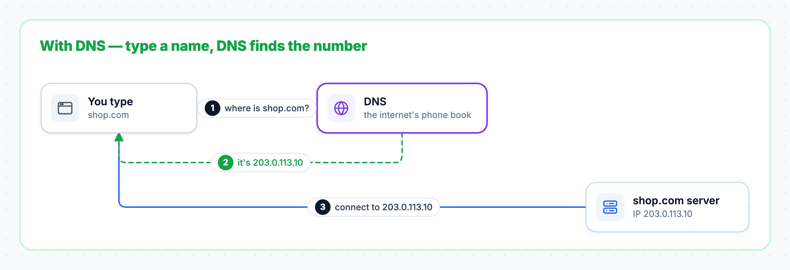

What this gives everyone:
- **You remember one simple name, forever** — `shop.com` never changes.
- **Owners can move freely** — a new server or cloud? Update the DNS record once and nobody notices.
- **The nearest server** — DNS can give a user in Tokyo a different number than a user in London.
- **Speed** — answers are remembered (cached), so most lookups take about 1 ms.

It works exactly like the contacts on your phone:

| Your phone's contacts | DNS |
|-----------------------|-----|
| You tap **"Mom"** | You type **shop.com** |
| The phone looks up her number | DNS looks up the IP address |
| It dials `+1 555 0100` | The browser connects to `203.0.113.10` |
| Mom gets a new number → you edit **one** contact | The site moves servers → the owner edits **one** DNS record |

One phone book for the whole planet would be far too big for anyone to manage, so DNS splits it into a **tree** of chapters, each managed by a different owner:

```text
                     .  (root)                    ← 13 root server names, run by 12 organizations
          ┌──────────┼──────────┐
        .com        .org       .uk                ← top-level domains (TLDs), run by registries
          │
       shop.com                                   ← your domain; you choose its name servers
     ┌────┴─────┐
 www.shop.com  api.shop.com                       ← records you create
```

Nobody knows everything — each level only knows **who to ask next**. That's what lets DNS scale to the whole internet.

### ⚙️ How a lookup works, step by step

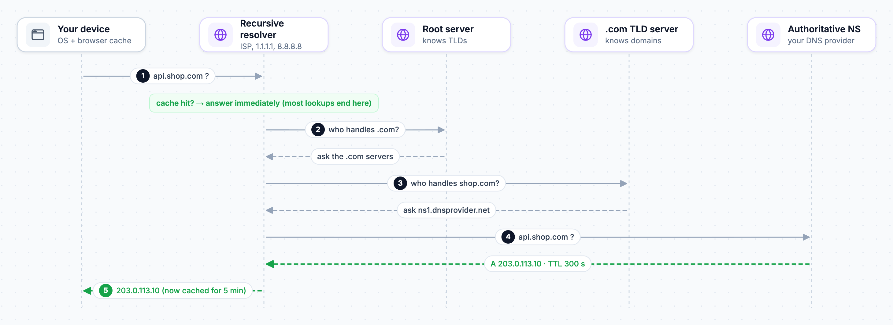

You type `api.shop.com` and press Enter:

1. **Your device checks its own memory** (browser and OS cache). Visited recently? Done in ~0 ms.
2. **It asks a recursive resolver** — a helper server run by your ISP or a public service like `1.1.1.1` (Cloudflare) or `8.8.8.8` (Google). Most answers are already cached here: ~1–20 ms.
3. **On a cache miss, the resolver walks the tree** for you:
   - asks a **root server**: "who handles `.com`?" → "ask these `.com` servers"
   - asks a **`.com` TLD server**: "who handles `shop.com`?" → "ask `ns1.dnsprovider.net`"
   - asks the **authoritative name server**: "what is `api.shop.com`?" → "`203.0.113.10`, keep it for 300 seconds"
4. **The resolver caches the answer** and returns it. Your browser connects to `203.0.113.10`.

A cold lookup takes maybe 50–150 ms. A warm one (the usual case) takes about 1 ms.

### ⏱️ Caching and TTL: why DNS is fast but slow to change

Every answer comes with a **TTL (time to live)** — how long it may be cached. The TTL is DNS's big trade-off:

- **Fast:** millions of users share cached answers, so the authoritative servers are rarely asked.
- **Slow to change:** if you change the IP, caches around the world keep serving the **old** one until their TTL expires. You can't force them to forget.

| TTL | Upside | Downside |
|-----|--------|----------|
| **Low** (30–60 s) | Changes and failovers spread quickly | More DNS queries; more dependence on your DNS provider |
| **High** (hours) | Fewer lookups; survives short DNS outages | A change takes hours to reach everyone |

**Pro move:** keep a moderate TTL (5–60 minutes) normally, and **lower it a day before** a planned migration so the switch takes effect quickly.

### 📇 Record types worth knowing

| Record | What it says | Example |
|--------|--------------|---------|
| **A** | Name → IPv4 address | `shop.com → 203.0.113.10` |
| **AAAA** | Name → IPv6 address | `shop.com → 2001:db8::10` |
| **CNAME** | This name is an alias of another name | `www.shop.com → shop.com` |
| **NS** | Which name servers are in charge of this domain | `shop.com → ns1.dnsprovider.net` |
| **MX** | Where to deliver email | `shop.com → mail.shop.com` |
| **TXT** | Free text: domain verification, email security (SPF/DKIM) | `"v=spf1 include:…"` |
| **SRV** | Host + port for a service | used for service discovery |

### 🌍 Smarter DNS for big systems

- **GeoDNS / latency-based routing** — the authoritative server returns a **different IP depending on where the user is**: Europeans get the Frankfurt servers, Americans get Virginia. That's how one name serves the whole world from the nearest region. (It's approximate, because it sees the resolver's location, not the user's.)
- **Health-checked DNS** — the DNS provider stops returning a region's IP if that region fails its health checks. This is a common way to fail over between regions.
- **Anycast** — the **same IP** is announced from many locations, and internet routing sends each user to the nearest one. DNS providers and CDNs use it for speed and to absorb DDoS attacks.

> [!IMPORTANT]
> **🏛️ Architect's lens** — DNS is a **coarse** traffic tool: it picks a *region*, not a *server*. Per-request balancing, health checks and instant failover belong to the load balancer. And your DNS provider is a single point of failure for your whole brand: when a major DNS provider went down in 2016, many famous sites became unreachable even though their servers were fine. Critical businesses use **two DNS providers**.

> [!WARNING]
> **Common mistakes** — Trying to fail over during an incident while the TTL is 24 hours; letting the domain registration expire (it happens to big companies); long chains of CNAMEs that add lookup time; expecting DNS to route by URL path (it only sees names, never requests).

> [!TIP]
> **🎤 Say it in the interview** — "Clients resolve our domain through DNS with latency-based routing, which sends them to the nearest region's load balancer. The load balancer does per-request balancing and health checks."

#### ❓ Questions & answers

1. **Why can't the browser just use the name?** Network connections are made to IP addresses. The name is only for humans, so something must translate it first.
2. **Why did one shared HOSTS.TXT file stop working?** It grew too big, updates were slow, one team had to approve every change, and names clashed.
3. **Why is DNS alone a poor substitute for a load balancer?** Caches keep old answers for the TTL even if a server dies, and DNS never sees requests (paths, headers), so it can't balance or react in seconds.
4. **How would you prepare for a planned server migration?** Lower the TTL to ~60 s a day before, so caches expire quickly. Switch the record, confirm traffic has moved, then raise the TTL again.
5. **What does anycast buy you?** Automatic routing to the nearest location, DDoS traffic spread across many sites, and regional failover without changing the IP.


---

## 1.5 TLS and mTLS

> **In one sentence:** TLS is the "S" in HTTPS — it **encrypts** everything between you and a website and **proves** the website is real, so nobody in between can read or fake your data.

### 🧩 The problem: your data passes through strangers' hands

When you log in to your bank from a café, your request doesn't fly straight to the bank. It passes through the café's Wi-Fi router, your internet provider, and several other networks — machines owned by people you've never met.

Without encryption, all of them can **read everything** — and even change it:

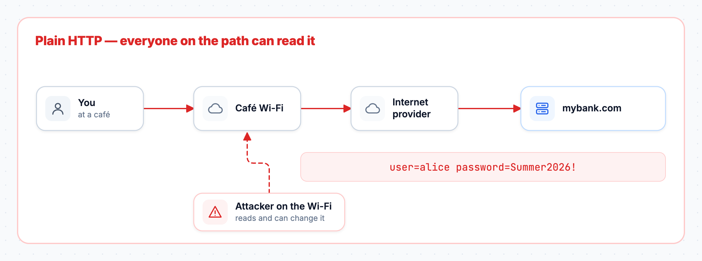

- **Eavesdropping** — anyone on the café Wi-Fi can capture `password=Summer2026!` in plain text.
- **Tampering** — a network in the middle could change "send $10" into "send $1,000", or inject ads and malware into a page.
- **Impersonation** — an attacker could pretend to be `mybank.com`, and you'd have no way to tell.

Before HTTPS was common, all of this really happened — tools that stole other people's logged-in sessions on public Wi-Fi were freely available.

### 💡 The idea: an encrypted tunnel plus an ID card

**TLS (Transport Layer Security)** does two things before any real data is sent:

1. **Proves identity** — the website shows a **certificate**: a digital ID card, signed by a trusted **Certificate Authority**, that says "this really is `mybank.com`". Your browser checks it.
2. **Agrees on a secret key** — browser and server create a shared key that only they know, even though they're talking over a public network.

After that, everything is encrypted. The people in the middle still carry the packets, but they only see scrambled bytes:

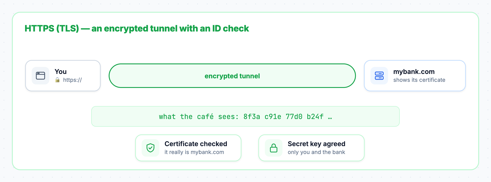

### How the handshake works

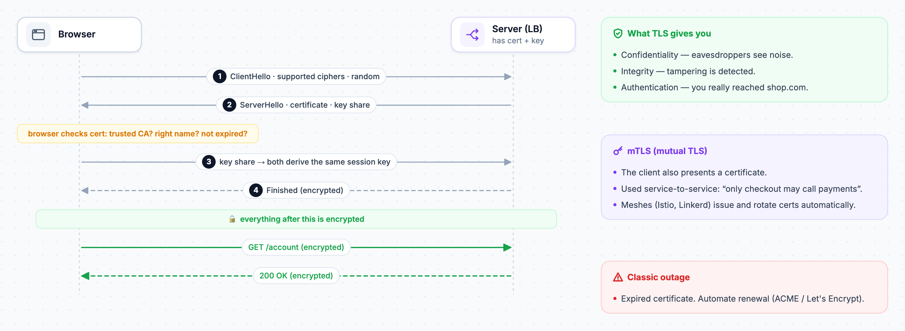

1. **ClientHello** — the browser says which encryption methods it supports.
2. **ServerHello + certificate** — the server picks one and shows its ID card.
3. **The browser checks the certificate** — signed by a trusted authority? Right name? Not expired?
4. **Key exchange** — both sides compute the same secret key.
5. **Encrypted from here on** — every request and response is encrypted.

With TLS 1.3 this takes just one round trip. ("SSL" is the old name for TLS; you'll still hear it.)

### What TLS gives you

| Guarantee | Meaning |
|-----------|---------|
| **Confidentiality** | Eavesdroppers see only scrambled data |
| **Integrity** | Any change in transit is detected |
| **Authentication** | You really reached `mybank.com`, not an imposter |

### mTLS: when services must prove who *they* are

Normal TLS proves the **server's** identity. Inside your own system you also want the reverse: when a request arrives at the payments service, is it really from the checkout service — or from a compromised server? In **mutual TLS (mTLS)**, **both** sides show certificates. A service mesh (Istio, Linkerd) can issue and rotate these certificates automatically for every service.

### Where to "terminate" TLS (decrypt it)

| Option | Pros | Cons |
|--------|------|------|
| At the **CDN / load balancer** | Simple; the load balancer can read HTTP to route requests | Traffic inside your network is plain text unless you re-encrypt it |
| **Re-encrypt** to the backends | Encrypted the whole way | More CPU and more certificates to manage |
| **mTLS everywhere** (service mesh) | Every service proves its identity — "zero trust" | Needs automation |

> [!IMPORTANT]
> **🏛️ Architect's lens** — Expired certificates are one of the most common *self-inflicted* outages in the industry: one forgotten renewal and every user sees a security warning. Automate issuing and renewing certificates (Let's Encrypt, cloud certificate managers), and alert weeks before expiry.

> [!TIP]
> **🎤 Say it in the interview** — "TLS terminates at the load balancer. Inside the cluster, a service mesh gives us mTLS, so the payments service only accepts calls from checkout."

#### ❓ Questions & answers

1. **What can an attacker on café Wi-Fi do without TLS?** Read passwords and cookies, change pages in transit, and impersonate websites.
2. **What does the certificate prove?** That the server really owns the domain name, vouched for by a Certificate Authority your browser trusts.
3. **What does "TLS termination at the load balancer" mean?** The load balancer decrypts the traffic; from there to the app servers it's plain HTTP (or re-encrypted, if you choose).
4. **How does mTLS differ from normal HTTPS?** In normal HTTPS only the server shows a certificate. In mTLS both sides do, so the server knows *which service* is calling.

---

## 1.6 Proxies

> **In one sentence:** A proxy is a middleman that forwards traffic on someone's behalf — a **forward proxy** acts for clients going out, a **reverse proxy** stands in front of your servers.

### 🧩 The problem: every server exposed, every server doing everything

Imagine your app has three servers, and each one is directly on the internet with its own public address:

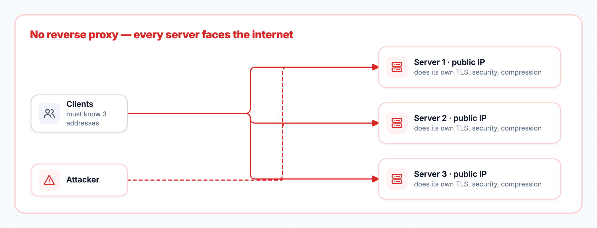

- **Clients must know every server's address**, and which server handles what.
- **Every server is a target** — attackers can hit each one directly.
- **Every server repeats the same work**: encryption (TLS), compression, blocking bad traffic.
- **Maintenance hurts** — take a server down for an update and its users get errors.

### 💡 The idea: one middleman in front of all servers

Put a **reverse proxy** in front. Clients only ever talk to it; it forwards each request to the right server behind it:

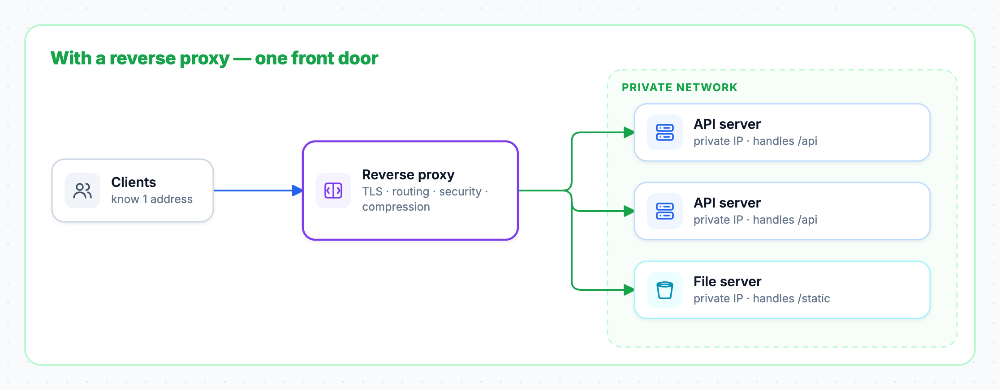

- **One address** for clients; the servers can hide on private addresses.
- **One place** for TLS, compression, blocking attacks and routing (`/api` → API servers, `/static` → file servers).
- **Servers can come and go** — the proxy simply stops sending them traffic.

The same middleman idea works in the other direction too: a **forward proxy** sits in front of **clients** going out to the internet — for example, a company proxy that filters which websites employees can visit, or a fleet of web crawlers that all go out through one exit.

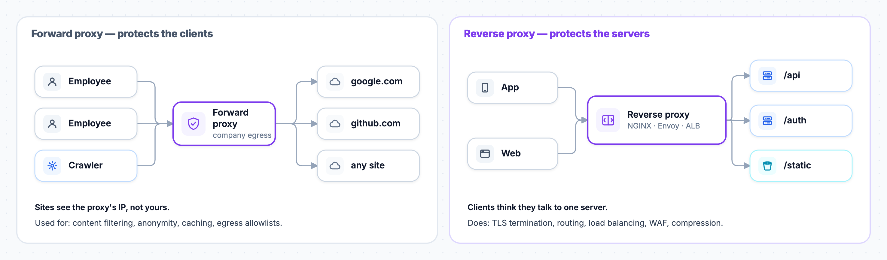

| | Forward proxy | Reverse proxy |
|--|---------------|---------------|
| Sits in front of | Clients | Servers |
| Set up by | The client side (company IT) | You, the service owner |
| The destination sees | The proxy's address, not the client's | Clients think they're talking to one server |
| Used for | Filtering outgoing traffic, anonymity, crawler fleets | TLS, routing, load balancing, firewall rules, caching, compression |
| Examples | Corporate proxy, Squid | NGINX, Envoy, HAProxy, AWS ALB |

### Family members you shouldn't confuse

Many building blocks in this guide are really reverse proxies with extra features:

| Thing | What it adds to a basic reverse proxy |
|-------|---------------------------------------|
| **L7 load balancer** | Health checks and balancing across many servers |
| **API gateway** | Login checks, rate limits, API keys, request shaping |
| **CDN** | Hundreds of locations worldwide, plus a cache |
| **Service-mesh sidecar** | A tiny proxy next to *each* service, for mTLS, retries and metrics |

> [!WARNING]
> **Common mistakes** — Timeouts that don't match between the proxy and the app (causing retry storms); holding huge uploads in proxy memory; trusting the `X-Forwarded-For` header from anyone; forgetting to allow WebSocket upgrades; running a single proxy with no backup.

> [!TIP]
> **🎤 Say it in the interview** — Say "reverse proxy / L7 load balancer" for the front door of your system. Save "forward proxy" for outgoing traffic, like a crawler fleet or calls to third-party APIs from a private network.

#### ❓ Questions & answers

1. **Clients → ? → many different websites: forward or reverse proxy?** Forward.
2. **Why hide app servers behind a reverse proxy?** Smaller attack surface, one place for TLS and security rules, and servers can be added or removed without clients noticing.
3. **Why must you trust `X-Forwarded-For` carefully?** Anyone can send that header. Only trust the value your own proxy added, or attackers can fake their IP and dodge rate limits.
4. **When would you add service-mesh sidecars?** When many services need the same mTLS, retries, timeouts and metrics, and you don't want every team to rebuild them in code.

---

## 1.7 Real-time communication

> **In one sentence:** Normal web requests only let the **client** start a conversation; real-time techniques (SSE, WebSockets) let the **server** push news the moment it happens.

### 🧩 The problem: the server can't speak first

The web was built on **request → response**: the browser asks, the server answers, and the conversation ends. The server can never say "hey, something new happened" on its own.

So how does Bob's phone learn that Alice just sent him a message? The only option with plain HTTP is to **keep asking**:

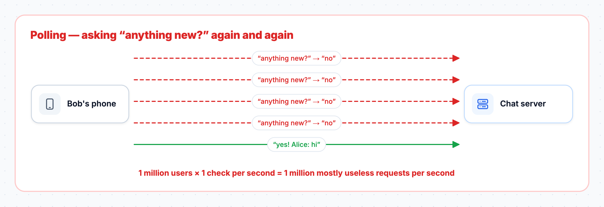

- Bob's app asks "anything new?" every second. Almost every answer is "no".
- With **1 million** online users, that's **1 million requests per second** — nearly all of them useless.
- And it's still slow: a message can wait up to a full second before the next check finds it.

### 💡 The idea: keep a connection open and let the server push

Open a connection **once** and keep it open. When something happens, the server **pushes** it down that open connection immediately:

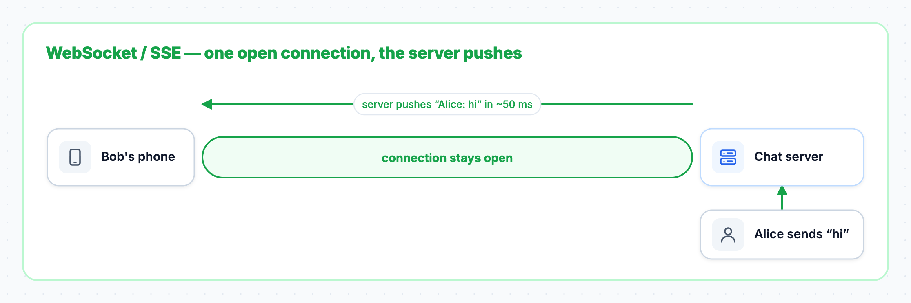

No wasted requests, and the message arrives in milliseconds.

### The four options, from simplest to most powerful

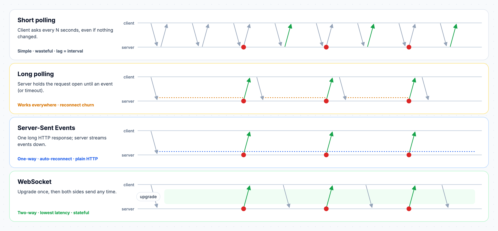

| Approach | How it works | Best for | Watch out |
|----------|--------------|----------|-----------|
| **Short polling** | Client asks every N seconds | Rare updates, simple dashboards | Wasteful; delay = the interval |
| **Long polling** | Server holds each request open until something happens (or a timeout) | A fallback when WebSockets are blocked | Constant reconnecting |
| **SSE** (Server-Sent Events) | One long HTTP response; the server streams events down it | Notifications, live feeds, progress bars, **AI chat answers streaming word by word** | One-way only (server → client) |
| **WebSocket** | Upgrade the connection once; then both sides send any time | Chat, multiplayer games, collaborative editing | Harder to scale (see below) |
| **gRPC streaming** | Two-way streams between services over HTTP/2 | Service-to-service streams | Browsers need a proxy |
| **WebRTC** | Direct peer-to-peer audio/video over UDP | Voice and video calls | Needs extra servers to connect peers behind NAT |

### Scaling WebSockets beyond one server

One server can hold tens of thousands of open connections. But what if Alice is connected to server 1 and Bob to server 3?

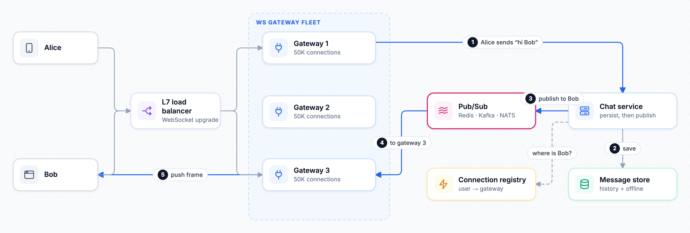

1. Clients connect through an L7 load balancer to a **fleet of WebSocket gateways**.
2. A **connection registry** (Redis) remembers which gateway each user is connected to.
3. The chat service **saves the message first**, then **publishes** it to a pub/sub channel.
4. The gateway holding Bob's connection **pushes** the message to him.
5. If Bob is offline, send a **push notification** instead — the message is already saved.

> [!IMPORTANT]
> **🏛️ Architect's lens** — For real-time systems the number that matters is **concurrent connections**, not requests per second. 10 million online users at ~50,000 connections per gateway ≈ **200 gateways**. Also plan for the **reconnect storm**: after a deploy or outage, millions of clients reconnect at once — add random delays (jitter) to spread them out.

> [!WARNING]
> **Common mistakes** — Using WebSockets for one-way updates (SSE is simpler); no "last seen message" on reconnect, so messages are lost; no heartbeats, so dead connections pile up; one huge channel (a celebrity livestream) overloading a single gateway.

> [!TIP]
> **🎤 Say it in the interview** — Ask: "Do clients send often, or mostly receive?" If mostly receive, propose SSE. For chat, propose WebSocket gateways + pub/sub + a message store, and mention **reconnecting with the last-seen message ID**.

#### ❓ Questions & answers

1. **Why is polling wasteful?** Most requests return "nothing new", yet each one costs the server work — and updates still wait for the next poll.
2. **Why do WebSocket gateways need pub/sub?** Sender and receiver may be connected to different gateways; pub/sub delivers each message to the gateway holding the receiver.
3. **When is SSE better than WebSockets?** When data only flows from server to client (notifications, dashboards, AI answer streaming). It's plain HTTP and reconnects automatically.
4. **What limits a chat gateway?** Memory and open-connection limits — the number of concurrent connections, not CPU per message.

<p align="right"><a href="#table-of-contents">↑ Back to top</a></p>

---

# Chapter 02 · Traffic & Edge

**Spreading load, guarding the front door, and answering requests before they reach the database**

---

### In this chapter

| # | Lesson | One-line idea |
|---|--------|---------------|
| 2.1 | [Load balancing](#21-load-balancing) | Many servers, one address, dead ones quietly removed |
| 2.2 | [Redundancy & clustering](#22-redundancy--clustering) | Active-active vs active-passive |
| 2.3 | [API gateway](#23-api-gateway) | One front door for auth, limits and routing |
| 2.4 | [Rate limiting](#24-rate-limiting) | A polite bouncer for your API |
| 2.5 | [Caching](#25-caching) | Keep hot answers in RAM |
| 2.6 | [Cache policies & pitfalls](#26-cache-policies--pitfalls) | Writes, eviction, stampedes, stale data |
| 2.7 | [CDN](#27-cdn) | Your files, in every city |

---

## 2.1 Load balancing

> **In one sentence:** A load balancer sits in front of many identical servers and spreads the traffic across them — and quietly stops sending users to any server that breaks.

### 🧩 The problem: one server has a limit — and it can die

Your app runs on one server. That server can handle, say, **2,000 requests per second**. Then a marketing campaign brings **10,000 requests per second**:

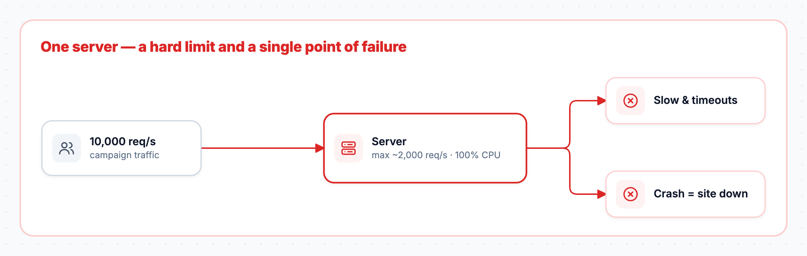

- The server is overloaded: requests queue up, pages slow to a crawl, then time out.
- You can buy a bigger server, but there's always a ceiling — and the biggest machines are very expensive.
- Worse: if that one server crashes, or you restart it to deploy new code, **the whole site is down**.

You could run five servers instead of one. But users type **one** address — how do you split them across five machines? And what happens to users sent to a server that just crashed?

### 💡 The idea: one front door that shares the work

Put a **load balancer** in front of several identical servers. Users only ever see the load balancer's address. It forwards each request to one of the servers behind it:

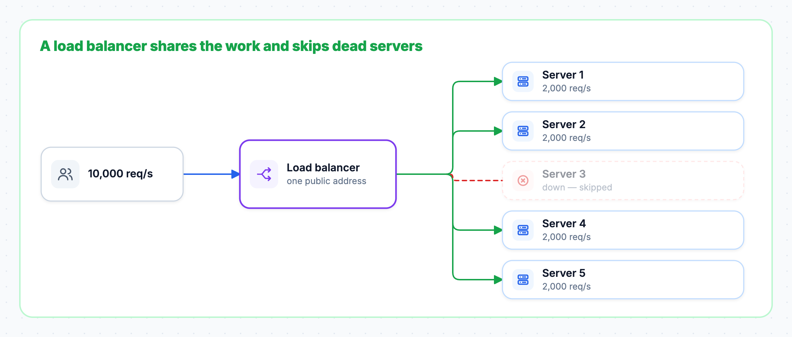

- **Share the work** — 10,000 requests/s over 5 servers is 2,000 each. Need more? Add servers.
- **Hide failures** — the load balancer checks each server every few seconds (a *health check*). A dead server is removed from the rotation and users never notice.
- **Deploy safely** — take servers out one at a time, update them, put them back. No downtime.

### How it works

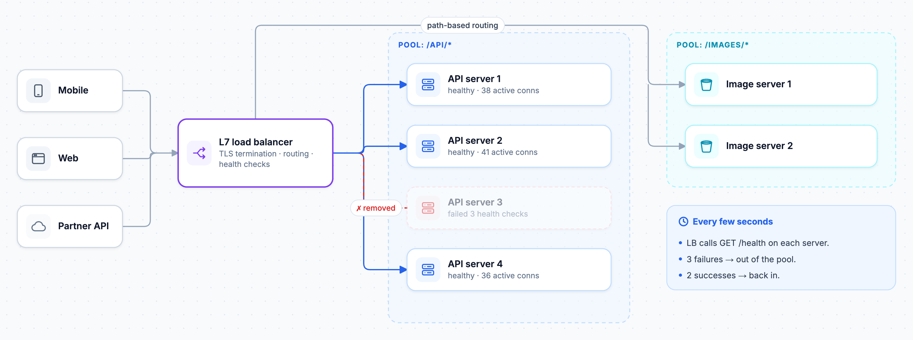


### How it picks a server

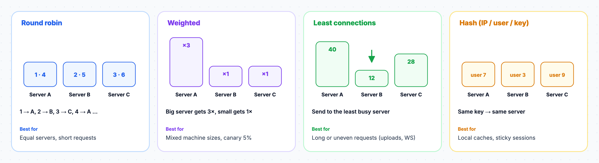

| Algorithm | Idea | Watch out |
|-----------|------|-----------|
| **Round robin** | Take turns | Uneven if requests or servers differ |
| **Weighted round robin** | Bigger servers get more turns; canary gets 5% | Weights drift as fleets change |
| **Least connections** | Send to the least busy | Needs accurate connection counts |
| **Least response time** | Fastest + least busy | Noisy measurements; herd effects |
| **Hash (IP, user, URL)** | Same key → same server | Hot keys; reshuffles when servers change (use consistent hashing) |
| **Random / power of two choices** | Pick two at random, send to the less busy | Surprisingly good at scale |

### Routing styles (L7)

- **Host-based** — `api.shop.com` → API pool, `admin.shop.com` → admin pool.
- **Path-based** — `/payments/*` → payments service, `/images/*` → image servers.
- **Header/cookie-based** — `beta=true` → canary pool; API version → matching service.

### Health checks

- **Active** — the LB calls `GET /health` every few seconds. *N* failures → out; *M* successes → back in.
- **Passive** — the LB notices real requests failing and ejects the server (outlier detection).
- A good health endpoint checks the process **and** critical dependencies — but carefully: if the DB blips and *every* server reports unhealthy, the LB has nowhere to send traffic.

### Sticky sessions — use sparingly

Sticky sessions pin a user to one server (via cookie or IP hash) so in-memory session state works. They fight autoscaling and rolling deploys. **Better:** keep servers **stateless** and store sessions in Redis or a signed token.

> [!IMPORTANT]
> **🏛️ Architect's lens** — Say "stateless app servers behind an L7 load balancer" early in any design. It unlocks horizontal scaling, rolling deploys and auto-healing with one sentence. And remember: a single load balancer is itself a single point of failure — cloud LBs are redundant by default; self-hosted ones need a pair (see 2.2).

> [!WARNING]
> **Common mistakes** — Health checks that mark *all* nodes unhealthy during a dependency blip; no connection draining (users see errors during deploys); sticky sessions everywhere; one hot hash key overloading one server.

> [!TIP]
> **🎤 Say it in the interview** — "Clients hit an L7 load balancer that terminates TLS and routes by path. App servers are stateless, so the pool autoscales. Health checks eject bad instances in about ten seconds."

#### ❓ Questions & answers

1. **Why do sticky sessions conflict with rolling deploys?** When a pinned server is drained or replaced, its users lose in-memory sessions (or can't be moved), so you get logouts or uneven load.
2. **L4 or L7 for path-based routing?** L7 — only it can read the URL path.
3. **How can hash-based balancing still create hotspots?** One very popular key (a celebrity, a viral URL) always maps to the same server, no matter how even the hash is.


---

## 2.2 Redundancy & clustering

> **In one sentence:** Redundancy means running **more than one copy** of every important part, so when one copy fails another takes over — a group of copies working together is called a **cluster**.

### 🧩 The problem: a single point of failure

A **single point of failure (SPOF)** is any part of your system that, if it breaks, takes everything down. A load balancer solves this for app servers — but what about the load balancer itself? And the database?

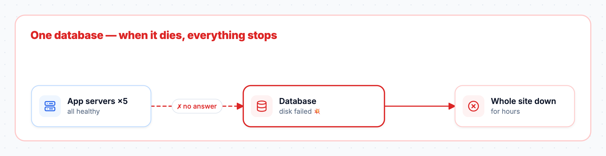

Hardware fails constantly at scale: disks die, power supplies burn out, a whole data center loses power. If you have only one of something, it **will** fail one day — usually at the worst possible moment.

### 💡 The idea: always have a spare ready to take over

Run at least two copies of every critical part, in different places (different machines, different data centers called *availability zones*). When one fails, the other takes over automatically:

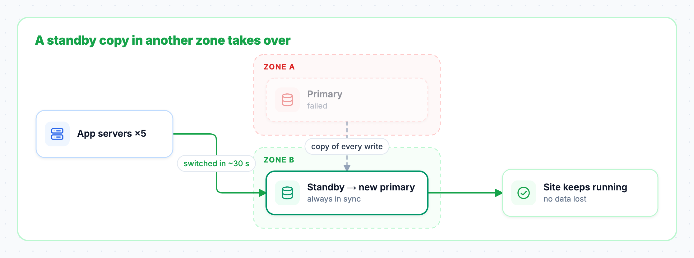

There are two ways to arrange the copies:

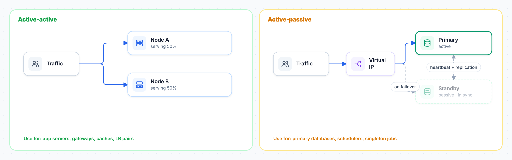


| Mode | Behaviour | Good for | Cost |
|------|-----------|----------|------|
| **Active-active** | Every node serves traffic | Stateless apps, caches, gateways, LB pairs | Shared state must live elsewhere |
| **Active-passive** | Primary serves; standby takes over on failure | Primary databases, schedulers, singleton jobs | Idle capacity; failover takes seconds |

### Load balancing vs clustering

| | Load balancing | Clustering |
|--|----------------|------------|
| Do nodes know each other? | Usually not | Yes — membership, shared state or work |
| Goal | Distribute requests | Cooperate for capacity, availability or compute |
| Together? | Very common: an LB in front of a cluster | |

### Redundant load balancers

A lone self-hosted LB is a single point of failure. Two classic fixes:

- **Active-passive pair with a floating virtual IP (VIP)** — keepalived/VRRP moves the IP to the standby if the primary stops sending heartbeats.
- **Active-active across zones** — DNS or anycast spreads traffic over several LBs.

### Split brain

If the heartbeat link breaks, **both** nodes may think they are the primary and both accept writes. Prevent it with a **quorum** (majority vote), **fencing** (cut off the old primary's access to storage), and **fencing tokens** (see [4.3 Coordination](#43-coordination)).

> [!TIP]
> **🎤 Say it in the interview** — "The app tier is active-active behind the LB. The primary database is active-passive with a synchronous standby in another zone and automatic failover."

#### ❓ Questions & answers

1. **When would you choose active-passive?** For stateful single-writer systems (a primary DB, a leader-elected scheduler) where two active writers would cause conflicts.
2. **How is a cluster different from "three unrelated servers behind NGINX"?** Cluster nodes coordinate — they know who's alive, share or replicate state, and take over each other's work.
3. **What is split brain?** Two nodes both believing they're the primary and both accepting writes, so the data diverges.


---

## 2.3 API gateway

> **In one sentence:** An API gateway is the single front door to all your backend services — it checks who you are, enforces limits and routes each request to the right service, so each service doesn't have to.

### 🧩 The problem: many services, and every client must talk to all of them

As a product grows, the backend splits into many services: users, orders, payments, recommendations… Without a gateway, the mobile app must call each one directly:

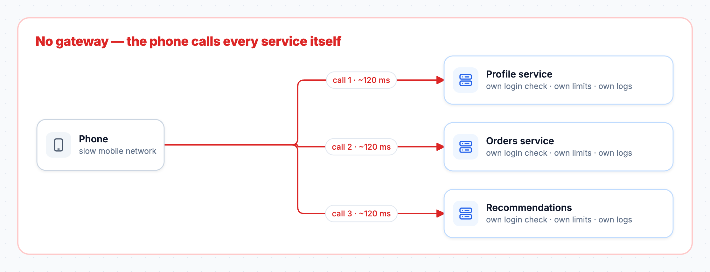

- **Slow on mobile** — the home screen needs 3 calls, and each one crosses a slow mobile network (~120 ms each).
- **Repeated work** — every service must check logins, apply rate limits and write logs — the same code, copied everywhere, with bugs in some copies.
- **Fragile clients** — the app must know every service's address. Split or move a service, and old app versions break.

### 💡 The idea: one front door for everything

Put an **API gateway** in front. The app makes **one** call; the gateway checks the login once, applies limits, then calls the services over the fast network inside the data center and combines the answers:

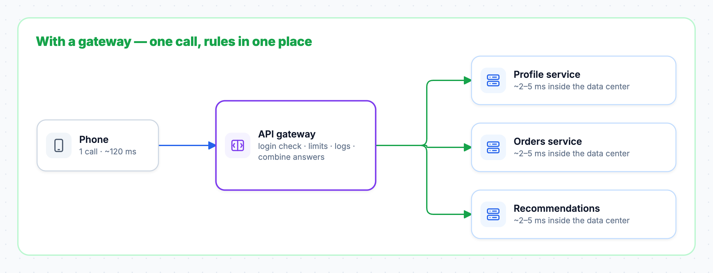


### What it does

| Duty | Example |
|------|---------|
| **Routing** | `/orders/*` → orders service, `/users/*` → user service |
| **Authentication** | Validate the JWT / API key once, pass the user ID downstream |
| **Rate limiting & quotas** | 100 requests/min per free-tier key |
| **Aggregation** | One `/home` call fans out to profile + orders + recommendations |
| **Protocol translation** | Public REST/JSON → internal gRPC |
| **Observability** | Access logs, request IDs, edge metrics |
| **Security** | TLS, WAF rules, IP blocklists, CORS |

### Gateway vs BFF vs service mesh

- **API gateway** — generic front door for all clients (north-south traffic).
- **BFF (Backend for Frontend)** — a gateway-like service shaped for one client, e.g. a *mobile BFF* that returns exactly the home-screen payload.
- **Service mesh** — handles service-to-service (east-west) traffic *inside* the cluster: mTLS, retries, metrics. Not a front door.

### When to use it

- **Use** when you have several backend services, public or partner clients, and shared policies (auth, quotas).
- **Keep it thin (or skip it)** for a single service — an LB plus middleware is enough.
- **Never** put core business logic in the gateway; it becomes a monolith nobody owns.

> [!IMPORTANT]
> **🏛️ Architect's lens** — The gateway sits on **every** request, so it must be boring, fast and highly available (multi-zone, autoscaled). Decide deliberately what happens if the auth provider is down: **fail closed** (safe, users locked out) or **fail open** (available, risky). Cache the JWT signing keys (JWKS) so auth doesn't need a network call per request.

> [!WARNING]
> **Common mistakes** — Business logic creeping into the gateway; aggregation endpoints that return giant payloads; one slow backend exhausting the gateway's worker pool (use timeouts + bulkheads); internal service-to-service calls going *back out* through the public gateway.

> [!TIP]
> **🎤 Say it in the interview** — "Clients → API gateway (auth, rate limit, routing) → services. For mobile, the gateway aggregates the home screen into one call to save round trips on slow networks."

#### ❓ Questions & answers

1. **Three concerns that belong in the gateway, and one that doesn't?** Belong: authentication, rate limiting, routing (also logging, TLS). Doesn't: business rules like pricing or checkout.
2. **How does a mobile BFF differ from a generic gateway?** It is owned by the mobile team and shapes responses for one client's screens, while the gateway enforces shared policy for every client.
3. **What if the gateway calls a flaky auth service synchronously?** Gateway availability drops to at most the auth service's. Validate JWTs locally with cached keys instead, and set timeouts plus a circuit breaker.


---

## 2.4 Rate limiting

> **In one sentence:** Rate limiting caps how many requests each user, API key or IP address may make in a period — so one noisy or malicious client can't take the service down for everyone else.

### 🧩 The problem: one client can drown everyone else

Your API serves thousands of well-behaved users. Then one client — a buggy script stuck in a loop, a scraper, or an attacker guessing passwords — starts sending **10,000 requests per second**:

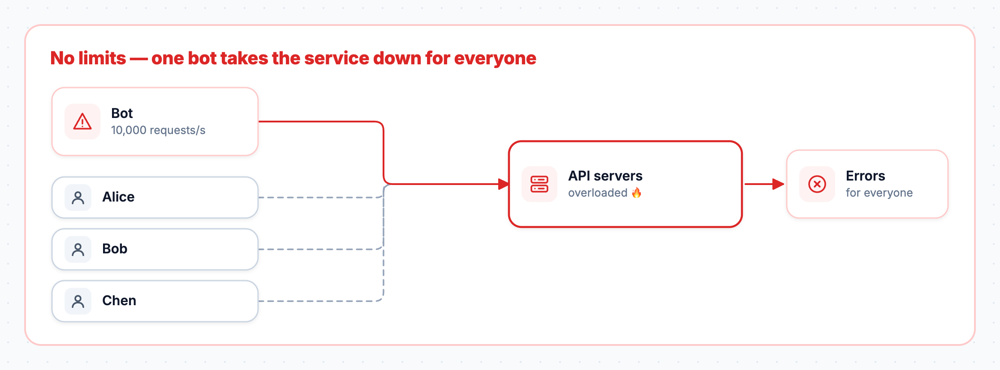

- The servers and database spend all their capacity on that one client.
- Everyone else gets slow pages and errors.
- Your cloud bill spikes, and if the target is `/login`, the attacker gets millions of password guesses.

### 💡 The idea: give each client a fair allowance

Count requests **per client** and reject anything over the limit with **HTTP 429 "Too Many Requests"** — before it reaches your servers:

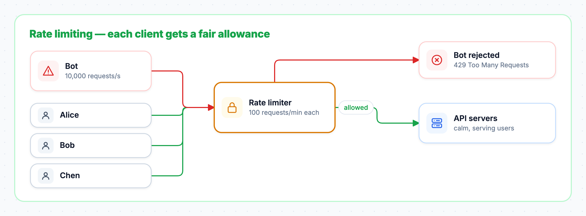

The most common way to count is the **token bucket**: each client has a bucket of tokens that refills at a steady rate; each request spends one token; an empty bucket means "wait":

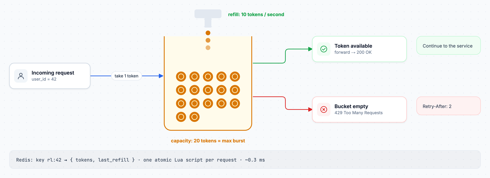


### Why

- Protect shared resources (databases, third-party APIs) from overload.
- Stop abuse: credential stuffing on `/login`, scraping, spam.
- Enforce business plans: free tier 100 req/min, paid tier 10,000.
- Keep costs predictable (expensive AI or search endpoints).

### Algorithms

| Algorithm | How it works | Pros | Cons |
|-----------|--------------|------|------|
| **Token bucket** | Tokens refill at rate *r* up to capacity *b*; each request spends one | Allows controlled bursts; tiny state; the industry default | Two numbers to tune |
| **Leaky bucket** | Requests leave a queue at a constant rate | Smooth output to a fragile downstream | Adds queueing delay |
| **Fixed window** | Count per calendar minute | Simplest possible counter | Allows 2× bursts at window edges |
| **Sliding window log** | Keep a timestamp per request | Exact | Memory-heavy |
| **Sliding window counter** | Weighted mix of current and previous window | Accurate and cheap | Approximate |

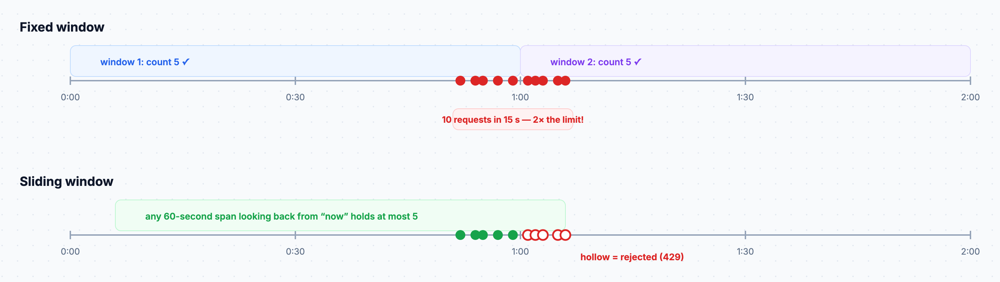

### Where to enforce

1. **Edge / gateway** — cheap, coarse limits (per IP, per API key). Rejects junk early.
2. **Service** — business quotas ("5 password resets per hour per account").
3. **Before fragile downstreams** — protect a legacy DB or a third-party API with its own limit.

### Distributed rate limiting

With 50 gateway nodes, counters must be shared: store them in **Redis**, and update with an **atomic Lua script** or `INCR` + `EXPIRE`. At huge scale, keep **local counters** and sync periodically, accepting slight inaccuracy.

### Be a good API citizen

Return **`429 Too Many Requests`** with a `Retry-After` header, plus `RateLimit-Limit` / `RateLimit-Remaining` headers so clients can back off gracefully.

> [!IMPORTANT]
> **🏛️ Architect's lens** — Decide what happens when the limiter's Redis is down. **Fail open** keeps the product available but unprotected; **fail closed** protects the backend but causes an outage. Most consumer APIs fail open with an alert; login and payment endpoints often fail closed.

> [!TIP]
> **🎤 Say it in the interview** — "Token bucket per user ID in Redis via a Lua script, enforced at the gateway. Return 429 with Retry-After. If Redis is down we fail open for reads and alert." Full design: [Case study · Rate limiter](#case-study-02--rate-limiter).

#### ❓ Questions & answers

1. **Why do fixed windows allow bursts at the edges?** A client can send the full limit at 0:59 and again at 1:00 — double the rate within two seconds.
2. **Fail open or fail closed when the limiter store is down?** It depends on the endpoint: fail open for general reads (availability), fail closed for login/payments (security). Either way, alert.
3. **How to rate-limit a fleet without a single Redis?** Give each node a local bucket with a share of the global limit and rebalance shares periodically, or shard counters by key across a Redis cluster.


---

## 2.5 Caching

> **In one sentence:** A cache keeps a copy of frequently requested data in fast memory, so repeated requests get an instant answer instead of doing the slow work (usually a database query) again.

### 🧩 The problem: the database answers the same question 10,000 times

Your shop's home page shows the same 20 popular products to everyone. Every visit runs the same database query. With 10,000 visitors a minute:

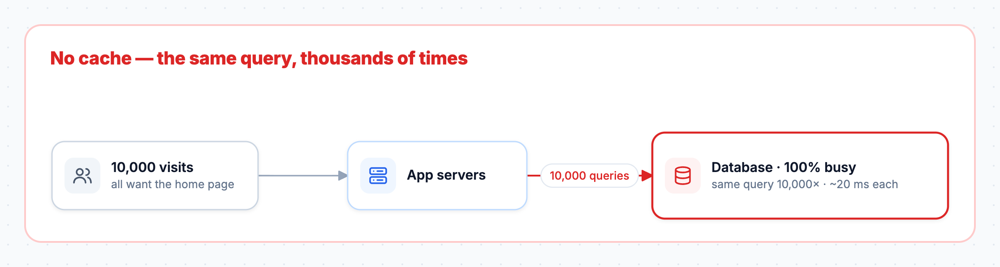

- The database runs the **exact same query** thousands of times, getting the exact same answer.
- It's working at 100% on repeated work, so everything else (checkouts, sign-ups) slows down too.
- Each query takes ~5–50 ms, so every page pays that cost.

### 💡 The idea: remember the answer

Save the answer in a **cache** — a store that keeps data in memory (RAM), like Redis. The first request asks the database and saves the answer; the next 9,999 get it from memory in about **0.3 ms**:

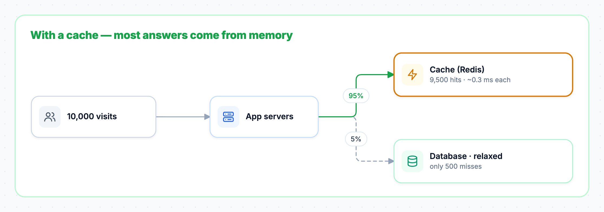

With a 95% **hit ratio** (95% of requests found in the cache), the database does **20× less** work, and those requests are 10–100× faster. Few changes give a bigger win for less effort.

### How it works: the cache-aside pattern

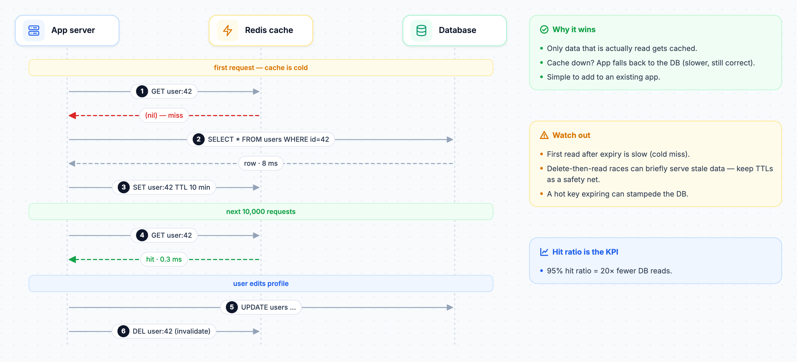


### Where caches live

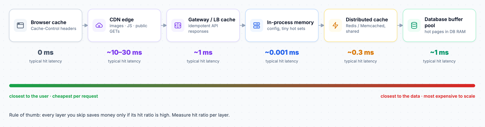

| Layer | Holds | Notes |
|-------|-------|-------|
| **Browser** | Static files, some API GETs | Controlled by `Cache-Control` / `ETag` headers |
| **CDN** | Images, JS, video, public API responses | See [2.7](#27-cdn) |
| **In-process memory** | Config, feature flags, tiny hot sets | Fastest; not shared between servers; lost on restart |
| **Distributed cache** | Sessions, user profiles, computed results | Redis / Memcached; shared by all app servers |
| **Database buffer pool** | Hot pages | Automatic |

### Read strategies

| Strategy | How | When |
|----------|-----|------|
| **Cache-aside (lazy loading)** | App checks cache → on miss reads DB → writes cache | The default for most apps |
| **Read-through** | Cache library loads from DB on miss | Uniform access through a caching layer |
| **Refresh-ahead** | Refresh popular keys before they expire | Predictable hot keys (home page) |

### Designing a cache entry

Every cache decision needs three answers:

1. **Key** — include everything that changes the answer: `user:42:profile:v3`, `feed:42:page:1`. Never forget the user or tenant ID for private data.
2. **TTL** — how stale may it be? Seconds for prices, hours for product descriptions.
3. **Invalidation** — delete or update the key when the source data changes, and keep the TTL as a safety net.

### When NOT to cache

- Data that changes on every request, or must be exactly current (the last seat on a flight at booking time).
- Data that is never read twice.
- When the cache is barely faster than the source.
- Private data on a shared edge without proper cache keys — a classic data leak.

> [!IMPORTANT]
> **🏛️ Architect's lens** — A cache is a **performance** tool, never the source of truth. The system must stay *correct* (just slower) if the cache is empty or down. Size the cache for the **working set** (the data read in the last hour or day), not the whole dataset, and track **hit ratio** as a first-class metric.

> [!TIP]
> **🎤 Say it in the interview** — Never just say "add Redis". Say: "Cache-aside in Redis, key `product:{id}`, TTL 10 minutes, deleted on update. Expect a 90%+ hit ratio because reads outnumber writes 100 to 1."

#### ❓ Questions & answers

1. **Cache-aside vs write-through for a profile service?** Cache-aside caches only profiles people actually read and survives cache outages. Write-through keeps them fresh right after edits but slows every write and caches profiles nobody reads.
2. **How do you stop a viral key from melting the DB when it expires?** Single-flight locking, serving stale while refreshing, jittered TTLs, or refresh-ahead for known hot keys (see 2.6).
3. **When should private user data not sit on a shared CDN edge?** When the cache key doesn't include the user's identity, or responses aren't marked `private` — one user could be served another's data.


---

## 2.6 Cache policies & pitfalls

> **In one sentence:** A cache is easy to add and easy to get wrong — you must decide what happens on **writes**, what to throw out when it's **full**, and how to survive **everyone missing at once**.

### 🧩 The problem: stale data, full memory and sudden floods

Once a cache is in place, three new questions appear:

1. **Stale data** — a product's price changes in the database, but the cache still shows the old price. Who fixes the cache, and when?
2. **Full memory** — RAM is limited. When the cache is full, what gets thrown out to make room?
3. **Sudden floods** — the most popular item's cache entry expires, and 10,000 requests hit the database at the same instant.

Get these wrong and a cache causes outages instead of preventing them. The answers are below.


### Write policies

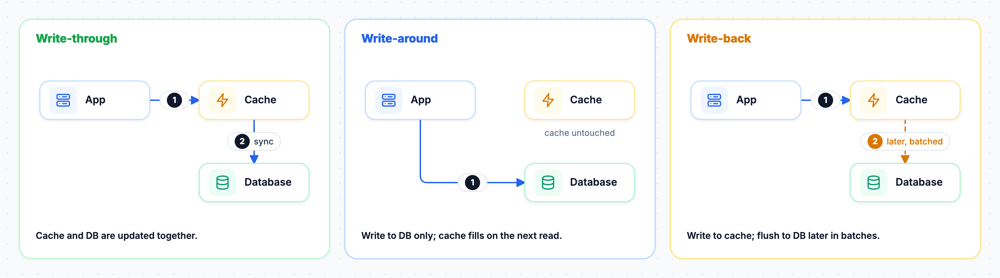

| Policy | Behaviour | Upside | Downside |
|--------|-----------|--------|----------|
| **Write-through** | Write cache and DB together | Cache always fresh | Slower writes; caches unread data |
| **Write-around** | Write DB only; cache fills on next read | Cache not polluted | First read after a write misses |
| **Write-back (write-behind)** | Write cache now; flush DB later | Fastest writes; absorbs spikes | Cache crash = **lost data** |

### Eviction policies

| Policy | Evicts… | Use |
|--------|---------|-----|
| **LRU** | Least recently used | The sensible default |
| **LFU** | Least frequently used | Stable hot sets (popular products) |
| **FIFO** | Oldest inserted | Simple buffers |
| **TTL-based** | Expired entries | Always combine with one of the above |
| **Random** | A random entry | Cheap approximation for huge caches |

### The four classic pitfalls

**The stampede, in pictures.** A popular key expires, and thousands of requests miss at the same moment:

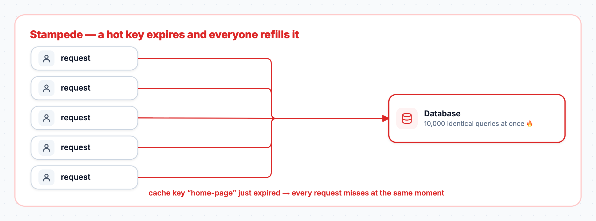

The fix is **single-flight**: only the first request refills the key; the others wait a few milliseconds or get the slightly old value:

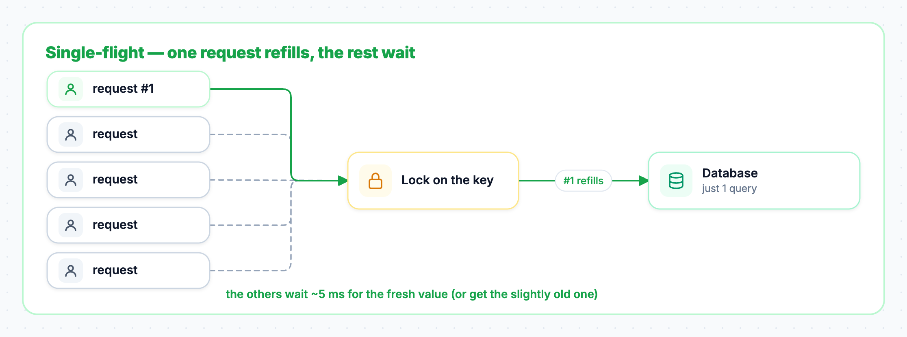

| Pitfall | What happens | Fix |
|---------|--------------|-----|
| **Stampede / thundering herd** | Hot key expires; thousands of requests hit the DB at once | Single-flight lock, serve stale while refreshing, probabilistic early refresh |
| **Penetration** | Requests for keys that don't exist always miss and hit the DB (often an attack) | Cache "not found" briefly; Bloom filter of valid keys |
| **Avalanche** | Many keys expire at the same moment (e.g. all set at deploy) | Add random jitter to TTLs; warm the cache gradually |
| **Hot key** | One key gets a huge share of traffic and overloads one cache node | Replicate the key, add a local in-process cache, split into sub-keys |

### Distributed cache topologies

- **Client-side sharding** — the app hashes keys to nodes ([consistent hashing](#310-consistent-hashing)).
- **Proxy / cluster mode** — Redis Cluster or a proxy (Twemproxy, Envoy) routes keys for you.
- **Replication** — add replicas for read throughput and failover; cache data is still **disposable**.

> [!TIP]
> **🎤 Say it in the interview** — "To avoid a stampede on the celebrity profile I'd use single-flight on refill, add TTL jitter, and keep a tiny in-process cache on each app server for the top 100 keys."

#### ❓ Questions & answers

1. **Which write policy risks losing data, and why?** Write-back — acknowledged writes sit only in cache memory until flushed.
2. **What is cache penetration and one defense?** Repeated lookups for non-existent keys that bypass the cache. Cache the negative result for a short TTL, or check a Bloom filter first.
3. **Why add jitter to TTLs?** So keys written at the same time don't all expire at the same instant and flood the database (avalanche).


---

## 2.7 CDN

> **In one sentence:** A CDN (Content Delivery Network) keeps copies of your images, videos and files in hundreds of cities around the world, so every user downloads from somewhere close by.

### 🧩 The problem: the world is big, and light is slow

Your servers are in Virginia, USA. A user in Tokyo opens your site, which has 50 images and a video:

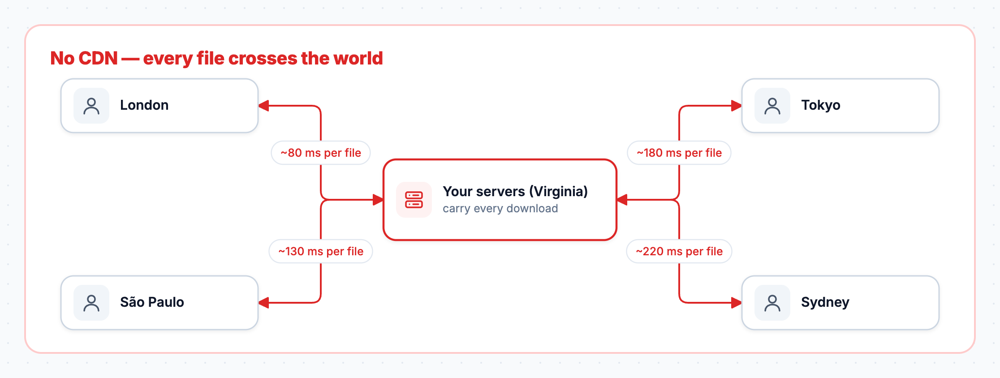

- Each request crosses the Pacific and back: **~150–200 ms** just for the trip, before any work — multiplied by dozens of files.
- Every image for every user worldwide comes from **your** servers, so they carry the entire load.
- Sending data out of a cloud (called *egress*) is expensive — a video-heavy site pays huge bills.

### 💡 The idea: copies of your files, near every user

A CDN has servers (called **edge locations** or **PoPs**) in hundreds of cities. The first user in Tokyo who asks for an image gets it from your server; the Tokyo edge **keeps a copy**, and every later user in Tokyo gets it from there in **~20 ms**:

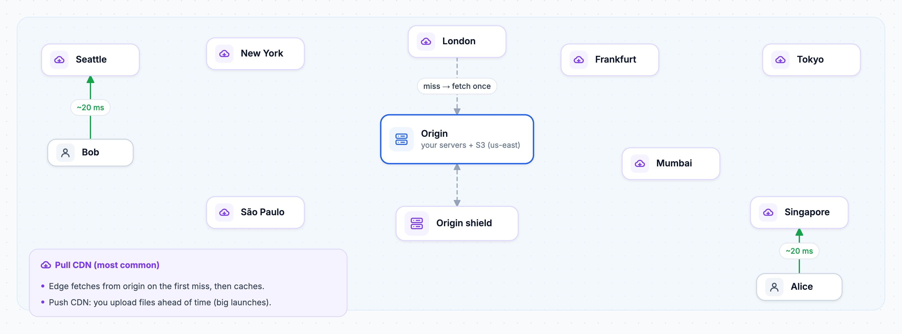

- **Faster** — files travel a few kilometers instead of across an ocean.
- **Lighter** — your servers send each file once per city instead of once per user.
- **Cheaper and safer** — CDN delivery costs less than cloud egress, and a CDN absorbs traffic spikes and attacks.


### How it works

1. `images.shop.com` points (via DNS or anycast) to the CDN.
2. The user reaches the nearest **edge location (PoP)**.
3. **Hit** → served immediately (~10–30 ms). **Miss** → the edge fetches from your **origin** once, caches it, and serves everyone after that.

### Pull vs push

| | Pull CDN | Push CDN |
|--|----------|----------|
| How content arrives | Edge fetches from origin on first miss | You upload content to the CDN ahead of time |
| Effort | Minimal | You manage what lives on the edge |
| Best for | Most websites, long-tail content | Big planned launches, large stable files (game patches) |

### Controls that matter

- **`Cache-Control`** — `max-age` (browser), `s-maxage` (CDN), `public` vs `private`, `immutable`.
- **Versioned file names** — `app.3f9a2c.js` lets you cache "forever" and deploy instantly.
- **Purge / invalidation API** — for emergencies (a leaked image, a broken file).
- **Signed URLs / cookies** — time-limited access to private content (paid videos, user uploads).
- **Origin shield** — one mid-tier cache in front of the origin, so 300 edges don't all miss at once.
- **Edge compute** — small functions at the edge (redirects, A/B tests, auth checks).

> [!IMPORTANT]
> **🏛️ Architect's lens** — For media-heavy products (video, images) the CDN is often the **biggest line on the cloud bill** and also the biggest saving: serving from the CDN is far cheaper than egress from your origin, and it absorbs traffic spikes and DDoS attacks. Negotiate CDN pricing early at scale.

> [!TIP]
> **🎤 Say it in the interview** — "Static assets and media go through a pull CDN with versioned file names. Private media uses signed URLs with a short expiry. An origin shield protects S3 from miss storms."

#### ❓ Questions & answers

1. **Why use versioned file names instead of purging?** Each deploy creates a new URL, so caches can keep old files forever and users get new ones immediately — no purge delay.
2. **What does an origin shield prevent?** Hundreds of edges simultaneously missing and hammering the origin for the same object.
3. **How do you serve paid videos through a CDN securely?** Signed URLs (or cookies) with short expiry, scoped to the user/content, checked at the edge.


<p align="right"><a href="#table-of-contents">↑ Back to top</a></p>

---

# Chapter 03 · Data

**Where the truth lives — and how to keep it fast, correct and safe as it grows**

---

### In this chapter

| # | Lesson | One-line idea |
|---|--------|---------------|
| 3.1 | [Storage fundamentals](#31-storage-fundamentals) | Block, file, object — and why RAID isn't a backup |
| 3.2 | [Choosing a database](#32-choosing-a-database) | Start from access patterns, not brands |
| 3.3 | [Normalization vs denormalization](#33-normalization-vs-denormalization) | One home per fact vs copies for speed |
| 3.4 | [ACID and BASE](#34-acid-and-base) | Correct per transaction vs available at scale |
| 3.5 | [Transactions & isolation](#35-transactions--isolation) | Stop two buyers taking the last seat |
| 3.6 | [Distributed transactions](#36-distributed-transactions) | Sagas beat two-phase commit |
| 3.7 | [Indexes](#37-indexes) | Jump, don't scan |
| 3.8 | [Replication](#38-replication) | Copies for safety and read scale |
| 3.9 | [Sharding](#39-sharding) | Split one database into many |
| 3.10 | [Consistent hashing](#310-consistent-hashing) | Add a node, move only a slice |
| 3.11 | [Federation](#311-federation) | Split by domain, not by key |
| 3.12 | [CAP & PACELC](#312-cap--pacelc) | What users see when the network breaks |
| 3.13 | [Geospatial indexes](#313-geospatial-indexes) | Geohash and quadtrees for "near me" |

> **Why this chapter matters:** app servers are easy to scale — just add more. **Data is the hard part.** Almost every deep-dive question in an interview ends up here.

---

## 3.1 Storage fundamentals

> **In one sentence:** Storage is where data lives when the power goes off — and the right kind depends on what you store: databases want fast **block** disks, shared folders want **file** storage, and photos, videos and backups belong in cheap **object** storage.

### 🧩 The problem: files saved on one server's disk

A beginner's app saves user uploads (profile photos, documents) straight onto the app server's own hard disk. It works — until the app grows:

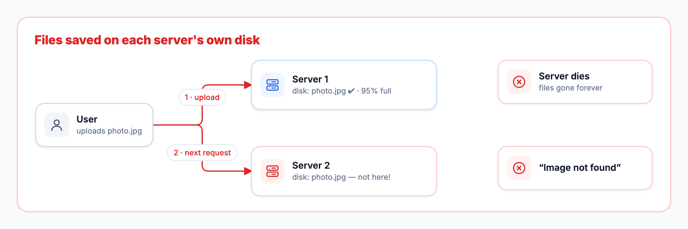

- You add a second app server. A user uploads a photo to server 1, then their next request lands on server 2 — **the photo isn't there**.
- The disk fills up. Adding space means downtime.
- The server dies, and **every file on it is gone**.
- Some teams try the opposite: store the photos **inside the database**. Now the database is huge, slow to back up, and expensive per gigabyte.

### 💡 The idea: the right storage for each kind of data

Keep **small structured data** (who uploaded what, when) in the database, and put the **big files themselves** in **object storage** (like Amazon S3): a service every server can reach over HTTP, that stores unlimited files cheaply and keeps multiple copies so nothing is lost:

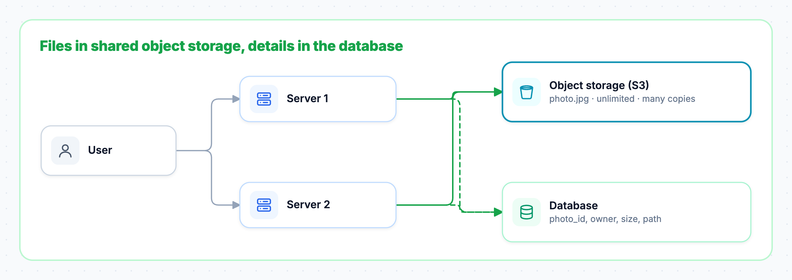

### The three kinds of storage

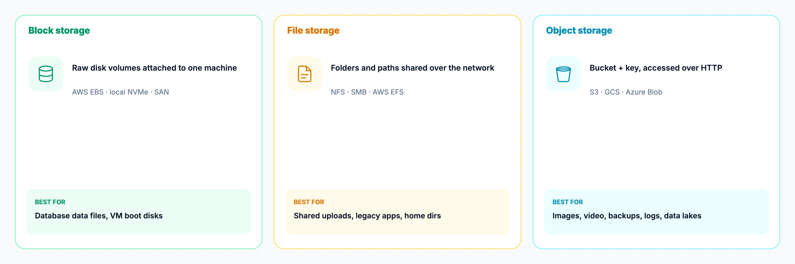


| Type | Interface | Typical use | Cloud example |
|------|-----------|-------------|---------------|
| **Block** | Raw volume, like a local disk | Database data files, VM disks | EBS, Persistent Disk |
| **File** | Folders and paths (NFS/SMB) | Shared uploads, legacy apps | EFS, Filestore |
| **Object** | `PUT/GET bucket/key` over HTTP | Images, video, backups, logs, data lakes | S3, GCS, Azure Blob |

### RAID in one table

RAID combines disks for speed and/or survival. Cloud disks hide it, but the vocabulary still comes up:

| Level | Idea | Survives | Note |
|-------|------|----------|------|
| **0** | Striping | Nothing | Fast; one disk dies → all data gone |
| **1** | Mirroring | 1 disk | Simple; half the capacity |
| **5** | Striping + parity | 1 disk | ≥ 3 disks; slow rebuilds |
| **6** | Double parity | 2 disks | Safer rebuilds |
| **10** | Mirrors, then striped | 1 per mirror | Popular for databases |

> [!WARNING]
> **RAID is not a backup.** It survives a *disk* dying, not a bad `DELETE`, ransomware, a bug that corrupts data, or the whole machine burning. Backups (and tested restores) are separate.

> [!TIP]
> **🎤 Say it in the interview** — "Metadata in the database, bytes in object storage, and clients upload directly with signed URLs." That one sentence covers most media designs.

#### ❓ Questions & answers

1. **Why isn't RAID a substitute for backups?** It only protects against disk failure. Logical errors, deletes and corruption are faithfully mirrored to every disk.
2. **When pick object storage over a file share?** Large, immutable, web-served or archival data at scale — photos, video, logs, backups — where HTTP access and low cost matter more than POSIX semantics.
3. **Why not store images inside the database?** It bloats the DB, slows backups and replication, and costs far more per GB than object storage. Plus a CDN can't cache it easily.


---

## 3.2 Choosing a database

> **In one sentence:** There is no "best" database — each type is built for a different way of reading and writing data, so you start from **how your app uses the data** and pick the store that fits.

### 🧩 The problem: one database forced to do every job

Many systems start with one database and push everything into it: user accounts, orders, full-text search, chat messages, click logs, session data, analytics reports…

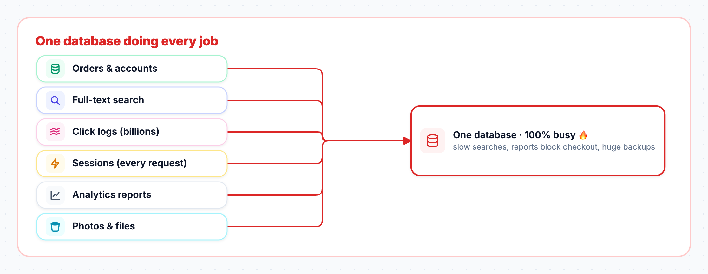

- **Search is painfully slow** — `WHERE name LIKE '%red shoe%'` scans millions of rows.
- **Analytics reports** run huge scans that slow down checkout for real customers.
- **Click logs** grow by billions of rows and bloat backups.
- **Sessions** are read on every request and hammer the database for data that isn't even important.

The database becomes the bottleneck for everything, and one heavy job hurts all the others.

### 💡 The idea: pick the right tool for each job

Different databases are optimized for different **access patterns** (the way data is read and written). Keep one reliable source of truth, and add specialists only where a job clearly needs one:

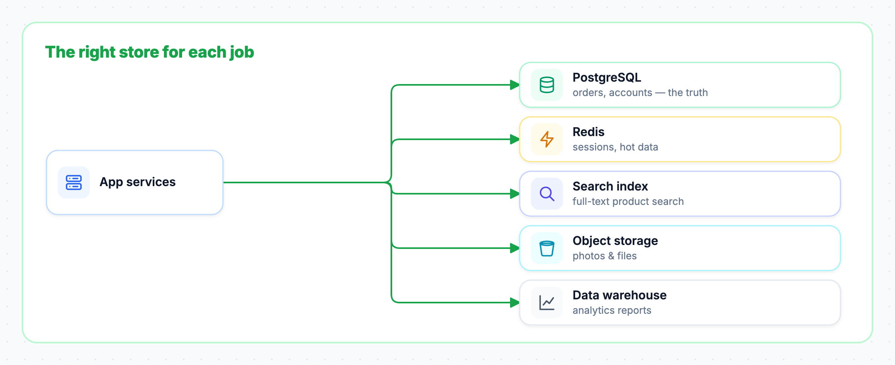

### How to choose

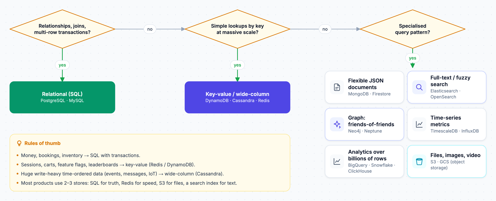


### SQL vs NoSQL

| | SQL (relational) | NoSQL (family of stores) |
|--|------------------|--------------------------|
| Shape | Tables with a fixed schema | Key-value, document, wide-column, graph |
| Queries | Rich SQL, joins, ad-hoc reporting | Mostly by key or partition |
| Transactions | Strong multi-row ACID | Varies; often per item or partition |
| Scaling story | Vertical → read replicas → sharding (hard) | Often built for horizontal scale |
| Best at | Relationships and invariants | One access pattern at huge scale |

### The NoSQL families

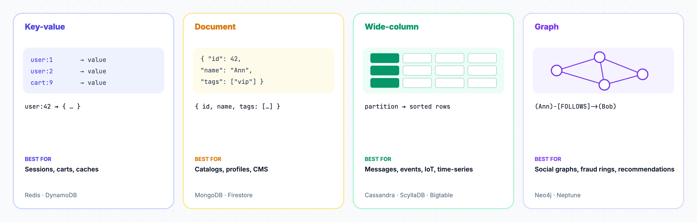

- **Key-value** (Redis, DynamoDB) — get/put by key at extreme speed: sessions, carts, feature flags, leaderboards.
- **Document** (MongoDB, Firestore) — whole JSON objects read together: catalogs, profiles, content. Watch for unbounded arrays inside documents.
- **Wide-column** (Cassandra, ScyllaDB, Bigtable) — huge write throughput, queried by partition key: messages, events, IoT, time series. **Design the table around the query.**
- **Graph** (Neo4j, Neptune) — multi-hop relationships: "friends of friends who like jazz", fraud rings.

### Other specialists

| Need | Store |
|------|-------|
| Full-text / fuzzy search, facets | Elasticsearch / OpenSearch (never the source of truth) |
| Metrics and time series | TimescaleDB, InfluxDB, Prometheus |
| Analytics over billions of rows (OLAP) | BigQuery, Snowflake, ClickHouse, Redshift |
| Vector similarity (AI embeddings) | pgvector, Pinecone, Weaviate |
| Large files | Object storage |

### OLTP vs OLAP

- **OLTP** (online transaction processing) — many small reads and writes: "get order 42", "insert a payment". Your app database.
- **OLAP** (online analytical processing) — few huge scans: "revenue by country for 2025". A data warehouse, fed by ETL or a change stream.

Never run heavy analytics on your production primary — it will starve real users.

### The N+1 query problem

An ORM loads 50 posts (1 query), then the author of each post (50 more queries). Fix with a join, a batch loader (`WHERE id IN (…)`), or a precomputed read model.

> [!IMPORTANT]
> **🏛️ Architect's lens** — "Postgres until proven otherwise" is a respected default: transactions, JSON columns, full-text search, geospatial (PostGIS) and vector search (pgvector) in one mature, well-understood system. Every additional database is another thing to back up, monitor, secure, upgrade and hire for.

> [!TIP]
> **🎤 Say it in the interview** — "PostgreSQL as the source of truth, Redis for caching, S3 for media, OpenSearch for text search." Then justify any NoSQL with a concrete access pattern: "Messages are write-heavy and always read by conversation, so Cassandra partitioned by `conversation_id`."

#### ❓ Questions & answers

1. **Why is a search index usually not the system of record?** It's updated asynchronously, can lag or be rebuilt, and lacks transactional guarantees. The DB stays the truth and the index is derived from it.
2. **Give a query that needs relational joins.** "All orders over $100 in March from customers in Germany, with their product names" — it spans orders, customers and products.
3. **What breaks if a document grows without bound?** Reads and writes slow down, documents hit size limits (16 MB in MongoDB), and every update rewrites a huge object. Move the growing list into its own collection.


---

## 3.3 Normalization vs denormalization

> **In one sentence:** **Normalization** means storing each fact in exactly one place so it can never contradict itself; **denormalization** means copying facts on purpose so a screen can load with a single fast read.

### 🧩 The problem: the same fact copied everywhere starts to disagree

Imagine storing orders in one big spreadsheet-style table, with the customer's address copied onto every order row:

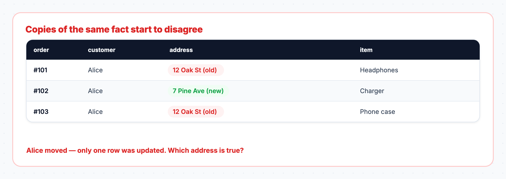

Alice moves house and updates her address — but only one row gets updated. Now the database says Alice lives in **two places at once**. Which one is true? Nobody knows, and her next parcel goes to the wrong house.

### 💡 The idea: one home for every fact — then copy on purpose, only where it's worth it

**Normalize:** store Alice's address once, in a `customers` table, and have orders **point** to her by ID. Change it once, and it's correct everywhere.

But joining tables on every read has a cost at scale — a news feed that joins 50 posts with 50 authors on every screen load gets slow. So for read-heavy screens you **denormalize deliberately**: keep a ready-to-show copy, and update it whenever the original changes.

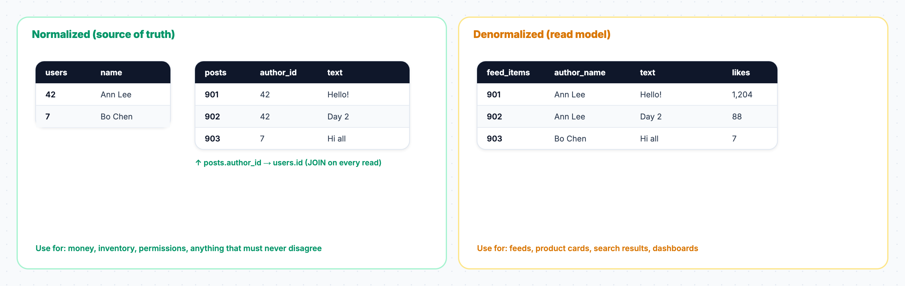


### Why normalize — the three anomalies

Picture one wide spreadsheet of employees and their teams:

- **Insert anomaly** — you can't add a new team until someone joins it.
- **Update anomaly** — rename a team in one row, forget the others → contradictions.
- **Delete anomaly** — remove the last person on a team and the team's facts vanish too.

### Normal forms, in one line each

| Form | Gut check |
|------|-----------|
| **1NF** | Each cell holds one value — no lists stuffed in a column |
| **2NF** | No column depends on only *part* of a composite key |
| **3NF** | No column depends on another non-key column |

### When to denormalize

Read-heavy screens — home feeds, product cards, dashboards — store a **ready-to-render** row: the author's name next to the post, the price next to the order line. You pay with:

- more complex writes (update every copy, usually asynchronously),
- a window where copies are stale,
- more storage.

**Common tools:** cache entries, materialized views, document aggregates, [CQRS read models](#66-cqrs).

> [!IMPORTANT]
> **🏛️ Architect's lens** — Normalize the **write model** (the source of truth). Denormalize **read models** that you can always rebuild from it. Never denormalize money, inventory or permissions — two versions of those truths is a business incident.

> [!TIP]
> **🎤 Say it in the interview** — "Posts and users are normalized in Postgres. A fan-out worker writes denormalized feed entries — with author name and avatar — into Redis, so the feed loads with one read."

#### ❓ Questions & answers

1. **Give an update anomaly in one sentence.** A customer's address is stored on every order row; they move, you update only some rows, and now they have two addresses.
2. **Why might a feed denormalize author names?** To render each item without a join per post. Feeds are read thousands of times more often than names change.
3. **Does denormalization mean undoing normalization?** No. You keep a normalized source of truth and *add* derived, denormalized copies for specific reads.


---

## 3.4 ACID and BASE

> **In one sentence:** **ACID** is a database's promise that a group of changes happens **completely or not at all**, stays valid, doesn't collide with others and survives crashes; **BASE** relaxes that promise to gain speed and availability at huge scale.

### 🧩 The problem: a crash halfway through a money transfer

Alice sends Bob $100. That's two steps: take $100 from Alice, add $100 to Bob. Now imagine the server crashes **between** the two steps:

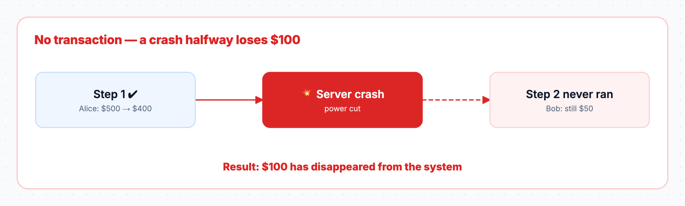

Alice lost $100, Bob never got it — the money simply vanished. Now multiply that by thousands of transfers a second, crashes, power cuts and two transfers touching the same account at once. Without guarantees, a database slowly fills with wrong numbers.

### 💡 The idea: a transaction — all or nothing

Group both steps into one **transaction**. The database guarantees it either **commits** both steps together or **rolls back** as if nothing happened — even if the power fails in the middle:

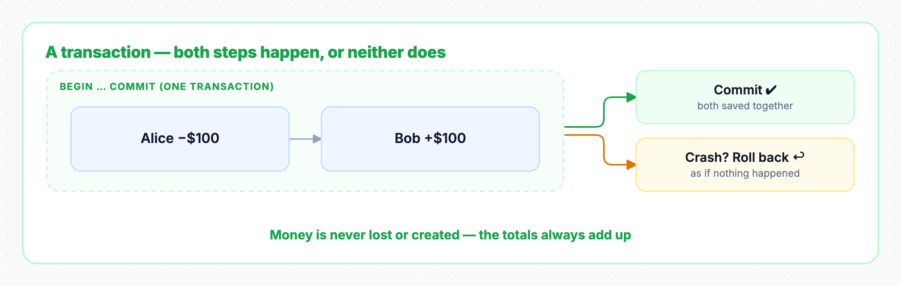

That guarantee has four parts, remembered as **ACID**. Some huge distributed databases relax it for speed and availability — that style is called **BASE**:

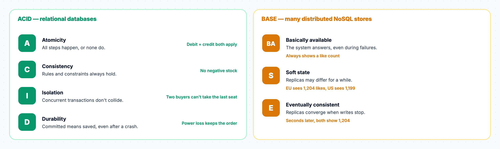


### Don't confuse the two "C"s

- **ACID consistency** — the database's *rules* hold after every transaction (constraints, foreign keys, balances never negative).
- **CAP consistency** — every node returns the *latest* value (linearizability) across a distributed system.

You can have a perfectly ACID primary and still face CAP choices the moment you replicate across regions.

| Lean ACID | Lean BASE |
|-----------|-----------|
| Ledgers, payments, bookings, inventory reservations | Like counts, view counts, activity feeds, product catalog reads |
| One wrong answer is a real incident | Seconds of staleness is invisible |

> [!WARNING]
> **Common mistakes** — Assuming "NoSQL means no transactions" (DynamoDB, MongoDB and others now offer them within limits); assuming "eventual" means "users never notice" (they do, if they read their own write from a stale replica).

> [!TIP]
> **🎤 Say it in the interview** — "Checkout uses an ACID transaction on inventory. The like counter is eventually consistent — it's fine if it lags a few seconds."

#### ❓ Questions & answers

1. **Expand ACID in your own words.** All or nothing; rules always hold; parallel transactions don't see each other's half-work; once committed, it survives crashes.
2. **How does ACID's C differ from CAP's C?** ACID-C is about data validity rules within a DB. CAP-C is about all replicas returning the latest write.
3. **Name a feature that tolerates BASE lag.** Follower counts, view counts, "who's online", recommendation lists.


---

## 3.5 Transactions & isolation

> **In one sentence:** A transaction groups several steps into one all-or-nothing unit, and **isolation** controls what happens when many transactions touch the same data at the same moment.

### 🧩 The problem: two people change the same thing at the same time

A database serves thousands of users at once. Most of the time they touch different data. But sometimes two requests read and change **the same row** in the same instant — the last seat on a flight, the last item in stock, the same bank account. If the database lets them interleave freely, one change silently overwrites the other (a **race condition**). The example below shows exactly this.

### 💡 The idea: transactions plus the right level of isolation

A **transaction** makes a group of steps all-or-nothing. **Isolation** decides how much concurrent transactions can see of each other's unfinished work — from "loose and fast" to "as if they ran one at a time". For the few hot rows that really matter, you add explicit protection.


```sql
BEGIN;
  SELECT stock FROM tickets WHERE id = 7 FOR UPDATE;   -- lock the row
  UPDATE tickets SET stock = stock - 1 WHERE id = 7;
  INSERT INTO orders (ticket_id, user_id) VALUES (7, 42);
COMMIT;   -- or ROLLBACK on any error
```

Without the transaction, a crash between steps could leave a ticket sold with no order, or an order with no ticket.

### The race every booking system must prevent

One ticket is left. Alice and Bob click **Buy** at the same moment. Both read "1 left", both buy — and you've sold a ticket that doesn't exist:

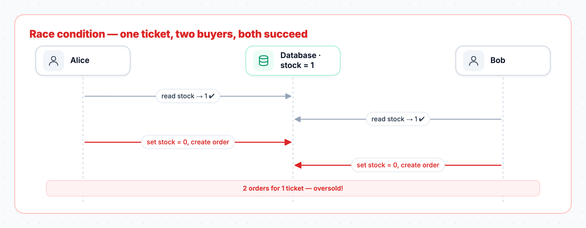

The fix is to make "check stock and take one" a **single atomic step** that the database runs for one buyer at a time:

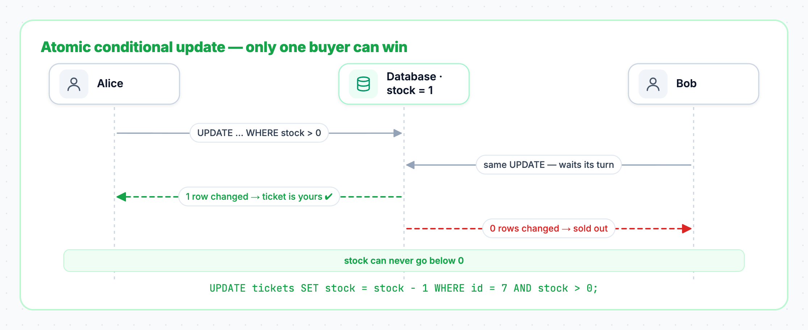

### Anomalies and isolation levels

| Anomaly | What happens |
|---------|--------------|
| **Dirty read** | You read another transaction's uncommitted change |
| **Non-repeatable read** | You read a row twice and get different values |
| **Phantom read** | A re-run query returns new rows that appeared meanwhile |
| **Lost update** | Two read-modify-writes overwrite each other |
| **Write skew** | Two transactions each check a rule, then both write, breaking it together |

| Level | Prevents | Cost |
|-------|----------|------|
| Read committed (common default) | Dirty reads | Low |
| Repeatable read / snapshot | + non-repeatable reads (and most phantoms in Postgres) | Medium |
| Serializable | Everything — as if run one at a time | Highest; retries on conflict |

### Three practical tools for contended rows

1. **Atomic conditional update** — `UPDATE … SET stock = stock - 1 WHERE id = 7 AND stock > 0`. Check the affected-rows count.
2. **Pessimistic lock** — `SELECT … FOR UPDATE` inside a short transaction.
3. **Optimistic concurrency** — add a `version` column; `UPDATE … WHERE id = 7 AND version = 12`; retry if 0 rows changed. Great when conflicts are rare.

> [!WARNING]
> **Never hold a database transaction open while calling a remote service** (payment provider, email API). If it's slow, locks pile up and the database grinds to a halt. Commit, call, then record the result — using an idempotency key.

> [!TIP]
> **🎤 Say it in the interview** — "Seat hold is a single-row conditional update, so two users can't take the same seat. Payment happens after commit, with an idempotency key, and a reconciliation job cleans up if the provider times out."

#### ❓ Questions & answers

1. **What does ROLLBACK undo?** Every change made inside the transaction since BEGIN, as if it never happened.
2. **Why is an HTTP call inside an open transaction risky?** Locks are held for the whole network wait. Slow calls cause lock pile-ups, timeouts and connection-pool exhaustion.
3. **How does optimistic concurrency detect conflicts?** The UPDATE includes the version it read. If someone else changed the row first, the version no longer matches, 0 rows update, and the app retries.


---

## 3.6 Distributed transactions

> **In one sentence:** When one business action spans several services, each with its own database, one `COMMIT` can't cover them all — so you use a **saga**: a chain of small local steps, each with an "undo" step if something later fails.

### 🧩 The problem: half an order

In a microservices shop, placing an order touches three services, each with its **own** database: payments, inventory and orders. There's no single transaction that covers all three. So what happens when one step fails?

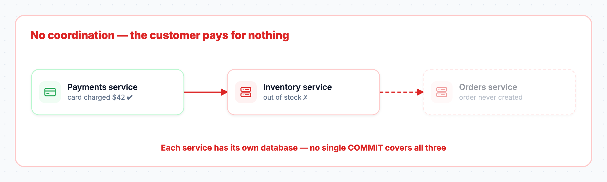

The customer's card was charged, but the item couldn't be reserved and no order exists. The customer paid for nothing — and your support team finds out from an angry email.

### 💡 The idea: small steps, each with an "undo"

A **saga** runs the business action as a sequence of local transactions. Each step commits in its own database. If a later step fails, the saga runs **compensating actions** — "undo" steps — for everything that already happened, in reverse order:

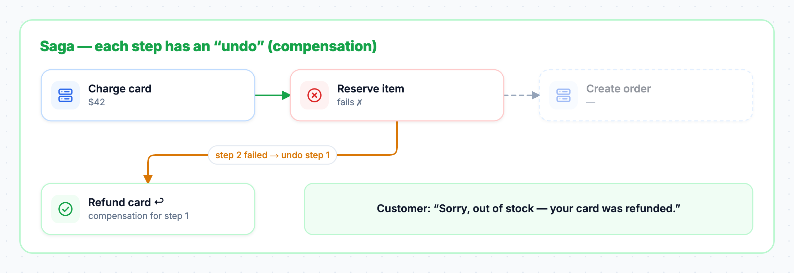

### Two ways to coordinate: 2PC vs saga

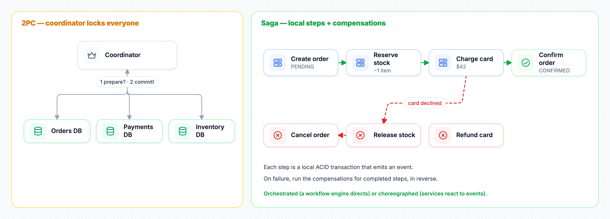


### Two-phase commit (2PC)

1. **Prepare** — the coordinator asks every participant "can you commit?"; each locks its resources and votes.
2. **Commit / abort** — if all voted yes, everyone commits; otherwise everyone aborts.

**The problem:** if the coordinator dies after prepare, participants hold locks indefinitely. One slow participant stalls everyone. Availability is the product of all participants. (Three-phase commit tries to fix blocking but is complex and still imperfect.)

### Sagas — the practical answer

A saga is a sequence of **local** transactions. Each step commits in its own database and triggers the next. If a step fails, **compensating actions** undo the earlier steps in reverse order.

| Step | Compensation |
|------|--------------|
| Create order (PENDING) | Cancel order |
| Reserve inventory | Release inventory |
| Charge card | Refund card |
| Confirm order | — |

| Coordination style | How | Pros | Cons |
|--------------------|-----|------|------|
| **Orchestration** | A workflow engine (Temporal, Step Functions) tells each service what to do | Easy to see and change the flow | The orchestrator is a component to run and scale |
| **Choreography** | Services react to each other's events | Loose coupling | Flow is spread across services — "event spaghetti" |

### Rules for sagas that work

- Every step and every compensation must be **idempotent** (safe to retry).
- Some actions **can't be undone** (an email already sent). Order steps so irreversible ones come last, or compensate with a follow-up ("sorry, your order was cancelled").
- Publish events with the **transactional outbox** pattern (see [4.2](#42-delivery-guarantees--idempotency)) so a database commit and its event never disagree.

> [!TIP]
> **🎤 Say it in the interview** — "Checkout is an orchestrated saga: reserve inventory → charge card → confirm, with compensations release → refund. Messages are at-least-once, so every step is idempotent."

#### ❓ Questions & answers

1. **What makes 2PC blocking?** Participants that voted "yes" must hold their locks until they hear the decision. If the coordinator is gone, they're stuck.
2. **One pro each for choreography and orchestration?** Choreography: services stay decoupled with no central component. Orchestration: the whole flow is explicit, observable and easy to change in one place.
3. **Name an action that's awkward to compensate.** Sending an email or SMS, shipping a parcel, calling a third-party API with side effects.


---

## 3.7 Indexes

> **In one sentence:** An index is like the index at the back of a book — instead of reading every page to find a word, you look it up and jump straight to the right place; the cost is that every write must also update the index.

### 🧩 The problem: finding one row among a billion

You run `SELECT * FROM users WHERE email = 'ann@mail.com'` on a table with a billion users. Without help, the database has only one option — check **every single row**:

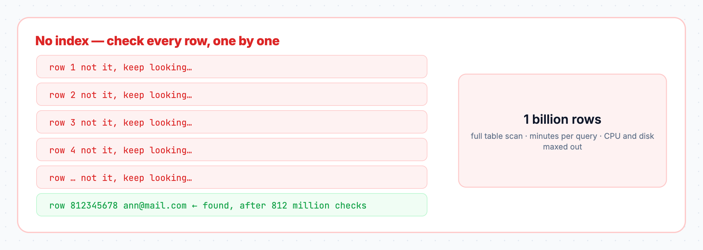

That's a **full table scan**. It can take minutes, burns CPU and disk, and slows everything else down. And your login page runs this query thousands of times a second.

### 💡 The idea: a sorted lookup structure

An **index** keeps the emails in a sorted tree structure (usually a **B-tree**) that points to where each row lives. The database walks down the tree — like finding a word in a dictionary — and reaches the right row in a handful of steps:

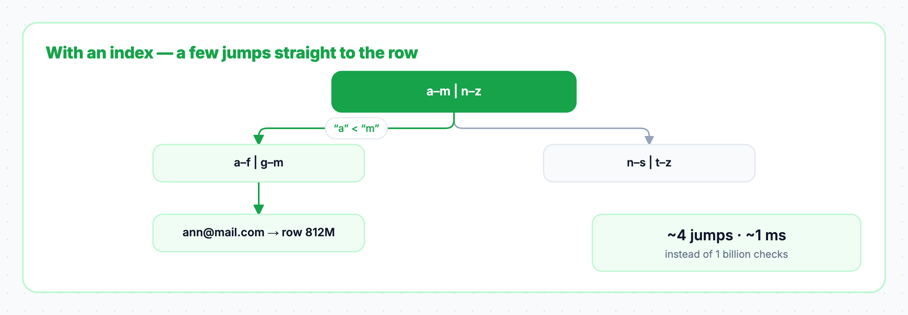

A billion rows need only about **4 hops** in a B-tree. Minutes become milliseconds.

### How a B-tree index works

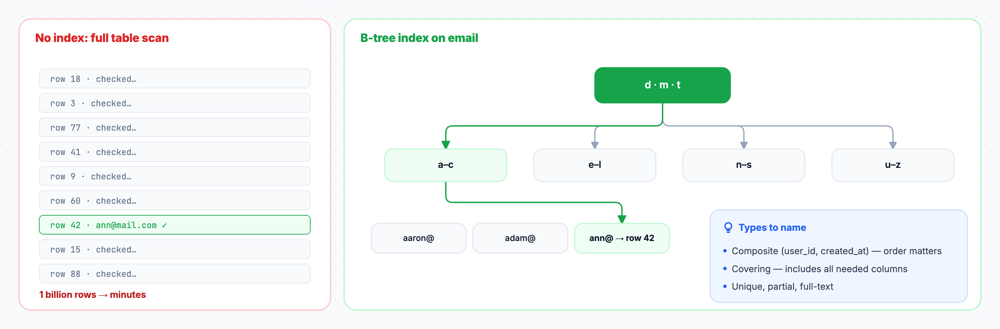


### Index types you should name

| Type | What it does | Example |
|------|--------------|---------|
| **Primary / clustered** | Defines physical order (in some engines) | `id` |
| **Secondary** | Alternate lookup path | `email → user` |
| **Composite** | Several columns; **leftmost prefix matters** | `(user_id, created_at)` serves "user's latest posts" |
| **Covering** | Contains every column the query needs — no table lookup | `(user_id, created_at) INCLUDE (title)` |
| **Unique** | Enforces uniqueness | `UNIQUE(email)` |
| **Partial** | Indexes a subset | `WHERE deleted = false` |
| **Full-text / inverted** | Word → documents | Search boxes |
| **Geospatial** | Points and shapes | "within 2 km" (see 3.13) |

### B-tree vs LSM-tree (the two storage engines)

| | B-tree | LSM-tree |
|--|--------|----------|
| Used by | PostgreSQL, MySQL (InnoDB) | Cassandra, RocksDB, ScyllaDB |
| Strength | Fast reads and range scans | Very fast writes (append-only, compacted later) |
| Cost | Random writes | Reads may check several files (Bloom filters help) |

### Rules of thumb

- Index the columns in your hottest `WHERE`, `JOIN` and `ORDER BY` clauses.
- Put the **equality** column first in a composite index, the **range/sort** column last.
- Low-cardinality columns alone (`is_active`) rarely help.
- Every index slows `INSERT`/`UPDATE` and uses disk — **index with intent**.
- In sharded databases, secondary indexes are either **local** (per shard, fast writes, scatter reads) or **global** (partitioned separately, fast reads, slower writes).

> [!TIP]
> **🎤 Say it in the interview** — After drawing tables, add indexes for your top three queries out loud: "Index on `(user_id, created_at DESC)` for the profile timeline." Interviewers listen for that habit.

#### ❓ Questions & answers

1. **Why does composite index column order matter?** The index is sorted by the first column, then the second. It can serve queries on the first column (or a prefix), but not efficiently on the second alone.
2. **Cost of five secondary indexes on a write-heavy table?** Every write updates six structures, so write latency and I/O go up, storage grows and cache efficiency drops.
3. **Local vs global secondary index in a sharded store?** Local: each shard indexes its own rows (cheap writes, reads must ask every shard). Global: the index is partitioned by the indexed value (one-shard reads, writes touch two places).


---

## 3.8 Replication

> **In one sentence:** Replication keeps **copies of the same data on several machines**, so a single failure doesn't lose data or take the system down, and so reads can be spread across the copies.

### 🧩 The problem: one copy of your data

If all your data lives on **one** database server:

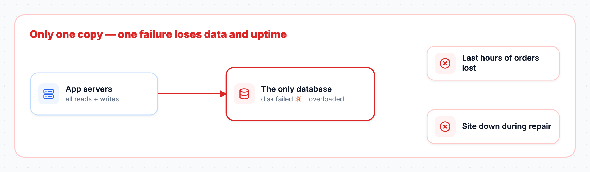

- A disk failure or a fire in the data center can **lose your data** (backups help, but the last hours of orders are gone).
- While the server is being repaired, your product is **down**.
- Every read in the whole app hits the same machine, so it becomes the bottleneck.

### 💡 The idea: keep copies on other machines

One **primary** server accepts all the writes and streams every change to one or more **replicas** on other machines — ideally in other data centers. If the primary dies, a replica is promoted and takes over. Replicas can also answer read queries, spreading the load:

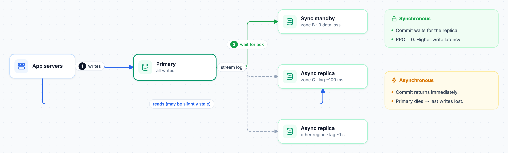


### Topologies

| Topology | Writers | Pros | Cons |
|----------|---------|------|------|
| **Primary–replica** (leader–follower) | One | Simple; no write conflicts | Primary is the write bottleneck; failover needed |
| **Multi-primary** (multi-leader) | Several (often one per region) | Local writes everywhere | **Conflicts** — need last-write-wins, CRDTs or merge logic |
| **Leaderless / quorum** (Dynamo-style) | Any node | Very available | Tunable consistency: **W + R > N** for overlap |

### Sync vs async

| | Synchronous | Asynchronous |
|--|-------------|--------------|
| When "success" is returned | After the replica confirms | After the primary alone persists |
| Data loss if primary dies | None (RPO = 0) | The last few seconds |
| Write latency | Higher (and a slow replica slows everyone) | Lowest |
| Common setup | **One** sync standby in another zone + async others ("semi-sync") | Read replicas, cross-region copies |

### Replication lag

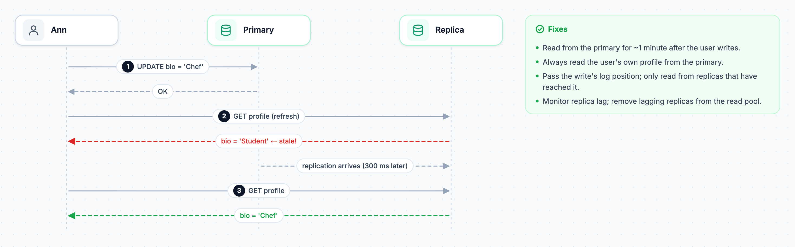

Async replicas are usually milliseconds behind — but under load, seconds or more. Users notice when they **can't see their own change**. Fixes:

- Read your own data from the primary (always, or for a minute after writing).
- Track the write's log position and read only from replicas that have caught up.
- Monitor lag and pull slow replicas out of the pool.

### Failover

When the primary dies, a replica is **promoted**. Automated failover needs:

- **Fencing** — make sure the old primary can't keep accepting writes (split brain).
- A decision on **RPO**: with async replication, the newest writes may be gone.
- Clients that **reconnect** to the new primary (DNS or a proxy update).

> [!IMPORTANT]
> **🏛️ Architect's lens** — Production databases should always have at least one replica in **another availability zone** — it's cheap insurance. Read replicas are a scaling tool; a *standby* is a survival tool. They're often different machines with different settings.

> [!TIP]
> **🎤 Say it in the interview** — Draw primary + replicas and label them: "Synchronous standby in zone B for zero data loss; two async read replicas for reads. Users read their own profile from the primary to avoid lag surprises."

#### ❓ Questions & answers

1. **A user writes, then immediately reads from a replica — what can go wrong?** The replica may not have the write yet, so the user sees old data and thinks the save failed.
2. **Why is fencing important during failover?** A "dead" primary may only be partitioned. Without fencing it keeps accepting writes, and you get two diverging primaries.
3. **Interpret W=3, R=2, N=5.** Five copies. A write succeeds after 3 acks, a read asks 2 nodes. W + R = 5, which is not > 5, so a read might miss the latest write. Use R=3 for guaranteed overlap.


---

## 3.9 Sharding

> **In one sentence:** Sharding splits one huge dataset across many database servers — each **shard** holds only a slice (for example, users A–F), so no single machine has to store or process everything.

### 🧩 The problem: the data outgrows the biggest machine

Replicas help with **reads**, but every **write** still goes to the one primary. Eventually one database server can't keep up:

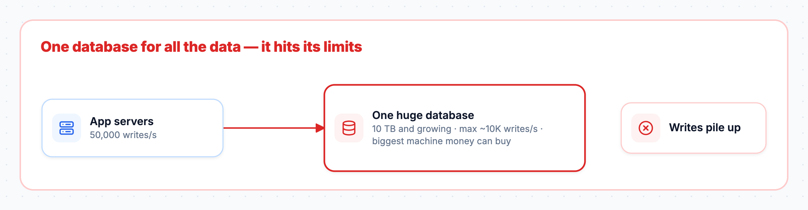

- **Storage:** 10 TB of messages and growing by a terabyte a month.
- **Writes:** 50,000 new messages per second — more than one machine can safely take.
- **Cost:** the largest servers cost a fortune, and there is always a biggest one.

### 💡 The idea: split the data across many databases

Split the rows across several independent databases — **shards** — by a **shard key** (for example `user_id`). Each shard holds a quarter of the users; a router sends each query to the shard that owns the data:

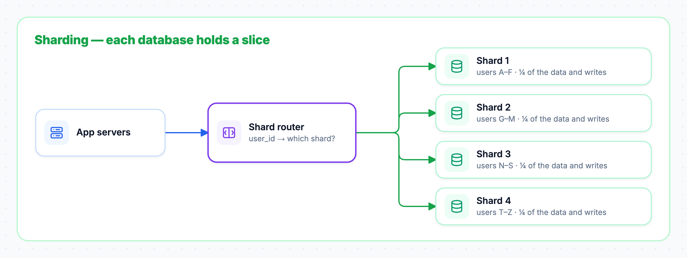

Four shards means a quarter of the data and a quarter of the writes per machine — and you can add more shards as you grow.

### Ways to split the data

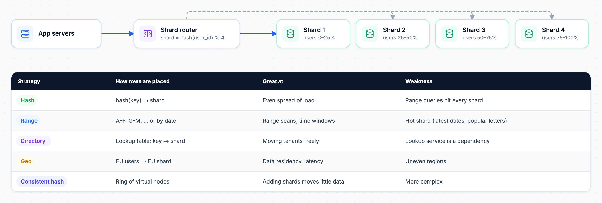


### Choosing a shard key — the most important decision

A good shard key:

1. **Spreads load evenly** — no shard gets much more traffic than the others.
2. **Keeps common queries on one shard** — "get this user's orders" touches one shard.
3. **Matches transaction boundaries** — multi-row transactions stay within one shard.

| App | Good key | Why |
|-----|----------|-----|
| Social app | `user_id` | A user's data lives together |
| B2B SaaS | `tenant_id` | Tenant isolation, easy to move big tenants |
| Chat | `conversation_id` | All messages in a chat together |
| Logs / events | `hash(source) + time bucket` | Avoids "everything writes to today's shard" |

### What sharding costs you

- **Cross-shard queries** ("top 10 posts globally") need scatter-gather or a separate index.
- **Cross-shard transactions** need sagas.
- **Global uniqueness** (`UNIQUE(email)` when sharded by `user_id`) needs a separate lookup table.
- **Resharding** (going from 8 to 16 shards) means moving data live — plan with consistent hashing or many small logical shards mapped to fewer physical servers.

### Hot keys

A celebrity, a viral product or a giant tenant can overload one shard no matter how good the hash is. Mitigate with caching, splitting the hot key into sub-keys (`celebrity:42#1…#10`), or a dedicated shard.

> [!IMPORTANT]
> **🏛️ Architect's lens** — Sharding is a **one-way door**: expensive to adopt, very expensive to undo. Exhaust the cheaper options first — bigger machine, read replicas, caching, archiving old data, federation. When you do shard, start with **many logical shards** (say 1,024) on a few physical servers, so you can rebalance by moving shards instead of rows.

> [!TIP]
> **🎤 Say it in the interview** — Always state the shard key **and** the query it keeps on one shard: "Shard messages by `conversation_id`, so loading a chat is a single-shard range scan. The cross-shard case — search across all chats — goes to a separate search index."

#### ❓ Questions & answers

1. **Why is `created_at` alone a risky shard key?** All new writes land on the newest shard (hot shard) while old shards sit idle.
2. **How does salting help celebrity hot keys?** You split one key into N sub-keys spread across shards, then read and merge them, which spreads the load.
3. **What breaks about `UNIQUE(email)` after sharding by `user_id`?** Each shard only checks its own rows, so two shards could each accept the same email. You need a global lookup table keyed by email.


---

## 3.10 Consistent hashing

> **In one sentence:** Consistent hashing is a way of deciding which server owns each key so that **adding or removing a server moves only a small slice of the keys** instead of almost all of them.

### 🧩 The problem: adding one server reshuffles everything

The simple way to spread keys over servers is `server = hash(key) % N`. With 4 cache servers, key "user:42" might go to server 2. Now traffic grows and you add a **5th** server — so the formula becomes `% 5`:

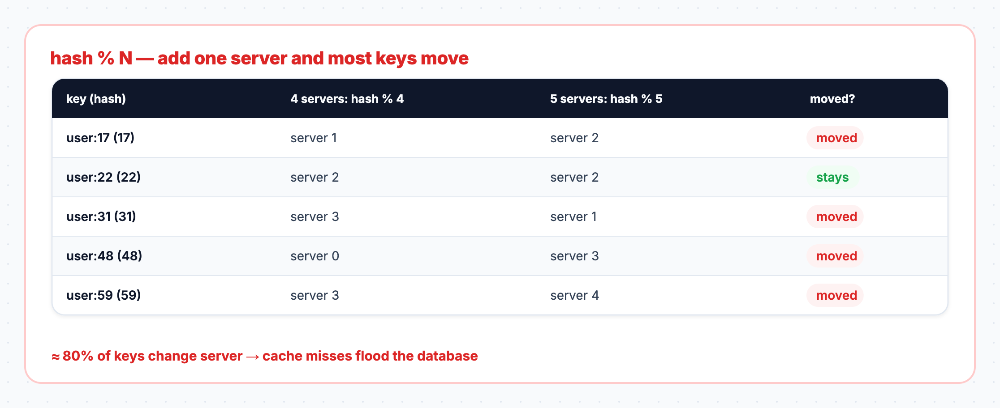

Almost every key now maps to a **different** server — about **80%** of them. For a cache, that means 80% of lookups suddenly miss and flood the database at once. For a database, it means moving 80% of the data. Scaling up causes an outage.

### 💡 The idea: a ring, where each server owns a slice

Put servers **and** keys on a circle using the hash. Each key belongs to the **first server clockwise** from it. Add a new server, and it only takes over the keys between itself and its neighbour — everything else stays exactly where it was:

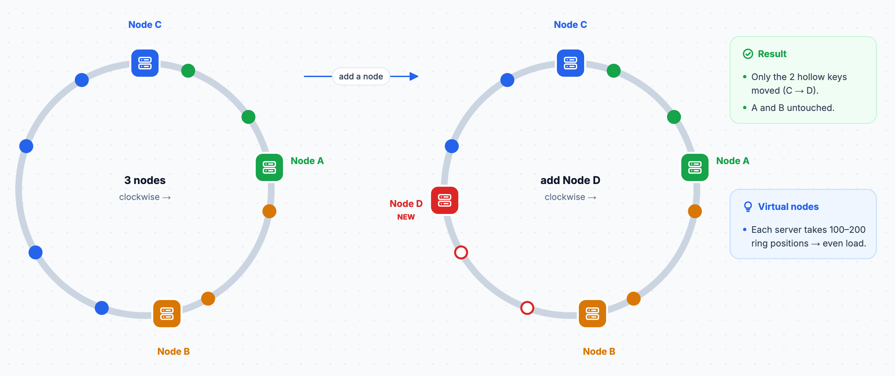


### Why not `hash(key) % N`?

With 4 nodes, `hash % 4`. Add a fifth: `hash % 5` — **~80% of keys change owner**. For a cache, that's a sudden stampede to the database; for storage, a massive data migration.

### How the ring works

1. Hash each node onto a circle (say 0 … 2³²).
2. Hash each key onto the same circle; walk **clockwise** to the first node — that node owns the key.
3. Add a node: it takes over only the keys between itself and its predecessor. Everything else stays put.

### Virtual nodes

With few nodes, positions are uneven and one node owns a huge arc. **Virtual nodes** give each server 100–200 positions on the ring:

- Load evens out statistically.
- Bigger servers get more virtual nodes (weighting).
- When a node leaves, its load spreads across **many** servers, not just one neighbour.

### Replication on the ring

Dynamo-style stores keep each key on the **next N distinct nodes** clockwise, so a node's death loses nothing.

**Used by:** Cassandra, DynamoDB, Riak, memcached client libraries, CDNs and load balancers (for cache affinity).

> [!TIP]
> **🎤 Say it in the interview** — Draw a ring with three nodes, add a fourth, and show which keys move. Then add: "Virtual nodes for balance; hot keys handled separately with caching or salting."

#### ❓ Questions & answers

1. **Why does `hash % N` hurt on resize?** Almost every key maps to a different node when N changes, so caches go cold and data must move.
2. **What problem do virtual nodes solve?** Uneven arcs (load imbalance) with few nodes, and uneven redistribution when a node joins or leaves.
3. **Can a perfect ring protect a single viral key?** No. One key always lives on one node (plus its replicas). Use caching, key replication or salting for hot keys.


---

## 3.11 Federation

> **In one sentence:** Federation splits one big database into several databases **by business area** — users, orders, catalog — so each team owns, changes and scales its own data independently.

### 🧩 The problem: every team shares one database

A growing company has one database that every team uses: accounts, orders, the product catalog, analytics…

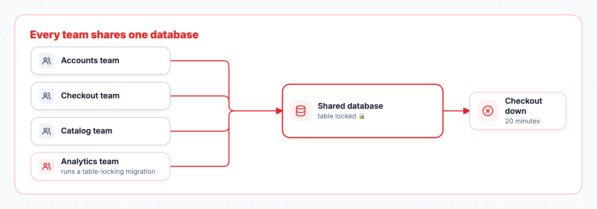

- The analytics team runs a migration that locks a table — and **checkout stops** for 20 minutes.
- Every schema change needs sign-off from every team, so changes are slow.
- One busy area (orders on Black Friday) slows down all the others.

### 💡 The idea: give each business area its own database

Split by **domain**: a users database, an orders database, a catalog database — each owned by one team, each scaled on its own. A problem in one stays in one:

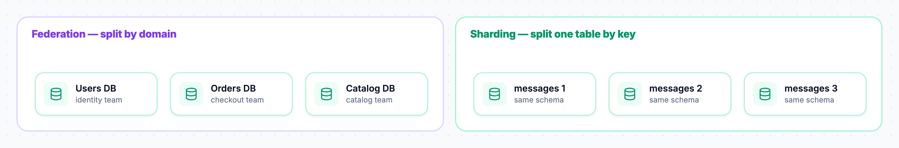


| | Federation | Sharding |
|--|------------|----------|
| Split by | What the data **is** (domain) | A **key** within one dataset |
| Schemas | Different per database | Identical on every shard |
| Maps to | Team / service boundaries | Capacity needs |
| Pain | No joins across domains | Cross-shard queries |

You can do both: federate by domain, then shard just the one domain that outgrows a machine (usually messages, events or orders).

**Helps when:** domains scale differently, teams need independent schema changes, you want to limit the blast radius of a bad migration.

**Hurts when:** reports need wide cross-domain joins (use a data warehouse), or every request synchronously fans out to many databases ("distributed monolith").

> [!TIP]
> **🎤 Say it in the interview** — "Identity, social graph and media metadata live in separate databases owned by separate services. Only the messages table is big enough to shard."

#### ❓ Questions & answers

1. **Is putting `users` and `orders` in two databases sharding or federation?** Federation, because it's a split by domain.
2. **Why might finance refuse to share a DB with the feed service?** Different consistency, compliance and audit needs, and they don't want a feed traffic spike or migration to affect billing.
3. **How do you query across federated stores without joins?** Compose in the application (call both), keep denormalized copies updated by events, or run the query in a data warehouse.


---

## 3.12 CAP & PACELC

> **In one sentence:** When the network between copies of your data breaks, a system must choose: **refuse** some requests to stay correct, or **keep answering** and risk showing old data — and even on a healthy network, it trades **speed** against **freshness**.

### 🧩 The problem: the link between two data centers breaks

Your data is copied between a data center in Europe and one in the US. Then the network cable between them is cut (this happens more often than people expect):

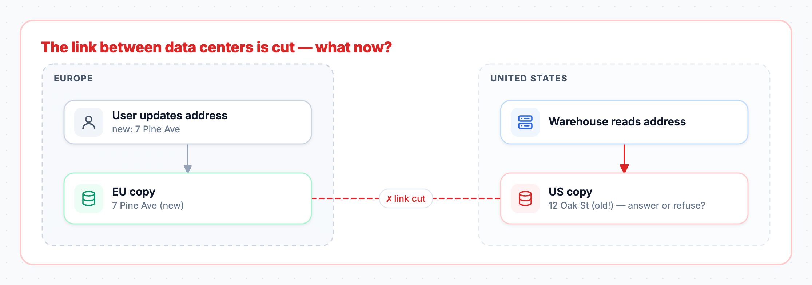

A user in Europe changes their shipping address. A second later, the US warehouse system reads the address — but the change can't cross the broken link. The US side must decide right now:

- **Answer with the data it has** (the old address) — the system stays up, but the answer may be wrong.
- **Refuse to answer** until the link is back — the answer is never wrong, but the system is partly down.

There is no option that gives both. That's the **CAP theorem**.

### 💡 The idea: choose per feature, on purpose

The right choice depends on what's at stake. A wrong **like count** for a minute is harmless — keep answering. A wrong **bank balance** is a disaster — refuse. Good architects decide this **per operation** and say so clearly:

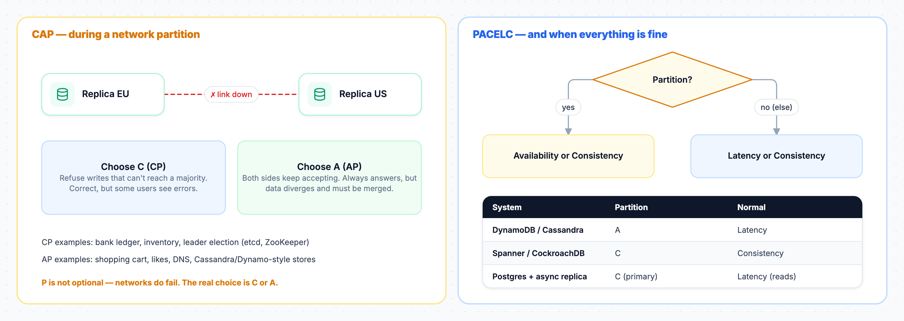


### CAP, correctly stated

During a **partition** (nodes can't talk to each other), you can't have both:

- **C — Consistency (linearizability):** every read returns the latest write.
- **A — Availability:** every request gets a non-error response.

**P** isn't a choice — networks *will* partition. So the real question is: **when it happens, do you prefer C or A?**

- **CP:** refuse writes (or reads) on the minority side. Correct but partially unavailable. *etcd, ZooKeeper, Spanner, a single-primary SQL DB.*
- **AP:** accept on both sides and reconcile later. Always answers, but may be stale or conflicting. *Cassandra, DynamoDB (default), DNS.*

### PACELC — the everyday trade-off

> **If P**artition → choose **A** or **C**; **E**lse → choose **L**atency or **C**onsistency.

Even on a healthy network, waiting for replicas to confirm (consistent) is slower than answering from the nearest copy (fast, maybe stale).

| Domain | Usual lean | What users see |
|--------|------------|----------------|
| Bank ledger | CP, consistency over latency | "Payment temporarily unavailable" rather than a wrong balance |
| Shopping cart | AP, merge conflicts | Cart always works; rare duplicate item to remove |
| Like counts | AP, latency | Count lags a few seconds |
| Feature flags / config | CP | A stale flag could enable a broken feature |

> [!IMPORTANT]
> **🏛️ Architect's lens** — CAP is a property of **each operation**, not of a whole company. One product can be CP for payments and AP for recommendations — and should be. Translate letters into user experience and business risk.

> [!TIP]
> **🎤 Say it in the interview** — Skip the acronym lecture. Say: "If the EU region loses contact with the US, EU users keep reading their feeds (possibly stale), but payments fail closed until the partition heals."

#### ❓ Questions & answers

1. **Restate CAP without "pick two of three".** During a network partition, a replicated system must choose between rejecting some requests (consistency) and answering with possibly stale data (availability).
2. **A PACELC example for a multi-region profile store?** No partition: read the local replica (low latency, may be slightly stale). Partition: keep serving local reads (A) and queue edits for later merge.
3. **Why does ACID's C differ from CAP's C?** ACID-C is about constraint validity inside one database. CAP-C is about all replicas returning the most recent write.


---

## 3.13 Geospatial indexes

> **In one sentence:** A geospatial index splits the map into cells so that "find things near me" only searches **nearby cells** instead of checking every place on Earth.

### 🧩 The problem: measuring the distance to every restaurant on Earth

A user opens a food app and asks for restaurants within 2 km. There are **10 million** restaurants in the database. The simple approach — calculate the distance from the user to every one of them, then sort:

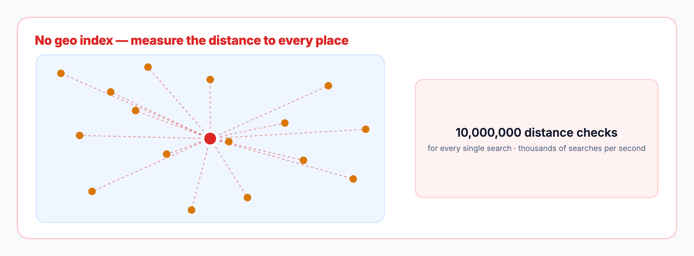

That's 10 million distance calculations **per search**, and thousands of people search every second. A normal index doesn't help, because "near" involves latitude **and** longitude together.

### 💡 The idea: divide the map into cells

Divide the world into a grid of cells, and label each place with its cell. To search, find the user's cell, look only at places in **that cell and its 8 neighbours** — a few hundred candidates — and compute exact distances just for those:

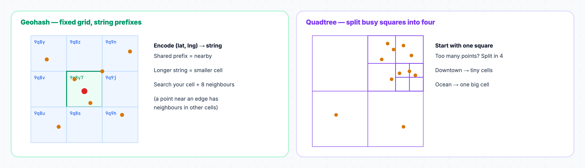


### Geohash / grid

- Encode `(lat, lng)` into a string; **shared prefix = nearby**. Each extra character shrinks the cell (~5 chars ≈ 5 km, ~7 chars ≈ 150 m).
- Query: compute the user's cell, fetch places in it **plus the 8 neighbours** (a point near an edge has close neighbours in the next cell), then filter by exact distance.
- Easy to store as an indexed column or use as a shard key. **H3** (hexagons) and **S2** (Google) are popular variants.

### Quadtree

- Start with one square; when it holds too many points, split it into four. Repeat.
- Dense downtown → tiny cells; empty ocean → one big cell.
- Usually built in memory on location servers; rebuilt or updated periodically.

| | Geohash / H3 | Quadtree |
|--|--------------|----------|
| Cell size | Fixed per level | Adapts to density |
| Storage | Any database index | Usually in memory |
| Sharding | Natural (by prefix) | Harder |
| Best for | Static places (restaurants), moving drivers with H3 | Very uneven density |

**Off-the-shelf:** PostGIS, Redis `GEOSEARCH`, Elasticsearch `geo_point`, MongoDB `2dsphere`.

> [!TIP]
> **🎤 Say it in the interview** — "Places are indexed by geohash. A search takes the user's cell plus eight neighbours, pulls maybe a few hundred candidates, and ranks them by exact distance and rating." See [Nearby places](#case-study-15--nearby-places) and [Ride sharing](#case-study-07--ride-sharing).

#### ❓ Questions & answers

1. **Why query neighbour cells?** A place just across a cell boundary can be closer than places inside your own cell.
2. **When does a quadtree beat a uniform grid?** When density is very uneven — millions of points in cities, almost none elsewhere.
3. **After the cell lookup, why still compute exact distance?** Cells are rectangles or hexagons, not circles. Candidates include points outside the radius and must be filtered and sorted.


<p align="right"><a href="#table-of-contents">↑ Back to top</a></p>

---

# Chapter 04 · Async & Coordination

**Handing off work, surviving duplicates, and getting many machines to agree**

---

### In this chapter

| # | Lesson | One-line idea |
|---|--------|---------------|
| 4.1 | [Messaging](#41-messaging) | Queues, pub/sub and logs decouple producers from consumers |
| 4.2 | [Delivery guarantees & idempotency](#42-delivery-guarantees--idempotency) | At-least-once + idempotent = effectively once |
| 4.3 | [Coordination](#43-coordination) | Leaders, locks, leases and fencing tokens |
| 4.4 | [Bloom filters](#44-bloom-filters) | "Definitely not" or "maybe" in a few bits |
| 4.5 | [Checksums & data integrity](#45-checksums--data-integrity) | Fingerprints that catch silent corruption |
| 4.6 | [Distributed file systems](#46-distributed-file-systems) | Metadata vs chunk servers |
| 4.7 | [A note on the ESB](#47-a-note-on-the-esb) | Why "smart pipes" fell out of fashion |

---

## 4.1 Messaging

> **In one sentence:** A message queue lets one part of the system **hand off work to be done later** — like dropping a ticket in an inbox instead of standing at someone's desk waiting — so users get fast answers and slow or failing parts don't block anything.

### 🧩 The problem: the user waits for everything

A customer clicks **Buy**. Without a queue, the API does every job before it answers: charge the card, generate a PDF invoice, send the confirmation email, update analytics, notify the warehouse…

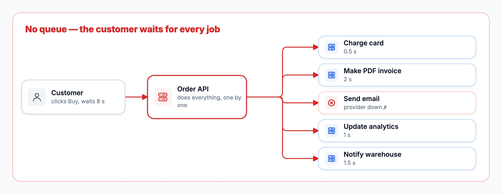

- The customer stares at a spinner for **8 seconds**.
- If the email provider is having a bad day, **the whole checkout fails** — even though the payment worked.
- A flash sale sends 50,000 orders in a minute; every step must handle that peak at the same moment, or requests pile up and time out.

### 💡 The idea: do the essential part now, hand off the rest

The API does only what the user must wait for (save the order, charge the card), then drops a message — "order 42 was placed" — into a **queue** and answers immediately. **Workers** pick messages from the queue and do the slow jobs in the background, at their own pace, retrying if something fails:

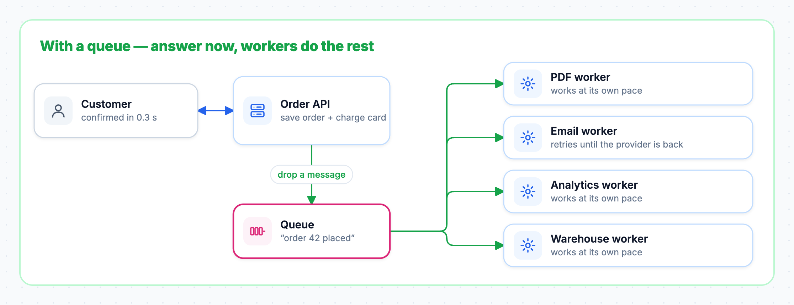

### Three kinds of message systems

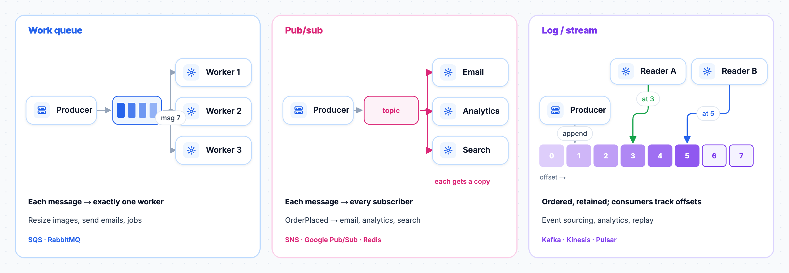


### Why go async?

| Benefit | Example |
|---------|---------|
| **Faster responses** | Checkout returns in 200 ms; the confirmation email is sent a second later |
| **Absorb spikes** | A flash sale queues 50,000 orders; workers drain them at a steady rate |
| **Isolate failures** | The email provider is down → emails wait in the queue; checkout still works |
| **Fan out** | One `OrderPlaced` event feeds email, analytics, search and fraud checks |
| **Independent scaling** | Add workers when the queue grows; remove them when it shrinks |

### Three models

| Model | Who receives each message | Replay? | Examples |
|-------|---------------------------|---------|----------|
| **Work queue** | **One** of many competing workers | No — deleted after ack | SQS, RabbitMQ |
| **Pub/sub** | **Every** subscription gets a copy | Usually no | SNS, Google Pub/Sub, Redis Pub/Sub |
| **Log / stream** | Every consumer group reads at its own offset | **Yes** — retained for days | Kafka, Kinesis, Pulsar, Redpanda |

### Partitions and ordering (log-based brokers)

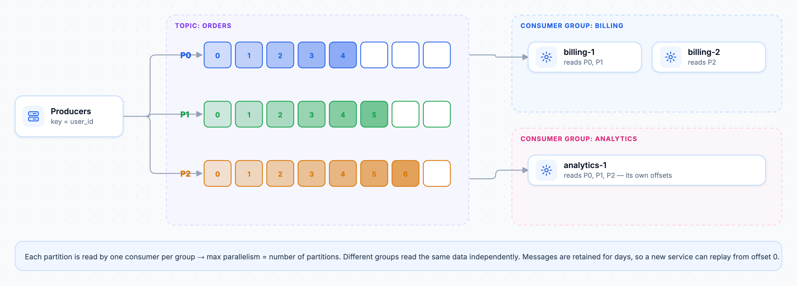

- A topic is split into **partitions**. Order is guaranteed **within a partition only**.
- Messages with the same **key** (e.g. `user_id`) always go to the same partition, so one user's events stay in order.
- Within a consumer group, each partition is read by one consumer → **max parallelism = number of partitions**.
- Different consumer groups read the same data **independently** — a new service can replay history from the start.

### Operating queues

- **Dead-letter queue (DLQ)** — after N failed attempts, move the "poison" message aside so it stops blocking the others, and alert a human.
- **Visibility timeout / ack deadline** — if a worker crashes mid-task, the message reappears for another worker.
- **Backpressure** — watch **consumer lag** (how far behind) and the **age of the oldest message**. Autoscale workers on those, not on CPU.
- **Schema evolution** — version your message payloads. Consumers must tolerate new fields; producers must not remove fields that consumers rely on.

> [!IMPORTANT]
> **🏛️ Architect's lens** — Queues **hide outages**: a broken consumer doesn't fail loudly, the queue just grows. Alert on lag and oldest-message age, and decide what "too late" means for each queue (a password-reset email that arrives an hour late is useless). Also: don't reach for Kafka at 50 messages/second — SQS or a Postgres-backed queue is far cheaper to run.

> [!WARNING]
> **Common mistakes** — Putting the queue on the path where the user is waiting for the answer; assuming global ordering; no DLQ, so one bad message stalls a partition forever; unbounded queues masking a dead consumer for days.

> [!TIP]
> **🎤 Say it in the interview** — "The API writes the order, then publishes `OrderPlaced`. Email, analytics and search each consume it independently. The partition key is `order_id` to keep an order's events in sequence, and consumers are idempotent."

#### ❓ Questions & answers

1. **Queue vs log — which supports replay, and why?** A log. Messages are retained and consumers track their own offsets, so they can rewind. A queue deletes messages once acknowledged.
2. **How do you keep per-user order at scale?** Partition by `user_id`. All of a user's messages go to one partition, which is consumed in order by one consumer.
3. **What is a DLQ for?** Parking messages that repeatedly fail, so they don't block others, and so humans can inspect and replay them.


---

## 4.2 Delivery guarantees & idempotency

> **In one sentence:** Networks sometimes lose the "got it" reply, so a message may be sent twice — systems accept that and make processing **idempotent**, meaning doing the same thing twice has the same effect as doing it once.

### 🧩 The problem: "did it work?" — nobody knows, so we retry

A worker charges a customer's card and sends back "done". The "done" message gets lost on the network. The queue never hears back, so it assumes the worker failed — and gives the message to another worker:

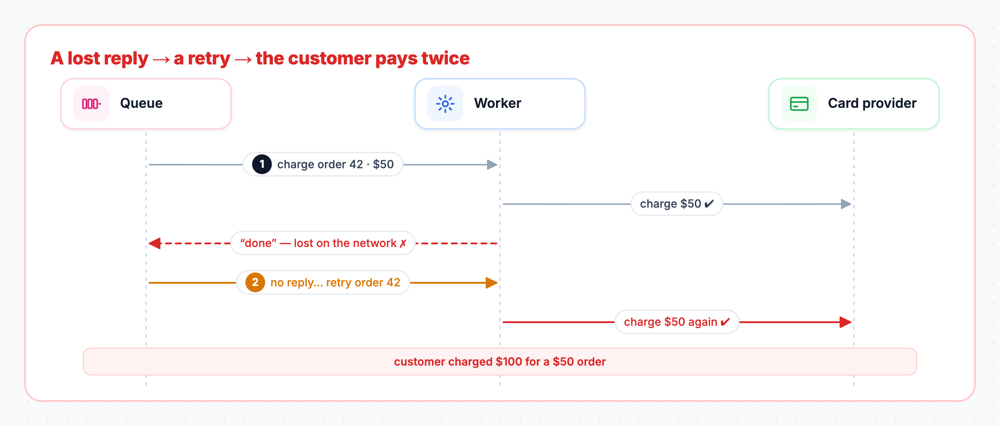

The customer is charged **twice**. This isn't a rare bug: timeouts, crashes and lost replies happen every day at scale. You can't make the network perfect — so you have to make **duplicates harmless**.

### 💡 The idea: make repeating an action safe

Give every action a unique ID. Before doing the work, check "have I already processed this ID?". If yes, skip it. Now a retry can never cause a second charge:

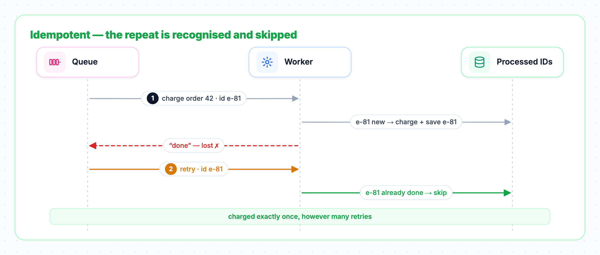

This is called being **idempotent**. With it, you can safely retry anything — which is exactly what reliable systems do.

### The three delivery guarantees

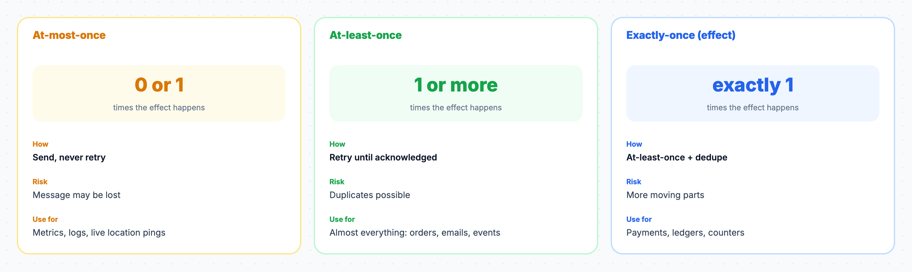


| Guarantee | How | Risk | Use for |
|-----------|-----|------|---------|
| **At-most-once** | Send once, never retry | Loss | Metrics, logs, GPS pings where the next one replaces the last |
| **At-least-once** | Retry until acknowledged | Duplicates | The default for almost everything |
| **Exactly-once (effect)** | At-least-once + deduplication / transactions | Complexity | Payments, ledgers, counters that must be exact |

True end-to-end exactly-once *delivery* across arbitrary systems (a DB, an email provider, a third-party API) isn't achievable in general. What you can build is **exactly-once effect**: duplicates arrive, but they change nothing the second time.

### The two patterns that make it safe

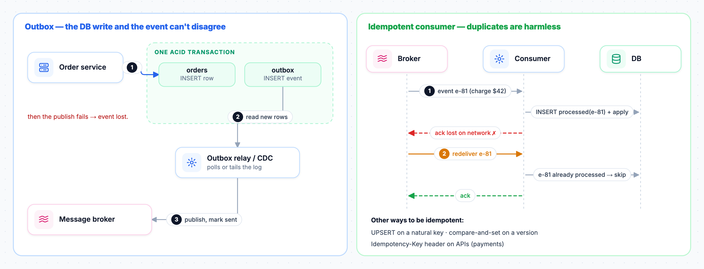

**1. Transactional outbox (producer side).** The "dual write" problem: you commit the order to the DB, then the publish to the broker fails, and the event is lost forever. The fix:

1. In **one** DB transaction, insert the order **and** an `outbox` row describing the event.
2. A relay process (or change-data-capture like Debezium) reads new outbox rows and publishes them.
3. Mark the row as sent. If publishing fails, it retries — worst case, a duplicate, which consumers handle.

**2. Idempotent consumer (consumer side).** Make processing a message twice harmless:

- **Dedupe table** — store processed event IDs (in the same transaction as the side effect); skip repeats.
- **Upserts** — `INSERT … ON CONFLICT DO NOTHING` on a natural key.
- **Conditional updates** — `UPDATE … WHERE version = 7`.
- **Idempotency keys on APIs** — the client sends `Idempotency-Key: 5f2c…`; the server stores the first response and returns it for any retry. Essential for payments.

### Ack timing

- **Ack after** the side effect succeeds → at-least-once (you may redo work after a crash).
- **Ack before** → at-most-once (you may lose work after a crash).

> [!IMPORTANT]
> **🏛️ Architect's lens** — Idempotency is the single most valuable reliability habit in distributed systems. Once every write path can be safely retried, timeouts, retries, failovers and replays all become routine instead of dangerous.

> [!TIP]
> **🎤 Say it in the interview** — "The broker is at-least-once. Consumers upsert by `event_id`, so duplicates are no-ops. The producer uses a transactional outbox so a commit never loses its event." That beats "we use exactly-once Kafka" every time.

#### ❓ Questions & answers

1. **Why does at-least-once require idempotency?** Retries after a lost ack redeliver messages that were already processed. Without idempotency they'd be applied twice — double charges, duplicate emails.
2. **Sketch a transactional outbox in three steps.** (1) Write the data plus an outbox row in one transaction. (2) A relay reads unsent rows and publishes them. (3) Mark them sent, retrying on failure.
3. **Can you exactly-once send a push notification?** Not truly. The provider may deliver twice. Practically: dedupe by notification ID on your side, and make duplicates harmless on the client (collapse keys).


---

## 4.3 Coordination

> **In one sentence:** Coordination is how many machines **agree** on something — who the leader is, who holds a lock, what the current settings are — so that a job meant to run once doesn't run twice.

### 🧩 The problem: two machines both think it's their job

For reliability you run **two** copies of the nightly billing job. At midnight, both wake up — and both send every customer an invoice:

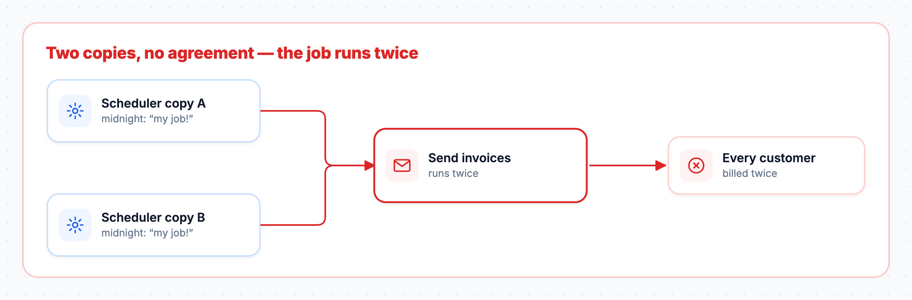

The same danger appears everywhere: two database servers both believing they're the primary, two workers processing the same file, two schedulers running the same task. Redundancy without agreement creates **duplicates**.

### 💡 The idea: elect one leader

The copies ask a small, highly reliable **coordination service** (etcd, ZooKeeper, Consul) for a **lease** — "I'm the leader for the next 10 seconds". Only one can hold it. The leader does the job; the other waits, ready to take over if the leader dies:

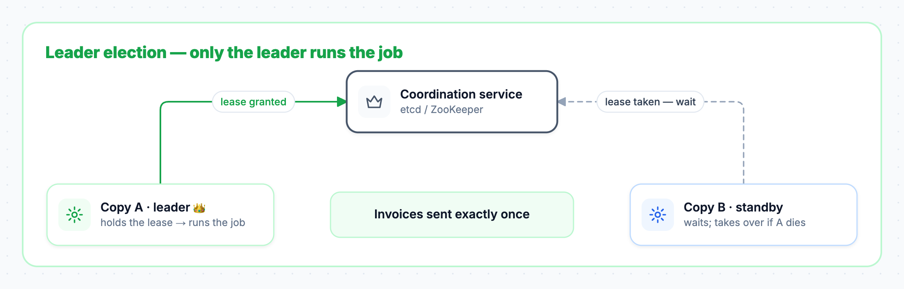

### The tricky part: a leader that doesn't know it lost

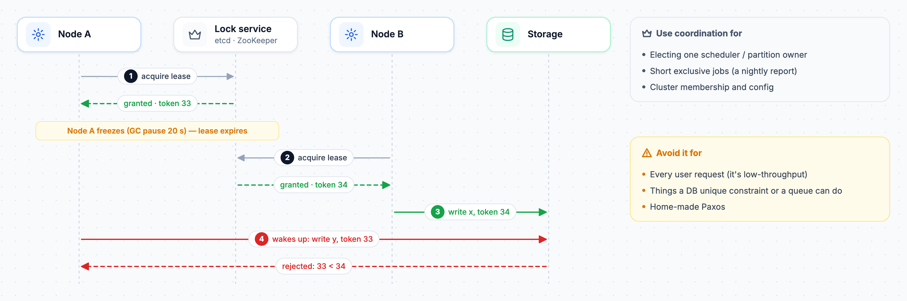


### The toolbox

| Tool | What it gives you | Typical use |
|------|-------------------|-------------|
| **Leader election** | Exactly one node performs a role | Scheduler, partition owner, primary DB selection |
| **Distributed lock** | Mutual exclusion across machines | "Only one worker rebuilds the report" |
| **Lease** | A lock that **expires** if the holder dies | Leader liveness without manual cleanup |
| **Fencing token** | A number that increases with every new lease | Storage rejects writes from stale leaders |
| **Membership / config** | Who's alive; shared settings with watches | Service discovery, feature flags |

### Why fencing tokens matter

A leader can be **paused** (GC pause, VM freeze, network hiccup) long enough for its lease to expire. Another node becomes leader. When the old one wakes up, it still *thinks* it's the leader. If storage checks the token on every write and rejects anything lower than the highest it has seen, the zombie leader can do no harm.

### Consensus in one paragraph

Raft and Paxos let a group of nodes (usually 3 or 5) agree on an ordered log of decisions as long as a **majority** is alive. That's why coordination clusters have odd sizes: 3 nodes tolerate 1 failure, 5 tolerate 2. You rarely implement consensus yourself — you use etcd, ZooKeeper, Consul or a managed database that has it built in.

### Cheaper alternatives to a lock

- A **database unique constraint** (unique usernames).
- A **conditional update** (`WHERE status = 'pending'`).
- A **queue with one consumer per partition** ("only one worker processes this user").
- A **database lease row** with an expiry timestamp.

> [!WARNING]
> **Common mistakes** — Taking a distributed lock on every user request (coordination services are low-throughput); "Redis locks" without fencing; lease timeouts shorter than a GC pause; making the whole system freeze when the coordination service is unavailable.

> [!TIP]
> **🎤 Say it in the interview** — "For 'only one scheduler runs', I'd use a lease in etcd with a fencing token passed on every write. For unique usernames, just a unique index — no lock needed."

#### ❓ Questions & answers

1. **What is a fencing token and why does it matter?** A monotonically increasing number issued with each lease. Storage rejects writes carrying an older token, so a paused or partitioned ex-leader can't corrupt data.
2. **Why are distributed locks dangerous on the request path?** They add network round trips and contention to every request, and a lock-service hiccup becomes a full outage.
3. **Give an alternative to a global lock for unique usernames.** A unique index on `username` — the database rejects the second insert atomically.


---

## 4.4 Bloom filters

> **In one sentence:** A Bloom filter is a tiny in-memory checklist that can instantly say **"definitely not seen before"** or **"maybe seen"** — letting you skip slow lookups for things that are certainly new.

### 🧩 The problem: "have I seen this before?" — billions of times

A web crawler finds millions of links every hour. Before downloading each page it must check: *have I already crawled this URL?* The list of seen URLs has **10 billion** entries — far too big for memory, so it lives on disk:

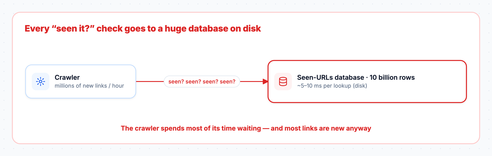

Every single link means a slow disk lookup (~5–10 ms). Millions of links per hour × a slow lookup each = the crawler spends its life waiting on the database — and most of those links turn out to be brand new anyway.

### 💡 The idea: a tiny filter in memory that answers "definitely new" instantly

A **Bloom filter** squeezes the set into a small bit array in memory (~1.2 GB for a billion URLs). For each URL it answers in microseconds:

- **"Definitely not seen"** — guaranteed correct. Crawl it; no database lookup needed.
- **"Maybe seen"** — usually right, occasionally wrong. Only these go to the real database to confirm.

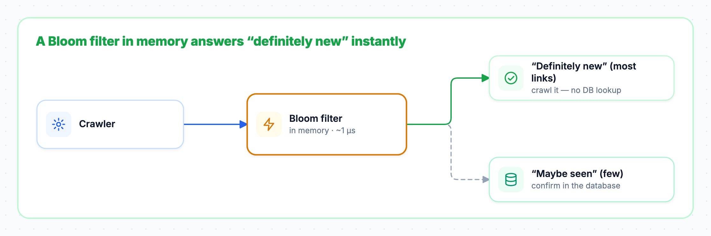

### How it works inside

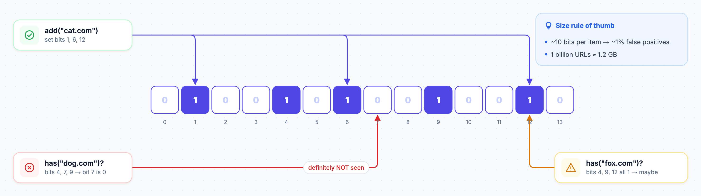


### How it works

- A bit array of size *m*, all zeros, and *k* hash functions.
- **Add:** hash the item *k* times and set those bits to 1.
- **Check:** hash again. If **any** bit is 0 → **definitely absent**. If **all** are 1 → **maybe present** (other items may have set those bits).

~10 bits per item gives about a **1% false-positive rate**. A billion items ≈ 1.2 GB — far less than storing the items themselves.

### Where it shines

| Use | How |
|-----|-----|
| **Web crawler** | "Have we already queued this URL?" before hitting the big seen-URL store |
| **Databases (LSM-trees)** | Skip reading files that can't contain the key (Cassandra, RocksDB, HBase) |
| **Cache penetration defense** | Reject lookups for IDs that don't exist before they reach the DB |
| **"Username taken?" UI hint** | Instant feedback; confirm with the real DB on submit |

### Limits

- No deletions in a standard Bloom filter (use a **counting Bloom** or **Cuckoo filter**).
- You can't list the members.
- A "maybe" is never proof — confirm with the source of truth when it matters.
- It degrades as it fills: size it for expected growth, or rotate filters.

> [!TIP]
> **🎤 Say it in the interview** — "A Bloom filter gives cheap negative checks for seen URLs; a 'maybe' is confirmed against the real store. False positives only cost a skipped page, which is acceptable."

#### ❓ Questions & answers

1. **Can a standard Bloom filter return a false negative after an insert?** No. The item's bits were set and are never cleared, so a check always finds them. (Unless you wrongly "delete" by clearing bits.)
2. **Why is a Bloom filter alone insufficient for "user is banned"?** False positives would wrongly ban innocent users. Use it only to skip work, and confirm "maybe" answers against the real list.
3. **How does it help a crawler's scheduler?** It filters out already-seen URLs in memory, avoiding millions of lookups in the big persistent store.


---

## 4.5 Checksums & data integrity

> **In one sentence:** A checksum is a short **fingerprint** of some data — recompute it later, and if the fingerprint doesn't match, you know the data was damaged in transit or on disk.

### 🧩 The problem: data gets damaged silently

Hardware isn't perfect. A cosmic ray flips a bit in memory, a disk slowly decays ("bit rot"), a network card corrupts a packet. At scale — billions of files, petabytes of data — this happens **every day**. The scary part: nothing crashes. The damaged file is simply stored and served as if it were fine:

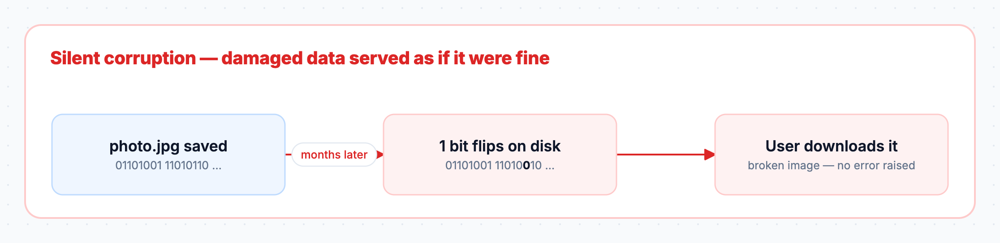

A user downloads their photo and it's broken. A backup restores corrupted data. And you had no idea until a customer complained.

### 💡 The idea: store a fingerprint and check it

When data is written, compute a **checksum** (a fingerprint such as SHA-256) and store it alongside. Whenever the data is read, moved or restored, compute the fingerprint again. Different fingerprint = damaged data → fetch a healthy copy instead, and repair the bad one:

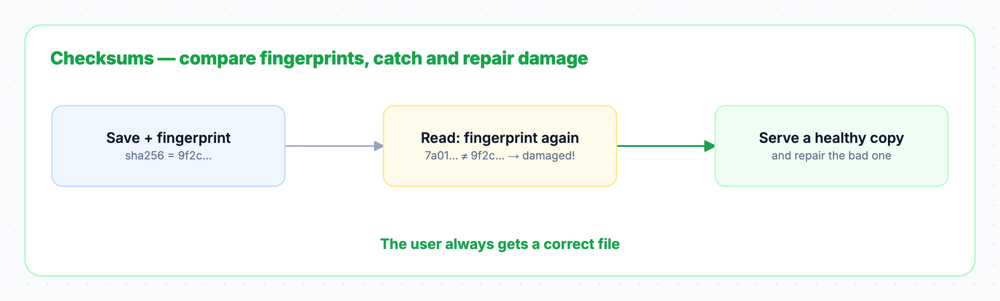

### Checksums and Merkle trees

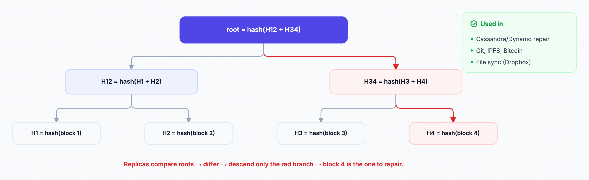


| Layer | Mechanism | Catches |
|-------|-----------|---------|
| Hardware / filesystem | ECC RAM, checksumming filesystems (ZFS) | Bit rot, some hardware faults |
| Network | TCP checksum, TLS integrity (MAC) | Transit corruption, tampering |
| Object storage | MD5/SHA-256 or CRC on upload (ETag, `Content-MD5`) | Upload corruption |
| Application | Content hashes as IDs, Merkle trees | Tampering, dedupe, replica drift |
| Replication | Checksum before apply; background **scrubbers** | Silently diverged replicas |

### Patterns worth knowing

- **Content-addressed storage** — the ID of a chunk *is* its hash (`sha256:ab12…`). Same content → same ID → free deduplication. Used by Git, Docker layers and Dropbox-style sync.
- **End-to-end upload check** — the client computes a hash, sends it with the upload, the server verifies before committing, and the hash is stored for later scrubbing.
- **Merkle trees** — a tree of hashes. Two replicas compare root hashes; if they differ, they walk down only the differing branches to find the exact bad block — without shipping all the data.

**CRC vs cryptographic hashes:** CRC32 is fast and catches accidental errors. SHA-256 is needed when someone might tamper deliberately.

> [!TIP]
> **🎤 Say it in the interview** — "Files are chunked and each chunk is identified by its SHA-256. The server verifies the hash on upload, and a background scrubber re-verifies replicas."

#### ❓ Questions & answers

1. **Detecting corruption vs detecting tampering?** Accidental corruption can be caught by CRCs. Tampering needs cryptographic hashes (and signatures or MACs, so the attacker can't just recompute the hash).
2. **Why do content-hash chunk IDs help integrity and dedupe?** Re-hashing on read proves the bytes match the ID, and identical chunks get identical IDs, so they're stored once.
3. **What does a scrubber do?** It periodically re-reads stored data, recomputes checksums, and repairs or re-replicates anything that no longer matches.


---

## 4.6 Distributed file systems

> **In one sentence:** A distributed file system stores files too big for one machine by **splitting them into chunks spread over many machines**, with a small metadata service that remembers where every chunk lives.

### 🧩 The problem: some files are bigger than any one machine

A company wants to analyse 5 years of logs — a **5 PB** (5,000 TB) dataset, including single files of several terabytes. One server can hold maybe 100 TB, and reading 5 PB from one machine's disks would take months:

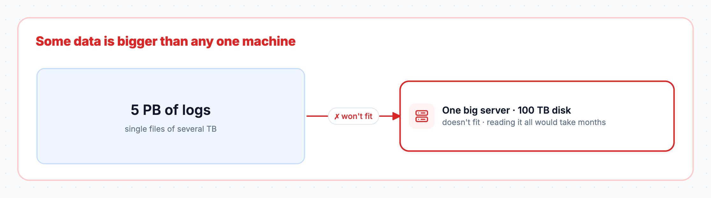

### 💡 The idea: split files into chunks and spread them out

Cut every file into large **chunks** (e.g. 128 MB) and store each chunk on several machines (usually 3 copies). A **metadata service** keeps the map: "file X = chunks 1…40,000, and chunk 7 lives on servers 12, 48 and 90". Clients ask the map once, then read chunks **directly and in parallel** from hundreds of machines — so a huge file is read hundreds of times faster, and a dead machine loses nothing:

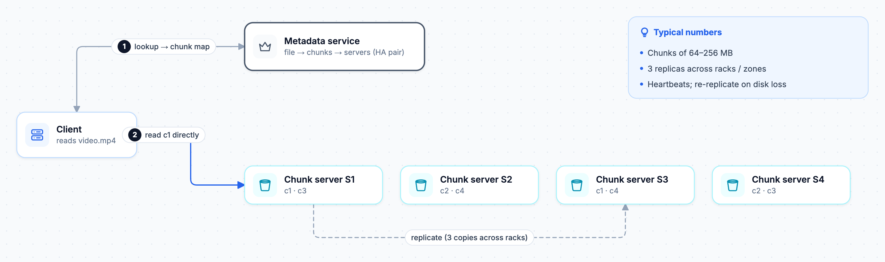


| Component | Responsibility |
|-----------|----------------|
| **Metadata service** | Namespace (folders/files), file → chunk → server map, leases; must be highly available |
| **Chunk servers** | Store chunk replicas on local disks; send heartbeats |
| **Client library** | Asks metadata for locations, then streams bytes **directly** from/to chunk servers |

**Typical numbers:** 64–256 MB chunks, 3 replicas across racks or zones, re-replication when a disk dies.

**Known pain points:**

- **Small-file problem** — millions of tiny files overwhelm the metadata service.
- **Metadata SPOF** — historically the weak point (HDFS NameNode); needs an HA standby.
- **Lease / generation numbers** — prevent two writers corrupting a chunk.

**Modern practice:** most products use **object storage + a metadata database** instead of running HDFS. The DFS ideas still matter because they're the same ideas: separate the **metadata plane** from the **data plane**, chunk large objects, replicate, and verify with checksums.

> [!TIP]
> **🎤 Say it in the interview** — For a Dropbox-like design: "Files are split into ~4 MB content-hashed chunks in object storage, with a metadata DB mapping files to chunk lists. Clients upload chunks directly with signed URLs." See [File sync case study](#case-study-09--file-sync).

#### ❓ Questions & answers

1. **Why are chunks large (64 MB+) in GFS/HDFS-style systems?** Fewer chunks means less metadata, and large sequential reads and writes make efficient use of disks and the network.
2. **What is the blast radius of losing the metadata server?** Nobody can open, create or locate files, so the whole namespace is unusable even though the data is safe. That's why it needs HA.
3. **How does a client find which servers hold a chunk?** It asks the metadata service, caches the answer, then talks to the chunk servers directly.


---

## 4.7 A note on the ESB

> **In one sentence:** An Enterprise Service Bus was a heavyweight "universal adapter" that routed and transformed messages between every system in a company — modern designs prefer **smart endpoints and dumb pipes**.

### 🧩 The problem it tried to solve

In the 2000s, big companies had dozens of old systems — billing, CRM, warehouse — each speaking a different format and protocol. Connecting every system to every other one directly created a tangled web of custom integrations.

### 💡 The idea then, and why it faded

The **ESB** put one central "smart bus" in the middle that translated and routed every message. It reduced the tangle — but the bus became a bottleneck: one team owned everyone's logic, every change waited on them, and when the bus had problems, everything stopped. Today's answer is **smart endpoints, dumb pipes**: a simple message broker carries messages, and each service owns its own logic and translations.


- **What it solved:** dozens of legacy systems with different protocols, integrated in one place.
- **Why teams moved on:** the bus became a central bottleneck, a single point of failure and an organizational chokepoint (one team owning everyone's transformation logic).
- **Modern equivalent:** a plain message broker or event backbone (Kafka, SQS/SNS) plus services that own their own logic and transformations.

> [!TIP]
> **🎤 Say it in the interview** — In an enterprise-integration prompt: "Rather than a central ESB, I'd use an event backbone with each domain publishing its own events and owning its own transformations."

<p align="right"><a href="#table-of-contents">↑ Back to top</a></p>

---

# Chapter 05 · Reliability & Operations

**Everything fails. Design so users barely notice — and so you know why within minutes.**

---

### In this chapter

| # | Lesson | One-line idea |
|---|--------|---------------|
| 5.1 | [Timeouts, retries & backoff](#51-timeouts-retries--backoff) | Retry politely or you'll make the outage worse |
| 5.2 | [Circuit breakers & bulkheads](#52-circuit-breakers--bulkheads) | Fail fast and contain the blast radius |
| 5.3 | [SLI, SLO, SLA & error budgets](#53-sli-slo-sla--error-budgets) | Reliability as a number and a business decision |
| 5.4 | [Observability](#54-observability) | Metrics say *that*, traces say *where*, logs say *why* |
| 5.5 | [Disaster recovery](#55-disaster-recovery) | RPO, RTO and what they cost |
| 5.6 | [Safe deployments](#56-safe-deployments) | Most outages are changes — release carefully |

> **The mindset:** Werner Vogels (Amazon CTO) put it best — *"Everything fails, all the time."* Senior engineers don't design systems that never fail; they design systems that **degrade gracefully, recover automatically, and explain themselves**.

---

## 5.1 Timeouts, retries & backoff

> **In one sentence:** Every call to another service needs a **timeout** (don't wait forever), a few **retries** (try again on a blip) and **backoff with jitter** (wait a little longer, at a random moment, before each retry) — otherwise one slow service can freeze your whole system.

### 🧩 The problem: waiting forever on a slow service

Your checkout service calls a shipping-price service. One day that service becomes very slow — it doesn't fail, it just hangs:

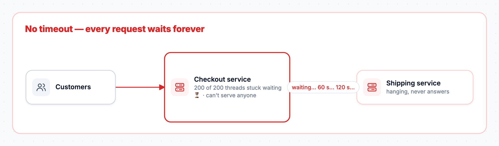

- Each checkout request **waits… and waits**. Many HTTP libraries wait forever by default.
- Every waiting request holds a thread and a connection. Soon **all** of them are stuck.
- Now checkout can't serve anyone — even users who don't need shipping prices. One slow service took down another.
- When clients see errors, they **retry immediately**, all at once — sending even more traffic to the struggling service, which then never recovers (a **retry storm**).

### 💡 The idea: give up quickly, retry politely

- **Timeout** — wait at most, say, 2 seconds. Then give up and use a fallback ("standard shipping: $5").
- **Retry a few times** — many failures are brief blips.
- **Back off with jitter** — wait longer before each retry (100 ms, 200 ms, 400 ms…) and add randomness, so thousands of clients don't all retry at the same instant.

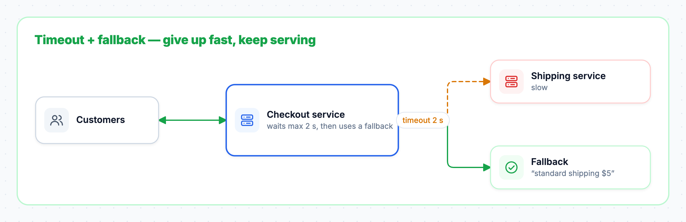

### Why the randomness matters

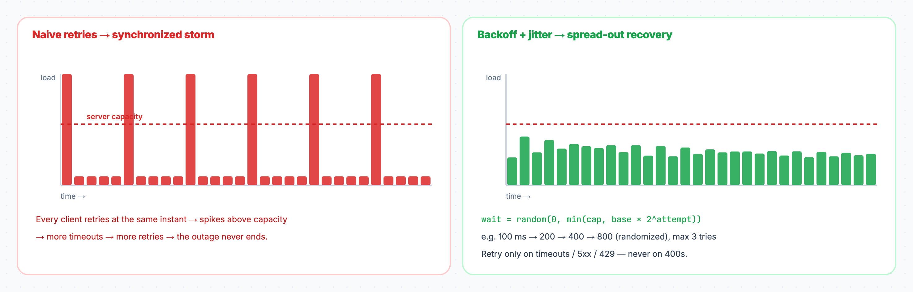


### The rules

1. **Always set a timeout.** Without one, a hung dependency holds your threads forever. Base it on the dependency's p99 plus some headroom, not on "30 seconds".
2. **Retry only what is safe.** GETs and idempotent writes (with idempotency keys). Never blindly retry a non-idempotent POST.
3. **Retry only transient errors.** Timeouts, `503`, `429`, connection resets. Never `400`/`401`/`404` — they will fail again.
4. **Back off exponentially.** 100 ms → 200 → 400 → 800…, with a cap.
5. **Add jitter.** Randomize each wait so thousands of clients don't retry in lockstep.
6. **Cap the attempts** (2–3), and use a **retry budget** (e.g. retries ≤ 10% of traffic) so retries can't multiply load.
7. **Retry at one layer only.** If the client, gateway and service each retry 3×, one user request can become 27 calls.

### Timeout budgets

If the user-facing SLO is 1 s, the gateway might get 900 ms, each downstream call 300 ms. Pass a **deadline** along with the request so downstream services stop working on requests the caller has already given up on.

> [!WARNING]
> **Common mistakes** — No timeout (the default in many HTTP clients is "infinite"); retries at every layer; retrying on validation errors; fixed retry intervals causing synchronized waves.

> [!TIP]
> **🎤 Say it in the interview** — "Calls to the payment provider have a 2-second timeout, up to 2 retries with exponential backoff and jitter, and an idempotency key so a retry can't double-charge."

#### ❓ Questions & answers

1. **What problem do retries create during a partial outage?** They multiply the load on an already struggling service (retry storm), which keeps it from recovering.
2. **Why add jitter?** To de-synchronize clients so retries spread out over time instead of arriving as one spike.
3. **Why retry at only one layer?** Retries multiply across layers. 3 × 3 × 3 = 27 attempts per user request can flatten a dependency.


---

## 5.2 Circuit breakers & bulkheads

> **In one sentence:** A **circuit breaker** stops calling a service that keeps failing, giving it time to recover; a **bulkhead** gives each dependency its own limited pool of resources, so one failing part can't use up everything.

### 🧩 The problem: one failing service drags everyone down

The payment provider goes down. Your checkout keeps calling it — every call waits for a timeout, then retries:

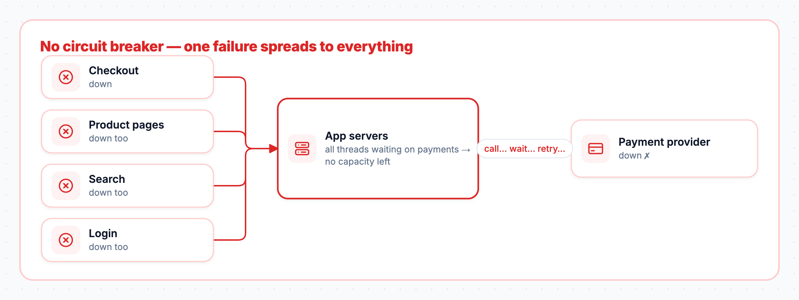

Every request is now slow. Threads and connections fill up waiting for a service that isn't going to answer. Soon the product pages, search and login — which don't even use payments — also stop responding, because they share the same exhausted servers. This chain reaction is called a **cascading failure**, and it turns a small outage into a total one.

### 💡 The idea: stop calling a broken service, and isolate the damage

Just like the circuit breaker in your house cuts the power when something shorts out:

- A **circuit breaker** counts failures. When too many calls fail, it **opens** and stops calling the broken service for a while — returning a quick fallback instead ("payments are temporarily unavailable, your cart is saved"). After a pause, it lets a few test calls through; if they work, it closes again.
- A **bulkhead** splits resources into separate compartments (like the watertight sections of a ship), so payments can only use its own small pool of threads, never everyone's.

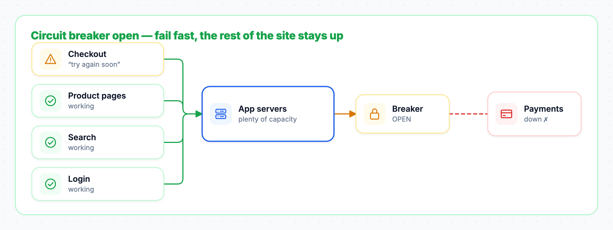


### Circuit breaker

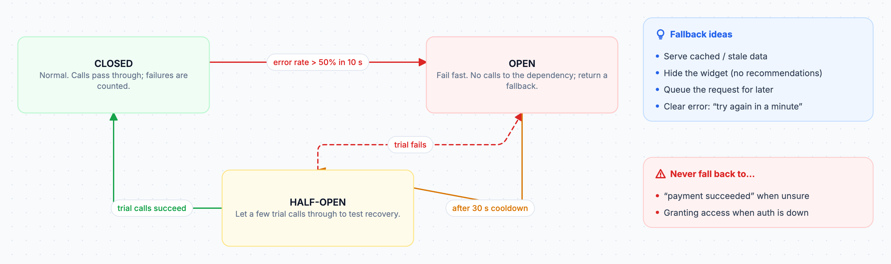

| State | Behaviour |
|-------|-----------|
| **Closed** | Normal. Calls pass through; errors and latency are tracked. |
| **Open** | Tripped. Calls fail immediately (or use a fallback) without touching the dependency. |
| **Half-open** | After a cooldown, a few trial calls are allowed. Success → closed; failure → open again. |

**Fallbacks:** cached or stale data, a default value, hiding a non-essential widget, queuing the action for later, or a clear "try again soon" message. **Never** fake success on money or security ("payment OK", "access granted").

### Bulkheads

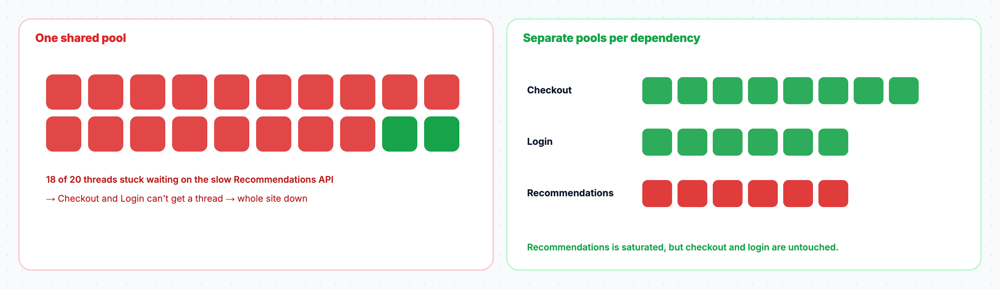

- **Separate connection/thread pools** per dependency, so a slow recommendations API can't starve checkout.
- **Separate queues** per priority: one-time passwords must never wait behind a marketing blast.
- **Separate compute** for noisy tenants or heavy batch jobs.
- **Cell-based architecture** — the ultimate bulkhead: split the whole system into independent "cells", each serving a subset of customers, so one bad cell affects only its slice.

### The full resilience toolkit

| Pattern | Purpose |
|---------|---------|
| Timeout | Bound the wait |
| Retry + backoff + jitter | Survive transient faults |
| Circuit breaker | Stop hammering a sick dependency |
| Bulkhead | Contain the blast radius |
| Load shedding | Drop low-priority work when saturated (return 503 early) |
| Rate limiting | Protect against overload from outside ([2.4](#24-rate-limiting)) |
| Graceful degradation | Turn off non-critical features under stress |
| Idempotency | Make all of the above safe ([4.2](#42-delivery-guarantees--idempotency)) |

> [!IMPORTANT]
> **🏛️ Architect's lens** — Decide **in advance** which features are critical (checkout, login) and which are optional (recommendations, reviews). Under stress, optional features switch off first. Writing that list is a product decision, and it's what separates a partial degradation from a full outage.

> [!TIP]
> **🎤 Say it in the interview** — Draw a small breaker symbol on the arrow to each risky dependency and say: "Timeout, retries with jitter, circuit breaker with a cached fallback, and a separate connection pool so search can't exhaust checkout's DB connections."

#### ❓ Questions & answers

1. **Closed vs open vs half-open in one sentence each?** Closed: calls flow and failures are counted. Open: calls fail fast without reaching the dependency. Half-open: a few test calls decide whether to close or re-open.
2. **Give a bulkhead example for a notification system.** Separate queues and workers for OTP/security messages and for marketing, so a million-message campaign never delays a login code.
3. **What's a dangerous fallback?** Returning "payment succeeded" or "authorized" when the real answer is unknown.


---

## 5.3 SLI, SLO, SLA & error budgets

> **In one sentence:** Instead of arguing about whether a system is "reliable enough", you **measure** what users experience (SLI), set a **target** (SLO), promise customers something slightly looser (SLA), and treat the allowed failures as a **budget** you can spend.

### 🧩 The problem: "is the system healthy?" — nobody agrees

The dashboards show CPU at 40%, memory fine, all servers "green". Meanwhile, 5% of customers get errors at checkout — and nobody notices for hours. Then the arguments start:

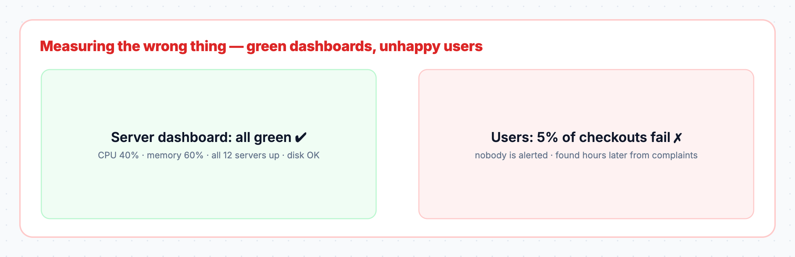

- Product wants to ship features faster; operations wants to slow down and fix things. With no shared number, it's opinion against opinion.
- "100% reliable" is impossible, and chasing it is extremely expensive — but how reliable **is** enough?

### 💡 The idea: measure what users feel, and agree on a target

1. **SLI (indicator)** — measure the user's experience, e.g. "the share of checkout requests that succeed in under 1 second".
2. **SLO (objective)** — agree on a target, e.g. "99.9% over 30 days".
3. **Error budget** — the 0.1% left over is the failure you're allowed. Budget left? Ship features. Budget gone? Fix reliability first.
4. **SLA (agreement)** — a contract with customers, set a bit looser than the SLO, with penalties if it's missed.

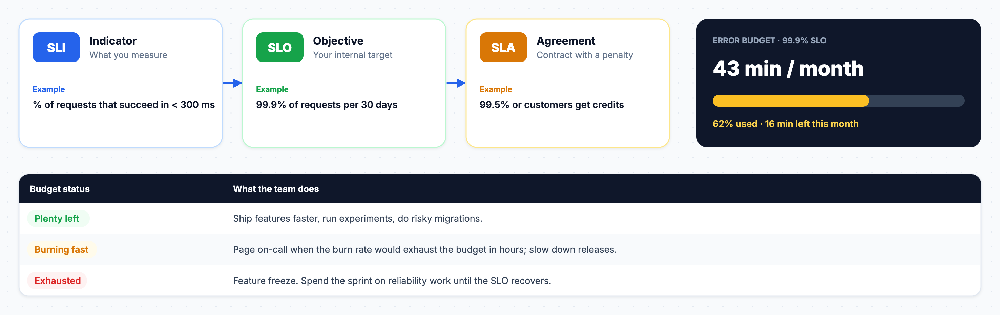


| Term | Meaning | Example |
|------|---------|---------|
| **SLI** (indicator) | A ratio of good events to total events | Successful requests under 300 ms ÷ all requests |
| **SLO** (objective) | Target for an SLI over a window | 99.9% over 30 days |
| **SLA** (agreement) | Business contract with penalties | 99.5% monthly, or service credits |

The SLA is deliberately **looser** than the SLO, so you breach your own target (and react) before you owe customers money.

### Choosing good SLIs

- **User-centric:** "feed loaded successfully within 1 s", not "CPU < 70%".
- **Per journey:** login, search, checkout each get their own.
- **Pipelines:** freshness ("data < 5 min old") and completeness.
- **Per region:** a global average can hide a region that's completely down.

### Error budgets

A 99.9% SLO allows 0.1% failure: about **43 minutes a month**.

- **Budget left?** Ship features, run experiments, do risky migrations.
- **Burning fast?** Alert on the **burn rate** (e.g. "at this pace the monthly budget is gone in 6 hours") rather than on individual blips.
- **Budget gone?** Freeze features and invest in reliability until it recovers.

> [!IMPORTANT]
> **🏛️ Architect's lens** — Error budgets end the eternal fight between "ship faster" (product) and "don't break things" (ops). Both sides agree on a number up front; the data decides. And 100% is never the right target — users can't tell 99.99% from 100%, and chasing the last nine costs a fortune.

> [!TIP]
> **🎤 Say it in the interview** — "SLO: 99.9% of redirects succeed within 50 ms, measured at the load balancer, per region. Alerts fire on fast burn of the error budget, not on CPU."

#### ❓ Questions & answers

1. **Can you have an SLO without an SLA?** Yes. Most internal services have SLOs and no external contract.
2. **Rough monthly downtime budget for 99.9% vs 99.99%?** About 43 minutes vs about 4.4 minutes.
3. **Why is CPU% a weak SLI?** Users don't feel CPU. A service can be at 30% CPU and returning errors, or at 90% and perfectly fine.


---

## 5.4 Observability

> **In one sentence:** Observability means your system reports enough about itself — **metrics**, **logs** and **traces** — that when something breaks, you can find **what, where and why** in minutes instead of guessing for hours.

### 🧩 The problem: "checkout is slow" — but where?

A user reports that checkout takes 10 seconds. One request passes through a gateway, 8 services, 2 databases, a cache and a queue:

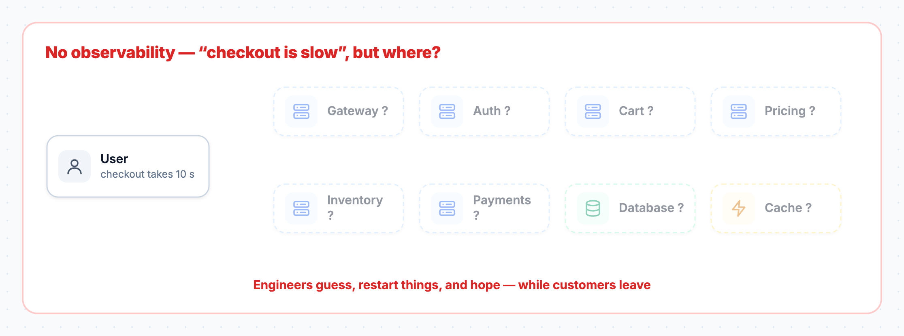

Without data, engineers guess: "maybe the database?", "maybe the network?", "let's restart everything and see". Each guess costs time while customers leave. In a system of many services, **you can't find a problem you can't see**.

### 💡 The idea: make every part report what it's doing

Build three kinds of signals into every service:

- **Metrics** — numbers over time (requests/s, error rate, p99 latency). They tell you **that** something is wrong.
- **Traces** — the path of one request through every service, with timings. They show you **where** the time goes.
- **Logs** — detailed records of events. They explain **why**.

Tie them together with one **trace ID** per request, and a vague complaint turns into a precise answer in minutes:

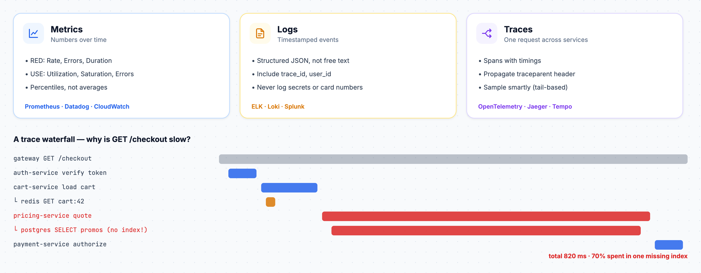


### Metrics

Cheap numeric time series — counters, gauges, histograms.

- **RED** for request-driven services: **R**ate, **E**rrors, **D**uration.
- **USE** for resources: **U**tilization, **S**aturation, **E**rrors.
- **The four golden signals** (Google SRE): latency, traffic, errors, saturation.
- Use **histograms** so you can see p95/p99. Averages lie.

### Logs

Timestamped events. Make them **structured** (JSON), include `trace_id`, `user_id` and `request_id`, and **never** log passwords, tokens or card numbers. Sample noisy debug logs.

### Traces

A **trace** is one request's journey; each hop is a **span** with timings. Propagate the trace context (`traceparent` header) across HTTP calls **and** message queues. **OpenTelemetry** is the vendor-neutral standard for all three signals.

### Alerting that doesn't burn people out

- Alert on **symptoms users feel** (SLO burn, error rate), not every cause (one pod restarted).
- Every alert links to a **runbook** with first steps.
- If an alert fires and nobody needs to act, delete or tune it.

### What to watch in specific systems

| System | Key signals |
|--------|-------------|
| Queues / streams | Consumer lag, age of the oldest message, DLQ size |
| Real-time | Concurrent connections, reconnect rate, message delivery latency |
| Caches | Hit ratio, evictions, memory |
| Databases | Replication lag, slow queries, connection pool saturation, disk |
| Payments | Authorization success rate per provider |

> [!IMPORTANT]
> **🏛️ Architect's lens** — Observability costs real money: high-cardinality labels (like `user_id` on a metric) and full trace sampling can make your monitoring bill rival your compute bill. Budget for it, sample intelligently (keep 100% of errors and slow requests, a small % of the rest), and set log retention deliberately.

> [!TIP]
> **🎤 Say it in the interview** — "Every service exposes RED metrics and structured logs with a trace ID. OpenTelemetry traces go gateway → service → DB → queue consumer. We alert on SLO burn and on queue lag."

#### ❓ Questions & answers

1. **RED vs USE — when each?** RED for services that handle requests (APIs). USE for resources (CPU, disks, connection pools, queues).
2. **Why do averages hide outages that p99 catches?** If 2% of requests take 10 s, the average barely moves but p99 shows the pain — and those are often your most valuable users.
3. **What breaks if you don't propagate trace context into queue consumers?** The trace ends at the producer. You can't connect an async failure or delay back to the request that caused it.


---

## 5.5 Disaster recovery

> **In one sentence:** Disaster recovery is your plan for when an **entire data center or region** goes down — decided in advance by two numbers: how much data you can afford to lose (**RPO**) and how long you can afford to be down (**RTO**).

### 🧩 The problem: everything lives in one place

Redundancy inside one data center protects you from a broken server. But what if the **whole region** fails — a power grid failure, a flood, a fire, a major cloud outage, or a bad configuration change that breaks everything at once? These events are rare, but they do happen to every large cloud:

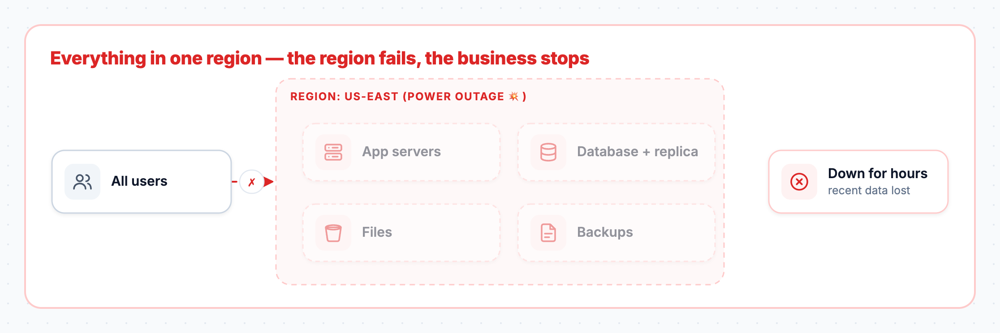

If every server, database and backup is in that one region, your product is down until the region comes back — hours or days — and some recent data may be gone forever.

### 💡 The idea: a copy in another region, and a rehearsed plan to switch

Keep your data replicated to a **second region** far away, with enough infrastructure ready (or quickly buildable) to take over. When disaster strikes, switch traffic to the second region:

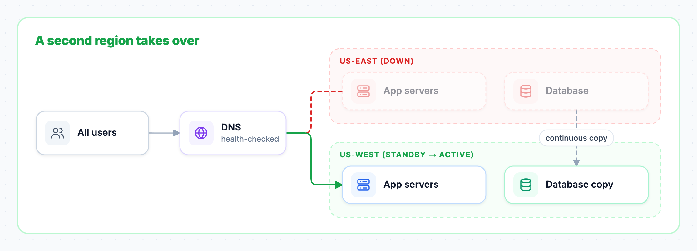

How much you invest depends on two business numbers: **RPO** — how much recent data you can lose — and **RTO** — how long you can be down. Smaller numbers cost more:

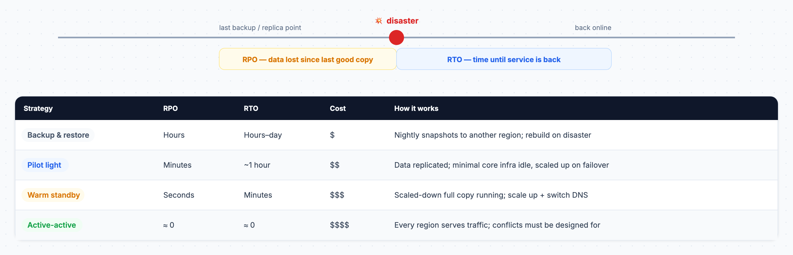


| Strategy | RPO | RTO | Cost | How |
|----------|-----|-----|------|-----|
| **Backup & restore** | Hours | Hours–days | $ | Snapshots copied to another region; rebuild everything on demand |
| **Pilot light** | Minutes | ~1 hour | $$ | Data continuously replicated; core infra defined in code but mostly off |
| **Warm standby** | Seconds | Minutes | $$$ | A scaled-down full copy runs; scale it up and switch DNS |
| **Active-active** | ≈ 0 | ≈ 0 | $$$$ | Every region serves live traffic; data conflicts must be designed for |

### Non-negotiables

- **Test your restores.** A backup you've never restored is a hope, not a plan.
- **Infrastructure as code** (Terraform, CloudFormation), so a region can be rebuilt reproducibly.
- **Game days / chaos engineering** — practise failing over before a real disaster forces you to.
- **Don't forget the extras:** secrets, DNS TTLs, async workers, scheduled jobs, third-party allowlists.
- **Protect backups from yourself:** immutable, separate-account backups defend against ransomware and a bad script.

> [!IMPORTANT]
> **🏛️ Architect's lens** — RPO and RTO are **business** numbers. Ask: "What does an hour of downtime cost us? What does losing 5 minutes of orders cost?" A startup might happily accept a 4-hour RTO; a stock exchange cannot. Every step down the table multiplies cost and complexity.

> [!TIP]
> **🎤 Say it in the interview** — Write it in the NFR corner: "RPO ≤ 1 min, RTO ≤ 15 min → async cross-region replica, infrastructure as code, DNS failover runbook, rehearsed quarterly."

#### ❓ Questions & answers

1. **Difference between RPO and RTO?** RPO is the maximum acceptable data loss, measured back from the disaster. RTO is the maximum acceptable downtime, measured forward to recovery.
2. **Why is RAID not DR?** RAID survives a disk failure in one machine. It doesn't help when the machine, the datacenter or the data itself (a bad delete) is lost.
3. **What goes wrong if DNS TTL is 24 h during a regional failover?** Many clients keep resolving to the dead region for up to a day, so your RTO becomes hours no matter how fast the backend fails over.


---

## 5.6 Safe deployments

> **In one sentence:** Most outages are caused by **changes**, so release new code gradually — to a small share of users first — watch the metrics, and roll back instantly if anything looks wrong.

### 🧩 The problem: one bad release breaks everything at once

Studies of large outages keep finding the same root cause: **a change** — new code, a config update, a database migration. If you ship a new version to **all** servers at the same moment and it has a bug:

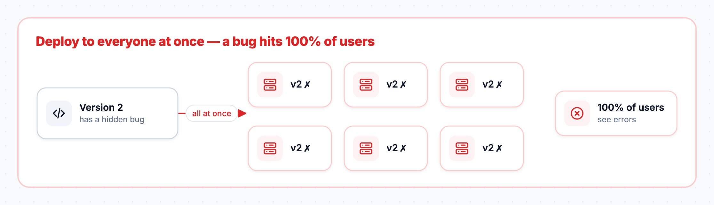

every single user hits the bug at once, and rolling back takes as long as the deploy did.

### 💡 The idea: release to a few, watch, then expand

Send the new version to a small slice first — say **1% of users** (a *canary*, named after the canaries miners carried to detect gas). Watch error rates and latency. If the numbers look healthy, expand to 10%, 50%, 100%. If they don't, roll back automatically — 99% of users never noticed:

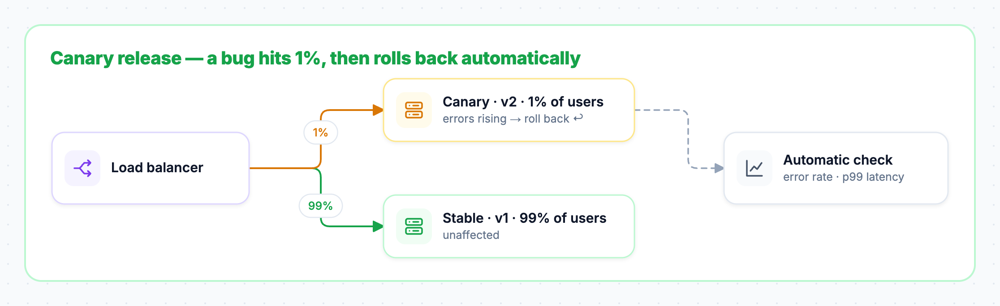

### Deployment strategies

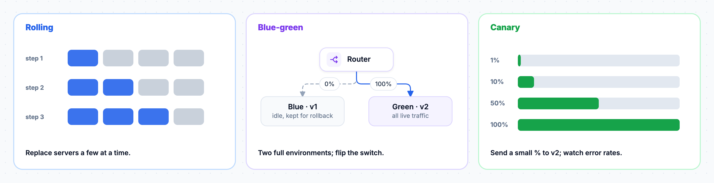


| Strategy | How | Rollback | Cost |
|----------|-----|----------|------|
| **Rolling** | Replace instances a few at a time | Roll forward/back again (minutes) | No extra capacity |
| **Blue-green** | Full new environment; switch the router | Instant — switch back | 2× infrastructure during release |
| **Canary** | 1% → 10% → 50% → 100%, gated on metrics | Stop and route back | Needs good metrics and traffic splitting |
| **Feature flags** | Ship code dark; turn features on per user or percentage | Flip the flag off | Flag debt to clean up |

### Database changes without downtime — expand / contract

1. **Expand:** add the new column or table; old code ignores it.
2. **Migrate:** write to both; backfill old rows in batches.
3. **Switch:** read from the new structure.
4. **Contract:** remove the old column once nothing uses it.

Each step is backward compatible, so you can deploy and roll back at any point. Never rename or drop a column in the same release that stops using it.

> [!TIP]
> **🎤 Say it in the interview** — "Deploys are canaried: 1% of traffic for 15 minutes with automatic rollback if the error rate or p99 regresses. Schema changes follow expand/contract, so old and new code both work mid-deploy."

#### ❓ Questions & answers

1. **Why must schema changes be backward compatible during a rolling deploy?** Old and new versions run at the same time. If the schema breaks either one, part of your fleet fails.
2. **Canary vs blue-green: key difference?** A canary shifts a small percentage gradually and watches metrics. Blue-green switches all traffic at once but can switch back instantly.
3. **What do feature flags add beyond deployment strategies?** They separate *deploy* from *release*: code ships dark and is turned on per user, cohort or percentage, and turned off instantly without a redeploy.


<p align="right"><a href="#table-of-contents">↑ Back to top</a></p>

---

# Chapter 06 · Architecture & Security

**How to shape the system — APIs, services, events — and how to keep it safe**

---

### In this chapter

| # | Lesson | One-line idea |
|---|--------|---------------|
| 6.1 | [API styles & API design](#61-api-styles--api-design) | REST at the edge, gRPC inside, GraphQL for flexible screens |
| 6.2 | [N-tier architecture](#62-n-tier-architecture) | Presentation, application, data |
| 6.3 | [Monolith vs microservices](#63-monolith-vs-microservices) | Start modular; split for a reason |
| 6.4 | [Event-driven architecture](#64-event-driven-architecture) | Announce facts; let others react |
| 6.5 | [Event sourcing](#65-event-sourcing) | Store the story, not just the ending |
| 6.6 | [CQRS](#66-cqrs) | Different models for writes and reads |
| 6.7 | [Service discovery](#67-service-discovery) | Find healthy instances by name |
| 6.8 | [VMs, containers & serverless](#68-vms-containers--serverless) | How much of the machine you share |
| 6.9 | [Authentication: OAuth, OIDC & SSO](#69-authentication-oauth-oidc--sso) | Tokens instead of passwords |
| 6.10 | [Security](#610-security) | Defense in depth |

---

## 6.1 API styles & API design

> **In one sentence:** An API is the **contract** that lets two programs talk — which requests are allowed, what each one needs and what comes back — and a good one is predictable, safe to retry and easy to change without breaking anyone.

### 🧩 The problem: no clear contract, so every change breaks someone

A mobile app, a website and three partner companies all call your backend. There's no agreed contract — each endpoint returns whatever the developer felt like that day:

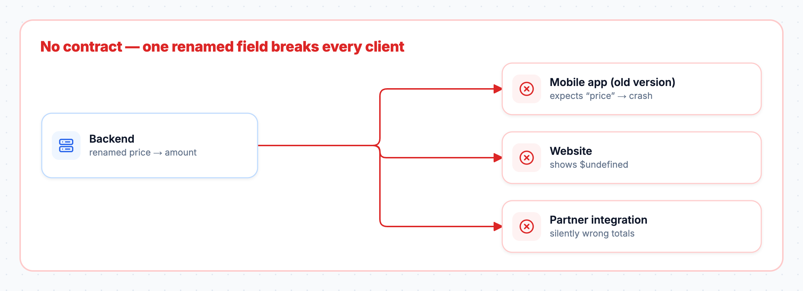

A backend developer renames `price` to `amount`. Deploy. Every mobile app in customers' pockets — which you can't update instantly — starts crashing. Partners' integrations silently break. Nobody knew the field mattered, because nothing said it did.

### 💡 The idea: a clear, versioned contract

Agree on a contract: resource names, fields, types, errors — written down (OpenAPI for REST, `.proto` files for gRPC). Add new fields freely, but never remove or rename one inside a version; make breaking changes in a new version (`/v2`) and keep `/v1` running while clients migrate:

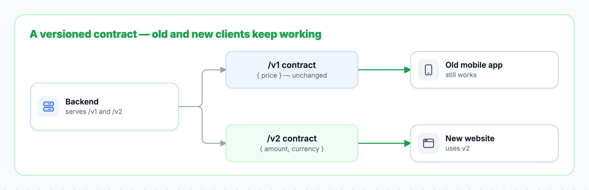

### Three API styles

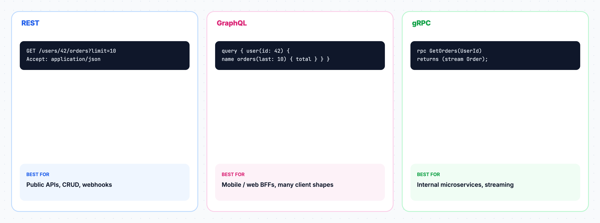


| | REST / JSON | GraphQL | gRPC |
|--|-------------|---------|------|
| Model | Resources + HTTP verbs | Client-written queries over a typed schema | Remote procedures from Protobuf |
| Payload | Text JSON | JSON | Binary Protobuf |
| Browser support | Native | Native | Needs grpc-web / a proxy |
| Caching | Excellent (HTTP caching, CDN) | Hard (usually POST) | App-level |
| Streaming | SSE / WebSockets on the side | Subscriptions | First-class, bidirectional |
| Best fit | Public APIs, CRUD, webhooks | BFF for varied mobile/web screens | Internal service-to-service |

**Common hybrid:** clients → REST (or a GraphQL BFF) → internal services over gRPC.

### REST design checklist

| Topic | Good practice |
|-------|---------------|
| **Resources** | Nouns: `GET /users/42/orders`, not `/getOrdersForUser` |
| **Verbs** | GET reads (safe), PUT replaces (idempotent), PATCH updates, POST creates, DELETE removes |
| **Status codes** | 200/201/204 success · 400 bad input · 401 not logged in · 403 not allowed · 404 missing · 409 conflict · 429 slow down · 5xx server fault |
| **Pagination** | **Cursor-based** (`?after=eyJpZCI6…&limit=20`) for feeds — stable under inserts. Offset only for small, static lists |
| **Idempotency** | `Idempotency-Key` header on POSTs that create money or orders |
| **Versioning** | `/v1/…` or a header; add fields freely, never remove or rename without a new version |
| **Filtering & sorting** | `?status=paid&sort=-created_at` |
| **Errors** | Consistent JSON body: `{ "error": { "code": "card_declined", "message": "…" } }` |
| **Long operations** | Return `202 Accepted` + a status URL (`/jobs/81`), or notify with a webhook |

> [!WARNING]
> **Common mistakes** — GraphQL with no query depth or complexity limits (one query can DoS you); REST POSTs for payments without idempotency keys; offset pagination on a feed (users see duplicates when new posts arrive); Protobuf changes that break older clients (never reuse field numbers).

> [!TIP]
> **🎤 Say it in the interview** — Sketch 3–6 endpoints with request/response shapes early: `POST /v1/links {long_url} → {code}`, `GET /{code} → 302`. Mention pagination and idempotency where relevant.

#### ❓ Questions & answers

1. **Why is HTTP caching easier with REST GETs than with GraphQL?** Each REST resource has its own URL that CDNs and browsers can cache. GraphQL usually POSTs varied queries to one URL.
2. **Name one GraphQL production hazard.** Deeply nested or expensive queries (DoS), N+1 resolver queries, and per-field authorization mistakes.
3. **Why cursor pagination for feeds?** Offsets shift as new items are inserted, causing duplicates and gaps. A cursor marks an exact position.


---

## 6.2 N-tier architecture

> **In one sentence:** N-tier architecture splits a system into layers — **presentation** (what users see), **application** (business rules) and **data** (storage) — so each can be secured, scaled and changed on its own.

### 🧩 The problem: the app talks straight to the database

Early desktop and "two-tier" apps connected **directly** from the user's computer to the database:

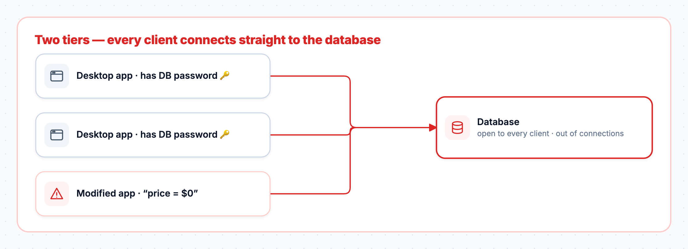

- Every installed copy of the app contains the **database password** — anyone can extract it and read or delete everything.
- Business rules live inside the client, so a modified client can skip them ("set price = $0").
- Thousands of clients each hold a database connection; the database runs out of connections.
- Changing a rule means updating every user's installed app.

### 💡 The idea: put a middle tier in charge

Add an **application tier** in the middle. Clients talk only to it; only it talks to the database. Rules, security checks and connections all live in one place you control:

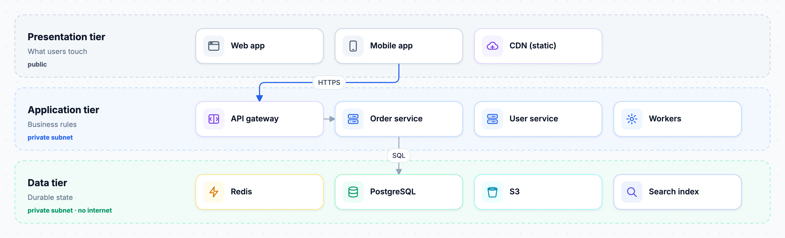


1. **Presentation** — browsers, mobile apps, server-rendered pages, CDN.
2. **Application** — APIs, business logic, workers.
3. **Data** — databases, caches, object storage, search.

Only the presentation edge is public. The application tier lives in private subnets; the data tier accepts connections **only** from the application tier.

A **2-tier** app (client talking directly to the database) is fragile and insecure at scale. Microservices don't remove tiers — they split the application tier into many services, each with its own slice of the data tier.

> [!TIP]
> **🎤 Say it in the interview** — When the board feels chaotic, draw three horizontal bands first — clients, services, data — and then fill them in. It calms the design and the interviewer.

#### ❓ Questions & answers

1. **Name the three classic tiers.** Presentation, application (logic), data.
2. **Where should authorization checks live?** In the application tier, on the server, for every request. Never only in the UI.
3. **How does a CDN relate to the presentation tier?** It's the presentation tier's edge: it serves static assets and cached pages close to users.


---

## 6.3 Monolith vs microservices

> **In one sentence:** A **monolith** is one application deployed as a single unit; **microservices** split it into many small services that are deployed separately — and the right choice depends mostly on **team size and how the product has grown**.

### 🧩 The problem: 200 engineers, one application

A monolith is perfect for a small team: one codebase, one deploy, simple debugging. But as the company grows to hundreds of engineers working in the same application:

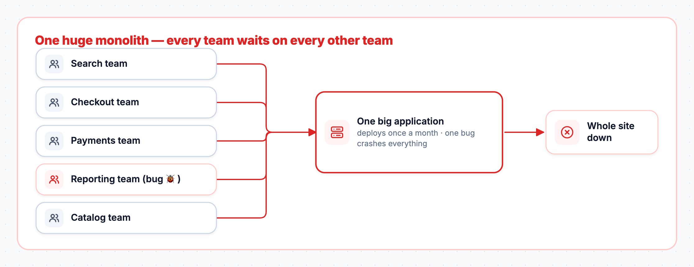

- Every team's changes ship together, so releases happen **once a month**, after long coordination.
- One team's bug — a memory leak in the reporting code — **crashes the whole product**, including checkout.
- The busiest part (search) can't be scaled on its own; you scale the entire app.
- Nobody understands the whole codebase any more, so every change feels risky.

### 💡 The idea: split along team and business boundaries

Split the product into **services** that each own one business area and its own data. Each team builds, deploys and scales its service independently, and services talk through APIs and events:

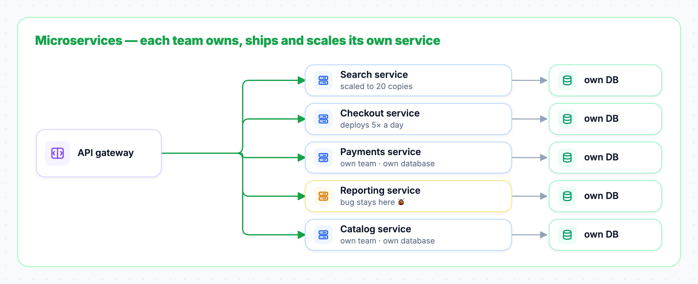

**But beware:** microservices trade code complexity for **network and operations complexity**. For a small team they usually slow things down. That's why the usual advice is: *start with a well-organised monolith, split when the pain is real.*

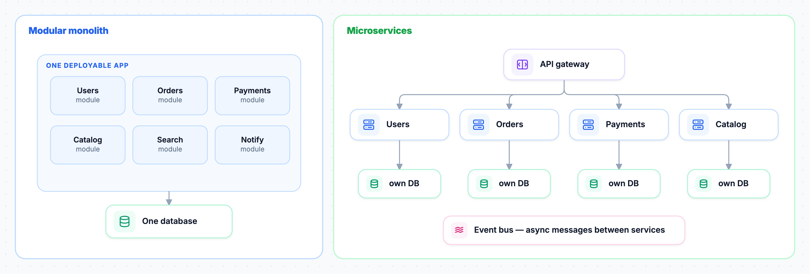


| | Monolith | Microservices |
|--|----------|---------------|
| Deploy | One artifact, simple | Independent per service; needs mature CI/CD |
| Data consistency | ACID across modules | Sagas, eventual consistency |
| Scaling | Scale the whole app | Scale hot services only |
| Failure | A bad bug can take down everything | Partial failures, cascading risks |
| Teams | Works well up to ~dozens of engineers | Maps services to teams (Conway's law) |
| Operations | Simple tracing and debugging | Needs service mesh, tracing, contracts, on-call per service |

### When a monolith is the senior choice

- Small team, early product, domains still unclear.
- Strong transactional rules across modules.
- You enforce **module boundaries** in code (a *modular monolith*) so you can extract later.

### When to split a service out

- **Different scaling needs** — video transcoding vs user profiles.
- **Team autonomy** — two teams keep blocking each other's releases.
- **Failure isolation** — payments must not fall over because marketing pages did.
- **Different technology needs** — rarely a good *primary* reason.

### How to migrate — the strangler fig

1. Put a router/gateway in front of the monolith.
2. Build the new service beside it; route one path to it.
3. Move its data (the hardest part) — often via change-data-capture.
4. Repeat until the old code is gone.

> [!IMPORTANT]
> **🏛️ Architect's lens** — Microservices solve **organizational** scaling more than technical scaling. Ten engineers running 40 services spend their time on infrastructure instead of product. The anti-pattern to name is the **distributed monolith**: many services, one shared database and chatty synchronous calls — all the costs of both worlds and the benefits of neither.

> [!TIP]
> **🎤 Say it in the interview** — For small prompts (URL shortener, rate limiter): "A single service is fine." For large ones: "Services along domain seams — users, catalog, orders, payments — each with its own database, talking through events." Always say what you would **not** split on day one.

#### ❓ Questions & answers

1. **What is a distributed monolith?** Services that must deploy together, share a database or call each other synchronously in long chains. Distributed costs, no independence.
2. **Why is splitting data harder than splitting code?** Joins and transactions across the boundary break, so you need migrations, dual writes or CDC, and new consistency patterns (sagas).
3. **When is a monolith the mature recommendation?** Early products, small teams, unclear domain boundaries, or strong cross-module transactional needs.


---

## 6.4 Event-driven architecture

> **In one sentence:** In event-driven architecture, a service announces **what happened** ("OrderPlaced") instead of telling other services what to do — and any service that cares reacts on its own, without the first one knowing or waiting.

### 🧩 The problem: one service has to know and call everyone

The order service, after saving an order, directly calls payments, inventory, email, analytics and loyalty points — one after another:

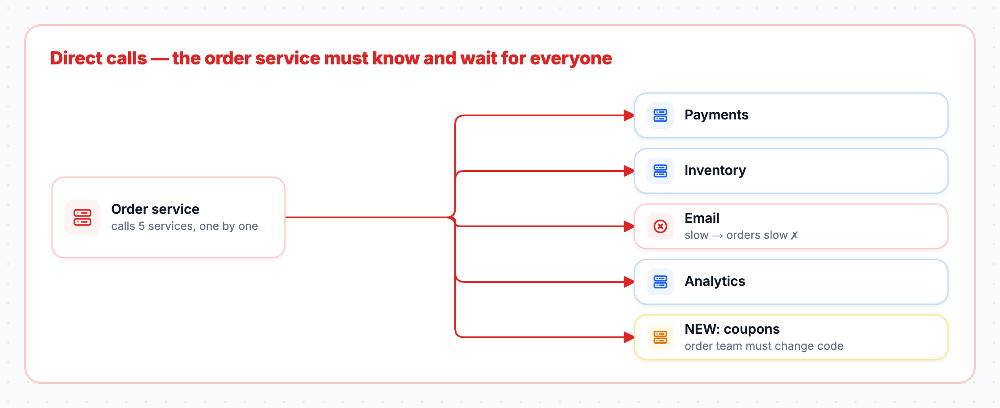

- If **email** is slow, placing an order is slow. If it's down, orders fail.
- The marketing team wants a new "send a coupon after the first order" feature — so the **order team must change their code**, test and redeploy for someone else's feature.
- The order service becomes a knot of dependencies that nobody dares to touch.

### 💡 The idea: publish the fact, let others subscribe

The order service just saves the order and publishes one event: **"OrderPlaced #42"**. Every interested service subscribes and reacts in its own time. A new feature? Add a new subscriber — the order service doesn't change at all:

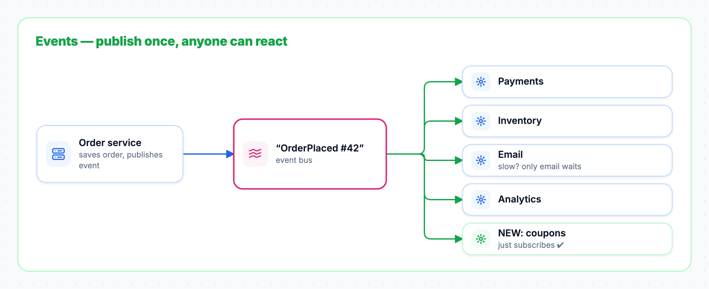


| | Request / response | Event-driven |
|--|--------------------|--------------|
| Coupling | Caller knows and waits for callee | Producer doesn't know who listens |
| Failure | Callee down → caller fails | Consumers retry independently |
| Adding a new reaction | Change the caller | Add a subscriber, no change to the producer |
| Debugging | Easy to step through | Needs correlation IDs and tracing |
| Consistency | Immediate | Eventual |

### Events vs commands

- **Event** — a past-tense fact: `OrderPlaced`, `PaymentFailed`. Anyone may listen.
- **Command** — a request to do something: `ChargeCard`. One specific handler.

### Keep synchronous

Anything the user is **waiting on to decide what to do next**: login, price quote, seat availability, "was my payment accepted?". Emit events **after** the synchronous commit (via the [outbox](#42-delivery-guarantees--idempotency)).

> [!WARNING]
> **Common mistakes** — Events used as disguised synchronous RPC (publish, then block waiting for a reply); vague event names (`OrderUpdated` with no detail); no schema versioning; events published without an outbox (DB and events disagree).

> [!TIP]
> **🎤 Say it in the interview** — "The order API commits the order and writes `OrderPlaced` to the outbox. Payment, inventory, email and analytics consume it. The user gets a 201 immediately; the confirmation email follows seconds later."

#### ❓ Questions & answers

1. **Why use an event for "send welcome email"?** Signup shouldn't fail or slow down because the email provider is slow. The email can retry independently.
2. **What does the transactional outbox solve here?** It guarantees the event is published if, and only if, the DB change committed.
3. **Give a step that should stay request/response.** Checking a card authorization result before showing "order confirmed", or checking seat availability.


---

## 6.5 Event sourcing

> **In one sentence:** Event sourcing stores **every change as a permanent record** ("deposited $100", "withdrew $30") instead of only the latest value — so you can always explain how you got here and rebuild the state at any point in time.

### 🧩 The problem: the current value can't explain itself

A normal database row just says `balance = $118`. Each update overwrites the previous value:

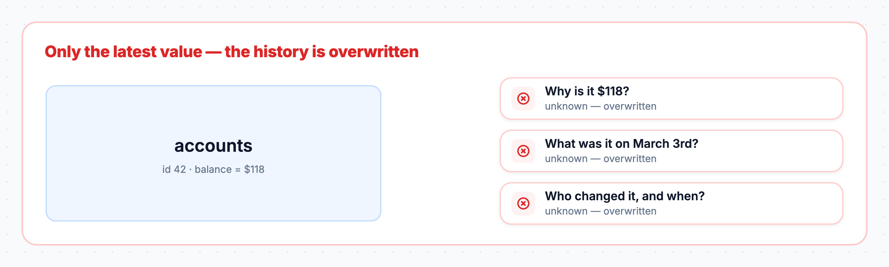

A customer disputes a charge: "Why is my balance $118? What was it on March 3rd? Who changed it?" The row can't answer — the history was overwritten. For banking, orders, compliance and auditing, that's a serious problem.

### 💡 The idea: store the story, not just the ending

Store every change as an **event** in an append-only log that's never edited. The current balance is simply the sum of the events. Want the balance on March 3rd? Add up the events until March 3rd:

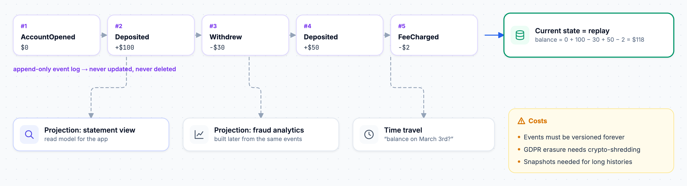


### How it works

1. A command is validated, then one or more events are **appended** to the event store (never updated or deleted).
2. Current state = fold over the events, sped up by periodic **snapshots**.
3. **Projections** build read-optimized views (usually with [CQRS](#66-cqrs)).

| Pros | Cons |
|------|------|
| Perfect audit trail — "how did we get here?" | Event schemas must be supported forever |
| Time travel — state at any past moment | "Delete my data" (GDPR) needs crypto-shredding |
| New read models can be built from history | Steep learning curve; easy to over-engineer |
| Natural fit for domains that already think in events | Querying current state needs projections |

**Use for:** ledgers and banking, order lifecycles, collaborative editing history, compliance-heavy domains. **Avoid for:** simple CRUD like profiles and settings.

> [!TIP]
> **🎤 Say it in the interview** — Only bring it up when audit or history is a first-class requirement: "The wallet is event-sourced — every credit and debit is an immutable event — and a projection keeps the current balance for fast reads."

#### ❓ Questions & answers

1. **How do you get the current balance in an event-sourced account?** Replay all events (or start from the latest snapshot and replay events after it), or read a projection that's kept up to date.
2. **Why is GDPR erasure awkward?** Events are immutable. Common fix: encrypt personal data per user and delete the key ("crypto-shredding").
3. **How do snapshots help?** You don't have to replay millions of events. Start from a recent saved state and apply only newer events.


---

## 6.6 CQRS

> **In one sentence:** CQRS (Command Query Responsibility Segregation) uses **one model for writing** data safely and **separate models for reading** it quickly — each shaped for its own job and kept in sync.

### 🧩 The problem: one model can't be great at both writing and reading

The same database tables serve two very different jobs:

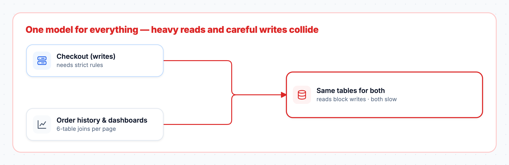

- **Writes** need careful rules and normalized tables (see [3.3](#33-normalization-vs-denormalization)).
- **Reads** need fast, ready-to-show data: "my order history with product names, images and delivery status" means joining 6 tables on every page load.
- Heavy dashboard queries lock the tables that checkout is writing to, so both get slower.

### 💡 The idea: separate the write side from the read side

**Commands** (changes) go to a write model built for correctness. After each change, an event updates one or more **read models** — pre-joined tables, caches or search indexes built for fast screens. Each side is simple, and each can scale on its own:

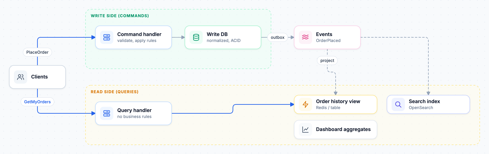


- **Commands** (`PlaceOrder`) go through the write model: validated, transactional, normalized.
- **Queries** (`GetMyOrders`) read from denormalized views, caches or search indexes.
- Events flow from the write side to **projectors** that update the read models.

**Helps when:** reads vastly outnumber writes, read and write shapes differ badly (feeds, dashboards, search), or the two sides need different scaling.

**Hurts when:** the app is small — two models double the work — or the team forgets that read models lag.

**Read-your-writes with CQRS:** return the new state in the command's response, briefly read from the write side after a command, or have the client wait for the projection to reach a version number.

> [!TIP]
> **🎤 Say it in the interview** — "Writes go to a normalized orders DB. An order-history view is updated asynchronously from events. After placing an order, the client shows the response data directly, so the brief lag is invisible."

#### ❓ Questions & answers

1. **What does CQRS solve that caching alone might not?** Reads that need a completely different *shape* or store (search, aggregates, denormalized joins), not just a faster copy of the same rows.
2. **Must CQRS include event sourcing?** No. You can use CQRS with a normal write database plus events or change-data-capture.
3. **How do you handle read-your-writes after a command?** Return the result in the command response, read from the write side briefly, or wait until the projection reaches the command's version.


---

## 6.7 Service discovery

> **In one sentence:** Service discovery is an always-up-to-date **phone book for your services**, so one service can find healthy copies of another **by name** even though their addresses change all the time.

### 🧩 The problem: addresses keep changing

In a modern system, servers are constantly created and destroyed — autoscaling adds copies at peak, deploys replace them, crashes kill them. Each new copy gets a **new IP address**. If the checkout service has a hard-coded list of payment-service addresses:

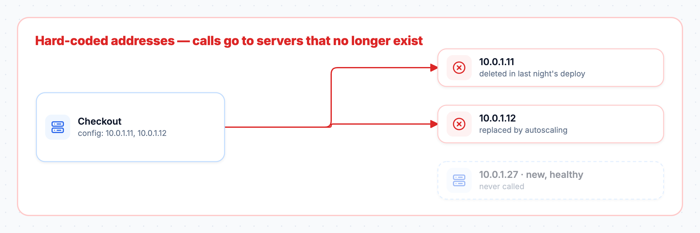

…it keeps calling servers that were deleted an hour ago, and never uses the new ones. Requests fail, and someone has to edit config files by hand.

### 💡 The idea: a registry that always knows who's alive

Every service instance **registers** itself when it starts and sends heartbeats while it's healthy. Callers ask the registry for "payments" by **name** and get the current list of healthy addresses:

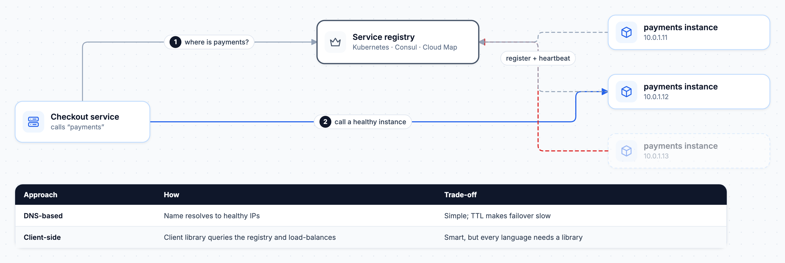


| Approach | How it works | Watch out |
|----------|--------------|-----------|
| **DNS** | Name resolves to healthy IPs | TTL caching slows failover |
| **Registry + proxy/sidecar** | Services register; Envoy/NGINX watch and route | Registry must be highly available |
| **Client-side** | A library queries the registry and load-balances | A good client is needed in every language |
| **Platform native** | Kubernetes Services, service meshes, cloud service maps | Great inside the cluster; plan for outside |

**Discovery** answers "who exists and is healthy?"; **load balancing** answers "which one do I call now?". Often one component does both.

> [!TIP]
> **🎤 Say it in the interview** — "Services call each other by name — `payments.internal` — resolved by the platform to healthy instances. No hard-coded IPs anywhere."

#### ❓ Questions & answers

1. **Why are pod IPs a bad hard dependency?** Pods are replaced constantly — deploys, autoscaling, failures — and each one gets a new IP.
2. **How does TTL affect DNS-based discovery?** Clients cache old answers for the TTL and keep calling dead instances until it expires.
3. **Client-side vs proxy-side load balancing — one benefit each?** Client-side: no extra network hop. Proxy-side: language-agnostic, with policy in one place.


---

## 6.8 VMs, containers & serverless

> **In one sentence:** VMs, containers and serverless are three ways to **package and run your code** on shared machines — from a whole virtual computer, to a lightweight box with just your app, to just a function the cloud runs for you.

### 🧩 The problem: "it works on my machine"

A developer's code runs perfectly on their laptop. On the production server, it crashes:

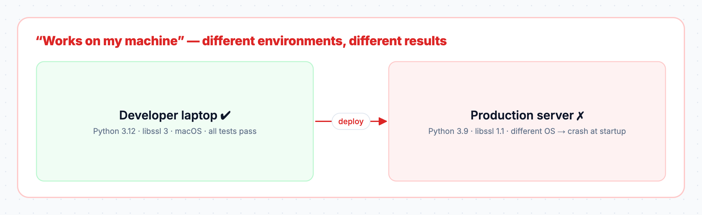

The server has a different operating system version, a different language runtime, a missing library. Setting up each new server by hand takes hours and never comes out exactly the same. And running one app per physical machine wastes most of each machine's power.

### 💡 The idea: package the app with everything it needs

A **container** bundles your code **and** its exact runtime, libraries and settings into one image. The same image runs identically on a laptop, a test server and production — and dozens of containers can share one machine safely:

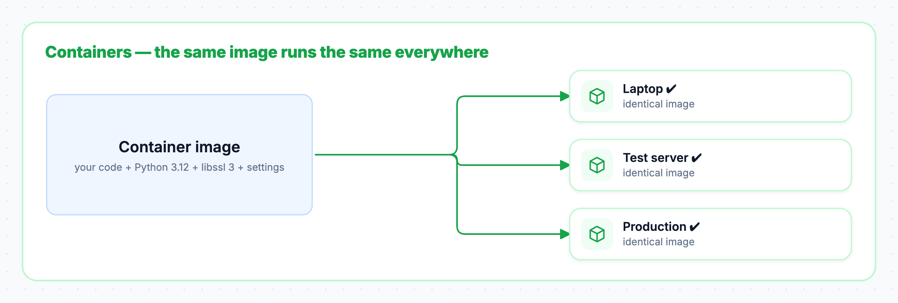

### Three ways to run code

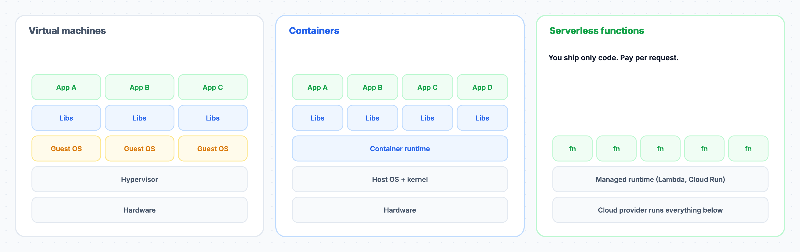


| | VMs | Containers | Serverless functions |
|--|-----|------------|----------------------|
| Isolation | Strong (own kernel) | Process-level (shared kernel) | Managed by the provider |
| Start time | Minutes | Seconds | Milliseconds (plus cold starts) |
| Density | Low | High | N/A |
| You manage | OS and up | Image and up | Just code |
| Billing | Per hour | Per node (or per pod on managed platforms) | Per request and duration |
| Best for | Strong multi-tenant isolation, legacy OS needs | Most services | Spiky, event-driven glue; cron; webhooks |

### Orchestration (Kubernetes) at interview depth

- **Desired state** — "run 6 replicas of payments", and it keeps it true.
- **Health probes** — *liveness* (restart if stuck), *readiness* (only send traffic when ready).
- **Service discovery and load balancing** inside the cluster.
- **Rolling deploys and autoscaling** (on CPU, memory or custom metrics like queue lag).

Kubernetes won't fix a hot database partition or a bad data model — it runs your containers, not your architecture.

> [!IMPORTANT]
> **🏛️ Architect's lens** — Kubernetes has a real operational cost. A small team is often better served by a managed platform (Cloud Run, ECS Fargate, App Runner, a PaaS) and managed databases. Adopt an orchestrator when the number of services and teams makes the investment pay off.

> [!TIP]
> **🎤 Say it in the interview** — "Stateless services run as containers behind the load balancer, autoscaled on CPU and queue depth. State lives in managed databases, not in the cluster."

#### ❓ Questions & answers

1. **Why can containers start faster than VMs?** They're just isolated processes on an already-running kernel, so there's no guest OS to boot.
2. **Does Kubernetes replace replication for Postgres?** No. It restarts processes but doesn't replicate data. You still need DB replication, backups and failover.
3. **What is a liveness probe for?** Detecting a stuck container so the orchestrator restarts it. A *readiness* probe controls whether it receives traffic.


---

## 6.9 Authentication: OAuth, OIDC & SSO

> **In one sentence:** **OAuth** lets one app access your data in another app **without ever seeing your password**, **OIDC** adds a standard way to say who you are, and **SSO** lets one login open many apps.

### 🧩 The problem: giving away your password

A photo-printing app wants to print pictures from your Google Photos. Before OAuth, the only way was to type your **Google password into the printing app**:

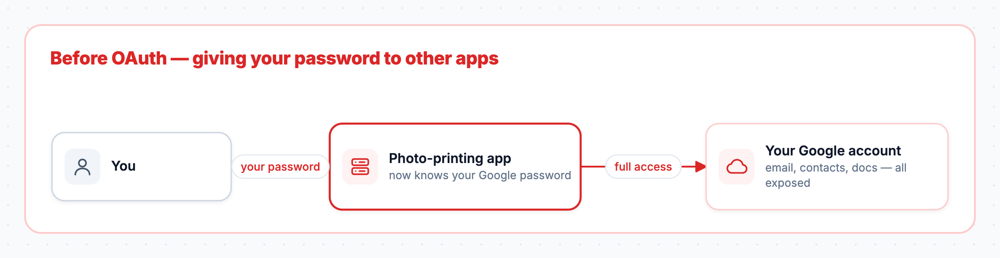

- The app now has **full access** to everything: your email, contacts, documents — not just photos.
- You can't take access away without changing your password (and breaking every other app that has it).
- If that small app gets hacked, your Google password leaks.

### 💡 The idea: a limited, revocable key instead of your password

With **OAuth**, the printing app sends you to Google. You log in **on Google's own page** and approve a specific permission — "read your photos". Google hands the app a **token**: a key that only opens your photos, expires, and can be revoked any time. The app never sees your password:

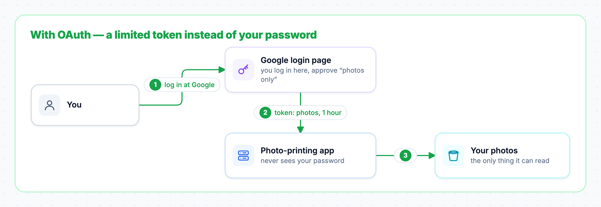

### The full flow

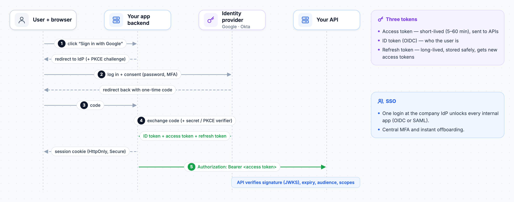


### AuthN vs AuthZ

- **Authentication (AuthN)** — *who are you?* Passwords + MFA, passkeys, OAuth/OIDC, API keys for machines.
- **Authorization (AuthZ)** — *what may you do?* Roles (RBAC), attributes (ABAC), per-object ownership checks.

### The three tokens

| Token | Purpose | Lifetime |
|-------|---------|----------|
| **Access token** | Sent to APIs as proof of permission (scopes) | Short: 5–60 min |
| **ID token** (OIDC) | Tells your app who the user is | Short |
| **Refresh token** | Gets new access tokens without logging in again | Long; store securely; rotate |

### Sessions vs JWTs

| | Server session (cookie → session store) | Stateless JWT |
|--|------------------------------------------|---------------|
| Revocation | Instant (delete the session) | Hard until expiry — keep lifetimes short |
| Scaling | Needs a shared store (Redis) | Verify anywhere with a public key |
| Size | Tiny cookie | Larger token on every request |

**Common pattern:** short-lived JWT access tokens plus a refresh token that can be revoked.

### Flows to name

- **Authorization code + PKCE** — web apps, mobile apps, SPAs (the default).
- **Client credentials** — service-to-service, no user involved.
- **Device code** — TVs and CLIs ("enter this code on your phone").

> [!WARNING]
> **Common mistakes** — Long-lived tokens in `localStorage` (easy to steal via XSS); not verifying token signature, expiry, issuer and audience; treating "logged in" as "allowed to see this object" — **IDOR** (insecure direct object reference), e.g. changing `/orders/41` to `/orders/42` and seeing someone else's order.

> [!TIP]
> **🎤 Say it in the interview** — "Login via OIDC with PKCE. The gateway validates short-lived access tokens locally using cached JWKS keys. Every service still checks object-level permissions — ownership or tenant — on each request."

#### ❓ Questions & answers

1. **Why is the authorization code exchanged on the backend (or with PKCE)?** So tokens never pass through the browser URL, and a stolen code is useless without the client secret or PKCE verifier.
2. **Does an ID token replace authorization checks on your API?** No. It says who the user is, not what they may access. APIs check permissions per request and per object.
3. **What does SSO give an employee using five internal tools?** One login with MFA for all of them, and instant access removal when they leave.


---

## 6.10 Security

> **In one sentence:** Security means **many layers** of protection — verify who is calling, check what they're allowed to do on every request, encrypt data and limit damage — so that when one layer fails, the others still hold.

### 🧩 The problem: one wall, and everything open behind it

Many systems rely on a single defence: a firewall at the edge. Behind it, everything trusts everything:

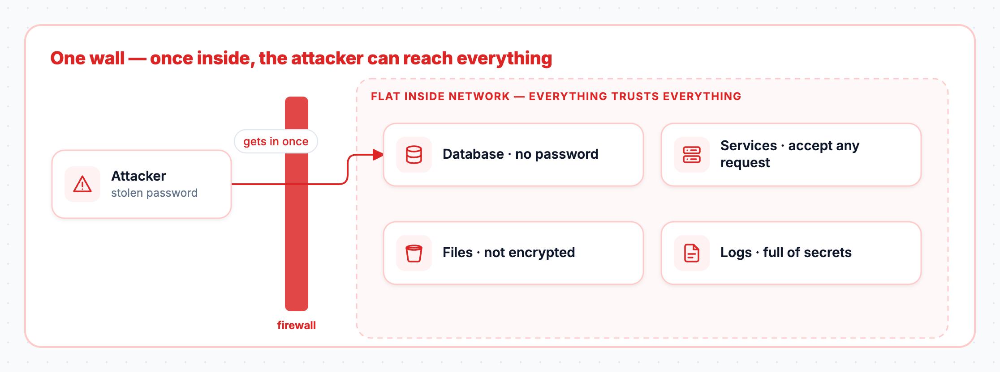

An attacker finds one weakness — a stolen employee password, a vulnerable library, a misconfigured server — and gets past the wall. Inside, the network is flat: the database has no password, services accept any request, data isn't encrypted, and logs are full of secrets. One mistake becomes a total breach.

### 💡 The idea: defence in depth

Build **several independent layers**, like a castle with a moat, walls, locked doors and guards inside. An attacker who gets through one layer still faces the next, and the damage stays small:

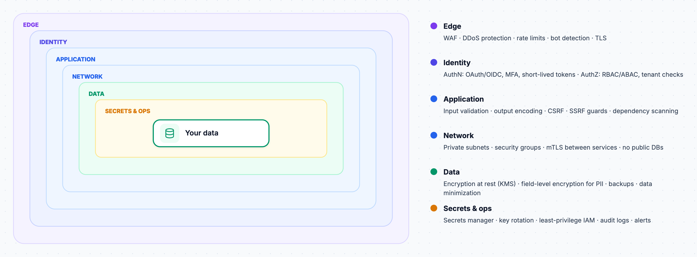


### The checklist for every user-facing design

| Area | Must-haves |
|------|------------|
| **Transport** | TLS everywhere; HSTS; mTLS between services where warranted |
| **Identity** | OIDC/OAuth, MFA, short-lived tokens, secure password hashing (Argon2/bcrypt) |
| **Authorization** | Server-side checks on **every** request and object; tenant isolation as a hard boundary |
| **Input & output** | Validate input; parameterized SQL; encode output (XSS); CSRF protection for cookie sessions |
| **Abuse** | Rate limits on login, signup, password reset and expensive endpoints; bot detection; CAPTCHA as a last resort |
| **Data** | Encryption at rest (KMS); field-level encryption for sensitive PII; minimize what you collect |
| **Secrets** | Secrets manager; never in code, images or logs; rotation; least-privilege IAM roles |
| **Uploads** | Signed URLs with short expiry; scan files; serve user content from a separate domain |
| **Supply chain** | Pin and scan dependencies and images; verify webhook signatures |
| **Logging** | Audit logs for sensitive actions; redact tokens, passwords, card numbers, PII |

### Threats worth naming

| Threat | Defense |
|--------|---------|
| **IDOR** — `/orders/42` shows someone else's order | Check ownership on every object access |
| **SQL injection** | Parameterized queries / ORM |
| **XSS** | Output encoding, Content-Security-Policy, HttpOnly cookies |
| **CSRF** | SameSite cookies, CSRF tokens |
| **SSRF** — your "fetch this URL" feature reaches internal services | Allowlist destinations, block private IP ranges and metadata endpoints |
| **Credential stuffing** | Rate limits, MFA, breached-password checks |
| **Public bucket leak** | Block public access by default; audits |

### Compliance awareness

Payments (**PCI DSS** — let a provider like Stripe tokenize cards so card numbers never touch your servers), health data (**HIPAA**), personal data (**GDPR** — right to erasure, data residency). You're not expected to be a lawyer — just to notice when a domain carries these constraints and design for them (region pinning, audit logs, deletion workflows).

> [!IMPORTANT]
> **🏛️ Architect's lens** — The cheapest security is the data you never store. Tokenize cards through the payment provider, avoid collecting fields you don't need, and set retention limits. Every stored field is a liability in a breach.

> [!TIP]
> **🎤 Say it in the interview** — Add an "Auth" box and one sentence: "Every request carries a verified identity. Services check object-level permissions. Uploads use signed URLs. Secrets live in a secrets manager, and logs are redacted."

#### ❓ Questions & answers

1. **AuthN vs AuthZ in one sentence each?** AuthN proves who you are. AuthZ decides what you're allowed to do.
2. **How do signed URLs protect direct-to-storage uploads?** The server signs a URL scoped to one object key, method and short expiry. Clients upload straight to storage without holding credentials, and the URL is useless later.
3. **Name two log-redaction rules you'd enforce.** Never log passwords or tokens (Authorization headers), and mask card numbers and personal identifiers.


<p align="right"><a href="#table-of-contents">↑ Back to top</a></p>

---

# Chapter 07 · Interview Playbook

**A repeatable method for turning a vague prompt into a clear, defended design in 45 minutes**

---

### In this chapter

| # | Lesson | You will be able to… |
|---|--------|----------------------|
| 7.1 | [How interviews work](#71-how-interviews-work) | Know what's actually being scored |
| 7.2 | [The framework](#72-the-framework) | Run the same 7 steps on any prompt |
| 7.3 | [Clarify requirements](#73-clarify-requirements) | Ask the questions that change the design |
| 7.4 | [Capacity estimation](#74-capacity-estimation) | Size traffic, storage and bandwidth in minutes |
| 7.5 | [API & data model](#75-api--data-model) | Pin down contracts and entities before boxes |
| 7.6 | [High-level design & the whiteboard](#76-high-level-design--the-whiteboard) | Draw a clean board and narrate it |
| 7.7 | [Deep dives & failures](#77-deep-dives--failures) | Go deep and break your own design |
| 7.8 | [Trade-offs cheat sheet](#78-trade-offs-cheat-sheet) | Defend any choice in one sentence |
| 7.9 | [Common pitfalls](#79-common-pitfalls) | Avoid the mistakes that sink candidates |
| 7.10 | [Level expectations](#710-level-expectations) | Calibrate depth to your target level |
| 7.11 | [A full mock, start to finish](#711-a-full-mock-start-to-finish) | Hear what a strong session sounds like |

---

## 7.1 How interviews work

> **In one sentence:** A system design interview is a 45–60 minute collaborative conversation where you're scored on **how you reason under ambiguity**, not on reproducing a famous company's architecture.

### 🧩 Why these interviews exist

Coding interviews test whether you can write a function. But senior engineering work is mostly **decisions**: which database, where to cache, what happens when a service fails, what to build now and what later. Companies can't hand you their real system for an afternoon — so they give you a vague prompt ("Design Instagram") and watch **how you think** through it with them.

That's why there is no single right answer. Two very different designs can both score highly, as long as the reasoning behind them is clear, grounded in requirements, and honest about trade-offs.


### What interviewers actually score

| Signal | Strong | Weak |
|--------|--------|------|
| **Clarification** | Asks about users, scale, consistency; cuts scope | Jumps straight to Kafka |
| **Structure** | Clear API → data → HLD → deep dive | Random boxes |
| **Trade-offs** | Names both sides, picks with a reason | "X because it's popular" |
| **Depth** | Explains *why* a shard key or cache works | Buzzwords |
| **Failure thinking** | Finds SPOFs, discusses degradation | "It's highly available" |
| **Communication** | Narrates, checks in, adapts to hints | Silent drawing or a monologue |

### Company flavours

- **Product companies** — user features, mobile clients, feeds, personalization.
- **Infrastructure / platform** — multi-tenancy, quotas, SLOs, control plane vs data plane.
- **Fintech / health** — correctness, audit, idempotency, compliance.
- **Marketplaces / ads** — contention, auctions, fraud, consistency under load.

> [!TIP]
> **🎤 Mindset** — Treat the interviewer as a teammate at a whiteboard, not a judge. Phrase decisions as proposals: "I'd put a cache here — does that match the freshness you care about?"

---

## 7.2 The framework

> **In one sentence:** Use the same seven steps every time — clarify, estimate, API, data, high-level design, deep dive, wrap up — so your brain is free to think about the problem instead of the process.

### 🧩 The problem: freezing or rambling

Without a plan, candidates fall into one of two traps. Some **freeze** at the blank whiteboard. Others **jump straight to technology** — "we'll use Kafka and Cassandra" — and spend 30 minutes on one clever detail before discovering they misunderstood the question:

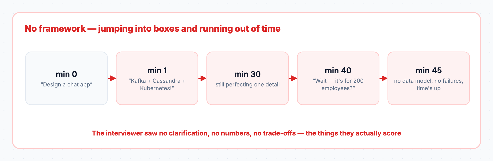

### 💡 The idea: the same seven steps, every time

A fixed framework removes the "what do I do next?" stress, makes sure nothing important is skipped, and shows the interviewer a structured mind — exactly what they are scoring:


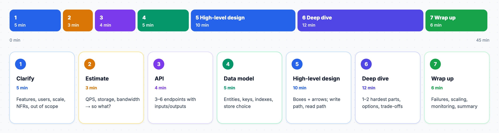

| Step | Time | Output on the board |
|------|------|---------------------|
| 1. **Clarify** | ~5 min | Functional requirements, NFRs as numbers, out-of-scope, assumptions |
| 2. **Estimate** | ~3 min | Read/write QPS, storage, bandwidth, and what they imply |
| 3. **API** | ~4 min | 3–6 endpoints with inputs, outputs, errors |
| 4. **Data model** | ~5 min | Entities, keys, indexes, store choice, shard key |
| 5. **High-level design** | ~10 min | 6–12 boxes; write path then read path |
| 6. **Deep dive** | ~12 min | 1–2 hardest problems, options, decision |
| 7. **Wrap up** | ~6 min | Failures, bottlenecks at 10×, monitoring, summary |

Senior candidates compress steps 1–4 and spend more time on 6–7. Junior candidates can spend longer on 5.

> [!IMPORTANT]
> **🏛️ Architect's lens** — This is exactly how real design reviews run: problem statement, requirements, estimates, proposal, risks. The interview is a compressed design review — practise it as one.

---

## 7.3 Clarify requirements

> **In one sentence:** Spend the first five minutes turning a one-line prompt into a **bounded problem** — who, what, how much, how fast, and what's out of scope.

### 🧩 The problem: designing the wrong system

"Design a chat app." Is it WhatsApp for 2 billion people, or internal chat for a 200-person company? One-to-one or groups of 100,000? Do messages need to be stored forever? Each answer leads to a **completely different** design. Candidates who start drawing immediately often build a beautiful solution to a problem nobody asked about.

### 💡 The idea: turn a vague prompt into a clear, bounded problem

Spend the first few minutes asking the questions that change the design, write the answers down, and agree on what is **out of scope**.


### Functional questions

- Who are the users? (consumers, businesses, admins, other services)
- What are the **top 3** actions? Which one matters most?
- Mobile, web, API? Offline support?
- Is anything real-time? Does the user wait for the result, or is "accepted" enough?

### Non-functional questions

- **Scale:** daily active users, requests/day, data volume, growth.
- **Read/write ratio.**
- **Latency:** what's acceptable at p99 for the key action?
- **Consistency:** can users ever see stale data? Where is it unacceptable?
- **Availability:** what does an hour of downtime cost? Multi-region?
- **Durability:** can we ever lose a write?
- **Security / compliance:** PII, payments, regions, audit.

### Scope-cutting phrases

- "For v1, can we skip X and note it as phase 2?"
- "Should I design the payment provider, or treat it as an external API?"
- "Is celebrity-scale fan-out in scope, or average users only?"

### Write it on the board

```text
Functional:  create short link · redirect · basic click count
NFR:         p99 redirect < 50 ms · 99.9% available · links never lost
Scale:       100M new links/month · 100:1 read:write
Out:         analytics dashboards, custom domains
```

Then **restate** in one sentence and get a nod: *"So: a single-region URL shortener for ~100M new links a month, heavily read-dominated, where redirect latency matters most."*

> [!WARNING]
> **Bad clarification** — asking "how many users?" and then ignoring the answer; twenty questions with no summary; assuming Google scale by default.

#### 📝 Practice — write five clarifying questions for "Design Dropbox"

1. Which clients — desktop sync, mobile, web? Is offline editing in scope?
2. Maximum file size, and typical file size?
3. Is sharing and collaboration in scope, or personal sync only?
4. How many users and how much storage per user? Growth?
5. What happens on conflicting edits — keep both copies, or merge?
6. Do we need version history? For how long?


---

## 7.4 Capacity estimation

> **In one sentence:** Do rough math to find the **order of magnitude** of traffic, storage and bandwidth — and, most importantly, say what each number **means for the design**.

### 🧩 The problem: guessing the size

Without numbers, you can't tell whether one database is plenty or whether you need 50 shards. Candidates either **over-engineer** (Kafka and sharding for 40 requests a second) or **under-engineer** (one server for 60,000 reads a second).

### 💡 The idea: quick, rough math that leads to a decision

A few minutes of rounded arithmetic tells you the **order of magnitude** — and every number should end in a conclusion: "…so a single database is fine" or "…so we need a cache and a CDN".


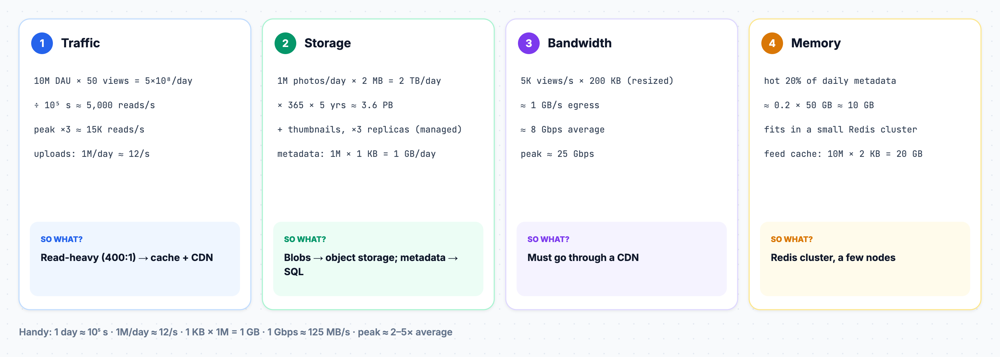

### The formulas

```text
Average QPS  ≈ requests per day ÷ 10⁵          (1 day ≈ 86,400 s)
Peak QPS     ≈ average × 2–5                    (ask; events can be 10×+)
Storage      ≈ items/day × size × retention (days) × replication
Bandwidth    ≈ QPS × response size
Cache size   ≈ hot fraction (often ~20%) × daily working set
Connections  ≈ DAU × fraction online at peak    (for real-time systems)
```

### Rules of thumb

- Split **reads** and **writes** — they drive different components.
- Separate **metadata** (DB) from **blobs** (object storage) — blobs dominate media apps.
- Use powers of ten and round hard. 86,400 → 100,000 is fine.
- Cap it at **~5 minutes**. If stuck, state an assumption and move on.

### What the numbers usually imply

| If you find… | It suggests… |
|--------------|--------------|
| < 1K QPS, < 1 TB | One primary DB + replica + cache is plenty. Say so. |
| 10K+ reads/s | Caching and read replicas |
| 5K+ writes/s sustained | Sharding, or a write-optimized store |
| Petabytes of media | Object storage + CDN + tiered storage |
| Millions of concurrent connections | A WebSocket gateway fleet + pub/sub |

> [!TIP]
> **🎤 Say it in the interview** — "About 40 writes a second and 4,000 reads — a single Postgres primary with a cache handles that comfortably. I'll keep the design simple and show where it would shard later."

#### 📝 Practice problems

1. **5 years of 1M events/day at 200 bytes, 3× replication?** 1M × 200 B = 200 MB/day. × 365 × 5 ≈ 365 GB. × 3 ≈ **~1.1 TB**. Small.
2. **50M daily reads → average QPS?** 5 × 10⁷ ÷ 10⁵ = **~500/s**, so ~1,500–2,500/s at peak.
3. **When may estimation conclude "a single Postgres is enough"?** When peak writes are in the low thousands per second, the data fits comfortably on one machine with headroom, and reads can be served with replicas and a cache.


---

## 7.5 API & data model

> **In one sentence:** Before drawing boxes, pin down **what the system accepts and returns** (the API) and **what it stores and how it's queried** (the data model) — that's where most hard problems hide.

### API sketch (3–6 endpoints)

```http
POST /v1/links            { long_url, custom_alias? }    → 201 { code, short_url }
GET  /{code}                                             → 302 Location: long_url
GET  /v1/links/{code}/stats   (auth)                     → { clicks, last_24h }
```

Include: authentication, pagination for lists, idempotency keys for creates that move money, and the main error cases.

### Data model

1. List the **entities** and their key fields.
2. Write down the **top 3 queries**.
3. Choose **primary keys** and **indexes** to serve them.
4. Pick the **store** (see [3.2](#32-choosing-a-database)) and, if needed, the **shard key**.
5. Note what's denormalized and how it stays fresh.

```text
links( code PK, long_url, user_id, created_at, expires_at )
  index (user_id, created_at DESC)      -- "my links" page
Store: PostgreSQL (strong uniqueness on code); Redis cache code → long_url
```

> [!TIP]
> **🎤 Say it in the interview** — "Top query is lookup by code, so `code` is the primary key — and the shard key later, if we ever need one."

---

## 7.6 High-level design & the whiteboard

> **In one sentence:** Draw the system **left to right in the order a request travels**, narrate while you draw, and walk the **write path** and the **read path** separately.

### 🧩 The problem: a messy board nobody can follow

Boxes scattered everywhere, arrows crossing, requirements erased to make room — by minute 25 neither you nor the interviewer can follow the design, and good ideas get lost in the mess.

### 💡 The idea: fixed zones and a left-to-right flow

Keep requirements and numbers visible in one corner, draw the request path from left to right, and walk the write path and the read path separately. A clean board is itself a signal of clear thinking.


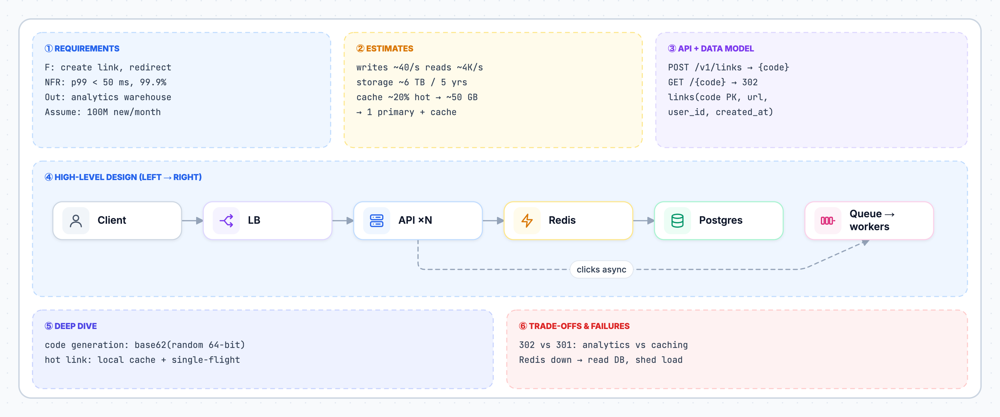

### Canonical order

```text
Clients → DNS / CDN → Load balancer / Gateway → Services → Cache → Database
                                                   ↘ Queue → Workers → Object storage / Search
```

### Narrate like this

> "Clients hit a load balancer in front of stateless API servers. **Write path:** the API validates, generates a code, inserts into Postgres, warms the cache and returns. **Read path:** the redirect checks Redis first and falls back to Postgres on a miss. Click events go async to a queue so analytics can never slow a redirect."

### Whiteboard hygiene

- Keep requirements and estimates visible in a corner the **whole** time.
- 6–12 boxes at high level; details belong in the deep dive.
- Label a few key arrows with protocol or data (`HTTPS`, `gRPC`, `Kafka: clicks`).
- Number the steps of the main flow.
- Circle single points of failure when you discuss failures.
- Leave space on the right for "evolution at 10×".

### Don't draw early

Multi-region active-active, a service mesh on every box, Kafka + Flink + a feature store for a warm-up question, or fifteen microservices for a URL shortener.

### Handling "why not X?"

1. **Acknowledge:** "X is a good fit when…"
2. **Tie to requirements:** "Given our need for…"
3. **Name the cost:** "X would add…"
4. **Decide:** "So I'd keep Y for now and move to X if…"

> *"Why not Cassandra?" — "Cassandra shines for huge write volumes across regions. We're at ~40 writes a second and need strict uniqueness on `code`, so Postgres is simpler. If we went multi-region active-active with 100× the writes, I'd reconsider."*

---

## 7.7 Deep dives & failures

> **In one sentence:** Deep dives prove you can go below the boxes; failure analysis proves you could run the thing in production.

### 🧩 The problem: a design that only works on a good day

Any box-and-arrow diagram looks fine when everything works. The interviewer wants to know whether you understand what happens on a **bad** day — a database fails, traffic spikes 10×, a message is delivered twice — and whether you can go deeper than the boxes on the part that's genuinely hard.

### 💡 The idea: pick the hardest part, compare options, then break it on purpose


### Picking a deep dive

Go where designs **diverge** or where the prompt is genuinely hard — or ask: *"Would you like me to go deeper on ID generation or on the hot-key problem?"*

Common deep dives: ID generation · feed fan-out · geospatial matching · cache invalidation · exactly-once payments · hot partitions · search indexing lag · concurrency on inventory or seats.

### Structure every deep dive

1. Restate the sub-problem and its constraint.
2. **Option A** — how it works, pros and cons.
3. **Option B** — same.
4. Pick one **for the stated scale**, and name the trigger to revisit.
5. Walk the happy path (a quick sequence).
6. Break it: one failure case and how you handle it.

### Failure checklist — ask each about your design

| Failure | Question |
|---------|----------|
| A server crashes mid-request | Is the operation idempotent? What about a partial write? |
| The primary database dies | Failover time? Data loss (RPO)? What do users see? |
| Cache is flushed or down | Can the DB survive the miss storm? |
| A queue backs up for an hour | What becomes late? Is anything time-sensitive? |
| A dependency gets slow | Timeouts, circuit breakers, bulkheads? |
| A region goes dark | DR strategy, DNS TTL, data replication? |
| Traffic spikes 10× | What saturates first? Autoscaling, rate limits, load shedding? |
| A bad deploy | Canary, rollback, feature flags? |
| Abuse | Rate limits, auth, validation, bot detection? |

Answer each with **user impact → system behaviour → mitigation**.

> [!TIP]
> **🎤 Say it in the interview** — Keep it concrete: "If Redis is down, redirects fall through to Postgres. We'd see ~4K reads/s on the primary, which it can handle for a while — and we alert. If it couldn't, we'd shed the analytics path first."

---

## 7.8 Trade-offs cheat sheet

> **In one sentence:** Every decision optimizes one thing at the expense of another — show you know **both sides** and **why this side wins here**.

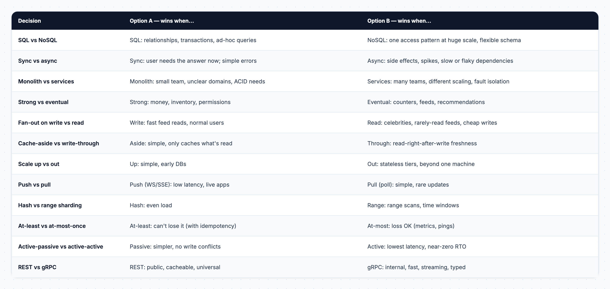

> [!TIP]
> **🎤 The sentence that scores** — "Option A optimizes **X** at the cost of **Y**. Given our requirement **Z**, I choose A. If **W** changes, I'd revisit."

---

## 7.9 Common pitfalls

> **In one sentence:** Most failed interviews come from a handful of habits, not from missing knowledge.

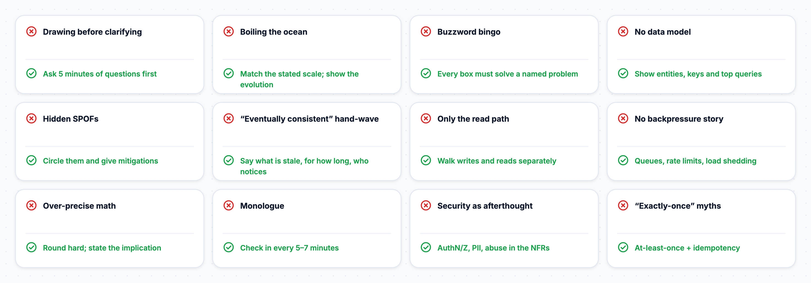

### Recovery phrases (when you catch yourself)

- "Let me step back and confirm what success looks like."
- "I'll simplify to a single region first, then evolve it."
- "The risk with this choice is X; I'd mitigate it with Y."
- "I skipped clarifying — can I rewind for two questions? It changes the storage choice."

### Pitfalls by background

- **Backend specialists** skip product questions and jump to infrastructure. Ask user-facing questions first.
- **Frontend specialists** under-specify data stores. Practise keys and query patterns.
- **Academics** over-index on CAP proofs. Translate to user-visible behaviour.
- **Big-company engineers** over-build for small prompts. Ask for the target scale every time.

---

## 7.10 Level expectations

> **In one sentence:** The same prompt is graded against different bars at different levels — calibrate your depth, and let the interviewer pull you up or down.

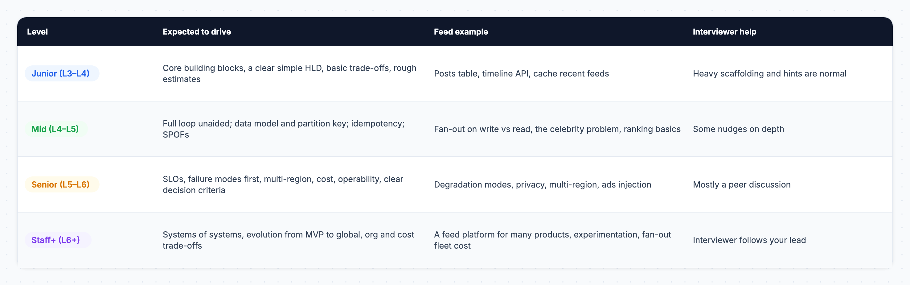

- **If they push higher** (multi-region, cost, org impact) — follow them; it's a compliment.
- **If they keep you on basics** — don't force Raft into the conversation. Nail a clean single-region design.
- A company's level names (E4, L5, SDE II) map to **scope of ownership**: a feature, a service, or a multi-service problem space.

---

## 7.11 A full mock, start to finish

> A strong 45-minute session on **"Design a URL shortener"**, condensed. Notice the rhythm: clarify → numbers → contract → picture → depth → failure → summary.

**Interviewer:** Design a URL shortener like bit.ly.

**You:** Before drawing — who creates links: anyone, or signed-in users? Rough scale? Is analytics in scope? And if latency and perfect click counts conflict, which wins?

**Interviewer:** Anyone can create. ~100M new links a month. Basic click counts. Redirect latency matters more than exact counts.

**You:** So: public link creation, ~100M/month, eventually consistent click counts, fast redirects. Out of scope: dashboards and custom domains. *[writes NFRs]* That's ~40 writes a second; with 100:1 reads, ~4,000 redirects a second, maybe 15K at peak. Five years is ~6 billion links at ~500 bytes ≈ 3 TB. One Postgres primary with a Redis cache handles this; I'll design so it can shard by code later.

**Interviewer:** OK, show me the design.

**You:** *[draws]* Client → load balancer → stateless API servers → Redis and Postgres, with a queue for click events. Create: validate the URL, generate a code, insert, warm the cache, return. Redirect: Redis first, Postgres on a miss, reply 302, and emit a click event asynchronously.

**Interviewer:** How do you generate codes?

**You:** Three options. Hashing the URL gives collisions and makes custom aliases awkward. A global counter in base62 is short but guessable and centralizes writes. Random 64-bit IDs in base62 (~11 characters, or 7 characters from a 42-bit random space) with a unique constraint and a rare retry — unpredictable and simple. I'd pick random base62, or a Snowflake-style ID if we need to avoid retries entirely.

**Interviewer:** 301 or 302?

**You:** 301 lets browsers cache the redirect forever — less load, but we lose click visibility. We need counts, so 302 with a short `Cache-Control`.

**Interviewer:** A link goes viral.

**You:** Redis absorbs it. For extreme keys I'd add a small in-process cache on each API server and single-flight on cache misses. The database never sees the spike once the key is warm.

**Interviewer:** Postgres goes down.

**You:** Redirects for cached links keep working; cache misses and creates fail with a 503. The primary has a synchronous standby in another zone, so failover is automatic with no data loss — about 30 seconds of failed creates.

**Interviewer:** 10× scale?

**You:** More API servers and a bigger Redis cluster first. Then read replicas. Beyond ~5K writes a second, shard by hash of the code — every lookup is by code, so every query stays single-shard. Multi-region would use region-prefixed codes to avoid cross-region coordination.

**Interviewer:** Anything you'd add with more time?

**You:** Abuse protection — rate limits on create, a malware URL scan, a blocklist — and monitoring: redirect p99 and error rate per region, cache hit ratio, and queue lag for clicks.

> [!NOTE]
> **Why this scores well:** scope cut early, numbers with conclusions, options compared before choosing, failures answered with user impact, and an explicit evolution path. Full design: [URL shortener case study](#case-study-01--url-shortener).

<p align="right"><a href="#table-of-contents">↑ Back to top</a></p>

---

# Chapter 08 · Case Studies

**25 real designs, each walked end to end the way a senior engineer would present it**

---

### How every case study is laid out

Each one opens with **🧩 the problem the product solves** (with a red picture of what goes wrong without it) and **💡 the design in one picture**, then follows the same 8 steps from the [interview framework](#72-the-framework), so you can compare them side by side:

1. **Requirements** — functional, non-functional (as numbers), and out of scope
2. **Estimates** — traffic, storage, bandwidth, and what they imply
3. **API** — the contract
4. **Data model** — entities, keys, the store, and why
5. **High-level design** — the architecture picture, plus the write path and read path
6. **Deep dives** — the 1–3 genuinely hard parts, with options compared
7. **Failures & scaling** — what breaks and how the design evolves
8. **Interview cheat sheet** — likely follow-up questions with crisp answers

### Pick your path

| # | Case study | Difficulty | Core lessons |
|---|------------|:----------:|--------------|
| 01 | [URL shortener](#case-study-01--url-shortener) | ⭐ | ID generation, caching, read-heavy design |
| 02 | [Rate limiter](#case-study-02--rate-limiter) | ⭐ | Token bucket, Redis + Lua, fail-open vs fail-closed |
| 03 | [Notification system](#case-study-03--notification-system) | ⭐⭐ | Queues, priority lanes, idempotency, providers |
| 04 | [News feed](#case-study-04--news-feed) | ⭐⭐ | Fan-out on write vs read, the celebrity problem |
| 05 | [Chat (WhatsApp-like)](#case-study-05--chat-app) | ⭐⭐ | WebSockets at scale, ordering, delivery receipts |
| 06 | [Photo sharing (Instagram-like)](#case-study-06--photo-sharing) | ⭐⭐ | Signed uploads, media pipeline, CDN |
| 07 | [Ride sharing (Uber-like)](#case-study-07--ride-sharing) | ⭐⭐⭐ | Geo index, location firehose, matching, state machines |
| 08 | [Video streaming (YouTube/Netflix-like)](#case-study-08--video-streaming) | ⭐⭐⭐ | Transcoding, adaptive bitrate, CDN economics |
| 09 | [File sync (Dropbox-like)](#case-study-09--file-sync) | ⭐⭐⭐ | Chunking, dedupe, sync cursors, conflicts |
| 10 | [Web crawler](#case-study-10--web-crawler) | ⭐⭐ | URL frontier, politeness, dedupe, Bloom filters |
| 11 | [Typeahead / autocomplete](#case-study-11--typeahead) | ⭐⭐ | Tries, top-k, offline build, edge caching |
| 12 | [Search engine](#case-study-12--search-engine) | ⭐⭐⭐ | Inverted index, sharding, relevance, reindexing |
| 13 | [Ticket booking](#case-study-13--ticket-booking) | ⭐⭐⭐ | Seat holds, contention, waiting rooms |
| 14 | [Payments](#case-study-14--payments) | ⭐⭐⭐ | Idempotency, double-entry ledger, webhooks, reconciliation |
| 15 | [Nearby places (Yelp-like)](#case-study-15--nearby-places) | ⭐⭐ | Geohash, read-heavy search, ranking |
| 16 | [Group chat (Slack/Discord-like)](#case-study-16--group-chat) | ⭐⭐⭐ | Channel fan-out by size, presence |
| 17 | [Collaborative editor (Google Docs-like)](#case-study-17--collaborative-editor) | ⭐⭐⭐ | OT vs CRDT, per-document sessions |
| 18 | [E-commerce checkout](#case-study-18--e-commerce-checkout) | ⭐⭐⭐ | Sagas, inventory reservation, flash sales |
| 19 | [Recommendations](#case-study-19--recommendations) | ⭐⭐⭐ | Candidate generation, ranking, feature stores |
| 20 | [Distributed Key-Value Store](#case-study-20--distributed-key-value-store) | ⭐⭐⭐ | Consistent hashing, quorums, LSM storage |
| 21 | [Unique ID Generator](#case-study-21--unique-id-generator) | ⭐⭐ | Snowflake IDs, clocks, UUID trade-offs |
| 22 | [Distributed Job Scheduler](#case-study-22--distributed-job-scheduler) | ⭐⭐⭐ | Leases, retries, dead letters, time buckets |
| 23 | [Metrics & Monitoring Platform](#case-study-23--metrics--monitoring-platform) | ⭐⭐⭐ | Time-series storage, cardinality, alerting |
| 24 | [Live Streaming](#case-study-24--live-streaming) | ⭐⭐⭐ | Real-time transcoding, low latency, CDN fan-out |
| 25 | [Food Delivery](#case-study-25--food-delivery) | ⭐⭐⭐ | Three-sided marketplace, dispatch timing, ETA |

> [!TIP]
> **How to study a case study:** read the requirements, then **close the page and design it yourself for 25 minutes** before reading the rest. Comparing your version with the write-up teaches far more than reading alone.

<p align="right"><a href="#table-of-contents">↑ Back to top</a></p>

---

# Case Study 01 · URL Shortener

**Turn a long link into `sho.rt/aB3xY9` and redirect billions of clicks fast**

| Difficulty | Core lessons | Building blocks |
|:----------:|--------------|-----------------|
| ⭐ Warm-up | ID generation · caching a read-heavy path · async analytics | LB · stateless API · Redis · Postgres · queue |

### 🧩 The problem this product solves

Some links are painfully long — a shared Google Doc, a tracking link from a marketing email, a map location:

```text
https://www.example-store.com/products/summer-collection/shoes?color=red&size=42&utm_source=newsletter&utm_campaign=june
```

They break across lines in emails, look scary in text messages, don't fit on a printed poster, and give no way to count clicks. A URL shortener turns that into **`sho.rt/aB3xY9`** — short, clean, trackable — and when anyone opens it, instantly sends them to the real page.

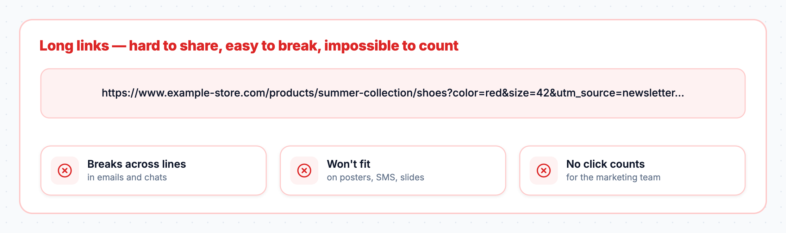

### 💡 The design in one picture

It sounds tiny, but at scale it's a real system: billions of stored links, thousands of redirects per second, and every redirect must be fast because it sits in front of someone else's page.

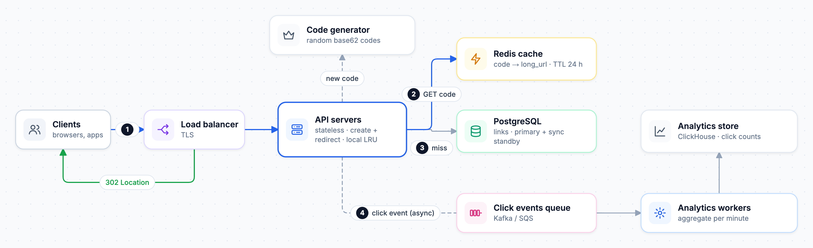

---

## 1. Requirements

**Functional**
- Create a short link from a long URL (optional custom alias, optional expiry).
- Redirect `GET /{code}` to the long URL.
- Basic click counts per link.

**Non-functional**
| Quality | Target |
|---------|--------|
| Redirect latency | p99 < 50 ms (server side) |
| Availability | 99.99% for redirects — a broken link breaks someone else's product |
| Durability | A created link is never lost |
| Uniqueness | One code → exactly one URL |
| Consistency | Click counts may lag by a minute |

**Out of scope:** analytics dashboards, custom domains, link editing.

---

## 2. Estimates

| Item | Math | Result |
|------|------|--------|
| New links | 100M / month ÷ (30 × 10⁵ s) | **~40 writes/s** |
| Redirects | 100 : 1 read/write ratio | **~4,000 reads/s**, ~15K peak |
| Storage | 100M × 12 months × 5 yrs × 500 B | **~3 TB** over 5 years |
| Cache | ~20% of links get ~80% of clicks | Hot set easily fits in **Redis** |

**So what?** Writes are trivial; reads dominate. One Postgres primary plus a cache is enough for years. **Optimize the redirect path.**

---

## 3. API

```http
POST /v1/links
     { "long_url": "https://…", "custom_alias": "summer-sale", "expires_at": null }
  →  201 { "code": "aB3xY9", "short_url": "https://sho.rt/aB3xY9" }

GET  /{code}
  →  302 Location: https://…          (404 unknown · 410 expired)

GET  /v1/links/{code}/stats           (auth: link owner)
  →  200 { "clicks": 18243, "last_24h": 912 }
```

Errors: `400` invalid URL · `409` alias taken · `429` too many creates.

---

## 4. Data model

```sql
links (
  code        VARCHAR(10) PRIMARY KEY,   -- the lookup key; later the shard key
  long_url    TEXT NOT NULL,
  user_id     BIGINT NULL,
  created_at  TIMESTAMPTZ NOT NULL,
  expires_at  TIMESTAMPTZ NULL
);
CREATE INDEX ON links (user_id, created_at DESC);   -- "my links" page

-- analytics lives elsewhere (ClickHouse / warehouse), fed by the click queue
```

**Why PostgreSQL?** Modest write volume, a strict uniqueness rule on `code`, and simple relational data. Every lookup is by primary key, so if we ever need to shard, `hash(code)` keeps every query on a single shard.

---

## 5. High-level design

**Write path (create)**
1. API validates the URL (scheme `http/https` only, length limit, blocklist check).
2. Generates a code (deep dive below) and `INSERT`s it — the unique constraint is the final guard.
3. Warms the cache: `SET code → long_url`.
4. Returns the short URL.

**Read path (redirect)** — the hot path
1. `GET code` from Redis → **hit (~95%+)** → `302` in about a millisecond.
2. On a miss: read Postgres, fill the cache, respond.
3. Publish a click event (`code, time, country, referrer`) to a queue **asynchronously** — analytics must never slow a redirect.

---

## 6. Deep dives

### 6.1 Generating short codes

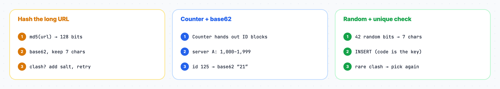

| Option | How | Pros | Cons |
|--------|-----|------|------|
| **Hash the URL** | `base62(md5(url))[:7]` | Same URL → same code | Collisions need handling; awkward for custom aliases |
| **Counter + base62** | Each server leases a **block of IDs** (e.g. 1,000) from a counter service, then encodes to base62 | No collisions, very short codes | Codes are **guessable** (`aB3xY9` → `aB3xYA`); needs a counter service |
| **Random + check** | 42 random bits → 7 base62 chars; insert with the unique constraint; retry on a clash | Unpredictable; stateless | A rare retry; the clash rate grows as the space fills |

**Pick:** random base62 (7 characters ≈ 3.5 trillion codes, so 6 billion links fill ~0.2% of the space — clashes stay rare). If enumeration doesn't matter and you want zero retries, use the **counter with block leasing**.

**Base62 in one line:** use digits `0-9a-zA-Z` as a base-62 number system. For example, the ID `125` becomes `21` (because 2 × 62 + 1 = 125).

### 6.2 301 or 302?

- **301 (permanent)** — browsers cache it forever. Less load for us, but we never see repeat clicks.
- **302 (temporary)** — every click reaches us. Accurate analytics, more load (the cache absorbs it).

**Pick 302** with a short `Cache-Control`, because click counts are a requirement.

### 6.3 Viral links (hot keys)

One link on a Super Bowl ad can get 100K clicks/s — all on **one** Redis key.
- Add a tiny **in-process LRU cache** (a few seconds' TTL) on each API server for the hottest codes.
- Use **single-flight** on cache misses, so one request refills the key while the others wait.
- Optionally serve the most popular redirects from **CDN edge logic**.

---

## 7. Failures & scaling

| Failure | User impact | Mitigation |
|---------|-------------|------------|
| Redis down | Slower redirects | Fall through to Postgres (it can take ~4K reads/s briefly); alert; restore the cache |
| Postgres primary down | Creates fail; cached redirects still work | Synchronous standby in another zone → automatic failover in ~30 s, no data loss |
| Click queue backs up | Stats lag | Nothing user-facing; workers catch up |
| Abuse (phishing links) | Your domain gets blocklisted | Rate-limit creates, scan URLs against a malware feed, disable bad codes quickly |

| Scale | Change |
|-------|--------|
| Today | 1 primary + standby + Redis |
| 10× reads | More API servers, Redis cluster, read replicas |
| 10× writes (~5K/s) | Shard by `hash(code)` — every query is single-shard |
| Global | Region-prefixed codes or per-region ID blocks; replicate links to every region for local redirects |

> [!IMPORTANT]
> **🏛️ Architect's lens** — This product's real risk isn't scale, it's **trust**: if spammers use your domain, email providers and browsers will block it, and every customer's links die at once. Abuse detection is a business-critical feature, not an afterthought.

---

## 8. Interview cheat sheet

| They ask | You answer |
|----------|------------|
| "Why not Cassandra?" | "40 writes/s and strict uniqueness — Postgres is simpler. Cassandra if we needed multi-region writes at 100× the volume." |
| "How do you avoid collisions?" | "Unique constraint on `code` plus retry, or counter-based IDs that can't collide." |
| "Redirect right after create?" | "Create warms the cache, so it's immediately readable — read-your-writes." |
| "Can users guess other links?" | "Random codes make guessing impractical; also rate-limit lookups that 404 repeatedly." |
| "What would you monitor?" | "Redirect p99 and 5xx rate, cache hit ratio, click-queue lag, create rate per IP." |

<p align="right"><a href="#table-of-contents">↑ Back to top</a></p>

---

# Case Study 02 · Rate Limiter

**Decide in under a millisecond whether each request is allowed — across a whole fleet of servers**

| Difficulty | Core lessons | Building blocks |
|:----------:|--------------|-----------------|
| ⭐ Warm-up | Token bucket · atomic counters in Redis · fail-open vs fail-closed | API gateway · Redis Cluster · rules config |

### 🧩 The problem this product solves

A public API serves thousands of customers. One customer's buggy script, a scraper or an attacker can send so many requests that everyone else suffers — and the cloud bill explodes. The company also sells plans: free users get 100 requests a minute, paying users 10,000. Something must **count every client's requests and stop the ones over their limit**, fairly and instantly, on every one of 50 gateway servers at once.

(The basic idea is explained in [2.4 Rate limiting](#24-rate-limiting); this case study designs a production-grade limiter.)

### 💡 The design in one picture

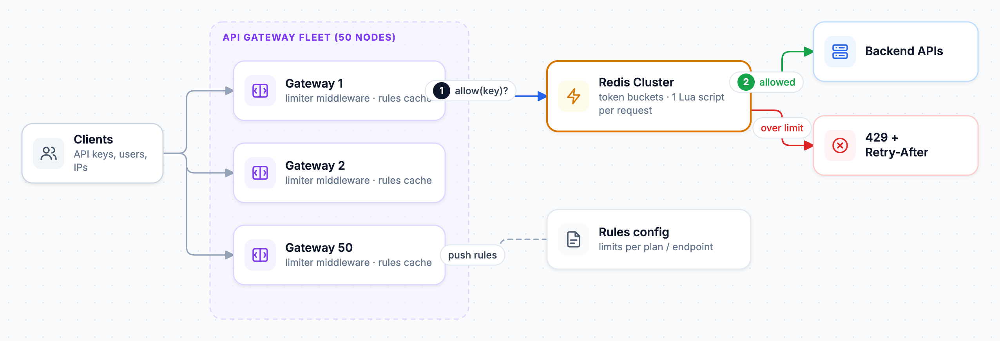

---

## 1. Requirements

**Functional**
- Limit requests per **key**: user ID, API key, IP address, or endpoint.
- Different rules per plan and per endpoint (e.g. `/login`: 5 per minute per IP).
- Rejected requests get `429 Too Many Requests` with a `Retry-After` header.

**Non-functional**
| Quality | Target |
|---------|--------|
| Added latency | < 1 ms per decision (it sits on every request) |
| Accuracy | Close to exact; small over-allowance is acceptable |
| Availability | The limiter must never become the reason the API is down |
| Scale | ~1M active keys, ~100K decisions/second at peak |

**Out of scope:** billing, abuse machine learning.

---

## 2. Estimates

| Item | Math | Result |
|------|------|--------|
| Decisions | 100K requests/s at peak | **100K Redis operations/s** — a small Redis Cluster |
| Memory | 1M keys × ~100 bytes (tokens + timestamp) | **~100 MB** — tiny |
| Latency budget | Gateway → Redis in the same zone | **~0.3–0.5 ms** |

**So what?** The state is tiny and the operations are simple. The real challenges are **atomicity** (no race conditions between 50 gateways) and **what to do when Redis is unavailable**.

---

## 3. API

The limiter runs **inside the gateway** as middleware, so there's no public API. Internally:

```text
allow(key="user:42", rule="free-plan") → { allowed: true, remaining: 83, retry_after_s: 0 }
```

Responses to clients include standard headers: `RateLimit-Limit`, `RateLimit-Remaining`, and `Retry-After` on a 429.

---

## 4. Data model

```text
rules (config, cached in each gateway):
  { match: "plan=free",  limit: 100/min,  burst: 20, algo: token_bucket }
  { match: "path=/login", key: ip, limit: 5/min }

Redis:  rl:{rule}:{key} → { tokens: 17.4, last_refill_ms: 1719930012345 }   TTL = a few minutes
```

---

## 5. High-level design

1. A request arrives at any gateway node.
2. The gateway identifies the key (API key → user → plan) and finds the matching rule in its **local rules cache**.
3. It runs **one atomic Lua script** in Redis: refill tokens based on elapsed time, take one if available, return the result.
4. Allowed → forward to the backend. Denied → `429` immediately.

Rules live in a config store and are pushed to gateways (or polled every few seconds), so changing a limit doesn't need a deploy.

---

## 6. Deep dives

### 6.1 Which algorithm?


**Token bucket** is the default: two numbers per rule (refill rate = sustained limit, bucket size = allowed burst), tiny state, and it allows natural short bursts. Use a **sliding window** if you need very even enforcement. See [2.4](#24-rate-limiting) for the comparison.

### 6.2 Avoiding race conditions

Two gateways check the same key at the same moment. If each does "read tokens → decide → write tokens" separately, both may see "1 token left" and both allow the request.

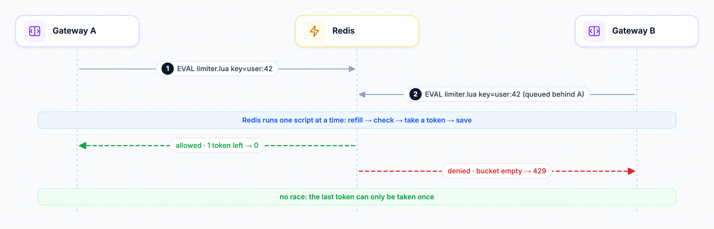

**Fix:** do read-decide-write inside **one Redis Lua script** (Redis runs each script atomically). One network round trip, no races.

### 6.3 Failing open or closed

If Redis is unreachable:
- **Fail open** (allow everything) — the API stays up but is unprotected for a while. Good for normal endpoints.
- **Fail closed** (reject everything) — protected but down. Used for security-critical endpoints like `/login` and payments.

Either way, alert immediately. A middle ground: each gateway keeps a **local, approximate limit** (the global limit ÷ number of gateways) as a fallback.

### 6.4 Very hot keys and huge scale

A single abusive key hits one Redis shard hard. Add a small **local pre-limiter** in each gateway that drops obvious floods before they reach Redis. At very large scale, gateways can keep local counters and **sync to Redis every ~100 ms**, trading a little accuracy for far fewer Redis calls.

---

## 7. Failures & scaling

| Failure | Impact | Mitigation |
|---------|--------|------------|
| Redis node down | Limits can't be checked | Redis Cluster with replicas; fail open/closed per rule; local fallback limits |
| Config push delayed | Old limits for a while | Version rules; short cache TTL |
| Clock differences between gateways | Wrong refill amounts | Use Redis server time inside the Lua script |
| Multi-region | Global limits need cross-region counting | Per-region limits (global limit ÷ regions), or accept slight over-allowance |

> [!IMPORTANT]
> **🏛️ Architect's lens** — A rate limiter is a **business** tool as much as a technical one: it protects margins (cloud cost), enforces pricing plans and stops abuse. Decide fail-open vs fail-closed **with the product owner**, per endpoint — it's a business risk decision, not a coding detail.

---

## 8. Interview cheat sheet

| They ask | You answer |
|----------|------------|
| "Which algorithm?" | "Token bucket per key in Redis — handles bursts, two numbers to tune, tiny state." |
| "How do 50 gateways share counts?" | "Central Redis Cluster, one atomic Lua script per decision, sharded by key." |
| "Redis is down?" | "Fail open for normal reads, fail closed for login and payments, alert, with local fallback limits." |
| "Per user or per IP?" | "Per user or API key first — IPs are shared behind NAT. IP limits only for unauthenticated endpoints like login." |
| "What do clients see?" | "429 with Retry-After and remaining-quota headers, so well-behaved clients back off." |

<p align="right"><a href="#table-of-contents">↑ Back to top</a></p>

---

# Case Study 03 · Notification System

**Deliver push, email, SMS and in-app messages to millions of users — the right message, on the right channel, at the right time**

| Difficulty | Core lessons | Building blocks |
|:----------:|--------------|-----------------|
| ⭐⭐ | Queues · priority lanes · user preferences · idempotency · third-party providers | API · Kafka · workers · APNs/FCM/SES/Twilio |

### 🧩 The problem this product solves

Every product sends notifications: "your order shipped", "someone liked your photo", "your login code is 482913", "20% off this weekend". Without a dedicated system, each team sends messages its own way:

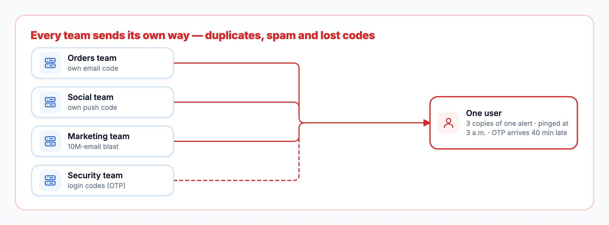

- A user gets the same alert **three times** from three services, or at 3 a.m.
- A marketing blast of 10 million emails **delays the login codes** stuck behind it — users can't sign in.
- Nobody respects "unsubscribe" consistently, which is also a legal problem.
- When the SMS provider goes down, messages are simply lost.

### 💡 The design in one picture

One shared platform: every service just says "send notification X to user Y". The platform checks preferences, picks channels, respects priorities, retries failures and never sends twice:

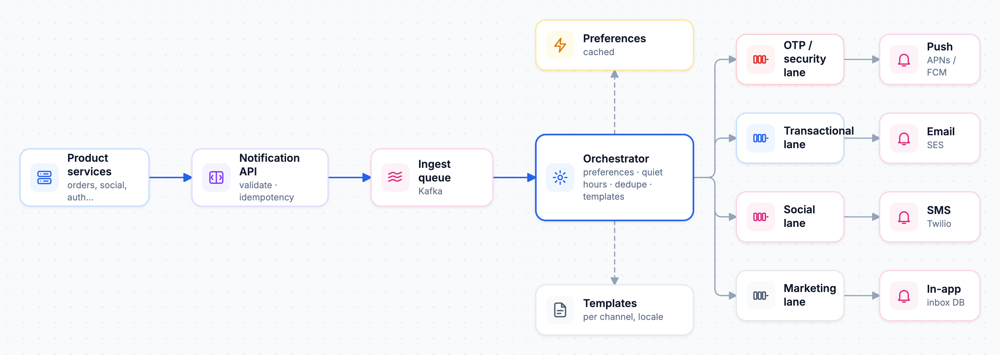

---

## 1. Requirements

**Functional**
- Channels: mobile push (iOS/Android), email, SMS, in-app inbox.
- Services send a notification with a template and data; the platform renders and delivers it.
- Users control preferences: channels, categories, quiet hours.
- Track delivery status.

**Non-functional**
| Quality | Target |
|---------|--------|
| Security codes (OTP) | Delivered in **seconds**, never delayed by marketing |
| Marketing | Best effort; minutes to hours is fine |
| Duplicates | Rare and harmless (dedupe by notification ID) |
| Scale | 100M daily users × ~5 notifications ≈ 500M/day, with 10× spikes |

---

## 2. Estimates

| Item | Math | Result |
|------|------|--------|
| Average rate | 500M / 10⁵ s | **~5,000/s**, spikes to **50K/s** (breaking news, campaigns) |
| Storage | 500M/day × 500 B (inbox + status) | **~250 GB/day** → keep 30–90 days |
| Providers | Each has its own rate limits | Workers must pace themselves per provider |

---

## 3. API

```http
POST /v1/notifications
     { "user_id": 42, "template": "order_shipped", "data": { "order": "A-19" },
       "priority": "transactional", "idempotency_key": "ship-A-19" }
  →  202 { "notification_id": "n_81f2" }

PUT  /v1/users/42/preferences   { "email": true, "sms": false, "quiet_hours": "22:00-07:00" }
GET  /v1/users/42/inbox?cursor=…
```

`202 Accepted` — the platform takes responsibility and delivers asynchronously.

---

## 4. Data model

```text
preferences   (user_id, channel, category, enabled, quiet_hours, timezone)
device_tokens (user_id, platform, token, last_seen)
templates     (template_id, channel, locale, body)
notifications (notification_id, user_id, template, status, created_at)   -- also the in-app inbox
deliveries    (notification_id, channel, provider_msg_id, status)        -- unique (notification_id, channel)
```

---

## 5. High-level design

1. A service calls the **Notification API**. It validates, stores the request and puts it on an **ingest queue**.
2. The **orchestrator** reads it, loads the user's **preferences**, checks quiet hours, dedupes by idempotency key, renders the **template** for each allowed channel.
3. It puts one job per channel into **priority lanes** (separate queues).
4. **Channel workers** call the providers: APNs/FCM for push, SES for email, Twilio for SMS; the in-app inbox is written directly.
5. Provider **webhooks** report delivered/bounced, updating the status.

---

## 6. Deep dives

### 6.1 Priority lanes — never let marketing block a login code

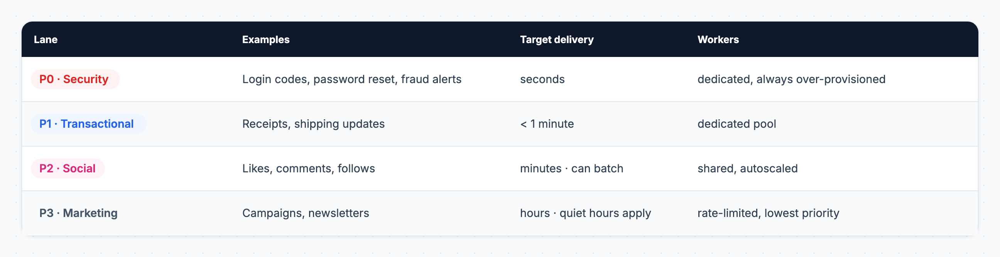

Each priority class gets its **own queues and its own workers** (a bulkhead — see [5.2](#52-circuit-breakers--bulkheads)). A 10-million-email campaign can fill the marketing lane completely while login codes flow instantly through their own lane.

### 6.2 Preferences and quiet hours

Evaluation order: legal opt-outs → user's category/channel settings → quiet hours (security codes ignore them; others are **delayed**, not dropped) → does the channel exist (valid device token, verified email)?

### 6.3 Never sending twice

Retries happen (worker crashes, provider timeouts). Guard with a **unique `(notification_id, channel)`** row written before sending, and pass idempotency keys to providers that support them. Mobile push also supports **collapse keys**, so a repeated push replaces the previous one instead of stacking.

### 6.4 Provider failures

Circuit breaker per provider; retry with backoff; for critical messages, fall back to another provider or channel (push failed → SMS). Respect each provider's rate limits by pacing workers.

---

## 7. Failures & scaling

| Failure | Impact | Mitigation |
|---------|--------|------------|
| SMS provider down | OTPs fail | Second SMS provider; fall back to email/push |
| Campaign spike | Lanes back up | Separate lanes; autoscale workers on queue lag |
| Preference service slow | Everything waits | Cache preferences; fail closed for marketing, open for security alerts |
| Stale device tokens | Wasted pushes | Remove tokens when providers report them invalid |

> [!IMPORTANT]
> **🏛️ Architect's lens** — Notifications are a trust and legal surface: spam loses users and can break anti-spam laws. Central preference checks and unsubscribe handling aren't nice-to-haves — they're the main reason to build one shared platform instead of letting every team send their own.

---

## 8. Interview cheat sheet

| They ask | You answer |
|----------|------------|
| "OTP vs marketing?" | "Separate priority lanes with their own queues and workers, so marketing can never delay login codes." |
| "Exactly-once push?" | "At-least-once plus dedupe on (notification_id, channel) and provider collapse keys — rare duplicates are harmless." |
| "Provider outage?" | "Circuit breaker, retries with backoff, failover to a second provider or another channel." |
| "Quiet hours?" | "Delay non-urgent messages to the user's morning using a delayed queue; security alerts ignore quiet hours." |

<p align="right"><a href="#table-of-contents">↑ Back to top</a></p>

---

# Case Study 04 · News Feed

**Show each user a fresh timeline of posts from the people they follow — in under 200 ms**

| Difficulty | Core lessons | Building blocks |
|:----------:|--------------|-----------------|
| ⭐⭐ | Fan-out on write vs read · the celebrity problem · caching timelines | Post service · Kafka · fan-out workers · Redis · graph store |

### 🧩 The problem this product solves

When you open Twitter/X, Instagram or LinkedIn, you expect a feed of the latest posts from **everyone you follow**, instantly. The naive way — at open time, look up everyone you follow and fetch their recent posts — is fine for 10 users:

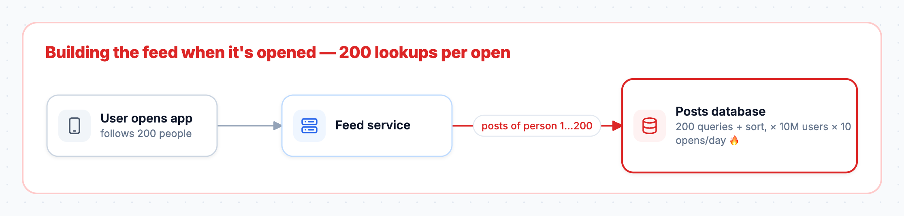

But a typical user follows **~200 accounts**. Every feed open means gathering and sorting posts from 200 people, and **10 million users** open the app many times a day. The database melts, and feeds take seconds to load.

### 💡 The design in one picture

Do the work **when a post is written**, not when a feed is read: push the new post's ID into each follower's pre-built timeline in a cache. Opening the feed becomes a single fast read. Celebrities are handled differently (deep dive 6.2):

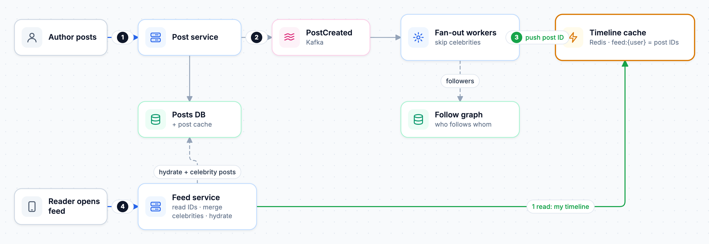

---

## 1. Requirements

**Functional**
- Post text and media; follow and unfollow users.
- Home feed: recent posts from followed accounts, newest first (ranking as an extension).
- Paginate with infinite scroll.

**Non-functional**
| Quality | Target |
|---------|--------|
| Feed load | p99 < 200 ms |
| Freshness | New posts appear within a few seconds (eventual consistency is fine) |
| Scale | 300M users, 100M daily active, average 200 follows, some accounts with 50M+ followers |

---

## 2. Estimates

| Item | Math | Result |
|------|------|--------|
| Feed reads | 100M users × 10 opens/day ÷ 10⁵ | **~10K/s**, 30K+ at peak |
| New posts | 100M × 0.5 posts/day ÷ 10⁵ | **~500 posts/s** |
| Fan-out writes | 500 posts/s × 200 followers | **~100K timeline inserts/s** |
| Timeline cache | 100M users × 800 IDs × 8 B | **~640 GB** of RAM across a Redis cluster |

**So what?** Reads dominate, so precomputing timelines is worth the write cost — except for accounts with millions of followers.

---

## 3. API

```http
POST /v1/posts                 { "text": "…", "media_ids": [...] }  → 201 { post_id }
GET  /v1/feed?cursor=…&limit=20                                     → { posts: [...], next_cursor }
POST /v1/follows               { "followee_id": 7 }
```

---

## 4. Data model

```text
posts    (post_id, author_id, text, media, created_at)     -- sharded by post_id; cached by id
follows  (follower_id, followee_id, created_at)            -- two indexes: by follower, by followee
timeline (Redis sorted set)  feed:{user_id} → [(post_id, timestamp) …]   -- keep the latest ~800
```

Post IDs are time-ordered (Snowflake-style), so sorting by ID sorts by time.

---

## 5. High-level design

**Write path**
1. Post service saves the post and publishes `PostCreated`.
2. **Fan-out workers** look up the author's followers and insert the post ID into each follower's timeline in Redis.

**Read path**
1. Feed service reads the user's timeline IDs from Redis (one call).
2. Merges in recent posts from any **celebrities** they follow (see 6.2).
3. **Hydrates** the IDs into full posts from the post cache (one batched call), removes deleted/blocked items, returns a page plus a cursor.

---

## 6. Deep dives

### 6.1 Fan-out on write vs on read

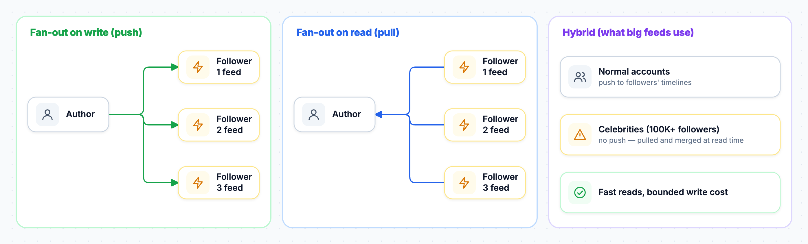

| | Fan-out on **write** (push) | Fan-out on **read** (pull) |
|--|-----------------------------|----------------------------|
| When work happens | When a post is created | When a feed is opened |
| Feed read | One cache read — very fast | Gather from many authors — slow |
| Cost | Write amplification (1 post → N inserts) | Heavy reads |
| Breaks when | An author has millions of followers | Users follow many accounts |

### 6.2 The celebrity problem → a hybrid

A celebrity with **50 million** followers posts once → 50 million timeline inserts, taking minutes and hammering Redis. **Hybrid:** fan out on write for normal accounts; for accounts above a threshold (say 100K followers), **don't** fan out. At read time, fetch those celebrities' recent posts (heavily cached, because millions read them) and merge them into the timeline.

### 6.3 Ranking (extension)

Instead of pure time order: take a few hundred candidates from the timeline, score them with a ranking model (likely to engage? close friend? fresh?), return the top 20. Fall back to chronological if the ranker is slow. See [Case Study 19](#case-study-19--recommendations).

---

## 7. Failures & scaling

| Failure | Impact | Mitigation |
|---------|--------|------------|
| Fan-out lag | New posts appear late | Autoscale workers on queue lag; freshness isn't critical |
| Redis node lost | Some timelines missing | Replicas; rebuild a timeline on demand from follows + posts |
| Deleted post | Still in timelines | Filter at hydration time; async cleanup |
| Viral post | Hot post object | Cache the post body widely (local caches + CDN for media) |

> [!IMPORTANT]
> **🏛️ Architect's lens** — Feeds are where "precompute vs compute on demand" becomes a cost decision: timeline caches cost hundreds of GB of RAM, but they turn an expensive read into a cheap one millions of times a day. Inactive users are a good place to save: don't maintain timelines for users who haven't opened the app in 30 days — rebuild when they return.

---

## 8. Interview cheat sheet

| They ask | You answer |
|----------|------------|
| "Push or pull?" | "Hybrid: push to followers' timelines for normal users; pull celebrity posts at read time and merge." |
| "Where do timelines live?" | "Redis sorted sets of post IDs, capped at ~800, sharded by user ID; post bodies in a separate cache." |
| "Consistency?" | "Eventual — a post can take a few seconds to appear; deletes are filtered at read time." |
| "Pagination?" | "Cursor = last (timestamp, post_id) seen — stable even as new posts arrive." |

<p align="right"><a href="#table-of-contents">↑ Back to top</a></p>

---

# Case Study 05 · Chat App

**Deliver messages between phones in real time, in order, and never lose one — like WhatsApp or Messenger**

| Difficulty | Core lessons | Building blocks |
|:----------:|--------------|-----------------|
| ⭐⭐ | WebSockets at scale · message ordering · delivery receipts · offline delivery | WebSocket gateways · Cassandra · Redis · push notifications |

### 🧩 The problem this product solves

People expect a message to arrive **the instant** it's sent, to appear **in the right order**, and to **never disappear** — even if the recipient's phone is off, on a train, or switching between Wi-Fi and 4G. Normal web requests can't do this: the server can't send anything to a phone that isn't asking (see [1.7](#17-real-time-communication)). And with 50 million people online at once, no single server can hold everyone's connection:

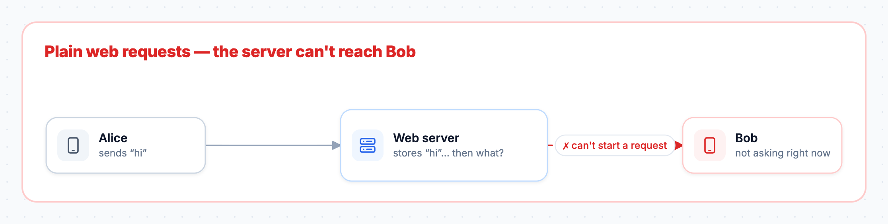

### 💡 The design in one picture

Every online phone keeps one **WebSocket** connection open to a gateway server. Messages are **saved first**, then pushed to the recipient's gateway. Offline recipients get a push notification and fetch the message when they reconnect:

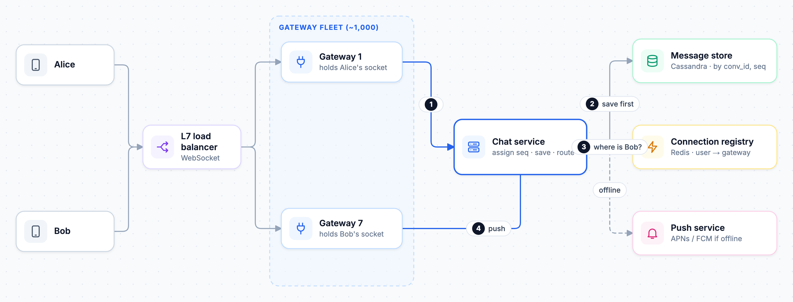

---

## 1. Requirements

**Functional**
- One-to-one chats and small groups (large groups: see [Case Study 16](#case-study-16--group-chat)).
- Sent ✓, delivered ✓✓, read (blue) receipts; online status; typing indicator.
- Message history on every device; photos and files as attachments.

**Non-functional**
| Quality | Target |
|---------|--------|
| Latency | < 200 ms from sender to online recipient |
| Durability | A message the server has acknowledged is **never** lost |
| Ordering | Messages within a chat appear in the same order for everyone |
| Scale | 500M daily users, ~50M connected at peak, ~40 messages per user per day |

---

## 2. Estimates

| Item | Math | Result |
|------|------|--------|
| Messages | 500M × 40 / 10⁵ | **~200K messages/s** average |
| Connections | 50M concurrent ÷ ~50K per gateway | **~1,000 gateway servers** |
| Storage | 20B messages/day × 200 B | **~4 TB/day** (before replication) |

**So what?** Two separate problems: a huge **connection** tier (memory, not CPU) and a write-heavy **message store** (Cassandra-style, partitioned by conversation).

---

## 3. API

```text
WebSocket  wss://chat.example.com/connect   (auth token)
  → send     { conv_id, client_msg_id, body }
  ← ack      { client_msg_id, msg_id, seq }                 // ✓ sent
  ← message  { conv_id, msg_id, seq, sender, body }
  → receipt  { conv_id, up_to_seq, type: delivered|read }   // ✓✓ / blue

HTTP  GET /v1/conversations/{id}/messages?after_seq=…       // catch up after reconnecting
```

---

## 4. Data model

```text
messages  (conv_id, seq, msg_id, sender_id, body, created_at)
          partition key = conv_id, clustered by seq  → one chat = one fast range read
conversations / members  (conv_id, user_id, last_read_seq)
connections (Redis)  user_id → gateway_id
```

A **per-conversation sequence number** (`seq`) gives a clear order that every device agrees on.

---

## 5. High-level design

1. Alice's phone sends the message on its open WebSocket to **gateway 1**.
2. The **chat service** assigns the next `seq` for the conversation and **writes to the message store**.
3. It acknowledges to Alice (✓ sent).
4. It looks up Bob's gateway in the **connection registry** and publishes the message there.
5. **Gateway 7** pushes it to Bob's phone. Bob's phone replies "delivered" (✓✓).
6. If Bob is offline: send a **push notification** (APNs/FCM). When Bob opens the app, it asks for everything after its last `seq`.

---

## 6. Deep dives

### 6.1 Sent, delivered, read

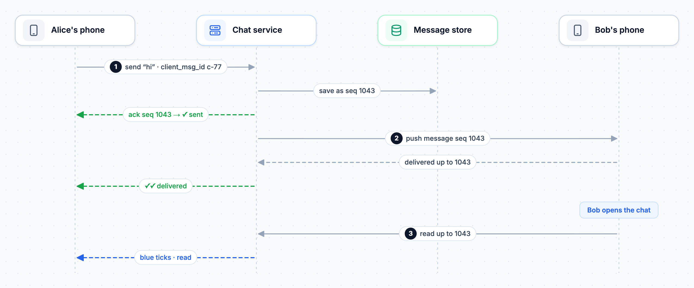

- **Client message ID** — the phone generates an ID before sending. If it retries after a network drop, the server recognizes the duplicate (idempotency, see [4.2](#42-delivery-guarantees--idempotency)).
- **Save before acknowledging** — the ✓ means "safely stored", never "maybe".
- Receipts are batched: "delivered up to seq 1043" instead of one receipt per message.

### 6.2 Reconnecting without losing anything

Phones drop connections constantly. On reconnect, the app sends the last `seq` it has for each chat, and the server returns everything newer. Because messages are always saved first, nothing can fall through the gap.

### 6.3 Presence and typing

"Online" and "typing…" are **ephemeral**: keep them in Redis with short TTLs, refreshed by heartbeats, and only send them to people currently viewing that chat. Never store them in the message database.

### 6.4 End-to-end encryption (extension)

With E2E encryption (Signal protocol), phones encrypt messages with keys the server never has; the server stores and forwards ciphertext. The architecture stays the same — the server just can't read, search or filter content.

---

## 7. Failures & scaling

| Failure | Impact | Mitigation |
|---------|--------|------------|
| Gateway crashes | 50K phones disconnect | They reconnect elsewhere (with jitter) and catch up by `seq` |
| Message store slow | Sends pile up | Partitioned store; the client keeps pending messages and retries |
| Hot conversation | One partition overloaded | Rare for 1:1; large groups use a separate design |
| Push provider down | Offline users not notified | Retry; messages are waiting when the app opens anyway |

> [!IMPORTANT]
> **🏛️ Architect's lens** — Chat is scaled by **connections**, not requests. Budget gateway memory per connection, plan for reconnect storms after deploys (roll out gateways slowly, with jitter), and keep the connection tier "dumb" so it can be restarted freely.

---

## 8. Interview cheat sheet

| They ask | You answer |
|----------|------------|
| "How does Bob get the message?" | "Bob's phone holds a WebSocket to a gateway; a registry maps Bob to that gateway; the chat service pushes it there." |
| "Ordering?" | "A per-conversation sequence number assigned when the message is saved; clients sort by it." |
| "Offline?" | "Stored first, push notification sent, and the app fetches everything after its last seq on open." |
| "Which database?" | "A wide-column store partitioned by conversation_id and ordered by seq — write-heavy, and every read is one chat's recent messages." |

<p align="right"><a href="#table-of-contents">↑ Back to top</a></p>

---

# Case Study 06 · Photo Sharing

**Let millions of people upload photos and see their friends' photos instantly — like Instagram**

| Difficulty | Core lessons | Building blocks |
|:----------:|--------------|-----------------|
| ⭐⭐ | Direct uploads with signed URLs · async media processing · CDN · feed reuse | Object storage · workers · CDN · metadata DB · feed service |

### 🧩 The problem this product solves

A photo from a modern phone is **3–10 MB**. If every upload flowed through your app servers and every view downloaded the original from them:

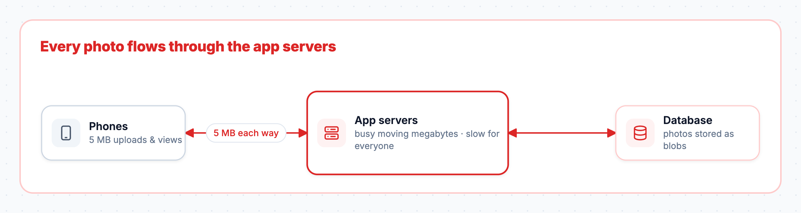

- App servers spend all their time shuffling megabytes instead of running logic.
- Viewers on mobile wait for a 5 MB original when a 100 KB thumbnail would do.
- Users far away wait for every image to cross the world.

### 💡 The design in one picture

Phones upload **directly to object storage** with a short-lived signed URL. Background workers make small versions (thumbnails, feed size). Everyone views photos through a **CDN**. App servers only handle small metadata:

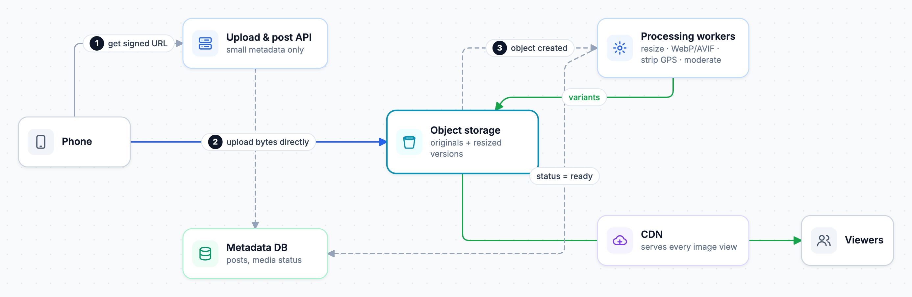

---

## 1. Requirements

**Functional**
- Upload photos with a caption; view a profile grid and a home feed; like and comment.

**Non-functional**
| Quality | Target |
|---------|--------|
| Upload | Reliable on flaky mobile networks (resumable) |
| Viewing | Feed images load in < 1 s worldwide |
| Durability | Uploaded photos are never lost |
| Scale | 500M users, 100M daily active, ~50M uploads/day |

---

## 2. Estimates

| Item | Math | Result |
|------|------|--------|
| Uploads | 50M/day ÷ 10⁵ | **~500/s**, ~2K/s at peak |
| Storage | 50M × (3 MB original + 1 MB of resized versions) | **~200 TB/day** → object storage with cheaper tiers for old photos |
| Views | 100M users × 100 images/day ÷ 10⁵ × 200 KB | **~20 GB/s** of image traffic → must be served by a CDN |

---

## 3. API

```http
POST /v1/uploads                      → { upload_id, signed_url, expires_in: 900 }
PUT  <signed_url>                     (phone uploads bytes straight to object storage)
POST /v1/posts  { upload_id, caption } → 201 { post_id }      (rejected until processing is done)
GET  /v1/users/{id}/posts?cursor=…    → profile grid
GET  /v1/feed?cursor=…                → home feed (same design as Case Study 04)
POST /v1/posts/{id}/like
```

---

## 4. Data model

```text
media  (media_id, owner_id, status: uploading|processing|ready, variants: {thumb, feed, full})
posts  (post_id, author_id, media_id, caption, created_at)   index (author_id, created_at DESC)
likes  (post_id, user_id)          -- counts kept in Redis, saved periodically
```

---

## 5. High-level design

1. The app asks for an upload slot; the API creates `media(status=uploading)` and returns a **signed URL**.
2. The phone uploads the photo **directly to object storage** (multipart and resumable).
3. The storage "object created" event triggers **processing workers**: make thumbnail and feed sizes, convert to efficient formats (WebP/AVIF), **strip GPS location** from metadata, run moderation checks.
4. Status becomes `ready`; the app creates the post.
5. The feed is updated exactly like [Case Study 04](#case-study-04--news-feed); images are served through the **CDN**.

---

## 6. Deep dives

### 6.1 Direct upload with a signed URL

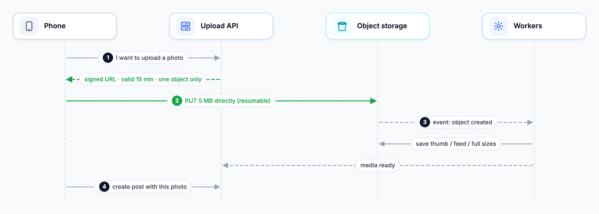

A signed URL is a link to one specific storage location that allows one action (upload), and expires in minutes. The phone never gets storage credentials, and the app servers never touch the bytes.

### 6.2 Serving the right size

Generate a few fixed sizes (e.g. 150 px thumbnail, 1080 px feed, original) and have the app request the one that fits its screen. Serving a 100 KB image instead of a 4 MB original is faster for users and a huge saving on bandwidth.

### 6.3 Likes at celebrity scale

A celebrity's photo can get 100,000 likes a minute. Don't update a database row for each one: increment a counter in Redis, store the individual likes asynchronously, and save the total periodically. Showing "1.2M likes" a few seconds late is fine.

---

## 7. Failures & scaling

| Failure | Impact | Mitigation |
|---------|--------|------------|
| Processing backlog | New posts show "processing…" | Autoscale workers on queue depth |
| Upload interrupted | Frustrated users | Resumable multipart uploads |
| Viral photo | Heavy image traffic | CDN + origin shield absorb it |
| Harmful content | Trust and legal risk | Async moderation; quarantine before wide distribution |

> [!IMPORTANT]
> **🏛️ Architect's lens** — For media products, **storage and bandwidth are the business model's biggest cost**. Modern formats (AVIF/WebP), right-sized variants, CDN caching and moving old originals to cold storage tiers can cut the bill by half or more.

---

## 8. Interview cheat sheet

| They ask | You answer |
|----------|------------|
| "How do uploads work?" | "Signed URL, phone uploads straight to object storage, an event triggers async processing workers." |
| "How are photos served?" | "Fixed resized variants in object storage, delivered through a CDN; the app picks the size it needs." |
| "The feed?" | "Same hybrid fan-out as a news feed — posts are IDs plus media URLs." |
| "Privacy?" | "Strip GPS metadata during processing; private photos use short-lived signed URLs." |

<p align="right"><a href="#table-of-contents">↑ Back to top</a></p>

---

# Case Study 07 · Ride Sharing

**Match a rider with the nearest available driver in seconds, and track every car live — like Uber or Lyft**

| Difficulty | Core lessons | Building blocks |
|:----------:|--------------|-----------------|
| ⭐⭐⭐ | Geospatial indexing · a location firehose · matching without double-booking · trip state machines | Location service (in-memory geo index) · dispatch · Kafka · maps/ETA |

### 🧩 The problem this product solves

A rider taps "Request". Somewhere nearby are dozens of drivers, all **moving**. The system must find the best available driver **within a few seconds**, make sure two riders never get the same driver, and show both of them the car moving on the map. The naive approach — ask the database "which drivers are within 2 km?" while millions of drivers update their location every few seconds — collapses immediately:

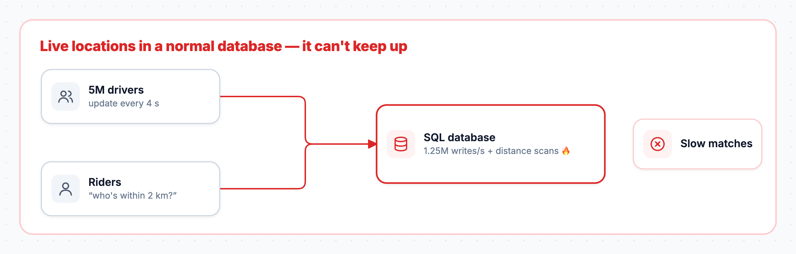

### 💡 The design in one picture

Driver locations stream into an **in-memory geo index** split by map cells (see [3.13](#313-geospatial-indexes)). A **dispatch** service asks for nearby drivers, ranks them by real driving time (ETA), and offers the ride to one driver at a time, with a lock so nobody gets double-booked:

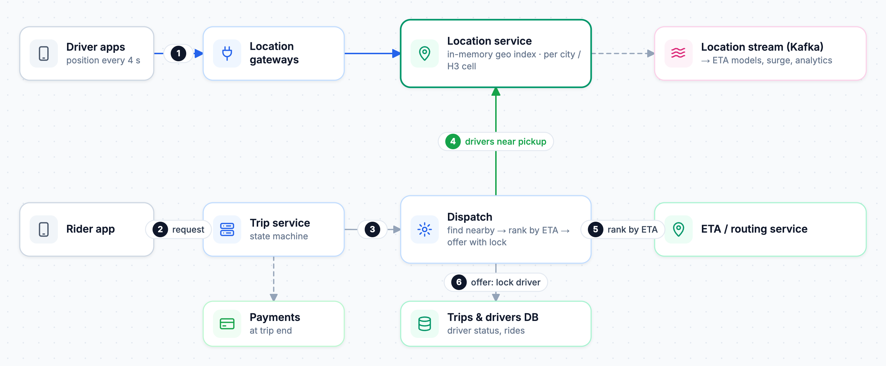

---

## 1. Requirements

**Functional**
- Drivers go online and send their location; riders request a ride from A to B.
- Match rider to a nearby driver; driver accepts or declines.
- Live tracking during pickup and the trip; fare at the end.

**Non-functional**
| Quality | Target |
|---------|--------|
| Matching | A driver found within ~5–10 s |
| Correctness | A driver is never assigned to two trips |
| Freshness | Positions on the map within a few seconds |
| Scale | 5M drivers online at peak, updating every 4 s; 20M trips/day |

---

## 2. Estimates

| Item | Math | Result |
|------|------|--------|
| Location updates | 5M drivers ÷ 4 s | **~1.25M updates/s** |
| Ride requests | 20M/day ÷ 10⁵ | **~200/s**, ~1K/s at peak |
| Live location memory | 5M × ~100 B | **~500 MB** — fits in memory, sharded by city |

**So what?** The location stream is enormous but each update is tiny and short-lived — keep it **in memory**, never in a disk database. Matching volume is small but must be **correct**.

---

## 3. API

```text
Driver app  → WebSocket / UDP-like stream:  { driver_id, lat, lng, heading, ts }   every ~4 s
POST /v1/rides        { pickup, dropoff }                  → { ride_id, status: MATCHING }
POST /v1/rides/{id}/accept     (driver)                    → assigned, or 409 if already taken
GET  /v1/rides/{id}   and a live stream of the driver's position to the rider
```

---

## 4. Data model

```text
location index (memory, per city shard):  H3 cell → { driver_id → lat, lng, status, ts }
drivers  (driver_id, status: offline|available|offered|on_trip, current_ride_id)
rides    (ride_id, rider_id, driver_id, status, pickup, dropoff, fare, timestamps)
location history → Kafka → data lake (for ETAs, surge pricing, analytics)
```

---

## 5. High-level design

1. Driver apps stream positions to **location gateways**, which update the **in-memory geo index** of that city and publish the stream to Kafka.
2. A rider requests a ride; the **trip service** creates it in the `MATCHING` state.
3. **Dispatch** asks the location service for available drivers in the pickup cell and neighbouring cells, then asks the **ETA service** for real driving times.
4. It **offers** the ride to the best driver, with a short hold (~15 s). Accept → assigned. Decline or timeout → the next driver.
5. During the trip, the rider's app receives the driver's position in real time.

---

## 6. Deep dives

### 6.1 Finding nearby drivers

Split each city into hexagonal cells (**H3**) or geohash cells. Each driver is stored under their current cell. For a pickup, check the pickup cell plus its neighbours, filter to `available`, and sort by **ETA** (driving time), not straight-line distance — a driver across a river may be close but 20 minutes away.

### 6.2 Never double-booking a driver

Two dispatch requests may pick the same driver at the same moment. Make the offer an **atomic, conditional update**: `UPDATE drivers SET status='offered', ride=… WHERE driver_id=? AND status='available'` (or a Redis lock with expiry). Only one wins; the other moves to the next driver. Same idea as [3.5](#35-transactions--isolation).

### 6.3 The trip as a state machine

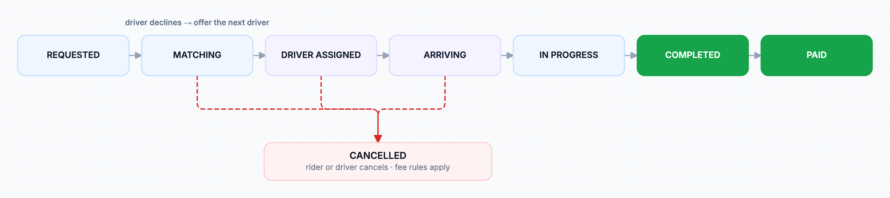

Every ride moves through clear states. Only valid transitions are allowed (a trip can't go from `REQUESTED` straight to `COMPLETED`), every transition is recorded, and each one can trigger events: notifications, billing, analytics.

### 6.4 Scaling by city

Riders and drivers only match within a city, so **shard everything by city/region**. A problem in one city's shard doesn't affect another, and busy cities get more capacity.

---

## 7. Failures & scaling

| Failure | Impact | Mitigation |
|---------|--------|------------|
| Location node crashes | A city's positions lost | Rebuilt within seconds from the next updates (every 4 s) |
| Driver loses signal | Stale position | Mark as stale after ~20 s; don't offer rides |
| Dispatch service slow | Riders wait | Stateless and horizontally scaled; per-city queues |
| Payment fails at trip end | Unpaid ride | Trip completes; payment retried asynchronously (see [Case Study 14](#case-study-14--payments)) |

> [!IMPORTANT]
> **🏛️ Architect's lens** — The business lives or dies on **matching quality**: faster pickups mean happier riders and more trips per driver per hour. That's why matching gets its own team, uses real ETAs instead of distance, and is continuously improved with data from the location stream.

---

## 8. Interview cheat sheet

| They ask | You answer |
|----------|------------|
| "Where do locations live?" | "In memory, in a geo index sharded by city and H3 cell — never a disk database on the hot path." |
| "How do you find nearby drivers?" | "The pickup cell plus its neighbours, filter to available, rank by ETA." |
| "Double booking?" | "An atomic conditional status change on the driver — only one offer can win." |
| "1M location updates a second?" | "Tiny, short-lived writes into memory, streamed to Kafka for history — horizontally scaled per city." |

<p align="right"><a href="#table-of-contents">↑ Back to top</a></p>

---

# Case Study 08 · Video Streaming

**Let anyone upload a video and let millions watch it smoothly on any device and any connection — like YouTube or Netflix**

| Difficulty | Core lessons | Building blocks |
|:----------:|--------------|-----------------|
| ⭐⭐⭐ | Transcoding pipelines · adaptive bitrate streaming · CDN economics | Object storage · transcoding workers · CDN · metadata DB |

### 🧩 The problem this product solves

A creator uploads a 4 GB video filmed in 4K. Viewers watch on a 4K TV with fast fibre, on a phone on a shaky train connection, and on an old laptop. If everyone just downloads that one original file:

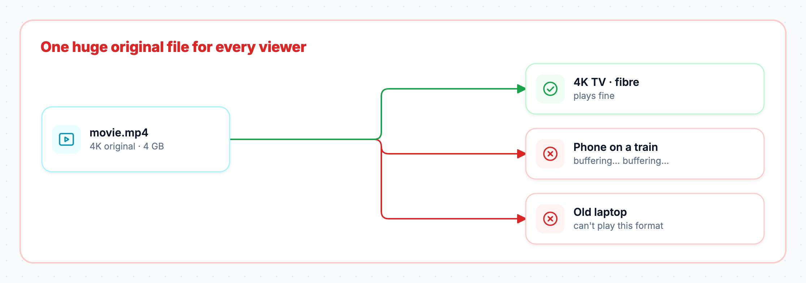

- The phone on a slow connection **buffers endlessly** — it can't download 4K fast enough.
- Many devices **can't play** the original format at all.
- Serving 4 GB to every viewer from one place costs a fortune and doesn't scale to millions.

### 💡 The design in one picture

Convert every upload into **many versions** (240p to 4K) cut into **few-second segments**. Players download a small **manifest** listing all versions, then fetch segments from a **CDN**, switching quality up or down every few seconds to match the connection:

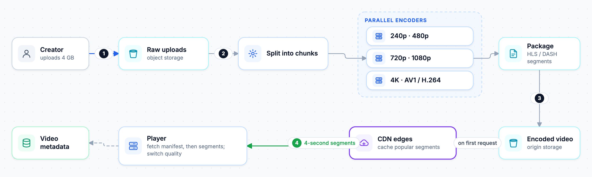

---

## 1. Requirements

**Functional**
- Upload videos; watch them on web, mobile and TV; resume where you stopped.
- Video page: title, description, view count, recommendations (see [Case Study 19](#case-study-19--recommendations)).

**Non-functional**
| Quality | Target |
|---------|--------|
| Playback start | < 2 s; very little buffering |
| Processing | Upload playable within minutes (short videos faster) |
| Durability | Originals never lost |
| Scale | 500 hours uploaded per minute; 1B+ hours watched per day |

---

## 2. Estimates

| Item | Math | Result |
|------|------|--------|
| Upload volume | 500 h/min × ~1 GB/h (original) | **~720 TB/day** of originals |
| Encoded copies | ~6 resolutions × 2 codecs | Several times the original size again |
| Watch traffic | 1B hours/day × ~1.5 GB/h ÷ 86,400 s | **~17 TB/s** average — only possible with CDNs and ISP caches |

**So what?** Video is a **bandwidth business**. Everything is designed around the CDN and around encoding efficiently.

---

## 3. API

```http
POST /v1/videos                         → { video_id, upload_url }   (resumable, chunked upload)
GET  /v1/videos/{id}                    → { title, status, manifest_url, thumbnails }
GET  <cdn>/videos/{id}/master.m3u8      → list of versions (HLS) or .mpd (DASH)
GET  <cdn>/videos/{id}/720p/seg_0042.ts → a 4-second segment
POST /v1/videos/{id}/progress  { position_s }    (resume later)
```

---

## 4. Data model

```text
videos     (video_id, owner_id, title, status: uploading|processing|ready, duration, created_at)
renditions (video_id, resolution, codec, bitrate, manifest_path)
object storage:  raw/{video_id}.mp4   ·   hls/{video_id}/{rendition}/seg_N.ts
view counts: counted asynchronously from player events (Kafka → aggregates)
```

---

## 5. High-level design

1. The creator uploads the original in chunks directly to object storage (resumable).
2. A **transcoding pipeline** splits the video into chunks and encodes them **in parallel** on many workers into several resolutions and codecs, then packages them as HLS/DASH segments with manifests.
3. Metadata is updated to `ready`; thumbnails are generated.
4. Viewers' players fetch the manifest and segments from the **CDN**, which pulls from the origin (object storage) only on the first request per edge.

---

## 6. Deep dives

### 6.1 Adaptive bitrate streaming (ABR)

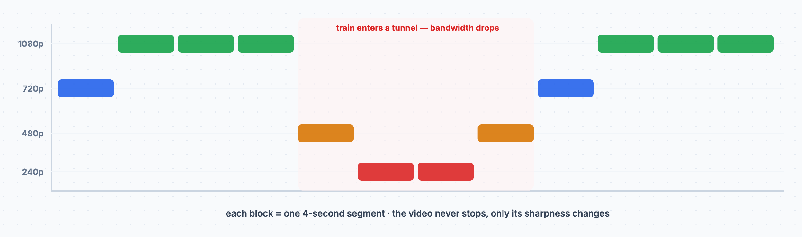

The player measures how fast segments download. Fast connection → next segment in 1080p. Train enters a tunnel → next segment in 360p. Each switch happens at a segment boundary (every few seconds), so the video keeps playing instead of freezing — the user sees a brief drop in sharpness rather than a spinner.

### 6.2 A parallel transcoding pipeline

Encoding a 2-hour movie on one machine takes hours. Instead: split into ~1-minute chunks → encode every chunk × every resolution **in parallel** → stitch and package. Model it as a job graph (a DAG) with retries per step, so one failed chunk doesn't restart everything. Popular videos can get a slower, higher-quality second encoding later.

### 6.3 CDN economics

Most views go to a small share of videos. Popular content sits in CDN edges (and even inside internet providers' networks — Netflix's Open Connect boxes are an example); the long tail is fetched from origin on demand. Pre-position ("push") content you know will be popular, like a new season's premiere.

---

## 7. Failures, scaling & monitoring

| Failure | Impact | Mitigation |
|---------|--------|------------|
| Transcode worker dies | One chunk fails | Retry that chunk only |
| CDN edge problem | Buffering in a region | Multi-CDN; the player fails over |
| Upload interrupted | Creator frustration | Resumable chunked uploads |
| Viral video | Origin traffic spike | Origin shield; CDN absorbs the rest |

**What to monitor:** video start time, rebuffering ratio (share of time spent buffering), average bitrate delivered, CDN cache hit ratio, transcoding queue time.

> [!IMPORTANT]
> **🏛️ Architect's lens** — Every percent of better compression or higher CDN hit ratio saves millions at scale. That's why video companies invest in better codecs (AV1), per-title encoding (simple cartoons need fewer bits than action films) and their own CDN capacity.

---

## 8. Interview cheat sheet

| They ask | You answer |
|----------|------------|
| "Why not serve the original file?" | "Too big for slow connections and not playable everywhere — we transcode to multiple resolutions and stream segments." |
| "How does quality adapt?" | "ABR: the player measures throughput and picks each next few-second segment's quality from the manifest." |
| "How do you encode fast?" | "Split into chunks and encode them in parallel on many workers, as a DAG with per-step retries." |
| "Biggest cost?" | "Egress bandwidth — CDN caching, efficient codecs and ISP-embedded caches." |

<p align="right"><a href="#table-of-contents">↑ Back to top</a></p>

---

# Case Study 09 · File Sync

**Keep a folder of files identical on your laptop, phone and the web — like Dropbox or Google Drive**

| Difficulty | Core lessons | Building blocks |
|:----------:|--------------|-----------------|
| ⭐⭐⭐ | Chunking & deduplication · metadata vs data · sync cursors · conflict handling | Desktop client · metadata service · block storage (S3) · notifications |

### 🧩 The problem this product solves

You edit a 500 MB presentation on your laptop — changing one slide. The simple approach re-uploads the **whole file** every time and makes every other device download it again:

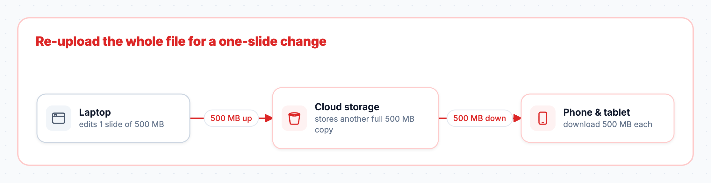

On a slow connection that takes many minutes, wastes bandwidth and storage, and if you and a colleague edit the same file offline, one person's changes silently overwrite the other's.

### 💡 The design in one picture

Split files into **small chunks** identified by their content hash. After an edit, only the **changed chunks** are uploaded. A **metadata service** records which chunks make up each version of each file, and other devices are notified to fetch just those chunks:

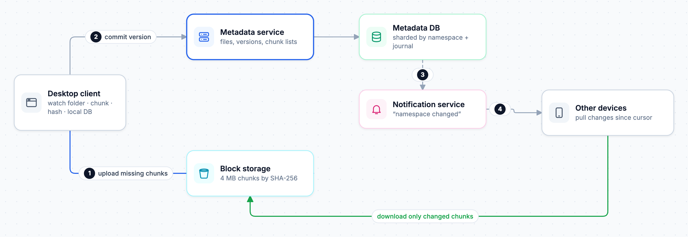

---

## 1. Requirements

**Functional**
- Upload, download and sync files across devices; offline edits sync later.
- Version history; restore deleted files; share folders.

**Non-functional**
| Quality | Target |
|---------|--------|
| Durability | Files are **never** lost (the core promise) |
| Sync speed | Changes appear on other devices within seconds |
| Efficiency | Small edits transfer small amounts of data |
| Scale | 500M users, ~1 billion file changes a day, exabytes of storage |

---

## 2. Estimates

| Item | Math | Result |
|------|------|--------|
| File changes | 1B/day ÷ 10⁵ | **~10K metadata writes/s** |
| Storage | 500M users × ~20 GB average used | **~10 EB** — dedupe and cold storage tiers matter hugely |
| Chunk size | 4 MB | A 500 MB file = 125 chunks; a one-slide edit ≈ 1–2 chunks |

---

## 3. API

```http
POST /v1/files/commit   { path, base_version, chunks: [sha256, …] }
     → 200 { version }   or   409 conflict (base_version is old)
POST /v1/chunks/check   { hashes: [...] }  → { missing: [...] }   // upload only what's missing
PUT  <signed_url>        (chunk bytes, straight to storage)
GET  /v1/changes?cursor=… → { entries: [...], next_cursor }          // what changed since my cursor
```

---

## 4. Data model

```text
files     (namespace_id, file_id, path, latest_version, deleted)
versions  (file_id, version, chunk_list [sha256…], size, modified_by, created_at)
chunks    (sha256 → storage location, ref_count)        -- content-addressed, deduplicated
journal   (namespace_id, seq, file_id, version)         -- ordered change log for sync cursors
```

Sharded by **namespace** (a user's or team's folder tree), so one account's changes stay together.

---

## 5. High-level design

**Uploading a change**
1. The client watches the folder, splits the changed file into chunks and hashes them.
2. It asks which hashes the server **doesn't have yet**, and uploads only those, straight to block storage.
3. It **commits** the new version (the list of chunk hashes) to the metadata service.

**Syncing other devices**
4. The **notification service** tells the user's other online devices "namespace changed".
5. They request changes since their **cursor**, download the missing chunks, and rebuild the file.

---

## 6. Deep dives

### 6.1 Chunking and deduplication

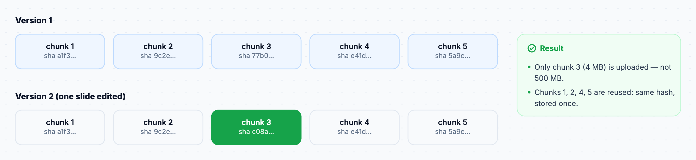

Each chunk is identified by the hash of its content, so identical chunks are stored **once** — across versions, files, and even users (the same popular PDF uploaded by 10,000 people is stored once). Smarter **content-defined chunking** picks chunk boundaries based on the content itself, so inserting a byte at the start of a file doesn't shift every chunk.

### 6.2 Sync cursors

Each namespace has an ordered **journal** of changes. A device remembers the last position it processed (its cursor) and asks "what happened after position 81,532?" This works after any gap — a phone that was offline for a week catches up with one call.

### 6.3 Conflicts

Two people edit the same file offline. The first commit wins; the second arrives with an old `base_version` and gets **409 Conflict**. Rather than guessing how to merge arbitrary files, the client saves the second version as **"report (Alice's conflicted copy).docx"** — nothing is ever lost, and the user decides.

---

## 7. Failures, scaling & monitoring

| Failure | Impact | Mitigation |
|---------|--------|------------|
| Upload interrupted | Partial file | Chunks upload independently; the commit only happens when all are present |
| Corrupted chunk | Broken file | Verify the hash on upload and on download; storage keeps multiple copies |
| Metadata shard down | Some accounts can't sync | Replicated shards with failover |
| Huge folders (millions of files) | Slow listings | Paginated journal; shard large team namespaces |

**What to monitor:** sync delay (commit → other devices updated), upload failure rate, dedupe ratio, storage growth per tier.

> [!IMPORTANT]
> **🏛️ Architect's lens** — Storage is the cost centre. Deduplication, compression and moving rarely-read data to cheaper cold tiers are what make "2 TB for a few dollars a month" profitable. And because the promise is "never lose my files", durability (checksums, replication, versioning) is not negotiable.

---

## 8. Interview cheat sheet

| They ask | You answer |
|----------|------------|
| "Small edit to a big file?" | "4 MB content-hashed chunks — only changed chunks upload, then we commit a new chunk list." |
| "How do devices know something changed?" | "A notification (long-poll/WebSocket) says 'changed', then the device pulls changes since its cursor." |
| "Conflicts?" | "Optimistic versioning: an old base_version gets 409, and the client keeps a conflicted copy — never silent overwrites." |
| "Where do files live?" | "Chunks in object storage by hash; metadata DB sharded by namespace." |

<p align="right"><a href="#table-of-contents">↑ Back to top</a></p>

---

# Case Study 10 · Web Crawler

**Visit billions of web pages, politely, and keep a fresh copy for a search engine**

| Difficulty | Core lessons | Building blocks |
|:----------:|--------------|-----------------|
| ⭐⭐ | URL frontier · politeness · deduplication with Bloom filters · distributed workers | Frontier queues · fetchers · parsers · content store · seen-URL store |

### 🧩 The problem this product solves

A search engine can only find pages it has already downloaded. The web has **billions** of pages, constantly changing. A simple crawler — take a URL, download it, add its links to a list, repeat — breaks immediately at scale:

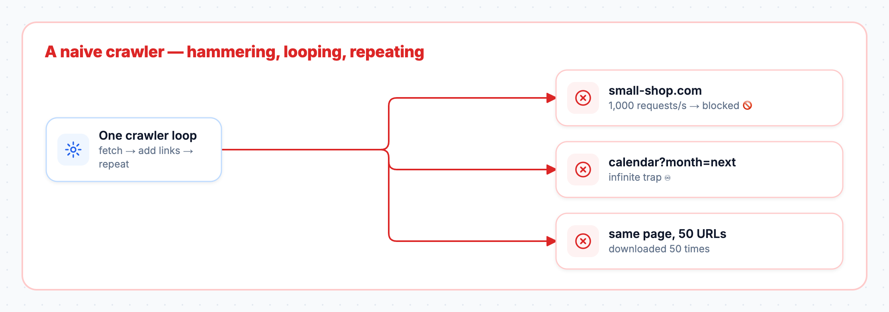

- It hammers one website with thousands of requests a second (and gets blocked — or knocks the site over).
- It downloads the same pages again and again, and gets stuck in infinite link loops ("calendar → next month → next month…").
- One machine can crawl maybe a few hundred pages a second; the web needs billions per day.

### 💡 The design in one picture

A **URL frontier** decides what to crawl next, by priority, while making sure each website is only visited at a polite pace. Thousands of **fetchers** download in parallel; parsers extract new links, which are **deduplicated** (with a Bloom filter first) before entering the frontier:

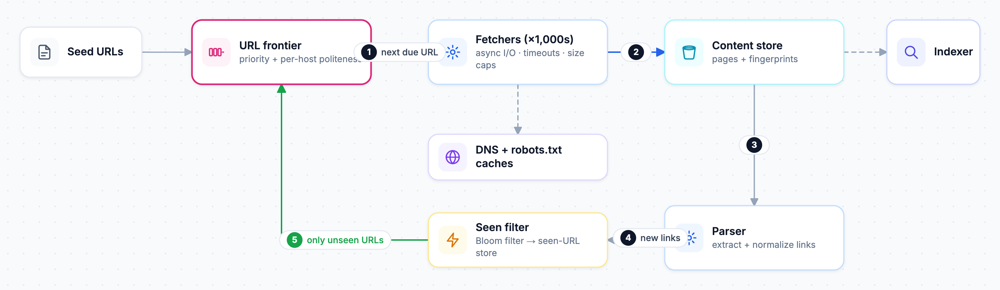

---

## 1. Requirements

**Functional**
- Start from seed URLs, discover and download pages, extract links, store content for indexing.
- Re-crawl pages based on how often they change.

**Non-functional**
| Quality | Target |
|---------|--------|
| Politeness | Respect `robots.txt`; at most ~1 request per second per website |
| Scale | ~1 billion pages per day |
| Freshness | News sites within minutes; static pages every few weeks |
| Robustness | Survive traps, huge pages, malformed HTML, slow servers |

---

## 2. Estimates

| Item | Math | Result |
|------|------|--------|
| Fetch rate | 1B pages/day ÷ 10⁵ | **~10K pages/s** |
| Bandwidth | 10K × 500 KB | **~5 GB/s** |
| Storage | 1B × 100 KB (compressed) | **~100 TB/day** |
| Seen URLs | tens of billions | Bloom filter in memory + a disk key-value store |

---

## 3. Interfaces

The crawler is an internal batch system rather than a public API. Its outputs are stored pages (`url, fetched_at, status, content_hash, content`) and a stream of "page fetched" events for the indexer.

---

## 4. Data model

```text
frontier:  priority queues → per-host queues (one per website)
seen_urls: normalized URL hash → last_crawled, next_due        (key-value store)
content:   object storage, keyed by URL hash + fetch time
host_info: host → robots.txt rules, crawl delay, DNS cache
```

---

## 5. High-level design

1. **Seeds** enter the frontier.
2. The **frontier** hands each fetcher a URL whose website is due for a visit (politeness) and whose priority is highest.
3. **Fetchers** resolve DNS (cached), check `robots.txt` (cached), download with timeouts and size limits.
4. The page is saved to the **content store**; a **content fingerprint** skips near-duplicate pages.
5. **Parsers** extract links, normalize them (lowercase host, remove tracking parameters), and filter out ones already seen (Bloom filter → seen-URL store).
6. New URLs go back into the frontier.

---

## 6. Deep dives

### 6.1 The URL frontier: priority + politeness

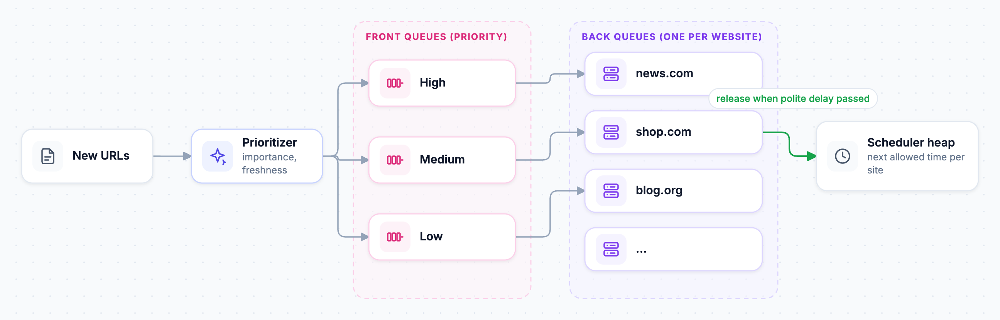

- **Front queues** sort URLs by priority (important, frequently changing pages first).
- **Back queues** hold one queue **per website**. A scheduler (a heap ordered by "next allowed time") only releases a website's next URL when its polite delay has passed.
- Result: thousands of websites are crawled in parallel, but each one sees a gentle, steady trickle.

### 6.2 Avoiding duplicates

- **URL dedupe:** normalize, then check a **Bloom filter** in memory ([4.4](#44-bloom-filters)); only "maybe seen" goes to the disk store.
- **Content dedupe:** many URLs serve the same page. A fingerprint (e.g. SimHash) catches exact and near duplicates.

### 6.3 Traps and bad actors

Limit URL length and path depth, cap pages per website per day, detect repeating patterns (calendar pages), set download timeouts and size caps, and never execute arbitrary scripts except in a sandboxed renderer.

---

## 7. Failures, scaling & monitoring

| Failure | Impact | Mitigation |
|---------|--------|------------|
| Fetcher crashes | URLs lost mid-fetch | Frontier leases URLs; unacknowledged ones return to the queue |
| Slow website | Fetchers blocked | Short timeouts; async I/O (one fetcher handles thousands of connections) |
| Blocked by a site | Missing content | Obey robots.txt, identify your crawler, back off on errors |
| DNS overload | Slow fetching | Local DNS cache |

**What to monitor:** pages/s, error rates per website, frontier size and age, duplicate rate, freshness of important pages.

> [!IMPORTANT]
> **🏛️ Architect's lens** — Politeness is not optional: a crawler that overloads websites gets blocked, damages your brand and can create legal trouble. The frontier design exists as much for being a good citizen of the web as for efficiency.

---

## 8. Interview cheat sheet

| They ask | You answer |
|----------|------------|
| "How do you stay polite?" | "Per-host back queues with a next-allowed-time heap, plus robots.txt and crawl-delay rules." |
| "How do you avoid re-crawling?" | "Normalize URLs, check a Bloom filter first, then the seen-URL store; content fingerprints catch duplicate pages." |
| "How do you scale to 10K pages/s?" | "Many stateless fetchers with async I/O, a sharded frontier (by host hash), and DNS/robots caches." |
| "Freshness?" | "Re-crawl schedule per page based on how often its content actually changed in the past." |

<p align="right"><a href="#table-of-contents">↑ Back to top</a></p>

---

# Case Study 11 · Typeahead

**Suggest the best completions while the user types each letter — in under 100 ms**

| Difficulty | Core lessons | Building blocks |
|:----------:|--------------|-----------------|
| ⭐⭐ | Tries with top-k · offline index building · caching at the edge | Trie servers · batch pipeline · CDN / edge cache · Redis |

### 🧩 The problem this product solves

When you type "how to m" into a search box, suggestions like "how to make pancakes" should appear **before you type the next letter** — people type a key every ~150 ms. A naive approach runs a database query on every keystroke:

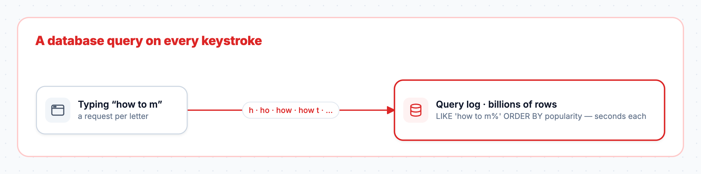

`WHERE query LIKE 'how to m%' ORDER BY popularity LIMIT 10` over billions of past queries, for every letter, for millions of users typing at once — far too slow, and wasteful because most people type the same popular prefixes.

### 💡 The design in one picture

Build a **trie** (prefix tree) **offline** from query logs, where each node already stores its **top 10 completions**. Load it into memory on trie servers. A keystroke becomes a quick walk down the tree — and popular prefixes are cached at the edge:

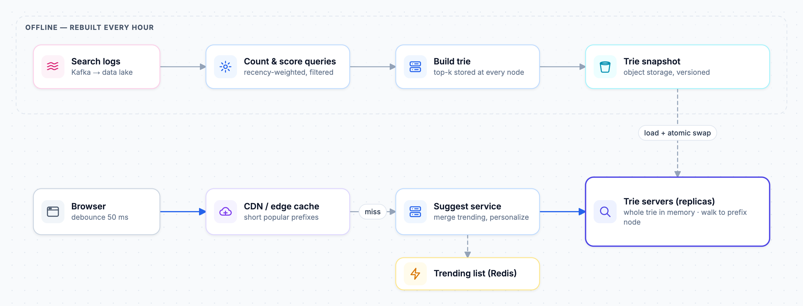

---

## 1. Requirements

**Functional**
- Return the top 5–10 suggestions for a prefix, ranked by popularity (and freshness).
- Optional: personalized suggestions, trending queries, filtering offensive terms.

**Non-functional**
| Quality | Target |
|---------|--------|
| Latency | p99 < 100 ms end to end (server side ~10 ms) |
| Freshness | Popularity updated hourly; breaking trends within minutes |
| Availability | High — but degrading to "no suggestions" is acceptable |
| Scale | 10B searches/day × ~6 keystrokes each |

---

## 2. Estimates

| Item | Math | Result |
|------|------|--------|
| Suggestion requests | 10B × 6 ÷ 10⁵ | **~600K requests/s** (debouncing cuts this a lot) |
| Trie size | ~100M popular queries × ~50 B + top-k lists | **tens of GB** → fits in memory, sharded or replicated |
| Cacheability | Short prefixes are shared by everyone | **Very high edge/CDN hit ratio** for 1–3 character prefixes |

---

## 3. API

```http
GET /v1/suggest?q=how%20to%20m&lang=en&limit=8
  → { "suggestions": ["how to make pancakes", "how to meditate", …] }
Cache-Control: public, max-age=300       (for short, non-personalized prefixes)
```

The client waits ~50 ms after the last keystroke before calling (**debouncing**), and cancels outdated requests.

---

## 4. Data model

```text
Offline:  query_logs (query, timestamp, locale) → hourly counts (query, score)
Online:   trie in memory  — node("how to m").top_k = [(query, score) × 10]
          trends (Redis)  — recent fast-rising queries, merged in at request time
```

---

## 5. High-level design

**Offline (build)**
1. Search logs stream into Kafka and a data lake.
2. An hourly batch job counts queries (weighting recent ones more), removes blocked terms, and **builds the trie with top-k lists precomputed** at every node.
3. The new trie snapshot is written to object storage; trie servers load it and swap it in atomically.

**Online (serve)**
4. The browser debounces keystrokes and calls `/suggest`.
5. A CDN/edge cache answers popular short prefixes instantly.
6. Otherwise a trie server walks to the prefix node and returns its stored top-k — no searching the subtree at request time.

---

## 6. Deep dives

### 6.1 A trie with precomputed top-k

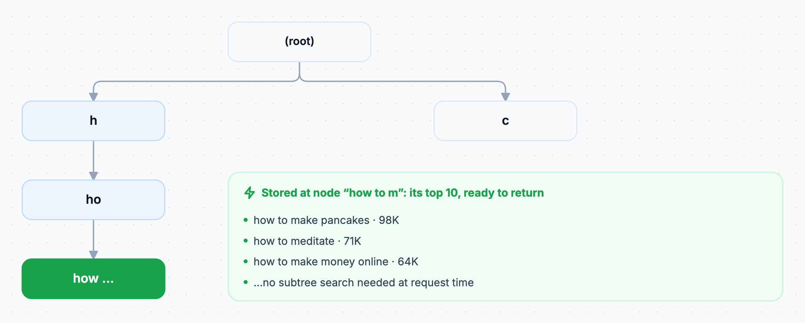

Walking to the node for "how to m" takes as many steps as there are letters. Because the node already holds its best 10 completions, there's no need to explore all its children at request time — the answer is ready.

### 6.2 Keeping it fresh

- Rebuild the full trie hourly (or daily) offline.
- For breaking trends (a big news event), keep a small **trending list** in Redis updated every minute and merge it into results at request time.

### 6.3 Sharding

If one trie doesn't fit on a server, shard by **prefix range** (a–f, g–m…), balanced by traffic rather than alphabet, since "s" is far more common than "x". Usually it's simpler to **replicate** the whole trie on many servers and let a load balancer spread requests.

### 6.4 Personalization

Take the global top 20 for the prefix, then re-rank with the user's own recent searches and location — a light step, so the heavy work stays precomputed.

---

## 7. Failures, scaling & monitoring

| Failure | Impact | Mitigation |
|---------|--------|------------|
| Trie server down | Some requests fail | Many replicas behind a load balancer |
| Bad trie build | Wrong or offensive suggestions | Validate the snapshot before swapping; keep the previous one to roll back |
| Traffic spike | Overload | Edge caching + client debouncing |

**What to monitor:** p99 latency, edge cache hit ratio, suggestion click-through rate, time since the last successful trie build.

> [!IMPORTANT]
> **🏛️ Architect's lens** — Suggestions shape what people search for, so quality and safety filters (hate, adult content, legal takedowns) are a product and legal responsibility, not just a ranking detail. Build a fast blocklist that applies at serving time.

---

## 8. Interview cheat sheet

| They ask | You answer |
|----------|------------|
| "Data structure?" | "A trie in memory where every node stores its precomputed top-k completions." |
| "How is it built?" | "Offline from query logs — hourly counts with recency weighting — then atomically swapped onto trie servers." |
| "600K requests/s?" | "Debounce on the client, cache short prefixes at the CDN, replicate trie servers." |
| "Trending terms?" | "A small real-time trending list in Redis merged at request time." |

<p align="right"><a href="#table-of-contents">↑ Back to top</a></p>

---

# Case Study 12 · Search Engine

**Find the most relevant documents among billions in a fraction of a second**

| Difficulty | Core lessons | Building blocks |
|:----------:|--------------|-----------------|
| ⭐⭐⭐ | Inverted indexes · sharding and scatter-gather · relevance ranking · keeping the index in sync | Elasticsearch/OpenSearch-style cluster · CDC pipeline · ranking service |

### 🧩 The problem this product solves

A shop has 50 million products. A customer types "red running shoes". The obvious database query:

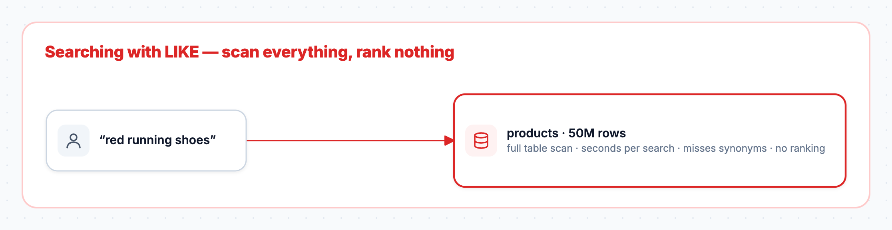

`WHERE description LIKE '%red%' AND description LIKE '%running%' …` scans **every row** (no normal index can help with a `%word%` search), takes seconds, misses "runner" and "trainers", and has no idea which results are the **best** ones.

### 💡 The design in one picture

Build an **inverted index** — for every word, the list of documents that contain it (like the index at the back of a book, but for every word). A search looks up each word's list, combines them, and ranks the matches. The index is split into shards searched in parallel:

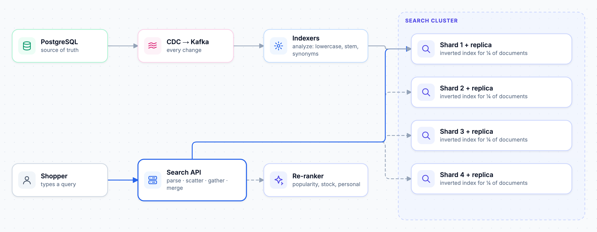

---

## 1. Requirements

**Functional**
- Full-text search with filters (price, brand, size), sorting and pagination.
- Typo tolerance, synonyms ("sneakers" = "trainers"), relevance ranking.
- New or changed products searchable within seconds.

**Non-functional**
| Quality | Target |
|---------|--------|
| Latency | p99 < 200 ms |
| Freshness | Changes visible within ~1–5 s |
| Scale | 50M documents, ~5K searches/s at peak |

---

## 2. Estimates

| Item | Math | Result |
|------|------|--------|
| Index size | 50M docs × ~2 KB indexed | **~100 GB** + replicas → a modest cluster |
| Shards | aim for ~20–50 GB per shard | **~5 primary shards**, each with replicas |
| Query load | 5K/s × every shard queried | Add replicas to spread read load |

---

## 3. API

```http
GET /v1/search?q=red+running+shoes&brand=acme&price_max=120&sort=relevance&cursor=…
  → { "total": 1834, "results": [ { "id": 17, "title": "…", "score": 12.4 } … ],
      "facets": { "brand": {...}, "size": {...} }, "next_cursor": "…" }
```

---

## 4. Data model

```text
Source of truth: products table in PostgreSQL
Search document: { id, title, description, brand, price, sizes, popularity, updated_at }
Inverted index:  "running" → [doc 17 (positions 3, 9), doc 42, doc 88 …]
                 "shoe"    → [doc 17, doc 23 …]     (after stemming "shoes" → "shoe")
```

---

## 5. High-level design

**Indexing (write path)**
1. Products change in PostgreSQL.
2. **Change data capture** (e.g. Debezium) streams every change to Kafka.
3. **Indexers** turn each product into a search document — analyzing text: lowercase, split into words, stem ("running" → "run"), add synonyms — and write it to the search cluster.

**Querying (read path)**
4. The search API parses the query and sends it to **every shard** in parallel (scatter).
5. Each shard finds matching documents via the inverted index, scores them, and returns its top results.
6. The API **merges** the shard results (gather), optionally re-ranks with a smarter model, and returns the page.

---

## 6. Deep dives

### 6.1 How an inverted index answers a query

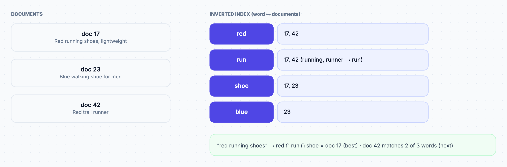

"red running shoes" → look up the lists for `red`, `run`, `shoe` → intersect them → score each match. Scoring (e.g. **BM25**) rewards documents where the words are frequent in that document but rare overall, and matches in the title count more than in the description.

### 6.2 Relevance beyond text

Final ranking often mixes text score with business signals: popularity, conversion rate, stock availability, personalization. A common pattern: the search engine returns the top 500 by text relevance, then a ranking model re-orders the top 50.

### 6.3 Reindexing without downtime

When you change analyzers or mappings, build a **new index** in the background from the source of truth, replay changes that happened meanwhile from Kafka, then switch an **alias** from the old index to the new one in one step. Users never see a gap.

### 6.4 Permissions

For private documents (e.g. company files), store allowed groups in each document and **filter at query time** by the user's groups — never show a result and hide it afterwards, or result counts leak information.

---

## 7. Failures, scaling & monitoring

| Failure | Impact | Mitigation |
|---------|--------|------------|
| A shard node dies | Partial results | Replicas take over; return partial results with a flag rather than an error |
| Indexing lag | Stale results | Monitor Kafka lag; scale indexers |
| Expensive queries | Cluster slowdown | Timeouts, limits on wildcard queries and result depth |

**What to monitor:** query p99, zero-result rate, click-through on the top 3 results, indexing lag, shard size balance.

> [!IMPORTANT]
> **🏛️ Architect's lens** — The search index is a **copy**, never the source of truth. That's what makes it safe to rebuild, reshape and scale freely. For many companies a managed Elasticsearch/OpenSearch or Algolia is cheaper than running their own cluster — build only if search is your core business.

---

## 8. Interview cheat sheet

| They ask | You answer |
|----------|------------|
| "Why not SQL LIKE?" | "It scans every row and can't rank. An inverted index maps each word to its documents." |
| "How is the index kept fresh?" | "CDC from the database into Kafka, then indexers update the search cluster within seconds." |
| "How does a query run?" | "Scatter to all shards, each returns its top-k, gather and merge, optionally re-rank." |
| "Changing the index schema?" | "Build a new index in the background and switch an alias atomically." |

<p align="right"><a href="#table-of-contents">↑ Back to top</a></p>

---

# Case Study 13 · Ticket Booking

**Sell concert or flight seats to huge crowds without ever selling the same seat twice**

| Difficulty | Core lessons | Building blocks |
|:----------:|--------------|-----------------|
| ⭐⭐⭐ | Seat holds with expiry · contention on hot rows · waiting rooms · idempotent payments | Virtual waiting room · booking service · PostgreSQL · Redis · payment provider |

### 🧩 The problem this product solves

Tickets for a famous artist go on sale at 10:00. **2 million people** try to buy **50,000 seats** in the same minute:

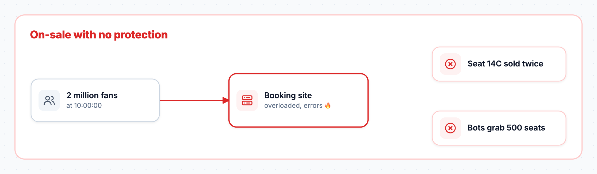

- The site crashes under the flood, and the few who get through see errors.
- Two fans click the same seat at the same moment — both are charged, one gets turned away at the door.
- Bots grab hundreds of seats to resell at a markup.

### 💡 The design in one picture

A **virtual waiting room** lets people in at a rate the system can handle. When a fan picks a seat, the system places a **temporary hold** (e.g. 10 minutes) using an atomic database update, so nobody else can take it. Paying converts the hold into a sale; not paying releases the seat:

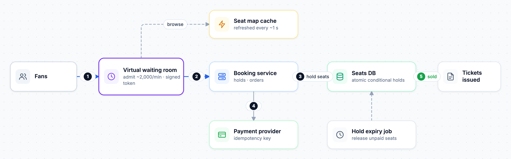

---

## 1. Requirements

**Functional**
- Browse events and seat maps; select seats; hold them while paying; confirm and issue tickets.

**Non-functional**
| Quality | Target |
|---------|--------|
| Correctness | **Never** sell a seat twice (strong consistency on seats) |
| Fairness | First come, first served; bots limited |
| Availability | Survive 100× normal traffic during a big on-sale |
| Hold time | Seats held ~10 minutes, then released automatically |

---

## 2. Estimates

| Item | Math | Result |
|------|------|--------|
| Visitors at 10:00 | 2M people | Far more than can buy → a queue is fair and necessary |
| Seat-map reads | Millions of refreshes | Serve from cache, refreshed every second or two |
| Seat writes | 50K seats (a few hold attempts each) | **~150K hold attempts** in the first minutes — only on one event's rows |

**So what?** The hard part isn't total volume; it's **contention**: many people fighting over the **same few rows** at once.

---

## 3. API

```http
POST /v1/events/{id}/queue            → { position, token_when_admitted }
GET  /v1/events/{id}/seats            → seat map (cached, "available" is a hint)
POST /v1/holds  { event_id, seat_ids } → 201 { hold_id, expires_at }   or 409 seat taken
POST /v1/orders { hold_id, payment_method, idempotency_key } → { order_id, status }
```

---

## 4. Data model

```sql
seats (event_id, seat_id, status: available|held|sold, hold_id, held_until, order_id)
      PRIMARY KEY (event_id, seat_id)
holds  (hold_id, user_id, event_id, expires_at)
orders (order_id, user_id, hold_id, amount, status, idempotency_key UNIQUE)
```

---

## 5. High-level design

1. At on-sale, users enter the **waiting room**; they're admitted in batches with a signed token.
2. Admitted users see the seat map (from cache — it may be a second old).
3. Selecting seats → **atomic hold**: only succeeds if the seats are still available.
4. Payment with an **idempotency key**. Success → seats become `sold`, a ticket is issued. Failure or timeout → hold released.
5. A background job (or the `held_until` check itself) releases expired holds.

---

## 6. Deep dives

### 6.1 The seat hold — never selling a seat twice

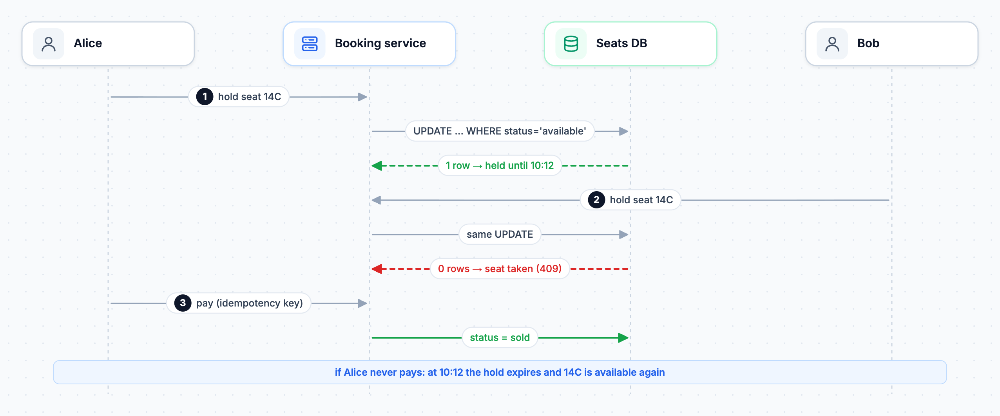

```sql
UPDATE seats
   SET status = 'held', hold_id = :hold, held_until = now() + interval '10 minutes'
 WHERE event_id = :event AND seat_id = ANY(:seats)
   AND (status = 'available' OR (status = 'held' AND held_until < now()));
-- success only if the number of rows changed == number of seats requested
```

The condition makes the check and the change **one atomic step**: two fans can't both win. Expired holds count as available, so there's no race with the cleanup job. (Same idea as [3.5](#35-transactions--isolation).)

### 6.2 The virtual waiting room

Instead of letting 2 million requests crash the site, put everyone in a queue (often at the CDN edge). Admit, say, 2,000 people per minute — the rate the booking system can serve comfortably — each with a short-lived signed token. It's fairer, keeps the site up, and makes bots easier to limit.

### 6.3 Payment after the hold

Never hold a database lock while waiting for a card payment. The hold is a **status**, not a lock, so the payment can take a minute safely. Use an idempotency key so a double-click can't charge twice, and a reconciliation job to handle "we charged but didn't hear back" cases.

---

## 7. Failures, scaling & monitoring

| Failure | Impact | Mitigation |
|---------|--------|------------|
| Traffic surge | Overload | Waiting room; cached seat maps; autoscaling |
| Payment timeout | Unknown state | Idempotent retries; reconciliation with the provider |
| Hot event rows | Lock contention | Short transactions; partition by event/section |
| Bots | Unfair sales | Queue tokens, per-account limits, CAPTCHA, purchase limits |

**What to monitor:** queue length and admission rate, hold success/conflict rate, hold-to-purchase conversion, payment failures.

> [!IMPORTANT]
> **🏛️ Architect's lens** — On-sale day is the whole business for a ticketing company: a crash is front-page news. The waiting room is as much about **fairness and trust** as capacity — and a correct "never double-sell" guarantee protects the brand at the venue door.

---

## 8. Interview cheat sheet

| They ask | You answer |
|----------|------------|
| "Two people click the same seat?" | "An atomic conditional UPDATE — only one changes the row; the other gets 409." |
| "2 million users at once?" | "A virtual waiting room admits people at the rate we can serve; seat maps come from cache." |
| "Held but never paid?" | "Holds carry an expiry; expired holds count as available, and a job cleans them up." |
| "Double-click on Pay?" | "Idempotency key on the order; the provider charge happens once." |

<p align="right"><a href="#table-of-contents">↑ Back to top</a></p>

---

# Case Study 14 · Payments

**Take money from customers and pay it to merchants — exactly once, with every cent accounted for**

| Difficulty | Core lessons | Building blocks |
|:----------:|--------------|-----------------|
| ⭐⭐⭐ | Idempotency keys · double-entry ledgers · payment state machines · webhooks · reconciliation | Payment API · ledger DB · payment provider (Stripe/Adyen) · outbox · reconciliation jobs |

### 🧩 The problem this product solves

Money is the one place where "mostly correct" isn't acceptable. Networks time out, phones retry, providers answer late, servers crash halfway:

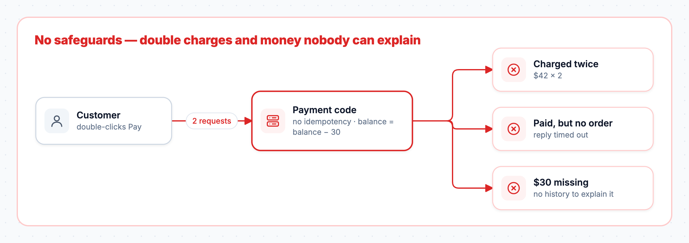

- A customer double-clicks **Pay** on a slow connection → charged **twice**.
- The provider charged the card, but the "success" reply timed out → your system thinks it failed and the customer gets no order, but has paid.
- A bug updates a balance with `balance = balance - 30` and nobody can later explain where $30 went.

### 💡 The design in one picture

Every payment request carries an **idempotency key**, so retries are harmless. Every money movement is written as balanced **double-entry ledger** records that can never be edited. Provider results arrive via signed **webhooks**, and a daily **reconciliation** job compares your ledger with the provider's reports:

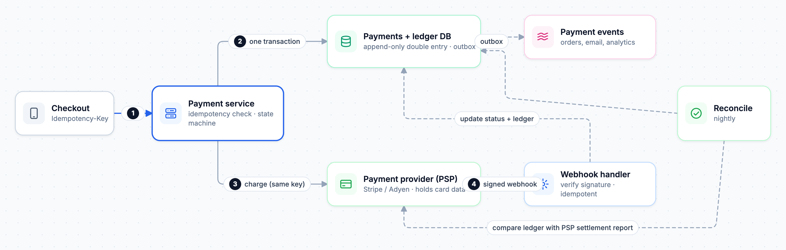

---

## 1. Requirements

**Functional**
- Charge a customer (card, wallet); refund; pay out to merchants.
- Payment status queryable at any time; full history for audit.

**Non-functional**
| Quality | Target |
|---------|--------|
| Correctness | **Exactly-once effect** — never double charge, never lose a payment |
| Auditability | Every cent traceable; records never edited, only added |
| Availability | High, but **correctness beats availability** — reject rather than guess |
| Security | Card numbers never touch our servers (provider tokenization, PCI scope) |

**Out of scope:** building a card network — we integrate a payment service provider (PSP).

---

## 2. Estimates

| Item | Math | Result |
|------|------|--------|
| Payments | 10M/day ÷ 10⁵ | **~100/s**, ~1K/s at peak |
| Ledger rows | ~4 entries per payment (charge, fee, payout…) | **~40M rows/day** — fine for a relational DB, partitioned by time |

**So what?** The volume is modest. The design is driven by **correctness and audit**, not scale.

---

## 3. API

```http
POST /v1/payments
     Idempotency-Key: 5f2c9a1e-…
     { "amount": 4200, "currency": "USD", "customer_id": 42, "payment_method": "pm_tok_…" }
  →  201 { "payment_id": "pay_81", "status": "authorized" }
     (same key again → the same stored response, no second charge)

POST /v1/payments/{id}/capture  ·  POST /v1/payments/{id}/refund  { amount }
POST /webhooks/psp          (signed by the provider)
```

Amounts are integers in the smallest unit (cents) — never floating point.

---

## 4. Data model

```sql
payments (payment_id, customer_id, amount, currency, status, psp_reference, created_at)
idempotency_keys (key PRIMARY KEY, request_hash, response, created_at)   -- keep ~24 h or more
ledger_entries (entry_id, txn_id, account, direction: debit|credit, amount, created_at)
               -- append-only; for each txn_id, debits = credits
outbox (event_id, type, payload, sent_at)
```

---

## 5. High-level design

1. The client sends the payment with an **idempotency key**.
2. The payment service checks the key: seen before → return the stored result.
3. It creates the payment as `created`, then calls the **PSP** with the same key (PSPs support idempotency too).
4. The result updates the payment's state and writes **balanced ledger entries** — in **one database transaction**, together with an **outbox** event.
5. The PSP later confirms (or reverses) via a **signed webhook**; the handler is idempotent too.
6. A nightly **reconciliation** job matches every ledger entry with the PSP's settlement report and flags differences.

---

## 6. Deep dives

### 6.1 Idempotency keys — the #1 rule

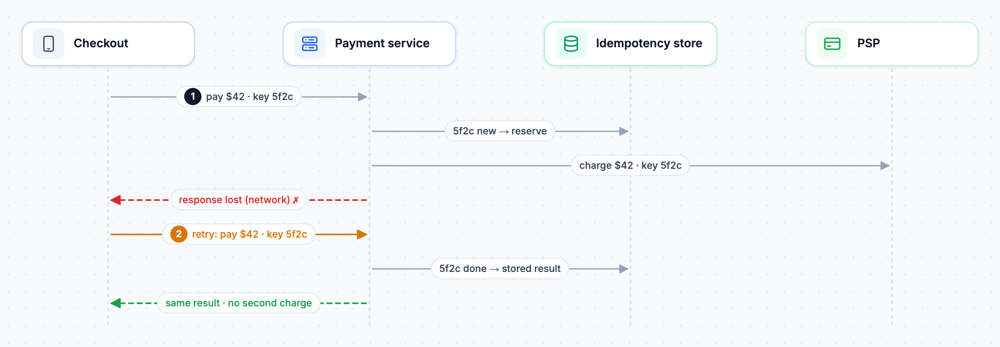

The client generates a unique key per payment attempt. The server stores the key with the result. A retry with the same key returns the stored result instead of charging again. If the key is reused with a *different* request body, reject it.

### 6.2 Double-entry ledger

Never store just a balance you overwrite. Record every movement as a pair of entries that must balance:

| txn | account | debit | credit |
|-----|---------|------:|-------:|
| order 81 | customer card (via PSP) | $42.00 | |
| order 81 | merchant payable | | $40.74 |
| order 81 | platform fee revenue | | $1.26 |

Balances are the sum of entries. Mistakes are fixed with new **correcting entries**, never by editing old ones — so the history always explains itself.

### 6.3 Payment state machine

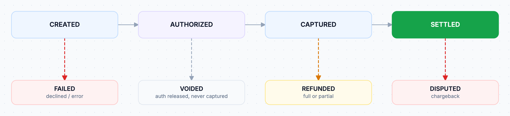

`created → authorized → captured → settled`, with `failed`, `refunded` and `disputed` branches. Only legal transitions are allowed, which prevents bugs like refunding a payment that was never captured.

### 6.4 Unknown outcomes

The PSP call times out: did it charge or not? **Don't guess.** Mark the payment `pending`, retry with the **same idempotency key** (safe), query the PSP's status, and let the webhook or reconciliation settle it.

---

## 7. Failures, scaling & monitoring

| Failure | Impact | Mitigation |
|---------|--------|------------|
| Client retries | Possible double charge | Idempotency keys end to end |
| PSP timeout | Unknown state | Pending state, same-key retry, status query, webhook |
| Webhook arrives twice or out of order | Double processing | Idempotent handler keyed by the PSP event ID; state-machine checks |
| PSP outage | Payments fail | Circuit breaker; a second PSP for failover |
| Bug in balances | Wrong money | Append-only ledger + daily reconciliation catches it |

**What to monitor:** authorization success rate per PSP and card type, pending payments older than N minutes, reconciliation mismatches (should be zero), webhook failures.

> [!IMPORTANT]
> **🏛️ Architect's lens** — Let the payment provider hold card numbers (tokenization). It shrinks your PCI compliance scope from "the whole company" to "almost nothing", which is worth more than any feature. And treat reconciliation as a product: finance teams depend on it daily.

---

## 8. Interview cheat sheet

| They ask | You answer |
|----------|------------|
| "Double click on Pay?" | "An idempotency key stored with the result; the retry returns the same response, and the same key goes to the PSP." |
| "PSP timed out?" | "Pending state, retry with the same key, query status, confirm via webhook — never guess." |
| "How do you store money?" | "Integer cents in an append-only double-entry ledger; balances are sums; fixes are new entries." |
| "How do you know nothing is lost?" | "Daily reconciliation of our ledger against the PSP settlement files." |

<p align="right"><a href="#table-of-contents">↑ Back to top</a></p>

---

# Case Study 15 · Nearby Places

**Find the best restaurants, shops or hotels near the user — like Yelp or Google Maps search**

| Difficulty | Core lessons | Building blocks |
|:----------:|--------------|-----------------|
| ⭐⭐ | Geospatial indexing · read-heavy caching · ranking by distance and quality | Geo index (geohash) · business DB · search/ranking · CDN for photos |

### 🧩 The problem this product solves

A user in a new city opens the app: "coffee near me". There are **200 million** businesses worldwide. Checking the distance to every one of them for every search is impossible (see [3.13](#313-geospatial-indexes)):

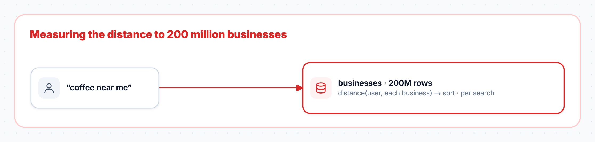

### 💡 The design in one picture

Businesses rarely move, so this is a **read-heavy** problem. Index each business by its **geohash cell**. A search looks up the user's cell and its neighbours, filters by category and "open now", and ranks the few hundred candidates by distance, rating and relevance:

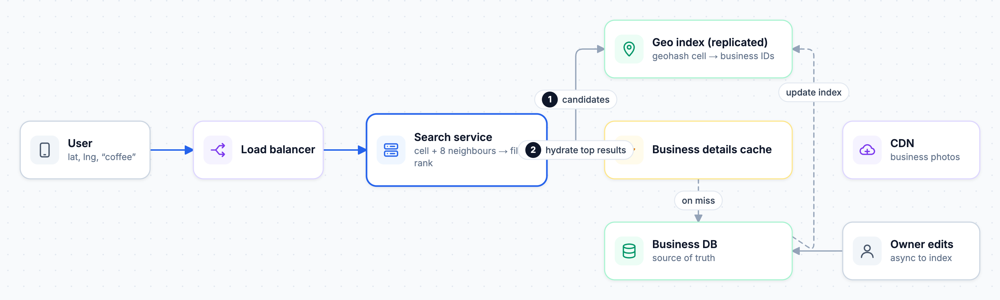

---

## 1. Requirements

**Functional**
- Search nearby by location, radius and category; view a business page with photos and reviews.
- Owners add and edit businesses; users write reviews.

**Non-functional**
| Quality | Target |
|---------|--------|
| Search latency | p99 < 200 ms |
| Freshness | New or edited businesses visible within minutes (not seconds) |
| Scale | 200M businesses, 100M daily users, ~50K searches/s at peak |

---

## 2. Estimates

| Item | Math | Result |
|------|------|--------|
| Searches | 100M users × 5/day ÷ 10⁵ | **~5K/s**, ~50K/s at peak |
| Business writes | ~1M edits/day | **~10/s** — tiny |
| Geo index | 200M × (id + geohash + category) ~50 B | **~10 GB** — fits in memory, replicated |

**So what?** 5,000 reads for every write → cache aggressively and replicate the geo index widely.

---

## 3. API

```http
GET /v1/search?lat=40.742&lng=-73.989&radius_m=1500&category=coffee&open_now=true&cursor=…
  → { "results": [ { "id": 17, "name": "…", "distance_m": 230, "rating": 4.6 } … ] }
GET /v1/businesses/{id}
POST /v1/businesses/{id}/reviews   { rating, text }
```

---

## 4. Data model

```text
businesses (business_id, name, lat, lng, geohash6, category, hours, rating_avg, rating_count)
           index (geohash6, category)
reviews    (review_id, business_id, user_id, rating, text, created_at)   -- sharded by business_id
geo index  geohash6 cell → [business_id …]   (memory / Redis GEO / Elasticsearch geo_point)
```

---

## 5. High-level design

1. The search service computes the user's **geohash cell** for the radius (longer hash = smaller cell).
2. It fetches candidates from that cell **plus its 8 neighbours** from the geo index.
3. It filters (category, open now), computes exact distances, and ranks.
4. It hydrates the top results from a business-details cache.
5. Business edits flow asynchronously into the geo index (minutes of delay are fine).

---

## 6. Deep dives

### 6.1 Choosing the cell size

Pick the geohash length whose cells roughly match the search radius (~1 km radius → 6 characters ≈ 1.2 × 0.6 km cells). If too few results come back, **expand** to the next shorter prefix (a bigger area) — a "rings" approach.

### 6.2 Ranking

Distance alone gives poor results. Combine: distance, rating (with enough reviews to trust it), relevance to the query, open now, and personalization. Keep it simple first: `score = w1·(1/distance) + w2·rating_adjusted + w3·text_match`, and tune with click data.

### 6.3 Dense cities

A Manhattan cell may contain thousands of cafés; a desert cell almost none. Use smaller cells in dense areas (quadtree or adaptive geohash length), and cache popular downtown search results for a few minutes.

---

## 7. Failures, scaling & monitoring

| Failure | Impact | Mitigation |
|---------|--------|------------|
| Geo index node down | Some searches fail | Fully replicated index; any replica can answer |
| Stale data | Old hours or closed businesses | Owner edits + user reports + periodic refresh |
| Hot area (Times Square) | Hot cells | Cache results per cell + filter for a few minutes |

**What to monitor:** search p99, zero-result rate, click-through on results, index update lag.

> [!IMPORTANT]
> **🏛️ Architect's lens** — The listing data is the product's real asset: accurate hours, locations and photos keep users coming back. Invest in data quality pipelines (owner verification, user reports, deduplicating the same business listed twice) as much as in the search engine.

---

## 8. Interview cheat sheet

| They ask | You answer |
|----------|------------|
| "How do you find nearby places?" | "Geohash index: the user's cell plus 8 neighbours, then exact distance on a few hundred candidates." |
| "Read or write heavy?" | "Heavily read-heavy — replicate the geo index and cache results; writes can be asynchronous." |
| "Not enough results?" | "Expand to a shorter geohash prefix — a larger area — until you have enough." |
| "Ranking?" | "A weighted score of distance, trusted rating and relevance, tuned with click data." |

<p align="right"><a href="#table-of-contents">↑ Back to top</a></p>

---

# Case Study 16 · Group Chat

**Real-time channels with thousands of members, presence and history — like Slack or Discord**

| Difficulty | Core lessons | Building blocks |
|:----------:|--------------|-----------------|
| ⭐⭐⭐ | Fan-out strategies by channel size · presence at scale · per-channel ordering | WebSocket gateways · channel servers · pub/sub · message store · search |

### 🧩 The problem this product solves

One-to-one chat sends each message to one person. A Discord server or big Slack channel may have **100,000 members**, and one message must reach everyone online **within a second** — while thousands of other channels do the same:

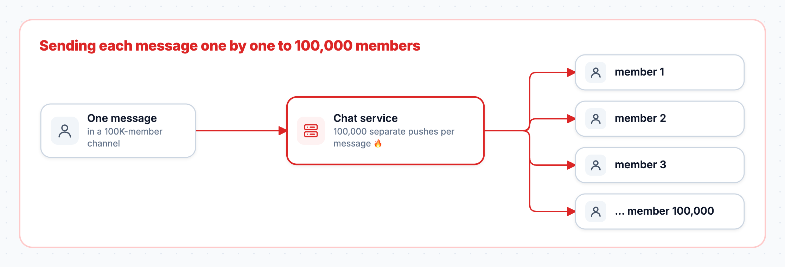

If the chat service sends 100,000 individual pushes per message, a busy channel with 10 messages per second means **a million deliveries per second** from one place — it can't keep up, and every other channel slows down.

### 💡 The design in one picture

Each gateway **subscribes to the channels its connected users are in**. A message is published **once** per channel; each subscribed gateway delivers it locally to its own users. So one message to 100,000 members becomes one publish and a few hundred gateway deliveries:

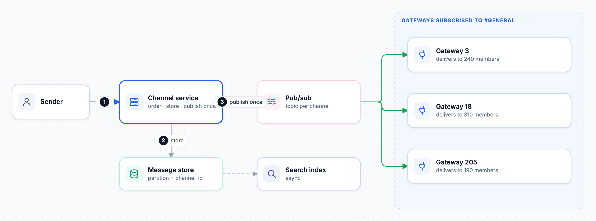

---

## 1. Requirements

**Functional**
- Workspaces/servers with channels; send, edit, delete messages; threads; reactions.
- Presence (online/away), typing indicators, unread counts, search history.

**Non-functional**
| Quality | Target |
|---------|--------|
| Latency | < 500 ms to online members |
| Ordering | Consistent order within a channel |
| Scale | Channels from 2 to 1M members; millions of concurrent connections |

---

## 2. Estimates

| Item | Math | Result |
|------|------|--------|
| Connections | 20M concurrent ÷ 50K per gateway | **~400 gateways** |
| Messages | ~100K/s written | Store partitioned by channel |
| Worst-case fan-out | 1 message × 1M members | Must avoid per-member work at send time |

---

## 3. API

```text
WebSocket: subscribe events for my channels · send { channel_id, client_msg_id, text }
HTTP:      GET /v1/channels/{id}/messages?before=…   (history, paginated)
           POST /v1/channels/{id}/read   { up_to_msg_id }   (unread tracking)
```

---

## 4. Data model

```text
channels (channel_id, workspace_id, type, member_count)
members  (channel_id, user_id, last_read_msg_id)          -- also indexed by user_id
messages (channel_id, msg_id (time-ordered), author_id, text, thread_root_id)   partition = channel_id
presence (Redis, TTL): user_id → status, last_seen
subscriptions (in each gateway, in memory): channel_id → local connections
```

---

## 5. High-level design

1. A user connects; the gateway loads their channel list and **subscribes** to those channels on the pub/sub layer.
2. Sending: the channel service assigns an ordered ID, **stores** the message, then **publishes once** to the channel topic.
3. Every gateway subscribed to that channel pushes the message to its local members.
4. Offline members get a push notification based on their settings; everyone sees unread counts computed from `last_read_msg_id`.
5. Messages stream into a **search index** asynchronously.

---

## 6. Deep dives

### 6.1 Fan-out by channel size

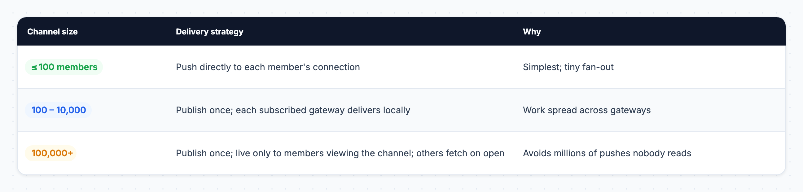

| Channel size | Strategy |
|--------------|----------|
| Small (DMs, ≤ 100) | Push directly to each member's connection |
| Medium (100 – 10K) | Publish once; subscribed gateways deliver locally |
| Huge (100K+) | Publish once; deliver lazily — clients in view get live messages, others just see "new messages" and fetch when they open the channel |

### 6.2 Presence without a storm

Naively, every status change goes to every contact — in a 100K-member server that's a flood. Instead: send presence only for members **visible on screen**, batch updates every few seconds, and let big channels show counts ("2,341 online") instead of individual statuses.

### 6.3 Unread counts

Store each member's `last_read_msg_id` per channel. The unread count is "messages after that ID", computed on demand and cached — not an incremented counter per member per message.

---

## 7. Failures, scaling & monitoring

| Failure | Impact | Mitigation |
|---------|--------|------------|
| Gateway restart | Users disconnect | Reconnect with jitter; fetch messages after the last seen ID |
| Huge channel burst | Delivery lag | Lazy delivery, rate limits for posting, slow mode |
| Pub/sub node down | Some channels stall | Replicated pub/sub; gateways resubscribe |
| Search indexing lag | New messages not searchable yet | Acceptable; monitor lag |

**What to monitor:** end-to-end delivery latency, connections per gateway, pub/sub lag, reconnect rate.

> [!IMPORTANT]
> **🏛️ Architect's lens** — Enterprise chat (Slack) sells on **search, retention and compliance** (legal holds, exports, data residency) as much as speed. Those needs shape the storage design: messages must be retained, searchable and deletable by policy.

---

## 8. Interview cheat sheet

| They ask | You answer |
|----------|------------|
| "One message to 100K members?" | "Publish once to the channel topic; each subscribed gateway delivers to its local users." |
| "Huge channels?" | "Lazy delivery — live only to members viewing the channel; others fetch on open." |
| "Presence?" | "Ephemeral in Redis with TTLs, only sent for members on screen, batched." |
| "Unread counts?" | "last_read_msg_id per member per channel; count messages after it on demand." |

<p align="right"><a href="#table-of-contents">↑ Back to top</a></p>

---

# Case Study 17 · Collaborative Editor

**Let many people edit the same document at the same time and always end up with the same text — like Google Docs**

| Difficulty | Core lessons | Building blocks |
|:----------:|--------------|-----------------|
| ⭐⭐⭐ | Operational transformation vs CRDTs · one session server per document · snapshots + operation log | WebSocket gateways · document session servers · operation log · snapshot storage |

### 🧩 The problem this product solves

Alice and Bob open the same document. Both type at the same moment. If each simply sends "here is my whole new document" and the server keeps the last one it receives:

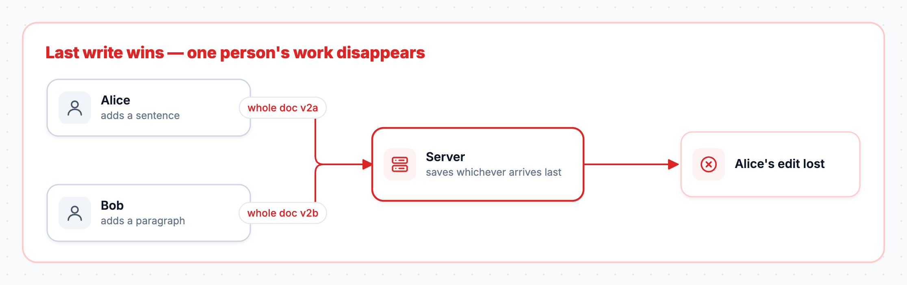

Bob's paragraph silently overwrites Alice's sentence. Even sending only the changes isn't enough: "insert 'Hi' at position 5" means something different once another person has inserted text before position 5. Without a merging strategy, copies drift apart and work is lost.

### 💡 The design in one picture

Each edit is sent as a small **operation** ("insert 'Hi' at 5"). All editors of one document connect to the **same session server**, which puts operations in one order and **transforms** conflicting ones so every copy converges to the same text. Operations are logged, and snapshots are saved regularly:

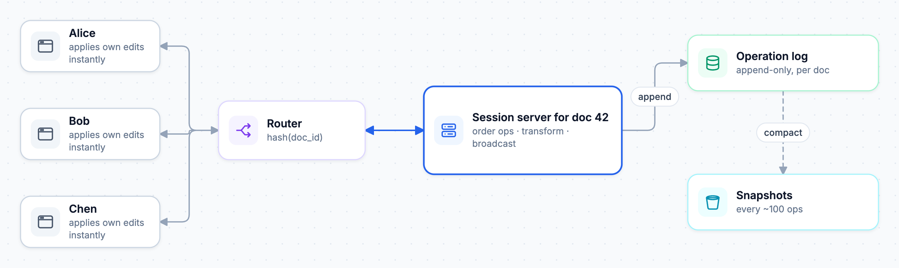

---

## 1. Requirements

**Functional**
- Real-time co-editing, live cursors of others, comments, version history, offline edits that merge later.

**Non-functional**
| Quality | Target |
|---------|--------|
| Latency | Your own typing appears instantly (local first); others' edits within ~100–200 ms |
| Convergence | Every copy ends up identical — always |
| Durability | No accepted edit is lost |
| Scale | Millions of documents; usually 1–10 editors each, sometimes 100+ |

---

## 2. Estimates

| Item | Math | Result |
|------|------|--------|
| Active docs | 5M open at once | Spread across many session servers by `doc_id` |
| Operations | ~5 ops/s per active editor | Small messages, but many of them |
| Storage | Op log grows constantly | Compact into snapshots every N operations |

---

## 3. API

```text
WebSocket  /docs/{doc_id}
  → op     { base_version: 1042, ops: [insert(5, "Hi")] }
  ← ack    { version: 1043 }
  ← remote { version: 1044, ops: [...transformed...], author }
  ↔ cursor { user, position }       (ephemeral, not stored)
HTTP  GET /v1/docs/{id}?version=…    (load snapshot + ops since)
```

---

## 4. Data model

```text
documents  (doc_id, title, owner, acl, latest_version)
op_log     (doc_id, version, op, author, timestamp)       -- append-only, partitioned by doc_id
snapshots  (doc_id, version, content)  in object storage  -- every ~100 ops or on idle
```

---

## 5. High-level design

1. Opening a document: load the latest **snapshot** plus the operations after it.
2. A router sends every editor of `doc_id` to **the same session server** (consistent hashing on `doc_id`).
3. Each client applies its own edits **immediately** (no waiting), then sends them with the version it was based on.
4. The session server orders operations, **transforms** those that were based on an older version, appends them to the **op log**, and broadcasts them to the other editors.
5. A background job writes snapshots and compacts the log.

---

## 6. Deep dives

### 6.1 OT vs CRDT

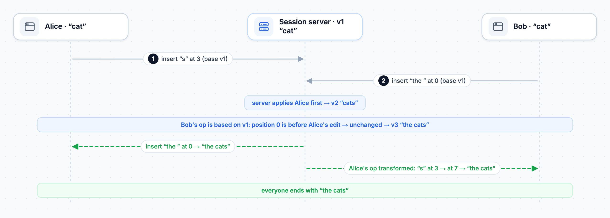

| | Operational Transformation (OT) | CRDT |
|--|----------------------------------|------|
| Idea | A central server reorders and **adjusts** conflicting operations | Data structures designed so edits **merge automatically** in any order |
| Needs a central server? | Yes (per document) | No — works peer-to-peer and offline |
| Used by | Google Docs | Figma-style tools, Automerge, Yjs, many newer editors |
| Trade-off | Simpler data, complex transform logic | Extra metadata per character; simpler networking |

Either is fine in an interview — name one and explain *why copies converge*.

### 6.2 One session server per document

Putting all editors of a document on one server gives a single place to order operations — no distributed consensus needed per keystroke. If that server dies, another loads the snapshot + log and clients reconnect.

### 6.3 Cursors and presence

Cursor positions change constantly and don't matter after a second: broadcast them over the same WebSocket, never store them.

---

## 7. Failures, scaling & monitoring

| Failure | Impact | Mitigation |
|---------|--------|------------|
| Session server crash | Editors disconnect | Reassign doc; rebuild from snapshot + log; clients resend unacknowledged ops |
| Offline editing | Divergent copies | Client keeps pending ops; transform/merge on reconnect |
| Huge document or 100+ editors | Hot session | Split large docs into sections; limit broadcast of cursors |

**What to monitor:** op round-trip latency, reconnect rate, op-log lag, snapshot age.

> [!IMPORTANT]
> **🏛️ Architect's lens** — "Local first" is the user-experience secret: typing must never wait for the network. The whole architecture — optimistic local apply, versioned ops, transforms — exists to make remote collaboration feel as fast as a local text editor.

---

## 8. Interview cheat sheet

| They ask | You answer |
|----------|------------|
| "Two people type at once?" | "Operations with base versions; the doc's session server transforms concurrent ops so all copies converge." |
| "Why one server per doc?" | "A single ordering point per document, no consensus per keystroke; route by consistent hashing on doc_id." |
| "Storage?" | "Append-only op log per doc plus periodic snapshots; load = snapshot + later ops." |
| "OT or CRDT?" | "OT with a central server is simpler to reason about; CRDTs if offline/peer-to-peer matters." |

<p align="right"><a href="#table-of-contents">↑ Back to top</a></p>

---

# Case Study 18 · E-commerce Checkout

**Turn a cart into a paid order — without overselling stock, even during a flash sale**

| Difficulty | Core lessons | Building blocks |
|:----------:|--------------|-----------------|
| ⭐⭐⭐ | Sagas across services · inventory reservation · flash-sale protection · outbox events | Cart · order · inventory · payment services · Kafka · Redis |

### 🧩 The problem this product solves

Checkout touches several systems: cart, inventory, payment, orders, shipping, email. Each is its own service with its own database. On Black Friday, 100,000 people try to buy 1,000 discounted TVs:

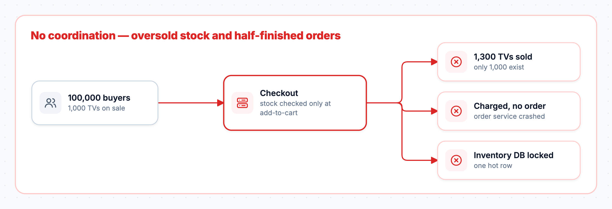

- Stock is checked at "add to cart" but not re-checked at payment → **1,300 TVs sold, 1,000 in the warehouse**.
- Payment succeeds but the order service crashes → customer charged, no order.
- The inventory database locks up under the flood.

### 💡 The design in one picture

Checkout is an **orchestrated saga** ([3.6](#36-distributed-transactions)): **reserve** stock (a short hold), **charge**, then **confirm** the order — with a compensating step for each if a later step fails. Hot items are protected with a fast atomic counter and a queue:

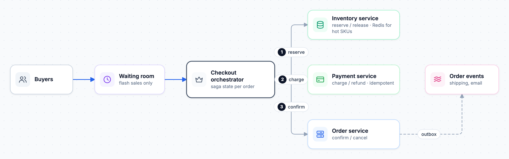

---

## 1. Requirements

**Functional**
- Cart, checkout, payment, order confirmation, cancellation and refunds; order history.

**Non-functional**
| Quality | Target |
|---------|--------|
| Correctness | Never sell more than is in stock; never charge without an order |
| Availability | Checkout is revenue — 99.99% |
| Flash sales | Survive 100× normal traffic on a few items |
| Latency | Checkout under ~2 s including payment |

---

## 2. Estimates

| Item | Math | Result |
|------|------|--------|
| Normal orders | 1M/day ÷ 10⁵ | **~10/s** |
| Flash sale | 100K buyers in 1 minute on 1,000 items | **~1,700 attempts/s** on **one row** — the real challenge |

---

## 3. API

```http
POST /v1/checkout   { cart_id, address, payment_method, idempotency_key }
  → 202 { order_id, status: "pending" }     then  GET /v1/orders/{id}  → confirmed | failed
```

---

## 4. Data model

```text
inventory    (sku, available, reserved)                     -- or a Redis counter for hot SKUs
reservations (reservation_id, order_id, sku, qty, expires_at)
orders       (order_id, user_id, status: pending|confirmed|cancelled, total, idempotency_key)
outbox       (event_id, type, payload)                      -- per service
```

---

## 5. High-level design

1. Checkout creates the order as `pending` (idempotency key prevents duplicates).
2. The **orchestrator** runs the saga:
   - **Reserve** inventory: `UPDATE inventory SET available = available - 1, reserved = reserved + 1 WHERE sku=? AND available >= 1` (with an expiry).
   - **Charge** the card via the payment service (idempotent).
   - **Confirm** the order and convert the reservation into a sale.
3. Any failure → **compensate**: release the reservation, refund, cancel the order.
4. Each step publishes events through an **outbox**; shipping and email react asynchronously.

---

## 6. Deep dives

### 6.1 The checkout saga

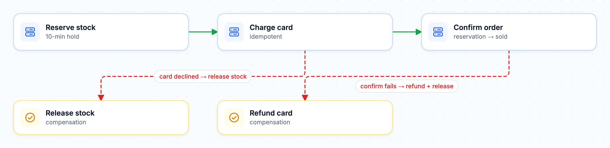

An orchestrator (e.g. Temporal, Step Functions or a state table) records where each order is, so a crash in the middle resumes rather than leaving a half-finished order.

### 6.2 Flash sales

- Keep the hot item's stock in **Redis** and decrement atomically (`DECR`, reject if below zero) — Redis handles far more than a SQL row lock.
- Put buyers in a **queue / waiting room** so the backend sees a steady flow.
- Only buyers who got a unit proceed to payment; sync the final count to the database.

### 6.3 Reservation expiry

Reservations expire (e.g. 10 minutes) so abandoned checkouts return stock. The saga must handle "payment arrived after expiry" — re-reserve if possible, otherwise refund.

---

## 7. Failures, scaling & monitoring

| Failure | Impact | Mitigation |
|---------|--------|------------|
| Payment down | Can't take money | Circuit breaker; keep cart; retry or fail clearly |
| Orchestrator crash | Stuck orders | Durable workflow state; resume from the last step |
| Duplicate submit | Two orders | Idempotency key on checkout |
| Flash traffic | Inventory hot spot | Redis counter + queue + waiting room |

**What to monitor:** checkout conversion, saga step failures, stuck pending orders, oversell count (must be zero), payment success rate.

> [!IMPORTANT]
> **🏛️ Architect's lens** — Decide with the business whether overselling is ever acceptable. Some retailers deliberately allow a small oversell and apologise (backorder), because refusing sales costs more. That's a business rule the saga must encode.

---

## 8. Interview cheat sheet

| They ask | You answer |
|----------|------------|
| "Across services?" | "An orchestrated saga: reserve → charge → confirm, with release/refund/cancel as compensations." |
| "Overselling?" | "An atomic conditional decrement on stock with an expiring reservation." |
| "Flash sale?" | "Redis atomic counter for the hot SKU, a waiting room, and async order processing." |
| "Double click?" | "Idempotency key on checkout and on the payment call." |

<p align="right"><a href="#table-of-contents">↑ Back to top</a></p>

---

# Case Study 19 · Recommendations

**Pick the handful of items each user is most likely to love, out of millions — like the YouTube home page or Amazon's "you may also like"**

| Difficulty | Core lessons | Building blocks |
|:----------:|--------------|-----------------|
| ⭐⭐⭐ | Candidate generation → ranking funnel · offline vs online computation · feature stores · feedback loops | Event stream · batch training · vector index · feature store · ranking service |

### 🧩 The problem this product solves

A video site has **100 million** videos. Showing everyone the same "most popular" list is boring and ignores what each person likes. But scoring all 100 million videos for every user on every page load is impossible:

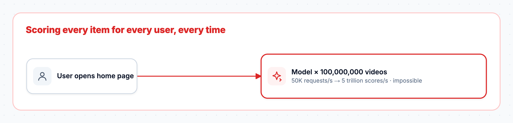

### 💡 The design in one picture

Use a **funnel**: quickly **retrieve** a few thousand plausible candidates from several sources, **rank** them with a detailed model, then **re-rank** for diversity and business rules, and return the top 20. Heavy learning happens **offline**; fast serving happens **online**:

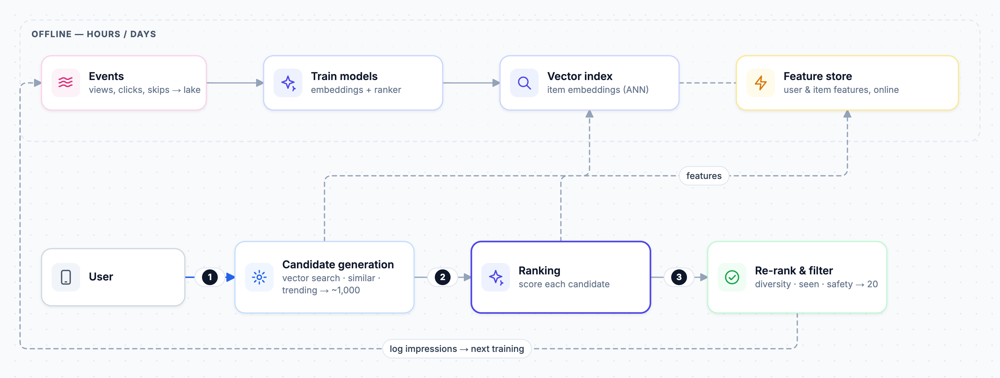

---

## 1. Requirements

**Functional**
- Personalized home feed and "more like this"; react to what the user just watched.
- Cold start: new users and new items still get sensible results.

**Non-functional**
| Quality | Target |
|---------|--------|
| Latency | < 200 ms for the whole funnel |
| Freshness | Recent actions reflected within minutes |
| Scale | 100M items, 500M users, ~50K requests/s |

---

## 2. Estimates

| Item | Math | Result |
|------|------|--------|
| Funnel sizes | 100M → ~1,000 candidates → rank → 20 | Ranking model scores ~1K items per request |
| Scoring load | 50K req/s × 1K items | **50M model scores/s** → batched inference on many servers |
| Events | 500M users × 100 events/day | **~500K events/s** into Kafka |

---

## 3. API

```http
GET /v1/recommendations?user_id=42&surface=home&limit=20
  → { "items": [ { "id": "v_981", "reason": "because you watched …" } … ], "request_id": "…" }
```

The `request_id` is logged with every impression and click, so outcomes can be tied back to what was shown.

---

## 4. Data model

```text
events         (user_id, item_id, action: view|click|like|skip, timestamp)   → Kafka → data lake
item embeddings  item_id → vector (e.g. 128 numbers)                        → vector index (ANN)
user features    user_id → recent items, interests, embedding               → feature store (online, Redis)
item features    item_id → popularity, age, quality scores                  → feature store
```

---

## 5. High-level design

**Offline (hours/days)**
1. Events flow into a data lake.
2. Train models: an **embedding model** (users and items as vectors where "close" means "similar") and a **ranking model** (predicts click/watch probability).
3. Build a **vector index** of item embeddings; compute batch features.

**Online (per request, < 200 ms)**
4. **Candidate generation** from several sources in parallel: nearest items to the user's vector, items similar to recently watched ones, trending, subscriptions.
5. **Ranking**: fetch features from the **feature store**, score ~1,000 candidates with the ranking model.
6. **Re-ranking**: remove already-seen items, add diversity, apply business and safety rules.
7. Log impressions → the next training round learns from the results.

---

## 6. Deep dives

### 6.1 The funnel

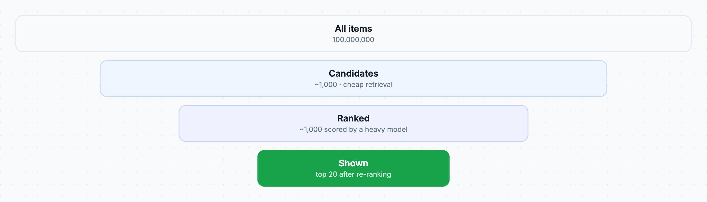

Each stage uses a more expensive model on fewer items. Cheap retrieval handles millions; the expensive ranker only sees a thousand.

### 6.2 Cold start

- **New user:** popular and trending items, location/language, and ask a few preference questions on sign-up.
- **New item:** use its content (title, category, embeddings from the video/text) and give it a little exploration traffic to learn how people react.

### 6.3 Feedback loops and exploration

If you only show what the model already likes, it never learns anything new, and popular items get more popular. Reserve a small share of slots for **exploration**, and measure changes with **A/B tests** on long-term metrics (retention), not just clicks.

---

## 7. Failures, scaling & monitoring

| Failure | Impact | Mitigation |
|---------|--------|------------|
| Ranker slow or down | Blank or slow home page | Timeout → fall back to cached or popular recommendations |
| Feature store stale | Worse relevance | Monitor feature freshness; defaults for missing features |
| Bad model deployed | Engagement drops | Shadow and canary deploys; A/B guardrail metrics |

**What to monitor:** latency per funnel stage, click-through and watch time, diversity, fallback rate, training–serving feature skew.

> [!IMPORTANT]
> **🏛️ Architect's lens** — Optimizing only for clicks can reward clickbait and hurt long-term trust. Good recommendation teams choose objectives carefully (satisfaction, retention), add safety filters, and always keep a simple non-personalized fallback so the product works even when the ML stack doesn't.

---

## 8. Interview cheat sheet

| They ask | You answer |
|----------|------------|
| "100M items per request?" | "A funnel: retrieve ~1K candidates via vector search and other sources, rank with a heavier model, re-rank, return 20." |
| "Offline vs online?" | "Train models and build indexes offline; per request only retrieval, feature lookups and scoring." |
| "Cold start?" | "Popular/trending plus content-based signals, and exploration traffic for new items." |
| "Ranker is down?" | "Time out and fall back to cached or popular items." |

<p align="right"><a href="#table-of-contents">↑ Back to top</a></p>

---

# Case Study 20 · Distributed Key-Value Store

**Build a database like DynamoDB or Cassandra: store trillions of key → value pairs across hundreds of machines, always available**

| Difficulty | Core lessons | Building blocks |
|:----------:|--------------|-----------------|
| ⭐⭐⭐ | Consistent hashing · replication with quorums · gossip · conflict resolution · LSM storage | Storage nodes · hash ring · gossip · commit log + memtable + SSTables |

### 🧩 The problem this product solves

A shopping cart service must **never** refuse a write — a customer adding an item must always work, even if servers or whole data centers fail. One database server can't hold the data, can't take all the traffic, and is a single point of failure:

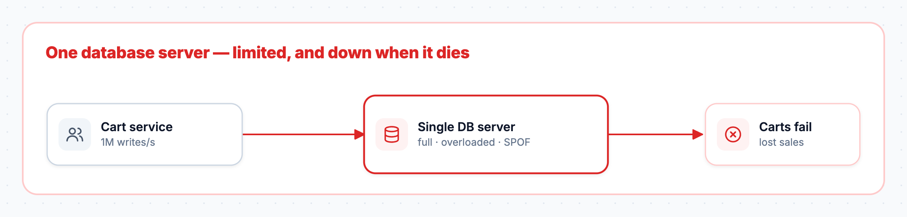

### 💡 The design in one picture

Spread keys across many nodes with a **consistent hash ring** ([3.10](#310-consistent-hashing)). Store every key on **N = 3** nodes. A write succeeds when **W** of them confirm; a read asks **R** of them. Nodes find out about each other through **gossip**, and repair each other in the background:

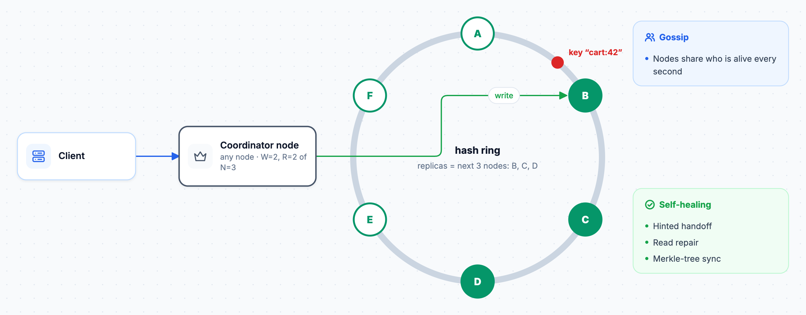

---

## 1. Requirements

**Functional**
- `put(key, value)`, `get(key)`, `delete(key)`; values up to ~1 MB.

**Non-functional**
| Quality | Target |
|---------|--------|
| Availability | Writes accepted even during node or network failures (AP by default) |
| Consistency | Tunable per request (eventual → strong) |
| Latency | Single-digit milliseconds at p99 |
| Scale | Petabytes, millions of operations/s, add nodes without downtime |

---

## 2. Estimates

| Item | Math | Result |
|------|------|--------|
| Data | 1 PB × 3 replicas | **3 PB** raw → ~300 nodes at 10 TB each |
| Traffic | 1M ops/s ÷ 300 nodes | **~3.3K ops/s per node** — comfortable |

---

## 3. API

```text
put(key, value, context?)  → ok          context carries the version (for conflict detection)
get(key, consistency=ONE|QUORUM|ALL) → value(s) + context
delete(key)                 → writes a "tombstone" marker, removed later by compaction
```

---

## 4. Data model on each node — an LSM tree

```text
write → commit log (append, on disk, for crash recovery)
      → memtable (sorted, in memory)
      → when full: flushed as an immutable SSTable file on disk
read  → memtable → Bloom filter per SSTable → the SSTables that may contain the key
background: compaction merges SSTables, drops old versions and tombstones
```

Appending instead of updating in place makes writes very fast — the reason Cassandra, RocksDB and friends use LSM trees ([3.7](#37-indexes)).

---

## 5. High-level design

1. A client sends a request to any node (the **coordinator** for that request).
2. The coordinator hashes the key onto the ring and finds the **N** replica nodes (the next N distinct nodes clockwise).
3. **Write:** send to all N, answer success after **W** acknowledgements. **Read:** ask **R** nodes, return the newest value, repair stale replicas.
4. Nodes **gossip** every second about who is alive, so every node knows the ring.

---

## 6. Deep dives

### 6.1 Quorums: tuning consistency

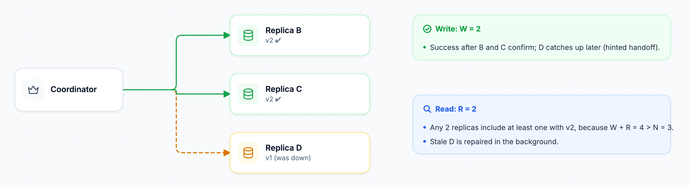

With N = 3: if **W + R > N** (e.g. W = 2, R = 2), every read overlaps at least one node that has the latest write. W = 1, R = 1 is fastest but may return stale data. Choose per use case.

### 6.2 Handling failures

- **Hinted handoff:** if a replica is down, another node stores the write with a "hint" and hands it over when the replica returns — writes never fail.
- **Anti-entropy:** replicas compare **Merkle trees** ([4.5](#45-checksums--data-integrity)) to find and fix differences efficiently.
- **Gossip + failure detection:** nodes mark peers down after missed heartbeats.

### 6.3 Conflicts

Two clients update the same cart on different replicas during a network split. Options: **last-write-wins** by timestamp (simple, may drop an update), **version vectors** that detect the conflict and return both versions for the app to merge (the Dynamo shopping-cart approach), or **CRDTs** that merge automatically.

---

## 7. Failures, scaling & monitoring

| Situation | Handling |
|-----------|----------|
| Node dies | Replicas serve; hinted handoff; re-replicate if permanent |
| Add capacity | New node takes ranges from neighbours (virtual nodes spread the load) |
| Hot key | Cache in front; split the key; spread reads across replicas |
| Datacenter loss | Replicate across DCs with per-DC quorums (LOCAL_QUORUM) |

**What to monitor:** p99 latency, pending hints, compaction backlog, disk usage per node, repair progress.

> [!IMPORTANT]
> **🏛️ Architect's lens** — In practice almost nobody builds this — you use DynamoDB, Cassandra or ScyllaDB. The interview value is showing you understand the **trade-offs** those systems made (availability over consistency, tunable quorums) so you can choose them — and configure them — wisely.

---

## 8. Interview cheat sheet

| They ask | You answer |
|----------|------------|
| "How are keys distributed?" | "A consistent hash ring with virtual nodes; each key on the next N distinct nodes." |
| "Consistency?" | "Tunable quorums — W + R > N gives read-your-latest-write; lower for speed." |
| "A replica is down?" | "Hinted handoff for writes, read repair and Merkle-tree anti-entropy to heal." |
| "Why so fast for writes?" | "LSM storage: commit log + memtable, sequential flushes to SSTables, compaction later." |

<p align="right"><a href="#table-of-contents">↑ Back to top</a></p>

---

# Case Study 21 · Unique ID Generator

**Hand out billions of unique, roughly time-ordered IDs per day across many servers — with no central bottleneck**

| Difficulty | Core lessons | Building blocks |
|:----------:|--------------|-----------------|
| ⭐⭐ | Snowflake IDs · clock issues · UUID vs sequence vs ranges | ID generator library/service · coordination for worker IDs |

### 🧩 The problem this product solves

Every tweet, order, message and payment needs a unique ID. A single database `AUTO_INCREMENT` works on one server — but once the data is sharded across many databases, each one counts from 1, and IDs collide. Sending every request to one central counter makes it a bottleneck and a single point of failure:

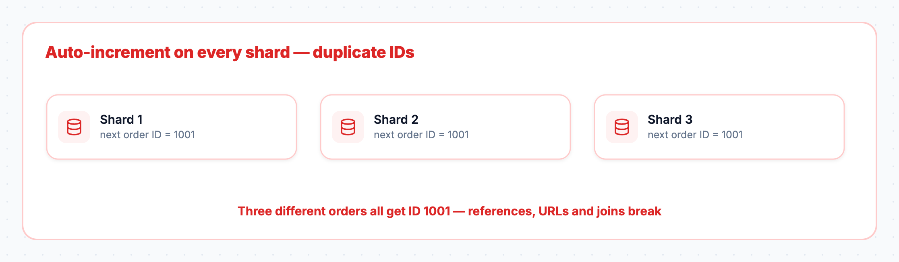

### 💡 The design in one picture

Each server generates IDs **locally** using the **Snowflake** layout: a 64-bit number made of a **timestamp**, a **machine ID** and a **sequence**. No coordination per ID, IDs sort roughly by time, and millions per second are possible:

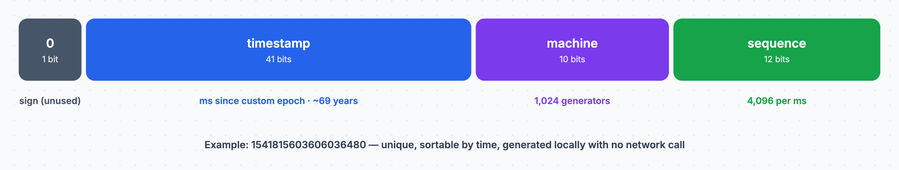

---

## 1. Requirements

| Requirement | Target |
|-------------|--------|
| Unique | Never repeat, across all servers, forever |
| Sortable | Newer IDs are larger (roughly) — useful for feeds and pagination |
| Size | Fits in 64 bits (efficient as a database key) |
| Throughput | 10K+ IDs/s per machine, no network call per ID |
| Availability | Keeps working if any other component is down |

---

## 2. Options compared

| Option | Unique? | Sortable? | Size | Problems |
|--------|:-------:|:---------:|------|----------|
| Database auto-increment | Only on one server | ✅ | 64-bit | Bottleneck; collisions after sharding |
| UUID v4 (random) | ✅ | ❌ | 128-bit | Large; random inserts fragment B-tree indexes |
| UUID v7 / ULID (time + random) | ✅ | ✅ | 128-bit | Larger than 64 bits, otherwise great |
| Range allocation (each server leases 1,000 IDs) | ✅ | Roughly | 64-bit | Needs a lease service; gaps after crashes |
| **Snowflake** | ✅ | ✅ (by time) | 64-bit | Depends on clocks; machine IDs must be unique |

---

## 3. How Snowflake works

```text
| 1 bit unused | 41 bits: milliseconds since a custom epoch | 10 bits: machine ID | 12 bits: sequence |
   41 bits of ms  ≈ 69 years
   10 bits        = 1,024 machines
   12 bits        = 4,096 IDs per millisecond per machine  (~4M/s per machine)
```

Per millisecond, a machine increments its sequence. If the sequence runs out within one millisecond, it waits for the next millisecond.

---

## 4. Deep dives

### 4.1 Assigning machine IDs

Each generator must have a unique machine ID. Assign them from configuration, or have each node grab a free ID with a lease in ZooKeeper/etcd at startup ([4.3](#43-coordination)).

### 4.2 Clocks going backwards

If NTP moves a server's clock back, it could produce an ID that was already issued. Protection: remember the last timestamp used, and if the clock is behind it, **wait** (for small jumps) or **refuse** to generate and alert (for large ones).

### 4.3 Library or service?

Usually a **library** inside each service — no network hop. A central ID service only makes sense when many languages or teams need it, and then it runs as several replicas, each with its own machine ID.

---

## 5. Interview cheat sheet

| They ask | You answer |
|----------|------------|
| "Why not auto-increment?" | "Breaks when sharded and centralizes writes." |
| "Why not UUIDs?" | "128 bits and random order hurt index locality; UUIDv7/ULID fix ordering if 128 bits is OK." |
| "Snowflake layout?" | "41-bit ms timestamp, 10-bit machine ID, 12-bit sequence — unique, sortable, local." |
| "Clock moves back?" | "Track the last timestamp; wait on small skew, refuse and alert on large skew." |

<p align="right"><a href="#table-of-contents">↑ Back to top</a></p>

---

# Case Study 22 · Distributed Job Scheduler

**Run millions of scheduled and background jobs — "send this report every Monday at 9:00", "retry this webhook in 5 minutes" — reliably and exactly on time**

| Difficulty | Core lessons | Building blocks |
|:----------:|--------------|-----------------|
| ⭐⭐⭐ | Time-partitioned scheduling · leases for exactly-one execution · retries, timeouts, dead letters | Job DB · scheduler (leader-elected or sharded) · queue · worker pools |

### 🧩 The problem this product solves

Many teams run `cron` on a single server. When that server dies, **no jobs run**. If they run cron on two servers "for safety", every job runs **twice** (see [4.3](#43-coordination)). And as jobs grow to millions, one machine can't keep up:

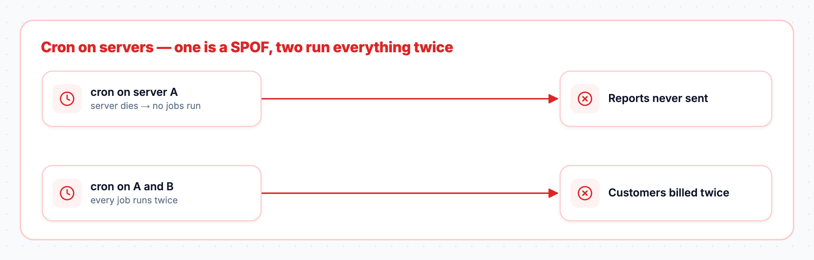

### 💡 The design in one picture

Store every job and its next run time in a database. **Schedulers** (sharded by time bucket, each shard owned by one leader) find jobs that are due and push them into a **queue**. **Workers** pull, run with a **lease** and a timeout, and report the result. Failures are retried with backoff; hopeless ones go to a **dead-letter queue**:

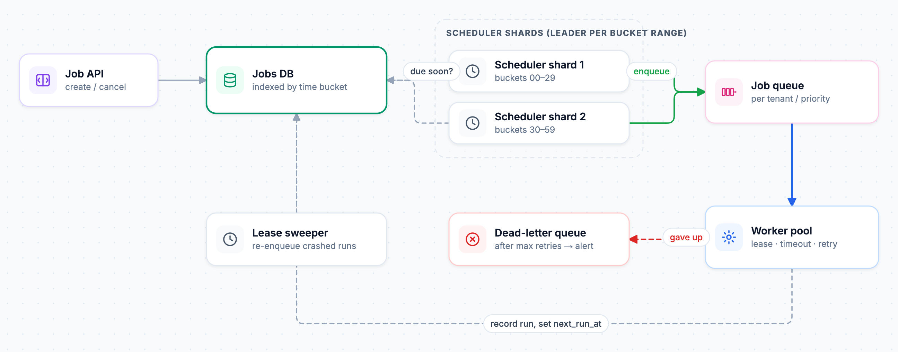

---

## 1. Requirements

**Functional**
- One-off jobs ("run at 14:05") and recurring jobs (cron expressions), with a payload and a target.
- Retries with backoff, timeouts, cancellation, run history, per-tenant limits.

**Non-functional**
| Quality | Target |
|---------|--------|
| Timeliness | Jobs start within a few seconds of their due time |
| Reliability | A due job always runs (at least once) — never silently skipped |
| Duplicates | Rare; jobs must be idempotent |
| Scale | 100M scheduled jobs; peaks of 100K due per minute (e.g. at 9:00:00) |

---

## 2. Estimates

| Item | Math | Result |
|------|------|--------|
| Due jobs | 100K at the top of the hour | **~1,700/s** burst → queue absorbs it |
| Storage | 100M jobs × 1 KB | **~100 GB** — a sharded relational or key-value store |

---

## 3. API

```http
POST /v1/jobs  { "schedule": "0 9 * * MON", "target": "https://…/report", "payload": {...},
                 "timeout_s": 300, "max_retries": 5, "idempotency_key": "…" }  → { job_id }
GET  /v1/jobs/{id}/runs     DELETE /v1/jobs/{id}
```

---

## 4. Data model

```text
jobs  (job_id, tenant_id, schedule, next_run_at, status, payload, retry_policy)
      index (time_bucket(next_run_at), job_id)        -- e.g. one bucket per minute
runs  (run_id, job_id, attempt, started_at, finished_at, status, worker_id, lease_until)
```

---

## 5. High-level design

1. Jobs are stored with `next_run_at`.
2. **Scheduler shards** each own some time buckets (assigned via leader election). Every few seconds each one queries "jobs due in the next N seconds in my buckets", marks them `enqueued`, and pushes them to the **queue**.
3. **Workers** take a job, create a `run` with a **lease** (e.g. timeout + margin), and execute it.
4. On success: record the result and compute the next `next_run_at` for recurring jobs. On failure: retry with exponential backoff; after max retries → **dead-letter queue** and alert.
5. A **sweeper** finds runs whose lease expired (worker crashed) and re-enqueues them.

---

## 6. Deep dives

### 6.1 Running each job once (enough)

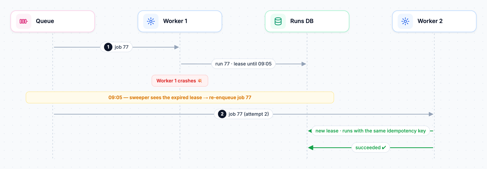

"Exactly once" isn't possible when workers can crash mid-job. The practical guarantee is **at-least-once + idempotent jobs**: the lease ensures only one worker runs a job at a time, and a crash leads to a retry, not a skip. The job itself uses an idempotency key when it does something with side effects ([4.2](#42-delivery-guarantees--idempotency)).

### 6.2 The "top of the hour" spike

Millions of jobs scheduled for 09:00:00 exactly. Spread them: enqueue a little early, add small **jitter** for jobs that don't need to-the-second accuracy, and let the queue smooth the burst to what workers can handle.

### 6.3 Fairness between tenants

One customer schedules a million jobs and starves everyone else. Use per-tenant queues or quotas and weighted fair scheduling (a bulkhead — [5.2](#52-circuit-breakers--bulkheads)).

---

## 7. Failures, scaling & monitoring

| Failure | Impact | Mitigation |
|---------|--------|------------|
| Scheduler shard leader dies | Its buckets pause | New leader elected in seconds; it catches up on overdue jobs |
| Worker crashes mid-job | Job unfinished | Lease expires → retried |
| Poison job always fails | Retries forever | Max attempts → dead-letter queue + alert |
| Queue backlog | Jobs late | Autoscale workers on queue lag |

**What to monitor:** scheduling delay (due time → start time), queue lag, failure and retry rates, DLQ size, jobs overdue.

> [!IMPORTANT]
> **🏛️ Architect's lens** — Before building this, check managed options: cloud schedulers (EventBridge Scheduler, Cloud Scheduler), workflow engines (Temporal) or a queue with delayed messages. A scheduler looks simple but its failure modes (duplicates, missed runs, clock skew) are subtle.

---

## 8. Interview cheat sheet

| They ask | You answer |
|----------|------------|
| "Why not cron?" | "A single cron box is a SPOF; two boxes run everything twice." |
| "How do jobs get picked up on time?" | "Jobs indexed by time bucket; leader-elected scheduler shards enqueue due jobs every few seconds." |
| "Worker dies mid-job?" | "Runs have leases; expired leases are re-enqueued; jobs are idempotent." |
| "Everything scheduled at 9:00?" | "Enqueue early, add jitter, let the queue smooth it, autoscale workers." |

<p align="right"><a href="#table-of-contents">↑ Back to top</a></p>

---

# Case Study 23 · Metrics & Monitoring Platform

**Collect billions of measurements per minute from every server and service, store them cheaply, and alert humans when something goes wrong — like Datadog or Prometheus + Grafana**

| Difficulty | Core lessons | Building blocks |
|:----------:|--------------|-----------------|
| ⭐⭐⭐ | Write-heavy time-series storage · downsampling · cardinality control · alerting pipelines | Agents · ingestion gateway · Kafka · time-series DB · query service · alert manager |

### 🧩 The problem this product solves

A company runs 10,000 servers and 500 services. Each emits hundreds of metrics every 10 seconds. Without a dedicated platform, teams check servers by hand, store metrics in a normal SQL database that collapses under the write load, and find out about outages from angry customers:

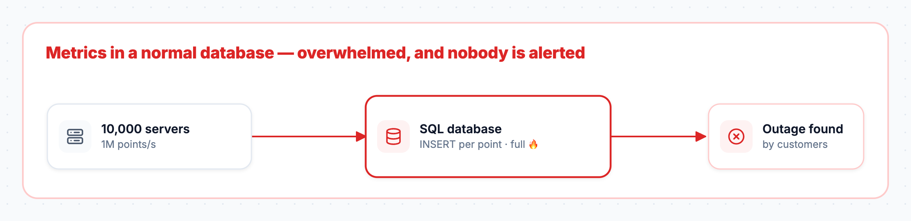

### 💡 The design in one picture

Lightweight **agents** send metrics to an **ingestion gateway**, which buffers them in **Kafka**. Writers store them in a **time-series database** built for "append numbers by time". Old data is **downsampled** (keep 1-minute averages instead of every 10-second point). A **query service** powers dashboards, and an **alert evaluator** checks rules continuously:

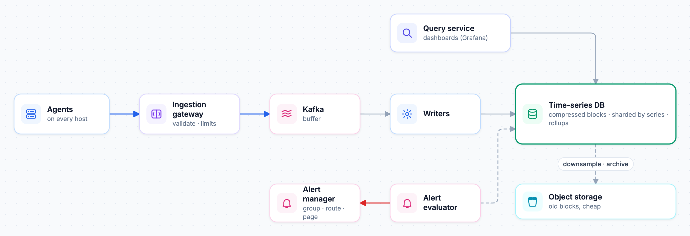

---

## 1. Requirements

**Functional**
- Ingest metrics (name + labels + value + timestamp); dashboards and ad-hoc queries; alert rules with notifications (pager, Slack, email).

**Non-functional**
| Quality | Target |
|---------|--------|
| Ingest | ~10M data points/s, never blocking the services that send them |
| Query | Dashboards load in < 1–2 s |
| Alerting | Detect and notify within ~1 minute |
| Retention | Full detail 15 days, 1-minute data 13 months, cheaply |
| Reliability | Monitoring must stay up **when everything else is down** |

---

## 2. Estimates

| Item | Math | Result |
|------|------|--------|
| Points | 10K hosts × 1,000 series ÷ 10 s | **~1M points/s** (10M with services) |
| Raw size | 10M/s × ~16 B | ~160 MB/s → compression (≈1.4 B/point) makes it **~15 MB/s** |
| Series count | hosts × metrics × label combinations | **Cardinality** is the real limit — millions of active series |

---

## 3. API

```text
POST /v1/ingest   [ { "name": "http_requests_total", "labels": {"service":"checkout","status":"500"},
                      "value": 17, "ts": 1719930000 } … ]      (batched, compressed)
GET  /v1/query?q=sum(rate(http_requests_total{status="500"}[5m])) by (service)&from=…&to=…&step=60s
```

---

## 4. Data model

```text
series  = metric name + sorted labels  → series_id        (an inverted index on labels)
samples = (series_id, timestamp, value)  in compressed time blocks (e.g. 2-hour chunks)
rollups = the same series at 1-minute and 1-hour resolution for long-range queries
```

Time-series databases compress consecutive timestamps and values extremely well (delta-of-delta, XOR encoding).

---

## 5. High-level design

1. **Agents** on each host collect and batch metrics.
2. The **ingestion gateway** validates, applies per-tenant limits, and writes to **Kafka** (so a slow database never blocks senders).
3. **Writers** consume Kafka and write into the **TSDB**, sharded by series.
4. A **downsampler** creates 1-minute and 1-hour rollups; raw data expires after the retention period, old blocks move to object storage.
5. The **query service** fans queries out to shards and merges results for dashboards.
6. The **alert evaluator** runs rules every ~30 s; firing alerts go to an **alert manager** that groups, deduplicates and routes notifications.

---

## 6. Deep dives

### 6.1 Cardinality: the silent killer

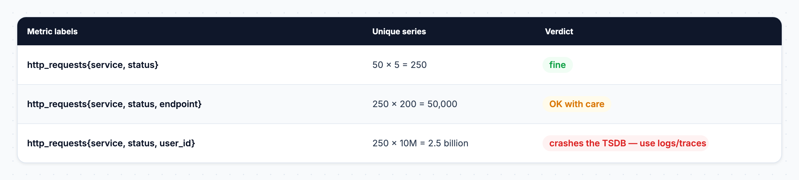

Every unique combination of labels is a separate series. Adding `user_id` as a label turns one metric into millions of series and can crash the TSDB. Enforce limits per metric/tenant, reject high-cardinality labels, and put per-user details in **logs or traces** instead ([5.4](#54-observability)).

### 6.2 Downsampling and tiers

Nobody needs 10-second resolution for last year's data. Keep raw data briefly, rollups longer, and store old blocks in cheap object storage — queries automatically pick the right resolution for the time range.

### 6.3 Alerting that people trust

Alert on symptoms and SLO burn rates ([5.3](#53-sli-slo-sla--error-budgets)), require a condition to hold for a few minutes before firing, group related alerts (one incident, one page), and route by team and severity.

---

## 7. Failures, scaling & monitoring the monitor

| Failure | Impact | Mitigation |
|---------|--------|------------|
| TSDB shard slow | Ingest lag | Kafka buffers; writers catch up |
| Ingest spike | Overload | Per-tenant limits, sampling, back-pressure to agents |
| Monitoring region down | Blind during an incident | Run monitoring **separately** from what it watches; a small external "watchdog" checks the monitor itself |

> [!IMPORTANT]
> **🏛️ Architect's lens** — Observability costs can grow faster than the product itself. Set budgets per team, charge back usage, and keep label cardinality under control. Also: never host your only monitoring inside the system it monitors — it will go dark exactly when you need it.

---

## 8. Interview cheat sheet

| They ask | You answer |
|----------|------------|
| "Why not a SQL database?" | "Millions of appends per second by time — a TSDB compresses and scans that far better." |
| "How do you absorb spikes?" | "Kafka between ingestion and storage; per-tenant limits." |
| "Old data?" | "Downsample to 1-minute and 1-hour rollups; move old blocks to object storage." |
| "Biggest risk?" | "Label cardinality — limit it and keep per-user detail in logs/traces." |

<p align="right"><a href="#table-of-contents">↑ Back to top</a></p>

---

# Case Study 24 · Live Streaming

**Broadcast one live video to millions of viewers with only a few seconds of delay — like Twitch or YouTube Live**

| Difficulty | Core lessons | Building blocks |
|:----------:|--------------|-----------------|
| ⭐⭐⭐ | Real-time ingest and transcoding · latency vs quality · CDN fan-out · live chat at scale | Ingest servers (RTMP/SRT) · live transcoders · packager · CDN · chat service |

### 🧩 The problem this product solves

A streamer goes live and **2 million** people join within minutes. Unlike on-demand video ([Case Study 08](#case-study-08--video-streaming)), there's no time to prepare: every second of video must be received, converted and delivered **while it's happening**. Sending the stream from one server to every viewer is impossible:

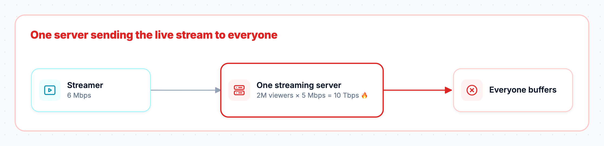

### 💡 The design in one picture

The streamer sends one high-quality stream to a nearby **ingest server**. **Live transcoders** create several qualities in real time, a **packager** cuts them into 1–2 second segments, and a **CDN** fans them out to millions of viewers. Chat runs as a separate real-time system:

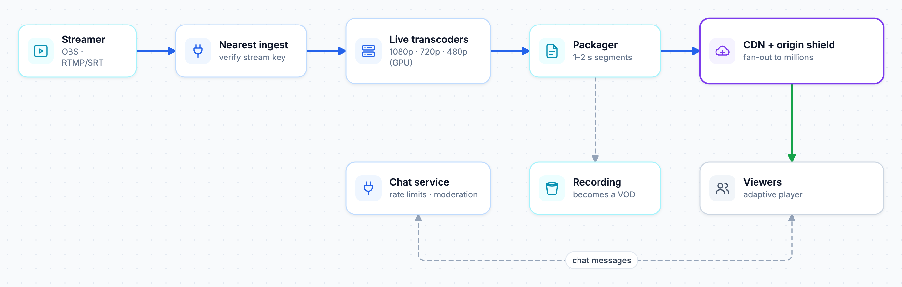

---

## 1. Requirements

**Functional**
- Go live from OBS/phone; watch on any device with adaptive quality; live chat; save the stream as a video afterwards.

**Non-functional**
| Quality | Target |
|---------|--------|
| Latency (glass-to-glass) | ~2–10 s standard; < 1 s for interactive modes |
| Smoothness | Minimal rebuffering |
| Scale | 100K concurrent streams; a single stream up to millions of viewers |

---

## 2. Estimates

| Item | Math | Result |
|------|------|--------|
| Popular stream | 2M viewers × 5 Mbps | **~10 Tbps** — only a CDN can do this |
| Ingest | 100K streams × 6 Mbps | ~600 Gbps into ingest servers worldwide |
| Transcoding | 100K streams × 4 renditions in real time | Large GPU/CPU fleet; transcode only popular streams fully |

---

## 3. API

```text
Streamer: rtmp(s)://ingest.example.com/live/{stream_key}   (or SRT / WebRTC)
Viewer:   GET https://cdn.example.com/live/{channel}/master.m3u8  → then short segments
Chat:     WebSocket  wss://chat.example.com/{channel}
```

---

## 4. Data model

```text
channels (channel_id, owner, stream_key_hash, status: offline|live, current_session)
sessions (session_id, channel_id, started_at, ingest_node, renditions)
segments in object storage/CDN:  live/{channel}/{rendition}/seg_N.ts  (short TTL; kept for VOD replay)
chat: partitioned by channel_id; ephemeral fan-out + short retention
```

---

## 5. High-level design

1. The streamer connects to the **nearest ingest point** (anycast/GeoDNS); the stream key is verified.
2. **Live transcoders** produce 1080p/720p/480p/160p in real time (GPU-accelerated).
3. The **packager** outputs 1–2 s segments and a constantly updated manifest (Low-Latency HLS/DASH).
4. The **CDN** caches each new segment at the edge the first time it's requested and serves millions of viewers; an **origin shield** protects the packager.
5. Viewers' players fetch the manifest and segments, switching quality as needed.
6. **Chat** is a group-chat system ([Case Study 16](#case-study-16--group-chat)) with rate limits and moderation.
7. Segments are also written to storage so the stream becomes a normal video afterwards.

---

## 6. Deep dives

### 6.1 Latency vs smoothness

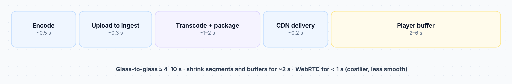

Every stage adds delay: encoding, segment length, CDN, and the player's buffer. Shorter segments and smaller buffers mean lower latency but more risk of stutter. Offer a "low latency" mode for interactive streams and a more buffered mode for big events.

### 6.2 Flash crowds

A famous streamer goes live and a million viewers arrive at once — all requesting the **same newest segment** at the same moment. The CDN's request collapsing (one origin fetch per edge per segment) and an origin shield prevent the origin from being overwhelmed.

### 6.3 Chat at 2 million viewers

Nobody can read 50,000 messages per second. Sample or slow down chat ("slow mode"), rate-limit per user, filter spam with automated moderation, and deliver messages in batches every few hundred milliseconds.

---

## 7. Failures, scaling & monitoring

| Failure | Impact | Mitigation |
|---------|--------|------------|
| Ingest server dies | Stream drops | Streamer software reconnects to another ingest node automatically |
| Transcoder overloaded | Missing qualities | Pass through the original quality; prioritize popular streams |
| CDN region issue | Viewers buffer | Multi-CDN with player failover |

**What to monitor:** glass-to-glass latency, rebuffer ratio, ingest drops, segment publish delay, concurrent viewers per stream.

> [!IMPORTANT]
> **🏛️ Architect's lens** — Most live streams have only a handful of viewers. Transcoding every stream into many qualities wastes a fortune; transcode fully only when a stream gets popular, and serve the original quality to small audiences.

---

## 8. Interview cheat sheet

| They ask | You answer |
|----------|------------|
| "How is it different from VOD?" | "Everything happens in real time: ingest → live transcode → 1–2 s segments → CDN, no time to pre-process." |
| "Millions of viewers?" | "CDN fan-out with request collapsing and an origin shield." |
| "Lower the delay?" | "Shorter segments, low-latency HLS/DASH or WebRTC, smaller player buffers — at the cost of smoothness." |
| "Chat?" | "A separate pub/sub chat system with rate limits, slow mode and batched delivery." |

<p align="right"><a href="#table-of-contents">↑ Back to top</a></p>

---

# Case Study 25 · Food Delivery

**Connect hungry customers, busy restaurants and moving couriers — and show a live, accurate delivery time — like DoorDash or Uber Eats**

| Difficulty | Core lessons | Building blocks |
|:----------:|--------------|-----------------|
| ⭐⭐⭐ | Three-sided marketplace · order state machine · courier dispatch · live ETA and tracking | Order service · restaurant app · dispatch · location service · notifications |

### 🧩 The problem this product solves

Food delivery combines three groups that must stay in sync: a customer who wants hot food fast, a restaurant with its own kitchen timing, and a courier who is moving around the city. Coordinating them with phone calls and guesses goes wrong constantly:

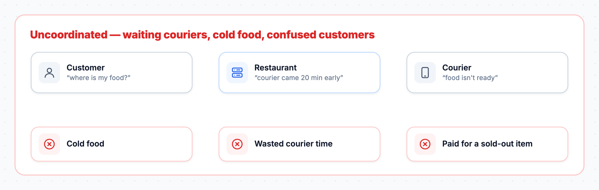

- The courier arrives 20 minutes before the food is ready (wasted time) — or 20 minutes after (cold food).
- The customer has no idea where the order is.
- A restaurant is out of an item, but the order was already paid.

### 💡 The design in one picture

An **order service** drives a clear **state machine**. Restaurants confirm and report prep time on a tablet app. **Dispatch** assigns a courier timed to arrive when the food is ready, using the courier **location service** (like ride sharing — [Case Study 07](#case-study-07--ride-sharing)). Everyone sees live updates:

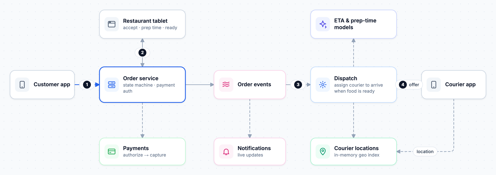

---

## 1. Requirements

**Functional**
- Browse restaurants and menus, order and pay, restaurant confirms, courier assigned, live tracking, delivery, ratings.

**Non-functional**
| Quality | Target |
|---------|--------|
| ETA accuracy | Delivery estimate within a few minutes, updated live |
| Reliability | Orders never lost; payments correct |
| Scale | 5M orders/day, peaks at lunch and dinner (3–5× average) |
| Freshness | Menus and availability current (sold-out items hidden quickly) |

---

## 2. Estimates

| Item | Math | Result |
|------|------|--------|
| Orders | 5M/day, ~40% in 4 peak hours | **~140 orders/s** at peak |
| Courier locations | 500K couriers ÷ 5 s | **~100K updates/s** — in-memory geo index |
| Menu reads | Many browses per order | Cache menus heavily (CDN + Redis) |

---

## 3. API

```http
GET  /v1/restaurants?lat=…&lng=…           (nearby, open, with delivery ETA)
POST /v1/orders  { restaurant_id, items, address, payment_method, idempotency_key }
GET  /v1/orders/{id}  + live updates (WebSocket/SSE): status, courier position, ETA
Restaurant app:  POST /v1/orders/{id}/accept { prep_minutes }   ·   POST …/ready
Courier app:     location stream · POST /v1/deliveries/{id}/pickup · …/deliver
```

---

## 4. Data model

```text
restaurants (id, location, hours, avg_prep_time)     menus (restaurant_id, item, price, available)
orders      (order_id, customer_id, restaurant_id, status, items, total, placed_at, eta)
deliveries  (delivery_id, order_id, courier_id, status, pickup_eta, dropoff_eta)
couriers    (courier_id, status, current_delivery)   locations: in-memory geo index (H3)
```

---

## 5. High-level design

1. The customer browses restaurants (geo search — [Case Study 15](#case-study-15--nearby-places)) and places an order; payment is **authorized**, not yet captured ([Case Study 14](#case-study-14--payments)).
2. The restaurant tablet shows the order; the restaurant **accepts** with a prep time (or rejects → the authorization is voided).
3. **Dispatch** plans a courier so they arrive **when the food is ready**: estimated ready time − courier travel time = when to assign.
4. The courier picks up, then delivers; each step updates the order state and pushes notifications.
5. On delivery, payment is **captured** and the courier and restaurant payouts are recorded in the ledger.

---

## 6. Deep dives

### 6.1 The order state machine

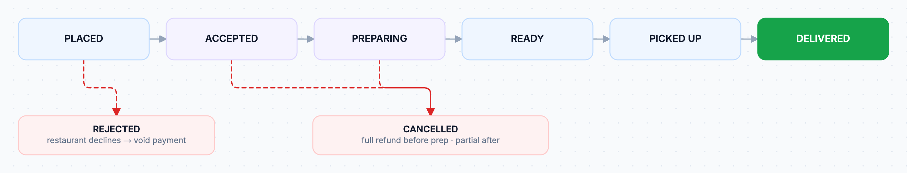

Clear states make every system agree on "where is this order", drive notifications, and decide what cancellation means at each point (full refund before the kitchen starts, partial after).

### 6.2 Dispatch timing and batching

Assigning the nearest courier immediately often wastes their time at the restaurant. Better: predict ready time from the restaurant's history and current load, and assign so arrival matches it. Couriers can also **batch** two orders from the same restaurant or along the same route.

### 6.3 ETA prediction

ETA = restaurant prep time + courier travel to the restaurant (if not already there) + travel to the customer. Each part is predicted from historical data (per restaurant, time of day, weather, traffic) and updated live as events happen.

---

## 7. Failures, scaling & monitoring

| Failure | Impact | Mitigation |
|---------|--------|------------|
| Restaurant doesn't respond | Order stuck | Timeout → call/alert the restaurant → auto-cancel and void payment |
| Courier cancels | Delay | Re-dispatch automatically; update ETA |
| Dinner peak | Overload | Scale stateless services; surge-based courier incentives; per-city sharding |
| Item sold out after order | Unhappy customer | Restaurant marks items unavailable in real time; offer substitution or partial refund |

**What to monitor:** order-to-accept time, ETA error, courier idle time at restaurants, late deliveries, cancellation rate per stage.

> [!IMPORTANT]
> **🏛️ Architect's lens** — The profit of a delivery business lives in **courier efficiency** (deliveries per hour) and **ETA accuracy** (customer trust). That's why dispatch and ETA prediction get dedicated data-science teams, and why every state change is logged as data for improving them.

---

## 8. Interview cheat sheet

| They ask | You answer |
|----------|------------|
| "How do the three sides stay in sync?" | "An order state machine in the order service; every transition emits events that update apps and notifications." |
| "When do you assign a courier?" | "So arrival matches predicted food-ready time, not immediately — using ETA and prep-time predictions." |
| "Payment?" | "Authorize on order, capture on delivery, void if the restaurant rejects." |
| "Live tracking?" | "Courier locations in an in-memory geo index; pushed to the customer over WebSocket/SSE." |

<p align="right"><a href="#table-of-contents">↑ Back to top</a></p>

---

# Chapter 09 · Practice

**Knowledge gets you to the interview; practice gets you through it**

---

### In this chapter

| # | Lesson | You will be able to… |
|---|--------|----------------------|
| 9.1 | [Why practice matters](#91-why-practice-matters) | Understand the gap between knowing and performing |
| 9.2 | [Study plans](#92-study-plans) | Follow a 2-, 4- or 8-week schedule |
| 9.3 | [Timed drills](#93-timed-drills) | Practise under real interview conditions |
| 9.4 | [30 practice prompts](#94-30-practice-prompts) | Pick a prompt at the right level, with hints |
| 9.5 | [Self-review](#95-self-review) | Turn every drill into a concrete improvement |
| 9.6 | [Mock interview rubric](#96-mock-interview-rubric) | Score yourself the way interviewers do |

---

## 9.1 Why practice matters

> **In one sentence:** Reading about system design builds **knowledge**; practising out loud under a timer builds **performance** — and the interview only measures performance.

### 🧩 The problem: "I understood everything, then froze"

Many people read every chapter, nod along to every case study — and then, in a real interview, stare at a blank whiteboard. Reading is recognition ("yes, that makes sense"). An interview needs **recall** ("what do I draw next?") while talking, under time pressure, with someone watching.

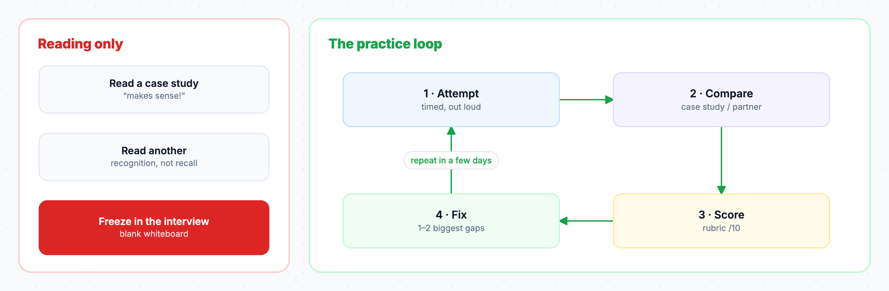

### 💡 The idea: a practice loop

1. **Attempt** a prompt from scratch, timed, speaking out loud.
2. **Compare** with a case study or a partner's feedback.
3. **Score** yourself with the rubric (9.6).
4. **Fix** the one or two biggest gaps.
5. **Repeat** the same prompt a few days later — then move on.

---

## 9.2 Study plans

> **In one sentence:** Consistency beats intensity — an hour a day for four weeks beats two exhausting weekends.

### 2-week crash plan (you already code professionally)

| Day | Focus |
|-----|-------|
| 1 | Chapter 00 + Chapter 07 (the framework) |
| 2 | Chapter 01 Networking + Chapter 02 Traffic & edge |
| 3 | Chapter 03 Data (3.1–3.8) |
| 4 | Chapter 03 Data (3.9–3.13) + Chapter 04 Async |
| 5 | Chapter 05 Reliability + Chapter 06 Architecture & security |
| 6 | Timed drill: URL shortener; compare with Case Study 01 |
| 7 | Rate limiter + Notification system |
| 8 | News feed + Chat |
| 9 | Photo sharing + Ride sharing |
| 10 | Video streaming + File sync |
| 11 | Ticket booking + Payments |
| 12 | Two timed drills from 9.4 (unseen prompts) |
| 13 | Fix your weakest topics |
| 14 | Full mock with a partner; rest |

### 4-week standard plan

| Week | Focus |
|------|-------|
| 1 | Chapters 00–03. Answer every "Questions & answers" section out loud. |
| 2 | Chapters 04–07. Timed drills: URL shortener, rate limiter, typeahead. |
| 3 | Case studies 03–13. One timed drill every other day. |
| 4 | Case studies 14–25 + three full mocks with the rubric. |

### 8-week thorough plan

- **Weeks 1–2:** all foundations (Chapters 00–06), plus small hands-on labs (below).
- **Weeks 3–4:** Chapter 07 + ⭐ and ⭐⭐ case studies, each attempted before reading.
- **Weeks 5–6:** ⭐⭐⭐ case studies and failure-focused drills.
- **Week 7:** 15–20 prompts from 9.4, 30–45 minutes each.
- **Week 8:** a mock every other day, light review in between.

### Hands-on labs that make ideas stick

| Lab | Time | What you'll understand for real |
|-----|------|---------------------------------|
| Run Postgres, add an index, compare `EXPLAIN ANALYZE` before and after | 1–2 h | Indexes ([3.7](#37-indexes)) |
| Build a token-bucket rate limiter with a Redis Lua script | 2 h | Rate limiting, atomicity ([2.4](#24-rate-limiting)) |
| Put Redis cache-aside in front of a slow endpoint; measure hit ratio | 2 h | Caching ([2.5](#25-caching)) |
| Produce 10,000 messages; kill a consumer mid-way; prove no duplicates using a dedupe table | 3 h | At-least-once + idempotency ([4.2](#42-delivery-guarantees--idempotency)) |
| Load-test an API with k6; watch p99 rise as you add latency | 1 h | Latency percentiles ([0.6](#06-the-seven-qualities)) |

---

## 9.3 Timed drills

> **In one sentence:** Practise exactly like the real thing — a timer, a blank page, one prompt, and your voice.

### Setup

- A visible timer, blank paper or a whiteboard tool (Excalidraw works well).
- One prompt from 9.4. **No notes** on the first attempt.
- Speak out loud, even alone. Silence hides confusion.
- Optional: record audio — you'll hear skipped steps and filler words immediately.

### Drill formats

| Format | Time | Use it for |
|--------|------|-----------|
| Sprint | 20–25 min | Clarify + estimates + high-level design only |
| Standard | 45 min | The full 7-step framework |
| Senior | 60 min | Full framework + two deep dives + failures |

### The 45-minute script

| Minutes | Step |
|---------|------|
| 0–5 | Clarify and restate the problem |
| 5–8 | Estimates → what they imply |
| 8–12 | API |
| 12–17 | Data model |
| 17–27 | High-level design: write path, then read path |
| 27–39 | Deep dive on the hardest part |
| 39–45 | Failures, 10× scale, monitoring, summary |

If you reach minute 20 without a diagram, cut the details and draw.

### Interruptions for a practice partner to throw in

- "Reads must now be strongly consistent — what changes?"
- "Traffic just grew 20×. What breaks first?"
- "You can't use Redis. What instead?"
- "That service is down. What does the user see?"
- "The CEO wants a second region next quarter. Sketch the path."

---

## 9.4 30 practice prompts

> **In one sentence:** Attempt each prompt **before** reading its hints; the hints are a checklist of what a strong answer covers.

### ⭐ Warm-up

| # | Prompt | Hints (read after your attempt) |
|---|--------|--------------------------------|
| 1 | Pastebin / code-snippet sharing | Expiry via TTL + cleanup job · size limits · object storage for large pastes · CDN for public ones · abuse scanning |
| 2 | URL shortener for a company with SSO | Custom domains · auth on create · audit logs · no enumeration · 301 vs 302 |
| 3 | Unique ID service for a sharded database | Snowflake layout · machine-ID assignment · clock skew · 64-bit vs 128-bit |
| 4 | Link preview ("unfurl") service | Fetch with timeouts · **SSRF protection** (block private IPs) · cache previews · size limits |
| 5 | Feature-flag service | Very fast reads · local caching in SDKs · consistent user bucketing · audit trail · safe default when the service is down |

### ⭐⭐ Core

| # | Prompt | Hints |
|---|--------|-------|
| 6 | Global rate limiter as a platform service | Token bucket · Redis Cluster + Lua · per-tenant rules · fail-open vs closed · local fallback |
| 7 | Email + push notification center | Preferences · quiet hours · templates · priority lanes · provider failover · dedupe |
| 8 | News feed with ads | Hybrid fan-out · ad service latency budget · fallback without ads · privacy |
| 9 | Group chat for 10–10,000 members | Gateways + pub/sub · fan-out strategy by size · history by channel · reconnect by last seen ID |
| 10 | Photo-sharing MVP | Signed uploads · async resizing · CDN · strip GPS metadata · feed reuse |
| 11 | Autocomplete for an online store | Trie + top-k · inventory filters · edge cache · personalization re-rank |
| 12 | Help-center search | Inverted index · CDC from the CMS · synonyms · permission filtering |
| 13 | Web crawler for product prices | Politeness · robots.txt · priority frontier · change detection · anti-bot measures |
| 14 | Leaderboard for a mobile game | Redis sorted sets · sharding by region/season · rank near me · anti-cheat |
| 15 | Parking-lot reservation system | Spot inventory per time slot · holds with expiry · payment · no-shows |

### ⭐⭐⭐ Advanced

| # | Prompt | Hints |
|---|--------|-------|
| 16 | Ride matching for one city | Location stream in memory · H3 cells · ETA ranking · atomic driver lock |
| 17 | Food-delivery tracking | Order state machine · courier locations · ETA models · push updates |
| 18 | YouTube-style video on demand | Chunked parallel transcoding · ABR · CDN cost · processing status |
| 19 | Twitch-style live streaming | Ingest · live transcoding · short segments · CDN fan-out · chat at scale |
| 20 | Dropbox with selective sync | Content-hashed chunks · dedupe · journal + cursors · conflicted copies |
| 21 | Hotel booking | Room inventory per night · date-range holds · overbooking policy · search vs booking path |
| 22 | Concert ticket on-sale | Waiting room · atomic seat holds · bot limits · idempotent checkout |
| 23 | Merchant payments + payouts | Idempotency keys · double-entry ledger · webhooks · payout batching · reconciliation |
| 24 | Stock-exchange order matching | Order book per symbol in memory · single-threaded matcher per symbol · write-ahead log · very low latency |
| 25 | Distributed key-value store | Consistent hashing · N/W/R quorums · hinted handoff · LSM storage |
| 26 | Metrics & alerting platform | Kafka buffer · time-series DB · downsampling · cardinality limits · alert routing |
| 27 | Multi-tenant job scheduler | Time buckets · leases · retries + DLQ · per-tenant fairness |
| 28 | Google Docs–style editor | OT or CRDT · one session server per doc · op log + snapshots |
| 29 | TikTok-style "For You" feed | Upload + transcode · candidate generation → ranking · fast scrolling prefetch |
| 30 | Distributed cache (like Memcached/Redis Cluster) | Consistent hashing · replication · eviction · hot keys · failover |

### Make any prompt harder

- "Now it must run in **two regions**, active-active."
- "Reads must be **strongly consistent**."
- "**Cut the budget in half** — what do you drop?"
- "Data must **stay in the EU**."
- "Traffic grows **100×** overnight."

---

## 9.5 Self-review

> **In one sentence:** Review every drill within 15 minutes, while you still remember where you hesitated — an unreviewed mock teaches very little.

### Right after the drill, write down

- Where did you hesitate or go silent?
- Which buzzword couldn't you explain?
- What did you forget: clarifying, numbers, data model, failures?

### Content gaps vs delivery gaps

| Content gap (didn't know) | Delivery gap (knew, but didn't show it) |
|---------------------------|------------------------------------------|
| Didn't know how quorums work | Knew it but never said it |
| Chose a bad shard key | Good design, ran out of time |
| Forgot idempotency | Talked past the interviewer's hints |

Fix **content** gaps by re-reading the lesson. Fix **delivery** gaps with more timed drills and a partner who interrupts.

### The redraw test

A few days later, redraw the design from a blank page in 8 minutes. If you can't, it isn't yours yet — repeat the drill.

### Keep a "miss list"

Short phrases you tend to forget under pressure: *idempotency key*, *signed URL*, *hybrid fan-out*, *fail open or closed?*, *what's the shard key?*. Review it before every mock.

---

## 9.6 Mock interview rubric

> **In one sentence:** Score each of five areas from 0 to 2 — a total of 7+ out of 10 across several different prompts means you're ready.

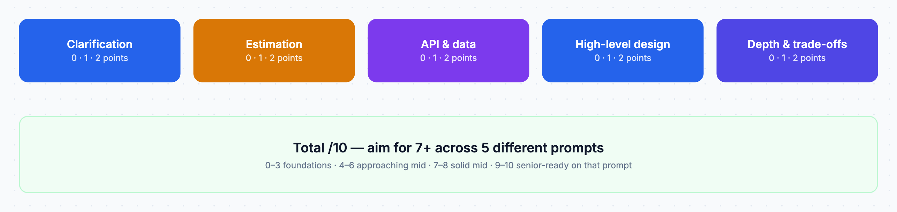

| Area | 0 — weak | 1 — partial | 2 — strong |
|------|----------|-------------|------------|
| **Clarification & scope** | Jumps into technology | Some questions, vague requirements | Clear functional + non-functional requirements as numbers, out-of-scope agreed, problem restated |
| **Estimation** | None or nonsensical | Numbers without conclusions | Order of magnitude **and** what it means for the design |
| **API & data model** | Missing | Vague entities | Concrete endpoints; keys, indexes and shard key match the queries |
| **High-level design** | Random boxes | Plausible but a path is missing | Clear write and read paths, right building blocks, readable board |
| **Depth & trade-offs** | Buzzwords | One shallow deep dive | Real options compared, justified choice, failures and scaling covered |

| Total | What it suggests |
|-------|------------------|
| 0–3 | Go back to the foundations (Chapters 00–06) |
| 4–6 | Approaching mid-level; practise more full drills |
| 7–8 | Solid mid-level |
| 9–10 | Senior-ready — **on that prompt**; check across 5+ different prompts |

### Feedback script for practice partners

1. Start with one real strength.
2. Name the two biggest gaps, pointing at the board.
3. Ask the candidate to re-explain the weak part in 3 minutes.
4. Coach with questions — don't redesign it for them.

### Score sheet

```text
Prompt:                         Date:
Clarification & scope:   /2
Estimation:              /2
API & data model:        /2
High-level design:       /2
Depth & trade-offs:      /2
Total:                   /10
Biggest gap:
Next drill:
```

> [!TIP]
> **🎤 Final advice** — In the real interview, glance at the clock at minutes 15 and 30. Managing your own time is itself a senior signal. And remember: the interviewer wants you to succeed — treat them as a teammate, think out loud, and enjoy designing.

<p align="right"><a href="#table-of-contents">↑ Back to top</a></p>

---

## ⚡ One-page cheat sheet

A one-page summary of the whole guide. Use it to review before practice or an interview — each line links back to the full lesson.

### The 7-step framework (45 minutes)


| Step | Minutes | Goal |
|------|:-------:|------|
| 1. Clarify | 5 | Features, users, scale, NFRs as numbers, out of scope |
| 2. Estimate | 3 | Read/write QPS, storage, bandwidth → *what it implies* |
| 3. API | 4 | 3–6 endpoints with inputs and outputs |
| 4. Data model | 5 | Entities, keys, indexes, which store and why |
| 5. High-level design | 10 | Boxes left → right; write path, then read path |
| 6. Deep dive | 12 | 1–2 hard parts: options, trade-offs, a decision |
| 7. Wrap up | 6 | Failures, 10× scale, monitoring, summary |

### Which building block solves which problem?

| Problem | Reach for | Lesson |
|---------|-----------|--------|
| One server can't handle the traffic | Load balancer + stateless servers | [2.1](#21-load-balancing) |
| The database is drowning in reads | Cache, read replicas | [2.5](#25-caching) · [3.8](#38-replication) |
| Images and video load slowly worldwide | CDN + object storage | [2.7](#27-cdn) |
| One database can't take all the writes | Sharding | [3.9](#39-sharding) |
| Slow work blocks user requests | Queue + workers | [4.1](#41-messaging) |
| Retries cause double charges | Idempotency keys | [4.2](#42-delivery-guarantees--idempotency) |
| A slow dependency takes everything down | Timeouts, circuit breakers, bulkheads | [5.2](#52-circuit-breakers--bulkheads) |
| One client floods the API | Rate limiting | [2.4](#24-rate-limiting) |
| Users need live updates | SSE or WebSockets + pub/sub | [1.7](#17-real-time-communication) |
| "Find things near me" | Geohash / quadtree index | [3.13](#313-geospatial-indexes) |
| A business action spans several services | Saga + outbox | [3.6](#36-distributed-transactions) |
| Full-text search | Inverted index (Elasticsearch) | [Case study 12](#case-study-12--search-engine) |

### Numbers worth memorizing

| Fact | Approximation |
|------|---------------|
| Seconds in a day | ~10⁵ → **1M requests/day ≈ 12/s** |
| RAM read vs cross-ocean round trip | ~100 ns vs ~150 ms |
| Redis GET (same zone) | ~0.3 ms |
| Indexed database query | ~1–5 ms |
| 99.9% availability | ~43 minutes of downtime a month |
| 99.99% availability | ~4.4 minutes a month |
| 1 Gbps | ~125 MB/s |

More in [0.7 Numbers every engineer should know](#07-numbers-every-engineer-should-know).

### Sentences that score in interviews

- "Given our requirement of **X**, I'd choose **A** over **B**. The cost is **Y**, which is acceptable because **Z**."
- "Stateless app servers behind an L7 load balancer, so the tier scales horizontally."
- "Cache-aside in Redis — key `product:{id}`, 10-minute TTL, deleted on update."
- "The broker is at-least-once, so consumers are idempotent — they upsert by event ID."
- "If this dependency fails, the user sees **…**, and we recover by **…**."
- "This is fine for today's scale. At 10×, the first thing to break is **…**, and we'd **…**."

---

<p align="right"><a href="#table-of-contents">↑ Back to top</a></p>

---

## 🎨 About the diagrams

Every diagram is generated from code, so the whole set stays consistent and is easy to change.

```bash
npm install
npm run diagrams            # render every diagram
npm run diagrams -- cdn     # render just one
```

- Specs live in [`scripts/diagrams/specs/`](scripts/diagrams/specs/), one file per chapter; the shared drawing engine is [`scripts/diagrams/engine.mjs`](scripts/diagrams/engine.mjs).
- PNGs are written to [`diagrams/img/`](diagrams/img/).
- Rendering uses your installed Google Chrome (set `CHROME_PATH` to point elsewhere).
- **Colour code:** grey = clients · violet = edge · blue = compute · amber = cache · green = databases · pink = queues · cyan = storage.

## 🤝 Contributing

Corrections and improvements are welcome. Please keep contributions **original** — don't paste copyrighted course material. For a new diagram, add a spec to the matching file in `scripts/diagrams/specs/` and render it.

## 📄 License

MIT — see [LICENSE](LICENSE).

> **Disclaimer:** This is an independent, original study guide. It is not affiliated with any company or paid course. Product names (e.g. "Instagram-like") are used only as familiar problem framings.

<div align="center">

**Ready?** → [**Chapter 00 · Start here**](#chapter-00--start-here)

</div>
