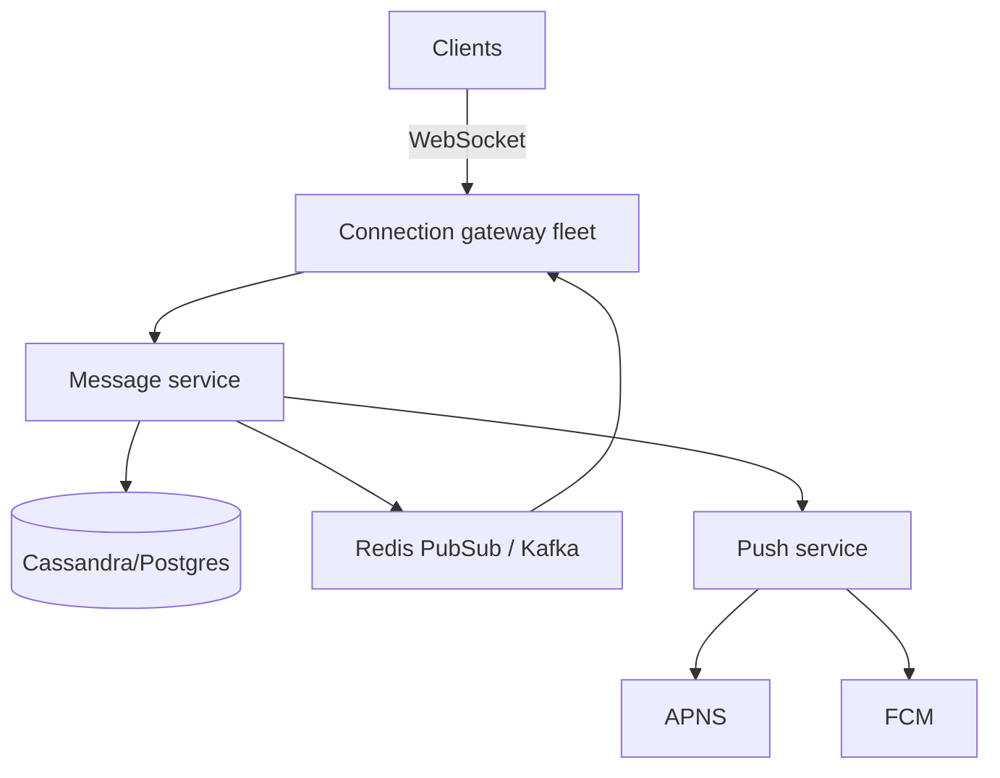

> [← Back to README](../../README.md)

# Design chat / messaging

1:1 and group chat with online delivery, history, and read indicators (light).

## 1. Clarify

- 1:1 only or groups?
- Delivery receipts / typing?
- Media attachments?
- Encryption (E2E) in scope?
- Message order guarantees?

**NFRs:** low latency push, history durable, at-least-once with client dedupe, ordering per conversation.

## 2. Capacity

50M DAU; 40 msgs/user/day → ~20K msgs/sec avg; push connections for online users (~5–10M concurrent)—connection tier is the hard part.

## 3. APIs / protocols

```
WS /connect  (auth token)
send { conv_id, client_msg_id, body }
ack / push { msg }
HTTP POST /v1/conversations
GET /v1/conversations/{id}/messages?cursor
```

## 4. Data model

```
conversations(id, type, created_at)
members(conv_id, user_id, role)
messages(conv_id, msg_id, sender_id, body, created_at)
  PK (conv_id, msg_id) — shard by conv_id
devices / sessions for push
```

## 5. High-level design



**Online:** store message → publish to member connection gateways → push frames.  
**Offline:** trigger mobile push; inbox fetch later.

## 6. Deep dive — connections & order

Gateways hold sockets; session registry maps `user_id → gateway_id`. Sticky LB or gossip registry.

**Ordering:** snowflake/ULID per message; clients sort by `(created_at, msg_id)`. Per-`conv_id` Kafka partition if streaming.

**Idempotency:** `client_msg_id` unique per sender.

**Groups:** fan-out to N members; for large groups use channel fan-out servers.

## 7. Failures

- Gateway crash: clients reconnect; miss window recovered via history API since cursor.
- Dup delivers: client dedupe by msg_id.
- Hot group chat: separate channel infra.

## 8. Interview tips

- Call out WebSocket scaling as primary challenge.
- History store ≠ connection tier.
- Mention backfill on reconnect.

## Message state machine

`pending (client) → server_accepted → delivered → read (optional)`

Clients show local echo with `client_msg_id` until server assigns `msg_id`.

## Fan-out for groups

| Members | Strategy |
|---------|----------|
| ≤50 | Direct publish to each online session |
| 50–1k | Per-conversation pub/sub channel |
| ≥1k | Broadcast tier / channel servers; history still sharded |

## Media in chat

Upload via signed URL; message body stores `media_id`; receivers fetch CDN. Virus scan before making media downloadable.

## Multi-device

Registry allows multiple sessions per user; fan-out to all. Read receipts may be per-user not per-device (product choice).

## Evolution

E2E encryption (keys on device; server relays ciphertext); message search index async; disappearing messages via TTL jobs.


## Interviewer Q&A (drill these aloud)

**Q: What is the consistency model for the core read?**  
A: State it explicitly (e.g. “redirects may see new links within TTL seconds; creates read-your-writes via primary”).

**Q: Single point of failure?**  
A: Name primary DB / broker / region; give mitigation (replicas, multi-AZ, queue buffer).

**Q: How do you prevent duplicate side effects on retry?**  
A: Idempotency keys / upserts / dedupe table—tie to this design’s writes.

**Q: What metric pages you at 3am?**  
A: Pick SLIs: error rate, p99, lag, saturation—not CPU alone.

**Q: How does this evolve to 10× data?**  
A: Partition key, storage tiering, or CQRS—one concrete next step.

## Implementation sketch (pseudocode mindset)

Walk one write handler: validate → authorize → mutate store → enqueue side effects → return. Mention timeouts on dependency calls. This bridges design and coding rounds.

## Load & chaos test plan (talk track)

1. Happy-path load at 2× peak estimate  
2. Dependency latency injection (+500 ms)  
3. Kill one AZ of the data store  
4. Replay poison message  
State what user experience should be in each case.

---

[← Back to README](../../README.md)
