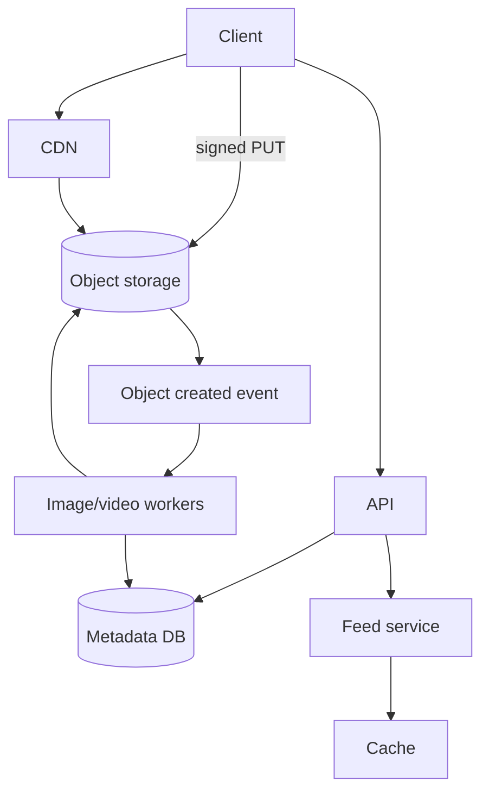

> [← Back to README](../../README.md)

# Design an Instagram-like service

Photo/video sharing with follow graph, feed, and likish engagement—media pipeline is central.

## 1. Clarify

- Photo only or short video?
- Stories / DMs in scope?
- Filters processed client or server?
- Discovery / explore?

**Focus:** upload → process → feed + profile grid. Skip DMs (see chat design).

## 2. Capacity

- 500M users; 50M DAU; 2 uploads/DAU → ~1K uploads/sec peak careful sizing
- Reads: feed + CDN dominate bandwidth
- Avg image 2 MB original → object storage terabytes+/year

## 3. APIs

```
POST /v1/media/upload-session → { upload_url, media_id }
POST /v1/posts { media_id, caption }
GET  /v1/feed
GET  /v1/users/{id}/posts
POST /v1/posts/{id}/like
```

Clients upload **directly to object storage** via signed URL.

## 4. Data model

```
media(id, user_id, status, variants_json)
posts(id, author_id, media_id, caption, created_at)
likes(post_id, user_id)
follows(...)
```

## 5. High-level design



## 6. Deep dive — media pipeline

On upload complete: workers generate thumbnails, compress, strip EXIF GPS if required, optional virus scan. Update `media.status=ready` then allow post publish (or auto-post).

**Feed:** reuse hybrid fan-out from news feed design. Grid queries by `author_id, created_at`.

**Like counts:** Redis counters + periodic DB settle; accept slight lag.

## 7. Failures

- Processing backlog: show “processing” placeholder.
- Hot media: CDN cache; origin shield.
- Partial variants: never serve until required sizes ready.

## 8. Interview tips

- Signed URL upload is a must-mention.
- Separate metadata DB from blob bytes.
- Tie feed discussion to earlier fan-out tradeoffs briefly.

## Upload session detail

1. Client requests upload session → API creates `media_id=processing`
2. Client PUT bytes to signed URL (multipart for large)
3. Object store event triggers workers
4. Workers write variants; update media ready
5. Client creates post referencing media_id (rejected if not ready)

## Feed vs Explore

Feed = follow graph (hybrid fan-out). Explore = recommendation candidates (separate system)—mention as phase 2 to avoid boiling ocean.

## Like / comment scale

Likes: Redis set or counter + async durable store. Comments: sharded by `post_id`; page by time. Celebrity posts: cache top comments.

## Moderation

Async classifiers on caption+image; quarantine pipeline; do not block upload path on slow ML.

## Evolution

Reels/short-video shares transcode path with video design; stories as TTL’d media namespace.


## Interviewer Q&A (drill these aloud)

**Q: What is the consistency model for the core read?**  
A: State it explicitly (e.g. “redirects may see new links within TTL seconds; creates read-your-writes via primary”).

**Q: Single point of failure?**  
A: Name primary DB / broker / region; give mitigation (replicas, multi-AZ, queue buffer).

**Q: How do you prevent duplicate side effects on retry?**  
A: Idempotency keys / upserts / dedupe table—tie to this design’s writes.

**Q: What metric pages you at 3am?**  
A: Pick SLIs: error rate, p99, lag, saturation—not CPU alone.

**Q: How does this evolve to 10× data?**  
A: Partition key, storage tiering, or CQRS—one concrete next step.

## Implementation sketch (pseudocode mindset)

Walk one write handler: validate → authorize → mutate store → enqueue side effects → return. Mention timeouts on dependency calls. This bridges design and coding rounds.

## Load & chaos test plan (talk track)

1. Happy-path load at 2× peak estimate  
2. Dependency latency injection (+500 ms)  
3. Kill one AZ of the data store  
4. Replay poison message  
State what user experience should be in each case.

---

[← Back to README](../../README.md)
