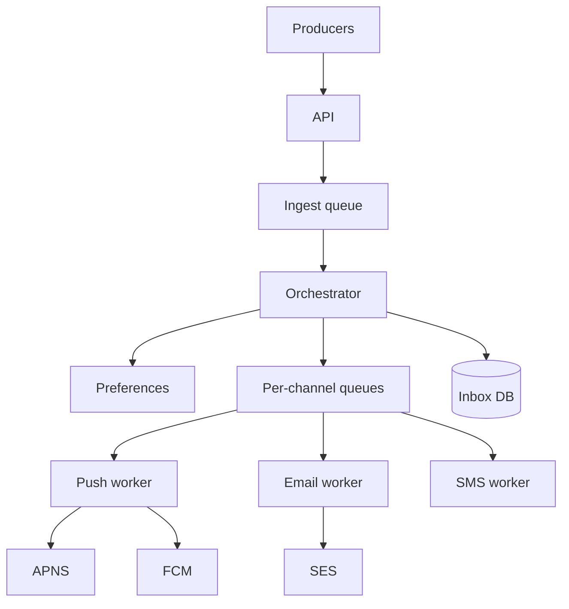

> [← Back to README](../../README.md)

# Design a notification system

Multi-channel notifications: push, email, SMS, in-app—triggered by product events with user preferences.

## 1. Clarify

- Channels in scope?
- User preference & quiet hours?
- Templates & localization?
- Delivery receipts / digests?
- Priority (security OTP vs marketing)?

**NFRs:** high fan-out, at-least-once OK with dedupe, OTP latency low, marketing best-effort.

## 2. Capacity

100M DAU; 5 notifs/user/day → ~5K events/sec avg; peaks 5–10×. Spike on breaking news.

## 3. APIs

```
POST /v1/notifications
  { "user_id"| "segment", "template_id", "data", "channels?", "priority" }
  → { "notification_id" }

PUT /v1/users/{id}/preferences
GET /v1/users/{id}/inbox
```

Webhooks from providers for bounces/delivery.

## 4. Data model

```
preferences(user_id, channel, enabled, quiet_hours)
templates(id, channel, body, locale)
notifications(id, user_id, payload, status, created_at)
device_tokens(user_id, token, platform)
```

## 5. High-level design



## 6. Deep dive — fan-out & preferences

Orchestrator expands audience, filters preferences, applies quiet hours (defer to delayed queue), renders templates, enqueues per channel with `notification_id` for idempotency.

**OTP path:** high-priority queue, sync-ish, skip marketing digests, stricter SLA.

**Dedup:** unique `(notification_id, channel)` in provider send table.

## 7. Failures

- Provider outage: retry with backoff; mark deferred; alternate channel optional.
- Preference service down: fail closed for marketing; fail open for security with care.
- Hot broadcast: chunk fan-out; avoid one giant transaction.

## 8. Interview tips

- Separate **transactional** vs **promotional** pipelines.
- Never put SMS OTP solely on a best-effort marketing bus.
- Talk provider rate limits and per-channel queues.

## Priority lanes

| Lane | Examples | SLA |
|------|----------|-----|
| P0 | OTP, security alerts | seconds; dedicated workers |
| P1 | Transactional receipts | <1 min |
| P2 | Social | minutes; batchable |
| P3 | Marketing | hours; digestable |

Never share P0 worker pools with P3.

## Preference evaluation order

1. User hard opt-out
2. Legal/regulatory constraints
3. Quiet hours → delay
4. Channel reachability (valid device token?)
5. Template render

## Idempotency & provider duplicates

Store `provider_message_id`; on retry reuse same client-side idempotency key to SES/FCM when supported. In-app inbox upserts by `notification_id`.

## Observability

Metrics: enqueue rate, send success, provider latency, preference drop rate, lag by lane. Trace_id from producer through send.

## Evolution

Digest bundler, ML send-time optimization, cross-device collapse (“read on web → skip push”).


## Interviewer Q&A (drill these aloud)

**Q: What is the consistency model for the core read?**  
A: State it explicitly (e.g. “redirects may see new links within TTL seconds; creates read-your-writes via primary”).

**Q: Single point of failure?**  
A: Name primary DB / broker / region; give mitigation (replicas, multi-AZ, queue buffer).

**Q: How do you prevent duplicate side effects on retry?**  
A: Idempotency keys / upserts / dedupe table—tie to this design’s writes.

**Q: What metric pages you at 3am?**  
A: Pick SLIs: error rate, p99, lag, saturation—not CPU alone.

**Q: How does this evolve to 10× data?**  
A: Partition key, storage tiering, or CQRS—one concrete next step.

## Implementation sketch (pseudocode mindset)

Walk one write handler: validate → authorize → mutate store → enqueue side effects → return. Mention timeouts on dependency calls. This bridges design and coding rounds.

## Load & chaos test plan (talk track)

1. Happy-path load at 2× peak estimate  
2. Dependency latency injection (+500 ms)  
3. Kill one AZ of the data store  
4. Replay poison message  
State what user experience should be in each case.

---

[← Back to README](../../README.md)
