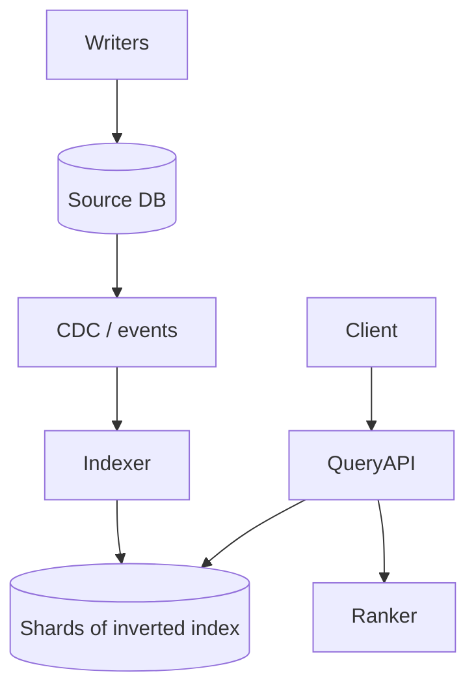

> [← Back to README](../../README.md)

# Design a search system

Full-text search over documents (products, web pages, or app content) with ranking and filters.

## 1. Clarify

- Corpus size & update rate?
- Filters / facets?
- Personalization / autocomplete (separate)?
- Exact phrase / language?

## 2. Capacity

100M docs; 1–5KB text each; 1K updates/sec; 10K queries/sec. Index size often 20–50% of raw text (rule of thumb varies).

## 3. APIs

```
GET /v1/search?q=&filters=&page=
POST /v1/index/docs  (internal)
```

## 4. Data model

Source of truth DB + **inverted index** in search cluster:

```
term → postings list of (doc_id, tf, positions?)
doc_store for snippets
```

## 5. High-level design



## 6. Deep dive — indexing & query

**Indexing:** tokenize, normalize (lower case, stem), update inverted lists; near-real-time segments flush & merge (LSM-like). Use doc_id routing hash for shards.

**Query:** parse → retrieve candidates from postings intersection → score (BM25) → apply filters → maybe second-stage ML rank → return snippets with highlights.

**Consistency:** search is eventually consistent with SoT; show “indexed_at” if needed.

## 7. Failures

- Hot terms explode CPU: cache query results; harden stopwords.
- Split brain index: replica shards; quorum for admin ops.
- Poison docs blow memory: size limits; analyzer circuit breakers.

## 8. Interview tips

- Emphasize SoT ≠ search index.
- Name BM25 / inverted index without claiming to invent Lucene.
- Separate autocomplete service if asked.

## Shard & replica layout

Index split by doc_id hash into N primary shards; each has replicas for read scale and HA. Query fan-out to shards → merge top-K.

## Relevance debugging

Explain API showing matched terms and scores—valuable in interviews as an operational touch.

## Permissions

For private corpora, filter by ACL post-retrieve or index doc with permission tokens carefully (avoid leakage). Never show snippets user cannot access.

## Zero-downtime reindex

Blue/green index aliases: build v2 → swap alias → drop v1.

## Evolution

Learning-to-rank stage; vector search hybrid (keyword + embedding); synonyms managed via config service.


## Interviewer Q&A (drill these aloud)

**Q: What is the consistency model for the core read?**  
A: State it explicitly (e.g. “redirects may see new links within TTL seconds; creates read-your-writes via primary”).

**Q: Single point of failure?**  
A: Name primary DB / broker / region; give mitigation (replicas, multi-AZ, queue buffer).

**Q: How do you prevent duplicate side effects on retry?**  
A: Idempotency keys / upserts / dedupe table—tie to this design’s writes.

**Q: What metric pages you at 3am?**  
A: Pick SLIs: error rate, p99, lag, saturation—not CPU alone.

**Q: How does this evolve to 10× data?**  
A: Partition key, storage tiering, or CQRS—one concrete next step.

## Implementation sketch (pseudocode mindset)

Walk one write handler: validate → authorize → mutate store → enqueue side effects → return. Mention timeouts on dependency calls. This bridges design and coding rounds.

## Load & chaos test plan (talk track)

1. Happy-path load at 2× peak estimate  
2. Dependency latency injection (+500 ms)  
3. Kill one AZ of the data store  
4. Replay poison message  
State what user experience should be in each case.

---

[← Back to README](../../README.md)
