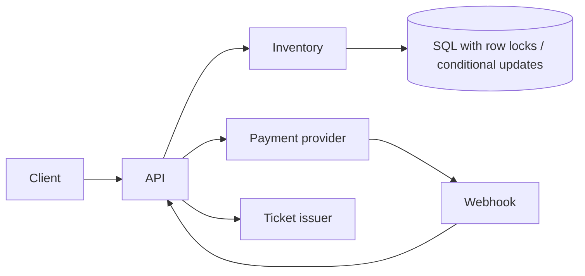

> [← Back to README](../../README.md)

# Design a ticket booking system

Concert/stadium seats (or airline-style inventory) with holds, payments, and no double booking.

## 1. Clarify

- Reserved seats vs general admission?
- Hold duration?
- Payment provider external?
- Scalper abuse?

**Critical NFR:** **correctness under contention**—never sell same seat twice.

## 2. Capacity

Mostly read-heavy until on-sale. On-sale: 100K users; flash contention on hot seats/sections. Inventory relatively small vs social apps.

## 3. APIs

```
GET  /v1/events/{id}/seats
POST /v1/holds { event_id, seat_ids[] } → { hold_id, expires_at }
POST /v1/checkout { hold_id, payment_method }
POST /v1/webhooks/payment
```

## 4. Data model

```
events, seats(event_id, seat_id, status, version)
holds(hold_id, user_id, seats[], expires_at)
orders(order_id, status, payment_ref)
```

`status`: available | held | sold.

## 5. High-level design



## 6. Deep dive — concurrency

**Hold:** transaction selecting seats `WHERE status='available' FOR UPDATE` (or `UPDATE ... WHERE version=V`) → set held + expiry. If conflict, fail hold.

**Expiry:** TTL job or delayed queue releases holds atomically if still held by same hold_id.

**Checkout:** confirm payment intent → mark sold only after payment success (or auth hold). Idempotency keys on checkout.

**GA inventory:** counter with conditional decrement `WHERE remaining >= n`.

## 7. Failures

- Payment success / order fail: webhook reconciliation job; issue ticket or refund.
- Thundering herd on-sale: queue waiting room; sectional sharding; cache seat maps read-only; serialize writes per seat section.
- Clock skew on expiry: use DB time.

## 8. Interview tips

- Correctness > microservices fashion.
- Waiting room is a valid scale tactic.
- Spell out idempotent payment + seat state machine.

## Seat map reads vs writes

Seat maps are read-cached aggressively; writes go through inventory service with strict concurrency. Cache invalidation on hold/sale (or short TTL during on-sale).

## Waiting room

Admit users with tokens at controlled rate when on-sale begins. Token carries event_id and expiry; booking API rejects without token. Absorbs bot storms.

## Payment + ticket issue

After PSP success: create order, mark seats sold, enqueue ticket PDF/QR email. Reconciliation scans `payment_succeeded AND order_missing`.

## Anti-scalping (light)

Purchase limits per user/payment instrument; queue fairness; CAPTCHA at admit time—mention without claiming perfect solution.

## Evolution

Resale marketplace with transfer of ownership; dynamic pricing—both need stronger audit trails.


## Interviewer Q&A (drill these aloud)

**Q: What is the consistency model for the core read?**  
A: State it explicitly (e.g. “redirects may see new links within TTL seconds; creates read-your-writes via primary”).

**Q: Single point of failure?**  
A: Name primary DB / broker / region; give mitigation (replicas, multi-AZ, queue buffer).

**Q: How do you prevent duplicate side effects on retry?**  
A: Idempotency keys / upserts / dedupe table—tie to this design’s writes.

**Q: What metric pages you at 3am?**  
A: Pick SLIs: error rate, p99, lag, saturation—not CPU alone.

**Q: How does this evolve to 10× data?**  
A: Partition key, storage tiering, or CQRS—one concrete next step.

## Implementation sketch (pseudocode mindset)

Walk one write handler: validate → authorize → mutate store → enqueue side effects → return. Mention timeouts on dependency calls. This bridges design and coding rounds.

## Load & chaos test plan (talk track)

1. Happy-path load at 2× peak estimate  
2. Dependency latency injection (+500 ms)  
3. Kill one AZ of the data store  
4. Replay poison message  
State what user experience should be in each case.

---

[← Back to README](../../README.md)
