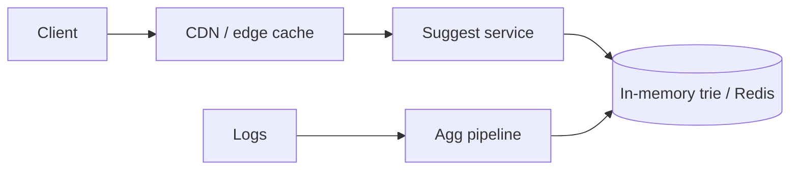

> [← Back to README](../../README.md)

# Design typeahead / autocomplete

Suggest queries or entities as the user types, with very low latency.

## 1. Clarify

- Query suggestions vs user/product entities?
- Personalization?
- Typo tolerance?
- Languages?

**NFR:** p99 < 100 ms end-to-end; high QPS; eventual freshness OK (minutes).

## 2. Capacity

100K QPS peak typing traffic; each keystroke may fire request (debounce client-side 50–100 ms).

## 3. APIs

```
GET /v1/suggest?q=sea&limit=8
→ { "suggestions": ["seattle weather", "search engines", ...] }
```

## 4. Data model

Trie / prefix index in memory; or ranked suggestions table:

```
suggestions(prefix, term, score)
```

Source: query logs aggregated offline + editorials.

## 5. High-level design



## 6. Deep dive — data structure & ranking

**Trie / radix tree** of terms; at each node top-K heap by score. Memory heavy but fast. Shard by prefix first character(s).

**Ranking score:** frequency × freshness × click-through; personalization as re-rank of top-K.

**Cache:** edge cache common prefixes (`q=a`, `q=se`); short TTL.

**Typo:** fuzzy at cost—optional second pass if exact prefix sparse.

## 7. Failures

- Index rebuild: blue/green swap of trie snapshot.
- Hot prefix “a”: more replicas; cache.
- Empty results: fall back to popular overall.

## 8. Interview tips

- Client debounce is part of the design.
- Offline aggregation → online trie is a clean story.
- Don’t put typeahead on disk-bound SQL for each keystroke.

## Building the trie offline

Nightly (or hourly): aggregate query logs → filter abuse → compute scores → build immutable trie snapshot → push to suggest fleet → atomic swap.

## Online personalization

Fetch global top-K for prefix; re-rank with user recent searches / locale / vertical. Keep personalization off the trie critical path when possible.

## Client UX

Debounce 75 ms; cancel in-flight on new keystroke; prefetch next likely char for popular prefixes optional.

## Abuse

Block injection of spam suggestions; moderate editorial blacklist; rate-limit suggest API.

## Evolution

Multi-language analyzers; entity suggest (users, products) with type icons; voice input tokenization.


## Interviewer Q&A (drill these aloud)

**Q: What is the consistency model for the core read?**  
A: State it explicitly (e.g. “redirects may see new links within TTL seconds; creates read-your-writes via primary”).

**Q: Single point of failure?**  
A: Name primary DB / broker / region; give mitigation (replicas, multi-AZ, queue buffer).

**Q: How do you prevent duplicate side effects on retry?**  
A: Idempotency keys / upserts / dedupe table—tie to this design’s writes.

**Q: What metric pages you at 3am?**  
A: Pick SLIs: error rate, p99, lag, saturation—not CPU alone.

**Q: How does this evolve to 10× data?**  
A: Partition key, storage tiering, or CQRS—one concrete next step.

## Implementation sketch (pseudocode mindset)

Walk one write handler: validate → authorize → mutate store → enqueue side effects → return. Mention timeouts on dependency calls. This bridges design and coding rounds.

## Load & chaos test plan (talk track)

1. Happy-path load at 2× peak estimate  
2. Dependency latency injection (+500 ms)  
3. Kill one AZ of the data store  
4. Replay poison message  
State what user experience should be in each case.

---

[← Back to README](../../README.md)
