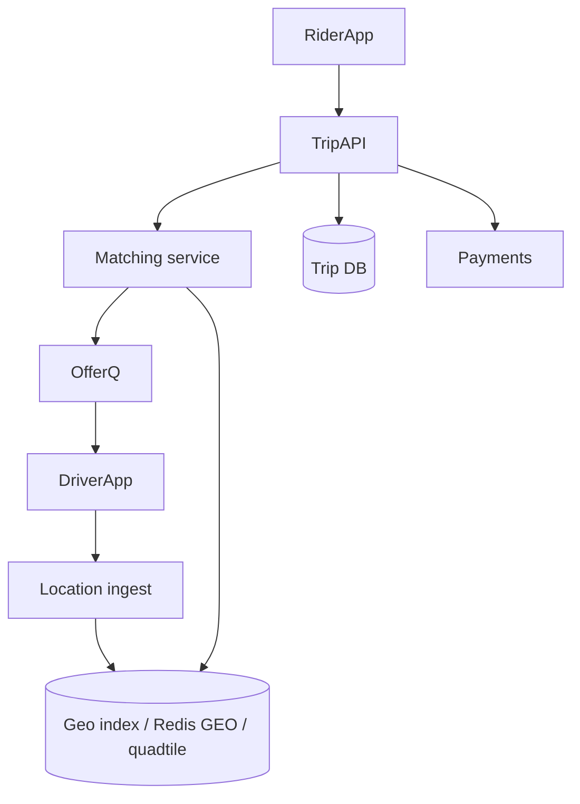

> [← Back to README](../../README.md)

# Design an Uber-like ride matching system

Riders request trips; drivers are matched using geospatial proximity and ETA.

## 1. Clarify

- Rides only (no food)?
- Pricing / surge in scope?
- Payments?
- Cities count / active drivers?

**Core:** location updates, request ride, match, trip lifecycle. Payments summarized.

## 2. Capacity

1M drivers; location update every 3–5s when online → tens–hundreds of K writes/sec → specialized location store. Trip requests much lower QPS.

## 3. APIs

```
PUT /v1/drivers/{id}/location { lat, lng, heading }
POST /v1/trips { pickup, dropoff, product }
WS  trip events: offered, accepted, arrived, completed
POST /v1/trips/{id}/accept
```

## 4. Data model

```
drivers(id, status, vehicle)
trips(id, rider_id, driver_id, status, geo fields, timestamps)
location_store: driver_id → {lat,lng,ts} in memory/geo index
```

## 5. High-level design



## 6. Deep dive — matching & geo

**Geo index:** geohash/quadtree tiles; query ring of cells around pickup; filter by status=available; rank by ETA (OSRM/maps) not just distance.

**Matching:** lock driver optimistically (compare-and-set status); offer with timeout; on reject/timeout try next. Avoid double assign with transactional status.

**Location firehose:** downsample; update only if moved >X meters; shard by city/region cell.

## 7. Failures

- Map provider down: fall back to haversine ranking.
- Match storms at concert end: queue requests; expand search radius gradually.
- Split brain assign: fencing on trip version number.

## 8. Interview tips

- Location ingestion scale ≠ trip DB scale—separate them.
- Talk city/region sharding.
- Mention ETA vs crow-flies.

## Trip state machine

`requested → offered → accepted → en_route_pickup → arrived → in_trip → completed` (+ `canceled` edges)

Each transition stores timestamp for analytics and dispute resolution.

## Location update pipeline

Driver app batches locations; ingest validates token + rate; writes to in-memory geo store with TTL; durable log optional for replay. Do not write every ping to OLTP Postgres.

## Matching fairness

Avoid always assigning the same driver; rotate among comparable ETAs; consider driver acceptance rate without creating feedback abuse loops.

## City isolation

Shard control plane by city/region: matching, inventory of drivers, and map config stay local—reduces blast radius and latency.

## Evolution

Multi-stop trips, scheduled rides, cross-city airport queues—each adds inventory constraints; keep core matching simple first.


## Interviewer Q&A (drill these aloud)

**Q: What is the consistency model for the core read?**  
A: State it explicitly (e.g. “redirects may see new links within TTL seconds; creates read-your-writes via primary”).

**Q: Single point of failure?**  
A: Name primary DB / broker / region; give mitigation (replicas, multi-AZ, queue buffer).

**Q: How do you prevent duplicate side effects on retry?**  
A: Idempotency keys / upserts / dedupe table—tie to this design’s writes.

**Q: What metric pages you at 3am?**  
A: Pick SLIs: error rate, p99, lag, saturation—not CPU alone.

**Q: How does this evolve to 10× data?**  
A: Partition key, storage tiering, or CQRS—one concrete next step.

## Implementation sketch (pseudocode mindset)

Walk one write handler: validate → authorize → mutate store → enqueue side effects → return. Mention timeouts on dependency calls. This bridges design and coding rounds.

## Load & chaos test plan (talk track)

1. Happy-path load at 2× peak estimate  
2. Dependency latency injection (+500 ms)  
3. Kill one AZ of the data store  
4. Replay poison message  
State what user experience should be in each case.

---

[← Back to README](../../README.md)
