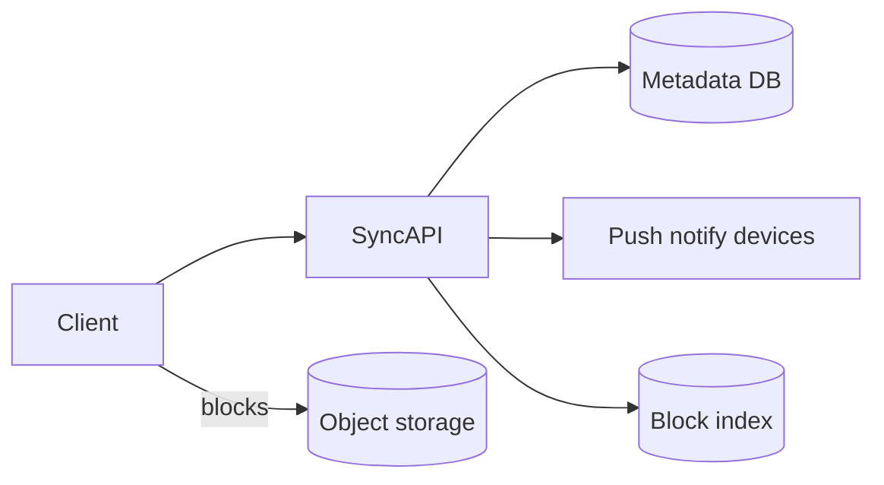

# Design a Dropbox-like file sync

Users upload files; sync across devices with dedupe, versioning, and sharing (light).

## 1. Clarify

- File size limits? Large file chunking?
- Conflict resolution (last-write-wins vs branches)?
- Sharing links / collaborators?
- Block-level sync?

**NFRs:** durable, eventual sync across devices, efficient bandwidth (chunking + dedupe).

## 2. Capacity

100M users; avg 10 GB stored → exabyte-class object store; metadata smaller but hot. Sync traffic bursty when devices reconnect.

## 3. APIs

```
POST /v1/files/commit { path, blocks[], rev }
GET  /v1/files/metadata?path
POST /v1/blocks/upload { block_hash } → upload_url if novel
GET  /v1/sync/changes?cursor
```

## 4. Data model

```
namespaces / folders
files(id, ns_id, path, rev, size)
blocks(hash PK, size)  -- content addressed
file_blocks(file_id, idx, hash)
revisions(file_id, rev, metadata)
```

## 5. High-level design



## 6. Deep dive — chunking & conflicts

Files split into ~4MB blocks; hash (SHA256); upload only missing blocks (global dedupe). Commit updates metadata revision atomically.

**Conflicts:** if client’s base rev ≠ server tip → conflict copy or automatic merge for docs (scope). Notify other devices via long-poll/websocket with cursor.

**Large folders:** paginate change feed; avoid listing entire tree each sync.

## 7. Failures

- Commit after partial block upload: commit rejects until all blocks present.
- Metadata vs block inconsistency: GC unreferenced blocks lazily; never delete block still referenced.
- Hot shared folder: shard metadata by namespace_id.

## 8. Interview tips

- Content-addressed blocks are the star of the design.
- Metadata DB is the consistency bottleneck—design commits carefully.
- Client sync protocol > fancy storage brands.

## Sync cursor protocol

Server maintains per-namespace journal of changes. Client sends cursor; server returns batch of path changes + new cursor. Idempotent apply on client.

## Dedup savings

Identical blocks across users (popular OS files, shared photos) upload once. Privacy: hash only; cannot reconstruct others’ files without blocks you own.

## Sharing

Share link creates capability token on a subtree; authz check on download. Collaborator write requires conflict rules same as multi-device.

## Client tips for interviews

Mention offline queue of commits; exponential backoff; bandwidth caps on mobile metered networks.

## Evolution

Full-text search of file names/content via async indexer; ransomware recovery via version history restore points.


## Interviewer Q&A (drill these aloud)

**Q: What is the consistency model for the core read?**  
A: State it explicitly (e.g. “redirects may see new links within TTL seconds; creates read-your-writes via primary”).

**Q: Single point of failure?**  
A: Name primary DB / broker / region; give mitigation (replicas, multi-AZ, queue buffer).

**Q: How do you prevent duplicate side effects on retry?**  
A: Idempotency keys / upserts / dedupe table—tie to this design’s writes.

**Q: What metric pages you at 3am?**  
A: Pick SLIs: error rate, p99, lag, saturation—not CPU alone.

**Q: How does this evolve to 10× data?**  
A: Partition key, storage tiering, or CQRS—one concrete next step.

## Implementation sketch (pseudocode mindset)

Walk one write handler: validate → authorize → mutate store → enqueue side effects → return. Mention timeouts on dependency calls. This bridges design and coding rounds.

## Load & chaos test plan (talk track)

1. Happy-path load at 2× peak estimate  
2. Dependency latency injection (+500 ms)  
3. Kill one AZ of the data store  
4. Replay poison message  
State what user experience should be in each case.
