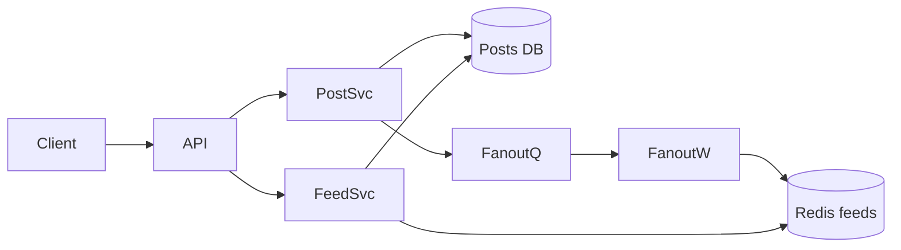

# Design a news feed

Home timeline of posts from people you follow—ranking optional for deep dive.

## 1. Clarify

- Chronological vs ranked?
- Media posts?
- Ads / recommendations in scope?
- Max following graph size?
- Real-time vs eventual?

**Assumptions:** 100M users, avg 200 follows, celebrity accounts exist, ranked feed phase-2 light, single region first.

## 2. Capacity

- 10M DAU; 10 posts viewed/user → heavy reads
- Write posts: smaller QPS than reads
- Fan-out on write can explode for celebrities

## 3. APIs

```
POST /v1/posts { text, media_ids }
GET  /v1/feed?cursor&limit
POST /v1/follow { followee_id }
GET  /v1/posts/{id}
```

## 4. Data model

```
users, posts(id, author_id, content, created_at)
follows(follower_id, followee_id) PK(follower, followee)
  index(followee_id)  -- for fan-out
feed_cache(user_id, post_ids[])  -- Redis list/ZSET
```

Media in object storage; CDN.

## 5. High-level design



## 6. Deep dive — fan-out

**Fan-out on write:** on post, enqueue pushes of `post_id` into each follower’s cached timeline (ZSET score=time). Reads are cheap.

**Problem:** celebrities with 50M followers → write storm.

**Hybrid:** fan-out on write for normal users; for celebrities, fan-out on read (merge celebrity posts at read time). Detect via follower threshold.

**Ranking:** candidate generation from cache → ranker service (ML optional) → truncate. Keep chronological first if timeboxed.

## 7. Failures

- Fan-out lag: user sees delayed posts—show “updating.”
- Redis loss: rebuild from follows+posts asynchronously; degrade to slower path.
- Hot celebrity post: cache post objects aggressively.

## 8. Interview tips

- State hybrid threshold explicitly.
- Separate post object cache from timeline lists.
- Mention pagination cursors (score, id).

## Read path detail

1. Authn → `user_id`
2. `ZREVRANGE feed:{uid} start start+limit`
3. Hydrate `post:{id}` objects from cache/DB (MGET)
4. Filter deleted/blocked/muted
5. Optional ranker reorders page
6. Return cursor = last score+id

## Celebrity threshold policy

If `followers > 10k` (tunable), skip write fan-out; mark author `fanout=read`. Feed service merges those authors’ recent posts into the cached timeline at read.

## Cache memory rough math

1M DAU × 500 post_ids × 16 bytes ≈ 8 GB for timelines (order-of-magnitude)—fits a Redis cluster; still shard by user_id.

## Privacy

Respect blocks and audience ACL (friends-only posts) at hydrate time—not only at fan-out—so policy changes apply retroactively.

## Evolution

Edge caches for anonymous trending; multi-region feed caches with user home region; ML ranker as separate service with fallback to chrono.


## Interviewer Q&A (drill these aloud)

**Q: What is the consistency model for the core read?**  
A: State it explicitly (e.g. “redirects may see new links within TTL seconds; creates read-your-writes via primary”).

**Q: Single point of failure?**  
A: Name primary DB / broker / region; give mitigation (replicas, multi-AZ, queue buffer).

**Q: How do you prevent duplicate side effects on retry?**  
A: Idempotency keys / upserts / dedupe table—tie to this design’s writes.

**Q: What metric pages you at 3am?**  
A: Pick SLIs: error rate, p99, lag, saturation—not CPU alone.

**Q: How does this evolve to 10× data?**  
A: Partition key, storage tiering, or CQRS—one concrete next step.

## Implementation sketch (pseudocode mindset)

Walk one write handler: validate → authorize → mutate store → enqueue side effects → return. Mention timeouts on dependency calls. This bridges design and coding rounds.

## Load & chaos test plan (talk track)

1. Happy-path load at 2× peak estimate  
2. Dependency latency injection (+500 ms)  
3. Kill one AZ of the data store  
4. Replay poison message  
State what user experience should be in each case.
