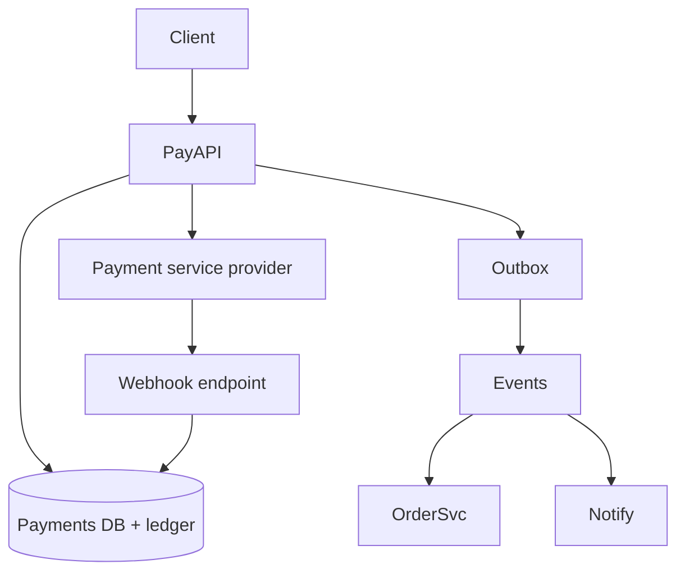

# Design a payments system

Move money (or ledger entries) between parties with idempotency, webhooks, and auditability—marketplace or merchant payments.

## 1. Clarify

- Card processing via PSP (Stripe-like) or in-house?
- Wallets / P2P?
- Multi-currency?
- Who is merchant of record?
- Disputes / chargebacks in scope?

**Assume:** app is merchant; card data vaulted at PSP; you own **ledger** and order state.

## 2. Capacity

Throughput often modest vs social (hundreds–thousands TPS) but **correctness and audit** dominate. Spikes on flash sales.

## 3. APIs

```
POST /v1/payments
  { "idempotency_key", "amount", "currency", "customer", "order_id" }
  → { "payment_id", "status": "pending|succeeded|failed" }

GET  /v1/payments/{id}
POST /v1/webhooks/psp
POST /v1/refunds { payment_id, amount }
```

## 4. Data model

```
payments(id, idempotency_key UNIQUE, amount, currency, status, psp_ref)
ledger_entries(id, account_id, amount, payment_id, created_at)
accounts(id, balance_cached, currency)
webhooks_received(id, payload_hash)  -- dedupe
```

Double-entry ledger: every movement has balanced debit/credit.

## 5. High-level design



## 6. Deep dive — idempotency & webhooks

Client retries with same `idempotency_key` → return same payment record; never create second charge.

**Flow:** create local payment `pending` → call PSP with key → mark `succeeded/failed` from response **or** webhook (whichever first) using state machine transitions. Store PSP id.

**Ledger:** append-only entries; balances derived or maintained with transactional updates. Never delete history.

**Outbox:** commit payment state + outbox row together; publisher emits `payment.succeeded` for order fulfillment—avoids dual-write bugs.

## 7. Failures

- PSP timeout: leave pending; reconcile via PSP get-or-webhook; do not assume fail.
- Duplicate webhooks: dedupe by event id.
- Partial refunds: new ledger entries; status `partially_refunded`.
- Replay attacks: verify webhook signatures.

## 8. Interview tips

- Lead with idempotency keys and ledger, not crypto buzzwords.
- Explicit state machine for payment status.
- Say “PCI: we don’t store raw PANs; PSP tokens only.”

## State machine

`created → pending → succeeded | failed | canceled` with `refunded` / `partially_refunded` side states. Illegal transitions throw and alert.

## Double-entry example

Charge $10: debit `psp_clearing` 10, credit `merchant_payable` 10 (simplified). Refund reverses with new entries—never edit old ones.

## Webhook authenticity

Verify HMAC signature + timestamp skew window; store event_id uniqueness. Process asynchronously to keep endpoint fast.

## Reconciliation

Daily job compares PSP settlement reports vs ledger; open tickets on drift. Interviewers love hearing this operational loop.

## Evolution

Multi-PSP failover, stored-credential CIT/MIT rules, marketplace split payouts—each builds on the same ledger primitives.


## Interviewer Q&A (drill these aloud)

**Q: What is the consistency model for the core read?**  
A: State it explicitly (e.g. “redirects may see new links within TTL seconds; creates read-your-writes via primary”).

**Q: Single point of failure?**  
A: Name primary DB / broker / region; give mitigation (replicas, multi-AZ, queue buffer).

**Q: How do you prevent duplicate side effects on retry?**  
A: Idempotency keys / upserts / dedupe table—tie to this design’s writes.

**Q: What metric pages you at 3am?**  
A: Pick SLIs: error rate, p99, lag, saturation—not CPU alone.

**Q: How does this evolve to 10× data?**  
A: Partition key, storage tiering, or CQRS—one concrete next step.

## Implementation sketch (pseudocode mindset)

Walk one write handler: validate → authorize → mutate store → enqueue side effects → return. Mention timeouts on dependency calls. This bridges design and coding rounds.

## Load & chaos test plan (talk track)

1. Happy-path load at 2× peak estimate  
2. Dependency latency injection (+500 ms)  
3. Kill one AZ of the data store  
4. Replay poison message  
State what user experience should be in each case.
