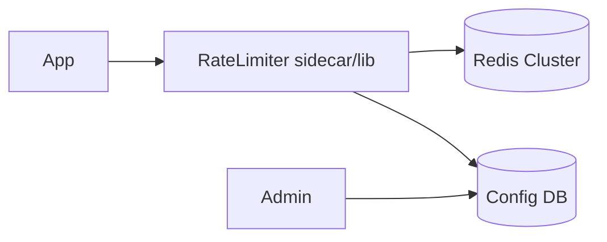
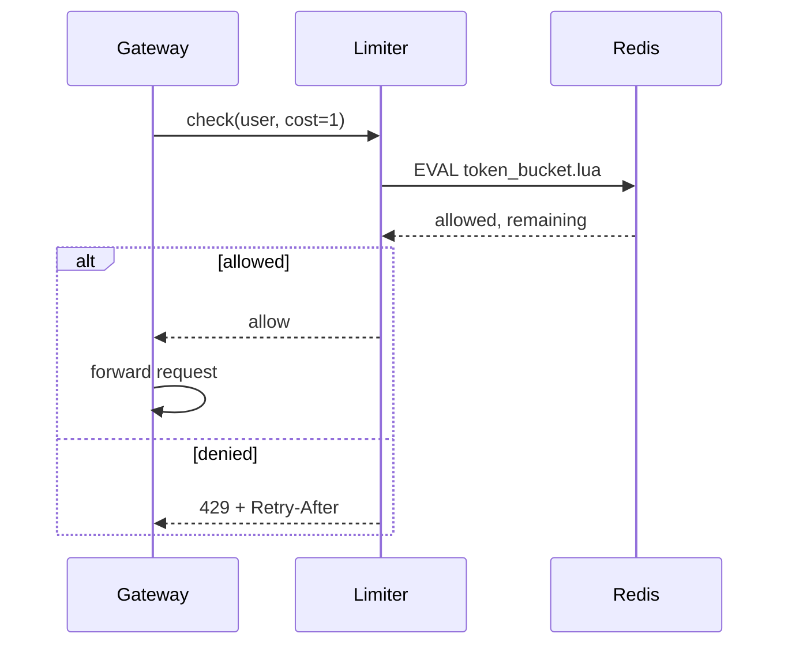

# Design a rate limiter

Build a service or library that enforces request quotas across a fleet.

## 1. Clarify

- Limits per API key / user / IP?
- Exact vs approximate?
- Centralized service vs middleware library?
- Soft vs hard throttle; delay vs reject?
- Multi-datacenter?

**Assumptions:** per-user token bucket, ~1M users, peak 100K decisions/sec, fail-open optional, single region first.

## 2. Capacity

100K QPS decisions → Redis must shard; each decision 1–2 RTT. Local + sync hybrid possible.

## 3. APIs

```
POST /v1/check
  { "key": "user:42", "cost": 1, "limit": 100, "window_sec": 60 }
  → { "allowed": true, "remaining": 83, "reset_sec": 12 }

# or middleware:
Allow(key) → bool + headers
```

## 4. Data model

Redis keys: `rl:{key}:{bucket}` → token count + last refill timestamp. Or sorted sets for sliding log (heavier).

Config store: limits per route/plan in SQL/config service.

## 5. High-level design



Gateway calls RL before routing. RL atomically refills and consumes tokens via Lua script.

## 6. Deep dive — algorithm & atomicity

**Token bucket in Lua:** read tokens+ts; refill based on now-ts; if tokens>=cost decrement; else deny. One RTT, race-safe.

**Distributed accuracy:** Redis cluster hash slot by key → per-key atomicity. Global exact sum across shards not required for per-user keys.

**Local rate limiting:** each instance allows `limit/N` — approximate, survives Redis outage, can over-allow by N.

**Hybrid:** local bulk tokens refilled from Redis periodically—low latency, bounded overshoot.

## 7. Failures

- Redis down: fail-open (availability) vs fail-closed (safety)—product choice; document it.
- Clock skew: prefer Redis server time in Lua.
- Hot tenant keys: isolate or raise limits; dedicated shard.
- Config push delay: version limits; poll/watch.

## 8. Interview tips

- Return `429` + `Retry-After`.
- Distinguish **rate** (QPS) vs **quota** (daily).
- Mention race without atomic ops.

## Evolution

Multi-region: regional limiters + async reconcile, or central with higher latency; often regional limits + global daily quota.

## Sequence — allow/deny



## Config examples

- Login: 5/min per IP + 20/hour per account
- Search: 10/s per user, burst 30
- Webhook egress: 100/s per tenant

## Multi-tenant fairness

Weighted fair limits prevent one noisy tenant from consuming Redis CPU. Isolate extreme tenants on dedicated keys/shards.

## Testing strategy

Load-test with concurrent clients sharing a key; assert never over `burst` beyond documented tolerance. Chaos: kill Redis; verify fail-open/closed behavior matches config.

## Evolution

Add sliding-window approximators for smoother UX; export quota usage to billing; edge enforcement via WASM/gateway plugins for ultra-low latency.


## Interviewer Q&A (drill these aloud)

**Q: What is the consistency model for the core read?**  
A: State it explicitly (e.g. “redirects may see new links within TTL seconds; creates read-your-writes via primary”).

**Q: Single point of failure?**  
A: Name primary DB / broker / region; give mitigation (replicas, multi-AZ, queue buffer).

**Q: How do you prevent duplicate side effects on retry?**  
A: Idempotency keys / upserts / dedupe table—tie to this design’s writes.

**Q: What metric pages you at 3am?**  
A: Pick SLIs: error rate, p99, lag, saturation—not CPU alone.

**Q: How does this evolve to 10× data?**  
A: Partition key, storage tiering, or CQRS—one concrete next step.

## Implementation sketch (pseudocode mindset)

Walk one write handler: validate → authorize → mutate store → enqueue side effects → return. Mention timeouts on dependency calls. This bridges design and coding rounds.

## Load & chaos test plan (talk track)

1. Happy-path load at 2× peak estimate  
2. Dependency latency injection (+500 ms)  
3. Kill one AZ of the data store  
4. Replay poison message  
State what user experience should be in each case.
