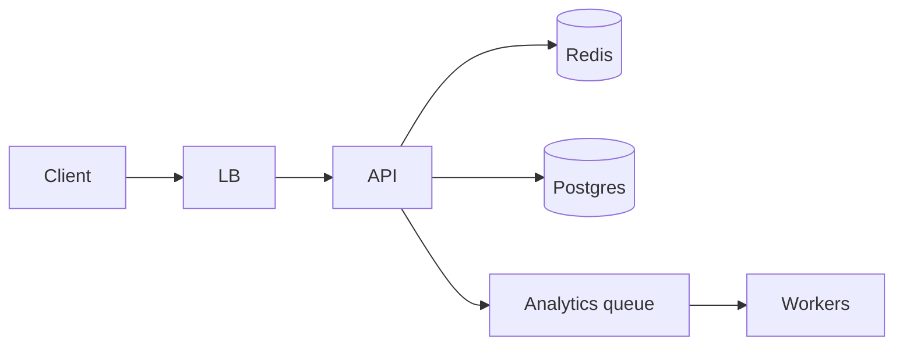
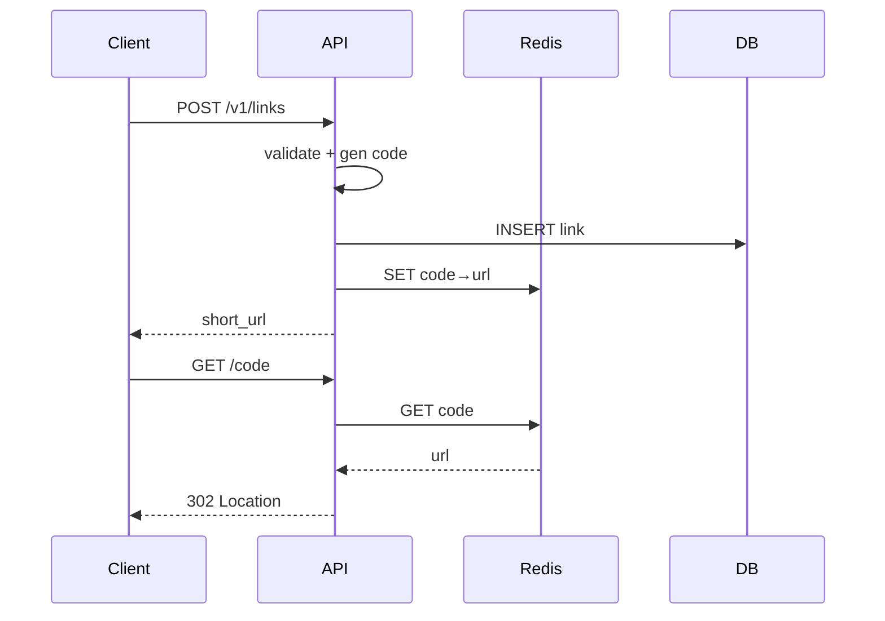

# Design a URL shortener

Classic warm-up design. Focus on unique code generation, redirect latency, and abuse.

## 1. Clarify

**Functional**

- Create short URL from long URL (auth optional)
- Redirect short → long (301/302)
- Optional: custom aliases, expiry, basic click counts

**Out of scope (v1):** multi-tenant analytics warehouse, A/B pages.

**NFRs:** low redirect latency (p99 < 50 ms service-side), unique codes, high read/write skew (redirects ≫ creates), durability of mappings.

**Assumptions:** 100M new links/month; 10× redirects; single region MVP.

## 2. Capacity

- Writes ≈ 100M/month ≈ 40 QPS avg; peak ~200
- Reads ≈ 400 QPS avg; peak ~2K
- Storage: 100M/year × ~100 bytes metadata ≈ 10 GB/year (+ replication)

Single primary DB + cache handles this easily; still design cleanly for growth.

## 3. APIs

```
POST /v1/links
  { "long_url": "...", "custom_alias?": "...", "ttl_sec?": 0 }
  → { "code": "aB3xY9", "short_url": "https://short.ly/aB3xY9" }

GET /{code}
  → 302 Location: <long_url>

GET /v1/links/{code}/stats   (authz)
  → { "clicks": 123 }
```

Errors: 400 bad URL, 409 alias taken, 404 unknown code, 410 expired.

## 4. Data model

```
links(
  code PK,
  long_url,
  user_id NULL,
  created_at,
  expires_at NULL,
  click_count  -- or separate counters store
)
unique(custom alias) via code PK
index(user_id, created_at)
```

Blobs unnecessary. Counters may be Redis INCR flushed periodically.

## 5. High-level design



**Write:** validate URL → generate code → insert → fill cache → return.

**Read:** cache get by code → on miss DB → set cache → 302. Async click event to queue.

## 6. Deep dive — code generation

**Options**

1. Hash long URL (MD5/Base62 truncate) — collisions; same URL same code may be OK.
2. Auto-increment + Base62 — simple; enumerable; needs central ID.
3. Pre-generated random codes from a service — high entropy; allocation service.

**Pick:** 64-bit random → Base62 (~11 chars) with DB uniqueness constraint; retry on conflict. Or distributed ID (Snowflake) encoded Base62 for uniqueness without retries.

**Enumeration:** use enough entropy; rate-limit create; optional auth.

**Custom aliases:** reserved word list; uniqueness check; abuse review async.

## 7. Failures

- DB down: redirects may still hit warm cache; creates fail—return 503.
- Cache stampede on viral code: single-flight fill.
- Hot key viral link: many cache replicas / local cache.
- Poison long URLs (javascript:): scheme allowlist http/https.

## 8. Interview tips

- Ask 301 vs 302 (caching vs analytics accuracy).
- Mention cache key = code; TTL + invalidate on delete.
- Don’t over-shard at 2K QPS.

## Evolution

Add read replicas → shard by code hash → multi-region with global code space or region prefixes.

## Sequence — create + redirect



## Alternatives considered

| Approach | Pros | Cons |
|----------|------|------|
| Hash URL → code | Deterministic | Collisions; hard custom alias |
| Central auto-ID | Simple | Enumerability; write bottleneck |
| Random Base62 | Unpredictable | Retry on conflict (rare) |

## Analytics path

Clicks enqueue `{code, ts, ua, country?}`; workers aggregate to daily tables. Do not synchronously UPDATE click_count on every redirect under peak—use Redis INCR + flush.

## Security & abuse

- Allowlist `http`/`https` only
- Rate-limit create per IP
- Malware URL scanning async; disable on hit
- Robots: optional `nofollow` on interstitial (if used)

## Capacity evolution checkpoints

| Scale | Change |
|-------|--------|
| <5K QPS | Single primary + cache |
| Hot viral | Local cache / more replicas |
| Multi-region | Code prefix per region or global unique ID service |


## Interviewer Q&A (drill these aloud)

**Q: What is the consistency model for the core read?**  
A: State it explicitly (e.g. “redirects may see new links within TTL seconds; creates read-your-writes via primary”).

**Q: Single point of failure?**  
A: Name primary DB / broker / region; give mitigation (replicas, multi-AZ, queue buffer).

**Q: How do you prevent duplicate side effects on retry?**  
A: Idempotency keys / upserts / dedupe table—tie to this design’s writes.

**Q: What metric pages you at 3am?**  
A: Pick SLIs: error rate, p99, lag, saturation—not CPU alone.

**Q: How does this evolve to 10× data?**  
A: Partition key, storage tiering, or CQRS—one concrete next step.

## Implementation sketch (pseudocode mindset)

Walk one write handler: validate → authorize → mutate store → enqueue side effects → return. Mention timeouts on dependency calls. This bridges design and coding rounds.

## Load & chaos test plan (talk track)

1. Happy-path load at 2× peak estimate  
2. Dependency latency injection (+500 ms)  
3. Kill one AZ of the data store  
4. Replay poison message  
State what user experience should be in each case.
