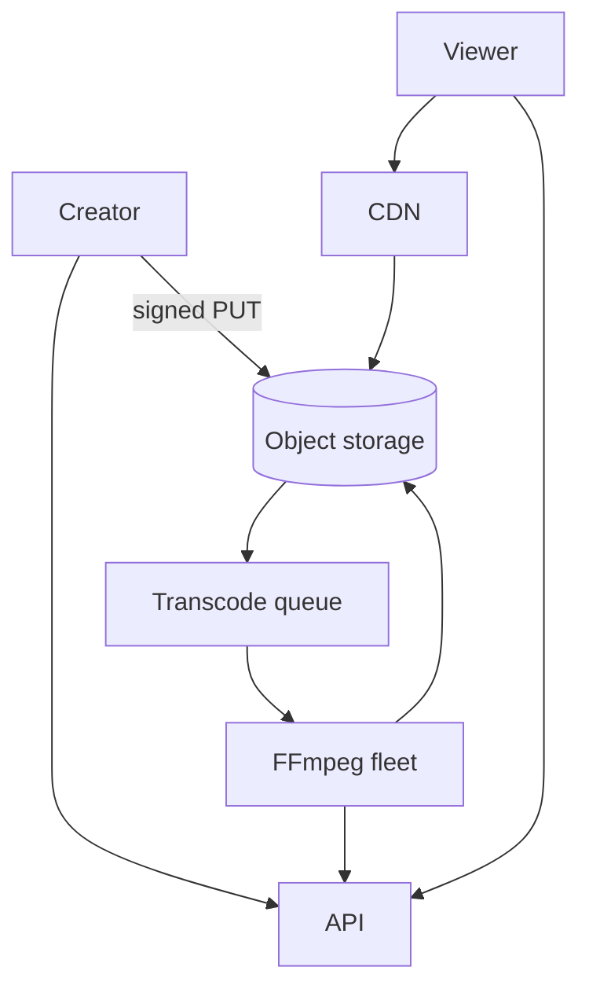

# Design a video streaming service

Upload, process, and stream videos with adaptive bitrate (think YouTube/NetflixLite).

## 1. Clarify

- VOD only or live?
- Max resolution / DRM?
- Comments / recommendations?
- Global audience?

**Focus:** VOD upload → transcode → CDN playback. Skip social.

## 2. Capacity

1M DAU watching 30 min; 3 Mbps avg → huge egress → **CDN mandatory**. Uploads: 1K videos/day varying sizes—transcode CPU bound.

## 3. APIs

```
POST /v1/videos → { video_id, upload_url }
POST /v1/videos/{id}/complete
GET  /v1/videos/{id} → metadata + manifest_url
GET  /manifest.m3u8  (HLS) via CDN
```

## 4. Data model

```
videos(id, owner_id, title, status, duration, renditions_json)
watch_history(user_id, video_id, position)
```

Bytes in object storage; never in SQL.

## 5. High-level design



## 6. Deep dive — adaptive streaming

Transcode into multiple renditions (360p–1080p) + segment (HLS/DASH). Client picks bitrate via ABR. Packaging pipeline updates status to `ready` when minimally playable rendition exists.

**Warm CDN:** popular videos pre-pushed to edge; long-tail on miss from origin/shield.

**Thumbnails & previews:** separate jobs; sprite sheets for scrubbing.

## 7. Failures

- Transcode fail: retry; quarantine poison files; notify creator.
- CDN origin overload: origin shield + rate limit.
- Partial publish: don’t expose until ready (or progressive).

## 8. Interview tips

- Lead with CDN + object storage + async transcode.
- Estimate egress to justify CDN cost story.
- Mention DRM only if interviewer cares.

## Transcode job graph

Original → (probe) → parallel renditions → package HLS → thumbnail → preview gif → mark ready.

Use a workflow engine or queue DAG; checkpoint each step for retries.

## Playback path

Client GETs metadata → receives CDN URL for master playlist → requests segments; CDN cache-hit ratio drives cost. Tokenized URLs for paid content (short-lived signatures).

## Cost controls

- Lifecycle cold storage for rarely watched
- Shorter segment size vs more requests tradeoff
- Cap max upload length on free tier

## Live vs VOD

Live needs low-latency ingest and different failure modes (reconnect mid-stream). Keep out of scope unless asked; note the divergence.

## Evolution

Recommendations, comments, copyright fingerprinting async—each is a consumer of the “video ready” event.


## Interviewer Q&A (drill these aloud)

**Q: What is the consistency model for the core read?**  
A: State it explicitly (e.g. “redirects may see new links within TTL seconds; creates read-your-writes via primary”).

**Q: Single point of failure?**  
A: Name primary DB / broker / region; give mitigation (replicas, multi-AZ, queue buffer).

**Q: How do you prevent duplicate side effects on retry?**  
A: Idempotency keys / upserts / dedupe table—tie to this design’s writes.

**Q: What metric pages you at 3am?**  
A: Pick SLIs: error rate, p99, lag, saturation—not CPU alone.

**Q: How does this evolve to 10× data?**  
A: Partition key, storage tiering, or CQRS—one concrete next step.

## Implementation sketch (pseudocode mindset)

Walk one write handler: validate → authorize → mutate store → enqueue side effects → return. Mention timeouts on dependency calls. This bridges design and coding rounds.

## Load & chaos test plan (talk track)

1. Happy-path load at 2× peak estimate  
2. Dependency latency injection (+500 ms)  
3. Kill one AZ of the data store  
4. Replay poison message  
State what user experience should be in each case.
