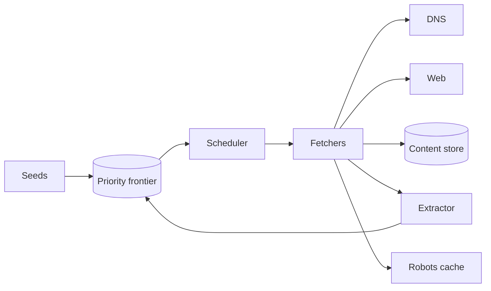

# Design a web crawler

Politely discover and fetch URLs at scale for search indexing or archives.

## 1. Clarify

- Seed URLs? Domain allow/deny?
- Freshness / recrawl policy?
- JS rendering?
- Robots.txt / crawl delay?
- Output: store HTML or extract text?

## 2. Capacity

Billions of URLs; politeness limits often bind before NIC. Plan frontier queue size and per-host rate limits.

## 3. APIs / control

```
POST /admin/seeds
GET  /admin/stats
# workers pull from frontier
```

## 4. Data model

```
frontier(url, next_fetch_at, priority)
url_seen bloom / DB (canonical URL)
documents(url_hash, content_ref, fetched_at, status)
host_state(host, next_slot, crawl_delay)
```

## 5. High-level design



## 6. Deep dive — politeness & frontier

Scheduler ensures per-host concurrency=1 (or small N) and respects crawl-delay. Canonicalize URLs (scheme/host/trailing slash). Bloom filter + exact store for seen URLs (false positives miss pages; false negatives waste fetch—tune).

**Priority:** prefer high PageRank seeds, sitemaps, change-frequency heuristics.

**DNS & IP:** cache DNS; optional crawl by IP with Host header; avoid hammering shared hosters.

## 7. Failures

- Trap sites (infinite calendars): URL normalization + depth limits + per-host budgets.
- Fetcher crash: lease URLs with timeout; requeue.
- Legal/robots: hard fail closed if robots disallows.

## 8. Interview tips

- Politeness is the ethical and practical core.
- Separate frontier, fetcher, storage.
- Mention canonicalization to avoid dupes.

## Canonicalization rules (examples)

- Lowercase host
- Strip `#fragment`
- Sort query params; drop tracking params (`utm_*`)
- Default ports omitted
- Trailing slash policy per host

Inconsistent canonicalization wastes crawl budget.

## Freshness

Recrawl score = f(change history, importance, last_modified headers). Prefer `If-Modified-Since` / ETag to save bandwidth.

## Rendering

Headless browsers are 10–100× costlier—use only for allowlisted JS-heavy domains. Default: raw fetch + parse links.

## Storage

Content-addressed raw bytes + metadata index; compress; respect retention policies.

## Evolution

Distributed crawl workers by host hash; feedback from indexer on dead links; sitemaps as first-class seeds.


## Interviewer Q&A (drill these aloud)

**Q: What is the consistency model for the core read?**  
A: State it explicitly (e.g. “redirects may see new links within TTL seconds; creates read-your-writes via primary”).

**Q: Single point of failure?**  
A: Name primary DB / broker / region; give mitigation (replicas, multi-AZ, queue buffer).

**Q: How do you prevent duplicate side effects on retry?**  
A: Idempotency keys / upserts / dedupe table—tie to this design’s writes.

**Q: What metric pages you at 3am?**  
A: Pick SLIs: error rate, p99, lag, saturation—not CPU alone.

**Q: How does this evolve to 10× data?**  
A: Partition key, storage tiering, or CQRS—one concrete next step.

## Implementation sketch (pseudocode mindset)

Walk one write handler: validate → authorize → mutate store → enqueue side effects → return. Mention timeouts on dependency calls. This bridges design and coding rounds.

## Load & chaos test plan (talk track)

1. Happy-path load at 2× peak estimate  
2. Dependency latency injection (+500 ms)  
3. Kill one AZ of the data store  
4. Replay poison message  
State what user experience should be in each case.
